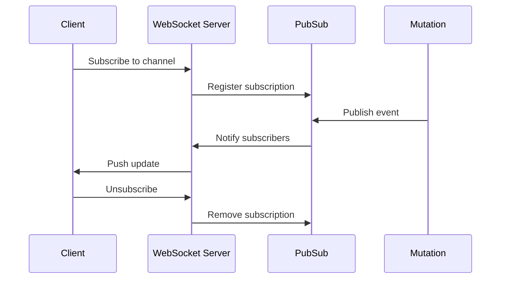
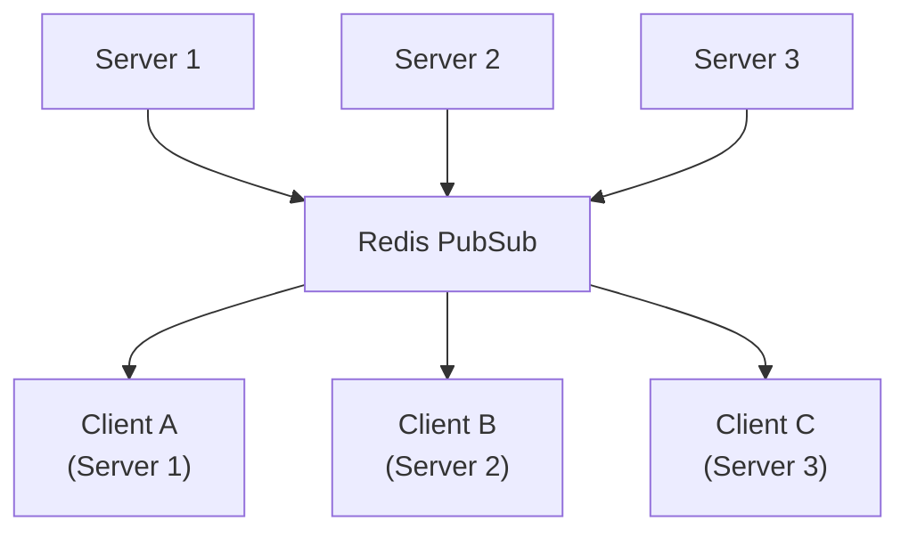
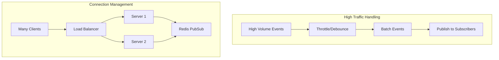

# How to Handle Real-Time Updates with GraphQL

Author: [nawazdhandala](https://www.github.com/nawazdhandala)

Tags: GraphQL, Subscriptions, Real-Time, WebSockets, PubSub, API Development, Node.js, React

Description: Learn how to implement real-time updates in GraphQL using subscriptions, including WebSocket setup, PubSub patterns, and handling connection lifecycle.

---

> Real-time functionality is essential for modern applications. GraphQL subscriptions provide a standardized way to push updates from server to client. This guide covers implementation patterns from basic setup to production-ready systems.

Subscriptions enable bidirectional communication between client and server, perfect for chat applications, live notifications, and collaborative features.

---

## Overview



---

## Basic Subscription Setup

### Schema Definition

```graphql
# schema.graphql
type Subscription {
  # Subscribe to new messages in a chat room
  messageAdded(roomId: ID!): Message!

  # Subscribe to user presence changes
  userPresenceChanged: UserPresence!

  # Subscribe to notifications for current user
  notificationReceived: Notification!
}

type Message {
  id: ID!
  content: String!
  author: User!
  createdAt: DateTime!
  roomId: ID!
}

type UserPresence {
  userId: ID!
  status: PresenceStatus!
  lastSeen: DateTime
}

enum PresenceStatus {
  ONLINE
  AWAY
  OFFLINE
}

type Notification {
  id: ID!
  type: NotificationType!
  title: String!
  body: String!
  data: JSON
}
```

### Server Setup with Apollo Server

```javascript
// server.js
const { ApolloServer } = require('apollo-server-express');
const { createServer } = require('http');
const { execute, subscribe } = require('graphql');
const { SubscriptionServer } = require('subscriptions-transport-ws');
const { makeExecutableSchema } = require('@graphql-tools/schema');
const express = require('express');
const { PubSub } = require('graphql-subscriptions');

// Create PubSub instance for event handling
const pubsub = new PubSub();

// Create executable schema
const schema = makeExecutableSchema({ typeDefs, resolvers });

// Create Express app and HTTP server
const app = express();
const httpServer = createServer(app);

// Create Apollo Server
const server = new ApolloServer({
  schema,
  context: ({ req }) => ({
    user: req.user,
    pubsub
  }),
  plugins: [
    {
      // Proper shutdown of subscription server
      async serverWillStart() {
        return {
          async drainServer() {
            subscriptionServer.close();
          }
        };
      }
    }
  ]
});

// Create WebSocket subscription server
const subscriptionServer = SubscriptionServer.create(
  {
    schema,
    execute,
    subscribe,
    // Handle connection authentication
    onConnect: async (connectionParams, webSocket) => {
      console.log('Client connected');

      // Authenticate WebSocket connection
      const token = connectionParams.authToken;
      if (token) {
        try {
          const user = await verifyToken(token);
          return { user, pubsub };
        } catch (err) {
          throw new Error('Invalid auth token');
        }
      }

      throw new Error('Missing auth token');
    },
    onDisconnect: (webSocket, context) => {
      console.log('Client disconnected');
    }
  },
  {
    server: httpServer,
    path: '/graphql'
  }
);

// Start server
async function startServer() {
  await server.start();
  server.applyMiddleware({ app });

  httpServer.listen(4000, () => {
    console.log(`Server ready at http://localhost:4000${server.graphqlPath}`);
    console.log(`Subscriptions ready at ws://localhost:4000${server.graphqlPath}`);
  });
}

startServer();
```

---

## Subscription Resolvers

### Basic Subscription Resolver

```javascript
// resolvers.js
const { withFilter } = require('graphql-subscriptions');

// Event names as constants
const EVENTS = {
  MESSAGE_ADDED: 'MESSAGE_ADDED',
  USER_PRESENCE_CHANGED: 'USER_PRESENCE_CHANGED',
  NOTIFICATION_RECEIVED: 'NOTIFICATION_RECEIVED'
};

const resolvers = {
  Subscription: {
    // Simple subscription - receives all events
    userPresenceChanged: {
      subscribe: (_, __, { pubsub }) => {
        return pubsub.asyncIterator([EVENTS.USER_PRESENCE_CHANGED]);
      }
    },

    // Filtered subscription - only receives relevant events
    messageAdded: {
      subscribe: withFilter(
        // Iterator function - creates the subscription
        (_, __, { pubsub }) => pubsub.asyncIterator([EVENTS.MESSAGE_ADDED]),

        // Filter function - determines if event should be sent to subscriber
        (payload, variables) => {
          // Only send message if it is for the subscribed room
          return payload.messageAdded.roomId === variables.roomId;
        }
      )
    },

    // User-specific subscription
    notificationReceived: {
      subscribe: withFilter(
        (_, __, { pubsub }) => pubsub.asyncIterator([EVENTS.NOTIFICATION_RECEIVED]),

        // Only send notifications to the intended user
        (payload, variables, context) => {
          return payload.notificationReceived.userId === context.user.id;
        }
      )
    }
  },

  Mutation: {
    // Mutation that triggers subscription
    sendMessage: async (_, { roomId, content }, { user, pubsub, db }) => {
      // Create message in database
      const message = await db.messages.create({
        data: {
          content,
          authorId: user.id,
          roomId
        },
        include: { author: true }
      });

      // Publish event to subscribers
      pubsub.publish(EVENTS.MESSAGE_ADDED, {
        messageAdded: message
      });

      return message;
    },

    // Update user presence and notify subscribers
    updatePresence: async (_, { status }, { user, pubsub, db }) => {
      const presence = await db.userPresence.upsert({
        where: { userId: user.id },
        update: { status, lastSeen: new Date() },
        create: { userId: user.id, status, lastSeen: new Date() }
      });

      pubsub.publish(EVENTS.USER_PRESENCE_CHANGED, {
        userPresenceChanged: presence
      });

      return presence;
    }
  }
};
```

---

## Production PubSub with Redis

For production, use Redis PubSub to support multiple server instances.



### Redis PubSub Setup

```javascript
// pubsub.js
const { RedisPubSub } = require('graphql-redis-subscriptions');
const Redis = require('ioredis');

// Create Redis clients for pub/sub
// Redis requires separate connections for publishing and subscribing
const options = {
  host: process.env.REDIS_HOST || 'localhost',
  port: process.env.REDIS_PORT || 6379,
  password: process.env.REDIS_PASSWORD,
  retryStrategy: (times) => {
    // Reconnect after increasing delay
    return Math.min(times * 50, 2000);
  }
};

const pubsub = new RedisPubSub({
  publisher: new Redis(options),
  subscriber: new Redis(options),
  // Optional: customize serialization
  serializer: JSON.stringify,
  deserializer: JSON.parse
});

module.exports = { pubsub, EVENTS };
```

### Using Redis PubSub

```javascript
// resolvers.js
const { pubsub, EVENTS } = require('./pubsub');

const resolvers = {
  Subscription: {
    messageAdded: {
      subscribe: withFilter(
        () => pubsub.asyncIterator([EVENTS.MESSAGE_ADDED]),
        (payload, variables) => payload.messageAdded.roomId === variables.roomId
      )
    }
  },

  Mutation: {
    sendMessage: async (_, { roomId, content }, { user, db }) => {
      const message = await db.messages.create({
        data: { content, authorId: user.id, roomId },
        include: { author: true }
      });

      // Publish to Redis - all server instances receive this
      await pubsub.publish(EVENTS.MESSAGE_ADDED, {
        messageAdded: message
      });

      return message;
    }
  }
};
```

---

## Client-Side Subscription

### React with Apollo Client

```javascript
// apolloClient.js
import { ApolloClient, InMemoryCache, split, HttpLink } from '@apollo/client';
import { GraphQLWsLink } from '@apollo/client/link/subscriptions';
import { createClient } from 'graphql-ws';
import { getMainDefinition } from '@apollo/client/utilities';

// HTTP link for queries and mutations
const httpLink = new HttpLink({
  uri: 'http://localhost:4000/graphql',
  headers: {
    authorization: `Bearer ${getAuthToken()}`
  }
});

// WebSocket link for subscriptions
const wsLink = new GraphQLWsLink(
  createClient({
    url: 'ws://localhost:4000/graphql',
    connectionParams: {
      authToken: getAuthToken()
    },
    // Reconnect on connection loss
    shouldRetry: () => true,
    retryAttempts: Infinity,
    // Handle connection events
    on: {
      connected: () => console.log('WebSocket connected'),
      closed: () => console.log('WebSocket closed'),
      error: (error) => console.error('WebSocket error:', error)
    }
  })
);

// Split traffic between HTTP and WebSocket
const splitLink = split(
  ({ query }) => {
    const definition = getMainDefinition(query);
    return (
      definition.kind === 'OperationDefinition' &&
      definition.operation === 'subscription'
    );
  },
  wsLink,  // Use WebSocket for subscriptions
  httpLink // Use HTTP for queries and mutations
);

const client = new ApolloClient({
  link: splitLink,
  cache: new InMemoryCache()
});

export default client;
```

### React Subscription Hook

```javascript
// ChatRoom.jsx
import { useSubscription, useMutation, useQuery, gql } from '@apollo/client';
import { useState, useEffect } from 'react';

const MESSAGES_QUERY = gql`
  query GetMessages($roomId: ID!) {
    messages(roomId: $roomId) {
      id
      content
      author {
        id
        name
        avatar
      }
      createdAt
    }
  }
`;

const MESSAGE_SUBSCRIPTION = gql`
  subscription OnMessageAdded($roomId: ID!) {
    messageAdded(roomId: $roomId) {
      id
      content
      author {
        id
        name
        avatar
      }
      createdAt
    }
  }
`;

const SEND_MESSAGE = gql`
  mutation SendMessage($roomId: ID!, $content: String!) {
    sendMessage(roomId: $roomId, content: $content) {
      id
    }
  }
`;

function ChatRoom({ roomId }) {
  const [messages, setMessages] = useState([]);
  const [newMessage, setNewMessage] = useState('');

  // Fetch initial messages
  const { data, loading } = useQuery(MESSAGES_QUERY, {
    variables: { roomId },
    onCompleted: (data) => {
      setMessages(data.messages);
    }
  });

  // Subscribe to new messages
  const { data: subscriptionData } = useSubscription(MESSAGE_SUBSCRIPTION, {
    variables: { roomId },
    onSubscriptionData: ({ subscriptionData }) => {
      const newMsg = subscriptionData.data.messageAdded;

      // Add new message to the list
      setMessages((prev) => {
        // Prevent duplicates
        if (prev.some(m => m.id === newMsg.id)) {
          return prev;
        }
        return [...prev, newMsg];
      });
    }
  });

  // Send message mutation
  const [sendMessage] = useMutation(SEND_MESSAGE);

  const handleSend = async () => {
    if (!newMessage.trim()) return;

    await sendMessage({
      variables: { roomId, content: newMessage }
    });

    setNewMessage('');
  };

  if (loading) return <div>Loading messages...</div>;

  return (
    <div className="chat-room">
      <div className="messages">
        {messages.map((message) => (
          <div key={message.id} className="message">
            
            <div>
              <strong>{message.author.name}</strong>
              <p>{message.content}</p>
              <time>{new Date(message.createdAt).toLocaleTimeString()}</time>
            </div>
          </div>
        ))}
      </div>

      <div className="input-area">
        <input
          value={newMessage}
          onChange={(e) => setNewMessage(e.target.value)}
          onKeyPress={(e) => e.key === 'Enter' && handleSend()}
          placeholder="Type a message..."
        />
        <button onClick={handleSend}>Send</button>
      </div>
    </div>
  );
}
```

---

## Advanced Patterns

### Subscription with Cache Updates

```javascript
// Using subscribeToMore for automatic cache updates
import { useQuery, gql } from '@apollo/client';

const NOTIFICATIONS_QUERY = gql`
  query GetNotifications {
    notifications {
      id
      type
      title
      body
      read
      createdAt
    }
  }
`;

const NOTIFICATION_SUBSCRIPTION = gql`
  subscription OnNotificationReceived {
    notificationReceived {
      id
      type
      title
      body
      read
      createdAt
    }
  }
`;

function NotificationList() {
  const { data, loading, subscribeToMore } = useQuery(NOTIFICATIONS_QUERY);

  useEffect(() => {
    // Subscribe and automatically update cache
    const unsubscribe = subscribeToMore({
      document: NOTIFICATION_SUBSCRIPTION,
      updateQuery: (prev, { subscriptionData }) => {
        if (!subscriptionData.data) return prev;

        const newNotification = subscriptionData.data.notificationReceived;

        // Return updated query result
        return {
          ...prev,
          notifications: [newNotification, ...prev.notifications]
        };
      }
    });

    // Cleanup on unmount
    return () => unsubscribe();
  }, [subscribeToMore]);

  if (loading) return <div>Loading...</div>;

  return (
    <ul>
      {data.notifications.map((notification) => (
        <li key={notification.id}>
          <strong>{notification.title}</strong>
          <p>{notification.body}</p>
        </li>
      ))}
    </ul>
  );
}
```

### Presence System

```javascript
// presence.js - Server-side presence tracking
const { pubsub, EVENTS } = require('./pubsub');

// Track online users
const onlineUsers = new Map();

async function handleUserConnect(userId, context) {
  // Add user to online list
  onlineUsers.set(userId, {
    connectedAt: new Date(),
    lastActivity: new Date()
  });

  // Publish presence change
  await pubsub.publish(EVENTS.USER_PRESENCE_CHANGED, {
    userPresenceChanged: {
      userId,
      status: 'ONLINE',
      lastSeen: new Date()
    }
  });

  console.log(`User ${userId} connected. Online users: ${onlineUsers.size}`);
}

async function handleUserDisconnect(userId) {
  // Remove user from online list
  onlineUsers.delete(userId);

  // Publish presence change
  await pubsub.publish(EVENTS.USER_PRESENCE_CHANGED, {
    userPresenceChanged: {
      userId,
      status: 'OFFLINE',
      lastSeen: new Date()
    }
  });

  console.log(`User ${userId} disconnected. Online users: ${onlineUsers.size}`);
}

// Heartbeat to detect stale connections
setInterval(() => {
  const now = new Date();
  const staleThreshold = 60000; // 1 minute

  for (const [userId, data] of onlineUsers.entries()) {
    if (now - data.lastActivity > staleThreshold) {
      handleUserDisconnect(userId);
    }
  }
}, 30000);

module.exports = {
  handleUserConnect,
  handleUserDisconnect,
  onlineUsers
};
```

### Subscription with Batching

```javascript
// Batch multiple events into single updates
const { pubsub, EVENTS } = require('./pubsub');

class BatchedPublisher {
  constructor(eventName, batchInterval = 100) {
    this.eventName = eventName;
    this.batchInterval = batchInterval;
    this.queue = [];
    this.timer = null;
  }

  // Add event to batch queue
  add(payload) {
    this.queue.push(payload);

    if (!this.timer) {
      this.timer = setTimeout(() => this.flush(), this.batchInterval);
    }
  }

  // Publish all queued events
  async flush() {
    if (this.queue.length === 0) return;

    const batch = this.queue;
    this.queue = [];
    this.timer = null;

    // Publish batched payload
    await pubsub.publish(this.eventName, {
      [this.eventName]: batch
    });
  }
}

// Usage
const activityPublisher = new BatchedPublisher('activityBatch', 500);

// Instead of publishing immediately
async function trackActivity(activity) {
  activityPublisher.add(activity);
}
```

---

## Subscription Authentication

### Token-Based Auth for WebSockets

```javascript
// subscriptionServer.js
const { SubscriptionServer } = require('subscriptions-transport-ws');
const jwt = require('jsonwebtoken');

const subscriptionServer = SubscriptionServer.create({
  schema,
  execute,
  subscribe,

  onConnect: async (connectionParams, webSocket, context) => {
    // Extract token from connection params
    const token = connectionParams.authToken || connectionParams.Authorization;

    if (!token) {
      throw new Error('Authentication required');
    }

    try {
      // Verify JWT token
      const decoded = jwt.verify(token, process.env.JWT_SECRET);

      // Load user from database
      const user = await db.users.findUnique({
        where: { id: decoded.userId }
      });

      if (!user) {
        throw new Error('User not found');
      }

      // Check if user is allowed to connect
      if (user.banned) {
        throw new Error('User is banned');
      }

      console.log(`User ${user.id} connected via WebSocket`);

      // Return context that will be available in subscription resolvers
      return {
        user,
        pubsub,
        db
      };

    } catch (error) {
      console.error('WebSocket auth failed:', error.message);
      throw new Error('Invalid authentication token');
    }
  },

  onDisconnect: async (webSocket, context) => {
    // Get context from connection
    const ctx = await context.initPromise;

    if (ctx?.user) {
      console.log(`User ${ctx.user.id} disconnected`);

      // Update presence
      await handleUserDisconnect(ctx.user.id);
    }
  }
});
```

### Permission-Based Subscriptions

```javascript
// resolvers.js
const resolvers = {
  Subscription: {
    // Check permissions before subscribing
    privateChannelMessages: {
      subscribe: async function* (_, { channelId }, { user, pubsub, db }) {
        // Check if user has access to this channel
        const membership = await db.channelMembers.findFirst({
          where: {
            channelId,
            userId: user.id
          }
        });

        if (!membership) {
          throw new ForbiddenError('You do not have access to this channel');
        }

        // Create filtered subscription
        const iterator = pubsub.asyncIterator([EVENTS.CHANNEL_MESSAGE]);

        // Filter and yield only relevant messages
        for await (const event of iterator) {
          if (event.channelMessage.channelId === channelId) {
            yield event;
          }
        }
      }
    },

    // Admin-only subscription
    systemMetrics: {
      subscribe: (_, __, { user, pubsub }) => {
        if (user.role !== 'ADMIN') {
          throw new ForbiddenError('Admin access required');
        }

        return pubsub.asyncIterator([EVENTS.SYSTEM_METRICS]);
      }
    }
  }
};
```

---

## Error Handling

### Subscription Error Handling

```javascript
// Error handling in subscription server
const subscriptionServer = SubscriptionServer.create({
  schema,
  execute,
  subscribe,

  onConnect: async (connectionParams) => {
    try {
      return await authenticate(connectionParams);
    } catch (error) {
      // Log and rethrow with user-friendly message
      console.error('Connection error:', error);
      throw new Error('Connection failed. Please try again.');
    }
  },

  // Format errors before sending to client
  onOperation: (message, params, webSocket) => {
    return {
      ...params,
      formatError: (error) => {
        console.error('Subscription error:', error);

        // Hide internal errors in production
        if (process.env.NODE_ENV === 'production') {
          return new Error('An error occurred');
        }

        return error;
      }
    };
  }
});
```

### Client-Side Error Handling

```javascript
// React component with error handling
function ChatSubscription({ roomId }) {
  const { data, loading, error } = useSubscription(MESSAGE_SUBSCRIPTION, {
    variables: { roomId },
    onError: (error) => {
      console.error('Subscription error:', error);

      // Handle specific errors
      if (error.message.includes('not authorized')) {
        // Redirect to login
        window.location.href = '/login';
      }
    },
    // Reconnect on error
    shouldResubscribe: true
  });

  if (error) {
    return (
      <div className="error">
        <p>Connection lost. Reconnecting...</p>
        <button onClick={() => window.location.reload()}>
          Retry
        </button>
      </div>
    );
  }

  // ... render messages
}
```

---

## Performance Considerations



### Throttling High-Frequency Updates

```javascript
// Throttle frequent updates
const throttle = require('lodash/throttle');

// Throttle typing indicators to once per second
const publishTyping = throttle(async (roomId, userId) => {
  await pubsub.publish(EVENTS.USER_TYPING, {
    userTyping: { roomId, userId, timestamp: new Date() }
  });
}, 1000);

// Usage in resolver
const resolvers = {
  Mutation: {
    setTyping: async (_, { roomId }, { user }) => {
      publishTyping(roomId, user.id);
      return true;
    }
  }
};
```

---

## Best Practices

1. **Use Redis PubSub** for multi-server deployments
2. **Authenticate WebSocket connections** before allowing subscriptions
3. **Filter events server-side** to reduce client load
4. **Implement heartbeats** to detect stale connections
5. **Throttle high-frequency events** to prevent overload
6. **Handle reconnection gracefully** on the client
7. **Clean up subscriptions** when components unmount
8. **Monitor subscription metrics** for performance issues

---

## Conclusion

Real-time updates with GraphQL subscriptions provide a powerful way to push data to clients. By properly configuring WebSocket connections, implementing Redis PubSub for scalability, and handling authentication and errors, you can build robust real-time features.

Key takeaways:

- Use subscriptions for server-pushed updates
- Implement Redis PubSub for production
- Filter events to reduce unnecessary traffic
- Handle authentication at the WebSocket level
- Monitor and throttle high-frequency events

---

*Need to monitor your GraphQL subscriptions? [OneUptime](https://oneuptime.com) provides comprehensive monitoring for WebSocket connections with latency tracking and error alerting.*
