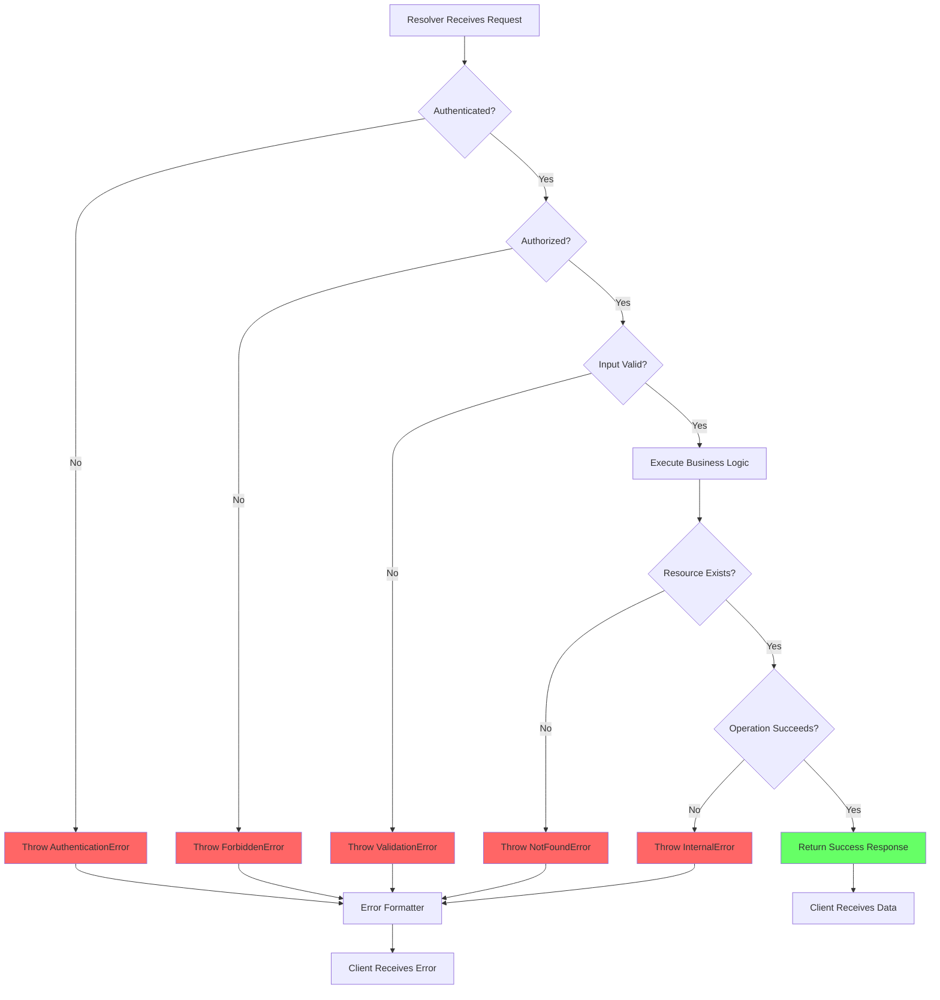
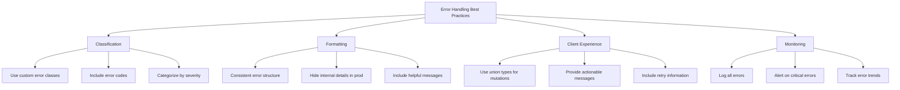

# How to Handle Error Handling in GraphQL Resolvers

Author: [nawazdhandala](https://github.com/nawazdhandala)

Tags: GraphQL, Error Handling, Resolvers, API Development, Node.js, Apollo Server, Best Practices

Description: Learn comprehensive strategies for handling errors in GraphQL resolvers including custom error types, error formatting, and client-friendly responses.

---

Error handling in GraphQL differs significantly from REST APIs. While REST uses HTTP status codes to indicate errors, GraphQL always returns HTTP 200 and includes errors in the response body. This guide covers comprehensive strategies for handling errors in GraphQL resolvers, from basic error throwing to sophisticated error classification systems.

## Understanding GraphQL Error Responses

GraphQL responses can contain both data and errors simultaneously, allowing partial success scenarios.

```mermaid
graph TD
    A[GraphQL Response] --> B{Contains Errors?}
    B -->|No| C[data: {...}]
    B -->|Yes| D{Contains Data?}
    D -->|Yes| E[Partial Success]
    D -->|No| F[Complete Failure]

    E --> G["data: {...}, errors: [...]"]
    F --> H["data: null, errors: [...]"]

    style E fill:#ff9,stroke:#333
    style F fill:#f66,stroke:#333
    style C fill:#6f6,stroke:#333
```

## Basic Error Handling

### Throwing Errors in Resolvers

The simplest form of error handling is throwing errors directly.

```javascript
// resolvers/user.js
const resolvers = {
  Query: {
    user: async (_, { id }, context) => {
      const user = await context.db.users.findById(id);

      // Basic error throwing
      if (!user) {
        throw new Error("User not found");
      }

      return user;
    },

    users: async (_, { filter }, context) => {
      // Validate input
      if (filter && filter.age && filter.age < 0) {
        throw new Error("Age filter cannot be negative");
      }

      return context.db.users.find(filter);
    }
  },

  Mutation: {
    createUser: async (_, { input }, context) => {
      // Validate required fields
      if (!input.email) {
        throw new Error("Email is required");
      }

      if (!input.email.includes("@")) {
        throw new Error("Invalid email format");
      }

      // Check for duplicate
      const existing = await context.db.users.findByEmail(input.email);
      if (existing) {
        throw new Error("A user with this email already exists");
      }

      return context.db.users.create(input);
    }
  }
};
```

## Custom Error Classes

Create custom error classes for better error categorization and handling.

```javascript
// errors/index.js
// Base class for all custom GraphQL errors
class GraphQLError extends Error {
  constructor(message, code, statusCode = 200) {
    super(message);
    this.name = this.constructor.name;
    this.code = code;
    this.statusCode = statusCode;
    Error.captureStackTrace(this, this.constructor);
  }
}

// Authentication errors
class AuthenticationError extends GraphQLError {
  constructor(message = "You must be logged in to perform this action") {
    super(message, "UNAUTHENTICATED", 401);
  }
}

// Authorization errors
class ForbiddenError extends GraphQLError {
  constructor(message = "You do not have permission to perform this action") {
    super(message, "FORBIDDEN", 403);
  }
}

// Resource not found errors
class NotFoundError extends GraphQLError {
  constructor(resource = "Resource", id = null) {
    const message = id
      ? `${resource} with ID ${id} not found`
      : `${resource} not found`;
    super(message, "NOT_FOUND", 404);
    this.resource = resource;
    this.resourceId = id;
  }
}

// Validation errors
class ValidationError extends GraphQLError {
  constructor(message, field = null, validationErrors = []) {
    super(message, "VALIDATION_ERROR", 400);
    this.field = field;
    this.validationErrors = validationErrors;
  }
}

// Rate limiting errors
class RateLimitError extends GraphQLError {
  constructor(retryAfter = 60) {
    super(
      `Rate limit exceeded. Please retry after ${retryAfter} seconds`,
      "RATE_LIMITED",
      429
    );
    this.retryAfter = retryAfter;
  }
}

// Conflict errors (e.g., duplicate resources)
class ConflictError extends GraphQLError {
  constructor(message = "Resource already exists") {
    super(message, "CONFLICT", 409);
  }
}

// Internal server errors
class InternalError extends GraphQLError {
  constructor(message = "An unexpected error occurred") {
    super(message, "INTERNAL_ERROR", 500);
    // Log the actual error but do not expose details to client
    this.isInternal = true;
  }
}

module.exports = {
  GraphQLError,
  AuthenticationError,
  ForbiddenError,
  NotFoundError,
  ValidationError,
  RateLimitError,
  ConflictError,
  InternalError
};
```

## Using Custom Errors in Resolvers

```javascript
// resolvers/user.js
const {
  AuthenticationError,
  ForbiddenError,
  NotFoundError,
  ValidationError,
  ConflictError
} = require("../errors");

const resolvers = {
  Query: {
    me: async (_, args, context) => {
      // Check authentication
      if (!context.user) {
        throw new AuthenticationError();
      }

      return context.user;
    },

    user: async (_, { id }, context) => {
      // Check authentication
      if (!context.user) {
        throw new AuthenticationError();
      }

      const user = await context.db.users.findById(id);

      if (!user) {
        throw new NotFoundError("User", id);
      }

      // Check if user can view this profile
      if (user.isPrivate && user.id !== context.user.id) {
        throw new ForbiddenError("This profile is private");
      }

      return user;
    },

    adminUsers: async (_, args, context) => {
      if (!context.user) {
        throw new AuthenticationError();
      }

      if (context.user.role !== "admin") {
        throw new ForbiddenError("Admin access required");
      }

      return context.db.users.findAll();
    }
  },

  Mutation: {
    createUser: async (_, { input }, context) => {
      // Validate input
      const errors = [];

      if (!input.email) {
        errors.push({ field: "email", message: "Email is required" });
      } else if (!isValidEmail(input.email)) {
        errors.push({ field: "email", message: "Invalid email format" });
      }

      if (!input.password) {
        errors.push({ field: "password", message: "Password is required" });
      } else if (input.password.length < 8) {
        errors.push({
          field: "password",
          message: "Password must be at least 8 characters"
        });
      }

      if (errors.length > 0) {
        throw new ValidationError(
          "Validation failed",
          null,
          errors
        );
      }

      // Check for duplicate
      const existing = await context.db.users.findByEmail(input.email);
      if (existing) {
        throw new ConflictError("A user with this email already exists");
      }

      return context.db.users.create(input);
    },

    updateUser: async (_, { id, input }, context) => {
      if (!context.user) {
        throw new AuthenticationError();
      }

      const user = await context.db.users.findById(id);

      if (!user) {
        throw new NotFoundError("User", id);
      }

      // Users can only update their own profile
      if (user.id !== context.user.id && context.user.role !== "admin") {
        throw new ForbiddenError("You can only update your own profile");
      }

      return context.db.users.update(id, input);
    }
  }
};

function isValidEmail(email) {
  return /^[^\s@]+@[^\s@]+\.[^\s@]+$/.test(email);
}

module.exports = resolvers;
```

## Error Formatting

Configure Apollo Server to format errors consistently.

```javascript
// server.js
const { ApolloServer } = require("@apollo/server");
const { GraphQLError } = require("./errors");

const server = new ApolloServer({
  typeDefs,
  resolvers,

  formatError: (formattedError, error) => {
    // Log all errors for monitoring
    console.error("GraphQL Error:", {
      message: formattedError.message,
      path: formattedError.path,
      code: formattedError.extensions?.code,
      stack: error.stack
    });

    // Get the original error
    const originalError = error.originalError || error;

    // Handle custom errors
    if (originalError instanceof GraphQLError) {
      return {
        message: formattedError.message,
        path: formattedError.path,
        extensions: {
          code: originalError.code,
          // Include additional error details
          ...(originalError.field && { field: originalError.field }),
          ...(originalError.validationErrors && {
            validationErrors: originalError.validationErrors
          }),
          ...(originalError.retryAfter && {
            retryAfter: originalError.retryAfter
          }),
          ...(originalError.resource && { resource: originalError.resource }),
          ...(originalError.resourceId && {
            resourceId: originalError.resourceId
          })
        }
      };
    }

    // Handle GraphQL validation errors
    if (formattedError.extensions?.code === "GRAPHQL_VALIDATION_FAILED") {
      return {
        message: formattedError.message,
        path: formattedError.path,
        extensions: {
          code: "VALIDATION_ERROR"
        }
      };
    }

    // Handle unknown errors in production
    if (process.env.NODE_ENV === "production") {
      // Do not expose internal error details
      return {
        message: "An unexpected error occurred",
        path: formattedError.path,
        extensions: {
          code: "INTERNAL_ERROR"
        }
      };
    }

    // In development, return full error details
    return {
      message: formattedError.message,
      path: formattedError.path,
      locations: formattedError.locations,
      extensions: {
        code: formattedError.extensions?.code || "INTERNAL_ERROR",
        stacktrace: formattedError.extensions?.stacktrace
      }
    };
  }
});
```

## Error Response Schema

Define error types in your GraphQL schema for type-safe error handling.

```graphql
# schema.graphql
# Error interface for all error types
interface Error {
  message: String!
  code: String!
}

# Specific error types
type ValidationError implements Error {
  message: String!
  code: String!
  field: String
  validationErrors: [FieldError!]
}

type FieldError {
  field: String!
  message: String!
}

type AuthenticationError implements Error {
  message: String!
  code: String!
}

type NotFoundError implements Error {
  message: String!
  code: String!
  resource: String!
  resourceId: ID
}

# Union types for mutation responses
union CreateUserResult = User | ValidationError | ConflictError

type ConflictError implements Error {
  message: String!
  code: String!
  existingResourceId: ID
}

type Mutation {
  # Return union type to handle success and error cases
  createUser(input: CreateUserInput!): CreateUserResult!

  # Alternative: use result wrapper type
  updateUser(id: ID!, input: UpdateUserInput!): UpdateUserPayload!
}

type UpdateUserPayload {
  success: Boolean!
  user: User
  errors: [Error!]
}

input CreateUserInput {
  email: String!
  password: String!
  name: String!
}

input UpdateUserInput {
  name: String
  bio: String
}
```

## Result Pattern Implementation

Implement the result pattern for predictable error handling.

```javascript
// resolvers/mutations.js
const resolvers = {
  Mutation: {
    createUser: async (_, { input }, context) => {
      // Validate input
      const validationErrors = validateUserInput(input);

      if (validationErrors.length > 0) {
        // Return ValidationError type
        return {
          __typename: "ValidationError",
          message: "Validation failed",
          code: "VALIDATION_ERROR",
          field: null,
          validationErrors
        };
      }

      // Check for duplicate
      const existing = await context.db.users.findByEmail(input.email);
      if (existing) {
        // Return ConflictError type
        return {
          __typename: "ConflictError",
          message: "A user with this email already exists",
          code: "CONFLICT",
          existingResourceId: existing.id
        };
      }

      // Create user and return User type
      const user = await context.db.users.create(input);
      return {
        __typename: "User",
        ...user
      };
    },

    updateUser: async (_, { id, input }, context) => {
      const errors = [];

      // Check authentication
      if (!context.user) {
        errors.push({
          __typename: "AuthenticationError",
          message: "You must be logged in",
          code: "UNAUTHENTICATED"
        });
        return { success: false, user: null, errors };
      }

      // Find user
      const user = await context.db.users.findById(id);
      if (!user) {
        errors.push({
          __typename: "NotFoundError",
          message: "User not found",
          code: "NOT_FOUND",
          resource: "User",
          resourceId: id
        });
        return { success: false, user: null, errors };
      }

      // Check authorization
      if (user.id !== context.user.id) {
        errors.push({
          __typename: "ForbiddenError",
          message: "You can only update your own profile",
          code: "FORBIDDEN"
        });
        return { success: false, user: null, errors };
      }

      // Update user
      const updatedUser = await context.db.users.update(id, input);
      return { success: true, user: updatedUser, errors: [] };
    }
  },

  // Type resolver for union types
  CreateUserResult: {
    __resolveType(obj) {
      if (obj.__typename) {
        return obj.__typename;
      }
      if (obj.validationErrors) {
        return "ValidationError";
      }
      if (obj.existingResourceId !== undefined) {
        return "ConflictError";
      }
      return "User";
    }
  },

  // Type resolver for interface
  Error: {
    __resolveType(obj) {
      return obj.__typename;
    }
  }
};

function validateUserInput(input) {
  const errors = [];

  if (!input.email) {
    errors.push({ field: "email", message: "Email is required" });
  } else if (!isValidEmail(input.email)) {
    errors.push({ field: "email", message: "Invalid email format" });
  }

  if (!input.password) {
    errors.push({ field: "password", message: "Password is required" });
  } else if (input.password.length < 8) {
    errors.push({
      field: "password",
      message: "Password must be at least 8 characters"
    });
  }

  if (!input.name || input.name.trim().length === 0) {
    errors.push({ field: "name", message: "Name is required" });
  }

  return errors;
}
```

## Error Handling Flow



## Async Error Handling

Handle errors in asynchronous operations properly.

```javascript
// utils/async-handler.js
// Wrapper for async resolvers to catch unhandled rejections
function asyncHandler(resolver) {
  return async (parent, args, context, info) => {
    try {
      return await resolver(parent, args, context, info);
    } catch (error) {
      // Log the error
      console.error("Resolver error:", {
        resolver: info.fieldName,
        error: error.message,
        stack: error.stack
      });

      // Re-throw custom errors
      if (error instanceof GraphQLError) {
        throw error;
      }

      // Wrap unknown errors
      throw new InternalError("An unexpected error occurred");
    }
  };
}

// Apply to all resolvers
function wrapResolvers(resolvers) {
  const wrapped = {};

  for (const [typeName, typeResolvers] of Object.entries(resolvers)) {
    wrapped[typeName] = {};

    for (const [fieldName, resolver] of Object.entries(typeResolvers)) {
      if (typeof resolver === "function") {
        wrapped[typeName][fieldName] = asyncHandler(resolver);
      } else {
        wrapped[typeName][fieldName] = resolver;
      }
    }
  }

  return wrapped;
}

module.exports = { asyncHandler, wrapResolvers };
```

```javascript
// server.js
const { wrapResolvers } = require("./utils/async-handler");
const rawResolvers = require("./resolvers");

const server = new ApolloServer({
  typeDefs,
  resolvers: wrapResolvers(rawResolvers)
});
```

## Error Monitoring and Logging

Implement comprehensive error logging for production monitoring.

```javascript
// plugins/error-logging.js
const errorLoggingPlugin = {
  async requestDidStart() {
    return {
      async didEncounterErrors({ errors, request, context }) {
        for (const error of errors) {
          // Extract error details
          const errorDetails = {
            timestamp: new Date().toISOString(),
            message: error.message,
            code: error.extensions?.code,
            path: error.path?.join("."),
            operation: request.operationName,
            variables: sanitizeVariables(request.variables),
            userId: context.user?.id,
            requestId: context.requestId
          };

          // Log based on error type
          if (error.extensions?.code === "INTERNAL_ERROR") {
            // Critical error - alert immediately
            console.error("CRITICAL ERROR:", errorDetails);
            await sendAlert(errorDetails);
          } else if (error.extensions?.code === "UNAUTHENTICATED") {
            // Authentication error - log for security monitoring
            console.warn("AUTH ERROR:", errorDetails);
            await logSecurityEvent(errorDetails);
          } else {
            // Standard error - log for debugging
            console.info("ERROR:", errorDetails);
          }

          // Send to error tracking service (e.g., Sentry)
          await trackError(error, errorDetails);
        }
      }
    };
  }
};

// Remove sensitive data from variables
function sanitizeVariables(variables) {
  if (!variables) return null;

  const sanitized = { ...variables };
  const sensitiveFields = ["password", "token", "secret", "creditCard"];

  for (const field of sensitiveFields) {
    if (sanitized[field]) {
      sanitized[field] = "[REDACTED]";
    }
  }

  return sanitized;
}

async function sendAlert(errorDetails) {
  // Implement alerting (Slack, PagerDuty, etc.)
  console.log("Sending alert for critical error:", errorDetails.message);
}

async function logSecurityEvent(errorDetails) {
  // Implement security event logging
  console.log("Security event logged:", errorDetails);
}

async function trackError(error, details) {
  // Implement error tracking (Sentry, etc.)
  // Sentry.captureException(error, { extra: details });
}

module.exports = { errorLoggingPlugin };
```

## Client-Side Error Handling

Design errors for easy client consumption.

```javascript
// Example client-side error handling (React with Apollo Client)
import { useQuery, useMutation } from "@apollo/client";

function UserProfile({ userId }) {
  const { data, loading, error } = useQuery(GET_USER, {
    variables: { id: userId }
  });

  if (loading) return <Loading />;

  if (error) {
    // Handle different error types
    const errorCode = error.graphQLErrors?.[0]?.extensions?.code;

    switch (errorCode) {
      case "UNAUTHENTICATED":
        return <LoginPrompt />;

      case "FORBIDDEN":
        return <AccessDenied />;

      case "NOT_FOUND":
        return <NotFound message="User not found" />;

      default:
        return <ErrorMessage message="Something went wrong" />;
    }
  }

  return <Profile user={data.user} />;
}

function CreateUserForm() {
  const [createUser, { data, loading, error }] = useMutation(CREATE_USER);

  const handleSubmit = async (formData) => {
    const result = await createUser({ variables: { input: formData } });

    // Handle union type response
    const response = result.data?.createUser;

    if (response.__typename === "User") {
      // Success!
      navigate(`/users/${response.id}`);
    } else if (response.__typename === "ValidationError") {
      // Show validation errors
      setErrors(
        response.validationErrors.reduce((acc, err) => {
          acc[err.field] = err.message;
          return acc;
        }, {})
      );
    } else if (response.__typename === "ConflictError") {
      // Handle duplicate
      setErrors({ email: response.message });
    }
  };

  return <Form onSubmit={handleSubmit} loading={loading} />;
}
```

## Best Practices Summary



### Key Takeaways

1. **Create custom error classes**: Define specific error types for different scenarios.

2. **Use error codes**: Include machine-readable error codes for client handling.

3. **Format errors consistently**: Implement a formatError function for uniform responses.

4. **Consider the result pattern**: Use union types for predictable mutation responses.

5. **Log and monitor**: Track all errors for debugging and alerting.

6. **Hide sensitive details**: Never expose stack traces or internal details in production.

7. **Design for clients**: Make errors actionable with clear messages and retry information.

## Conclusion

Effective error handling in GraphQL resolvers requires a systematic approach that considers both the developer experience and client needs. By implementing custom error classes, consistent formatting, and comprehensive logging, you can build GraphQL APIs that gracefully handle failures while providing meaningful feedback to clients.

Remember that good error handling is an ongoing process. Monitor your error logs, listen to client feedback, and continuously improve your error messages and handling strategies.
