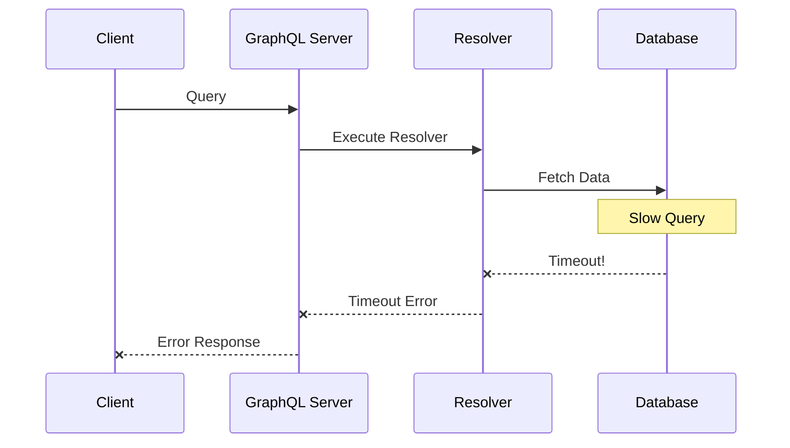
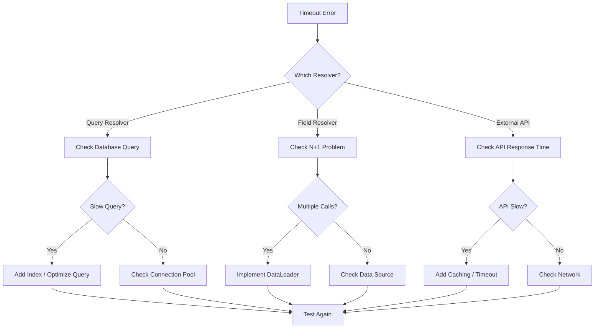

# How to Fix 'Resolver Timeout' Errors in GraphQL

Author: [nawazdhandala](https://www.github.com/nawazdhandala)

Tags: GraphQL, Timeout, Performance, Debugging, Apollo Server, Node.js, Backend

Description: Learn how to diagnose and fix resolver timeout errors in GraphQL APIs with practical solutions for slow queries and data fetching issues.

---

Resolver timeout errors occur when a GraphQL resolver takes too long to return data. These errors frustrate users and can crash your server if not handled properly. This guide covers the common causes and provides practical solutions to fix timeout issues in your GraphQL API.

## Understanding Resolver Timeouts

When a client sends a query, the GraphQL server executes resolvers to fetch the requested data. If any resolver takes longer than the configured timeout, the request fails.



## Common Causes of Resolver Timeouts

### 1. N+1 Query Problem

The most common cause of slow resolvers is the N+1 problem. This happens when fetching a list triggers additional queries for each item.

```javascript
// BAD: N+1 query problem
// If there are 100 posts, this makes 101 database queries
const resolvers = {
  Query: {
    posts: async () => {
      // 1 query to get all posts
      return await db.posts.findAll();
    },
  },
  Post: {
    // Called once for EACH post - N additional queries
    author: async (post) => {
      return await db.users.findById(post.authorId);
    },
  },
};
```

### 2. Unbounded Queries

Queries without limits can return massive datasets that take too long to process.

```graphql
# Dangerous: No limit on results
query {
  users {
    id
    posts {
      id
      comments {
        id
        text
      }
    }
  }
}
```

### 3. Complex Database Operations

Heavy aggregations, joins, or unindexed queries slow down resolvers.

### 4. External API Calls

Third-party APIs with high latency or rate limiting cause timeouts.

## Solution 1: Implement DataLoader for Batching

DataLoader batches multiple requests into a single database query, solving the N+1 problem.

```javascript
// dataloader-setup.js
import DataLoader from 'dataloader';

// Create a batch loading function
// This function receives an array of keys and returns an array of results
// The results MUST be in the same order as the keys
async function batchUsers(userIds) {
  console.log(`Batching ${userIds.length} user requests into one query`);

  // Single query to fetch all users
  const users = await db.users.findAll({
    where: { id: userIds },
  });

  // Create a map for efficient lookup
  const userMap = new Map(users.map(user => [user.id, user]));

  // Return results in the same order as the input keys
  return userIds.map(id => userMap.get(id) || null);
}

// Create DataLoader instance
// Options:
// - cache: Enable request-level caching (default: true)
// - maxBatchSize: Limit batch size to prevent huge queries
const userLoader = new DataLoader(batchUsers, {
  cache: true,
  maxBatchSize: 100,
});

export { userLoader };
```

Use DataLoader in your resolvers:

```javascript
// resolvers.js
const resolvers = {
  Query: {
    posts: async () => {
      return await db.posts.findAll({ limit: 100 });
    },
  },
  Post: {
    // Instead of direct DB query, use DataLoader
    // Multiple calls in the same tick are batched automatically
    author: async (post, _, context) => {
      return context.loaders.userLoader.load(post.authorId);
    },
  },
};
```

Create loaders per request to prevent data leaking between users:

```javascript
// server.js
import { ApolloServer } from '@apollo/server';
import DataLoader from 'dataloader';

const server = new ApolloServer({
  typeDefs,
  resolvers,
});

const { url } = await startStandaloneServer(server, {
  context: async ({ req }) => {
    // Create fresh loaders for each request
    // This prevents cache pollution between requests
    return {
      loaders: {
        userLoader: new DataLoader(batchUsers),
        postLoader: new DataLoader(batchPosts),
        commentLoader: new DataLoader(batchComments),
      },
    };
  },
});
```

## Solution 2: Add Query Timeouts

Set explicit timeouts to fail fast and prevent server overload.

```javascript
// Apollo Server timeout configuration
import { ApolloServer } from '@apollo/server';
import { ApolloServerPluginDrainHttpServer } from '@apollo/server/plugin/drainHttpServer';

const server = new ApolloServer({
  typeDefs,
  resolvers,
  // Plugin to handle graceful shutdown
  plugins: [
    ApolloServerPluginDrainHttpServer({ httpServer }),
    // Custom timeout plugin
    {
      async requestDidStart() {
        return {
          async executionDidStart() {
            // Set a timeout for the entire execution
            return {
              willResolveField({ info }) {
                const timeout = setTimeout(() => {
                  throw new Error(
                    `Resolver timeout: ${info.parentType.name}.${info.fieldName}`
                  );
                }, 10000); // 10 second timeout

                return () => clearTimeout(timeout);
              },
            };
          },
        };
      },
    },
  ],
});
```

Implement timeout at the resolver level:

```javascript
// Utility function to wrap promises with timeout
function withTimeout(promise, ms, message = 'Operation timed out') {
  const timeout = new Promise((_, reject) => {
    setTimeout(() => reject(new Error(message)), ms);
  });
  return Promise.race([promise, timeout]);
}

// Use in resolvers
const resolvers = {
  Query: {
    users: async () => {
      // Timeout after 5 seconds
      return withTimeout(
        db.users.findAll(),
        5000,
        'Users query timed out - try adding filters'
      );
    },
    // Complex query with longer timeout
    analytics: async (_, { startDate, endDate }) => {
      return withTimeout(
        computeAnalytics(startDate, endDate),
        30000,
        'Analytics computation timed out'
      );
    },
  },
};
```

## Solution 3: Implement Query Complexity Limits

Prevent expensive queries before they execute by analyzing query complexity.

```javascript
// Install graphql-query-complexity
// npm install graphql-query-complexity

import {
  getComplexity,
  simpleEstimator,
  fieldExtensionsEstimator
} from 'graphql-query-complexity';

const complexityPlugin = {
  async requestDidStart() {
    return {
      async didResolveOperation({ request, document, schema }) {
        // Calculate query complexity
        const complexity = getComplexity({
          schema,
          query: document,
          variables: request.variables,
          estimators: [
            // Use field extensions for custom complexity
            fieldExtensionsEstimator(),
            // Default: each field costs 1
            simpleEstimator({ defaultComplexity: 1 }),
          ],
        });

        // Reject queries that are too complex
        const maxComplexity = 1000;
        if (complexity > maxComplexity) {
          throw new Error(
            `Query complexity ${complexity} exceeds maximum allowed ${maxComplexity}. ` +
            `Try requesting fewer fields or adding pagination.`
          );
        }

        console.log(`Query complexity: ${complexity}`);
      },
    };
  },
};
```

Define complexity in your schema:

```javascript
// Schema with complexity hints
const typeDefs = gql`
  type Query {
    # Simple field - default complexity of 1
    user(id: ID!): User

    # Expensive field - higher complexity
    users(limit: Int = 10): [User!]! @complexity(value: 10, multipliers: ["limit"])

    # Very expensive field
    analytics(startDate: String!, endDate: String!): Analytics
      @complexity(value: 100)
  }

  type User {
    id: ID!
    name: String!
    # Nested queries multiply complexity
    posts(limit: Int = 10): [Post!]! @complexity(value: 5, multipliers: ["limit"])
  }
`;

// Custom directive implementation
const complexityDirective = (schema) => {
  return mapSchema(schema, {
    [MapperKind.OBJECT_FIELD]: (fieldConfig) => {
      const complexity = fieldConfig.astNode?.directives?.find(
        d => d.name.value === 'complexity'
      );
      if (complexity) {
        fieldConfig.extensions = {
          ...fieldConfig.extensions,
          complexity: parseComplexityDirective(complexity),
        };
      }
      return fieldConfig;
    },
  });
};
```

## Solution 4: Add Pagination

Never return unbounded lists. Always implement pagination.

```javascript
// Cursor-based pagination implementation
const resolvers = {
  Query: {
    posts: async (_, { first = 10, after }) => {
      // Enforce maximum page size
      const limit = Math.min(first, 100);

      // Decode cursor if provided
      let whereClause = {};
      if (after) {
        const decodedCursor = Buffer.from(after, 'base64').toString('utf8');
        const cursorDate = new Date(decodedCursor);
        whereClause = { createdAt: { $lt: cursorDate } };
      }

      // Fetch one extra to determine if there are more results
      const posts = await db.posts.findAll({
        where: whereClause,
        order: [['createdAt', 'DESC']],
        limit: limit + 1,
      });

      // Check if there are more results
      const hasNextPage = posts.length > limit;
      const edges = posts.slice(0, limit);

      return {
        edges: edges.map(post => ({
          cursor: Buffer.from(post.createdAt.toISOString()).toString('base64'),
          node: post,
        })),
        pageInfo: {
          hasNextPage,
          hasPreviousPage: !!after,
          startCursor: edges[0]?.createdAt
            ? Buffer.from(edges[0].createdAt.toISOString()).toString('base64')
            : null,
          endCursor: edges[edges.length - 1]?.createdAt
            ? Buffer.from(edges[edges.length - 1].createdAt.toISOString()).toString('base64')
            : null,
        },
        totalCount: await db.posts.count(),
      };
    },
  },
};
```

The schema for pagination:

```graphql
type Query {
  posts(first: Int, after: String): PostConnection!
}

type PostConnection {
  edges: [PostEdge!]!
  pageInfo: PageInfo!
  totalCount: Int!
}

type PostEdge {
  cursor: String!
  node: Post!
}

type PageInfo {
  hasNextPage: Boolean!
  hasPreviousPage: Boolean!
  startCursor: String
  endCursor: String
}
```

## Solution 5: Optimize Database Queries

Slow database queries are often the root cause of timeouts.

```javascript
// Add database query logging to identify slow queries
const resolvers = {
  Query: {
    users: async (_, args, context) => {
      const startTime = Date.now();

      const result = await db.users.findAll({
        where: buildWhereClause(args),
        // Only select needed fields
        attributes: ['id', 'name', 'email'],
        // Add indexes hint if supported
        indexHints: [{ type: 'USE', values: ['idx_users_created_at'] }],
      });

      const duration = Date.now() - startTime;
      if (duration > 100) {
        console.warn(`Slow query: users took ${duration}ms`, {
          args,
          resultCount: result.length,
        });
      }

      return result;
    },
  },
};

// Create indexes for frequently queried fields
// Run this in your database migration
// CREATE INDEX idx_posts_author ON posts(author_id);
// CREATE INDEX idx_posts_created ON posts(created_at DESC);
// CREATE INDEX idx_comments_post ON comments(post_id);
```

Use query analysis to find missing indexes:

```javascript
// PostgreSQL query analysis
async function analyzeQuery(query) {
  const result = await db.query(`EXPLAIN ANALYZE ${query}`);
  console.log('Query plan:', result);

  // Look for these warning signs:
  // - "Seq Scan" on large tables (missing index)
  // - "Sort" with high cost (consider index)
  // - "Nested Loop" with many iterations (N+1 pattern)
}
```

## Solution 6: Implement Caching

Cache expensive operations to avoid repeated computation.

```javascript
// Redis caching layer
import Redis from 'ioredis';

const redis = new Redis(process.env.REDIS_URL);

// Cache wrapper for resolvers
async function cachedResolver(key, ttl, fetchFn) {
  // Try to get from cache
  const cached = await redis.get(key);
  if (cached) {
    console.log(`Cache hit: ${key}`);
    return JSON.parse(cached);
  }

  // Cache miss - fetch from source
  console.log(`Cache miss: ${key}`);
  const result = await fetchFn();

  // Store in cache
  await redis.setex(key, ttl, JSON.stringify(result));

  return result;
}

// Use in resolvers
const resolvers = {
  Query: {
    popularPosts: async () => {
      // Cache for 5 minutes
      return cachedResolver(
        'popular-posts',
        300,
        () => db.posts.findAll({
          order: [['views', 'DESC']],
          limit: 10,
        })
      );
    },
    user: async (_, { id }) => {
      // Per-user cache
      return cachedResolver(
        `user:${id}`,
        60,
        () => db.users.findById(id)
      );
    },
  },
};
```

## Solution 7: Handle External API Timeouts

When calling external services, implement proper timeout handling.

```javascript
// External API wrapper with timeout and retry
import axios from 'axios';

const externalApiClient = axios.create({
  timeout: 5000, // 5 second timeout
  // Retry configuration
});

// Retry logic for transient failures
async function fetchWithRetry(url, options = {}, retries = 3) {
  const { timeout = 5000, backoff = 1000 } = options;

  for (let attempt = 1; attempt <= retries; attempt++) {
    try {
      const response = await axios.get(url, { timeout });
      return response.data;
    } catch (error) {
      const isRetryable =
        error.code === 'ECONNABORTED' || // Timeout
        error.code === 'ECONNRESET' ||   // Connection reset
        (error.response?.status >= 500); // Server error

      if (isRetryable && attempt < retries) {
        // Exponential backoff
        const delay = backoff * Math.pow(2, attempt - 1);
        console.log(`Retry ${attempt}/${retries} after ${delay}ms`);
        await new Promise(resolve => setTimeout(resolve, delay));
        continue;
      }

      throw error;
    }
  }
}

// Use in resolver
const resolvers = {
  User: {
    githubProfile: async (user) => {
      try {
        return await fetchWithRetry(
          `https://api.github.com/users/${user.githubUsername}`,
          { timeout: 3000, retries: 2 }
        );
      } catch (error) {
        // Return null instead of failing the entire query
        console.error(`Failed to fetch GitHub profile: ${error.message}`);
        return null;
      }
    },
  },
};
```

## Solution 8: Monitor and Alert on Slow Resolvers

Set up monitoring to catch timeout issues before they impact users.

```javascript
// Performance monitoring plugin
const performancePlugin = {
  async requestDidStart(requestContext) {
    const startTime = Date.now();
    const resolverTimings = [];

    return {
      async executionDidStart() {
        return {
          willResolveField({ info }) {
            const fieldStart = Date.now();
            const fieldPath = `${info.parentType.name}.${info.fieldName}`;

            return (error) => {
              const duration = Date.now() - fieldStart;
              resolverTimings.push({ path: fieldPath, duration, error: !!error });

              // Alert on slow resolvers
              if (duration > 1000) {
                console.warn(`Slow resolver: ${fieldPath} took ${duration}ms`);
              }
            };
          },
        };
      },

      async willSendResponse(requestContext) {
        const totalDuration = Date.now() - startTime;

        // Log slow queries
        if (totalDuration > 2000) {
          console.warn('Slow query detected', {
            operationName: requestContext.operationName,
            totalDuration,
            slowResolvers: resolverTimings
              .filter(r => r.duration > 100)
              .sort((a, b) => b.duration - a.duration),
          });
        }

        // Send metrics to monitoring system
        // await metrics.recordQueryDuration(totalDuration);
        // await metrics.recordResolverTimings(resolverTimings);
      },
    };
  },
};
```

## Debugging Timeout Flow

This diagram shows the debugging process for resolver timeouts.



## Quick Fixes Checklist

```javascript
// 1. Add timeout to resolver
const withTimeout = (promise, ms) =>
  Promise.race([
    promise,
    new Promise((_, reject) =>
      setTimeout(() => reject(new Error('Timeout')), ms)
    )
  ]);

// 2. Add pagination
const users = await db.users.findAll({ limit: 100, offset: 0 });

// 3. Use DataLoader
const user = await context.loaders.userLoader.load(id);

// 4. Add caching
const cached = await redis.get(cacheKey);
if (cached) return JSON.parse(cached);

// 5. Select only needed fields
const users = await db.users.findAll({
  attributes: ['id', 'name'], // Don't SELECT *
});

// 6. Add database indexes
// CREATE INDEX idx_field ON table(field);

// 7. Use connection pooling
const pool = new Pool({ max: 20 });
```

---

Resolver timeouts are almost always caused by inefficient data fetching patterns. Start by implementing DataLoader to batch requests, add pagination to limit result sizes, and use caching for expensive operations. With proper monitoring in place, you can identify and fix slow resolvers before they impact your users.
