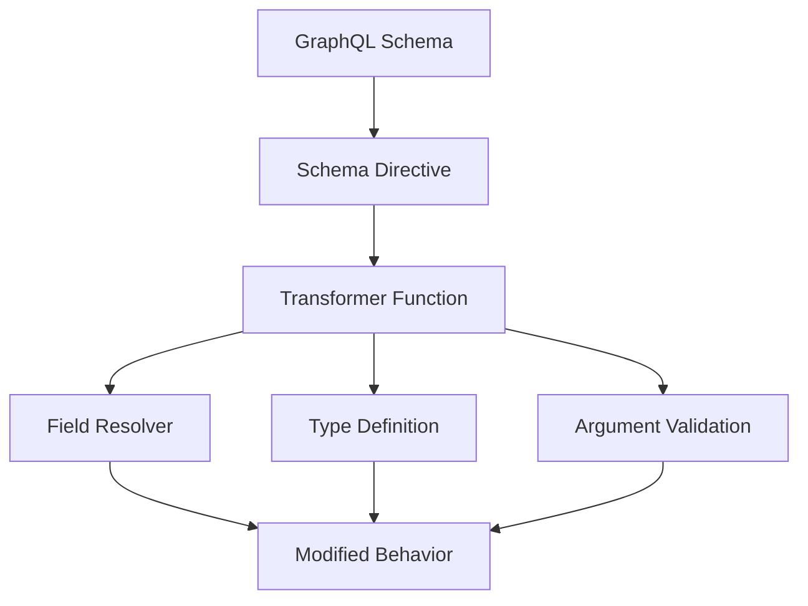
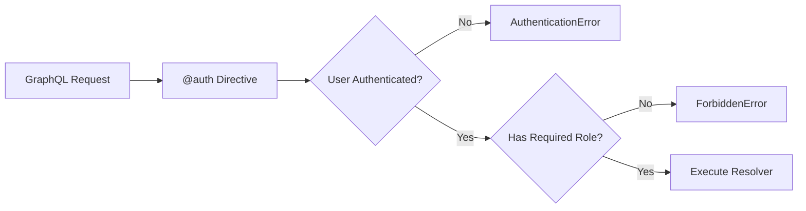
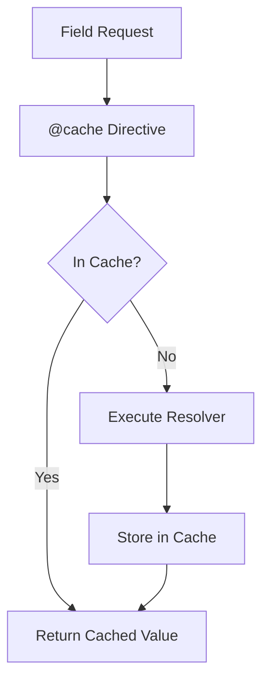

# How to Configure GraphQL Schema Directives

Author: [nawazdhandala](https://www.github.com/nawazdhandala)

Tags: GraphQL, Schema Directives, API Development, Authentication, Validation, Node.js, Backend Development

Description: Learn how to create and configure custom GraphQL schema directives for authentication, validation, caching, and field transformation.

---

> Schema directives are powerful tools that let you add reusable behavior to your GraphQL schema. Instead of duplicating logic across resolvers, directives provide a declarative way to add authentication, validation, caching, and transformations.

Directives reduce boilerplate and make your schema self-documenting. This guide covers everything from built-in directives to creating your own.

---

## Overview



---

## Built-in Directives

GraphQL includes several built-in directives that control query execution.

```graphql
# @deprecated - Mark fields as deprecated with a reason
type User {
  id: ID!
  name: String!
  fullName: String!

  # This field is deprecated in favor of fullName
  username: String @deprecated(reason: "Use fullName instead")
}

# @skip - Conditionally skip a field based on a variable
query GetUser($skipEmail: Boolean!) {
  user(id: "123") {
    name
    email @skip(if: $skipEmail)
  }
}

# @include - Conditionally include a field based on a variable
query GetUser($includeProfile: Boolean!) {
  user(id: "123") {
    name
    profile @include(if: $includeProfile) {
      bio
      avatar
    }
  }
}

# @specifiedBy - Specify the URL for a custom scalar specification
scalar DateTime @specifiedBy(url: "https://scalars.graphql.org/andimarek/date-time")
```

---

## Creating Custom Directives

### Directive Definition Syntax

```graphql
# Define where the directive can be used with locations
# FIELD_DEFINITION - Apply to field definitions in types
# OBJECT - Apply to object type definitions
# ARGUMENT_DEFINITION - Apply to field arguments
# INPUT_FIELD_DEFINITION - Apply to input type fields

directive @auth(
  requires: Role = USER
) on FIELD_DEFINITION

directive @uppercase on FIELD_DEFINITION

directive @length(
  min: Int
  max: Int
) on ARGUMENT_DEFINITION | INPUT_FIELD_DEFINITION

enum Role {
  ADMIN
  USER
  GUEST
}
```

---

## Authentication Directive

Implement role-based access control with a custom directive.



### Schema Definition

```graphql
# schema.graphql
directive @auth(
  requires: Role = USER
) on FIELD_DEFINITION | OBJECT

enum Role {
  ADMIN
  MODERATOR
  USER
  GUEST
}

type Query {
  # Public - no auth required
  publicPosts: [Post!]!

  # Requires authentication (default USER role)
  me: User! @auth

  # Requires specific role
  adminDashboard: AdminData! @auth(requires: ADMIN)

  # Multiple roles can access
  moderatorQueue: [Report!]! @auth(requires: MODERATOR)
}

type Mutation {
  # Requires authentication to create posts
  createPost(input: CreatePostInput!): Post! @auth

  # Only admins can delete users
  deleteUser(id: ID!): Boolean! @auth(requires: ADMIN)
}

# Apply auth to entire type - all fields require USER role
type User @auth {
  id: ID!
  email: String!
  profile: Profile!
}
```

### Directive Implementation with graphql-tools

```javascript
// directives/auth.js
const { mapSchema, getDirective, MapperKind } = require('@graphql-tools/utils');
const { defaultFieldResolver } = require('graphql');
const { AuthenticationError, ForbiddenError } = require('apollo-server');

// Role hierarchy - higher roles include permissions of lower roles
const roleHierarchy = {
  GUEST: 0,
  USER: 1,
  MODERATOR: 2,
  ADMIN: 3
};

function authDirectiveTransformer(schema, directiveName = 'auth') {
  return mapSchema(schema, {
    // Handle directives on object types
    [MapperKind.OBJECT_TYPE]: (type) => {
      const authDirective = getDirective(schema, type, directiveName)?.[0];

      if (authDirective) {
        // Store the required role on the type for field-level checks
        type._requiredRole = authDirective.requires || 'USER';
      }

      return type;
    },

    // Handle directives on fields
    [MapperKind.OBJECT_FIELD]: (fieldConfig, fieldName, typeName) => {
      // Check for field-level directive
      const authDirective = getDirective(schema, fieldConfig, directiveName)?.[0];

      // Check for type-level directive (inherited)
      const typeRequiredRole = schema.getType(typeName)?._requiredRole;

      // Determine the required role (field-level takes precedence)
      const requiredRole = authDirective?.requires || typeRequiredRole;

      if (requiredRole) {
        const originalResolver = fieldConfig.resolve || defaultFieldResolver;

        // Wrap the resolver with auth check
        fieldConfig.resolve = async function (source, args, context, info) {
          // Check if user is authenticated
          if (!context.user) {
            throw new AuthenticationError(
              'You must be logged in to access this resource'
            );
          }

          // Check role hierarchy
          const userRoleLevel = roleHierarchy[context.user.role] || 0;
          const requiredRoleLevel = roleHierarchy[requiredRole] || 0;

          if (userRoleLevel < requiredRoleLevel) {
            throw new ForbiddenError(
              `This action requires ${requiredRole} role or higher`
            );
          }

          // User is authorized - execute the original resolver
          return originalResolver(source, args, context, info);
        };
      }

      return fieldConfig;
    }
  });
}

module.exports = { authDirectiveTransformer };
```

### Using the Auth Directive

```javascript
// server.js
const { ApolloServer } = require('apollo-server');
const { makeExecutableSchema } = require('@graphql-tools/schema');
const { authDirectiveTransformer } = require('./directives/auth');

// Create the base schema
let schema = makeExecutableSchema({
  typeDefs,
  resolvers
});

// Apply the auth directive transformer
schema = authDirectiveTransformer(schema, 'auth');

const server = new ApolloServer({
  schema,
  context: async ({ req }) => {
    // Extract and verify JWT token
    const token = req.headers.authorization?.replace('Bearer ', '');
    let user = null;

    if (token) {
      try {
        user = await verifyToken(token);
      } catch (err) {
        console.warn('Invalid token:', err.message);
      }
    }

    return { user };
  }
});
```

---

## Validation Directive

Create a directive for input validation.

```graphql
# schema.graphql
directive @length(
  min: Int
  max: Int
  message: String
) on ARGUMENT_DEFINITION | INPUT_FIELD_DEFINITION

directive @pattern(
  regex: String!
  message: String
) on ARGUMENT_DEFINITION | INPUT_FIELD_DEFINITION

directive @range(
  min: Float
  max: Float
  message: String
) on ARGUMENT_DEFINITION | INPUT_FIELD_DEFINITION

type Mutation {
  createUser(
    name: String! @length(min: 2, max: 100, message: "Name must be 2-100 characters")
    email: String! @pattern(regex: "^[^@]+@[^@]+\\.[^@]+$", message: "Invalid email format")
    age: Int @range(min: 0, max: 150, message: "Age must be between 0 and 150")
  ): User!
}

input CreatePostInput {
  title: String! @length(min: 5, max: 200)
  content: String! @length(min: 100, max: 50000)
  tags: [String!]! @length(min: 1, max: 10)
}
```

### Validation Directive Implementation

```javascript
// directives/validation.js
const { mapSchema, getDirective, MapperKind } = require('@graphql-tools/utils');
const { UserInputError } = require('apollo-server');

// Length validation directive
function lengthDirectiveTransformer(schema, directiveName = 'length') {
  return mapSchema(schema, {
    [MapperKind.ARGUMENT]: (argumentConfig) => {
      const directive = getDirective(schema, argumentConfig, directiveName)?.[0];

      if (directive) {
        argumentConfig._lengthValidation = {
          min: directive.min,
          max: directive.max,
          message: directive.message
        };
      }

      return argumentConfig;
    },

    [MapperKind.INPUT_OBJECT_FIELD]: (fieldConfig) => {
      const directive = getDirective(schema, fieldConfig, directiveName)?.[0];

      if (directive) {
        fieldConfig._lengthValidation = {
          min: directive.min,
          max: directive.max,
          message: directive.message
        };
      }

      return fieldConfig;
    },

    [MapperKind.OBJECT_FIELD]: (fieldConfig, fieldName, typeName) => {
      const originalResolver = fieldConfig.resolve;

      if (!originalResolver) return fieldConfig;

      fieldConfig.resolve = async function (source, args, context, info) {
        // Validate arguments
        for (const [argName, argValue] of Object.entries(args)) {
          const argConfig = fieldConfig.args?.[argName];
          const validation = argConfig?._lengthValidation;

          if (validation && argValue != null) {
            validateLength(argName, argValue, validation);
          }
        }

        return originalResolver(source, args, context, info);
      };

      return fieldConfig;
    }
  });
}

function validateLength(fieldName, value, { min, max, message }) {
  // Handle arrays
  const length = Array.isArray(value) ? value.length : String(value).length;
  const type = Array.isArray(value) ? 'items' : 'characters';

  if (min != null && length < min) {
    throw new UserInputError(
      message || `${fieldName} must have at least ${min} ${type}`
    );
  }

  if (max != null && length > max) {
    throw new UserInputError(
      message || `${fieldName} must have at most ${max} ${type}`
    );
  }
}

// Pattern validation directive
function patternDirectiveTransformer(schema, directiveName = 'pattern') {
  return mapSchema(schema, {
    [MapperKind.ARGUMENT]: (argumentConfig) => {
      const directive = getDirective(schema, argumentConfig, directiveName)?.[0];

      if (directive) {
        argumentConfig._patternValidation = {
          regex: new RegExp(directive.regex),
          message: directive.message
        };
      }

      return argumentConfig;
    },

    [MapperKind.OBJECT_FIELD]: (fieldConfig) => {
      const originalResolver = fieldConfig.resolve;

      if (!originalResolver) return fieldConfig;

      fieldConfig.resolve = async function (source, args, context, info) {
        // Validate pattern on arguments
        for (const [argName, argValue] of Object.entries(args)) {
          const argConfig = fieldConfig.args?.[argName];
          const validation = argConfig?._patternValidation;

          if (validation && argValue != null) {
            if (!validation.regex.test(String(argValue))) {
              throw new UserInputError(
                validation.message || `${argName} has invalid format`
              );
            }
          }
        }

        return originalResolver(source, args, context, info);
      };

      return fieldConfig;
    }
  });
}

module.exports = {
  lengthDirectiveTransformer,
  patternDirectiveTransformer
};
```

---

## Caching Directive

Implement field-level caching with a directive.



```graphql
# schema.graphql
directive @cache(
  maxAge: Int!           # Cache duration in seconds
  scope: CacheScope = PUBLIC
) on FIELD_DEFINITION

enum CacheScope {
  PUBLIC   # Shared across all users
  PRIVATE  # Per-user cache
}

type Query {
  # Cache for 1 hour - shared across all users
  popularPosts: [Post!]! @cache(maxAge: 3600, scope: PUBLIC)

  # Cache for 5 minutes - per user
  myNotifications: [Notification!]! @cache(maxAge: 300, scope: PRIVATE)

  # Cache product catalog for 30 minutes
  products(category: String): [Product!]! @cache(maxAge: 1800)
}
```

### Cache Directive Implementation

```javascript
// directives/cache.js
const { mapSchema, getDirective, MapperKind } = require('@graphql-tools/utils');
const { defaultFieldResolver } = require('graphql');

// In-memory cache (use Redis for production)
const cache = new Map();

function cacheDirectiveTransformer(schema, directiveName = 'cache') {
  return mapSchema(schema, {
    [MapperKind.OBJECT_FIELD]: (fieldConfig, fieldName, typeName) => {
      const cacheDirective = getDirective(schema, fieldConfig, directiveName)?.[0];

      if (cacheDirective) {
        const { maxAge, scope = 'PUBLIC' } = cacheDirective;
        const originalResolver = fieldConfig.resolve || defaultFieldResolver;

        fieldConfig.resolve = async function (source, args, context, info) {
          // Build cache key
          const keyParts = [
            typeName,
            fieldName,
            JSON.stringify(args)
          ];

          // Include user ID for private scope
          if (scope === 'PRIVATE' && context.user) {
            keyParts.push(context.user.id);
          }

          const cacheKey = keyParts.join(':');

          // Check cache
          const cached = cache.get(cacheKey);
          if (cached && cached.expiry > Date.now()) {
            console.log(`Cache hit: ${cacheKey}`);
            return cached.value;
          }

          // Execute resolver
          const result = await originalResolver(source, args, context, info);

          // Store in cache
          cache.set(cacheKey, {
            value: result,
            expiry: Date.now() + (maxAge * 1000)
          });

          console.log(`Cache miss: ${cacheKey}, stored for ${maxAge}s`);
          return result;
        };
      }

      return fieldConfig;
    }
  });
}

// Cache invalidation helper
function invalidateCache(pattern) {
  for (const key of cache.keys()) {
    if (key.includes(pattern)) {
      cache.delete(key);
    }
  }
}

module.exports = { cacheDirectiveTransformer, invalidateCache };
```

### Redis Cache Implementation

```javascript
// directives/cache-redis.js
const Redis = require('ioredis');
const { mapSchema, getDirective, MapperKind } = require('@graphql-tools/utils');

const redis = new Redis(process.env.REDIS_URL);

function redisCacheDirectiveTransformer(schema, directiveName = 'cache') {
  return mapSchema(schema, {
    [MapperKind.OBJECT_FIELD]: (fieldConfig, fieldName, typeName) => {
      const cacheDirective = getDirective(schema, fieldConfig, directiveName)?.[0];

      if (cacheDirective) {
        const { maxAge, scope = 'PUBLIC' } = cacheDirective;
        const originalResolver = fieldConfig.resolve;

        if (!originalResolver) return fieldConfig;

        fieldConfig.resolve = async function (source, args, context, info) {
          // Build cache key with namespace
          const keyParts = ['graphql', typeName, fieldName];

          if (Object.keys(args).length > 0) {
            keyParts.push(hashObject(args));
          }

          if (scope === 'PRIVATE' && context.user) {
            keyParts.push(`user:${context.user.id}`);
          }

          const cacheKey = keyParts.join(':');

          // Try to get from Redis
          const cached = await redis.get(cacheKey);
          if (cached) {
            return JSON.parse(cached);
          }

          // Execute resolver
          const result = await originalResolver(source, args, context, info);

          // Store in Redis with expiry
          await redis.setex(cacheKey, maxAge, JSON.stringify(result));

          return result;
        };
      }

      return fieldConfig;
    }
  });
}

// Simple hash function for cache keys
function hashObject(obj) {
  return Buffer.from(JSON.stringify(obj)).toString('base64');
}

module.exports = { redisCacheDirectiveTransformer };
```

---

## Field Transformation Directives

Create directives that transform field values.

```graphql
# schema.graphql
directive @uppercase on FIELD_DEFINITION
directive @lowercase on FIELD_DEFINITION
directive @trim on FIELD_DEFINITION
directive @date(format: String = "YYYY-MM-DD") on FIELD_DEFINITION
directive @mask(char: String = "*", visibleChars: Int = 4) on FIELD_DEFINITION

type User {
  id: ID!

  # Transform name to uppercase
  displayName: String! @uppercase

  # Trim whitespace from bio
  bio: String @trim

  # Format date fields
  createdAt: String! @date(format: "MMM DD, YYYY")

  # Mask sensitive data
  phoneNumber: String @mask(char: "*", visibleChars: 4)
  socialSecurityNumber: String @mask(char: "X", visibleChars: 4)
}
```

### Transformation Directive Implementation

```javascript
// directives/transform.js
const { mapSchema, getDirective, MapperKind } = require('@graphql-tools/utils');
const { defaultFieldResolver } = require('graphql');
const dayjs = require('dayjs');

// Uppercase directive
function uppercaseDirectiveTransformer(schema) {
  return mapSchema(schema, {
    [MapperKind.OBJECT_FIELD]: (fieldConfig) => {
      const directive = getDirective(schema, fieldConfig, 'uppercase')?.[0];

      if (directive) {
        const originalResolver = fieldConfig.resolve || defaultFieldResolver;

        fieldConfig.resolve = async function (source, args, context, info) {
          const result = await originalResolver(source, args, context, info);
          return typeof result === 'string' ? result.toUpperCase() : result;
        };
      }

      return fieldConfig;
    }
  });
}

// Date formatting directive
function dateDirectiveTransformer(schema) {
  return mapSchema(schema, {
    [MapperKind.OBJECT_FIELD]: (fieldConfig) => {
      const directive = getDirective(schema, fieldConfig, 'date')?.[0];

      if (directive) {
        const { format = 'YYYY-MM-DD' } = directive;
        const originalResolver = fieldConfig.resolve || defaultFieldResolver;

        fieldConfig.resolve = async function (source, args, context, info) {
          const result = await originalResolver(source, args, context, info);

          if (result) {
            return dayjs(result).format(format);
          }

          return result;
        };
      }

      return fieldConfig;
    }
  });
}

// Mask directive for sensitive data
function maskDirectiveTransformer(schema) {
  return mapSchema(schema, {
    [MapperKind.OBJECT_FIELD]: (fieldConfig) => {
      const directive = getDirective(schema, fieldConfig, 'mask')?.[0];

      if (directive) {
        const { char = '*', visibleChars = 4 } = directive;
        const originalResolver = fieldConfig.resolve || defaultFieldResolver;

        fieldConfig.resolve = async function (source, args, context, info) {
          const result = await originalResolver(source, args, context, info);

          if (typeof result === 'string' && result.length > visibleChars) {
            const visible = result.slice(-visibleChars);
            const masked = char.repeat(result.length - visibleChars);
            return masked + visible;
          }

          return result;
        };
      }

      return fieldConfig;
    }
  });
}

module.exports = {
  uppercaseDirectiveTransformer,
  dateDirectiveTransformer,
  maskDirectiveTransformer
};
```

---

## Rate Limiting Directive

Implement rate limiting per field.

```graphql
# schema.graphql
directive @rateLimit(
  limit: Int!          # Number of requests
  duration: Int!       # Time window in seconds
  message: String
) on FIELD_DEFINITION

type Mutation {
  # Limit login attempts
  login(email: String!, password: String!): AuthPayload!
    @rateLimit(limit: 5, duration: 60, message: "Too many login attempts")

  # Limit expensive operations
  generateReport(type: ReportType!): Report!
    @rateLimit(limit: 10, duration: 3600)

  # Limit API key creation
  createApiKey(name: String!): ApiKey!
    @rateLimit(limit: 5, duration: 86400)
}
```

### Rate Limit Implementation

```javascript
// directives/rateLimit.js
const { mapSchema, getDirective, MapperKind } = require('@graphql-tools/utils');
const { ApolloError } = require('apollo-server');

// In-memory rate limit store (use Redis for production)
const rateLimitStore = new Map();

function rateLimitDirectiveTransformer(schema, directiveName = 'rateLimit') {
  return mapSchema(schema, {
    [MapperKind.OBJECT_FIELD]: (fieldConfig, fieldName, typeName) => {
      const directive = getDirective(schema, fieldConfig, directiveName)?.[0];

      if (directive) {
        const { limit, duration, message } = directive;
        const originalResolver = fieldConfig.resolve;

        if (!originalResolver) return fieldConfig;

        fieldConfig.resolve = async function (source, args, context, info) {
          // Create unique key for this field and user/IP
          const identifier = context.user?.id || context.ip || 'anonymous';
          const key = `${typeName}:${fieldName}:${identifier}`;

          // Get or create rate limit entry
          let entry = rateLimitStore.get(key);
          const now = Date.now();

          if (!entry || now > entry.resetAt) {
            // Create new entry
            entry = {
              count: 0,
              resetAt: now + (duration * 1000)
            };
          }

          // Check if limit exceeded
          if (entry.count >= limit) {
            const retryAfter = Math.ceil((entry.resetAt - now) / 1000);

            throw new ApolloError(
              message || `Rate limit exceeded. Try again in ${retryAfter} seconds.`,
              'RATE_LIMITED',
              { retryAfter }
            );
          }

          // Increment counter
          entry.count++;
          rateLimitStore.set(key, entry);

          // Add rate limit headers to response
          if (context.res) {
            context.res.setHeader('X-RateLimit-Limit', limit);
            context.res.setHeader('X-RateLimit-Remaining', limit - entry.count);
            context.res.setHeader('X-RateLimit-Reset', entry.resetAt);
          }

          return originalResolver(source, args, context, info);
        };
      }

      return fieldConfig;
    }
  });
}

module.exports = { rateLimitDirectiveTransformer };
```

---

## Combining Multiple Directives

Apply multiple directives to create a complete schema.

```javascript
// server.js
const { ApolloServer } = require('apollo-server-express');
const { makeExecutableSchema } = require('@graphql-tools/schema');

// Import all directive transformers
const { authDirectiveTransformer } = require('./directives/auth');
const { lengthDirectiveTransformer, patternDirectiveTransformer } = require('./directives/validation');
const { cacheDirectiveTransformer } = require('./directives/cache');
const { rateLimitDirectiveTransformer } = require('./directives/rateLimit');
const { uppercaseDirectiveTransformer, dateDirectiveTransformer, maskDirectiveTransformer } = require('./directives/transform');

// Create base schema
let schema = makeExecutableSchema({
  typeDefs,
  resolvers
});

// Apply directives in order
// Order matters - auth should run before other directives
schema = authDirectiveTransformer(schema, 'auth');
schema = rateLimitDirectiveTransformer(schema, 'rateLimit');
schema = lengthDirectiveTransformer(schema, 'length');
schema = patternDirectiveTransformer(schema, 'pattern');
schema = cacheDirectiveTransformer(schema, 'cache');
schema = uppercaseDirectiveTransformer(schema);
schema = dateDirectiveTransformer(schema);
schema = maskDirectiveTransformer(schema);

const server = new ApolloServer({
  schema,
  context: async ({ req, res }) => {
    const token = req.headers.authorization?.replace('Bearer ', '');
    const user = token ? await verifyToken(token) : null;
    const ip = req.ip || req.connection.remoteAddress;

    return { user, ip, req, res };
  }
});
```

---

## Testing Directives

Write tests for your custom directives.

```javascript
// __tests__/directives.test.js
const { makeExecutableSchema } = require('@graphql-tools/schema');
const { graphql } = require('graphql');
const { authDirectiveTransformer } = require('../directives/auth');

describe('Auth Directive', () => {
  const typeDefs = `
    directive @auth(requires: Role = USER) on FIELD_DEFINITION

    enum Role { ADMIN USER GUEST }

    type Query {
      publicField: String
      protectedField: String @auth
      adminField: String @auth(requires: ADMIN)
    }
  `;

  const resolvers = {
    Query: {
      publicField: () => 'public data',
      protectedField: () => 'protected data',
      adminField: () => 'admin data'
    }
  };

  let schema = makeExecutableSchema({ typeDefs, resolvers });
  schema = authDirectiveTransformer(schema, 'auth');

  it('allows access to public fields without auth', async () => {
    const result = await graphql({
      schema,
      source: '{ publicField }',
      contextValue: {}
    });

    expect(result.data.publicField).toBe('public data');
    expect(result.errors).toBeUndefined();
  });

  it('blocks access to protected fields without auth', async () => {
    const result = await graphql({
      schema,
      source: '{ protectedField }',
      contextValue: {}
    });

    expect(result.errors).toHaveLength(1);
    expect(result.errors[0].message).toContain('logged in');
  });

  it('allows access with valid user', async () => {
    const result = await graphql({
      schema,
      source: '{ protectedField }',
      contextValue: { user: { id: '1', role: 'USER' } }
    });

    expect(result.data.protectedField).toBe('protected data');
    expect(result.errors).toBeUndefined();
  });

  it('blocks admin fields for regular users', async () => {
    const result = await graphql({
      schema,
      source: '{ adminField }',
      contextValue: { user: { id: '1', role: 'USER' } }
    });

    expect(result.errors).toHaveLength(1);
    expect(result.errors[0].message).toContain('ADMIN');
  });

  it('allows admin fields for admin users', async () => {
    const result = await graphql({
      schema,
      source: '{ adminField }',
      contextValue: { user: { id: '1', role: 'ADMIN' } }
    });

    expect(result.data.adminField).toBe('admin data');
    expect(result.errors).toBeUndefined();
  });
});
```

---

## Best Practices

1. **Keep directives focused** - each directive should do one thing well
2. **Document directive behavior** - add descriptions to your directive definitions
3. **Consider execution order** - auth directives should run before others
4. **Handle null values** - always check for null before transforming
5. **Test edge cases** - test with missing context, null values, and errors
6. **Use composition** - combine simple directives rather than creating complex ones

---

## Conclusion

GraphQL schema directives provide a powerful way to add reusable behavior to your API. By creating custom directives for authentication, validation, caching, and transformation, you can reduce boilerplate and make your schema more declarative and self-documenting.

Key takeaways:

- Use built-in directives for deprecation and conditional fields
- Create custom directives for cross-cutting concerns
- Implement auth directives for role-based access control
- Add validation directives for input sanitization
- Use caching directives to improve performance
- Test directives thoroughly

---

*Need to monitor your GraphQL API? [OneUptime](https://oneuptime.com) provides comprehensive monitoring with directive-level performance tracking and error alerting.*
