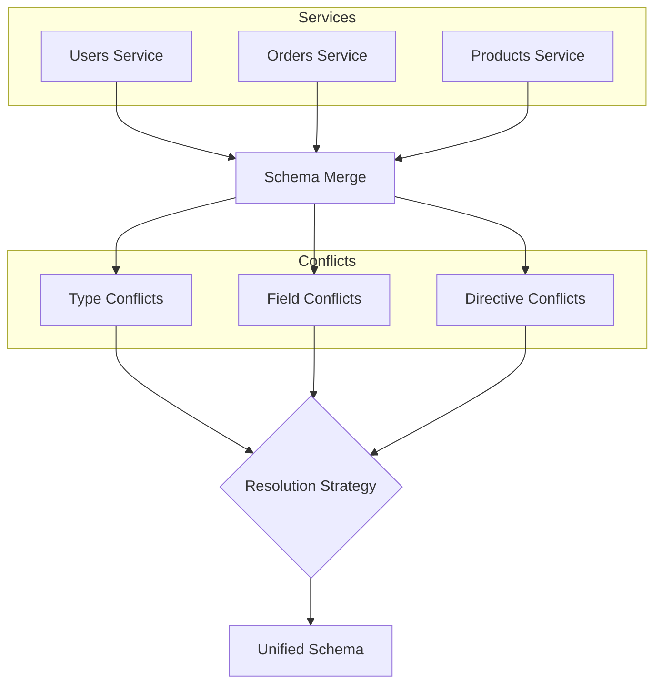
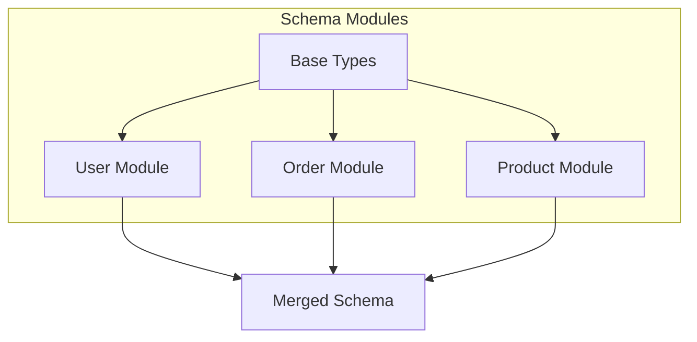

# How to Fix 'Schema Merge' Conflicts in GraphQL

Author: [nawazdhandala](https://www.github.com/nawazdhandala)

Tags: GraphQL, Schema Stitching, Federation, Apollo, API Development, Backend

Description: Learn how to identify and resolve schema merge conflicts when combining multiple GraphQL schemas using federation, stitching, or modular schema design.

---

Schema merge conflicts are among the most common issues when working with distributed GraphQL architectures. Whether you are using Apollo Federation, schema stitching, or modular schema design, conflicts arise when multiple sources define the same types, fields, or directives differently.

## Understanding Schema Merge Conflicts

Schema merging combines multiple GraphQL schemas into a single unified schema. Conflicts occur when the schemas have incompatible definitions.



## Common Conflict Types

### 1. Type Name Conflicts

Different services define types with the same name but different structures.

```graphql
# Users Service - defines User type
type User {
  id: ID!
  email: String!
  name: String!
}

# Orders Service - also defines User type but differently
type User {
  id: ID!
  email: String!
  # Missing 'name', has 'orders' instead
  orders: [Order!]!
}
```

### 2. Field Type Mismatches

Same field name with different types.

```graphql
# Service A
type Product {
  id: ID!
  # price is a Float
  price: Float!
}

# Service B
type Product {
  id: ID!
  # price is a custom Money type
  price: Money!
}
```

### 3. Nullability Conflicts

Different nullability expectations for the same field.

```graphql
# Service A - createdAt is required
type Order {
  id: ID!
  createdAt: DateTime!
}

# Service B - createdAt is nullable
type Order {
  id: ID!
  createdAt: DateTime
}
```

## Resolution with Apollo Federation

Apollo Federation handles many conflicts through entity references and the `@key` directive.

```graphql
# users-service/schema.graphql
# This service owns the User type and its core fields
type User @key(fields: "id") {
  id: ID!
  email: String!
  name: String!
  createdAt: DateTime!
}

type Query {
  user(id: ID!): User
  users: [User!]!
}
```

```graphql
# orders-service/schema.graphql
# This service extends User to add order-related fields
# The extend keyword indicates this is not the owner

extend type User @key(fields: "id") {
  id: ID! @external  # Field defined elsewhere, needed for resolution
  orders: [Order!]!  # New field added by this service
}

type Order @key(fields: "id") {
  id: ID!
  userId: ID!
  user: User!  # Reference to federated User type
  total: Float!
  status: OrderStatus!
  createdAt: DateTime!
}

enum OrderStatus {
  PENDING
  PROCESSING
  SHIPPED
  DELIVERED
}

type Query {
  order(id: ID!): Order
  ordersByUser(userId: ID!): [Order!]!
}
```

### Implementing Federation Resolvers

```javascript
// users-service/resolvers.js
const resolvers = {
  Query: {
    user: (_, { id }) => getUserById(id),
    users: () => getAllUsers(),
  },

  User: {
    // __resolveReference is called by the gateway when another service
    // needs to resolve a User reference
    __resolveReference: (reference) => {
      // reference contains the fields specified in @key
      return getUserById(reference.id);
    },
  },
};

module.exports = resolvers;
```

```javascript
// orders-service/resolvers.js
const resolvers = {
  Query: {
    order: (_, { id }) => getOrderById(id),
    ordersByUser: (_, { userId }) => getOrdersByUserId(userId),
  },

  Order: {
    // Return a reference that the gateway will resolve
    // using the Users service
    user: (order) => {
      return { __typename: 'User', id: order.userId };
    },
  },

  User: {
    // Extend User with orders field
    // This resolver is called when orders are requested on a User
    orders: (user) => {
      return getOrdersByUserId(user.id);
    },
  },
};

module.exports = resolvers;
```

## Schema Stitching Conflict Resolution

For non-federated architectures, schema stitching provides explicit merge strategies.

```javascript
const { stitchSchemas } = require('@graphql-tools/stitch');
const { delegateToSchema } = require('@graphql-tools/delegate');

// Stitch multiple schemas together with explicit conflict resolution
const gatewaySchema = stitchSchemas({
  subschemas: [
    {
      schema: usersSchema,
      // Transforms modify the schema before stitching
      transforms: [],
    },
    {
      schema: ordersSchema,
      transforms: [],
    },
    {
      schema: productsSchema,
      transforms: [],
    },
  ],

  // Type merge configuration resolves conflicts between services
  typeMergingOptions: {
    // Define how to merge User type from multiple services
    User: {
      // Specify which service is the canonical source for User
      selectionSet: '{ id }',
      // Define how to resolve User fields from different services
      fieldName: 'user',
      args: (originalObject) => ({ id: originalObject.id }),
    },
  },

  // Merge specific types with custom logic
  mergeTypes: true,

  // Custom type merge config for complex cases
  typeMergingOptions: {
    typeCandidateMerger: (candidates) => {
      // Custom logic to pick the winning type definition
      // when multiple services define the same type
      return candidates.find(c => c.subschema.name === 'users') || candidates[0];
    },
  },
});
```

### Handling Field Conflicts with Transforms

```javascript
const { RenameTypes, RenameRootFields } = require('@graphql-tools/wrap');

// Transform schemas to avoid conflicts before stitching
const ordersSchemaTransformed = {
  schema: ordersSchema,
  transforms: [
    // Rename conflicting types to be service-specific
    new RenameTypes((name) => {
      if (name === 'User') {
        return 'OrdersServiceUser';
      }
      return name;
    }),

    // Rename root fields to avoid collisions
    new RenameRootFields((operation, fieldName) => {
      if (fieldName === 'user') {
        return 'ordersServiceUser';
      }
      return fieldName;
    }),
  ],
};
```

## Modular Schema Design

Prevent conflicts by designing schemas with clear ownership from the start.



```javascript
// schema/base.js
// Define shared types and interfaces that all modules use
const baseTypeDefs = gql`
  # Standard scalars used across all modules
  scalar DateTime
  scalar JSON

  # Common interfaces that types can implement
  interface Node {
    id: ID!
  }

  interface Timestamped {
    createdAt: DateTime!
    updatedAt: DateTime!
  }

  # Pagination types for consistent list handling
  type PageInfo {
    hasNextPage: Boolean!
    hasPreviousPage: Boolean!
    startCursor: String
    endCursor: String
  }
`;

module.exports = baseTypeDefs;
```

```javascript
// schema/user.js
// User module owns all user-related types
const userTypeDefs = gql`
  # Extend the base Query type - don't redefine it
  extend type Query {
    user(id: ID!): User
    users(first: Int, after: String): UserConnection!
    me: User
  }

  extend type Mutation {
    createUser(input: CreateUserInput!): User!
    updateUser(id: ID!, input: UpdateUserInput!): User!
    deleteUser(id: ID!): Boolean!
  }

  # User type implements common interfaces
  type User implements Node & Timestamped {
    id: ID!
    email: String!
    name: String!
    avatar: String
    role: UserRole!
    createdAt: DateTime!
    updatedAt: DateTime!
  }

  # User-specific enums
  enum UserRole {
    ADMIN
    USER
    GUEST
  }

  # Connection type for pagination
  type UserConnection {
    edges: [UserEdge!]!
    pageInfo: PageInfo!
    totalCount: Int!
  }

  type UserEdge {
    node: User!
    cursor: String!
  }

  # Input types for mutations
  input CreateUserInput {
    email: String!
    name: String!
    role: UserRole
  }

  input UpdateUserInput {
    email: String
    name: String
    role: UserRole
  }
`;

module.exports = userTypeDefs;
```

```javascript
// schema/order.js
// Order module extends User without redefining it
const orderTypeDefs = gql`
  extend type Query {
    order(id: ID!): Order
    orders(userId: ID, first: Int, after: String): OrderConnection!
  }

  extend type Mutation {
    createOrder(input: CreateOrderInput!): Order!
    updateOrderStatus(id: ID!, status: OrderStatus!): Order!
    cancelOrder(id: ID!): Order!
  }

  # Extend User type to add order relationship
  # This adds fields without conflicting with User module
  extend type User {
    orders(first: Int, after: String): OrderConnection!
    totalOrderValue: Float!
  }

  type Order implements Node & Timestamped {
    id: ID!
    user: User!
    items: [OrderItem!]!
    status: OrderStatus!
    total: Float!
    shippingAddress: Address
    createdAt: DateTime!
    updatedAt: DateTime!
  }

  type OrderItem {
    id: ID!
    product: Product!
    quantity: Int!
    unitPrice: Float!
    subtotal: Float!
  }

  enum OrderStatus {
    PENDING
    CONFIRMED
    PROCESSING
    SHIPPED
    DELIVERED
    CANCELLED
  }

  type OrderConnection {
    edges: [OrderEdge!]!
    pageInfo: PageInfo!
    totalCount: Int!
  }

  type OrderEdge {
    node: Order!
    cursor: String!
  }

  input CreateOrderInput {
    items: [OrderItemInput!]!
    shippingAddressId: ID
  }

  input OrderItemInput {
    productId: ID!
    quantity: Int!
  }

  type Address {
    street: String!
    city: String!
    state: String!
    postalCode: String!
    country: String!
  }
`;

module.exports = orderTypeDefs;
```

### Merging Modular Schemas

```javascript
const { makeExecutableSchema, mergeTypeDefs, mergeResolvers } = require('@graphql-tools/schema');

// Import all type definitions
const baseTypeDefs = require('./schema/base');
const userTypeDefs = require('./schema/user');
const orderTypeDefs = require('./schema/order');
const productTypeDefs = require('./schema/product');

// Import all resolvers
const baseResolvers = require('./resolvers/base');
const userResolvers = require('./resolvers/user');
const orderResolvers = require('./resolvers/order');
const productResolvers = require('./resolvers/product');

// Root type definitions that other modules extend
const rootTypeDefs = gql`
  type Query {
    _empty: String
  }

  type Mutation {
    _empty: String
  }

  type Subscription {
    _empty: String
  }
`;

// Merge all type definitions in the correct order
// Base types must come first, then root, then modules
const typeDefs = mergeTypeDefs([
  baseTypeDefs,
  rootTypeDefs,
  userTypeDefs,
  orderTypeDefs,
  productTypeDefs,
]);

// Merge all resolvers
// Later resolvers override earlier ones for the same field
const resolvers = mergeResolvers([
  baseResolvers,
  userResolvers,
  orderResolvers,
  productResolvers,
]);

// Create the executable schema
const schema = makeExecutableSchema({
  typeDefs,
  resolvers,
});

module.exports = schema;
```

## Detecting and Preventing Conflicts

Use tooling to catch conflicts early in development.

```javascript
// scripts/validate-schema.js
const { buildSchema, validateSchema, printSchema } = require('graphql');
const { mergeTypeDefs } = require('@graphql-tools/merge');

async function validateMergedSchema() {
  const typeDefs = loadAllTypeDefs(); // Your loading logic

  try {
    // Attempt to merge type definitions
    const merged = mergeTypeDefs(typeDefs, {
      // Throw on conflicts instead of silently picking one
      throwOnConflict: true,
      // Include comments and descriptions
      commentDescriptions: true,
    });

    // Build and validate the schema
    const schema = buildSchema(printSchema(merged));
    const errors = validateSchema(schema);

    if (errors.length > 0) {
      console.error('Schema validation errors:');
      errors.forEach(error => {
        console.error(`  - ${error.message}`);
      });
      process.exit(1);
    }

    console.log('Schema validation passed');

  } catch (error) {
    console.error('Schema merge conflict detected:');
    console.error(error.message);

    // Parse and display detailed conflict information
    if (error.message.includes('Type')) {
      console.error('\nConflicting type definitions found.');
      console.error('Ensure each type is defined in only one module.');
    }

    process.exit(1);
  }
}

validateMergedSchema();
```

### CI Integration for Schema Validation

```yaml
# .github/workflows/schema-validation.yml
name: Schema Validation

on:
  pull_request:
    paths:
      - 'src/schema/**'
      - 'src/resolvers/**'

jobs:
  validate:
    runs-on: ubuntu-latest
    steps:
      - uses: actions/checkout@v4

      - name: Setup Node.js
        uses: actions/setup-node@v4
        with:
          node-version: '20'

      - name: Install dependencies
        run: npm ci

      - name: Validate schema
        run: npm run validate:schema

      - name: Check for breaking changes
        run: |
          # Compare against main branch schema
          git fetch origin main
          npm run schema:diff -- --base origin/main
```

## Resolving Enum Conflicts

Enums require special handling when merged from multiple sources.

```javascript
const { mergeTypeDefs } = require('@graphql-tools/merge');

// Custom enum merge strategy
const mergeEnums = (candidates) => {
  // Collect all enum values from all candidates
  const allValues = new Set();

  candidates.forEach(candidate => {
    candidate.values.forEach(value => {
      allValues.add(value.name);
    });
  });

  return Array.from(allValues);
};

// Schema with potential enum conflicts
const schema1 = gql`
  enum Status {
    ACTIVE
    INACTIVE
  }
`;

const schema2 = gql`
  enum Status {
    ACTIVE
    PENDING
    ARCHIVED
  }
`;

// Merge with enum handling
const merged = mergeTypeDefs([schema1, schema2], {
  // Custom merge for enum types
  onTypeConflict: (type1, type2, info) => {
    if (type1.kind === 'EnumTypeDefinition') {
      console.warn(`Merging enum ${type1.name.value} from multiple sources`);
      // Return the type with more values, or merge values
      const values1 = type1.values?.length || 0;
      const values2 = type2.values?.length || 0;
      return values2 > values1 ? type2 : type1;
    }
    return type2; // Default: later type wins
  },
});
```

## Summary

| Conflict Type | Resolution Strategy |
|---------------|---------------------|
| **Type Name Conflicts** | Use Federation `@key` or rename with transforms |
| **Field Type Mismatches** | Standardize types or use interface abstraction |
| **Nullability Conflicts** | Agree on nullability in shared type definitions |
| **Enum Conflicts** | Merge values or designate canonical source |
| **Directive Conflicts** | Use consistent directive definitions |

Schema merge conflicts are inevitable in distributed GraphQL architectures, but they are manageable with proper planning. Use Federation for service-oriented architectures, schema stitching for legacy integrations, and modular design principles to prevent conflicts from the start. Always validate schemas in CI to catch conflicts before they reach production.
