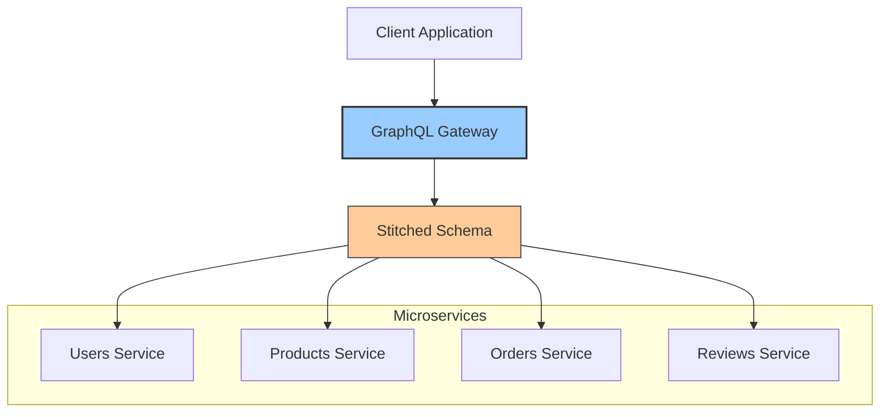
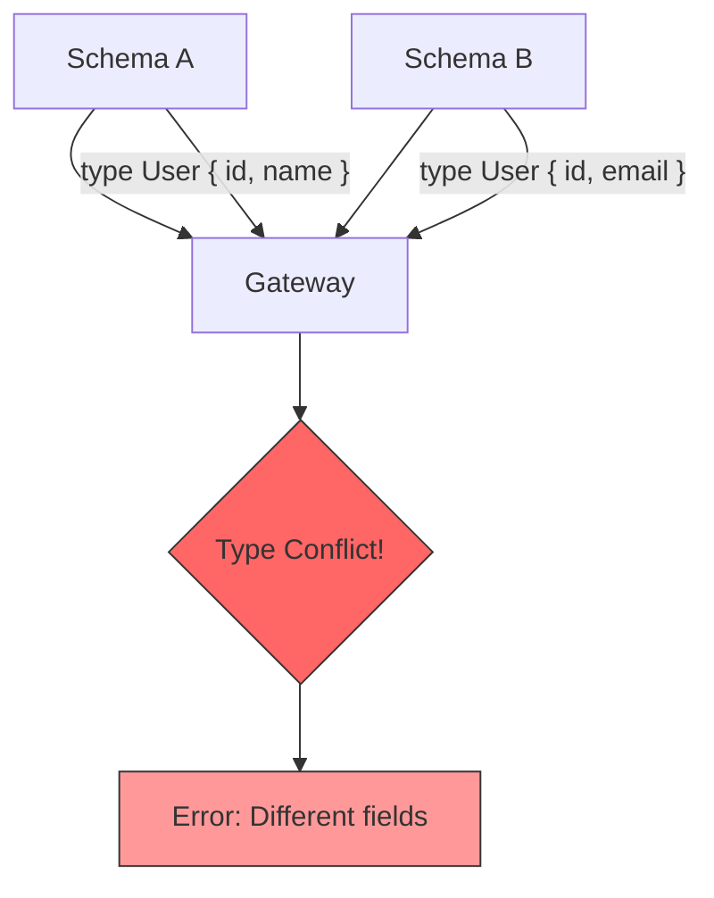
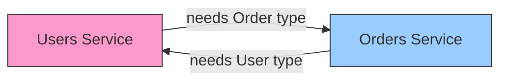
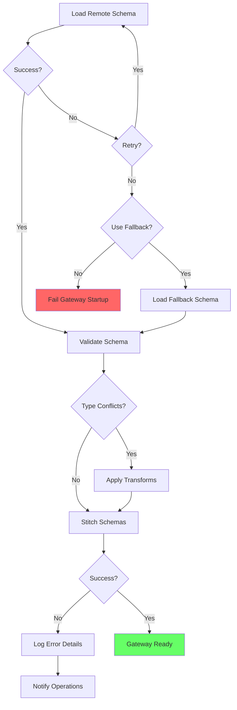
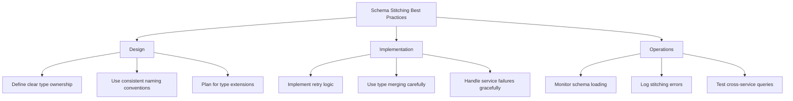

# How to Fix 'Schema Stitching' Errors in GraphQL

Author: [nawazdhandala](https://github.com/nawazdhandala)

Tags: GraphQL, Schema Stitching, Federation, Microservices, API Gateway, Node.js, Apollo

Description: Learn how to diagnose and fix common schema stitching errors when combining multiple GraphQL schemas into a unified API.

---

Schema stitching allows you to combine multiple GraphQL schemas into a single unified schema, enabling microservices architectures and modular API design. However, this powerful feature comes with its own set of challenges. This guide covers common schema stitching errors and provides practical solutions to resolve them.

## Understanding Schema Stitching

Schema stitching merges multiple GraphQL schemas from different services into a single gateway schema that clients can query as one unified API.



## Setting Up Schema Stitching

First, let us set up a basic schema stitching configuration.

```javascript
// gateway.js
const { makeExecutableSchema } = require("@graphql-tools/schema");
const { stitchSchemas } = require("@graphql-tools/stitch");
const { UrlLoader } = require("@graphql-tools/url-loader");
const { loadSchema } = require("@graphql-tools/load");

async function createGatewaySchema() {
  // Load schemas from remote services
  const usersSchema = await loadSchema("http://users-service:4001/graphql", {
    loaders: [new UrlLoader()]
  });

  const productsSchema = await loadSchema("http://products-service:4002/graphql", {
    loaders: [new UrlLoader()]
  });

  const ordersSchema = await loadSchema("http://orders-service:4003/graphql", {
    loaders: [new UrlLoader()]
  });

  // Stitch schemas together
  const gatewaySchema = stitchSchemas({
    subschemas: [
      { schema: usersSchema },
      { schema: productsSchema },
      { schema: ordersSchema }
    ]
  });

  return gatewaySchema;
}

module.exports = { createGatewaySchema };
```

## Common Schema Stitching Errors

### Error 1: Type Conflict Errors

When multiple schemas define the same type with different fields, stitching fails.



**Error Message:**
```
Error: Unable to merge type "User" - fields do not match
```

**Problematic Schemas:**

```graphql
# Users Service
type User {
  id: ID!
  name: String!
  email: String!
}

# Orders Service - Defines User differently
type User {
  id: ID!
  totalOrders: Int!
}
```

**Solution 1: Type Merging Configuration**

```javascript
// gateway.js
const { stitchSchemas } = require("@graphql-tools/stitch");

const gatewaySchema = stitchSchemas({
  subschemas: [
    {
      schema: usersSchema,
      // Mark this schema as the canonical source for User type
      merge: {
        User: {
          // This schema provides the base User type
          selectionSet: "{ id }",
          fieldName: "user",
          args: (originalObject) => ({ id: originalObject.id })
        }
      }
    },
    {
      schema: ordersSchema,
      merge: {
        User: {
          // Extend User with order-specific fields
          selectionSet: "{ id }",
          fieldName: "userOrderStats",
          args: (originalObject) => ({ userId: originalObject.id })
        }
      }
    }
  ],

  // Type merge configuration
  typeMergingOptions: {
    // Automatically merge types with the same name
    typeCandidateMerger: (candidates) => {
      // Combine fields from all candidates
      return candidates[0];
    }
  }
});
```

**Solution 2: Rename Conflicting Types**

```javascript
// gateway.js
const { stitchSchemas } = require("@graphql-tools/stitch");
const { RenameTypes, RenameRootFields } = require("@graphql-tools/wrap");

const gatewaySchema = stitchSchemas({
  subschemas: [
    {
      schema: usersSchema
      // User type stays as-is
    },
    {
      schema: ordersSchema,
      transforms: [
        // Rename the conflicting type
        new RenameTypes((name) => {
          if (name === "User") {
            return "OrderUser";
          }
          return name;
        })
      ]
    }
  ]
});
```

### Error 2: Missing Type References

When a type references another type that does not exist in the stitched schema.

**Error Message:**
```
Error: Unknown type "Review" referenced in type "Product"
```

**Problematic Schema:**

```graphql
# Products Service
type Product {
  id: ID!
  name: String!
  reviews: [Review!]!  # Review type not defined in this service
}

# Reviews service is not connected
```

**Solution: Add All Required Subschemas**

```javascript
// gateway.js
async function createGatewaySchema() {
  // Make sure all services with referenced types are included
  const productsSchema = await loadSchema("http://products:4002/graphql", {
    loaders: [new UrlLoader()]
  });

  const reviewsSchema = await loadSchema("http://reviews:4004/graphql", {
    loaders: [new UrlLoader()]
  });

  const gatewaySchema = stitchSchemas({
    subschemas: [
      { schema: productsSchema },
      { schema: reviewsSchema }
    ],

    // Add type extensions to link types across services
    typeDefs: `
      extend type Product {
        reviews: [Review!]!
      }
    `,

    resolvers: {
      Product: {
        reviews: {
          selectionSet: "{ id }",
          resolve(product, args, context, info) {
            return context.reviewsService.getReviewsByProductId(product.id);
          }
        }
      }
    }
  });

  return gatewaySchema;
}
```

### Error 3: Circular Dependency Between Services

Services that depend on each other can cause circular loading issues.



**Solution: Use Delegated Type Resolution**

```javascript
// gateway.js
const { stitchSchemas, delegateToSchema } = require("@graphql-tools/stitch");

// Define extension types in gateway
const gatewayTypeDefs = `
  # Extend User to add orders (from Orders service)
  extend type User {
    orders: [Order!]!
  }

  # Extend Order to add user (from Users service)
  extend type Order {
    user: User!
  }
`;

const gatewaySchema = stitchSchemas({
  subschemas: [
    {
      schema: usersSchema,
      merge: {
        User: {
          selectionSet: "{ id }",
          fieldName: "user",
          args: ({ id }) => ({ id })
        }
      }
    },
    {
      schema: ordersSchema,
      merge: {
        Order: {
          selectionSet: "{ id }",
          fieldName: "order",
          args: ({ id }) => ({ id })
        }
      }
    }
  ],

  typeDefs: gatewayTypeDefs,

  resolvers: {
    User: {
      orders: {
        selectionSet: "{ id }",
        resolve(user, args, context, info) {
          // Delegate to orders service
          return delegateToSchema({
            schema: ordersSchema,
            operation: "query",
            fieldName: "ordersByUserId",
            args: { userId: user.id },
            context,
            info
          });
        }
      }
    },

    Order: {
      user: {
        selectionSet: "{ userId }",
        resolve(order, args, context, info) {
          // Delegate to users service
          return delegateToSchema({
            schema: usersSchema,
            operation: "query",
            fieldName: "user",
            args: { id: order.userId },
            context,
            info
          });
        }
      }
    }
  }
});
```

### Error 4: Query Root Field Conflicts

Multiple schemas defining the same root query field.

**Error Message:**
```
Error: Duplicate root field "search" from multiple schemas
```

**Problematic Schemas:**

```graphql
# Products Service
type Query {
  search(query: String!): [Product!]!
}

# Users Service
type Query {
  search(query: String!): [User!]!
}
```

**Solution 1: Rename Conflicting Fields**

```javascript
// gateway.js
const { RenameRootFields } = require("@graphql-tools/wrap");

const gatewaySchema = stitchSchemas({
  subschemas: [
    {
      schema: productsSchema,
      transforms: [
        new RenameRootFields(
          (operationType, fieldName) => {
            if (fieldName === "search") {
              return "searchProducts";
            }
            return fieldName;
          }
        )
      ]
    },
    {
      schema: usersSchema,
      transforms: [
        new RenameRootFields(
          (operationType, fieldName) => {
            if (fieldName === "search") {
              return "searchUsers";
            }
            return fieldName;
          }
        )
      ]
    }
  ]
});
```

**Solution 2: Create Unified Search Interface**

```javascript
// gateway.js
const gatewayTypeDefs = `
  # Union type for search results
  union SearchResult = User | Product | Order

  type Query {
    # Unified search that queries all services
    search(query: String!, types: [String!]): [SearchResult!]!
  }
`;

const gatewaySchema = stitchSchemas({
  subschemas: [
    {
      schema: productsSchema,
      transforms: [
        // Remove the original search field
        new FilterRootFields((operation, fieldName) => fieldName !== "search")
      ]
    },
    {
      schema: usersSchema,
      transforms: [
        new FilterRootFields((operation, fieldName) => fieldName !== "search")
      ]
    }
  ],

  typeDefs: gatewayTypeDefs,

  resolvers: {
    Query: {
      search: async (_, { query, types }, context, info) => {
        const results = [];

        // Search across all services
        if (!types || types.includes("User")) {
          const users = await delegateToSchema({
            schema: usersSchema,
            operation: "query",
            fieldName: "searchUsers",
            args: { query },
            context,
            info
          });
          results.push(...users.map(u => ({ ...u, __typename: "User" })));
        }

        if (!types || types.includes("Product")) {
          const products = await delegateToSchema({
            schema: productsSchema,
            operation: "query",
            fieldName: "searchProducts",
            args: { query },
            context,
            info
          });
          results.push(...products.map(p => ({ ...p, __typename: "Product" })));
        }

        return results;
      }
    },

    SearchResult: {
      __resolveType(obj) {
        return obj.__typename;
      }
    }
  }
});
```

### Error 5: Enum Value Conflicts

When the same enum is defined differently across services.

**Error Message:**
```
Error: Enum "Status" has conflicting values across schemas
```

**Problematic Schemas:**

```graphql
# Orders Service
enum Status {
  PENDING
  PROCESSING
  SHIPPED
  DELIVERED
}

# Tickets Service
enum Status {
  OPEN
  IN_PROGRESS
  RESOLVED
  CLOSED
}
```

**Solution: Rename or Namespace Enums**

```javascript
// gateway.js
const {
  RenameTypes,
  TransformEnumValues
} = require("@graphql-tools/wrap");

const gatewaySchema = stitchSchemas({
  subschemas: [
    {
      schema: ordersSchema,
      transforms: [
        new RenameTypes((name) => {
          if (name === "Status") {
            return "OrderStatus";
          }
          return name;
        })
      ]
    },
    {
      schema: ticketsSchema,
      transforms: [
        new RenameTypes((name) => {
          if (name === "Status") {
            return "TicketStatus";
          }
          return name;
        })
      ]
    }
  ]
});
```

### Error 6: Directive Conflicts

Directives with the same name but different definitions.

**Error Message:**
```
Error: Directive "@auth" is defined differently across schemas
```

**Solution: Transform or Merge Directives**

```javascript
// gateway.js
const { FilterTypes, MapFields } = require("@graphql-tools/wrap");

// Define a unified auth directive in the gateway
const gatewayTypeDefs = `
  directive @auth(
    requires: [Role!]!
  ) on FIELD_DEFINITION

  enum Role {
    USER
    ADMIN
    SUPER_ADMIN
  }
`;

const gatewaySchema = stitchSchemas({
  subschemas: [
    {
      schema: usersSchema,
      transforms: [
        // Remove schema-specific directives
        new RemoveSchemaDirectives(["auth"])
      ]
    },
    {
      schema: ordersSchema,
      transforms: [
        new RemoveSchemaDirectives(["auth"])
      ]
    }
  ],

  typeDefs: gatewayTypeDefs,

  // Implement auth directive at gateway level
  schemaDirectives: {
    auth: AuthDirective
  }
});

// Custom directive implementation
class AuthDirective extends SchemaDirectiveVisitor {
  visitFieldDefinition(field) {
    const { requires } = this.args;
    const originalResolve = field.resolve;

    field.resolve = async function (parent, args, context, info) {
      if (!context.user) {
        throw new Error("Authentication required");
      }

      if (!requires.includes(context.user.role)) {
        throw new Error("Insufficient permissions");
      }

      return originalResolve.call(this, parent, args, context, info);
    };
  }
}
```

### Error 7: Network and Timeout Errors

Remote schema loading failures.

**Error Message:**
```
Error: Failed to load schema from http://users-service:4001/graphql - ECONNREFUSED
```

**Solution: Implement Retry Logic and Fallbacks**

```javascript
// schema-loader.js
const { loadSchema } = require("@graphql-tools/load");
const { UrlLoader } = require("@graphql-tools/url-loader");

async function loadSchemaWithRetry(url, options = {}) {
  const {
    maxRetries = 3,
    retryDelay = 1000,
    timeout = 5000
  } = options;

  let lastError;

  for (let attempt = 1; attempt <= maxRetries; attempt++) {
    try {
      console.log(`Loading schema from ${url} (attempt ${attempt}/${maxRetries})`);

      const schema = await loadSchema(url, {
        loaders: [new UrlLoader()],
        fetch: async (input, init) => {
          const controller = new AbortController();
          const timeoutId = setTimeout(() => controller.abort(), timeout);

          try {
            const response = await fetch(input, {
              ...init,
              signal: controller.signal
            });
            return response;
          } finally {
            clearTimeout(timeoutId);
          }
        }
      });

      console.log(`Successfully loaded schema from ${url}`);
      return schema;

    } catch (error) {
      lastError = error;
      console.warn(`Failed to load schema from ${url}: ${error.message}`);

      if (attempt < maxRetries) {
        console.log(`Retrying in ${retryDelay}ms...`);
        await new Promise(resolve => setTimeout(resolve, retryDelay));
      }
    }
  }

  throw new Error(
    `Failed to load schema from ${url} after ${maxRetries} attempts: ${lastError.message}`
  );
}

// Fallback schema for unavailable services
function createFallbackSchema(serviceName) {
  return makeExecutableSchema({
    typeDefs: `
      type Query {
        _${serviceName}ServiceStatus: String!
      }
    `,
    resolvers: {
      Query: {
        [`_${serviceName}ServiceStatus`]: () => "Service temporarily unavailable"
      }
    }
  });
}

async function loadSchemaWithFallback(url, serviceName, options = {}) {
  try {
    return await loadSchemaWithRetry(url, options);
  } catch (error) {
    console.error(`Service ${serviceName} unavailable, using fallback schema`);

    if (options.useFallback) {
      return createFallbackSchema(serviceName);
    }

    throw error;
  }
}

module.exports = { loadSchemaWithRetry, loadSchemaWithFallback };
```

### Error 8: Subscription Stitching Errors

Subscriptions require special handling in schema stitching.

**Error Message:**
```
Error: Subscriptions are not supported in stitched schemas
```

**Solution: Use WebSocket Delegation**

```javascript
// gateway-subscriptions.js
const { stitchSchemas } = require("@graphql-tools/stitch");
const { SubscriptionClient } = require("subscriptions-transport-ws");
const WebSocket = require("ws");
const { getMainDefinition } = require("@apollo/client/utilities");

// Create subscription client for each service
function createSubscriptionClient(wsUrl) {
  return new SubscriptionClient(
    wsUrl,
    {
      reconnect: true,
      connectionParams: () => ({
        // Add authentication headers
        authToken: process.env.SERVICE_AUTH_TOKEN
      })
    },
    WebSocket
  );
}

// Create executor for subscriptions
function createSubscriptionExecutor(wsUrl) {
  const client = createSubscriptionClient(wsUrl);

  return async ({ document, variables, context }) => {
    return new Observable((observer) => {
      const subscription = client.request({
        query: document,
        variables
      }).subscribe({
        next: (data) => observer.next(data),
        error: (error) => observer.error(error),
        complete: () => observer.complete()
      });

      return () => subscription.unsubscribe();
    });
  };
}

// Configure stitched schema with subscriptions
const gatewaySchema = stitchSchemas({
  subschemas: [
    {
      schema: ordersSchema,
      subscriber: createSubscriptionExecutor("ws://orders-service:4003/graphql")
    },
    {
      schema: notificationsSchema,
      subscriber: createSubscriptionExecutor("ws://notifications-service:4004/graphql")
    }
  ]
});
```

## Error Handling Flow



## Complete Gateway Example

```javascript
// complete-gateway.js
const { ApolloServer } = require("@apollo/server");
const { expressMiddleware } = require("@apollo/server/express4");
const { stitchSchemas, delegateToSchema } = require("@graphql-tools/stitch");
const { loadSchemaWithFallback } = require("./schema-loader");
const express = require("express");
const cors = require("cors");

const SERVICES = {
  users: {
    url: process.env.USERS_SERVICE_URL || "http://localhost:4001/graphql",
    required: true
  },
  products: {
    url: process.env.PRODUCTS_SERVICE_URL || "http://localhost:4002/graphql",
    required: true
  },
  orders: {
    url: process.env.ORDERS_SERVICE_URL || "http://localhost:4003/graphql",
    required: false // Optional service
  },
  reviews: {
    url: process.env.REVIEWS_SERVICE_URL || "http://localhost:4004/graphql",
    required: false
  }
};

async function createGateway() {
  const subschemas = [];
  const loadErrors = [];

  // Load all service schemas
  for (const [name, config] of Object.entries(SERVICES)) {
    try {
      const schema = await loadSchemaWithFallback(
        config.url,
        name,
        {
          maxRetries: 3,
          useFallback: !config.required
        }
      );

      subschemas.push({
        schema,
        batch: true, // Enable batching for performance
        merge: getTypeMergeConfig(name)
      });

      console.log(`Loaded ${name} service schema`);

    } catch (error) {
      loadErrors.push({ service: name, error });

      if (config.required) {
        throw new Error(`Required service ${name} unavailable: ${error.message}`);
      }
    }
  }

  // Log any non-critical errors
  if (loadErrors.length > 0) {
    console.warn("Some optional services failed to load:", loadErrors);
  }

  // Stitch schemas together
  const gatewaySchema = stitchSchemas({
    subschemas,
    typeDefs: getGatewayExtensions(),
    resolvers: getGatewayResolvers()
  });

  return gatewaySchema;
}

function getTypeMergeConfig(serviceName) {
  const configs = {
    users: {
      User: {
        selectionSet: "{ id }",
        fieldName: "user",
        args: ({ id }) => ({ id })
      }
    },
    products: {
      Product: {
        selectionSet: "{ id }",
        fieldName: "product",
        args: ({ id }) => ({ id })
      }
    },
    orders: {
      Order: {
        selectionSet: "{ id }",
        fieldName: "order",
        args: ({ id }) => ({ id })
      }
    }
  };

  return configs[serviceName] || {};
}

function getGatewayExtensions() {
  return `
    extend type User {
      orders: [Order!]!
      reviews: [Review!]!
    }

    extend type Product {
      reviews: [Review!]!
    }

    extend type Order {
      user: User!
      products: [Product!]!
    }
  `;
}

function getGatewayResolvers() {
  return {
    User: {
      orders: {
        selectionSet: "{ id }",
        resolve(user, args, context, info) {
          return delegateToSchema({
            schema: context.subschemas.orders,
            operation: "query",
            fieldName: "ordersByUserId",
            args: { userId: user.id },
            context,
            info
          });
        }
      },
      reviews: {
        selectionSet: "{ id }",
        resolve(user, args, context, info) {
          return delegateToSchema({
            schema: context.subschemas.reviews,
            operation: "query",
            fieldName: "reviewsByUserId",
            args: { userId: user.id },
            context,
            info
          });
        }
      }
    },
    Product: {
      reviews: {
        selectionSet: "{ id }",
        resolve(product, args, context, info) {
          return delegateToSchema({
            schema: context.subschemas.reviews,
            operation: "query",
            fieldName: "reviewsByProductId",
            args: { productId: product.id },
            context,
            info
          });
        }
      }
    },
    Order: {
      user: {
        selectionSet: "{ userId }",
        resolve(order, args, context, info) {
          return delegateToSchema({
            schema: context.subschemas.users,
            operation: "query",
            fieldName: "user",
            args: { id: order.userId },
            context,
            info
          });
        }
      }
    }
  };
}

async function startGateway() {
  const app = express();
  const schema = await createGateway();

  const server = new ApolloServer({
    schema,
    plugins: [
      {
        async serverWillStart() {
          console.log("Gateway starting...");
        },
        async requestDidStart() {
          return {
            async didEncounterErrors({ errors }) {
              errors.forEach(error => {
                console.error("Gateway error:", error);
              });
            }
          };
        }
      }
    ]
  });

  await server.start();

  app.use(
    "/graphql",
    cors(),
    express.json(),
    expressMiddleware(server, {
      context: async ({ req }) => ({
        user: req.user,
        subschemas: server.schema // Make subschemas available in context
      })
    })
  );

  const PORT = process.env.PORT || 4000;
  app.listen(PORT, () => {
    console.log(`Gateway running at http://localhost:${PORT}/graphql`);
  });
}

startGateway().catch(console.error);
```

## Best Practices Summary



### Key Takeaways

1. **Define type ownership**: Each type should have one canonical source service.

2. **Use transforms wisely**: Rename conflicting types and fields at the gateway.

3. **Implement fallbacks**: Handle service unavailability gracefully.

4. **Test cross-service queries**: Ensure type merging works correctly.

5. **Monitor performance**: Track delegation overhead and optimize batching.

6. **Consider federation**: For complex setups, Apollo Federation may be more suitable.

## Conclusion

Schema stitching is a powerful technique for building unified GraphQL APIs from multiple services, but it requires careful planning and error handling. By understanding common errors and implementing the solutions in this guide, you can build robust, maintainable gateway schemas that gracefully handle the complexities of distributed systems.

Remember that schema stitching is just one approach to GraphQL composition. For larger systems, consider Apollo Federation or other federation patterns that provide more structured approaches to schema composition with better tooling support.
