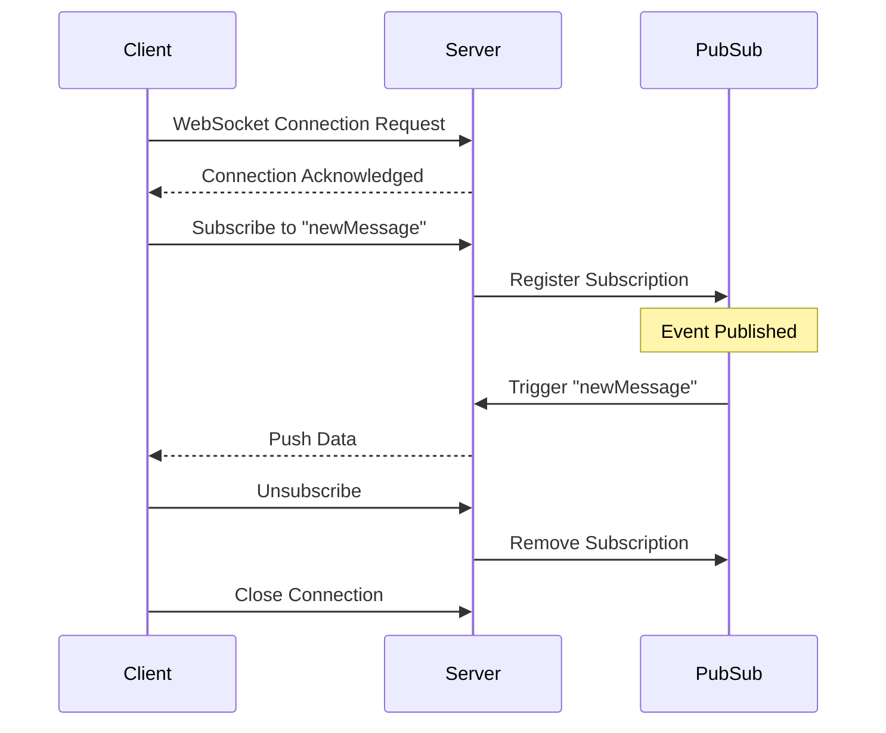
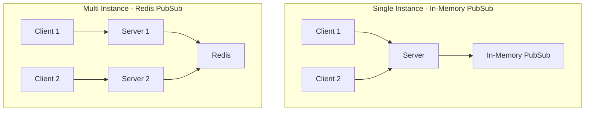

# How to Fix "Subscription Connection" Errors

Author: [nawazdhandala](https://github.com/nawazdhandala)

Tags: GraphQL, WebSocket, Subscriptions, Real-time, Node.js, Debugging

Description: Learn how to diagnose and fix common GraphQL subscription connection errors including WebSocket failures, authentication issues, and connection lifecycle problems.

---

GraphQL subscriptions enable real-time data updates over WebSocket connections. When these connections fail, clients cannot receive live updates. This guide covers common subscription connection errors and their solutions.

## How GraphQL Subscriptions Work



## Common Error: WebSocket Connection Failed

### Error Message

```
WebSocket connection to 'ws://localhost:4000/graphql' failed
```

or

```
Error: Could not connect to WebSocket endpoint
```

### Causes and Solutions

**1. Server Not Configured for WebSockets**

Apollo Server v4 requires explicit WebSocket setup:

```typescript
// server.ts
import { ApolloServer } from '@apollo/server';
import { expressMiddleware } from '@apollo/server/express4';
import { createServer } from 'http';
import { WebSocketServer } from 'ws';
import { useServer } from 'graphql-ws/lib/use/ws';
import { makeExecutableSchema } from '@graphql-tools/schema';
import express from 'express';

const app = express();
const httpServer = createServer(app);

// Create schema
const schema = makeExecutableSchema({ typeDefs, resolvers });

// Create WebSocket server
const wsServer = new WebSocketServer({
  server: httpServer,
  path: '/graphql',
});

// Set up WebSocket handling with graphql-ws
const serverCleanup = useServer(
  {
    schema,
    // Context for subscriptions
    context: async (ctx) => {
      // Access connection params for authentication
      const token = ctx.connectionParams?.authorization;
      return { user: await getUserFromToken(token) };
    },
    // Connection lifecycle hooks
    onConnect: async (ctx) => {
      console.log('Client connected');
      // Return false to reject connection
      return true;
    },
    onDisconnect: (ctx) => {
      console.log('Client disconnected');
    },
  },
  wsServer
);

// Create Apollo Server
const server = new ApolloServer({
  schema,
  plugins: [
    // Proper shutdown for the HTTP server
    {
      async serverWillStart() {
        return {
          async drainServer() {
            await serverCleanup.dispose();
          },
        };
      },
    },
  ],
});

async function start() {
  await server.start();

  app.use(
    '/graphql',
    express.json(),
    expressMiddleware(server)
  );

  const PORT = 4000;
  httpServer.listen(PORT, () => {
    console.log(`HTTP server ready at http://localhost:${PORT}/graphql`);
    console.log(`WebSocket server ready at ws://localhost:${PORT}/graphql`);
  });
}

start();
```

**2. Wrong WebSocket Protocol**

Modern GraphQL uses `graphql-ws` protocol, not the deprecated `subscriptions-transport-ws`:

```typescript
// Client setup with graphql-ws
import { createClient } from 'graphql-ws';

const wsClient = createClient({
  url: 'ws://localhost:4000/graphql',
  connectionParams: {
    authorization: `Bearer ${token}`,
  },
});
```

```typescript
// Apollo Client setup
import { ApolloClient, InMemoryCache, split, HttpLink } from '@apollo/client';
import { GraphQLWsLink } from '@apollo/client/link/subscriptions';
import { createClient } from 'graphql-ws';
import { getMainDefinition } from '@apollo/client/utilities';

// HTTP link for queries and mutations
const httpLink = new HttpLink({
  uri: 'http://localhost:4000/graphql',
});

// WebSocket link for subscriptions
const wsLink = new GraphQLWsLink(
  createClient({
    url: 'ws://localhost:4000/graphql',
    connectionParams: () => ({
      authorization: `Bearer ${getToken()}`,
    }),
  })
);

// Split based on operation type
const splitLink = split(
  ({ query }) => {
    const definition = getMainDefinition(query);
    return (
      definition.kind === 'OperationDefinition' &&
      definition.operation === 'subscription'
    );
  },
  wsLink,
  httpLink
);

const client = new ApolloClient({
  link: splitLink,
  cache: new InMemoryCache(),
});
```

**3. CORS or Proxy Issues**

For production with a reverse proxy:

```nginx
# nginx.conf
location /graphql {
    proxy_pass http://backend:4000;
    proxy_http_version 1.1;
    proxy_set_header Upgrade $http_upgrade;
    proxy_set_header Connection "upgrade";
    proxy_set_header Host $host;
    proxy_set_header X-Real-IP $remote_addr;
    proxy_read_timeout 3600s;
    proxy_send_timeout 3600s;
}
```

## Common Error: Connection Timeout

### Error Message

```
Error: Connection timed out
```

or

```
WebSocket connection closed before receiving a connection acknowledgment
```

### Solutions

**1. Server Not Acknowledging Connection**

The server must send a connection acknowledgment:

```typescript
// Server with proper acknowledgment
const serverCleanup = useServer(
  {
    schema,
    onConnect: async (ctx) => {
      // Validate connection
      const token = ctx.connectionParams?.authorization;

      if (!token) {
        // Return false rejects connection with close code 4403
        return false;
      }

      try {
        const user = await verifyToken(token);
        // Returning true or undefined acknowledges the connection
        return true;
      } catch (error) {
        // Throwing rejects with close code 4400
        throw new Error('Invalid token');
      }
    },
  },
  wsServer
);
```

**2. Client Timeout Too Short**

Increase client connection timeout:

```typescript
const wsClient = createClient({
  url: 'ws://localhost:4000/graphql',
  connectionParams: {
    authorization: `Bearer ${token}`,
  },
  // Increase timeout (default is 3000ms)
  connectionTimeout: 10000,
});
```

**3. Network Issues**

Implement retry logic:

```typescript
const wsClient = createClient({
  url: 'ws://localhost:4000/graphql',
  // Retry configuration
  retryAttempts: 5,
  retryWait: async (retries) => {
    // Exponential backoff
    await new Promise((resolve) =>
      setTimeout(resolve, Math.min(1000 * Math.pow(2, retries), 30000))
    );
  },
  // Connection params
  connectionParams: async () => ({
    authorization: `Bearer ${await refreshToken()}`,
  }),
});
```

## Common Error: Authentication Failed

### Error Message

```
Error: Forbidden
```

or

```
Connection closed with code 4403
```

### Solutions

**1. Pass Authentication in Connection Params**

WebSocket connections cannot use HTTP headers in the same way. Use `connectionParams`:

```typescript
// Client
const wsClient = createClient({
  url: 'ws://localhost:4000/graphql',
  connectionParams: {
    // Pass token in connection params
    authorization: `Bearer ${getAuthToken()}`,
    // Or pass other auth data
    apiKey: getApiKey(),
  },
});
```

```typescript
// Server - extract auth from connectionParams
const serverCleanup = useServer(
  {
    schema,
    context: async (ctx, msg, args) => {
      // Get auth from connection params
      const token = ctx.connectionParams?.authorization as string;

      if (!token) {
        throw new Error('Missing authentication');
      }

      const user = await verifyToken(token.replace('Bearer ', ''));
      return { user };
    },
  },
  wsServer
);
```

**2. Handle Token Refresh**

Reconnect when tokens expire:

```typescript
// Client with token refresh
const wsClient = createClient({
  url: 'ws://localhost:4000/graphql',
  // Called on every connection/reconnection
  connectionParams: async () => {
    // Get fresh token
    const token = await getOrRefreshToken();
    return { authorization: `Bearer ${token}` };
  },
  on: {
    connected: () => console.log('Connected'),
    closed: (event) => {
      // Check if closed due to auth failure
      if (event.code === 4403) {
        console.log('Auth failed, refreshing token...');
        refreshToken();
      }
    },
  },
});
```

## Common Error: Subscription Not Receiving Updates

### Problem

Client subscribes successfully but never receives data.

### Solutions

**1. PubSub Not Configured Correctly**

```typescript
// resolvers.ts
import { PubSub } from 'graphql-subscriptions';

// Create PubSub instance
const pubsub = new PubSub();

// Event names
const EVENTS = {
  MESSAGE_CREATED: 'MESSAGE_CREATED',
  USER_UPDATED: 'USER_UPDATED',
};

export const resolvers = {
  Mutation: {
    createMessage: async (_, args, context) => {
      const message = await db.message.create({
        data: {
          content: args.content,
          authorId: context.user.id,
        },
      });

      // Publish event - this triggers subscriptions
      pubsub.publish(EVENTS.MESSAGE_CREATED, {
        messageCreated: message,
      });

      return message;
    },
  },

  Subscription: {
    messageCreated: {
      // Must return an AsyncIterator
      subscribe: () => pubsub.asyncIterator([EVENTS.MESSAGE_CREATED]),
    },
  },
};
```

**2. Filtering Not Working**

```typescript
import { withFilter } from 'graphql-subscriptions';

export const resolvers = {
  Subscription: {
    messageCreated: {
      subscribe: withFilter(
        () => pubsub.asyncIterator([EVENTS.MESSAGE_CREATED]),
        // Filter function - return true to send update
        (payload, variables, context) => {
          // Only send to users in the same channel
          return payload.messageCreated.channelId === variables.channelId;
        }
      ),
    },
  },
};
```

**3. Using In-Memory PubSub in Production**

For multi-instance deployments, use Redis PubSub:

```typescript
// pubsub.ts
import { RedisPubSub } from 'graphql-redis-subscriptions';
import Redis from 'ioredis';

const options = {
  host: process.env.REDIS_HOST || 'localhost',
  port: parseInt(process.env.REDIS_PORT || '6379'),
  password: process.env.REDIS_PASSWORD,
  retryStrategy: (times: number) => Math.min(times * 50, 2000),
};

export const pubsub = new RedisPubSub({
  publisher: new Redis(options),
  subscriber: new Redis(options),
});
```



## Common Error: Connection Closes Unexpectedly

### Error Message

```
WebSocket closed with code 1006
```

### Solutions

**1. Implement Heartbeat/Keep-Alive**

```typescript
// Client with keep-alive
const wsClient = createClient({
  url: 'ws://localhost:4000/graphql',
  keepAlive: 10000, // Send ping every 10 seconds
});
```

```typescript
// Server with ping/pong
import { WebSocketServer } from 'ws';

const wsServer = new WebSocketServer({
  server: httpServer,
  path: '/graphql',
});

// Heartbeat to detect dead connections
const interval = setInterval(() => {
  wsServer.clients.forEach((ws) => {
    if (ws.isAlive === false) {
      return ws.terminate();
    }
    ws.isAlive = false;
    ws.ping();
  });
}, 30000);

wsServer.on('connection', (ws) => {
  ws.isAlive = true;
  ws.on('pong', () => {
    ws.isAlive = true;
  });
});

wsServer.on('close', () => {
  clearInterval(interval);
});
```

**2. Handle Disconnection Gracefully**

```typescript
// Client with reconnection handling
const wsClient = createClient({
  url: 'ws://localhost:4000/graphql',
  retryAttempts: Infinity, // Keep retrying
  shouldRetry: () => true,
  on: {
    connected: () => {
      console.log('Connected to GraphQL subscriptions');
    },
    closed: (event) => {
      console.log(`Connection closed: ${event.code} ${event.reason}`);
    },
    error: (error) => {
      console.error('WebSocket error:', error);
    },
  },
});
```

## Complete Working Example

### Schema

```graphql
# schema.graphql
type Query {
  messages(channelId: ID!): [Message!]!
}

type Mutation {
  sendMessage(channelId: ID!, content: String!): Message!
}

type Subscription {
  messageCreated(channelId: ID!): Message!
  userTyping(channelId: ID!): TypingIndicator!
}

type Message {
  id: ID!
  content: String!
  author: User!
  channelId: ID!
  createdAt: DateTime!
}

type TypingIndicator {
  userId: ID!
  userName: String!
  channelId: ID!
}

type User {
  id: ID!
  name: String!
}

scalar DateTime
```

### Server

```typescript
// server.ts
import { ApolloServer } from '@apollo/server';
import { expressMiddleware } from '@apollo/server/express4';
import { createServer } from 'http';
import { WebSocketServer } from 'ws';
import { useServer } from 'graphql-ws/lib/use/ws';
import { makeExecutableSchema } from '@graphql-tools/schema';
import { PubSub, withFilter } from 'graphql-subscriptions';
import express from 'express';

const pubsub = new PubSub();
const EVENTS = {
  MESSAGE_CREATED: 'MESSAGE_CREATED',
  USER_TYPING: 'USER_TYPING',
};

const typeDefs = `...`; // Your schema

const resolvers = {
  Query: {
    messages: async (_, { channelId }, context) => {
      return db.messages.findMany({ where: { channelId } });
    },
  },

  Mutation: {
    sendMessage: async (_, { channelId, content }, context) => {
      if (!context.user) throw new Error('Not authenticated');

      const message = await db.messages.create({
        data: {
          content,
          channelId,
          authorId: context.user.id,
        },
        include: { author: true },
      });

      // Publish to subscribers
      pubsub.publish(EVENTS.MESSAGE_CREATED, {
        messageCreated: message,
      });

      return message;
    },
  },

  Subscription: {
    messageCreated: {
      subscribe: withFilter(
        () => pubsub.asyncIterator([EVENTS.MESSAGE_CREATED]),
        (payload, variables) => {
          // Only send to subscribers of this channel
          return payload.messageCreated.channelId === variables.channelId;
        }
      ),
    },

    userTyping: {
      subscribe: withFilter(
        () => pubsub.asyncIterator([EVENTS.USER_TYPING]),
        (payload, variables) => {
          return payload.userTyping.channelId === variables.channelId;
        }
      ),
    },
  },
};

const schema = makeExecutableSchema({ typeDefs, resolvers });
const app = express();
const httpServer = createServer(app);

const wsServer = new WebSocketServer({
  server: httpServer,
  path: '/graphql',
});

const serverCleanup = useServer(
  {
    schema,
    context: async (ctx) => {
      const token = ctx.connectionParams?.authorization as string;
      if (!token) return { user: null };

      try {
        const user = await verifyToken(token.replace('Bearer ', ''));
        return { user };
      } catch {
        return { user: null };
      }
    },
    onConnect: async (ctx) => {
      console.log('Client connected');
    },
    onDisconnect: (ctx) => {
      console.log('Client disconnected');
    },
    onSubscribe: (ctx, msg) => {
      console.log(`Subscription started: ${msg.payload.operationName}`);
    },
    onComplete: (ctx, msg) => {
      console.log('Subscription completed');
    },
  },
  wsServer
);

const server = new ApolloServer({
  schema,
  plugins: [
    {
      async serverWillStart() {
        return {
          async drainServer() {
            await serverCleanup.dispose();
          },
        };
      },
    },
  ],
});

async function start() {
  await server.start();

  app.use(express.json());
  app.use('/graphql', expressMiddleware(server, {
    context: async ({ req }) => {
      const token = req.headers.authorization?.replace('Bearer ', '');
      const user = token ? await verifyToken(token) : null;
      return { user };
    },
  }));

  httpServer.listen(4000, () => {
    console.log('Server ready at http://localhost:4000/graphql');
  });
}

start();
```

### Client

```typescript
// client.ts
import { ApolloClient, InMemoryCache, split, HttpLink } from '@apollo/client';
import { GraphQLWsLink } from '@apollo/client/link/subscriptions';
import { createClient } from 'graphql-ws';
import { getMainDefinition } from '@apollo/client/utilities';

const httpLink = new HttpLink({
  uri: 'http://localhost:4000/graphql',
  headers: {
    authorization: `Bearer ${getToken()}`,
  },
});

const wsLink = new GraphQLWsLink(
  createClient({
    url: 'ws://localhost:4000/graphql',
    connectionParams: () => ({
      authorization: `Bearer ${getToken()}`,
    }),
    retryAttempts: 5,
    on: {
      connected: () => console.log('WebSocket connected'),
      error: (err) => console.error('WebSocket error', err),
    },
  })
);

const link = split(
  ({ query }) => {
    const def = getMainDefinition(query);
    return def.kind === 'OperationDefinition' && def.operation === 'subscription';
  },
  wsLink,
  httpLink
);

export const client = new ApolloClient({
  link,
  cache: new InMemoryCache(),
});
```

## Debugging Checklist

| Issue | Check |
|-------|-------|
| **Connection fails** | Server WebSocket setup, correct URL, CORS |
| **Auth fails** | Token in connectionParams, token validity |
| **No updates** | PubSub publish/subscribe, filter logic |
| **Disconnects** | Keep-alive, heartbeat, load balancer timeout |
| **Multi-instance** | Redis PubSub instead of in-memory |

GraphQL subscriptions require proper WebSocket configuration on both client and server. Use the `graphql-ws` library for modern implementations, handle authentication through connection parameters, and implement proper error handling and reconnection logic for production reliability.
