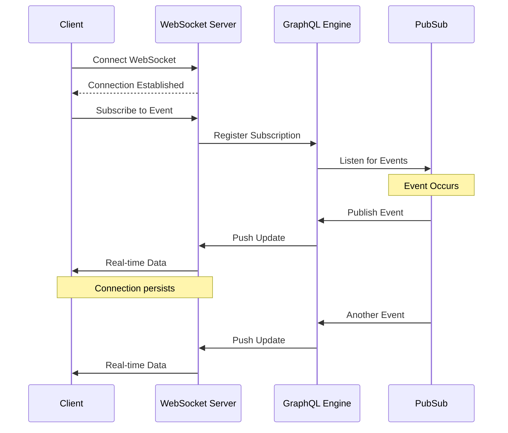
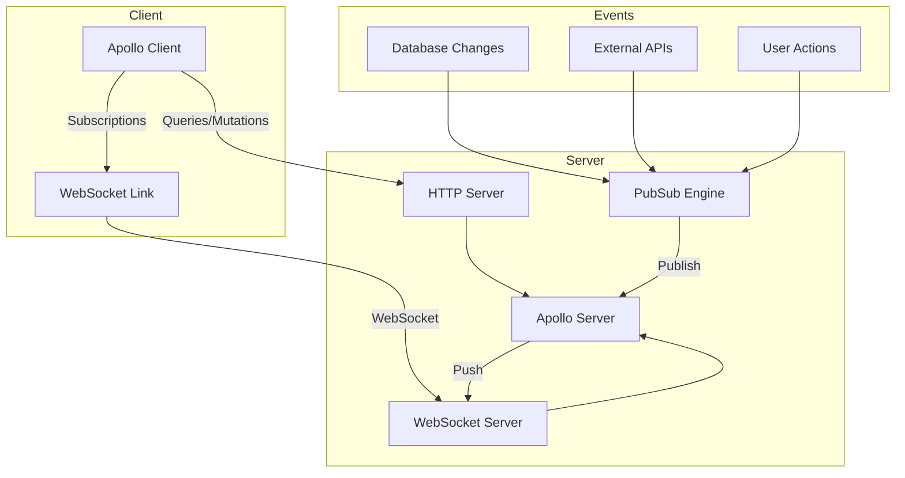
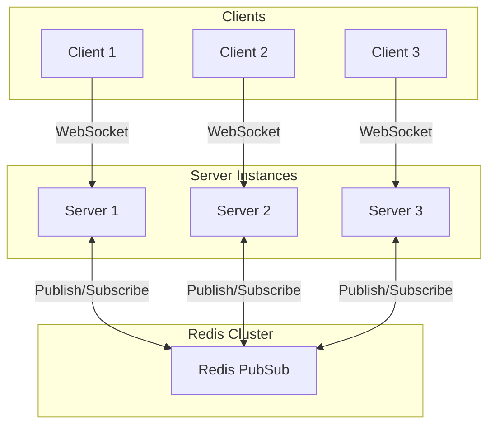

# How to Configure GraphQL Subscriptions with WebSockets

Author: [nawazdhandala](https://www.github.com/nawazdhandala)

Tags: GraphQL, WebSockets, Subscriptions, Real-time, Apollo Server, Node.js

Description: Learn how to set up GraphQL subscriptions with WebSockets for real-time data updates using Apollo Server and graphql-ws.

---

GraphQL subscriptions enable real-time communication between clients and servers, allowing clients to receive updates whenever specific events occur. This guide walks through configuring subscriptions using WebSockets with Apollo Server and the `graphql-ws` library.

## Understanding GraphQL Subscriptions

Unlike queries and mutations that follow a request-response pattern, subscriptions maintain a persistent connection for real-time updates.



## Setting Up the Server

First, install the required dependencies for subscriptions.

```bash
# Install Apollo Server, Express, and subscription dependencies
# graphql-ws is the modern WebSocket implementation for GraphQL
npm install @apollo/server express graphql graphql-ws ws
npm install @graphql-tools/schema
```

### Basic Server Configuration

Here is a complete server setup with subscription support.

```javascript
// server.js - Apollo Server with WebSocket subscriptions
import { ApolloServer } from '@apollo/server';
import { expressMiddleware } from '@apollo/server/express4';
import { ApolloServerPluginDrainHttpServer } from '@apollo/server/plugin/drainHttpServer';
import { createServer } from 'http';
import express from 'express';
import { makeExecutableSchema } from '@graphql-tools/schema';
import { WebSocketServer } from 'ws';
import { useServer } from 'graphql-ws/lib/use/ws';
import { PubSub } from 'graphql-subscriptions';

// Create a PubSub instance for publishing events
// In production, use a distributed PubSub like Redis
const pubsub = new PubSub();

// Define GraphQL type definitions
const typeDefs = `#graphql
  type Message {
    id: ID!
    content: String!
    author: String!
    createdAt: String!
  }

  type Query {
    messages: [Message!]!
  }

  type Mutation {
    sendMessage(content: String!, author: String!): Message!
  }

  type Subscription {
    # Subscribe to new messages
    # The resolver will push updates whenever a message is sent
    messageCreated: Message!
  }
`;

// In-memory message storage (use a database in production)
const messages = [];

// Define resolvers including subscription resolver
const resolvers = {
  Query: {
    messages: () => messages,
  },

  Mutation: {
    sendMessage: (_, { content, author }) => {
      // Create the new message
      const message = {
        id: String(messages.length + 1),
        content,
        author,
        createdAt: new Date().toISOString(),
      };

      // Store the message
      messages.push(message);

      // Publish the event to all subscribers
      // 'MESSAGE_CREATED' is the event name that matches the subscription
      pubsub.publish('MESSAGE_CREATED', { messageCreated: message });

      return message;
    },
  },

  Subscription: {
    messageCreated: {
      // The subscribe function returns an AsyncIterator
      // This iterator yields values whenever the event is published
      subscribe: () => pubsub.asyncIterator(['MESSAGE_CREATED']),
    },
  },
};

// Create executable schema
const schema = makeExecutableSchema({ typeDefs, resolvers });

// Create Express app and HTTP server
const app = express();
const httpServer = createServer(app);

// Create WebSocket server for subscriptions
// The server listens on the same port as HTTP but handles WS protocol
const wsServer = new WebSocketServer({
  server: httpServer,
  // Path where WebSocket connections will be accepted
  path: '/graphql',
});

// Set up graphql-ws with the WebSocket server
// This handles the GraphQL subscription protocol over WebSocket
const serverCleanup = useServer({ schema }, wsServer);

// Create Apollo Server with proper shutdown handling
const server = new ApolloServer({
  schema,
  plugins: [
    // Proper shutdown for the HTTP server
    ApolloServerPluginDrainHttpServer({ httpServer }),
    // Proper shutdown for the WebSocket server
    {
      async serverWillStart() {
        return {
          async drainServer() {
            // Close all WebSocket connections gracefully
            await serverCleanup.dispose();
          },
        };
      },
    },
  ],
});

// Start the server
await server.start();

// Apply middleware
app.use('/graphql', express.json(), expressMiddleware(server));

// Start listening
const PORT = 4000;
httpServer.listen(PORT, () => {
  console.log(`Server ready at http://localhost:${PORT}/graphql`);
  console.log(`Subscriptions ready at ws://localhost:${PORT}/graphql`);
});
```

## Subscription Architecture

Understanding the architecture helps when debugging connection issues.



## Implementing Advanced Subscriptions

Here are more advanced subscription patterns for real-world applications.

### Filtering Subscriptions

Allow clients to subscribe to specific events using arguments.

```javascript
// filtered-subscriptions.js - Subscriptions with filtering
import { withFilter } from 'graphql-subscriptions';

const typeDefs = `#graphql
  type Subscription {
    # Subscribe to messages in a specific chat room
    messageCreated(roomId: ID!): Message!

    # Subscribe to updates for a specific user
    userStatusChanged(userId: ID!): UserStatus!
  }

  type UserStatus {
    userId: ID!
    status: String!
    lastSeen: String
  }
`;

const resolvers = {
  Subscription: {
    messageCreated: {
      // withFilter wraps the subscription to filter events
      // Only matching events are sent to the subscriber
      subscribe: withFilter(
        // First argument: the base subscription
        () => pubsub.asyncIterator(['MESSAGE_CREATED']),
        // Second argument: filter function
        // Returns true if the event should be sent to this subscriber
        (payload, variables) => {
          // payload: the published event data
          // variables: the subscription arguments from the client
          return payload.messageCreated.roomId === variables.roomId;
        }
      ),
    },

    userStatusChanged: {
      subscribe: withFilter(
        () => pubsub.asyncIterator(['USER_STATUS_CHANGED']),
        (payload, variables) => {
          // Only send updates for the requested user
          return payload.userStatusChanged.userId === variables.userId;
        }
      ),
    },
  },
};
```

### Authentication in Subscriptions

Implement authentication for WebSocket connections.

```javascript
// auth-subscriptions.js - Authentication for subscriptions
import { useServer } from 'graphql-ws/lib/use/ws';
import jwt from 'jsonwebtoken';

// Configure graphql-ws with authentication
const serverCleanup = useServer(
  {
    schema,

    // Called when a client connects
    // Use this for authentication
    onConnect: async (ctx) => {
      // Get the authentication token from connection params
      // Clients send this when establishing the WebSocket connection
      const token = ctx.connectionParams?.authToken;

      if (!token) {
        // Return false to reject the connection
        // This will close the WebSocket with an error
        return false;
      }

      try {
        // Verify the JWT token
        const user = jwt.verify(token, process.env.JWT_SECRET);

        // Return context that will be available in resolvers
        // This is similar to context in HTTP requests
        return { user };
      } catch (error) {
        console.error('Invalid token:', error.message);
        return false;
      }
    },

    // Called for each subscription operation
    // Use this for authorization
    onSubscribe: async (ctx, msg) => {
      // ctx.extra contains the data returned from onConnect
      const user = ctx.extra?.user;

      if (!user) {
        // Reject subscriptions from unauthenticated users
        throw new Error('Unauthorized');
      }

      // Log subscription for monitoring
      console.log(`User ${user.id} subscribed to: ${msg.payload.operationName}`);
    },

    // Called when a client disconnects
    onDisconnect: (ctx) => {
      const user = ctx.extra?.user;
      if (user) {
        console.log(`User ${user.id} disconnected`);
        // Update user's online status
        pubsub.publish('USER_STATUS_CHANGED', {
          userStatusChanged: { userId: user.id, status: 'offline' },
        });
      }
    },
  },
  wsServer
);
```

## Client-Side Configuration

Set up Apollo Client to work with subscriptions.

```javascript
// apollo-client.js - Client configuration with subscription support
import { ApolloClient, InMemoryCache, split, HttpLink } from '@apollo/client';
import { GraphQLWsLink } from '@apollo/client/link/subscriptions';
import { createClient } from 'graphql-ws';
import { getMainDefinition } from '@apollo/client/utilities';

// Create HTTP link for queries and mutations
const httpLink = new HttpLink({
  uri: 'http://localhost:4000/graphql',
});

// Create WebSocket link for subscriptions
const wsLink = new GraphQLWsLink(
  createClient({
    url: 'ws://localhost:4000/graphql',
    // Connection parameters sent to the server
    connectionParams: {
      // Include authentication token
      authToken: localStorage.getItem('authToken'),
    },
    // Reconnection configuration
    retryAttempts: 5,
    // Called when connection is established
    on: {
      connected: () => console.log('WebSocket connected'),
      closed: () => console.log('WebSocket closed'),
      error: (error) => console.error('WebSocket error:', error),
    },
  })
);

// Split links based on operation type
// Subscriptions go through WebSocket, everything else through HTTP
const splitLink = split(
  ({ query }) => {
    const definition = getMainDefinition(query);
    return (
      definition.kind === 'OperationDefinition' &&
      definition.operation === 'subscription'
    );
  },
  wsLink,  // Use this link for subscriptions
  httpLink // Use this link for queries and mutations
);

// Create Apollo Client
const client = new ApolloClient({
  link: splitLink,
  cache: new InMemoryCache(),
});

export default client;
```

### React Component with Subscription

Here is how to use subscriptions in a React component.

```jsx
// ChatRoom.jsx - React component using subscriptions
import { useQuery, useMutation, useSubscription, gql } from '@apollo/client';
import { useState, useEffect } from 'react';

// Query to get existing messages
const GET_MESSAGES = gql`
  query GetMessages {
    messages {
      id
      content
      author
      createdAt
    }
  }
`;

// Mutation to send a new message
const SEND_MESSAGE = gql`
  mutation SendMessage($content: String!, $author: String!) {
    sendMessage(content: $content, author: $author) {
      id
      content
      author
      createdAt
    }
  }
`;

// Subscription for new messages
const MESSAGE_SUBSCRIPTION = gql`
  subscription OnMessageCreated {
    messageCreated {
      id
      content
      author
      createdAt
    }
  }
`;

function ChatRoom({ currentUser }) {
  const [newMessage, setNewMessage] = useState('');

  // Fetch existing messages
  const { data, loading } = useQuery(GET_MESSAGES);

  // Mutation hook for sending messages
  const [sendMessage] = useMutation(SEND_MESSAGE);

  // Subscribe to new messages
  // The subscription automatically updates when new messages arrive
  const { data: subscriptionData } = useSubscription(MESSAGE_SUBSCRIPTION, {
    // Called whenever a new message is received
    onData: ({ client, data }) => {
      // Update the cache with the new message
      // This triggers a re-render with the updated message list
      const newMessage = data.data.messageCreated;

      // Read current messages from cache
      const existingMessages = client.readQuery({ query: GET_MESSAGES });

      // Write updated messages to cache
      client.writeQuery({
        query: GET_MESSAGES,
        data: {
          messages: [...existingMessages.messages, newMessage],
        },
      });
    },
  });

  // Handle form submission
  const handleSubmit = async (e) => {
    e.preventDefault();
    if (!newMessage.trim()) return;

    await sendMessage({
      variables: {
        content: newMessage,
        author: currentUser,
      },
    });

    setNewMessage('');
  };

  if (loading) return <p>Loading messages...</p>;

  return (
    <div className="chat-room">
      <h2>Chat Room</h2>

      {/* Message list */}
      <div className="messages">
        {data?.messages.map((message) => (
          <div key={message.id} className="message">
            <strong>{message.author}:</strong> {message.content}
            <span className="time">
              {new Date(message.createdAt).toLocaleTimeString()}
            </span>
          </div>
        ))}
      </div>

      {/* Message input form */}
      <form onSubmit={handleSubmit}>
        <input
          type="text"
          value={newMessage}
          onChange={(e) => setNewMessage(e.target.value)}
          placeholder="Type a message..."
        />
        <button type="submit">Send</button>
      </form>
    </div>
  );
}

export default ChatRoom;
```

## Production Considerations

### Using Redis PubSub for Scalability

In production with multiple server instances, use Redis for PubSub.

```javascript
// redis-pubsub.js - Redis-based PubSub for distributed systems
import { RedisPubSub } from 'graphql-redis-subscriptions';
import Redis from 'ioredis';

// Configure Redis clients for pub and sub
// Using separate clients is required by Redis for pub/sub
const options = {
  host: process.env.REDIS_HOST || 'localhost',
  port: parseInt(process.env.REDIS_PORT) || 6379,
  password: process.env.REDIS_PASSWORD,
  // Retry strategy for connection failures
  retryStrategy: (times) => {
    return Math.min(times * 50, 2000);
  },
};

// Create Redis PubSub instance
// This allows subscriptions to work across multiple server instances
const pubsub = new RedisPubSub({
  publisher: new Redis(options),
  subscriber: new Redis(options),
});

export { pubsub };
```



### Connection Monitoring and Health Checks

Monitor WebSocket connections for operational visibility.

```javascript
// monitoring.js - WebSocket connection monitoring
const activeConnections = new Map();

const serverCleanup = useServer(
  {
    schema,

    onConnect: async (ctx) => {
      // Generate a unique connection ID
      const connectionId = crypto.randomUUID();
      ctx.extra = { connectionId };

      // Track the connection
      activeConnections.set(connectionId, {
        connectedAt: new Date(),
        subscriptions: [],
      });

      console.log(`Connection opened: ${connectionId}`);
      console.log(`Active connections: ${activeConnections.size}`);

      return true;
    },

    onSubscribe: (ctx, msg) => {
      const connectionId = ctx.extra.connectionId;
      const connection = activeConnections.get(connectionId);

      if (connection) {
        connection.subscriptions.push({
          operationName: msg.payload.operationName,
          subscribedAt: new Date(),
        });
      }
    },

    onDisconnect: (ctx) => {
      const connectionId = ctx.extra?.connectionId;

      if (connectionId) {
        activeConnections.delete(connectionId);
        console.log(`Connection closed: ${connectionId}`);
        console.log(`Active connections: ${activeConnections.size}`);
      }
    },
  },
  wsServer
);

// Health check endpoint
app.get('/health', (req, res) => {
  res.json({
    status: 'healthy',
    activeConnections: activeConnections.size,
    connections: Array.from(activeConnections.entries()).map(([id, data]) => ({
      id,
      connectedAt: data.connectedAt,
      subscriptionCount: data.subscriptions.length,
    })),
  });
});
```

## Troubleshooting Common Issues

### Connection Drops

Handle connection drops gracefully on the client.

```javascript
// resilient-client.js - Client with reconnection handling
import { createClient } from 'graphql-ws';

const client = createClient({
  url: 'ws://localhost:4000/graphql',

  // Reconnection settings
  retryAttempts: Infinity, // Keep trying to reconnect

  // Custom retry wait function
  // Implements exponential backoff
  retryWait: async (retries) => {
    // Wait longer between each retry, up to 30 seconds
    const delay = Math.min(1000 * Math.pow(2, retries), 30000);
    await new Promise((resolve) => setTimeout(resolve, delay));
  },

  // Connection acknowledgement timeout
  connectionAckWaitTimeout: 10000,

  // Event handlers for monitoring connection state
  on: {
    connected: (socket) => {
      console.log('Connected to WebSocket server');
    },

    closed: (event) => {
      console.log('WebSocket connection closed:', event.reason);
    },

    error: (error) => {
      console.error('WebSocket error:', error);
    },

    // Called when the connection is being retried
    connecting: () => {
      console.log('Attempting to connect...');
    },
  },
});
```

## Summary

Configuring GraphQL subscriptions with WebSockets involves:

1. Setting up a WebSocket server alongside your HTTP server
2. Using `graphql-ws` for the subscription protocol
3. Implementing PubSub for event distribution
4. Configuring Apollo Client with split links
5. Adding authentication and filtering as needed
6. Using Redis PubSub for multi-instance deployments

With proper configuration, subscriptions enable powerful real-time features in your GraphQL API.

**Related Reading:**

- [How to Handle File Uploads in GraphQL](https://oneuptime.com/blog/post/2026-01-24-graphql-file-uploads/view)
- [How to Fix "Maximum Query Depth" Errors in GraphQL](https://oneuptime.com/blog/post/2026-01-24-graphql-maximum-query-depth/view)
- [How to Handle Pagination in GraphQL APIs](https://oneuptime.com/blog/post/2026-01-24-graphql-pagination/view)
