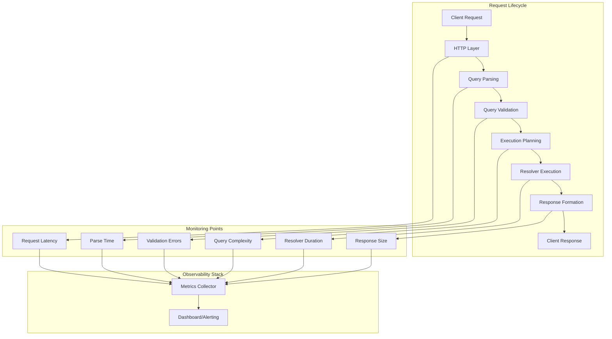
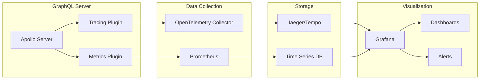

# How to Configure GraphQL Tracing and Monitoring

Author: [nawazdhandala](https://www.github.com/nawazdhandala)

Tags: GraphQL, Tracing, Monitoring, Observability, Apollo Server, Performance, OpenTelemetry

Description: Learn how to set up comprehensive tracing and monitoring for GraphQL APIs to track query performance, resolver execution, and identify bottlenecks.

---

Monitoring GraphQL APIs requires a different approach than traditional REST endpoints. With GraphQL, all requests go through a single endpoint, making HTTP-level monitoring insufficient. You need visibility into query parsing, validation, resolver execution, and field-level performance to effectively debug issues and optimize your API.

This guide covers setting up comprehensive tracing and monitoring for GraphQL servers, including Apollo Server tracing plugins, custom metrics collection, and integration with observability platforms.

## Understanding GraphQL Monitoring Architecture

GraphQL request processing involves multiple stages, each of which should be monitored for complete visibility.



## Setting Up Apollo Server Tracing

Apollo Server provides built-in tracing capabilities through plugins. Here is how to configure comprehensive tracing.

```typescript
// Import required dependencies
import { ApolloServer } from '@apollo/server';
import { expressMiddleware } from '@apollo/server/express4';
import express from 'express';

// Define a custom tracing plugin that captures execution details
const tracingPlugin = {
  // Called when the server starts processing a request
  async requestDidStart(requestContext) {
    // Record the start time for overall request duration
    const requestStart = Date.now();

    // Extract operation details for logging
    const operationName = requestContext.request.operationName || 'anonymous';

    console.log(`[GraphQL] Starting operation: ${operationName}`);

    return {
      // Called after the query has been parsed
      async parsingDidStart() {
        const parseStart = Date.now();
        return async (err) => {
          const parseTime = Date.now() - parseStart;
          // Log parse time - useful for identifying complex queries
          console.log(`[GraphQL] Parse time: ${parseTime}ms`);

          if (err) {
            console.error(`[GraphQL] Parse error: ${err.message}`);
          }
        };
      },

      // Called after query validation
      async validationDidStart() {
        const validationStart = Date.now();
        return async (errs) => {
          const validationTime = Date.now() - validationStart;
          console.log(`[GraphQL] Validation time: ${validationTime}ms`);

          if (errs && errs.length > 0) {
            // Log validation errors for debugging schema issues
            errs.forEach(err => {
              console.error(`[GraphQL] Validation error: ${err.message}`);
            });
          }
        };
      },

      // Called when execution begins
      async executionDidStart() {
        const executionStart = Date.now();
        return {
          // Called for each resolver execution
          async willResolveField({ info }) {
            const fieldStart = Date.now();
            // Return a function that runs after the field resolves
            return (error, result) => {
              const fieldTime = Date.now() - fieldStart;
              // Log slow resolvers for performance optimization
              if (fieldTime > 100) {
                console.warn(
                  `[GraphQL] Slow resolver: ${info.parentType.name}.${info.fieldName} took ${fieldTime}ms`
                );
              }
            };
          },
          async executionDidEnd() {
            const executionTime = Date.now() - executionStart;
            console.log(`[GraphQL] Execution time: ${executionTime}ms`);
          }
        };
      },

      // Called when the request completes
      async willSendResponse(requestContext) {
        const totalTime = Date.now() - requestStart;
        console.log(`[GraphQL] Total request time: ${totalTime}ms`);

        // Add timing information to response extensions
        requestContext.response.extensions = {
          ...requestContext.response.extensions,
          timing: {
            total: totalTime
          }
        };
      }
    };
  }
};

// Create Apollo Server with the tracing plugin
const server = new ApolloServer({
  typeDefs,
  resolvers,
  plugins: [tracingPlugin]
});
```

## Collecting Custom Metrics with Prometheus

For production monitoring, you need to collect metrics that can be aggregated and visualized. Here is how to integrate Prometheus metrics collection.

```typescript
// Import Prometheus client library
import { Counter, Histogram, Registry } from 'prom-client';

// Create a custom registry for GraphQL metrics
const graphqlRegistry = new Registry();

// Counter for tracking total operations by type and name
const operationCounter = new Counter({
  name: 'graphql_operations_total',
  help: 'Total number of GraphQL operations',
  labelNames: ['operation_type', 'operation_name', 'status'],
  registers: [graphqlRegistry]
});

// Histogram for tracking operation duration distribution
const operationDuration = new Histogram({
  name: 'graphql_operation_duration_seconds',
  help: 'Duration of GraphQL operations in seconds',
  labelNames: ['operation_type', 'operation_name'],
  // Define buckets for latency distribution
  buckets: [0.01, 0.05, 0.1, 0.25, 0.5, 1, 2.5, 5, 10],
  registers: [graphqlRegistry]
});

// Histogram for individual resolver execution times
const resolverDuration = new Histogram({
  name: 'graphql_resolver_duration_seconds',
  help: 'Duration of GraphQL resolver execution',
  labelNames: ['parent_type', 'field_name'],
  buckets: [0.001, 0.005, 0.01, 0.025, 0.05, 0.1, 0.25, 0.5, 1],
  registers: [graphqlRegistry]
});

// Counter for tracking errors by type
const errorCounter = new Counter({
  name: 'graphql_errors_total',
  help: 'Total number of GraphQL errors',
  labelNames: ['error_type', 'operation_name'],
  registers: [graphqlRegistry]
});

// Create the metrics collection plugin
const metricsPlugin = {
  async requestDidStart(requestContext) {
    const startTime = process.hrtime.bigint();

    // Determine operation type from the parsed document
    let operationType = 'unknown';
    let operationName = requestContext.request.operationName || 'anonymous';

    return {
      async didResolveOperation(context) {
        // Extract the actual operation type after parsing
        operationType = context.operation.operation;
      },

      async executionDidStart() {
        return {
          willResolveField({ info }) {
            const fieldStart = process.hrtime.bigint();
            return () => {
              // Calculate resolver duration in seconds
              const duration = Number(process.hrtime.bigint() - fieldStart) / 1e9;
              resolverDuration.observe(
                { parent_type: info.parentType.name, field_name: info.fieldName },
                duration
              );
            };
          }
        };
      },

      async willSendResponse(context) {
        // Calculate total operation duration
        const duration = Number(process.hrtime.bigint() - startTime) / 1e9;

        // Determine if the operation was successful
        const hasErrors = context.errors && context.errors.length > 0;
        const status = hasErrors ? 'error' : 'success';

        // Record operation metrics
        operationCounter.inc({ operation_type: operationType, operation_name: operationName, status });
        operationDuration.observe({ operation_type: operationType, operation_name: operationName }, duration);

        // Record individual errors
        if (hasErrors) {
          context.errors.forEach(error => {
            const errorType = error.extensions?.code || 'INTERNAL_ERROR';
            errorCounter.inc({ error_type: errorType, operation_name: operationName });
          });
        }
      }
    };
  }
};

// Expose metrics endpoint for Prometheus scraping
app.get('/metrics', async (req, res) => {
  res.set('Content-Type', graphqlRegistry.contentType);
  res.end(await graphqlRegistry.metrics());
});
```

## Integrating with OpenTelemetry

OpenTelemetry provides vendor-neutral instrumentation for distributed tracing. Here is a comprehensive setup.

```typescript
// Import OpenTelemetry packages
import { NodeSDK } from '@opentelemetry/sdk-node';
import { getNodeAutoInstrumentations } from '@opentelemetry/auto-instrumentations-node';
import { OTLPTraceExporter } from '@opentelemetry/exporter-trace-otlp-http';
import { Resource } from '@opentelemetry/resources';
import { SemanticResourceAttributes } from '@opentelemetry/semantic-conventions';
import { trace, SpanStatusCode } from '@opentelemetry/api';

// Initialize the OpenTelemetry SDK
const sdk = new NodeSDK({
  resource: new Resource({
    [SemanticResourceAttributes.SERVICE_NAME]: 'graphql-api',
    [SemanticResourceAttributes.SERVICE_VERSION]: '1.0.0',
    [SemanticResourceAttributes.DEPLOYMENT_ENVIRONMENT]: process.env.NODE_ENV
  }),
  traceExporter: new OTLPTraceExporter({
    // Configure your collector endpoint
    url: process.env.OTEL_EXPORTER_OTLP_ENDPOINT || 'http://localhost:4318/v1/traces'
  }),
  instrumentations: [getNodeAutoInstrumentations()]
});

// Start the SDK before your application
sdk.start();

// Get a tracer for manual instrumentation
const tracer = trace.getTracer('graphql-server');

// Create an OpenTelemetry plugin for Apollo Server
const openTelemetryPlugin = {
  async requestDidStart(requestContext) {
    // Start a new span for the GraphQL operation
    const span = tracer.startSpan('graphql.request', {
      attributes: {
        'graphql.operation.name': requestContext.request.operationName || 'anonymous',
        'graphql.document': requestContext.request.query
      }
    });

    return {
      async didResolveOperation(context) {
        // Add operation type after parsing
        span.setAttribute('graphql.operation.type', context.operation.operation);
      },

      async executionDidStart() {
        return {
          willResolveField({ info }) {
            // Create child spans for each resolver
            const resolverSpan = tracer.startSpan(
              `resolve.${info.parentType.name}.${info.fieldName}`,
              { parent: trace.setSpan(trace.active(), span) }
            );

            return (error) => {
              if (error) {
                resolverSpan.setStatus({ code: SpanStatusCode.ERROR, message: error.message });
                resolverSpan.recordException(error);
              }
              resolverSpan.end();
            };
          }
        };
      },

      async didEncounterErrors(context) {
        // Record all errors on the span
        span.setStatus({ code: SpanStatusCode.ERROR });
        context.errors.forEach(error => {
          span.recordException(error);
        });
      },

      async willSendResponse() {
        span.end();
      }
    };
  }
};
```

## Building a Monitoring Dashboard

Here is a diagram showing a typical GraphQL monitoring dashboard architecture.



## Query Complexity Monitoring

Monitoring query complexity helps prevent resource exhaustion from expensive queries.

```typescript
// Import graphql-query-complexity for cost analysis
import { getComplexity, simpleEstimator, fieldExtensionsEstimator } from 'graphql-query-complexity';

// Define maximum allowed complexity
const MAX_COMPLEXITY = 1000;

// Create a complexity monitoring plugin
const complexityPlugin = {
  async requestDidStart() {
    return {
      async didResolveOperation(context) {
        // Calculate query complexity
        const complexity = getComplexity({
          schema: context.schema,
          operationName: context.request.operationName,
          query: context.document,
          variables: context.request.variables,
          estimators: [
            // Use field extensions for custom costs
            fieldExtensionsEstimator(),
            // Default estimator counts each field as 1
            simpleEstimator({ defaultComplexity: 1 })
          ]
        });

        // Log complexity for monitoring
        console.log(`[GraphQL] Query complexity: ${complexity}`);

        // Record metric for tracking complexity distribution
        queryComplexityHistogram.observe(
          { operation_name: context.request.operationName || 'anonymous' },
          complexity
        );

        // Reject queries that exceed the limit
        if (complexity > MAX_COMPLEXITY) {
          throw new Error(
            `Query complexity of ${complexity} exceeds maximum allowed complexity of ${MAX_COMPLEXITY}`
          );
        }
      }
    };
  }
};

// Add complexity hints to your schema
const typeDefs = `
  type Query {
    # Simple query with default complexity
    user(id: ID!): User

    # Expensive query with custom complexity
    users(
      first: Int = 10
      filter: UserFilter
    ): [User!]! @complexity(value: 10, multipliers: ["first"])
  }

  type User {
    id: ID!
    name: String!
    email: String!
    # Expensive relation with custom complexity
    posts(first: Int = 10): [Post!]! @complexity(value: 5, multipliers: ["first"])
  }
`;
```

## Setting Up Alerting Rules

Configure alerts for GraphQL-specific issues.

```yaml
# prometheus-alerts.yml
# Alert rules for GraphQL API monitoring

groups:
  - name: graphql_alerts
    rules:
      # Alert when error rate exceeds threshold
      - alert: GraphQLHighErrorRate
        expr: |
          sum(rate(graphql_errors_total[5m])) /
          sum(rate(graphql_operations_total[5m])) > 0.05
        for: 5m
        labels:
          severity: warning
        annotations:
          summary: High GraphQL error rate detected
          description: Error rate is {{ $value | humanizePercentage }} over the last 5 minutes

      # Alert when latency exceeds threshold
      - alert: GraphQLHighLatency
        expr: |
          histogram_quantile(0.95,
            sum(rate(graphql_operation_duration_seconds_bucket[5m])) by (le)
          ) > 2
        for: 5m
        labels:
          severity: warning
        annotations:
          summary: GraphQL p95 latency is high
          description: 95th percentile latency is {{ $value }}s

      # Alert for slow resolvers
      - alert: GraphQLSlowResolver
        expr: |
          histogram_quantile(0.95,
            sum(rate(graphql_resolver_duration_seconds_bucket[5m])) by (le, parent_type, field_name)
          ) > 0.5
        for: 10m
        labels:
          severity: warning
        annotations:
          summary: Slow GraphQL resolver detected
          description: Resolver {{ $labels.parent_type }}.{{ $labels.field_name }} p95 is {{ $value }}s

      # Alert for high complexity queries
      - alert: GraphQLHighComplexityQueries
        expr: |
          histogram_quantile(0.95,
            sum(rate(graphql_query_complexity_bucket[5m])) by (le)
          ) > 500
        for: 5m
        labels:
          severity: info
        annotations:
          summary: High complexity GraphQL queries detected
          description: 95th percentile query complexity is {{ $value }}
```

## Complete Monitoring Setup Example

Here is a complete example combining all monitoring capabilities.

```typescript
// server.ts - Complete GraphQL server with monitoring
import { ApolloServer } from '@apollo/server';
import { expressMiddleware } from '@apollo/server/express4';
import express from 'express';
import { typeDefs, resolvers } from './schema';

// Import all monitoring plugins
import { tracingPlugin } from './plugins/tracing';
import { metricsPlugin, graphqlRegistry } from './plugins/metrics';
import { openTelemetryPlugin } from './plugins/opentelemetry';
import { complexityPlugin } from './plugins/complexity';

// Create Express app
const app = express();

// Create Apollo Server with all monitoring plugins
const server = new ApolloServer({
  typeDefs,
  resolvers,
  plugins: [
    // Order matters - tracing should come first
    tracingPlugin,
    metricsPlugin,
    openTelemetryPlugin,
    complexityPlugin
  ],
  // Include stack traces in development
  includeStacktraceInErrorResponses: process.env.NODE_ENV !== 'production'
});

// Start the server
async function startServer() {
  await server.start();

  // Parse JSON bodies
  app.use(express.json());

  // Health check endpoint
  app.get('/health', (req, res) => {
    res.json({ status: 'healthy' });
  });

  // Metrics endpoint for Prometheus
  app.get('/metrics', async (req, res) => {
    res.set('Content-Type', graphqlRegistry.contentType);
    res.end(await graphqlRegistry.metrics());
  });

  // GraphQL endpoint
  app.use('/graphql', expressMiddleware(server, {
    context: async ({ req }) => ({
      // Include request ID for trace correlation
      requestId: req.headers['x-request-id'] || crypto.randomUUID()
    })
  }));

  const PORT = process.env.PORT || 4000;
  app.listen(PORT, () => {
    console.log(`GraphQL server running at http://localhost:${PORT}/graphql`);
    console.log(`Metrics available at http://localhost:${PORT}/metrics`);
  });
}

startServer();
```

## Monitoring Best Practices

Follow these guidelines for effective GraphQL monitoring:

1. **Track operation names**: Always include operation names in your queries to make metrics meaningful
2. **Set complexity limits**: Prevent resource exhaustion by limiting query complexity
3. **Monitor resolver performance**: Identify slow resolvers that need optimization
4. **Use sampling in production**: Reduce overhead by sampling traces at high traffic volumes
5. **Correlate logs and traces**: Include trace IDs in log messages for easy debugging
6. **Alert on anomalies**: Set up alerts for error rate spikes and latency increases
7. **Monitor cache hit rates**: Track DataLoader and caching effectiveness

With comprehensive tracing and monitoring in place, you gain the visibility needed to maintain a performant and reliable GraphQL API. The combination of metrics, traces, and logs provides a complete picture of your API's health and helps you quickly identify and resolve issues.
