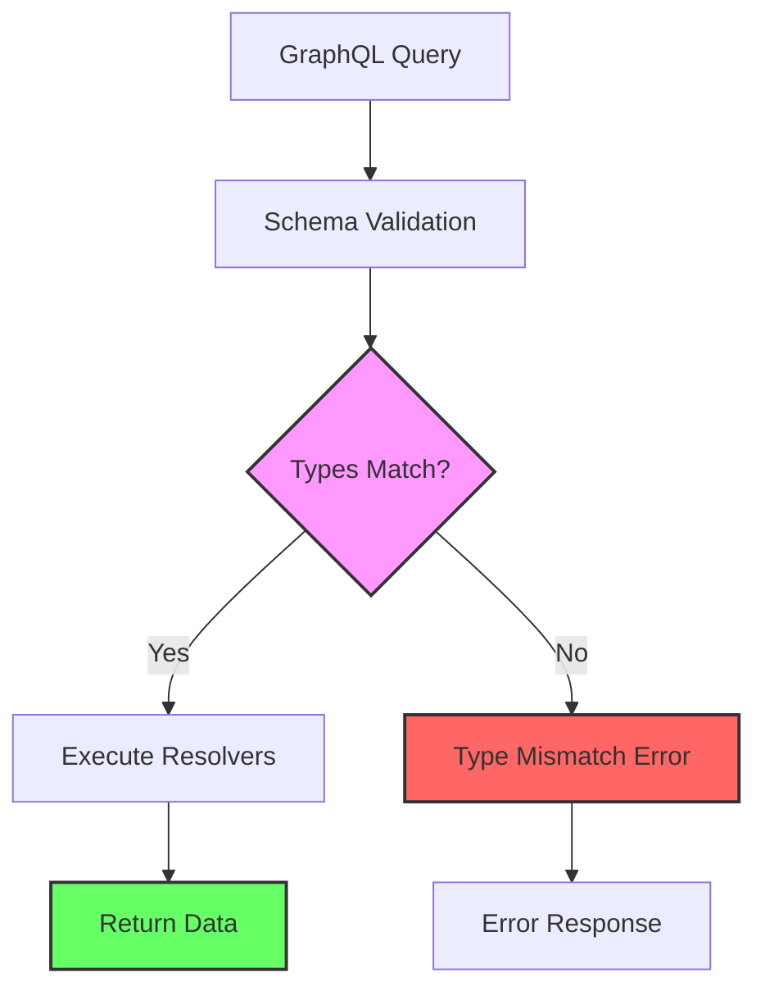
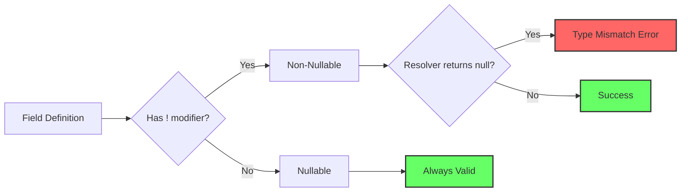
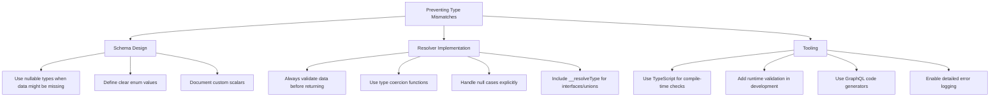

# How to Fix "Type Mismatch" Errors in GraphQL Schema

Author: [nawazdhandala](https://github.com/nawazdhandala)

Tags: GraphQL, Schema, Type System, API Development, Debugging, TypeScript, JavaScript

Description: Learn how to diagnose and fix common type mismatch errors in GraphQL schemas with practical examples and solutions.

---

Type mismatch errors are among the most common issues developers encounter when working with GraphQL schemas. These errors occur when the types defined in your schema do not align with the data returned by your resolvers or when queries expect different types than what the schema provides. In this comprehensive guide, we will explore the various causes of type mismatch errors and provide practical solutions to fix them.

## Understanding GraphQL Type System

Before diving into error fixes, let us understand how GraphQL's type system works. GraphQL is strongly typed, meaning every field has a specific type, and the server validates that returned data matches these types.



## Common Type Mismatch Scenarios

### 1. Scalar Type Mismatches

The most basic type mismatch occurs when a resolver returns a value of the wrong scalar type.

**Problematic Schema and Resolver:**

```graphql
# schema.graphql
type User {
  id: ID!
  age: Int!
  email: String!
  isActive: Boolean!
}

type Query {
  user(id: ID!): User
}
```

```javascript
// resolvers.js - INCORRECT
// This resolver returns age as a string instead of an integer
const resolvers = {
  Query: {
    user: async (_, { id }) => {
      const userData = await database.findUser(id);
      return {
        id: userData.id,
        age: userData.age.toString(), // ERROR: Returns string instead of Int
        email: userData.email,
        isActive: "true" // ERROR: Returns string instead of Boolean
      };
    }
  }
};
```

**Fixed Resolver:**

```javascript
// resolvers.js - CORRECT
// Ensure all returned values match the expected types
const resolvers = {
  Query: {
    user: async (_, { id }) => {
      const userData = await database.findUser(id);
      return {
        id: userData.id,
        // Parse to integer to ensure correct type
        age: parseInt(userData.age, 10),
        email: userData.email,
        // Convert to actual boolean value
        isActive: Boolean(userData.isActive)
      };
    }
  }
};
```

### 2. Nullable vs Non-Nullable Type Mismatches

One of the most frequent type mismatch errors occurs when a non-nullable field returns null.



**Problematic Schema:**

```graphql
# schema.graphql
type Product {
  id: ID!
  name: String!
  description: String!  # Non-nullable but might be missing in database
  price: Float!
  category: Category!   # Non-nullable relationship
}

type Category {
  id: ID!
  name: String!
}
```

**Problematic Resolver:**

```javascript
// resolvers.js - INCORRECT
// This can return null for non-nullable fields
const resolvers = {
  Query: {
    product: async (_, { id }) => {
      const product = await database.findProduct(id);
      // Problem: description might be null in database
      // Problem: category might not exist
      return product;
    }
  },
  Product: {
    category: async (product) => {
      // This might return null if category was deleted
      return await database.findCategory(product.categoryId);
    }
  }
};
```

**Solution 1: Update Schema to Allow Nulls:**

```graphql
# schema.graphql - Updated for reality
type Product {
  id: ID!
  name: String!
  description: String    # Now nullable - removed !
  price: Float!
  category: Category     # Now nullable - removed !
}
```

**Solution 2: Ensure Data Integrity in Resolvers:**

```javascript
// resolvers.js - CORRECT with default values
const resolvers = {
  Query: {
    product: async (_, { id }) => {
      const product = await database.findProduct(id);
      if (!product) {
        return null;
      }
      return {
        ...product,
        // Provide default value for potentially null field
        description: product.description || "No description available"
      };
    }
  },
  Product: {
    category: async (product) => {
      const category = await database.findCategory(product.categoryId);
      if (!category) {
        // Return a default category or throw an error
        return {
          id: "unknown",
          name: "Uncategorized"
        };
      }
      return category;
    }
  }
};
```

### 3. List Type Mismatches

Errors also occur when returning single items instead of arrays or vice versa.

**Problematic Schema and Resolver:**

```graphql
# schema.graphql
type Query {
  users: [User!]!        # Must return an array
  userTags(userId: ID!): [String!]!
}
```

```javascript
// resolvers.js - INCORRECT
const resolvers = {
  Query: {
    // ERROR: Might return a single user object instead of array
    users: async () => {
      const result = await database.query("SELECT * FROM users LIMIT 1");
      return result; // Returns single object if query returns one row
    },

    // ERROR: Returns comma-separated string instead of array
    userTags: async (_, { userId }) => {
      const user = await database.findUser(userId);
      return user.tags; // "javascript,react,nodejs" - wrong type!
    }
  }
};
```

**Fixed Resolver:**

```javascript
// resolvers.js - CORRECT
const resolvers = {
  Query: {
    users: async () => {
      const result = await database.query("SELECT * FROM users");
      // Ensure we always return an array
      return Array.isArray(result) ? result : [result];
    },

    userTags: async (_, { userId }) => {
      const user = await database.findUser(userId);
      // Convert comma-separated string to array
      if (typeof user.tags === "string") {
        return user.tags.split(",").map(tag => tag.trim()).filter(Boolean);
      }
      // Already an array
      return user.tags || [];
    }
  }
};
```

### 4. Enum Type Mismatches

Enum values must exactly match the defined values in the schema.

**Schema Definition:**

```graphql
# schema.graphql
enum OrderStatus {
  PENDING
  PROCESSING
  SHIPPED
  DELIVERED
  CANCELLED
}

type Order {
  id: ID!
  status: OrderStatus!
}
```

**Problematic Resolver:**

```javascript
// resolvers.js - INCORRECT
const resolvers = {
  Query: {
    order: async (_, { id }) => {
      const order = await database.findOrder(id);
      return {
        id: order.id,
        // ERROR: Database might store "pending" in lowercase
        // GraphQL expects "PENDING" (uppercase)
        status: order.status
      };
    }
  }
};
```

**Fixed Resolver:**

```javascript
// resolvers.js - CORRECT
// Create a mapping for database values to GraphQL enum values
const statusMapping = {
  pending: "PENDING",
  processing: "PROCESSING",
  shipped: "SHIPPED",
  delivered: "DELIVERED",
  cancelled: "CANCELLED"
};

const resolvers = {
  Query: {
    order: async (_, { id }) => {
      const order = await database.findOrder(id);
      return {
        id: order.id,
        // Map database value to valid enum value
        status: statusMapping[order.status.toLowerCase()] || "PENDING"
      };
    }
  }
};
```

### 5. Custom Scalar Type Mismatches

Custom scalars require proper serialization and parsing.

**Schema with Custom Scalar:**

```graphql
# schema.graphql
scalar DateTime
scalar JSON

type Event {
  id: ID!
  name: String!
  startTime: DateTime!
  metadata: JSON
}
```

**Implementing Custom Scalars Correctly:**

```javascript
// scalars.js
const { GraphQLScalarType, Kind } = require("graphql");

// DateTime scalar implementation
const DateTimeScalar = new GraphQLScalarType({
  name: "DateTime",
  description: "A datetime string in ISO 8601 format",

  // Serialize: Convert outgoing Date to string for response
  serialize(value) {
    if (value instanceof Date) {
      return value.toISOString();
    }
    if (typeof value === "string") {
      // Validate it is a valid date string
      const date = new Date(value);
      if (isNaN(date.getTime())) {
        throw new Error("Invalid DateTime value");
      }
      return date.toISOString();
    }
    throw new Error("DateTime must be a Date object or valid date string");
  },

  // ParseValue: Convert incoming string from variables to Date
  parseValue(value) {
    if (typeof value !== "string") {
      throw new Error("DateTime must be a string");
    }
    const date = new Date(value);
    if (isNaN(date.getTime())) {
      throw new Error("Invalid DateTime format");
    }
    return date;
  },

  // ParseLiteral: Convert inline value in query to Date
  parseLiteral(ast) {
    if (ast.kind !== Kind.STRING) {
      throw new Error("DateTime must be a string");
    }
    const date = new Date(ast.value);
    if (isNaN(date.getTime())) {
      throw new Error("Invalid DateTime format");
    }
    return date;
  }
});

// JSON scalar implementation
const JSONScalar = new GraphQLScalarType({
  name: "JSON",
  description: "Arbitrary JSON value",

  serialize(value) {
    return value;
  },

  parseValue(value) {
    return value;
  },

  parseLiteral(ast) {
    switch (ast.kind) {
      case Kind.STRING:
        return ast.value;
      case Kind.BOOLEAN:
        return ast.value;
      case Kind.INT:
        return parseInt(ast.value, 10);
      case Kind.FLOAT:
        return parseFloat(ast.value);
      case Kind.OBJECT:
        return parseObject(ast);
      case Kind.LIST:
        return ast.values.map(parseLiteral);
      case Kind.NULL:
        return null;
      default:
        return undefined;
    }
  }
});

module.exports = { DateTimeScalar, JSONScalar };
```

### 6. Interface and Union Type Mismatches

When using interfaces or unions, you must include a type resolver.

**Schema with Interface:**

```graphql
# schema.graphql
interface Node {
  id: ID!
}

type User implements Node {
  id: ID!
  name: String!
  email: String!
}

type Post implements Node {
  id: ID!
  title: String!
  content: String!
}

type Query {
  node(id: ID!): Node
}
```

**Problematic Resolver:**

```javascript
// resolvers.js - INCORRECT
// Missing __resolveType for the interface
const resolvers = {
  Query: {
    node: async (_, { id }) => {
      // Returns data but GraphQL does not know which type it is
      return await database.findById(id);
    }
  }
  // ERROR: Missing Node type resolver
};
```

**Fixed Resolver with Type Resolution:**

```javascript
// resolvers.js - CORRECT
const resolvers = {
  Query: {
    node: async (_, { id }) => {
      const item = await database.findById(id);
      // Add __typename so GraphQL knows the concrete type
      return item;
    }
  },

  // Type resolver for the Node interface
  Node: {
    __resolveType(obj) {
      // Determine type based on object properties
      if (obj.email !== undefined) {
        return "User";
      }
      if (obj.title !== undefined) {
        return "Post";
      }
      // Fallback: check for explicit type field
      if (obj.__typename) {
        return obj.__typename;
      }
      return null;
    }
  }
};
```

## Type Validation Strategies

### Using TypeScript for Type Safety

TypeScript can catch type mismatches at compile time.

```typescript
// types.ts
// Define TypeScript types matching your GraphQL schema
interface User {
  id: string;
  name: string;
  email: string;
  age: number;
  isActive: boolean;
}

interface QueryResolvers {
  user: (parent: unknown, args: { id: string }) => Promise<User | null>;
  users: () => Promise<User[]>;
}

// resolvers.ts
// TypeScript will catch type mismatches
const resolvers: { Query: QueryResolvers } = {
  Query: {
    user: async (_, { id }): Promise<User | null> => {
      const userData = await database.findUser(id);
      if (!userData) return null;

      // TypeScript error if types do not match
      return {
        id: userData.id,
        name: userData.name,
        email: userData.email,
        age: userData.age, // Error if not number
        isActive: userData.isActive // Error if not boolean
      };
    },

    users: async (): Promise<User[]> => {
      const users = await database.findAllUsers();
      return users; // TypeScript ensures array is returned
    }
  }
};
```

### Runtime Validation with Middleware

Add validation middleware to catch type issues before they reach clients.

```javascript
// validation-middleware.js
const { SchemaDirectiveVisitor } = require("@graphql-tools/utils");

// Validation function to check types at runtime
function validateResolverOutput(typeName, value, schema) {
  const type = schema.getType(typeName);

  if (!type) {
    console.warn(`Unknown type: ${typeName}`);
    return;
  }

  // Check for null on non-nullable
  if (value === null || value === undefined) {
    throw new Error(`Non-nullable field returned null for type ${typeName}`);
  }

  // Validate object fields
  if (type.getFields) {
    const fields = type.getFields();
    for (const [fieldName, field] of Object.entries(fields)) {
      const fieldValue = value[fieldName];
      const isNonNull = field.type.toString().endsWith("!");

      if (isNonNull && (fieldValue === null || fieldValue === undefined)) {
        throw new Error(
          `Field ${typeName}.${fieldName} is non-nullable but got null`
        );
      }
    }
  }
}

// Middleware wrapper for resolvers
function withTypeValidation(resolvers, schema) {
  const wrappedResolvers = {};

  for (const [typeName, typeResolvers] of Object.entries(resolvers)) {
    wrappedResolvers[typeName] = {};

    for (const [fieldName, resolver] of Object.entries(typeResolvers)) {
      if (typeof resolver === "function") {
        wrappedResolvers[typeName][fieldName] = async (...args) => {
          const result = await resolver(...args);

          // Validate in development mode
          if (process.env.NODE_ENV === "development") {
            try {
              validateResolverOutput(typeName, result, schema);
            } catch (error) {
              console.error(`Type validation failed: ${error.message}`);
              throw error;
            }
          }

          return result;
        };
      } else {
        wrappedResolvers[typeName][fieldName] = resolver;
      }
    }
  }

  return wrappedResolvers;
}

module.exports = { withTypeValidation };
```

## Debugging Type Mismatch Errors

### Using GraphQL Extensions for Debugging

```javascript
// debug-plugin.js
const typeDebugPlugin = {
  requestDidStart() {
    return {
      willSendResponse({ response }) {
        // Log type-related errors
        if (response.errors) {
          response.errors.forEach(error => {
            if (error.message.includes("type")) {
              console.error("Type Error Details:", {
                message: error.message,
                path: error.path,
                locations: error.locations,
                extensions: error.extensions
              });
            }
          });
        }
      }
    };
  }
};

// server.js
const { ApolloServer } = require("@apollo/server");

const server = new ApolloServer({
  typeDefs,
  resolvers,
  plugins: [typeDebugPlugin],
  // Enable detailed error messages in development
  formatError: (error) => {
    console.error("GraphQL Error:", error);
    return {
      message: error.message,
      path: error.path,
      extensions: {
        code: error.extensions?.code,
        // Include stack trace in development
        ...(process.env.NODE_ENV === "development" && {
          stacktrace: error.extensions?.stacktrace
        })
      }
    };
  }
});
```

## Best Practices Summary



### Key Takeaways

1. **Match scalar types exactly**: Ensure integers are integers, strings are strings, and booleans are booleans.

2. **Handle nullability carefully**: Use the `!` modifier only when you can guarantee non-null values.

3. **Validate enum values**: Map database values to valid enum values before returning.

4. **Implement custom scalars properly**: Include serialize, parseValue, and parseLiteral methods.

5. **Add type resolvers for interfaces and unions**: Always include `__resolveType` to help GraphQL determine concrete types.

6. **Use TypeScript**: Let the compiler catch type mismatches before runtime.

7. **Validate in development**: Add runtime checks to catch issues early.

## Conclusion

Type mismatch errors in GraphQL schemas can be frustrating, but they are usually straightforward to fix once you understand the type system. By following the patterns and practices outlined in this guide, you can build type-safe GraphQL APIs that provide clear, helpful error messages when issues occur.

Remember that GraphQL's strong typing is a feature, not a bug. It helps catch errors early and provides excellent developer experience through autocomplete and documentation. Embrace the type system, and your API consumers will thank you.
