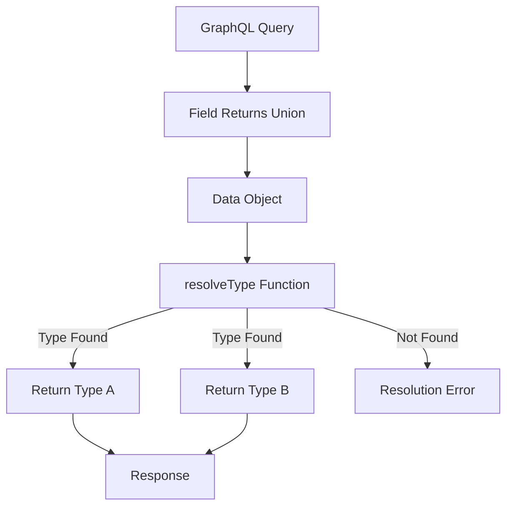
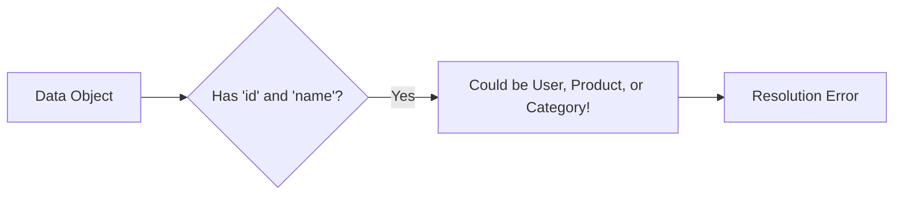

# How to Fix "Union Type" Resolution Errors in GraphQL

Author: [nawazdhandala](https://www.github.com/nawazdhandala)

Tags: GraphQL, Union Types, Type Resolution, API Development, Error Handling, Node.js, Backend Development

Description: Learn how to diagnose and fix common union type resolution errors in GraphQL, including missing resolveType functions and type discrimination issues.

---

> Union types in GraphQL allow fields to return one of several possible types. However, improper configuration leads to frustrating resolution errors. This guide covers the common causes and provides practical solutions.

Union types are powerful but require proper type resolution. Understanding how GraphQL determines the concrete type is essential for avoiding errors.

---

## Overview



---

## Common Union Type Errors

### Error 1: Missing resolveType Function

**Error Message:**

```
Abstract type "SearchResult" must resolve to an Object type at runtime
for field "Query.search". Either the "SearchResult" type should provide
a "resolveType" function or each possible type should provide an "isTypeOf" function.
```

**Problem Schema:**

```graphql
# schema.graphql
union SearchResult = User | Post | Comment

type Query {
  search(query: String!): [SearchResult!]!
}

type User {
  id: ID!
  name: String!
  email: String!
}

type Post {
  id: ID!
  title: String!
  content: String!
}

type Comment {
  id: ID!
  text: String!
  author: User!
}
```

**Problem Resolver:**

```javascript
// BAD: No type resolution logic
const resolvers = {
  Query: {
    search: async (_, { query }) => {
      // Returns mixed array of users, posts, and comments
      const users = await db.users.search(query);
      const posts = await db.posts.search(query);
      const comments = await db.comments.search(query);

      return [...users, ...posts, ...comments];
    }
  }
  // Missing: SearchResult resolveType
};
```

**Solution: Add resolveType Function**

```javascript
// GOOD: Provide resolveType for the union
const resolvers = {
  Query: {
    search: async (_, { query }) => {
      const users = await db.users.search(query);
      const posts = await db.posts.search(query);
      const comments = await db.comments.search(query);

      return [...users, ...posts, ...comments];
    }
  },

  // Add resolveType to the union
  SearchResult: {
    __resolveType(obj, context, info) {
      // Determine type based on object properties
      if (obj.email) {
        return 'User';
      }
      if (obj.title) {
        return 'Post';
      }
      if (obj.text) {
        return 'Comment';
      }

      // Return null if type cannot be determined
      // This will cause a runtime error - better to throw
      throw new Error(`Cannot resolve type for SearchResult: ${JSON.stringify(obj)}`);
    }
  }
};
```

---

### Error 2: Incorrect Type Name Returned

**Error Message:**

```
Abstract type "MediaItem" was resolved to a type "video" that does not exist
inside the schema.
```

**Problem:**

```javascript
// BAD: Returning lowercase type name
const resolvers = {
  MediaItem: {
    __resolveType(obj) {
      // Returns 'video' instead of 'Video'
      return obj.type;  // obj.type might be 'video', 'image', etc.
    }
  }
};
```

**Solution:**

```javascript
// GOOD: Return exact type names as defined in schema
const resolvers = {
  MediaItem: {
    __resolveType(obj) {
      // Map database values to GraphQL type names
      const typeMap = {
        'video': 'Video',
        'image': 'Image',
        'audio': 'Audio',
        'document': 'Document'
      };

      const graphqlType = typeMap[obj.type];

      if (!graphqlType) {
        throw new Error(`Unknown media type: ${obj.type}`);
      }

      return graphqlType;
    }
  }
};
```

---

### Error 3: Type Discrimination Ambiguity

When multiple types share the same properties, type resolution becomes ambiguous.



**Problem Schema:**

```graphql
union Entity = User | Product | Category

type User {
  id: ID!
  name: String!
  createdAt: DateTime!
}

type Product {
  id: ID!
  name: String!
  price: Float!
}

type Category {
  id: ID!
  name: String!
  parentId: ID
}
```

**Problem Resolver:**

```javascript
// BAD: Ambiguous type resolution
const resolvers = {
  Entity: {
    __resolveType(obj) {
      // All types have 'id' and 'name' - this is unreliable
      if (obj.id && obj.name) {
        return 'User';  // Wrong for Products and Categories!
      }
    }
  }
};
```

**Solution 1: Add Type Discriminator Field**

```javascript
// GOOD: Add __typename to database records
async function searchEntities(query) {
  const users = await db.users.search(query);
  const products = await db.products.search(query);
  const categories = await db.categories.search(query);

  // Add __typename to each record
  return [
    ...users.map(u => ({ ...u, __typename: 'User' })),
    ...products.map(p => ({ ...p, __typename: 'Product' })),
    ...categories.map(c => ({ ...c, __typename: 'Category' }))
  ];
}

const resolvers = {
  Entity: {
    __resolveType(obj) {
      // Use the discriminator field
      return obj.__typename;
    }
  }
};
```

**Solution 2: Use Unique Property Detection**

```javascript
// GOOD: Use type-specific properties
const resolvers = {
  Entity: {
    __resolveType(obj) {
      // Check for unique properties
      if ('email' in obj || 'role' in obj) {
        return 'User';
      }
      if ('price' in obj || 'sku' in obj) {
        return 'Product';
      }
      if ('parentId' in obj || 'depth' in obj) {
        return 'Category';
      }

      throw new Error('Cannot determine Entity type');
    }
  }
};
```

**Solution 3: Use instanceof or Class Checks**

```javascript
// GOOD: Use class instances for type checking
class User {
  constructor(data) {
    Object.assign(this, data);
  }
}

class Product {
  constructor(data) {
    Object.assign(this, data);
  }
}

class Category {
  constructor(data) {
    Object.assign(this, data);
  }
}

const resolvers = {
  Query: {
    search: async (_, { query }) => {
      const users = (await db.users.search(query)).map(u => new User(u));
      const products = (await db.products.search(query)).map(p => new Product(p));
      const categories = (await db.categories.search(query)).map(c => new Category(c));

      return [...users, ...products, ...categories];
    }
  },

  Entity: {
    __resolveType(obj) {
      if (obj instanceof User) return 'User';
      if (obj instanceof Product) return 'Product';
      if (obj instanceof Category) return 'Category';

      throw new Error('Unknown Entity type');
    }
  }
};
```

---

### Error 4: Async resolveType Issues

**Error Message:**

```
Cannot return non-Object type "Promise" from resolveType
```

**Problem:**

```javascript
// BAD: Async resolveType without proper handling
const resolvers = {
  Notification: {
    __resolveType: async (obj) => {
      // Async operations in resolveType can cause issues
      const type = await determineType(obj);
      return type;
    }
  }
};
```

**Solution:**

```javascript
// GOOD: Pre-resolve type in parent resolver
const resolvers = {
  Query: {
    notifications: async (_, __, { user }) => {
      const notifications = await db.notifications.findByUser(user.id);

      // Resolve type information before returning
      return Promise.all(notifications.map(async (notification) => {
        const type = await determineNotificationType(notification);
        return { ...notification, __typename: type };
      }));
    }
  },

  Notification: {
    __resolveType(obj) {
      // Now we can use the pre-resolved type
      return obj.__typename;
    }
  }
};
```

---

## Union Types with Fragments

Properly query union types using inline fragments.

```graphql
# Query with inline fragments for each union member
query SearchResults($query: String!) {
  search(query: $query) {
    # Common field available via interface or __typename
    __typename

    # User-specific fields
    ... on User {
      id
      name
      email
      avatar
    }

    # Post-specific fields
    ... on Post {
      id
      title
      excerpt
      author {
        name
      }
    }

    # Comment-specific fields
    ... on Comment {
      id
      text
      post {
        title
      }
    }
  }
}
```

---

## Complete Union Type Example

Here is a complete example implementing a notification system with union types.

```graphql
# schema.graphql

# Union of different notification types
union NotificationPayload =
  | NewFollowerNotification
  | NewCommentNotification
  | NewLikeNotification
  | SystemNotification

type Notification {
  id: ID!
  createdAt: DateTime!
  read: Boolean!
  payload: NotificationPayload!
}

type NewFollowerNotification {
  follower: User!
}

type NewCommentNotification {
  comment: Comment!
  post: Post!
}

type NewLikeNotification {
  liker: User!
  target: LikeTarget!
}

type SystemNotification {
  title: String!
  message: String!
  severity: Severity!
}

union LikeTarget = Post | Comment

enum Severity {
  INFO
  WARNING
  ERROR
}

type Query {
  notifications(limit: Int = 20): [Notification!]!
}
```

```javascript
// resolvers.js

const resolvers = {
  Query: {
    notifications: async (_, { limit }, { user, db }) => {
      if (!user) throw new AuthenticationError('Must be logged in');

      const notifications = await db.notifications.findMany({
        where: { userId: user.id },
        take: limit,
        orderBy: { createdAt: 'desc' },
        include: {
          // Include related data for payload resolution
          follower: true,
          comment: { include: { post: true } },
          liker: true,
          likeTarget: true
        }
      });

      return notifications.map(formatNotification);
    }
  },

  Notification: {
    payload: (notification) => {
      // Return the payload with type information
      return {
        ...notification.payload,
        __notificationType: notification.type
      };
    }
  },

  NotificationPayload: {
    __resolveType(obj) {
      // Use the notification type to determine payload type
      const typeMap = {
        'NEW_FOLLOWER': 'NewFollowerNotification',
        'NEW_COMMENT': 'NewCommentNotification',
        'NEW_LIKE': 'NewLikeNotification',
        'SYSTEM': 'SystemNotification'
      };

      const type = typeMap[obj.__notificationType];

      if (!type) {
        console.error('Unknown notification type:', obj.__notificationType);
        throw new Error(`Unknown notification type: ${obj.__notificationType}`);
      }

      return type;
    }
  },

  LikeTarget: {
    __resolveType(obj) {
      // Determine if the like target is a Post or Comment
      if (obj.title !== undefined) {
        return 'Post';
      }
      if (obj.text !== undefined) {
        return 'Comment';
      }

      throw new Error('Cannot determine LikeTarget type');
    }
  },

  // Resolve nested union types
  NewLikeNotification: {
    target: async (notification, _, { db }) => {
      const { targetType, targetId } = notification;

      if (targetType === 'POST') {
        const post = await db.posts.findUnique({ where: { id: targetId } });
        return { ...post, __targetType: 'Post' };
      }

      if (targetType === 'COMMENT') {
        const comment = await db.comments.findUnique({ where: { id: targetId } });
        return { ...comment, __targetType: 'Comment' };
      }

      throw new Error(`Unknown target type: ${targetType}`);
    }
  }
};

// Helper function to format notification data
function formatNotification(dbNotification) {
  const base = {
    id: dbNotification.id,
    createdAt: dbNotification.createdAt,
    read: dbNotification.read,
    type: dbNotification.type
  };

  // Build payload based on notification type
  switch (dbNotification.type) {
    case 'NEW_FOLLOWER':
      return {
        ...base,
        payload: {
          follower: dbNotification.follower,
          __notificationType: 'NEW_FOLLOWER'
        }
      };

    case 'NEW_COMMENT':
      return {
        ...base,
        payload: {
          comment: dbNotification.comment,
          post: dbNotification.comment.post,
          __notificationType: 'NEW_COMMENT'
        }
      };

    case 'NEW_LIKE':
      return {
        ...base,
        payload: {
          liker: dbNotification.liker,
          targetType: dbNotification.targetType,
          targetId: dbNotification.targetId,
          __notificationType: 'NEW_LIKE'
        }
      };

    case 'SYSTEM':
      return {
        ...base,
        payload: {
          title: dbNotification.title,
          message: dbNotification.message,
          severity: dbNotification.severity,
          __notificationType: 'SYSTEM'
        }
      };

    default:
      throw new Error(`Unknown notification type: ${dbNotification.type}`);
  }
}
```

---

## Debugging Union Type Resolution

Add logging to diagnose resolution issues.

```javascript
// Debug wrapper for resolveType
function createDebugResolveType(unionName, resolveType) {
  return function debugResolveType(obj, context, info) {
    console.log(`Resolving ${unionName} type for:`, {
      keys: Object.keys(obj),
      sample: JSON.stringify(obj).substring(0, 200)
    });

    try {
      const result = resolveType(obj, context, info);
      console.log(`Resolved ${unionName} to: ${result}`);
      return result;
    } catch (error) {
      console.error(`Failed to resolve ${unionName}:`, error);
      throw error;
    }
  };
}

// Usage
const resolvers = {
  SearchResult: {
    __resolveType: createDebugResolveType('SearchResult', (obj) => {
      if (obj.email) return 'User';
      if (obj.title) return 'Post';
      if (obj.text) return 'Comment';
      throw new Error('Unknown type');
    })
  }
};
```

---

## Type Resolution with TypeScript

Use TypeScript for type-safe union resolution.

```typescript
// types.ts
interface User {
  __typename: 'User';
  id: string;
  name: string;
  email: string;
}

interface Post {
  __typename: 'Post';
  id: string;
  title: string;
  content: string;
}

interface Comment {
  __typename: 'Comment';
  id: string;
  text: string;
  authorId: string;
}

type SearchResult = User | Post | Comment;

// Type guard functions
function isUser(obj: SearchResult): obj is User {
  return obj.__typename === 'User';
}

function isPost(obj: SearchResult): obj is Post {
  return obj.__typename === 'Post';
}

function isComment(obj: SearchResult): obj is Comment {
  return obj.__typename === 'Comment';
}

// resolvers.ts
import { Resolvers } from './generated/graphql';

const resolvers: Resolvers = {
  SearchResult: {
    __resolveType(obj: SearchResult): string {
      // TypeScript ensures we handle all cases
      if (isUser(obj)) return 'User';
      if (isPost(obj)) return 'Post';
      if (isComment(obj)) return 'Comment';

      // TypeScript will error if we miss a case
      const exhaustiveCheck: never = obj;
      throw new Error(`Unhandled type: ${exhaustiveCheck}`);
    }
  }
};
```

---

## Best Practices

1. **Always provide resolveType** for union and interface types
2. **Use discriminator fields** like `__typename` for reliable resolution
3. **Return exact type names** matching your schema definition
4. **Avoid async operations** in resolveType functions
5. **Add logging** to debug resolution issues
6. **Use TypeScript** for type-safe union handling
7. **Test all union members** to ensure proper resolution

---

## Conclusion

Union type resolution errors in GraphQL stem from missing or incorrect type resolution logic. By providing proper `resolveType` functions, using discriminator fields, and handling all possible types, you can build robust APIs that leverage the full power of GraphQL unions.

Key takeaways:

- Every union type needs a `__resolveType` function
- Use discriminator fields for reliable type detection
- Return exact type names as defined in the schema
- Pre-resolve types in parent resolvers for async operations
- Use TypeScript for compile-time type safety

---

*Need to monitor your GraphQL API? [OneUptime](https://oneuptime.com) provides comprehensive monitoring with union type resolution tracking and error alerting.*
