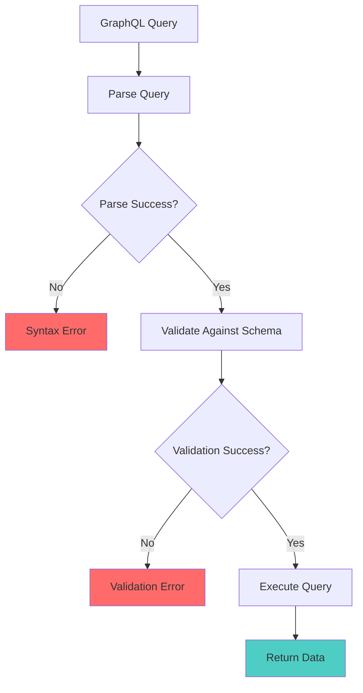

# How to Fix "Validation Error" in GraphQL Queries

Author: [nawazdhandala](https://www.github.com/nawazdhandala)

Tags: GraphQL, Debugging, Validation, API Development, Troubleshooting

Description: A comprehensive guide to understanding and fixing GraphQL validation errors including type mismatches, missing arguments, and schema violations.

---

GraphQL validation errors occur when your query does not conform to the schema rules. Unlike runtime errors, validation errors are caught before execution, making them predictable and fixable. This guide covers all common validation errors and how to resolve them.

## How GraphQL Validation Works

GraphQL validates queries against the schema before execution. If validation fails, the query is rejected without touching your resolvers or database.



## Common Validation Errors and Solutions

### Error 1: Type Mismatch for Arguments

```graphql
# Schema
type Query {
  user(id: ID!): User
  users(limit: Int, offset: Int): [User!]!
}
```

```graphql
# Error: Argument "id" has invalid value "123"
# Expected type "ID!", found "123" (as Int)
query {
  user(id: 123) {  # Wrong: passing Int instead of ID
    name
  }
}

# Correct: ID type accepts strings
query {
  user(id: "123") {
    name
  }
}
```

```graphql
# Error: Argument "limit" has invalid value "10"
# Expected type "Int", found "10" (as String)
query {
  users(limit: "10") {  # Wrong: passing String instead of Int
    name
  }
}

# Correct: Int type requires actual integer
query {
  users(limit: 10) {
    name
  }
}
```

### Error 2: Missing Required Arguments

```graphql
# Schema
type Query {
  user(id: ID!): User  # id is required (non-null)
  createUser(input: CreateUserInput!): User
}

input CreateUserInput {
  email: String!
  name: String!
  password: String!
}
```

```graphql
# Error: Field "user" argument "id" of type "ID!" is required
query {
  user {  # Missing required argument
    name
  }
}

# Correct: Provide required argument
query {
  user(id: "123") {
    name
  }
}
```

```graphql
# Error: Field "createUser" argument "input" of type "CreateUserInput!" is required
mutation {
  createUser {  # Missing required input
    id
  }
}

# Correct: Provide required input
mutation {
  createUser(input: { email: "test@example.com", name: "Test", password: "secret" }) {
    id
  }
}
```

### Error 3: Missing Required Input Fields

```graphql
# Schema
input CreateUserInput {
  email: String!    # Required
  name: String!     # Required
  password: String! # Required
  bio: String       # Optional
}
```

```graphql
# Error: Field "CreateUserInput.password" of required type "String!" was not provided
mutation {
  createUser(input: {
    email: "test@example.com",
    name: "Test"
    # Missing password field
  }) {
    id
  }
}

# Correct: Include all required fields
mutation {
  createUser(input: {
    email: "test@example.com",
    name: "Test",
    password: "secret123"  # Now included
  }) {
    id
  }
}
```

### Error 4: Unknown Arguments

```graphql
# Schema
type Query {
  users(limit: Int, offset: Int): [User!]!
}
```

```graphql
# Error: Unknown argument "page" on field "Query.users"
query {
  users(limit: 10, page: 1) {  # "page" is not a valid argument
    name
  }
}

# Correct: Use defined arguments
query {
  users(limit: 10, offset: 0) {
    name
  }
}
```

### Error 5: Invalid Enum Values

```graphql
# Schema
enum UserRole {
  ADMIN
  USER
  MODERATOR
}

type Query {
  usersByRole(role: UserRole!): [User!]!
}
```

```graphql
# Error: Value "admin" does not exist in "UserRole" enum
query {
  usersByRole(role: admin) {  # Wrong: lowercase
    name
  }
}

# Error: Value "SUPERUSER" does not exist in "UserRole" enum
query {
  usersByRole(role: SUPERUSER) {  # Wrong: not a valid enum value
    name
  }
}

# Correct: Use exact enum value
query {
  usersByRole(role: ADMIN) {
    name
  }
}
```

### Error 6: Variable Type Mismatch

```graphql
# Schema
type Query {
  user(id: ID!): User
  users(filter: UserFilter): [User!]!
}

input UserFilter {
  status: String
  role: UserRole
}
```

```graphql
# Error: Variable "$id" of type "String!" used in position expecting type "ID!"
query GetUser($id: String!) {  # Wrong variable type
  user(id: $id) {
    name
  }
}

# Correct: Match variable type to argument type
query GetUser($id: ID!) {
  user(id: $id) {
    name
  }
}
```

```graphql
# Error: Variable "$filter" of type "UserFilter" used in position expecting type "UserFilter!"
query GetUsers($filter: UserFilter!) {  # Variable is non-null but argument accepts null
  users(filter: $filter) {
    name
  }
}

# This is actually fine - non-null variable is more restrictive
# But if you pass null, you will get a runtime error
```

### Error 7: Selection Set Required for Object Types

```graphql
# Schema
type User {
  id: ID!
  name: String!
  posts: [Post!]!
}

type Post {
  id: ID!
  title: String!
}
```

```graphql
# Error: Field "user" of type "User" must have a selection of subfields
query {
  user(id: "1")  # Missing selection set
}

# Error: Field "posts" of type "[Post!]!" must have a selection of subfields
query {
  user(id: "1") {
    name
    posts  # Missing selection set for posts
  }
}

# Correct: Provide selection set for object types
query {
  user(id: "1") {
    name
    posts {
      id
      title
    }
  }
}
```

### Error 8: Scalar Fields Cannot Have Selections

```graphql
# Schema
type User {
  id: ID!
  name: String!
}
```

```graphql
# Error: Field "name" must not have a selection since type "String!" has no subfields
query {
  user(id: "1") {
    name {      # Wrong: name is a scalar
      value
    }
  }
}

# Correct: Scalars are leaf nodes
query {
  user(id: "1") {
    name  # No selection needed for scalars
  }
}
```

### Error 9: Fragment Type Conditions

```graphql
# Schema
type User {
  id: ID!
  name: String!
}

type Post {
  id: ID!
  title: String!
}
```

```graphql
# Error: Fragment "UserFields" cannot be spread here as objects of type "Post" can never be of type "User"
fragment UserFields on User {
  id
  name
}

query {
  post(id: "1") {
    ...UserFields  # Wrong: User fragment on Post
  }
}

# Correct: Use appropriate fragment type
fragment PostFields on Post {
  id
  title
}

query {
  post(id: "1") {
    ...PostFields
  }
}
```

### Error 10: Directive Argument Errors

```graphql
# Schema has @include and @skip directives
directive @include(if: Boolean!) on FIELD | FRAGMENT_SPREAD | INLINE_FRAGMENT
directive @skip(if: Boolean!) on FIELD | FRAGMENT_SPREAD | INLINE_FRAGMENT
```

```graphql
# Error: Argument "if" of directive "@include" is required
query {
  user(id: "1") {
    name
    email @include  # Missing required "if" argument
  }
}

# Error: Unknown argument "when" on directive "@skip"
query {
  user(id: "1") {
    name
    email @skip(when: true)  # Wrong argument name
  }
}

# Correct: Use proper directive syntax
query GetUser($showEmail: Boolean!) {
  user(id: "1") {
    name
    email @include(if: $showEmail)
  }
}
```

## Using Variables Correctly

Variables help prevent many validation errors by enforcing types at the operation level.

```mermaid
flowchart LR
    subgraph "Variable Flow"
        A[Define Variable Type] --> B[Use in Query]
        B --> C[Pass Value at Runtime]
    end

    A -->|"$id: ID!"| B
    B -->|"user(id: $id)"| C
    C -->|'{"id": "123"}'| D[Validated Request]
```

```graphql
# Well-structured query with variables
query GetUserWithPosts(
  $userId: ID!
  $includeEmail: Boolean!
  $postLimit: Int = 10  # Default value
) {
  user(id: $userId) {
    id
    name
    email @include(if: $includeEmail)
    posts(limit: $postLimit) {
      id
      title
    }
  }
}
```

```json
// Variables JSON
{
  "userId": "123",
  "includeEmail": true,
  "postLimit": 5
}
```

## Validation Error Messages Reference

| Error Pattern | Meaning | Solution |
|--------------|---------|----------|
| `Expected type "X", found Y` | Wrong scalar type | Use correct type (String, Int, Boolean, etc.) |
| `Field "X" argument "Y" of type "Z!" is required` | Missing required argument | Add the required argument |
| `Unknown argument "X" on field "Y"` | Argument not in schema | Check schema for valid arguments |
| `Variable "$X" of type "Y" used in position expecting type "Z"` | Variable type mismatch | Match variable type to usage |
| `Field "X" must have a selection of subfields` | Missing selection set | Add { fields } for object types |
| `Value "X" does not exist in "Y" enum` | Invalid enum value | Use exact enum value from schema |
| `Fragment "X" cannot be spread here` | Wrong fragment type | Use fragment on correct type |

## Debugging Validation Errors

### 1. Enable Detailed Error Messages

```javascript
// Apollo Server configuration for better error messages
const server = new ApolloServer({
  typeDefs,
  resolvers,
  formatError: (error) => {
    // Log full error for debugging
    console.error('GraphQL Error:', {
      message: error.message,
      locations: error.locations,
      path: error.path,
      extensions: error.extensions
    });

    return {
      message: error.message,
      locations: error.locations,
      path: error.path
    };
  }
});
```

### 2. Validate Queries Before Sending

```javascript
// Client-side validation using graphql-js
const { validate, parse } = require('graphql');
const { buildClientSchema } = require('graphql');

// Load schema from introspection result
const schema = buildClientSchema(introspectionResult);

function validateQuery(queryString) {
  try {
    const documentAST = parse(queryString);
    const errors = validate(schema, documentAST);

    if (errors.length > 0) {
      errors.forEach(error => {
        console.error('Validation Error:', error.message);
        console.error('Locations:', error.locations);
      });
      return false;
    }

    return true;
  } catch (parseError) {
    console.error('Parse Error:', parseError.message);
    return false;
  }
}
```

### 3. Use IDE Extensions

```javascript
// VS Code settings for GraphQL extension
// .vscode/settings.json
{
  "graphql.schema": "./schema.graphql",
  "graphql.documents": "./src/**/*.{graphql,ts,tsx}"
}
```

### 4. Introspection Queries for Debugging

```graphql
# Get information about a specific type
query {
  __type(name: "User") {
    name
    kind
    fields {
      name
      type {
        name
        kind
        ofType {
          name
          kind
        }
      }
      args {
        name
        type {
          name
          kind
        }
      }
    }
  }
}

# Get information about input types
query {
  __type(name: "CreateUserInput") {
    name
    inputFields {
      name
      type {
        name
        kind
        ofType {
          name
        }
      }
    }
  }
}
```

## Preventing Validation Errors

### Use TypeScript Code Generation

```bash
# Install GraphQL Code Generator
npm install @graphql-codegen/cli @graphql-codegen/typescript @graphql-codegen/typescript-operations

# codegen.yml
# schema: http://localhost:4000/graphql
# documents: 'src/**/*.graphql'
# generates:
#   ./src/generated/graphql.ts:
#     plugins:
#       - typescript
#       - typescript-operations
```

```typescript
// Generated types catch errors at compile time
import { GetUserQuery, GetUserQueryVariables } from './generated/graphql';

const GET_USER = gql`
  query GetUser($id: ID!) {
    user(id: $id) {
      id
      name
    }
  }
`;

// TypeScript ensures correct variable types
const variables: GetUserQueryVariables = {
  id: "123"  // Must be string (ID type)
};

const { data } = useQuery<GetUserQuery, GetUserQueryVariables>(
  GET_USER,
  { variables }
);
```

### Schema Validation in CI/CD

```yaml
# GitHub Actions workflow for schema validation
name: GraphQL Schema Validation

on: [push, pull_request]

jobs:
  validate:
    runs-on: ubuntu-latest
    steps:
      - uses: actions/checkout@v2

      - name: Install dependencies
        run: npm install

      - name: Validate schema
        run: |
          npx graphql-inspector validate ./schema.graphql ./src/**/*.graphql

      - name: Check for breaking changes
        run: |
          npx graphql-inspector diff ./schema.graphql ./schema-production.graphql
```

## Custom Validation Rules

You can add custom validation rules for business logic:

```javascript
// custom-validation.js
const { ValidationContext, ASTVisitor } = require('graphql');

// Custom rule: Prevent querying too many items
function MaxDepthRule(maxDepth) {
  return function(context) {
    let depth = 0;

    return {
      Field: {
        enter() {
          depth++;
          if (depth > maxDepth) {
            context.reportError(
              new GraphQLError(
                `Query exceeds maximum depth of ${maxDepth}`,
                [context.getFieldDef()]
              )
            );
          }
        },
        leave() {
          depth--;
        }
      }
    };
  };
}

// Custom rule: Require pagination arguments
function RequirePaginationRule(context) {
  return {
    Field(node) {
      const fieldName = node.name.value;
      const returnsList = fieldName.endsWith('s') || fieldName === 'items';

      if (returnsList) {
        const hasLimit = node.arguments?.some(
          arg => arg.name.value === 'limit' || arg.name.value === 'first'
        );

        if (!hasLimit) {
          context.reportError(
            new GraphQLError(
              `Field "${fieldName}" must include a limit argument`,
              [node]
            )
          );
        }
      }
    }
  };
}

// Apply custom rules
const { validate, specifiedRules } = require('graphql');

function validateWithCustomRules(schema, document) {
  const customRules = [
    MaxDepthRule(10),
    RequirePaginationRule
  ];

  return validate(schema, document, [...specifiedRules, ...customRules]);
}
```

## Conclusion

GraphQL validation errors are your first line of defense against malformed queries. Understanding these errors helps you:

1. Write correct queries the first time
2. Debug issues quickly when they occur
3. Build more robust applications with proper typing

Key takeaways:
- Match argument types exactly as defined in the schema
- Always provide required arguments and input fields
- Use selection sets for object types, not for scalars
- Leverage TypeScript and code generation to catch errors early
- Use IDE extensions for real-time validation feedback

**Related Reading:**

- [How to Fix "Cannot Query Field" Errors in GraphQL](https://oneuptime.com/blog/post/2026-01-24-graphql-cannot-query-field-errors/view)
- [How to Handle Authentication in GraphQL APIs](https://oneuptime.com/blog/post/2026-01-24-graphql-authentication/view)
