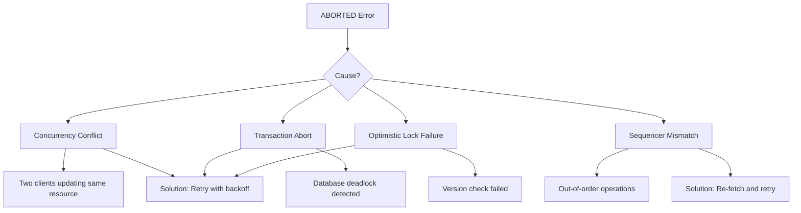
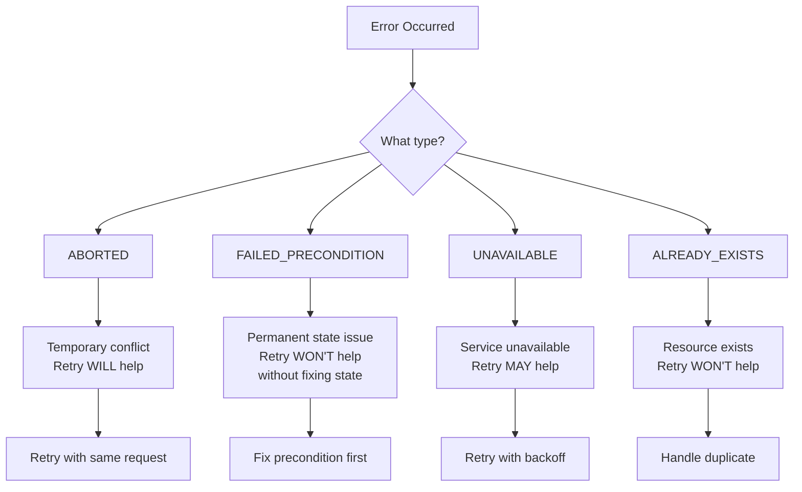

# How to Fix "Aborted" Status Errors in gRPC

Author: [nawazdhandala](https://www.github.com/nawazdhandala)

Tags: gRPC, Error Handling, Aborted, Concurrency, Transactions, Go, Python, Debugging

Description: A practical guide to understanding and fixing gRPC ABORTED status errors, including concurrency conflicts, transaction issues, and retry strategies.

---

> The ABORTED status code in gRPC indicates that an operation was aborted, typically due to a concurrency conflict such as a sequencer check failure or transaction abort. This guide covers the common causes and provides solutions for handling ABORTED errors properly.

Understanding when and why gRPC returns ABORTED helps you design more resilient services that handle concurrent operations gracefully.

---

## Understanding ABORTED Status Code



### When to Use ABORTED

```go
// ABORTED should be used when:
// 1. Optimistic concurrency control detects a conflict
// 2. A transaction is aborted due to deadlock
// 3. A sequence number check fails
// 4. The operation should be retried at a higher level

// ABORTED should NOT be used for:
// - Permanent failures (use FAILED_PRECONDITION)
// - Resource not found (use NOT_FOUND)
// - Invalid input (use INVALID_ARGUMENT)
```

---

## Common Causes of ABORTED Errors

### Optimistic Concurrency Control

```go
package main

import (
    "context"
    "database/sql"

    "google.golang.org/grpc/codes"
    "google.golang.org/grpc/status"
    pb "myservice/proto"
)

type server struct {
    pb.UnimplementedResourceServiceServer
    db *sql.DB
}

// UpdateResource with optimistic locking
func (s *server) UpdateResource(ctx context.Context, req *pb.UpdateRequest) (*pb.Resource, error) {
    // Start transaction
    tx, err := s.db.BeginTx(ctx, nil)
    if err != nil {
        return nil, status.Errorf(codes.Internal, "failed to start transaction: %v", err)
    }
    defer tx.Rollback()

    // Read current version
    var currentVersion int64
    var currentData string
    err = tx.QueryRowContext(ctx,
        "SELECT version, data FROM resources WHERE id = $1 FOR UPDATE",
        req.ResourceId,
    ).Scan(&currentVersion, &currentData)

    if err == sql.ErrNoRows {
        return nil, status.Error(codes.NotFound, "resource not found")
    }
    if err != nil {
        return nil, status.Errorf(codes.Internal, "database error: %v", err)
    }

    // Check version matches expected version (optimistic lock)
    if req.ExpectedVersion != currentVersion {
        // Return ABORTED so client knows to retry
        return nil, status.Errorf(
            codes.Aborted,
            "version conflict: expected %d, current is %d",
            req.ExpectedVersion,
            currentVersion,
        )
    }

    // Apply update with incremented version
    newVersion := currentVersion + 1
    _, err = tx.ExecContext(ctx,
        "UPDATE resources SET data = $1, version = $2 WHERE id = $3",
        req.NewData, newVersion, req.ResourceId,
    )
    if err != nil {
        return nil, status.Errorf(codes.Internal, "failed to update: %v", err)
    }

    if err := tx.Commit(); err != nil {
        return nil, status.Errorf(codes.Internal, "failed to commit: %v", err)
    }

    return &pb.Resource{
        Id:      req.ResourceId,
        Data:    req.NewData,
        Version: newVersion,
    }, nil
}
```

### Transaction Deadlock Detection

```python
import grpc
import psycopg2
from psycopg2 import errors

class TransactionService(service_pb2_grpc.TransactionServiceServicer):

    def __init__(self, db_pool):
        self.db_pool = db_pool

    def TransferFunds(self, request, context):
        """Transfer funds between accounts with deadlock handling."""
        conn = self.db_pool.getconn()

        try:
            with conn.cursor() as cursor:
                conn.autocommit = False

                try:
                    # Lock accounts in consistent order to prevent deadlock
                    # Sort by account ID to ensure consistent lock ordering
                    accounts = sorted([request.from_account, request.to_account])

                    # Lock and get balances
                    for account_id in accounts:
                        cursor.execute(
                            "SELECT balance FROM accounts WHERE id = %s FOR UPDATE",
                            (account_id,)
                        )

                    # Get current balances
                    cursor.execute(
                        "SELECT balance FROM accounts WHERE id = %s",
                        (request.from_account,)
                    )
                    from_balance = cursor.fetchone()[0]

                    if from_balance < request.amount:
                        conn.rollback()
                        context.abort(
                            grpc.StatusCode.FAILED_PRECONDITION,
                            "Insufficient funds"
                        )
                        return service_pb2.TransferResponse()

                    # Perform transfer
                    cursor.execute(
                        "UPDATE accounts SET balance = balance - %s WHERE id = %s",
                        (request.amount, request.from_account)
                    )
                    cursor.execute(
                        "UPDATE accounts SET balance = balance + %s WHERE id = %s",
                        (request.amount, request.to_account)
                    )

                    conn.commit()
                    return service_pb2.TransferResponse(success=True)

                except errors.DeadlockDetected:
                    # Database detected a deadlock
                    # Return ABORTED so client can retry
                    conn.rollback()
                    context.abort(
                        grpc.StatusCode.ABORTED,
                        "Transaction aborted due to deadlock, please retry"
                    )
                    return service_pb2.TransferResponse()

                except errors.SerializationFailure:
                    # Serialization conflict in SERIALIZABLE isolation
                    conn.rollback()
                    context.abort(
                        grpc.StatusCode.ABORTED,
                        "Serialization conflict, please retry"
                    )
                    return service_pb2.TransferResponse()

        finally:
            self.db_pool.putconn(conn)
```

---

## Client-Side Retry Handling

### Go Client with Automatic Retry

```go
package main

import (
    "context"
    "log"
    "math/rand"
    "time"

    "google.golang.org/grpc"
    "google.golang.org/grpc/codes"
    "google.golang.org/grpc/status"
    pb "myservice/proto"
)

// RetryConfig holds retry configuration
type RetryConfig struct {
    MaxAttempts     int
    InitialBackoff  time.Duration
    MaxBackoff      time.Duration
    BackoffFactor   float64
    RetryableCodes  []codes.Code
}

// DefaultRetryConfig returns sensible defaults for ABORTED retries
func DefaultRetryConfig() RetryConfig {
    return RetryConfig{
        MaxAttempts:    5,
        InitialBackoff: 100 * time.Millisecond,
        MaxBackoff:     5 * time.Second,
        BackoffFactor:  2.0,
        RetryableCodes: []codes.Code{codes.Aborted, codes.Unavailable},
    }
}

// RetryableClient wraps gRPC client with retry logic
type RetryableClient struct {
    client pb.ResourceServiceClient
    config RetryConfig
}

// UpdateWithRetry handles ABORTED errors with exponential backoff
func (c *RetryableClient) UpdateWithRetry(ctx context.Context, resourceID string, data string) (*pb.Resource, error) {
    var lastErr error
    backoff := c.config.InitialBackoff

    for attempt := 1; attempt <= c.config.MaxAttempts; attempt++ {
        // First, get current version
        resource, err := c.client.GetResource(ctx, &pb.GetRequest{
            ResourceId: resourceID,
        })
        if err != nil {
            return nil, err
        }

        // Attempt update with current version
        updated, err := c.client.UpdateResource(ctx, &pb.UpdateRequest{
            ResourceId:      resourceID,
            NewData:         data,
            ExpectedVersion: resource.Version,
        })

        if err == nil {
            return updated, nil
        }

        // Check if error is retryable
        if !c.isRetryable(err) {
            return nil, err
        }

        lastErr = err
        log.Printf("Attempt %d failed with ABORTED, retrying in %v", attempt, backoff)

        // Wait with jitter before retry
        jitter := time.Duration(rand.Int63n(int64(backoff) / 4))
        select {
        case <-ctx.Done():
            return nil, ctx.Err()
        case <-time.After(backoff + jitter):
        }

        // Increase backoff for next attempt
        backoff = time.Duration(float64(backoff) * c.config.BackoffFactor)
        if backoff > c.config.MaxBackoff {
            backoff = c.config.MaxBackoff
        }
    }

    return nil, status.Errorf(codes.Aborted,
        "max retries exceeded, last error: %v", lastErr)
}

// isRetryable checks if error should be retried
func (c *RetryableClient) isRetryable(err error) bool {
    st, ok := status.FromError(err)
    if !ok {
        return false
    }

    for _, code := range c.config.RetryableCodes {
        if st.Code() == code {
            return true
        }
    }
    return false
}
```

### Python Client with Retry Decorator

```python
import grpc
import time
import random
import functools
from typing import Callable, TypeVar

T = TypeVar('T')


def retry_on_aborted(
    max_attempts: int = 5,
    initial_backoff: float = 0.1,
    max_backoff: float = 5.0,
    backoff_factor: float = 2.0
):
    """Decorator to retry gRPC calls that return ABORTED."""

    def decorator(func: Callable[..., T]) -> Callable[..., T]:
        @functools.wraps(func)
        def wrapper(*args, **kwargs) -> T:
            backoff = initial_backoff
            last_error = None

            for attempt in range(1, max_attempts + 1):
                try:
                    return func(*args, **kwargs)
                except grpc.RpcError as e:
                    if e.code() != grpc.StatusCode.ABORTED:
                        # Not an ABORTED error, don't retry
                        raise

                    last_error = e

                    if attempt == max_attempts:
                        # Max attempts reached
                        raise

                    # Calculate backoff with jitter
                    jitter = random.uniform(0, backoff * 0.25)
                    sleep_time = backoff + jitter

                    print(f"Attempt {attempt} aborted, retrying in {sleep_time:.2f}s")
                    time.sleep(sleep_time)

                    # Increase backoff
                    backoff = min(backoff * backoff_factor, max_backoff)

            raise last_error

        return wrapper
    return decorator


class ResourceClient:
    def __init__(self, stub):
        self.stub = stub

    @retry_on_aborted(max_attempts=5)
    def update_resource(self, resource_id: str, new_data: str) -> 'Resource':
        """Update resource with automatic retry on ABORTED."""
        # Get current version
        resource = self.stub.GetResource(
            service_pb2.GetRequest(resource_id=resource_id)
        )

        # Attempt update
        return self.stub.UpdateResource(
            service_pb2.UpdateRequest(
                resource_id=resource_id,
                new_data=new_data,
                expected_version=resource.version
            )
        )
```

---

## Using gRPC Service Config for Automatic Retries

```go
package main

import (
    "google.golang.org/grpc"
)

// Configure automatic retries using service config
func createChannelWithRetries(target string) (*grpc.ClientConn, error) {
    // Service config with retry policy for ABORTED
    serviceConfig := `{
        "methodConfig": [{
            "name": [
                {"service": "myservice.ResourceService"}
            ],
            "retryPolicy": {
                "maxAttempts": 5,
                "initialBackoff": "0.1s",
                "maxBackoff": "5s",
                "backoffMultiplier": 2.0,
                "retryableStatusCodes": ["ABORTED", "UNAVAILABLE"]
            }
        }]
    }`

    return grpc.Dial(
        target,
        grpc.WithDefaultServiceConfig(serviceConfig),
        grpc.WithInsecure(),
    )
}
```

---

## Distinguishing ABORTED from Other Errors



### Choosing the Right Error Code

```go
package main

import (
    "google.golang.org/grpc/codes"
    "google.golang.org/grpc/status"
)

// Error code selection guide
func selectErrorCode(situation string) codes.Code {
    switch situation {

    // Use ABORTED when retry will likely succeed
    case "optimistic_lock_conflict":
        // Another client updated the resource
        // Client should re-read and retry
        return codes.Aborted

    case "transaction_deadlock":
        // Database detected deadlock
        // Retry will likely succeed
        return codes.Aborted

    case "sequence_number_mismatch":
        // Out of order operation
        // Client should sync and retry
        return codes.Aborted

    // Use FAILED_PRECONDITION when state must change first
    case "resource_not_in_correct_state":
        // Resource must be in specific state
        // Retry won't help until state changes
        return codes.FailedPrecondition

    case "insufficient_funds":
        // Cannot proceed without more funds
        // Retry won't help
        return codes.FailedPrecondition

    // Use UNAVAILABLE for transient failures
    case "service_overloaded":
        // Service temporarily unavailable
        return codes.Unavailable

    case "connection_error":
        // Network issue
        return codes.Unavailable

    default:
        return codes.Internal
    }
}

// Example: Server returning appropriate error
func (s *server) ProcessOrder(ctx context.Context, req *pb.OrderRequest) (*pb.OrderResponse, error) {
    // Check inventory with optimistic locking
    inventory, err := s.getInventory(ctx, req.ProductId)
    if err != nil {
        return nil, err
    }

    // Version check
    if inventory.Version != req.ExpectedInventoryVersion {
        // ABORTED: retry will help after re-reading inventory
        return nil, status.Errorf(codes.Aborted,
            "inventory version changed, please retry")
    }

    // Stock check
    if inventory.Quantity < req.Quantity {
        // FAILED_PRECONDITION: retry won't help without restocking
        return nil, status.Errorf(codes.FailedPrecondition,
            "insufficient stock: available %d, requested %d",
            inventory.Quantity, req.Quantity)
    }

    // Process order
    return s.processOrder(ctx, req, inventory)
}
```

---

## Monitoring ABORTED Errors

```python
import grpc
from prometheus_client import Counter, Histogram

# Metrics for ABORTED errors
aborted_errors = Counter(
    'grpc_aborted_errors_total',
    'Total ABORTED errors by method and reason',
    ['method', 'reason']
)

retry_attempts = Histogram(
    'grpc_retry_attempts',
    'Number of retry attempts before success or failure',
    ['method', 'outcome'],
    buckets=[1, 2, 3, 4, 5, 10]
)

concurrent_conflicts = Counter(
    'grpc_concurrent_conflicts_total',
    'Total concurrent modification conflicts',
    ['resource_type']
)


class MonitoringInterceptor(grpc.ServerInterceptor):
    """Interceptor to track ABORTED errors."""

    def intercept_service(self, continuation, handler_call_details):
        method = handler_call_details.method

        def wrapper(request_or_iterator, context):
            try:
                return continuation(handler_call_details).unary_unary(
                    request_or_iterator, context
                )
            except grpc.RpcError as e:
                if e.code() == grpc.StatusCode.ABORTED:
                    # Parse reason from error details
                    reason = self._extract_reason(e)
                    aborted_errors.labels(method=method, reason=reason).inc()
                raise

        return grpc.unary_unary_rpc_method_handler(wrapper)

    def _extract_reason(self, error):
        details = error.details() or ""
        if "version conflict" in details.lower():
            return "version_conflict"
        elif "deadlock" in details.lower():
            return "deadlock"
        elif "serialization" in details.lower():
            return "serialization_failure"
        return "unknown"
```

---

## Best Practices Summary

1. **Use ABORTED for retryable conflicts** - When a retry at a higher level will likely succeed
2. **Include version information** - Help clients understand what changed
3. **Implement exponential backoff** - Prevent retry storms during high contention
4. **Add jitter to retries** - Spread out retry attempts
5. **Set retry limits** - Prevent infinite retry loops
6. **Monitor ABORTED rates** - High rates indicate contention issues
7. **Use consistent lock ordering** - Prevent deadlocks in transactions

---

## Conclusion

ABORTED errors in gRPC signal temporary conflicts that clients should handle through retry logic. By implementing proper optimistic concurrency control, using exponential backoff with jitter, and monitoring ABORTED rates, you can build services that handle concurrent operations gracefully.

Remember: ABORTED means "try again soon" while FAILED_PRECONDITION means "something needs to change first."

---

*Need to monitor concurrency conflicts in your gRPC services? [OneUptime](https://oneuptime.com) provides real-time error tracking and alerting to help you identify and resolve contention issues.*

**Related Reading:**
- [gRPC Error Handling Best Practices](https://oneuptime.com/blog)
- [Distributed Transactions in Microservices](https://oneuptime.com/blog)
