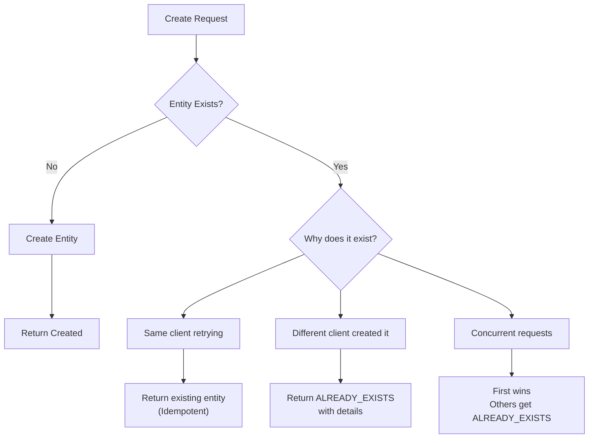
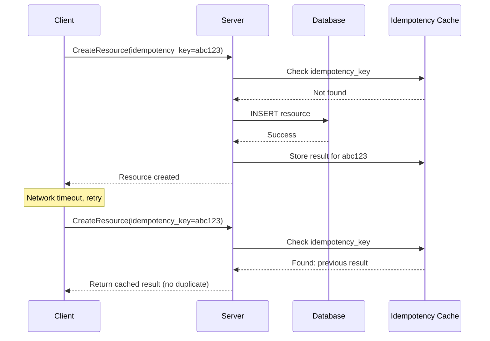
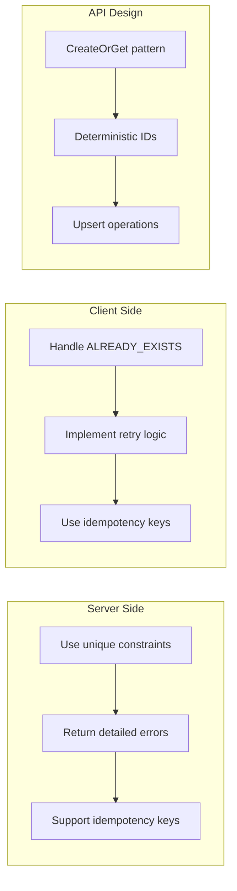

# How to Fix 'Already Exists' Errors in gRPC

Author: [nawazdhandala](https://www.github.com/nawazdhandala)

Tags: gRPC, Error Handling, Already Exists, Idempotency, Go, Python, Debugging

Description: A practical guide to handling and preventing ALREADY_EXISTS errors in gRPC services, including idempotency patterns, duplicate detection, and proper client-side error handling.

---

> The ALREADY_EXISTS status code in gRPC indicates that an attempt was made to create an entity that already exists. This guide covers strategies for handling these errors gracefully, implementing idempotent operations, and designing APIs that prevent duplicate creation issues.

Understanding when and how to use ALREADY_EXISTS helps you build robust APIs that handle retries and race conditions correctly.

---

## Understanding ALREADY_EXISTS



---

## When to Use ALREADY_EXISTS

```go
// Use ALREADY_EXISTS when:
// 1. A resource with the same identifier already exists
// 2. Attempting to create a duplicate unique constraint violation
// 3. A one-time action has already been performed

// Do NOT use ALREADY_EXISTS for:
// - Update operations that find existing data (this is expected)
// - Non-unique constraints (use INVALID_ARGUMENT)
// - State conflicts (use FAILED_PRECONDITION or ABORTED)
```

---

## Server-Side Implementation

### Go Server with Proper ALREADY_EXISTS Handling

```go
package main

import (
    "context"
    "database/sql"
    "strings"

    "github.com/lib/pq"
    "google.golang.org/grpc/codes"
    "google.golang.org/grpc/status"
    pb "myservice/proto"
)

type server struct {
    pb.UnimplementedResourceServiceServer
    db *sql.DB
}

// CreateResource handles resource creation with duplicate detection
func (s *server) CreateResource(ctx context.Context, req *pb.CreateResourceRequest) (*pb.Resource, error) {
    // Validate request
    if req.Name == "" {
        return nil, status.Error(codes.InvalidArgument, "name is required")
    }

    // Generate ID or use client-provided ID
    resourceID := req.ResourceId
    if resourceID == "" {
        resourceID = generateUUID()
    }

    // Attempt to create resource
    resource := &pb.Resource{
        Id:        resourceID,
        Name:      req.Name,
        CreatedBy: req.CreatedBy,
    }

    _, err := s.db.ExecContext(ctx,
        `INSERT INTO resources (id, name, created_by, created_at)
         VALUES ($1, $2, $3, NOW())`,
        resource.Id, resource.Name, resource.CreatedBy,
    )

    if err != nil {
        // Check for PostgreSQL unique violation
        if pqErr, ok := err.(*pq.Error); ok {
            if pqErr.Code == "23505" { // unique_violation
                // Determine which constraint was violated
                return nil, s.handleUniqueViolation(ctx, pqErr, req)
            }
        }
        return nil, status.Errorf(codes.Internal, "failed to create resource: %v", err)
    }

    return resource, nil
}

// handleUniqueViolation returns appropriate error based on constraint
func (s *server) handleUniqueViolation(ctx context.Context, pqErr *pq.Error, req *pb.CreateResourceRequest) error {
    constraintName := pqErr.Constraint

    switch {
    case strings.Contains(constraintName, "id"):
        // ID already exists - likely a retry
        return status.Errorf(codes.AlreadyExists,
            "resource with ID %s already exists", req.ResourceId)

    case strings.Contains(constraintName, "name"):
        // Name already exists - different resource
        return status.Errorf(codes.AlreadyExists,
            "resource with name %q already exists", req.Name)

    default:
        return status.Errorf(codes.AlreadyExists,
            "resource already exists (constraint: %s)", constraintName)
    }
}
```

### Python Server with Detailed Error Information

```python
import grpc
import uuid
from google.protobuf import any_pb2
from google.rpc import error_details_pb2, status_pb2

class ResourceService(service_pb2_grpc.ResourceServiceServicer):

    def __init__(self, db_pool):
        self.db_pool = db_pool

    def CreateResource(self, request, context):
        """Create a new resource with duplicate detection."""

        # Validate request
        if not request.name:
            context.abort(grpc.StatusCode.INVALID_ARGUMENT, "name is required")
            return service_pb2.Resource()

        # Generate or use provided ID
        resource_id = request.resource_id or str(uuid.uuid4())

        conn = self.db_pool.getconn()
        try:
            with conn.cursor() as cursor:
                try:
                    cursor.execute(
                        """
                        INSERT INTO resources (id, name, created_by, created_at)
                        VALUES (%s, %s, %s, NOW())
                        RETURNING id, name, created_by, created_at
                        """,
                        (resource_id, request.name, request.created_by)
                    )
                    conn.commit()

                    row = cursor.fetchone()
                    return service_pb2.Resource(
                        id=row[0],
                        name=row[1],
                        created_by=row[2]
                    )

                except Exception as e:
                    conn.rollback()
                    error_str = str(e)

                    # Check for unique constraint violation
                    if "duplicate key" in error_str or "unique constraint" in error_str:
                        # Return rich error with details
                        self._abort_already_exists(
                            context,
                            request,
                            error_str
                        )
                        return service_pb2.Resource()

                    raise

        finally:
            self.db_pool.putconn(conn)

    def _abort_already_exists(self, context, request, error_str):
        """Abort with detailed ALREADY_EXISTS error."""

        # Determine what field caused the conflict
        if "resources_id_key" in error_str:
            field = "resource_id"
            description = f"Resource with ID '{request.resource_id}' already exists"
        elif "resources_name_key" in error_str:
            field = "name"
            description = f"Resource with name '{request.name}' already exists"
        else:
            field = "unknown"
            description = "Resource already exists"

        # Create rich error status
        detail = any_pb2.Any()
        resource_info = error_details_pb2.ResourceInfo(
            resource_type="Resource",
            resource_name=request.name,
            owner="",
            description=description
        )
        detail.Pack(resource_info)

        # Create status with details
        rich_status = status_pb2.Status(
            code=grpc.StatusCode.ALREADY_EXISTS.value[0],
            message=description,
            details=[detail]
        )

        # Set trailing metadata with error details
        context.abort_with_status(
            grpc.Status(
                grpc.StatusCode.ALREADY_EXISTS,
                description
            )
        )
```

---

## Idempotent Create Operations

### Using Idempotency Keys



### Go Implementation with Idempotency

```go
package main

import (
    "context"
    "crypto/sha256"
    "encoding/hex"
    "sync"
    "time"

    "google.golang.org/grpc/codes"
    "google.golang.org/grpc/status"
    pb "myservice/proto"
)

// IdempotencyStore tracks recent operations
type IdempotencyStore struct {
    mu      sync.RWMutex
    cache   map[string]*idempotencyEntry
    ttl     time.Duration
}

type idempotencyEntry struct {
    result    *pb.Resource
    err       error
    createdAt time.Time
}

// NewIdempotencyStore creates a new store with TTL
func NewIdempotencyStore(ttl time.Duration) *IdempotencyStore {
    store := &IdempotencyStore{
        cache: make(map[string]*idempotencyEntry),
        ttl:   ttl,
    }
    go store.cleanupLoop()
    return store
}

type serverWithIdempotency struct {
    pb.UnimplementedResourceServiceServer
    db              *sql.DB
    idempotencyStore *IdempotencyStore
}

// CreateResource with idempotency key support
func (s *serverWithIdempotency) CreateResource(ctx context.Context, req *pb.CreateResourceRequest) (*pb.Resource, error) {
    // Generate idempotency key from request or use provided one
    idempotencyKey := req.IdempotencyKey
    if idempotencyKey == "" {
        // Generate deterministic key from request content
        idempotencyKey = s.generateIdempotencyKey(req)
    }

    // Check if we've seen this request before
    if entry := s.idempotencyStore.Get(idempotencyKey); entry != nil {
        // Return cached result
        if entry.err != nil {
            return nil, entry.err
        }
        return entry.result, nil
    }

    // Process the request
    result, err := s.doCreateResource(ctx, req)

    // Store the result for future retries
    s.idempotencyStore.Set(idempotencyKey, result, err)

    return result, err
}

// doCreateResource performs the actual creation
func (s *serverWithIdempotency) doCreateResource(ctx context.Context, req *pb.CreateResourceRequest) (*pb.Resource, error) {
    // Use INSERT ... ON CONFLICT for atomic idempotent insert
    var resource pb.Resource

    err := s.db.QueryRowContext(ctx,
        `INSERT INTO resources (id, name, created_by, created_at)
         VALUES ($1, $2, $3, NOW())
         ON CONFLICT (id) DO UPDATE SET id = resources.id
         RETURNING id, name, created_by`,
        req.ResourceId, req.Name, req.CreatedBy,
    ).Scan(&resource.Id, &resource.Name, &resource.CreatedBy)

    if err != nil {
        return nil, status.Errorf(codes.Internal, "failed to create: %v", err)
    }

    return &resource, nil
}

// generateIdempotencyKey creates a deterministic key from request
func (s *serverWithIdempotency) generateIdempotencyKey(req *pb.CreateResourceRequest) string {
    h := sha256.New()
    h.Write([]byte(req.Name))
    h.Write([]byte(req.CreatedBy))
    return hex.EncodeToString(h.Sum(nil))
}

// Get retrieves a cached entry
func (s *IdempotencyStore) Get(key string) *idempotencyEntry {
    s.mu.RLock()
    defer s.mu.RUnlock()

    entry, ok := s.cache[key]
    if !ok {
        return nil
    }

    if time.Since(entry.createdAt) > s.ttl {
        return nil
    }

    return entry
}

// Set stores a result
func (s *IdempotencyStore) Set(key string, result *pb.Resource, err error) {
    s.mu.Lock()
    defer s.mu.Unlock()

    s.cache[key] = &idempotencyEntry{
        result:    result,
        err:       err,
        createdAt: time.Now(),
    }
}
```

### Python Implementation with Redis-Based Idempotency

```python
import grpc
import json
import hashlib
import redis
from typing import Optional, Tuple

class IdempotencyMiddleware:
    """Middleware for handling idempotent create operations."""

    def __init__(self, redis_client: redis.Redis, ttl_seconds: int = 3600):
        self.redis = redis_client
        self.ttl = ttl_seconds

    def get_cached_result(self, key: str) -> Optional[Tuple[dict, Optional[str]]]:
        """Get cached result for idempotency key."""
        data = self.redis.get(f"idempotency:{key}")
        if data is None:
            return None

        cached = json.loads(data)
        return cached.get('result'), cached.get('error')

    def cache_result(self, key: str, result: dict = None, error: str = None):
        """Cache result for idempotency key."""
        data = json.dumps({
            'result': result,
            'error': error
        })
        self.redis.setex(f"idempotency:{key}", self.ttl, data)

    def generate_key(self, method: str, request) -> str:
        """Generate deterministic key from request."""
        h = hashlib.sha256()
        h.update(method.encode())
        h.update(request.SerializeToString())
        return h.hexdigest()


class IdempotentResourceService(service_pb2_grpc.ResourceServiceServicer):

    def __init__(self, db_pool, redis_client):
        self.db_pool = db_pool
        self.idempotency = IdempotencyMiddleware(redis_client)

    def CreateResource(self, request, context):
        """Create resource with idempotency support."""

        # Get or generate idempotency key
        idempotency_key = request.idempotency_key
        if not idempotency_key:
            idempotency_key = self.idempotency.generate_key(
                "CreateResource",
                request
            )

        # Check cache first
        cached = self.idempotency.get_cached_result(idempotency_key)
        if cached is not None:
            result, error = cached
            if error:
                context.abort(grpc.StatusCode.ALREADY_EXISTS, error)
                return service_pb2.Resource()
            return service_pb2.Resource(**result)

        # Perform create operation
        try:
            resource = self._do_create(request)

            # Cache successful result
            self.idempotency.cache_result(
                idempotency_key,
                result={
                    'id': resource.id,
                    'name': resource.name,
                    'created_by': resource.created_by
                }
            )

            return resource

        except DuplicateError as e:
            # Cache the error too
            self.idempotency.cache_result(
                idempotency_key,
                error=str(e)
            )
            context.abort(grpc.StatusCode.ALREADY_EXISTS, str(e))
            return service_pb2.Resource()

    def _do_create(self, request):
        """Perform actual create operation."""
        conn = self.db_pool.getconn()
        try:
            with conn.cursor() as cursor:
                cursor.execute(
                    """
                    INSERT INTO resources (id, name, created_by)
                    VALUES (%s, %s, %s)
                    ON CONFLICT (name) DO NOTHING
                    RETURNING id, name, created_by
                    """,
                    (request.resource_id or str(uuid.uuid4()),
                     request.name,
                     request.created_by)
                )
                conn.commit()

                row = cursor.fetchone()
                if row is None:
                    # Conflict occurred, fetch existing
                    cursor.execute(
                        "SELECT id, name, created_by FROM resources WHERE name = %s",
                        (request.name,)
                    )
                    existing = cursor.fetchone()
                    raise DuplicateError(
                        f"Resource with name '{request.name}' already exists "
                        f"with ID '{existing[0]}'"
                    )

                return service_pb2.Resource(
                    id=row[0],
                    name=row[1],
                    created_by=row[2]
                )
        finally:
            self.db_pool.putconn(conn)
```

---

## Client-Side Error Handling

### Go Client with ALREADY_EXISTS Handling

```go
package main

import (
    "context"
    "log"

    "google.golang.org/grpc"
    "google.golang.org/grpc/codes"
    "google.golang.org/grpc/status"
    pb "myservice/proto"
)

type ResourceClient struct {
    client pb.ResourceServiceClient
}

// CreateOrGet creates a resource or returns existing one
func (c *ResourceClient) CreateOrGet(ctx context.Context, name string) (*pb.Resource, error) {
    // Attempt to create
    resource, err := c.client.CreateResource(ctx, &pb.CreateResourceRequest{
        Name: name,
    })

    if err == nil {
        return resource, nil
    }

    // Check if it's ALREADY_EXISTS
    st, ok := status.FromError(err)
    if !ok || st.Code() != codes.AlreadyExists {
        return nil, err
    }

    // Resource exists, fetch it
    log.Printf("Resource %q already exists, fetching...", name)

    return c.client.GetResourceByName(ctx, &pb.GetResourceByNameRequest{
        Name: name,
    })
}

// CreateIdempotent creates a resource with retry handling
func (c *ResourceClient) CreateIdempotent(ctx context.Context, req *pb.CreateResourceRequest) (*pb.Resource, error) {
    // Generate idempotency key if not provided
    if req.IdempotencyKey == "" {
        req.IdempotencyKey = generateIdempotencyKey(req)
    }

    resource, err := c.client.CreateResource(ctx, req)
    if err == nil {
        return resource, nil
    }

    st, ok := status.FromError(err)
    if !ok {
        return nil, err
    }

    switch st.Code() {
    case codes.AlreadyExists:
        // For idempotent creates, ALREADY_EXISTS with same idempotency key
        // means our previous request succeeded
        if req.ResourceId != "" {
            // Try to fetch by ID we provided
            return c.client.GetResource(ctx, &pb.GetResourceRequest{
                ResourceId: req.ResourceId,
            })
        }
        return nil, err

    default:
        return nil, err
    }
}
```

### Python Client with Error Details Extraction

```python
import grpc
from google.rpc import error_details_pb2
from grpc_status import rpc_status


class ResourceClient:
    def __init__(self, stub):
        self.stub = stub

    def create_or_get(self, name: str, created_by: str) -> 'Resource':
        """Create resource or return existing one."""
        try:
            return self.stub.CreateResource(
                service_pb2.CreateResourceRequest(
                    name=name,
                    created_by=created_by
                )
            )
        except grpc.RpcError as e:
            if e.code() != grpc.StatusCode.ALREADY_EXISTS:
                raise

            # Extract details about existing resource
            details = self._extract_error_details(e)
            print(f"Resource already exists: {details}")

            # Fetch existing resource
            return self.stub.GetResourceByName(
                service_pb2.GetResourceByNameRequest(name=name)
            )

    def _extract_error_details(self, error: grpc.RpcError) -> dict:
        """Extract rich error details from gRPC error."""
        details = {}

        try:
            status = rpc_status.from_call(error)
            if status is not None:
                for detail in status.details:
                    if detail.Is(error_details_pb2.ResourceInfo.DESCRIPTOR):
                        resource_info = error_details_pb2.ResourceInfo()
                        detail.Unpack(resource_info)
                        details['resource_type'] = resource_info.resource_type
                        details['resource_name'] = resource_info.resource_name
                        details['description'] = resource_info.description
        except Exception:
            pass

        # Fallback to basic details
        if not details:
            details['message'] = error.details()

        return details

    def create_with_conflict_resolution(
        self,
        name: str,
        created_by: str,
        on_conflict: str = "fetch"  # "fetch", "error", "update"
    ) -> 'Resource':
        """Create resource with configurable conflict resolution."""

        try:
            return self.stub.CreateResource(
                service_pb2.CreateResourceRequest(
                    name=name,
                    created_by=created_by
                )
            )
        except grpc.RpcError as e:
            if e.code() != grpc.StatusCode.ALREADY_EXISTS:
                raise

            if on_conflict == "error":
                raise

            elif on_conflict == "fetch":
                return self.stub.GetResourceByName(
                    service_pb2.GetResourceByNameRequest(name=name)
                )

            elif on_conflict == "update":
                # Get existing and update
                existing = self.stub.GetResourceByName(
                    service_pb2.GetResourceByNameRequest(name=name)
                )
                return self.stub.UpdateResource(
                    service_pb2.UpdateResourceRequest(
                        resource_id=existing.id,
                        created_by=created_by
                    )
                )

            raise ValueError(f"Unknown conflict resolution: {on_conflict}")
```

---

## Best Practices Summary



### API Design Patterns

```protobuf
// Pattern 1: Explicit CreateOrGet
service ResourceService {
    // Create fails if exists
    rpc CreateResource(CreateResourceRequest) returns (Resource);

    // Get or create - never fails with ALREADY_EXISTS
    rpc GetOrCreateResource(GetOrCreateResourceRequest) returns (Resource);
}

// Pattern 2: Idempotency key in request
message CreateResourceRequest {
    string name = 1;
    string created_by = 2;

    // Optional: client-provided idempotency key
    string idempotency_key = 3;

    // Optional: client-provided ID for deterministic creates
    string resource_id = 4;
}
```

---

## Conclusion

Handling ALREADY_EXISTS errors properly is essential for building robust gRPC APIs. Key takeaways:

1. **Include useful details** in ALREADY_EXISTS errors to help clients understand the conflict
2. **Support idempotency keys** to make create operations safely retryable
3. **Consider CreateOrGet patterns** for operations that should be idempotent by design
4. **Handle conflicts gracefully** on the client side with appropriate retry or fetch logic
5. **Use database constraints** as the source of truth for uniqueness

By implementing these patterns, your services will handle retries and race conditions gracefully, making them more reliable in distributed environments.

---

*Need to track duplicate creation attempts across your services? [OneUptime](https://oneuptime.com) provides error tracking and alerting that helps you identify patterns in ALREADY_EXISTS errors.*

**Related Reading:**
- [gRPC Error Handling Best Practices](https://oneuptime.com/blog)
- [Idempotency in Distributed Systems](https://oneuptime.com/blog)
