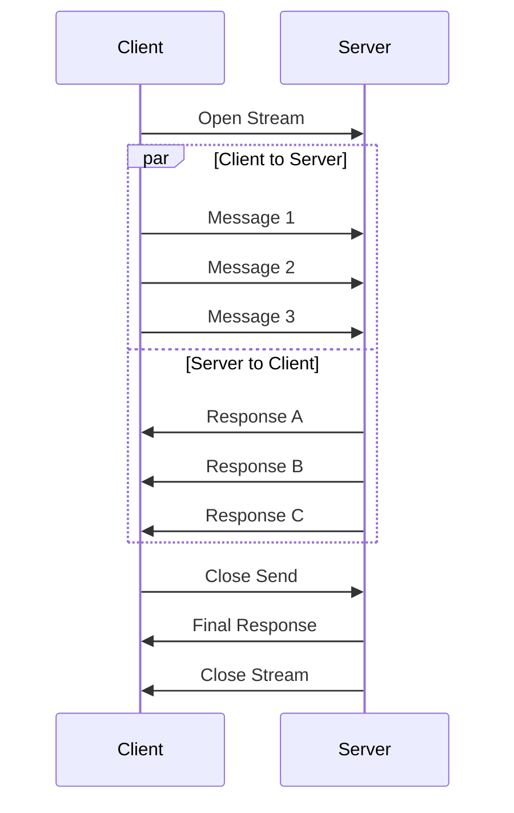
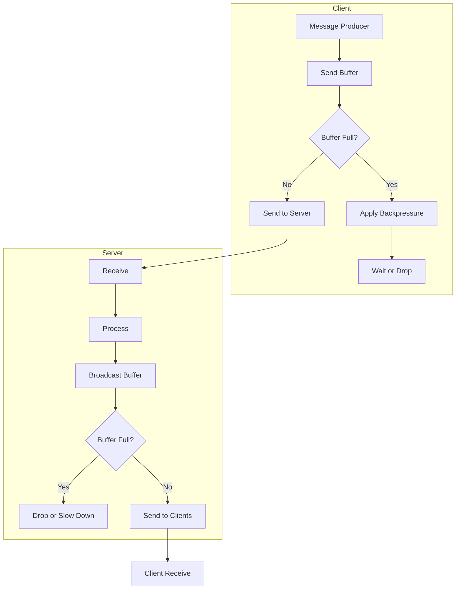

# How to Handle Bidirectional Streaming in gRPC

Author: [nawazdhandala](https://www.github.com/nawazdhandala)

Tags: gRPC, bidirectional streaming, real-time, WebSocket alternative, microservices, protocol buffers, concurrency

Description: A comprehensive guide to implementing bidirectional streaming in gRPC, covering patterns, error handling, flow control, and real-world use cases.

---

Bidirectional streaming is gRPC's most powerful communication pattern, allowing both client and server to send streams of messages independently and concurrently. Unlike unary calls or one-way streaming, bidirectional streaming enables true real-time, interactive communication. This guide covers everything you need to know to implement robust bidirectional streaming in your gRPC services.

## Understanding Bidirectional Streaming

Bidirectional streaming differs from other gRPC patterns in that both sides can send messages at any time without waiting for responses.



### When to Use Bidirectional Streaming

| Use Case | Why Bidirectional? |
|----------|-------------------|
| Real-time chat | Both parties send messages independently |
| Multiplayer gaming | Continuous state updates in both directions |
| Collaborative editing | Changes flow both ways simultaneously |
| IoT device communication | Sensors send data while receiving commands |
| Live dashboards | User interactions and data updates |
| Video/audio calls | Media streams flow both directions |

## Defining the Protocol Buffer Service

```protobuf
// chat.proto
syntax = "proto3";

package chat;

option go_package = "github.com/example/chat";

// Chat service with bidirectional streaming
service ChatService {
    // Real-time chat between users
    rpc Chat(stream ChatMessage) returns (stream ChatMessage);

    // Collaborative document editing
    rpc CollaborativeEdit(stream EditOperation) returns (stream EditOperation);

    // Game state synchronization
    rpc GameSync(stream GameAction) returns (stream GameState);
}

message ChatMessage {
    string id = 1;
    string sender_id = 2;
    string room_id = 3;
    string content = 4;
    int64 timestamp = 5;
    MessageType type = 6;

    enum MessageType {
        TEXT = 0;
        JOIN = 1;
        LEAVE = 2;
        TYPING = 3;
        SYSTEM = 4;
    }
}

message EditOperation {
    string document_id = 1;
    string user_id = 2;
    int32 position = 3;
    string operation = 4; // "insert", "delete", "replace"
    string content = 5;
    int64 version = 6;
    int64 timestamp = 7;
}

message GameAction {
    string player_id = 1;
    string action_type = 2;
    map<string, string> parameters = 3;
    int64 sequence = 4;
    int64 timestamp = 5;
}

message GameState {
    int64 tick = 1;
    repeated PlayerState players = 2;
    repeated GameEvent events = 3;
    int64 timestamp = 4;
}

message PlayerState {
    string player_id = 1;
    float x = 2;
    float y = 3;
    int32 health = 4;
    map<string, string> attributes = 5;
}

message GameEvent {
    string event_id = 1;
    string event_type = 2;
    string data = 3;
}
```

## Server Implementation

### Basic Bidirectional Stream Handler

```go
// server/chat_server.go
package server

import (
    "context"
    "io"
    "log"
    "sync"
    "time"

    "google.golang.org/grpc/codes"
    "google.golang.org/grpc/status"
    pb "github.com/example/chat"
)

type ChatServer struct {
    pb.UnimplementedChatServiceServer

    // Room management
    rooms     map[string]*ChatRoom
    roomsMu   sync.RWMutex

    // Message history
    history   map[string][]*pb.ChatMessage
    historyMu sync.RWMutex
}

type ChatRoom struct {
    id        string
    clients   map[string]*ClientStream
    clientsMu sync.RWMutex
    broadcast chan *pb.ChatMessage
    done      chan struct{}
}

type ClientStream struct {
    id     string
    stream pb.ChatService_ChatServer
    send   chan *pb.ChatMessage
    done   chan struct{}
}

func NewChatServer() *ChatServer {
    return &ChatServer{
        rooms:   make(map[string]*ChatRoom),
        history: make(map[string][]*pb.ChatMessage),
    }
}

// Chat implements bidirectional streaming for real-time chat
func (s *ChatServer) Chat(stream pb.ChatService_ChatServer) error {
    ctx := stream.Context()

    // Create client stream wrapper
    client := &ClientStream{
        id:     generateClientID(),
        stream: stream,
        send:   make(chan *pb.ChatMessage, 100),
        done:   make(chan struct{}),
    }

    var currentRoom *ChatRoom
    var wg sync.WaitGroup
    errChan := make(chan error, 2)

    // Sender goroutine - sends messages to client
    wg.Add(1)
    go func() {
        defer wg.Done()
        for {
            select {
            case <-ctx.Done():
                return
            case <-client.done:
                return
            case msg := <-client.send:
                if err := stream.Send(msg); err != nil {
                    errChan <- status.Errorf(codes.Internal, "send failed: %v", err)
                    return
                }
            }
        }
    }()

    // Receiver goroutine - receives messages from client
    wg.Add(1)
    go func() {
        defer wg.Done()
        for {
            msg, err := stream.Recv()
            if err == io.EOF {
                // Client closed the stream
                return
            }
            if err != nil {
                if status.Code(err) != codes.Canceled {
                    errChan <- err
                }
                return
            }

            // Handle different message types
            switch msg.Type {
            case pb.ChatMessage_JOIN:
                currentRoom = s.joinRoom(msg.RoomId, client)
                // Send room history
                s.sendHistory(client, msg.RoomId)
                // Broadcast join message
                s.broadcastToRoom(currentRoom, msg)

            case pb.ChatMessage_LEAVE:
                if currentRoom != nil {
                    s.leaveRoom(currentRoom, client)
                    s.broadcastToRoom(currentRoom, msg)
                    currentRoom = nil
                }

            case pb.ChatMessage_TEXT, pb.ChatMessage_TYPING:
                if currentRoom != nil {
                    // Store message (except typing indicators)
                    if msg.Type == pb.ChatMessage_TEXT {
                        s.storeMessage(msg.RoomId, msg)
                    }
                    // Broadcast to room
                    s.broadcastToRoom(currentRoom, msg)
                }
            }
        }
    }()

    // Wait for completion
    done := make(chan struct{})
    go func() {
        wg.Wait()
        close(done)
    }()

    select {
    case <-ctx.Done():
        close(client.done)
        if currentRoom != nil {
            s.leaveRoom(currentRoom, client)
        }
        return ctx.Err()
    case err := <-errChan:
        close(client.done)
        if currentRoom != nil {
            s.leaveRoom(currentRoom, client)
        }
        return err
    case <-done:
        close(client.done)
        if currentRoom != nil {
            s.leaveRoom(currentRoom, client)
        }
        return nil
    }
}

func (s *ChatServer) joinRoom(roomID string, client *ClientStream) *ChatRoom {
    s.roomsMu.Lock()
    defer s.roomsMu.Unlock()

    room, exists := s.rooms[roomID]
    if !exists {
        room = &ChatRoom{
            id:        roomID,
            clients:   make(map[string]*ClientStream),
            broadcast: make(chan *pb.ChatMessage, 100),
            done:      make(chan struct{}),
        }
        s.rooms[roomID] = room

        // Start room broadcaster
        go s.roomBroadcaster(room)
    }

    room.clientsMu.Lock()
    room.clients[client.id] = client
    room.clientsMu.Unlock()

    log.Printf("Client %s joined room %s", client.id, roomID)
    return room
}

func (s *ChatServer) leaveRoom(room *ChatRoom, client *ClientStream) {
    room.clientsMu.Lock()
    delete(room.clients, client.id)
    isEmpty := len(room.clients) == 0
    room.clientsMu.Unlock()

    log.Printf("Client %s left room %s", client.id, room.id)

    // Clean up empty room
    if isEmpty {
        s.roomsMu.Lock()
        if r, exists := s.rooms[room.id]; exists && r == room {
            delete(s.rooms, room.id)
            close(room.done)
        }
        s.roomsMu.Unlock()
    }
}

func (s *ChatServer) broadcastToRoom(room *ChatRoom, msg *pb.ChatMessage) {
    select {
    case room.broadcast <- msg:
    default:
        log.Printf("Room %s broadcast buffer full, dropping message", room.id)
    }
}

func (s *ChatServer) roomBroadcaster(room *ChatRoom) {
    for {
        select {
        case <-room.done:
            return
        case msg := <-room.broadcast:
            room.clientsMu.RLock()
            for _, client := range room.clients {
                select {
                case client.send <- msg:
                default:
                    log.Printf("Client %s buffer full, dropping message", client.id)
                }
            }
            room.clientsMu.RUnlock()
        }
    }
}

func (s *ChatServer) storeMessage(roomID string, msg *pb.ChatMessage) {
    s.historyMu.Lock()
    defer s.historyMu.Unlock()

    s.history[roomID] = append(s.history[roomID], msg)

    // Keep only last 100 messages
    if len(s.history[roomID]) > 100 {
        s.history[roomID] = s.history[roomID][len(s.history[roomID])-100:]
    }
}

func (s *ChatServer) sendHistory(client *ClientStream, roomID string) {
    s.historyMu.RLock()
    messages := s.history[roomID]
    s.historyMu.RUnlock()

    for _, msg := range messages {
        select {
        case client.send <- msg:
        default:
            return // Buffer full
        }
    }
}

func generateClientID() string {
    return fmt.Sprintf("client-%d", time.Now().UnixNano())
}
```

### Advanced Pattern: Collaborative Editing

```go
// server/collaborative_edit.go
package server

import (
    "io"
    "sync"

    "google.golang.org/grpc/codes"
    "google.golang.org/grpc/status"
    pb "github.com/example/chat"
)

type Document struct {
    id        string
    content   []rune
    version   int64
    mu        sync.RWMutex
    editors   map[string]*EditorStream
    editorsMu sync.RWMutex
    updates   chan *pb.EditOperation
}

type EditorStream struct {
    userID string
    stream pb.ChatService_CollaborativeEditServer
    send   chan *pb.EditOperation
}

// CollaborativeEdit implements operational transformation for collaborative editing
func (s *ChatServer) CollaborativeEdit(stream pb.ChatService_CollaborativeEditServer) error {
    ctx := stream.Context()

    var doc *Document
    var editor *EditorStream
    var wg sync.WaitGroup
    errChan := make(chan error, 2)

    // Sender goroutine
    wg.Add(1)
    go func() {
        defer wg.Done()
        if editor == nil {
            return
        }
        for {
            select {
            case <-ctx.Done():
                return
            case op, ok := <-editor.send:
                if !ok {
                    return
                }
                if err := stream.Send(op); err != nil {
                    errChan <- err
                    return
                }
            }
        }
    }()

    // Receiver goroutine
    wg.Add(1)
    go func() {
        defer wg.Done()
        for {
            op, err := stream.Recv()
            if err == io.EOF {
                return
            }
            if err != nil {
                if status.Code(err) != codes.Canceled {
                    errChan <- err
                }
                return
            }

            // Initialize document and editor on first message
            if doc == nil {
                doc = s.getOrCreateDocument(op.DocumentId)
                editor = &EditorStream{
                    userID: op.UserId,
                    stream: stream,
                    send:   make(chan *pb.EditOperation, 100),
                }
                s.addEditor(doc, editor)
            }

            // Apply operational transformation
            transformedOp := s.transformOperation(doc, op)

            // Apply operation to document
            s.applyOperation(doc, transformedOp)

            // Broadcast to other editors
            s.broadcastOperation(doc, editor.userID, transformedOp)
        }
    }()

    // Wait for completion
    done := make(chan struct{})
    go func() {
        wg.Wait()
        close(done)
    }()

    select {
    case <-ctx.Done():
        if doc != nil && editor != nil {
            s.removeEditor(doc, editor)
        }
        return ctx.Err()
    case err := <-errChan:
        if doc != nil && editor != nil {
            s.removeEditor(doc, editor)
        }
        return err
    case <-done:
        if doc != nil && editor != nil {
            s.removeEditor(doc, editor)
        }
        return nil
    }
}

func (s *ChatServer) transformOperation(doc *Document, op *pb.EditOperation) *pb.EditOperation {
    doc.mu.Lock()
    defer doc.mu.Unlock()

    // Simple operational transformation
    // In production, use a proper OT library

    transformed := &pb.EditOperation{
        DocumentId: op.DocumentId,
        UserId:     op.UserId,
        Position:   op.Position,
        Operation:  op.Operation,
        Content:    op.Content,
        Version:    doc.version + 1,
        Timestamp:  op.Timestamp,
    }

    // Adjust position based on concurrent operations
    if op.Version < doc.version {
        // Transform position based on operations since client's version
        // This is simplified - real OT is more complex
        transformed.Position = op.Position
    }

    doc.version++
    return transformed
}

func (s *ChatServer) applyOperation(doc *Document, op *pb.EditOperation) {
    doc.mu.Lock()
    defer doc.mu.Unlock()

    switch op.Operation {
    case "insert":
        if int(op.Position) <= len(doc.content) {
            newContent := make([]rune, 0, len(doc.content)+len(op.Content))
            newContent = append(newContent, doc.content[:op.Position]...)
            newContent = append(newContent, []rune(op.Content)...)
            newContent = append(newContent, doc.content[op.Position:]...)
            doc.content = newContent
        }

    case "delete":
        if int(op.Position) < len(doc.content) {
            deleteLen := len(op.Content)
            if int(op.Position)+deleteLen > len(doc.content) {
                deleteLen = len(doc.content) - int(op.Position)
            }
            doc.content = append(doc.content[:op.Position], doc.content[op.Position+int32(deleteLen):]...)
        }

    case "replace":
        // Delete then insert
        s.applyOperation(doc, &pb.EditOperation{
            Operation: "delete",
            Position:  op.Position,
            Content:   op.Content,
        })
        s.applyOperation(doc, &pb.EditOperation{
            Operation: "insert",
            Position:  op.Position,
            Content:   op.Content,
        })
    }
}

func (s *ChatServer) broadcastOperation(doc *Document, senderID string, op *pb.EditOperation) {
    doc.editorsMu.RLock()
    defer doc.editorsMu.RUnlock()

    for userID, editor := range doc.editors {
        if userID != senderID {
            select {
            case editor.send <- op:
            default:
                // Buffer full, operation dropped
            }
        }
    }
}
```

## Client Implementation

### Basic Chat Client

```go
// client/chat_client.go
package client

import (
    "context"
    "io"
    "log"
    "sync"
    "time"

    "google.golang.org/grpc"
    "google.golang.org/grpc/codes"
    "google.golang.org/grpc/status"
    pb "github.com/example/chat"
)

type ChatClient struct {
    conn      *grpc.ClientConn
    client    pb.ChatServiceClient
    stream    pb.ChatService_ChatClient
    userID    string
    roomID    string

    send      chan *pb.ChatMessage
    receive   chan *pb.ChatMessage
    errors    chan error
    done      chan struct{}

    mu        sync.Mutex
    connected bool
}

func NewChatClient(addr, userID string) (*ChatClient, error) {
    conn, err := grpc.Dial(addr,
        grpc.WithInsecure(),
        grpc.WithBlock(),
        grpc.WithTimeout(10*time.Second),
    )
    if err != nil {
        return nil, err
    }

    return &ChatClient{
        conn:    conn,
        client:  pb.NewChatServiceClient(conn),
        userID:  userID,
        send:    make(chan *pb.ChatMessage, 100),
        receive: make(chan *pb.ChatMessage, 100),
        errors:  make(chan error, 10),
        done:    make(chan struct{}),
    }, nil
}

// Connect establishes the bidirectional stream
func (c *ChatClient) Connect(ctx context.Context) error {
    c.mu.Lock()
    defer c.mu.Unlock()

    if c.connected {
        return nil
    }

    stream, err := c.client.Chat(ctx)
    if err != nil {
        return err
    }

    c.stream = stream
    c.connected = true

    // Start send/receive goroutines
    go c.sendLoop(ctx)
    go c.receiveLoop(ctx)

    return nil
}

func (c *ChatClient) sendLoop(ctx context.Context) {
    for {
        select {
        case <-ctx.Done():
            return
        case <-c.done:
            return
        case msg := <-c.send:
            if err := c.stream.Send(msg); err != nil {
                c.errors <- err
                return
            }
        }
    }
}

func (c *ChatClient) receiveLoop(ctx context.Context) {
    for {
        msg, err := c.stream.Recv()
        if err == io.EOF {
            close(c.receive)
            return
        }
        if err != nil {
            if status.Code(err) != codes.Canceled {
                c.errors <- err
            }
            return
        }

        select {
        case c.receive <- msg:
        case <-ctx.Done():
            return
        case <-c.done:
            return
        }
    }
}

// JoinRoom joins a chat room
func (c *ChatClient) JoinRoom(roomID string) error {
    c.roomID = roomID

    msg := &pb.ChatMessage{
        Id:        generateMessageID(),
        SenderId:  c.userID,
        RoomId:    roomID,
        Type:      pb.ChatMessage_JOIN,
        Timestamp: time.Now().UnixNano(),
    }

    select {
    case c.send <- msg:
        return nil
    case <-time.After(5 * time.Second):
        return status.Error(codes.DeadlineExceeded, "timeout joining room")
    }
}

// SendMessage sends a text message to the current room
func (c *ChatClient) SendMessage(content string) error {
    if c.roomID == "" {
        return status.Error(codes.FailedPrecondition, "not in a room")
    }

    msg := &pb.ChatMessage{
        Id:        generateMessageID(),
        SenderId:  c.userID,
        RoomId:    c.roomID,
        Content:   content,
        Type:      pb.ChatMessage_TEXT,
        Timestamp: time.Now().UnixNano(),
    }

    select {
    case c.send <- msg:
        return nil
    case <-time.After(5 * time.Second):
        return status.Error(codes.DeadlineExceeded, "timeout sending message")
    }
}

// SendTyping sends a typing indicator
func (c *ChatClient) SendTyping() error {
    if c.roomID == "" {
        return nil
    }

    msg := &pb.ChatMessage{
        Id:        generateMessageID(),
        SenderId:  c.userID,
        RoomId:    c.roomID,
        Type:      pb.ChatMessage_TYPING,
        Timestamp: time.Now().UnixNano(),
    }

    select {
    case c.send <- msg:
        return nil
    default:
        return nil // Non-blocking for typing indicators
    }
}

// LeaveRoom leaves the current room
func (c *ChatClient) LeaveRoom() error {
    if c.roomID == "" {
        return nil
    }

    msg := &pb.ChatMessage{
        Id:        generateMessageID(),
        SenderId:  c.userID,
        RoomId:    c.roomID,
        Type:      pb.ChatMessage_LEAVE,
        Timestamp: time.Now().UnixNano(),
    }

    select {
    case c.send <- msg:
        c.roomID = ""
        return nil
    case <-time.After(5 * time.Second):
        return status.Error(codes.DeadlineExceeded, "timeout leaving room")
    }
}

// Messages returns the channel for incoming messages
func (c *ChatClient) Messages() <-chan *pb.ChatMessage {
    return c.receive
}

// Errors returns the channel for errors
func (c *ChatClient) Errors() <-chan error {
    return c.errors
}

// Close closes the connection
func (c *ChatClient) Close() error {
    c.mu.Lock()
    defer c.mu.Unlock()

    if !c.connected {
        return nil
    }

    close(c.done)
    c.stream.CloseSend()
    c.connected = false

    return c.conn.Close()
}

func generateMessageID() string {
    return fmt.Sprintf("msg-%d", time.Now().UnixNano())
}
```

### Reconnection with Exponential Backoff

```go
// client/reconnecting_client.go
package client

import (
    "context"
    "log"
    "sync"
    "time"

    "google.golang.org/grpc/codes"
    "google.golang.org/grpc/status"
)

type ReconnectingChatClient struct {
    *ChatClient

    serverAddr     string
    reconnectDelay time.Duration
    maxDelay       time.Duration

    ctx    context.Context
    cancel context.CancelFunc
    wg     sync.WaitGroup

    onReconnect func()
    onDisconnect func(error)
}

type ReconnectConfig struct {
    InitialDelay time.Duration
    MaxDelay     time.Duration
    OnReconnect  func()
    OnDisconnect func(error)
}

func NewReconnectingClient(addr, userID string, config ReconnectConfig) (*ReconnectingChatClient, error) {
    client, err := NewChatClient(addr, userID)
    if err != nil {
        return nil, err
    }

    ctx, cancel := context.WithCancel(context.Background())

    rc := &ReconnectingChatClient{
        ChatClient:     client,
        serverAddr:     addr,
        reconnectDelay: config.InitialDelay,
        maxDelay:       config.MaxDelay,
        ctx:            ctx,
        cancel:         cancel,
        onReconnect:    config.OnReconnect,
        onDisconnect:   config.OnDisconnect,
    }

    // Start error handler
    rc.wg.Add(1)
    go rc.errorHandler()

    return rc, nil
}

func (rc *ReconnectingChatClient) errorHandler() {
    defer rc.wg.Done()

    for {
        select {
        case <-rc.ctx.Done():
            return
        case err := <-rc.ChatClient.Errors():
            if rc.onDisconnect != nil {
                rc.onDisconnect(err)
            }

            // Attempt reconnection
            if rc.shouldReconnect(err) {
                rc.reconnect()
            }
        }
    }
}

func (rc *ReconnectingChatClient) shouldReconnect(err error) bool {
    st, ok := status.FromError(err)
    if !ok {
        return true
    }

    switch st.Code() {
    case codes.Unavailable, codes.ResourceExhausted, codes.Aborted:
        return true
    case codes.Unauthenticated, codes.PermissionDenied:
        return false
    default:
        return true
    }
}

func (rc *ReconnectingChatClient) reconnect() {
    delay := rc.reconnectDelay

    for {
        select {
        case <-rc.ctx.Done():
            return
        case <-time.After(delay):
        }

        log.Printf("Attempting reconnection...")

        // Create new client
        newClient, err := NewChatClient(rc.serverAddr, rc.ChatClient.userID)
        if err != nil {
            log.Printf("Reconnection failed: %v", err)
            delay = delay * 2
            if delay > rc.maxDelay {
                delay = rc.maxDelay
            }
            continue
        }

        // Connect
        if err := newClient.Connect(rc.ctx); err != nil {
            log.Printf("Connection failed: %v", err)
            newClient.Close()
            delay = delay * 2
            if delay > rc.maxDelay {
                delay = rc.maxDelay
            }
            continue
        }

        // Replace old client
        oldClient := rc.ChatClient
        rc.ChatClient = newClient
        oldClient.Close()

        // Rejoin room if needed
        if rc.roomID != "" {
            rc.JoinRoom(rc.roomID)
        }

        log.Printf("Reconnected successfully")

        if rc.onReconnect != nil {
            rc.onReconnect()
        }

        // Reset delay
        rc.reconnectDelay = delay
        return
    }
}

func (rc *ReconnectingChatClient) Close() error {
    rc.cancel()
    rc.wg.Wait()
    return rc.ChatClient.Close()
}
```

## Flow Control and Backpressure



### Implementing Backpressure

```go
// common/backpressure.go
package common

import (
    "context"
    "sync"
    "time"
)

type BackpressureConfig struct {
    BufferSize      int
    HighWaterMark   int
    LowWaterMark    int
    DrainTimeout    time.Duration
}

type BackpressureBuffer struct {
    config  BackpressureConfig
    buffer  chan interface{}

    mu          sync.Mutex
    paused      bool
    pauseChan   chan struct{}
    resumeChan  chan struct{}
}

func NewBackpressureBuffer(config BackpressureConfig) *BackpressureBuffer {
    return &BackpressureBuffer{
        config:     config,
        buffer:     make(chan interface{}, config.BufferSize),
        pauseChan:  make(chan struct{}),
        resumeChan: make(chan struct{}),
    }
}

// Send adds an item to the buffer with backpressure handling
func (b *BackpressureBuffer) Send(ctx context.Context, item interface{}) error {
    // Check if we should apply backpressure
    if len(b.buffer) >= b.config.HighWaterMark {
        b.mu.Lock()
        if !b.paused {
            b.paused = true
            close(b.pauseChan)
            b.pauseChan = make(chan struct{})
        }
        b.mu.Unlock()

        // Wait for buffer to drain
        select {
        case <-ctx.Done():
            return ctx.Err()
        case <-b.resumeChan:
        case <-time.After(b.config.DrainTimeout):
            return status.Error(codes.ResourceExhausted, "buffer drain timeout")
        }
    }

    select {
    case b.buffer <- item:
        return nil
    case <-ctx.Done():
        return ctx.Err()
    }
}

// Receive gets an item from the buffer
func (b *BackpressureBuffer) Receive(ctx context.Context) (interface{}, error) {
    select {
    case item := <-b.buffer:
        // Check if we should resume
        if len(b.buffer) <= b.config.LowWaterMark {
            b.mu.Lock()
            if b.paused {
                b.paused = false
                close(b.resumeChan)
                b.resumeChan = make(chan struct{})
            }
            b.mu.Unlock()
        }
        return item, nil
    case <-ctx.Done():
        return nil, ctx.Err()
    }
}

// IsPaused returns whether the buffer is in backpressure mode
func (b *BackpressureBuffer) IsPaused() bool {
    b.mu.Lock()
    defer b.mu.Unlock()
    return b.paused
}

// WaitForResume blocks until backpressure is released
func (b *BackpressureBuffer) WaitForResume(ctx context.Context) error {
    b.mu.Lock()
    if !b.paused {
        b.mu.Unlock()
        return nil
    }
    resumeChan := b.resumeChan
    b.mu.Unlock()

    select {
    case <-resumeChan:
        return nil
    case <-ctx.Done():
        return ctx.Err()
    }
}
```

## Error Handling Patterns

```go
// errors/stream_errors.go
package errors

import (
    "context"
    "io"

    "google.golang.org/grpc/codes"
    "google.golang.org/grpc/status"
)

type StreamErrorHandler struct {
    onTransient func(error)
    onFatal     func(error)
}

func NewStreamErrorHandler(onTransient, onFatal func(error)) *StreamErrorHandler {
    return &StreamErrorHandler{
        onTransient: onTransient,
        onFatal:     onFatal,
    }
}

// HandleError categorizes and handles stream errors
func (h *StreamErrorHandler) HandleError(err error) (shouldRetry bool) {
    if err == nil {
        return false
    }

    // EOF is normal stream termination
    if err == io.EOF {
        return false
    }

    // Context errors
    if err == context.Canceled || err == context.DeadlineExceeded {
        h.onFatal(err)
        return false
    }

    st, ok := status.FromError(err)
    if !ok {
        h.onFatal(err)
        return false
    }

    switch st.Code() {
    // Transient errors - can retry
    case codes.Unavailable, codes.ResourceExhausted, codes.Aborted:
        h.onTransient(err)
        return true

    // Deadline exceeded - might retry with longer timeout
    case codes.DeadlineExceeded:
        h.onTransient(err)
        return true

    // Fatal errors - do not retry
    case codes.Unauthenticated, codes.PermissionDenied:
        h.onFatal(err)
        return false

    case codes.InvalidArgument, codes.NotFound, codes.AlreadyExists:
        h.onFatal(err)
        return false

    case codes.FailedPrecondition, codes.OutOfRange:
        h.onFatal(err)
        return false

    case codes.Unimplemented:
        h.onFatal(err)
        return false

    case codes.Internal, codes.DataLoss:
        h.onFatal(err)
        return false

    default:
        h.onFatal(err)
        return false
    }
}
```

## Testing Bidirectional Streams

```go
// test/chat_test.go
package test

import (
    "context"
    "testing"
    "time"

    "google.golang.org/grpc"
    "google.golang.org/grpc/test/bufconn"
    pb "github.com/example/chat"
    "github.com/example/chat/server"
)

const bufSize = 1024 * 1024

func setupTest(t *testing.T) (pb.ChatServiceClient, func()) {
    lis := bufconn.Listen(bufSize)

    s := grpc.NewServer()
    pb.RegisterChatServiceServer(s, server.NewChatServer())

    go func() {
        if err := s.Serve(lis); err != nil {
            t.Errorf("Server error: %v", err)
        }
    }()

    conn, err := grpc.DialContext(
        context.Background(),
        "bufnet",
        grpc.WithContextDialer(func(ctx context.Context, s string) (net.Conn, error) {
            return lis.Dial()
        }),
        grpc.WithInsecure(),
    )
    if err != nil {
        t.Fatalf("Failed to dial: %v", err)
    }

    cleanup := func() {
        conn.Close()
        s.Stop()
    }

    return pb.NewChatServiceClient(conn), cleanup
}

func TestBidirectionalChat(t *testing.T) {
    client, cleanup := setupTest(t)
    defer cleanup()

    ctx, cancel := context.WithTimeout(context.Background(), 30*time.Second)
    defer cancel()

    // Create two chat streams (simulating two users)
    stream1, err := client.Chat(ctx)
    if err != nil {
        t.Fatalf("Failed to create stream1: %v", err)
    }

    stream2, err := client.Chat(ctx)
    if err != nil {
        t.Fatalf("Failed to create stream2: %v", err)
    }

    // User 1 joins room
    err = stream1.Send(&pb.ChatMessage{
        Id:       "1",
        SenderId: "user1",
        RoomId:   "test-room",
        Type:     pb.ChatMessage_JOIN,
    })
    if err != nil {
        t.Fatalf("Failed to send join from user1: %v", err)
    }

    // User 2 joins room
    err = stream2.Send(&pb.ChatMessage{
        Id:       "2",
        SenderId: "user2",
        RoomId:   "test-room",
        Type:     pb.ChatMessage_JOIN,
    })
    if err != nil {
        t.Fatalf("Failed to send join from user2: %v", err)
    }

    // Give time for joins to process
    time.Sleep(100 * time.Millisecond)

    // User 1 sends message
    testMessage := "Hello from user1!"
    err = stream1.Send(&pb.ChatMessage{
        Id:       "3",
        SenderId: "user1",
        RoomId:   "test-room",
        Content:  testMessage,
        Type:     pb.ChatMessage_TEXT,
    })
    if err != nil {
        t.Fatalf("Failed to send message: %v", err)
    }

    // User 2 should receive the message
    received := make(chan *pb.ChatMessage, 10)
    go func() {
        for {
            msg, err := stream2.Recv()
            if err != nil {
                return
            }
            if msg.Type == pb.ChatMessage_TEXT {
                received <- msg
            }
        }
    }()

    select {
    case msg := <-received:
        if msg.Content != testMessage {
            t.Errorf("Expected message %q, got %q", testMessage, msg.Content)
        }
    case <-time.After(5 * time.Second):
        t.Error("Timeout waiting for message")
    }
}
```

## Best Practices

1. **Use separate goroutines for send and receive**: Never block one direction waiting for the other
2. **Implement proper buffering**: Use buffered channels with appropriate sizes
3. **Handle backpressure**: Implement flow control to prevent memory issues
4. **Graceful shutdown**: Always close streams properly and handle context cancellation
5. **Heartbeats**: Implement keepalive pings to detect dead connections
6. **Reconnection logic**: Build in automatic reconnection with exponential backoff
7. **Message ordering**: Use sequence numbers if order matters
8. **Error categorization**: Distinguish between transient and fatal errors
9. **Testing**: Test with concurrent clients and network failures
10. **Monitoring**: Track stream health, message rates, and error rates

## Conclusion

Bidirectional streaming in gRPC enables powerful real-time communication patterns that go beyond traditional request-response APIs. By properly handling concurrency, implementing flow control, and building robust error recovery, you can create reliable streaming applications suitable for chat, gaming, collaborative editing, and other interactive use cases. Remember that the key to successful bidirectional streaming is careful coordination between send and receive operations, combined with proper resource management and error handling.
