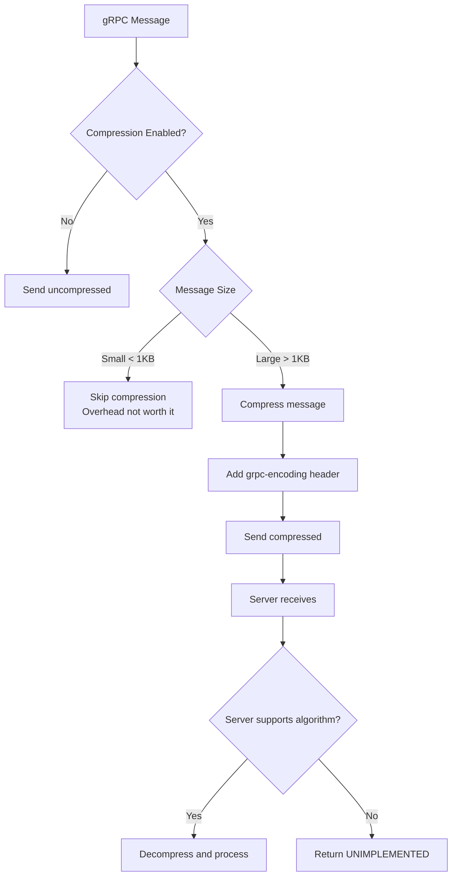
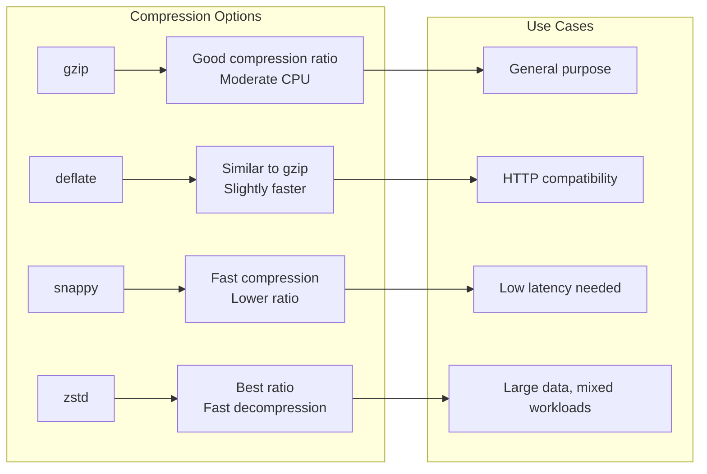

# How to Handle Compression in gRPC

Author: [nawazdhandala](https://www.github.com/nawazdhandala)

Tags: gRPC, Compression, Performance, Gzip, Go, Python, Bandwidth, Optimization

Description: A practical guide to implementing and optimizing compression in gRPC services, covering gzip and other algorithms, per-call compression, and performance considerations.

---

> Compression in gRPC can significantly reduce bandwidth usage and improve performance for large messages. However, improper configuration can lead to increased latency or CPU overhead. This guide covers how to implement compression effectively for both clients and servers.

Understanding when and how to use compression helps you optimize the trade-off between bandwidth savings and CPU usage.

---

## Understanding gRPC Compression



---

## Enabling Compression

### Go Server with Compression

```go
package main

import (
    "log"
    "net"

    "google.golang.org/grpc"
    "google.golang.org/grpc/encoding/gzip"
    pb "myservice/proto"
)

func main() {
    // Create listener
    listener, err := net.Listen("tcp", ":50051")
    if err != nil {
        log.Fatalf("Failed to listen: %v", err)
    }

    // Create server with compression options
    server := grpc.NewServer(
        // Register compressors (gzip is registered by default)
        // Custom compressors can be added here

        // Set default compression for all responses
        grpc.RPCCompressor(grpc.NewGZIPCompressor()),
        grpc.RPCDecompressor(grpc.NewGZIPDecompressor()),
    )

    pb.RegisterMyServiceServer(server, &myServiceServer{})

    log.Println("Server starting on :50051")
    if err := server.Serve(listener); err != nil {
        log.Fatalf("Failed to serve: %v", err)
    }
}

type myServiceServer struct {
    pb.UnimplementedMyServiceServer
}

// GetLargeData returns large data with compression
func (s *myServiceServer) GetLargeData(ctx context.Context, req *pb.DataRequest) (*pb.DataResponse, error) {
    // Generate large response
    data := make([]byte, 1024*1024) // 1MB
    for i := range data {
        data[i] = byte(i % 256)
    }

    return &pb.DataResponse{
        Data: data,
    }, nil
}
```

### Go Client with Compression

```go
package main

import (
    "context"
    "log"

    "google.golang.org/grpc"
    "google.golang.org/grpc/encoding/gzip"
    pb "myservice/proto"
)

func main() {
    // Connect with default compression enabled
    conn, err := grpc.Dial(
        "localhost:50051",
        grpc.WithInsecure(),
        // Enable gzip compression for all calls by default
        grpc.WithDefaultCallOptions(
            grpc.UseCompressor(gzip.Name),
        ),
    )
    if err != nil {
        log.Fatalf("Failed to connect: %v", err)
    }
    defer conn.Close()

    client := pb.NewMyServiceClient(conn)

    // This call will use gzip compression
    resp, err := client.GetLargeData(context.Background(), &pb.DataRequest{
        Query: "test",
    })
    if err != nil {
        log.Fatalf("Request failed: %v", err)
    }

    log.Printf("Received %d bytes", len(resp.Data))
}

// MakeCallWithCompression shows per-call compression control
func MakeCallWithCompression(client pb.MyServiceClient, req *pb.DataRequest) (*pb.DataResponse, error) {
    // Enable compression for this specific call
    return client.GetLargeData(
        context.Background(),
        req,
        grpc.UseCompressor(gzip.Name),
    )
}

// MakeCallWithoutCompression disables compression for small requests
func MakeCallWithoutCompression(client pb.MyServiceClient, req *pb.DataRequest) (*pb.DataResponse, error) {
    // Disable compression for this call
    return client.GetLargeData(
        context.Background(),
        req,
        grpc.UseCompressor("identity"), // No compression
    )
}
```

### Python Server with Compression

```python
import grpc
from concurrent import futures

class MyServiceServicer(service_pb2_grpc.MyServiceServicer):

    def GetLargeData(self, request, context):
        """Return large data - compression handled by gRPC."""
        # Generate large response
        data = bytes(range(256)) * 4096  # ~1MB of data

        return service_pb2.DataResponse(data=data)

    def GetLargeDataWithCompression(self, request, context):
        """Explicitly set compression for response."""
        # Set compression algorithm for this response
        context.set_compression(grpc.Compression.Gzip)

        data = bytes(range(256)) * 4096
        return service_pb2.DataResponse(data=data)

    def GetSmallData(self, request, context):
        """Disable compression for small responses."""
        # Explicitly disable compression for small data
        context.set_compression(grpc.Compression.NoCompression)

        return service_pb2.DataResponse(data=b"small response")


def serve():
    # Create server with compression options
    server = grpc.server(
        futures.ThreadPoolExecutor(max_workers=10),
        # Enable compression support
        compression=grpc.Compression.Gzip,
        options=[
            # Set compression level (optional)
            ('grpc.default_compression_level', grpc.Compression.Gzip.value),
        ]
    )

    service_pb2_grpc.add_MyServiceServicer_to_server(
        MyServiceServicer(), server
    )

    server.add_insecure_port('[::]:50051')
    server.start()
    server.wait_for_termination()


if __name__ == '__main__':
    serve()
```

### Python Client with Compression

```python
import grpc

def create_compressed_channel(target: str) -> grpc.Channel:
    """Create channel with compression enabled."""
    return grpc.insecure_channel(
        target,
        options=[
            # Enable gzip compression by default
            ('grpc.default_compression_algorithm', grpc.Compression.Gzip.value),
            # Set compression level (1-9, higher = better compression)
            ('grpc.default_compression_level', 6),
        ],
        compression=grpc.Compression.Gzip
    )


def make_compressed_call(stub, request):
    """Make a call with compression."""
    return stub.GetLargeData(
        request,
        compression=grpc.Compression.Gzip
    )


def make_uncompressed_call(stub, request):
    """Make a call without compression."""
    return stub.GetSmallData(
        request,
        compression=grpc.Compression.NoCompression
    )


class SmartCompressionClient:
    """Client that automatically decides when to compress."""

    def __init__(self, stub, compression_threshold: int = 1024):
        self.stub = stub
        self.threshold = compression_threshold

    def send_data(self, data: bytes) -> 'Response':
        """Send data with automatic compression decision."""
        request = service_pb2.SendDataRequest(data=data)

        # Use compression for large messages
        if len(data) >= self.threshold:
            return self.stub.SendData(
                request,
                compression=grpc.Compression.Gzip
            )
        else:
            return self.stub.SendData(
                request,
                compression=grpc.Compression.NoCompression
            )
```

---

## Compression Algorithms



### Implementing Custom Compressor

```go
package main

import (
    "bytes"
    "io"
    "sync"

    "github.com/klauspost/compress/zstd"
    "google.golang.org/grpc/encoding"
)

// ZstdCompressor implements gRPC compression using zstd
type ZstdCompressor struct {
    encoderPool sync.Pool
    decoderPool sync.Pool
}

const zstdName = "zstd"

func init() {
    // Register zstd compressor
    encoding.RegisterCompressor(&ZstdCompressor{})
}

func (c *ZstdCompressor) Name() string {
    return zstdName
}

func (c *ZstdCompressor) Compress(w io.Writer) (io.WriteCloser, error) {
    // Get encoder from pool or create new one
    encoder := c.encoderPool.Get()
    if encoder == nil {
        var err error
        encoder, err = zstd.NewWriter(w,
            zstd.WithEncoderLevel(zstd.SpeedDefault),
        )
        if err != nil {
            return nil, err
        }
    }

    enc := encoder.(*zstd.Encoder)
    enc.Reset(w)

    return &zstdWriteCloser{
        encoder: enc,
        pool:    &c.encoderPool,
    }, nil
}

func (c *ZstdCompressor) Decompress(r io.Reader) (io.Reader, error) {
    // Get decoder from pool or create new one
    decoder := c.decoderPool.Get()
    if decoder == nil {
        var err error
        decoder, err = zstd.NewReader(r)
        if err != nil {
            return nil, err
        }
    }

    dec := decoder.(*zstd.Decoder)
    if err := dec.Reset(r); err != nil {
        return nil, err
    }

    return &zstdReadCloser{
        decoder: dec,
        pool:    &c.decoderPool,
    }, nil
}

type zstdWriteCloser struct {
    encoder *zstd.Encoder
    pool    *sync.Pool
}

func (w *zstdWriteCloser) Write(p []byte) (int, error) {
    return w.encoder.Write(p)
}

func (w *zstdWriteCloser) Close() error {
    err := w.encoder.Close()
    w.pool.Put(w.encoder)
    return err
}

type zstdReadCloser struct {
    decoder *zstd.Decoder
    pool    *sync.Pool
}

func (r *zstdReadCloser) Read(p []byte) (int, error) {
    return r.decoder.Read(p)
}

// Usage
func UseZstdCompression() {
    conn, _ := grpc.Dial(
        "localhost:50051",
        grpc.WithDefaultCallOptions(
            grpc.UseCompressor(zstdName),
        ),
    )
    // Use connection
}
```

---

## Performance Considerations

### When to Use Compression

```go
package main

import (
    "context"

    "google.golang.org/grpc"
    "google.golang.org/grpc/encoding/gzip"
)

// CompressionDecider helps decide when to compress
type CompressionDecider struct {
    // Minimum message size to compress (bytes)
    MinSize int

    // Maximum CPU threshold (percentage) to enable compression
    MaxCPU float64

    // Known compressible content types
    CompressibleTypes map[string]bool
}

// NewCompressionDecider creates a decider with sensible defaults
func NewCompressionDecider() *CompressionDecider {
    return &CompressionDecider{
        MinSize: 1024, // 1KB minimum
        MaxCPU:  80.0, // Don't compress if CPU > 80%
        CompressibleTypes: map[string]bool{
            "text":      true,
            "json":      true,
            "xml":       true,
            "protobuf":  true, // Already efficient but can benefit
            "binary":    false, // Often already compressed
            "image":     false, // Already compressed
            "encrypted": false, // Won't compress well
        },
    }
}

// ShouldCompress determines if compression should be used
func (d *CompressionDecider) ShouldCompress(size int, contentType string, cpuUsage float64) bool {
    // Don't compress small messages
    if size < d.MinSize {
        return false
    }

    // Don't compress if CPU is high
    if cpuUsage > d.MaxCPU {
        return false
    }

    // Check content type
    if compressible, ok := d.CompressibleTypes[contentType]; ok {
        return compressible
    }

    // Default to compressing large messages
    return size > d.MinSize*10
}

// SmartClient uses adaptive compression
type SmartClient struct {
    client  pb.MyServiceClient
    decider *CompressionDecider
}

func (c *SmartClient) SendData(ctx context.Context, data []byte, contentType string) (*pb.Response, error) {
    // Get current CPU usage (simplified)
    cpuUsage := getCurrentCPUUsage()

    req := &pb.DataRequest{
        Data:        data,
        ContentType: contentType,
    }

    var opts []grpc.CallOption
    if c.decider.ShouldCompress(len(data), contentType, cpuUsage) {
        opts = append(opts, grpc.UseCompressor(gzip.Name))
    }

    return c.client.SendData(ctx, req, opts...)
}
```

### Benchmarking Compression

```python
import grpc
import time
import statistics

class CompressionBenchmark:
    """Benchmark compression performance."""

    def __init__(self, stub):
        self.stub = stub

    def benchmark(self, data: bytes, iterations: int = 100):
        """Benchmark with and without compression."""

        results = {
            'no_compression': [],
            'gzip': [],
        }

        request = service_pb2.DataRequest(data=data)

        # Benchmark without compression
        for _ in range(iterations):
            start = time.perf_counter()
            self.stub.SendData(
                request,
                compression=grpc.Compression.NoCompression
            )
            elapsed = time.perf_counter() - start
            results['no_compression'].append(elapsed)

        # Benchmark with gzip
        for _ in range(iterations):
            start = time.perf_counter()
            self.stub.SendData(
                request,
                compression=grpc.Compression.Gzip
            )
            elapsed = time.perf_counter() - start
            results['gzip'].append(elapsed)

        return self._analyze_results(results, len(data))

    def _analyze_results(self, results: dict, data_size: int) -> dict:
        """Analyze benchmark results."""
        analysis = {
            'data_size_bytes': data_size,
        }

        for method, times in results.items():
            analysis[method] = {
                'mean_ms': statistics.mean(times) * 1000,
                'median_ms': statistics.median(times) * 1000,
                'std_dev_ms': statistics.stdev(times) * 1000 if len(times) > 1 else 0,
                'p95_ms': sorted(times)[int(len(times) * 0.95)] * 1000,
                'p99_ms': sorted(times)[int(len(times) * 0.99)] * 1000,
            }

        # Calculate overhead
        no_comp_mean = analysis['no_compression']['mean_ms']
        gzip_mean = analysis['gzip']['mean_ms']
        analysis['compression_overhead_ms'] = gzip_mean - no_comp_mean
        analysis['compression_overhead_percent'] = (
            (gzip_mean - no_comp_mean) / no_comp_mean * 100
            if no_comp_mean > 0 else 0
        )

        return analysis


def run_compression_benchmark():
    """Run benchmarks for various data sizes."""
    channel = grpc.insecure_channel('localhost:50051')
    stub = service_pb2_grpc.MyServiceStub(channel)
    benchmark = CompressionBenchmark(stub)

    # Test various data sizes
    sizes = [100, 1024, 10*1024, 100*1024, 1024*1024]

    for size in sizes:
        # Generate test data (repetitive for good compression)
        data = bytes([i % 256 for i in range(size)])

        results = benchmark.benchmark(data, iterations=50)

        print(f"\nData size: {size} bytes")
        print(f"No compression: {results['no_compression']['mean_ms']:.2f}ms")
        print(f"Gzip: {results['gzip']['mean_ms']:.2f}ms")
        print(f"Overhead: {results['compression_overhead_percent']:.1f}%")
```

---

## Streaming Compression

### Go Server with Streaming Compression

```go
package main

import (
    "io"

    "google.golang.org/grpc"
    "google.golang.org/grpc/encoding/gzip"
    pb "myservice/proto"
)

// StreamLargeData streams compressed data
func (s *myServiceServer) StreamLargeData(req *pb.StreamRequest, stream pb.MyService_StreamLargeDataServer) error {
    // Each message in the stream is compressed individually
    // gRPC handles this automatically when compression is enabled

    chunkSize := 64 * 1024 // 64KB chunks
    totalSize := req.GetSize()

    for offset := int64(0); offset < totalSize; offset += int64(chunkSize) {
        // Generate chunk data
        size := chunkSize
        if offset+int64(chunkSize) > totalSize {
            size = int(totalSize - offset)
        }

        chunk := make([]byte, size)
        for i := range chunk {
            chunk[i] = byte((offset + int64(i)) % 256)
        }

        // Send compressed chunk
        if err := stream.Send(&pb.DataChunk{
            Data:   chunk,
            Offset: offset,
        }); err != nil {
            return err
        }
    }

    return nil
}

// Client consuming compressed stream
func ConsumeCompressedStream(client pb.MyServiceClient) error {
    // Request stream with compression
    stream, err := client.StreamLargeData(
        context.Background(),
        &pb.StreamRequest{Size: 10 * 1024 * 1024}, // 10MB
        grpc.UseCompressor(gzip.Name),
    )
    if err != nil {
        return err
    }

    totalReceived := 0
    for {
        chunk, err := stream.Recv()
        if err == io.EOF {
            break
        }
        if err != nil {
            return err
        }

        totalReceived += len(chunk.Data)
        // Process chunk
    }

    log.Printf("Received %d bytes total", totalReceived)
    return nil
}
```

### Python Streaming with Compression

```python
import grpc
from typing import Iterator

class StreamingService(service_pb2_grpc.MyServiceServicer):

    def StreamLargeData(self, request, context):
        """Stream data with compression."""
        # Set compression for the stream
        context.set_compression(grpc.Compression.Gzip)

        total_size = request.size
        chunk_size = 64 * 1024  # 64KB

        for offset in range(0, total_size, chunk_size):
            size = min(chunk_size, total_size - offset)
            data = bytes([i % 256 for i in range(size)])

            yield service_pb2.DataChunk(
                data=data,
                offset=offset
            )

    def UploadLargeData(self, request_iterator, context):
        """Receive compressed stream upload."""
        total_size = 0

        for chunk in request_iterator:
            total_size += len(chunk.data)
            # Process chunk

        return service_pb2.UploadResponse(
            total_bytes=total_size
        )


def upload_with_compression(stub, data_generator: Iterator[bytes]):
    """Upload data with compression."""

    def request_generator():
        for data in data_generator:
            yield service_pb2.DataChunk(data=data)

    return stub.UploadLargeData(
        request_generator(),
        compression=grpc.Compression.Gzip
    )
```

---

## Monitoring Compression

```python
import grpc
from prometheus_client import Counter, Histogram, Gauge

# Compression metrics
compressed_bytes_sent = Counter(
    'grpc_compressed_bytes_sent_total',
    'Total compressed bytes sent',
    ['method', 'algorithm']
)

uncompressed_bytes_sent = Counter(
    'grpc_uncompressed_bytes_sent_total',
    'Total uncompressed bytes sent',
    ['method']
)

compression_ratio = Histogram(
    'grpc_compression_ratio',
    'Compression ratio (uncompressed/compressed)',
    ['method', 'algorithm'],
    buckets=[1.0, 1.5, 2.0, 3.0, 5.0, 10.0, 20.0]
)

compression_time = Histogram(
    'grpc_compression_duration_seconds',
    'Time spent compressing',
    ['method', 'algorithm'],
    buckets=[.001, .005, .01, .025, .05, .1, .25]
)


class CompressionMonitoringInterceptor(grpc.ServerInterceptor):
    """Interceptor to monitor compression metrics."""

    def intercept_service(self, continuation, handler_call_details):
        method = handler_call_details.method

        def wrapper(request_or_iterator, context):
            # Get compression info from metadata
            metadata = dict(context.invocation_metadata() or [])
            encoding = metadata.get('grpc-encoding', 'identity')

            response = continuation(handler_call_details).unary_unary(
                request_or_iterator, context
            )

            # Record metrics
            if hasattr(response, 'ByteSize'):
                size = response.ByteSize()
                if encoding != 'identity':
                    compressed_bytes_sent.labels(
                        method=method,
                        algorithm=encoding
                    ).inc(size)
                else:
                    uncompressed_bytes_sent.labels(method=method).inc(size)

            return response

        return grpc.unary_unary_rpc_method_handler(wrapper)
```

---

## Best Practices Summary

1. **Set minimum size threshold** - Don't compress messages smaller than 1KB
2. **Consider content type** - Already compressed data won't benefit
3. **Monitor CPU usage** - Disable compression under high CPU load
4. **Use appropriate algorithm** - gzip for general use, zstd for best ratio
5. **Enable per-call control** - Allow overriding default compression
6. **Test compression ratios** - Benchmark with real data patterns
7. **Monitor metrics** - Track compression overhead and bandwidth savings

---

## Conclusion

Compression in gRPC can significantly reduce bandwidth usage, especially for large or repetitive data. The key is to use it selectively based on message size, content type, and system load. By implementing adaptive compression and monitoring its impact, you can optimize the trade-off between bandwidth savings and CPU overhead.

Remember that Protocol Buffers already provide efficient binary serialization, so compression benefits are most significant for large messages with repetitive content.

---

*Need to monitor bandwidth and compression efficiency in your gRPC services? [OneUptime](https://oneuptime.com) provides metrics and alerting to help you optimize your service communication.*

**Related Reading:**
- [gRPC Performance Optimization](https://oneuptime.com/blog)
- [Protocol Buffers Best Practices](https://oneuptime.com/blog)
