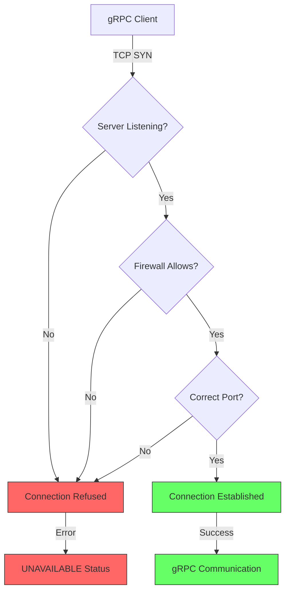
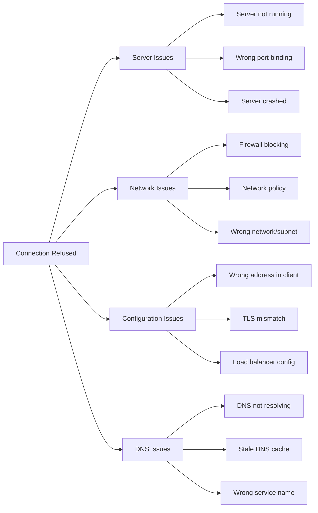
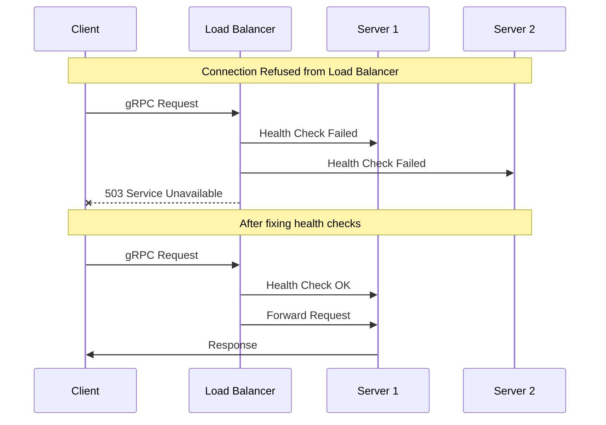

# How to Fix "Connection Refused" Errors in gRPC

Author: [nawazdhandala](https://www.github.com/nawazdhandala)

Tags: gRPC, Connection Refused, Networking, Debugging, Kubernetes, Load Balancing, Troubleshooting

Description: A practical guide to diagnosing and fixing "Connection Refused" errors in gRPC services, covering network configuration, DNS resolution, firewall rules, and common deployment issues.

---

> "Connection Refused" errors in gRPC indicate that the client cannot establish a TCP connection to the server. This guide covers systematic debugging approaches and common fixes for these frustrating connectivity issues.

Connection refused errors are among the most common issues when deploying gRPC services. They can stem from misconfigured ports, DNS resolution failures, firewall rules, or service deployment problems.

---

## Understanding Connection Refused



---

## Common Causes



---

## Step 1: Verify Server is Running

```bash
# Check if process is running
ps aux | grep grpc-server

# Check if port is being listened on
# Linux
ss -tlnp | grep 50051
netstat -tlnp | grep 50051

# macOS
lsof -i :50051

# Expected output:
# tcp    LISTEN  0  128  *:50051  *:*  users:(("grpc-server",pid=1234,fd=3))
```

### Server Binding Issues

```python
import grpc
from concurrent import futures

def serve():
    server = grpc.server(futures.ThreadPoolExecutor(max_workers=10))
    my_service_pb2_grpc.add_MyServiceServicer_to_server(
        MyServiceServicer(), server
    )

    # BAD: Binding to localhost only
    # Only accessible from the same machine
    server.add_insecure_port('localhost:50051')

    # BAD: Binding to specific IP that may change
    server.add_insecure_port('192.168.1.100:50051')

    # GOOD: Binding to all interfaces
    # Accessible from any network interface
    server.add_insecure_port('[::]:50051')  # IPv4 and IPv6
    # Or for IPv4 only:
    server.add_insecure_port('0.0.0.0:50051')

    server.start()
    print("Server started on port 50051")
    server.wait_for_termination()
```

### Go Server Binding

```go
package main

import (
    "log"
    "net"

    "google.golang.org/grpc"
)

func main() {
    // BAD: Listening on localhost only
    // lis, err := net.Listen("tcp", "localhost:50051")

    // BAD: Listening on specific IP
    // lis, err := net.Listen("tcp", "192.168.1.100:50051")

    // GOOD: Listen on all interfaces
    lis, err := net.Listen("tcp", ":50051")
    if err != nil {
        log.Fatalf("failed to listen: %v", err)
    }

    s := grpc.NewServer()
    // Register services...

    log.Printf("Server listening on %v", lis.Addr())
    if err := s.Serve(lis); err != nil {
        log.Fatalf("failed to serve: %v", err)
    }
}
```

---

## Step 2: Test Network Connectivity

```bash
# Test basic TCP connectivity
nc -zv server-hostname 50051

# Expected success:
# Connection to server-hostname 50051 port [tcp/*] succeeded!

# If it fails:
# nc: connect to server-hostname port 50051 (tcp) failed: Connection refused

# Test with timeout
nc -zv -w 5 server-hostname 50051

# Use telnet as alternative
telnet server-hostname 50051

# Test from within the same network/container
kubectl exec -it debug-pod -- nc -zv grpc-service 50051
```

### Using grpcurl to Test

```bash
# Test with grpcurl (if reflection is enabled)
grpcurl -plaintext server-hostname:50051 list

# Test with specific proto file (if reflection disabled)
grpcurl -plaintext -import-path ./proto -proto service.proto \
    server-hostname:50051 list
```

---

## Step 3: Check DNS Resolution

```bash
# Verify DNS resolution
nslookup grpc-service.default.svc.cluster.local

# Or using dig
dig grpc-service.default.svc.cluster.local

# Check /etc/hosts for local overrides
cat /etc/hosts

# Test DNS from within Kubernetes pod
kubectl exec -it debug-pod -- nslookup grpc-service
```

### DNS Issues in Code

```python
import grpc
import socket

def diagnose_connection(address):
    """Diagnose connection issues to a gRPC server"""

    # Parse address
    if ':' in address:
        host, port = address.rsplit(':', 1)
        port = int(port)
    else:
        host = address
        port = 50051

    print(f"Diagnosing connection to {host}:{port}")

    # Step 1: DNS Resolution
    print("\n1. DNS Resolution:")
    try:
        ip_addresses = socket.getaddrinfo(host, port, socket.AF_UNSPEC, socket.SOCK_STREAM)
        for family, socktype, proto, canonname, sockaddr in ip_addresses:
            print(f"   Resolved: {sockaddr[0]}:{sockaddr[1]}")
    except socket.gaierror as e:
        print(f"   DNS resolution failed: {e}")
        return False

    # Step 2: TCP Connection
    print("\n2. TCP Connection:")
    try:
        sock = socket.create_connection((host, port), timeout=5)
        print(f"   TCP connection successful")
        sock.close()
    except socket.error as e:
        print(f"   TCP connection failed: {e}")
        return False

    # Step 3: gRPC Connection
    print("\n3. gRPC Connection:")
    try:
        channel = grpc.insecure_channel(f'{host}:{port}')
        # Try to get channel state
        state = channel.check_connectivity_state(True)
        print(f"   Channel state: {state}")

        # Wait for connection
        channel_ready = grpc.channel_ready_future(channel)
        channel_ready.result(timeout=5)
        print("   gRPC channel ready")
        channel.close()
        return True
    except grpc.FutureTimeoutError:
        print("   gRPC channel connection timeout")
        return False
    except Exception as e:
        print(f"   gRPC connection failed: {e}")
        return False

# Usage
diagnose_connection('grpc-service:50051')
```

---

## Step 4: Check Firewall and Network Policies

### Linux Firewall (iptables/firewalld)

```bash
# Check iptables rules
sudo iptables -L -n | grep 50051

# Allow gRPC port
sudo iptables -A INPUT -p tcp --dport 50051 -j ACCEPT

# For firewalld
sudo firewall-cmd --list-ports
sudo firewall-cmd --add-port=50051/tcp --permanent
sudo firewall-cmd --reload

# Check if port is blocked
sudo tcpdump -i any port 50051
```

### Kubernetes Network Policies

```yaml
# Check if network policy is blocking traffic
# kubectl get networkpolicy -A

# Allow ingress to gRPC service
apiVersion: networking.k8s.io/v1
kind: NetworkPolicy
metadata:
  name: allow-grpc-ingress
  namespace: default
spec:
  podSelector:
    matchLabels:
      app: grpc-service
  policyTypes:
    - Ingress
  ingress:
    - from:
        # Allow from all pods in the namespace
        - podSelector: {}
        # Or allow from specific namespace
        - namespaceSelector:
            matchLabels:
              name: client-namespace
      ports:
        - protocol: TCP
          port: 50051
---
# Allow egress from client to gRPC service
apiVersion: networking.k8s.io/v1
kind: NetworkPolicy
metadata:
  name: allow-grpc-egress
  namespace: client-namespace
spec:
  podSelector:
    matchLabels:
      app: grpc-client
  policyTypes:
    - Egress
  egress:
    - to:
        - namespaceSelector:
            matchLabels:
              name: default
          podSelector:
            matchLabels:
              app: grpc-service
      ports:
        - protocol: TCP
          port: 50051
```

---

## Step 5: Kubernetes Service Configuration

```yaml
# Check service configuration
# kubectl describe service grpc-service

apiVersion: v1
kind: Service
metadata:
  name: grpc-service
  namespace: default
spec:
  selector:
    # Make sure this matches your pod labels
    app: grpc-server
  ports:
    - name: grpc
      port: 50051
      targetPort: 50051
      protocol: TCP
  type: ClusterIP
---
# Verify pods are running and match selector
# kubectl get pods -l app=grpc-server
# kubectl get endpoints grpc-service

apiVersion: apps/v1
kind: Deployment
metadata:
  name: grpc-server
spec:
  replicas: 3
  selector:
    matchLabels:
      app: grpc-server
  template:
    metadata:
      labels:
        # This must match the service selector
        app: grpc-server
    spec:
      containers:
        - name: grpc-server
          image: my-grpc-server:latest
          ports:
            - containerPort: 50051
              name: grpc
          # Add readiness probe to ensure service only routes to healthy pods
          readinessProbe:
            exec:
              command: ["/bin/grpc_health_probe", "-addr=:50051"]
            initialDelaySeconds: 5
            periodSeconds: 10
          livenessProbe:
            exec:
              command: ["/bin/grpc_health_probe", "-addr=:50051"]
            initialDelaySeconds: 10
            periodSeconds: 20
```

### Debugging Kubernetes Services

```bash
# Check if service has endpoints
kubectl get endpoints grpc-service

# If no endpoints, check pod labels
kubectl get pods --show-labels | grep grpc

# Check service selector
kubectl describe service grpc-service

# Test connection from within cluster
kubectl run debug --rm -it --image=nicolaka/netshoot -- /bin/bash
# Inside the pod:
nc -zv grpc-service 50051
curl -v telnet://grpc-service:50051
```

---

## Step 6: Handle Connection Errors in Client Code

```python
import grpc
import time
from grpc import StatusCode

def create_resilient_channel(address, max_retries=3):
    """Create a channel with connection retry logic"""

    channel_options = [
        # Enable connection backoff
        ('grpc.initial_reconnect_backoff_ms', 1000),
        ('grpc.max_reconnect_backoff_ms', 30000),
        # Enable keepalive to detect dead connections
        ('grpc.keepalive_time_ms', 30000),
        ('grpc.keepalive_timeout_ms', 10000),
        ('grpc.keepalive_permit_without_calls', True),
        # Wait for connection before failing
        ('grpc.enable_retries', True),
    ]

    channel = grpc.insecure_channel(address, options=channel_options)

    # Wait for channel to be ready with retry
    for attempt in range(max_retries):
        try:
            grpc.channel_ready_future(channel).result(timeout=10)
            print(f"Connected to {address}")
            return channel
        except grpc.FutureTimeoutError:
            print(f"Connection attempt {attempt + 1} failed, retrying...")
            time.sleep(2 ** attempt)  # Exponential backoff

    raise ConnectionError(f"Failed to connect to {address} after {max_retries} attempts")

def make_request_with_retry(stub, request, max_retries=3):
    """Make a gRPC request with automatic retry on connection errors"""

    last_error = None
    for attempt in range(max_retries):
        try:
            response = stub.GetData(request, timeout=30)
            return response
        except grpc.RpcError as e:
            last_error = e
            if e.code() == StatusCode.UNAVAILABLE:
                print(f"Connection unavailable, attempt {attempt + 1}/{max_retries}")
                time.sleep(2 ** attempt)
                continue
            else:
                # Non-retriable error
                raise

    raise last_error
```

### Go Client with Connection Handling

```go
package main

import (
    "context"
    "log"
    "time"

    "google.golang.org/grpc"
    "google.golang.org/grpc/codes"
    "google.golang.org/grpc/connectivity"
    "google.golang.org/grpc/status"
)

func createResilientConnection(address string) (*grpc.ClientConn, error) {
    // Connection options
    opts := []grpc.DialOption{
        grpc.WithInsecure(),
        // Wait for connection to be established
        grpc.WithBlock(),
        // Set connection timeout
        grpc.WithTimeout(10 * time.Second),
        // Enable automatic retry
        grpc.WithDefaultServiceConfig(`{
            "methodConfig": [{
                "name": [{"service": ""}],
                "waitForReady": true,
                "retryPolicy": {
                    "maxAttempts": 3,
                    "initialBackoff": "1s",
                    "maxBackoff": "10s",
                    "backoffMultiplier": 2,
                    "retryableStatusCodes": ["UNAVAILABLE"]
                }
            }]
        }`),
    }

    // Try to connect with retry
    var conn *grpc.ClientConn
    var err error

    for attempt := 0; attempt < 3; attempt++ {
        ctx, cancel := context.WithTimeout(context.Background(), 10*time.Second)
        conn, err = grpc.DialContext(ctx, address, opts...)
        cancel()

        if err == nil {
            log.Printf("Connected to %s", address)
            return conn, nil
        }

        log.Printf("Connection attempt %d failed: %v", attempt+1, err)
        time.Sleep(time.Duration(1<<attempt) * time.Second)
    }

    return nil, err
}

func monitorConnection(conn *grpc.ClientConn) {
    // Monitor connection state
    go func() {
        for {
            state := conn.GetState()
            log.Printf("Connection state: %v", state)

            if state == connectivity.TransientFailure {
                log.Println("Connection in transient failure, attempting reconnect")
                conn.ResetConnectBackoff()
            }

            // Wait for state change
            conn.WaitForStateChange(context.Background(), state)
        }
    }()
}
```

---

## Docker and Container Issues

```yaml
# docker-compose.yml
version: '3.8'
services:
  grpc-server:
    image: my-grpc-server:latest
    ports:
      # Make sure to expose the port correctly
      - "50051:50051"
    networks:
      - grpc-network
    # Add health check
    healthcheck:
      test: ["/bin/grpc_health_probe", "-addr=:50051"]
      interval: 10s
      timeout: 5s
      retries: 3

  grpc-client:
    image: my-grpc-client:latest
    environment:
      # Use service name as hostname within Docker network
      - GRPC_SERVER_ADDRESS=grpc-server:50051
    networks:
      - grpc-network
    depends_on:
      grpc-server:
        condition: service_healthy

networks:
  grpc-network:
    driver: bridge
```

### Debug Container Connectivity

```bash
# Check container is running
docker ps | grep grpc-server

# Check container logs
docker logs grpc-server

# Check port mapping
docker port grpc-server

# Test from host to container
nc -zv localhost 50051

# Test between containers
docker exec grpc-client nc -zv grpc-server 50051

# Check Docker network
docker network inspect grpc-network
```

---

## Load Balancer Configuration



### AWS ALB/NLB Configuration

```yaml
# Kubernetes ingress for gRPC with AWS ALB
apiVersion: networking.k8s.io/v1
kind: Ingress
metadata:
  name: grpc-ingress
  annotations:
    # Use ALB ingress controller
    kubernetes.io/ingress.class: alb
    # Enable HTTP/2 for gRPC
    alb.ingress.kubernetes.io/backend-protocol-version: GRPC
    # Health check configuration
    alb.ingress.kubernetes.io/healthcheck-protocol: HTTP
    alb.ingress.kubernetes.io/healthcheck-port: "50051"
    alb.ingress.kubernetes.io/healthcheck-path: /grpc.health.v1.Health/Check
spec:
  rules:
    - host: grpc.example.com
      http:
        paths:
          - path: /
            pathType: Prefix
            backend:
              service:
                name: grpc-service
                port:
                  number: 50051
```

---

## Diagnostic Script

```bash
#!/bin/bash
# grpc_diagnose.sh - Diagnose gRPC connection issues

SERVER=${1:-"localhost:50051"}
HOST=$(echo $SERVER | cut -d: -f1)
PORT=$(echo $SERVER | cut -d: -f2)

echo "=== gRPC Connection Diagnostics ==="
echo "Target: $SERVER"
echo ""

echo "1. DNS Resolution:"
if nslookup $HOST > /dev/null 2>&1; then
    echo "   OK - $HOST resolves to:"
    nslookup $HOST | grep Address | tail -n +2
else
    echo "   FAILED - Cannot resolve $HOST"
fi
echo ""

echo "2. TCP Connectivity:"
if nc -zv -w 5 $HOST $PORT 2>&1 | grep -q succeeded; then
    echo "   OK - TCP connection successful"
else
    echo "   FAILED - Cannot connect to $HOST:$PORT"
fi
echo ""

echo "3. gRPC Reflection:"
if command -v grpcurl &> /dev/null; then
    if grpcurl -plaintext $SERVER list 2>&1 | grep -q "grpc.reflection"; then
        echo "   OK - gRPC reflection working"
    else
        echo "   FAILED or DISABLED - Reflection not available"
    fi
else
    echo "   SKIPPED - grpcurl not installed"
fi
echo ""

echo "4. Port Status on Server:"
if command -v ss &> /dev/null; then
    ss -tlnp | grep $PORT || echo "   Port $PORT not listening locally"
fi
```

---

## Best Practices Summary

1. **Bind to all interfaces** - Use `0.0.0.0` or `[::]` instead of `localhost`
2. **Check DNS resolution** - Verify hostnames resolve correctly
3. **Configure health checks** - Use gRPC health checking protocol
4. **Handle connection errors gracefully** - Implement retry logic with backoff
5. **Monitor connection state** - Track and alert on connection failures
6. **Test connectivity systematically** - Use nc, telnet, and grpcurl for debugging

---

## Conclusion

Connection refused errors in gRPC typically indicate network-level issues rather than application problems. By systematically checking server binding, DNS resolution, firewall rules, and service configuration, you can quickly identify and resolve connectivity issues.

The key is to test each layer of the network stack independently: DNS resolution, TCP connectivity, and finally gRPC communication.

---

*Need to monitor gRPC connectivity issues in production? [OneUptime](https://oneuptime.com) provides real-time alerting and distributed tracing to help you identify connection problems before they impact users.*

**Related Reading:**
- [How to Fix gRPC Performance Issues](https://oneuptime.com/blog)
- [How to Handle Retries and Timeouts in gRPC](https://oneuptime.com/blog)
