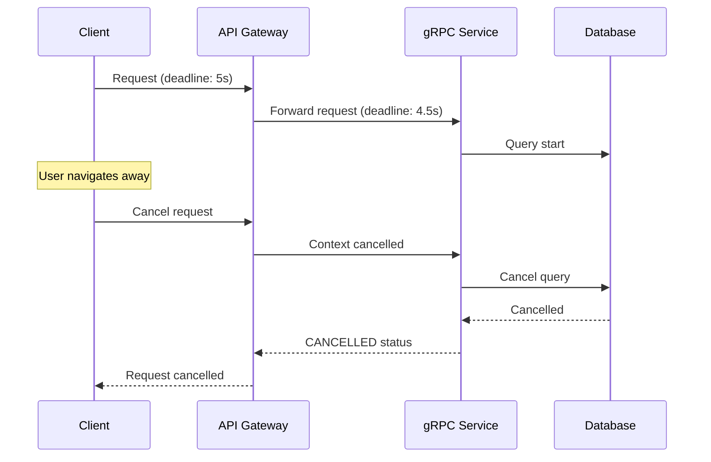
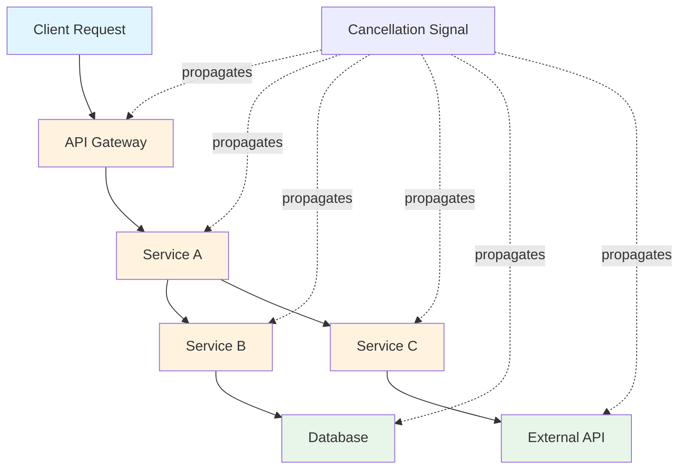
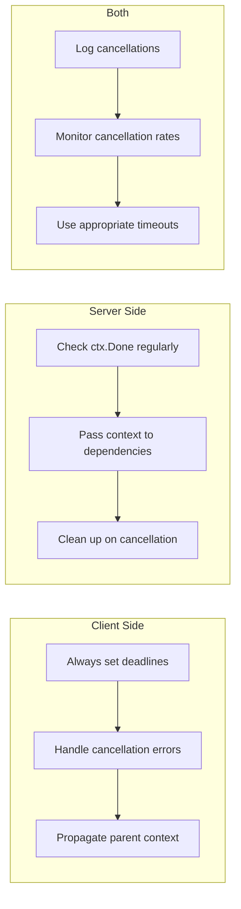

# How to Handle Context Cancellation in gRPC

Author: [nawazdhandala](https://www.github.com/nawazdhandala)

Tags: gRPC, Context, Cancellation, Go, Python, Timeouts, Deadlines, Microservices

Description: A practical guide to handling context cancellation in gRPC services, covering client-side deadlines, server-side cancellation propagation, and graceful cleanup patterns.

---

> Context cancellation is a critical mechanism in gRPC for managing request lifecycles, preventing resource leaks, and ensuring responsive services. When a client cancels a request or a deadline expires, proper handling prevents wasted computation and ensures resources are freed promptly.

Understanding how context cancellation flows through your gRPC services is essential for building robust, resource-efficient microservices.

---

## Understanding Context Cancellation Flow



---

## Setting Deadlines on Client Requests

### Go Client with Deadline

```go
package main

import (
    "context"
    "log"
    "time"

    "google.golang.org/grpc"
    "google.golang.org/grpc/codes"
    "google.golang.org/grpc/status"
    pb "myservice/proto"
)

// MakeRequestWithDeadline demonstrates proper deadline handling
func MakeRequestWithDeadline(client pb.MyServiceClient, req *pb.Request) (*pb.Response, error) {
    // Create context with deadline
    // Always set deadlines to prevent hanging requests
    ctx, cancel := context.WithTimeout(context.Background(), 5*time.Second)
    defer cancel() // Always call cancel to release resources

    // Make the RPC call
    resp, err := client.ProcessRequest(ctx, req)
    if err != nil {
        // Check for specific cancellation errors
        if status.Code(err) == codes.Canceled {
            log.Println("Request was cancelled by client")
            return nil, err
        }
        if status.Code(err) == codes.DeadlineExceeded {
            log.Println("Request deadline exceeded")
            return nil, err
        }
        return nil, err
    }

    return resp, nil
}

// MakeRequestWithParentContext propagates existing context
func MakeRequestWithParentContext(ctx context.Context, client pb.MyServiceClient, req *pb.Request) (*pb.Response, error) {
    // Derive from parent context to inherit cancellation
    // Add additional timeout if needed
    childCtx, cancel := context.WithTimeout(ctx, 3*time.Second)
    defer cancel()

    // Check if parent is already cancelled before making call
    if ctx.Err() != nil {
        return nil, ctx.Err()
    }

    return client.ProcessRequest(childCtx, req)
}
```

### Python Client with Deadline

```python
import grpc
import time

def make_request_with_deadline(stub, request):
    """Make a gRPC request with a deadline."""
    try:
        # Set deadline as timeout in seconds
        # This creates a context with the specified deadline
        response = stub.ProcessRequest(
            request,
            timeout=5.0  # 5 second deadline
        )
        return response
    except grpc.RpcError as e:
        if e.code() == grpc.StatusCode.CANCELLED:
            print("Request was cancelled")
        elif e.code() == grpc.StatusCode.DEADLINE_EXCEEDED:
            print("Request deadline exceeded")
        else:
            print(f"RPC failed: {e.code()}: {e.details()}")
        raise


def make_request_with_explicit_deadline(stub, request):
    """Set explicit deadline timestamp."""
    # Calculate absolute deadline
    deadline = time.time() + 5.0  # 5 seconds from now

    # Use deadline parameter for absolute time
    response = stub.ProcessRequest(
        request,
        deadline=deadline
    )
    return response
```

---

## Server-Side Cancellation Handling

### Go Server Implementation

```go
package main

import (
    "context"
    "database/sql"
    "log"
    "time"

    "google.golang.org/grpc/codes"
    "google.golang.org/grpc/status"
    pb "myservice/proto"
)

type server struct {
    pb.UnimplementedMyServiceServer
    db *sql.DB
}

// ProcessRequest handles requests with proper cancellation support
func (s *server) ProcessRequest(ctx context.Context, req *pb.Request) (*pb.Response, error) {
    // Check if context is already cancelled before starting work
    if ctx.Err() != nil {
        return nil, status.Error(codes.Canceled, "request already cancelled")
    }

    // Create a channel to receive results
    resultChan := make(chan *pb.Response, 1)
    errChan := make(chan error, 1)

    // Process in goroutine so we can handle cancellation
    go func() {
        result, err := s.doExpensiveWork(ctx, req)
        if err != nil {
            errChan <- err
            return
        }
        resultChan <- result
    }()

    // Wait for result or cancellation
    select {
    case <-ctx.Done():
        // Context cancelled or deadline exceeded
        // Log for debugging but return appropriate error
        log.Printf("Request cancelled: %v", ctx.Err())
        if ctx.Err() == context.DeadlineExceeded {
            return nil, status.Error(codes.DeadlineExceeded, "deadline exceeded")
        }
        return nil, status.Error(codes.Canceled, "request cancelled")
    case err := <-errChan:
        return nil, err
    case result := <-resultChan:
        return result, nil
    }
}

// doExpensiveWork performs work while checking for cancellation
func (s *server) doExpensiveWork(ctx context.Context, req *pb.Request) (*pb.Response, error) {
    // Example: Process items in batches with cancellation checks
    items := req.GetItems()
    results := make([]string, 0, len(items))

    for i, item := range items {
        // Check cancellation periodically during long operations
        if ctx.Err() != nil {
            return nil, ctx.Err()
        }

        // Process each item
        result, err := s.processItem(ctx, item)
        if err != nil {
            return nil, err
        }
        results = append(results, result)

        // Log progress for debugging
        if i%100 == 0 {
            log.Printf("Processed %d/%d items", i, len(items))
        }
    }

    return &pb.Response{Results: results}, nil
}

// processItem processes a single item with context awareness
func (s *server) processItem(ctx context.Context, item string) (string, error) {
    // Pass context to database operations
    // This allows query cancellation when context is cancelled
    row := s.db.QueryRowContext(ctx, "SELECT process($1)", item)

    var result string
    if err := row.Scan(&result); err != nil {
        if ctx.Err() != nil {
            return "", ctx.Err()
        }
        return "", err
    }

    return result, nil
}
```

### Python Server Implementation

```python
import grpc
from concurrent import futures
import threading

class MyServiceServicer(service_pb2_grpc.MyServiceServicer):

    def __init__(self, db_pool):
        self.db_pool = db_pool

    def ProcessRequest(self, request, context):
        """Handle request with cancellation support."""

        # Check if already cancelled before starting
        if context.is_active() is False:
            context.abort(grpc.StatusCode.CANCELLED, "Request cancelled")
            return service_pb2.Response()

        # Register cancellation callback for cleanup
        cleanup_event = threading.Event()

        def on_cancel():
            cleanup_event.set()
            # Perform any necessary cleanup
            print("Request cancelled, cleaning up resources")

        context.add_callback(on_cancel)

        try:
            # Process items with cancellation checks
            results = []
            for i, item in enumerate(request.items):
                # Check cancellation periodically
                if not context.is_active():
                    context.abort(grpc.StatusCode.CANCELLED, "Request cancelled during processing")
                    return service_pb2.Response()

                # Check remaining time
                remaining_time = context.time_remaining()
                if remaining_time is not None and remaining_time < 0.1:
                    # Less than 100ms remaining, abort gracefully
                    context.abort(
                        grpc.StatusCode.DEADLINE_EXCEEDED,
                        "Deadline exceeded during processing"
                    )
                    return service_pb2.Response()

                # Process item
                result = self._process_item(item, cleanup_event)
                if result is None:
                    # Processing was cancelled
                    break
                results.append(result)

            return service_pb2.Response(results=results)

        except Exception as e:
            if not context.is_active():
                # Swallow exceptions from cancelled requests
                return service_pb2.Response()
            raise

    def _process_item(self, item, cancel_event):
        """Process a single item with cancellation support."""
        # Check cancel event before expensive operation
        if cancel_event.is_set():
            return None

        # Perform database operation with timeout
        conn = self.db_pool.get_connection()
        try:
            # Most DB libraries support query cancellation
            cursor = conn.cursor()
            cursor.execute("SELECT process(%s)", (item,))
            result = cursor.fetchone()
            return result[0]
        finally:
            self.db_pool.return_connection(conn)
```

---

## Propagating Cancellation Across Services



### Go Service-to-Service Cancellation

```go
package main

import (
    "context"
    "log"

    "google.golang.org/grpc"
    "google.golang.org/grpc/metadata"
    pb "myservice/proto"
    downstream "downstream/proto"
)

type orchestratorServer struct {
    pb.UnimplementedOrchestratorServer
    serviceB downstream.ServiceBClient
    serviceC downstream.ServiceCClient
}

// ProcessOrchestrated handles requests that call multiple downstream services
func (s *orchestratorServer) ProcessOrchestrated(ctx context.Context, req *pb.Request) (*pb.Response, error) {
    // Extract any metadata from incoming context
    md, _ := metadata.FromIncomingContext(ctx)

    // Create outgoing context with same metadata
    // This preserves trace IDs and other context
    outCtx := metadata.NewOutgoingContext(ctx, md)

    // Call multiple services concurrently
    // Context cancellation will propagate to all
    type result struct {
        service string
        data    []byte
        err     error
    }

    results := make(chan result, 2)

    // Call Service B
    go func() {
        resp, err := s.serviceB.Process(outCtx, &downstream.Request{Data: req.Data})
        r := result{service: "B", err: err}
        if resp != nil {
            r.data = resp.Data
        }
        results <- r
    }()

    // Call Service C
    go func() {
        resp, err := s.serviceC.Process(outCtx, &downstream.Request{Data: req.Data})
        r := result{service: "C", err: err}
        if resp != nil {
            r.data = resp.Data
        }
        results <- r
    }()

    // Collect results with cancellation awareness
    var responses []*downstream.Response
    for i := 0; i < 2; i++ {
        select {
        case <-ctx.Done():
            // Parent context cancelled
            // Downstream calls will also be cancelled
            log.Printf("Orchestrator cancelled: %v", ctx.Err())
            return nil, ctx.Err()
        case r := <-results:
            if r.err != nil {
                log.Printf("Service %s failed: %v", r.service, r.err)
                // Decide whether to fail fast or continue
                // Here we fail fast
                return nil, r.err
            }
            responses = append(responses, &downstream.Response{Data: r.data})
        }
    }

    // Combine results
    return &pb.Response{
        DataB: responses[0].Data,
        DataC: responses[1].Data,
    }, nil
}
```

---

## Handling Streaming Cancellation

### Server Streaming with Cancellation

```go
package main

import (
    "context"

    "google.golang.org/grpc/codes"
    "google.golang.org/grpc/status"
    pb "myservice/proto"
)

// StreamData handles server streaming with proper cancellation
func (s *server) StreamData(req *pb.StreamRequest, stream pb.MyService_StreamDataServer) error {
    ctx := stream.Context()

    // Create data channel
    dataChan := make(chan *pb.DataItem, 100)
    errChan := make(chan error, 1)

    // Start data fetching in background
    go func() {
        defer close(dataChan)

        for i := 0; i < req.Count; i++ {
            // Check cancellation before fetching
            if ctx.Err() != nil {
                return
            }

            item, err := s.fetchItem(ctx, i)
            if err != nil {
                errChan <- err
                return
            }

            // Send to channel with cancellation check
            select {
            case <-ctx.Done():
                return
            case dataChan <- item:
            }
        }
    }()

    // Stream data to client
    for {
        select {
        case <-ctx.Done():
            // Client cancelled or disconnected
            return status.Error(codes.Canceled, "stream cancelled")
        case err := <-errChan:
            return err
        case item, ok := <-dataChan:
            if !ok {
                // Channel closed, all data sent
                return nil
            }
            if err := stream.Send(&pb.StreamResponse{Item: item}); err != nil {
                return err
            }
        }
    }
}
```

### Client Streaming with Cancellation

```python
import grpc
import threading

class StreamingClient:
    def __init__(self, stub):
        self.stub = stub
        self.cancel_event = threading.Event()

    def upload_data_with_cancellation(self, items):
        """Upload data with ability to cancel mid-stream."""

        def request_iterator():
            for item in items:
                # Check cancellation before yielding
                if self.cancel_event.is_set():
                    print("Upload cancelled by user")
                    return
                yield service_pb2.UploadRequest(data=item)

        try:
            # Create call object for cancellation
            call = self.stub.UploadData.future(request_iterator())

            # Wait for completion or cancellation
            response = call.result(timeout=30)
            return response

        except grpc.RpcError as e:
            if e.code() == grpc.StatusCode.CANCELLED:
                print("Upload was cancelled")
            raise

    def cancel_upload(self):
        """Cancel the ongoing upload."""
        self.cancel_event.set()


def cancel_streaming_call_example(stub, items):
    """Example of cancelling a streaming call."""

    # Create call object
    call = stub.UploadData.future(iter(items))

    # Set up timer to cancel after 5 seconds
    cancel_timer = threading.Timer(5.0, call.cancel)
    cancel_timer.start()

    try:
        response = call.result()
        cancel_timer.cancel()  # Cancel timer if completed
        return response
    except grpc.FutureCancelledError:
        print("Call was cancelled")
        return None
```

---

## Best Practices for Context Cancellation



### Timeout Configuration Guidelines

```go
package main

import (
    "context"
    "time"

    "google.golang.org/grpc"
)

// Client-side timeout configuration
func configureClientTimeouts() []grpc.DialOption {
    return []grpc.DialOption{
        // Default service config with timeouts
        grpc.WithDefaultServiceConfig(`{
            "methodConfig": [{
                "name": [{"service": ""}],
                "timeout": "30s",
                "retryPolicy": {
                    "maxAttempts": 3,
                    "initialBackoff": "0.1s",
                    "maxBackoff": "1s",
                    "backoffMultiplier": 2,
                    "retryableStatusCodes": ["UNAVAILABLE"]
                }
            }]
        }`),
    }
}

// Per-call timeout recommendations
var timeoutGuidelines = map[string]time.Duration{
    "simple_lookup":      1 * time.Second,   // Fast lookups
    "database_query":     5 * time.Second,   // Standard queries
    "complex_operation":  30 * time.Second,  // Complex processing
    "batch_processing":   5 * time.Minute,   // Batch jobs
    "streaming":          30 * time.Minute,  // Long-running streams
}

// WithTimeout creates context with appropriate timeout
func WithTimeout(ctx context.Context, operation string) (context.Context, context.CancelFunc) {
    timeout, ok := timeoutGuidelines[operation]
    if !ok {
        timeout = 30 * time.Second // Default timeout
    }
    return context.WithTimeout(ctx, timeout)
}
```

---

## Monitoring Cancellation Rates

```python
import grpc
from prometheus_client import Counter, Histogram

# Metrics for tracking cancellations
grpc_cancellations = Counter(
    'grpc_cancellations_total',
    'Total cancelled gRPC requests',
    ['method', 'reason']
)

grpc_deadline_exceeded = Counter(
    'grpc_deadline_exceeded_total',
    'Total deadline exceeded errors',
    ['method']
)

grpc_request_duration = Histogram(
    'grpc_request_duration_seconds',
    'gRPC request duration',
    ['method', 'status'],
    buckets=[.01, .05, .1, .25, .5, 1, 2.5, 5, 10, 30]
)


class MetricsInterceptor(grpc.ServerInterceptor):
    """Server interceptor for tracking cancellation metrics."""

    def intercept_service(self, continuation, handler_call_details):
        method = handler_call_details.method

        def wrapper(request_or_iterator, context):
            import time
            start = time.time()
            status = 'OK'

            try:
                return continuation(handler_call_details).unary_unary(
                    request_or_iterator, context
                )
            except Exception as e:
                if isinstance(e, grpc.RpcError):
                    status = e.code().name
                    if e.code() == grpc.StatusCode.CANCELLED:
                        grpc_cancellations.labels(
                            method=method,
                            reason='client_cancel'
                        ).inc()
                    elif e.code() == grpc.StatusCode.DEADLINE_EXCEEDED:
                        grpc_deadline_exceeded.labels(method=method).inc()
                raise
            finally:
                duration = time.time() - start
                grpc_request_duration.labels(
                    method=method,
                    status=status
                ).observe(duration)

        return grpc.unary_unary_rpc_method_handler(wrapper)
```

---

## Conclusion

Proper context cancellation handling in gRPC is essential for building responsive and resource-efficient services. Key takeaways:

1. **Always set deadlines** on client requests to prevent indefinite waits
2. **Check context.Done()** regularly in server handlers during long operations
3. **Propagate context** to downstream services and database calls
4. **Clean up resources** when cancellation is detected
5. **Monitor cancellation rates** to identify timeout issues

By following these patterns, your gRPC services will gracefully handle client disconnects, deadline expirations, and cascading cancellations across your microservices architecture.

---

*Need visibility into context cancellation across your gRPC services? [OneUptime](https://oneuptime.com) provides distributed tracing that shows cancellation propagation and helps identify timeout bottlenecks.*

**Related Reading:**
- [gRPC Deadlines and Timeouts](https://oneuptime.com/blog)
- [gRPC Performance Optimization](https://oneuptime.com/blog)
