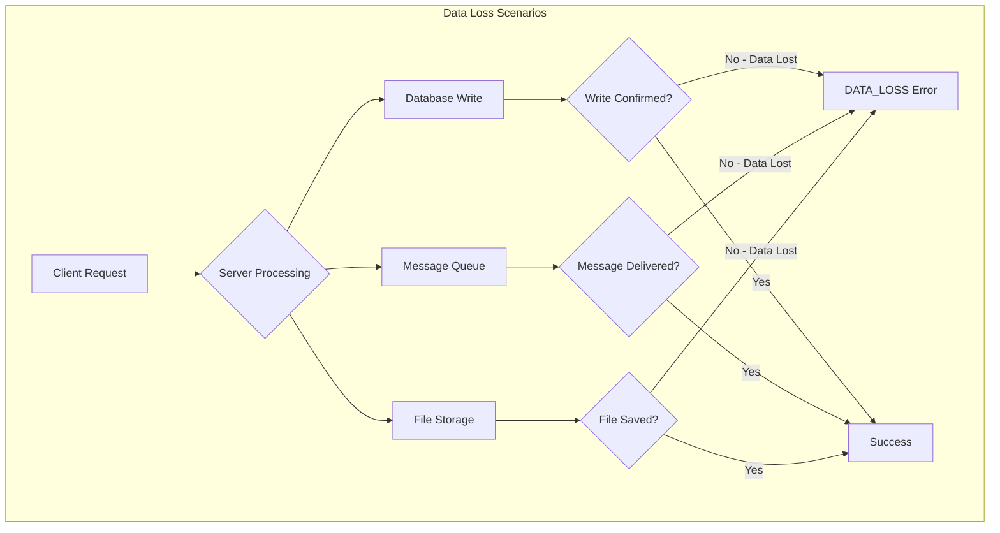
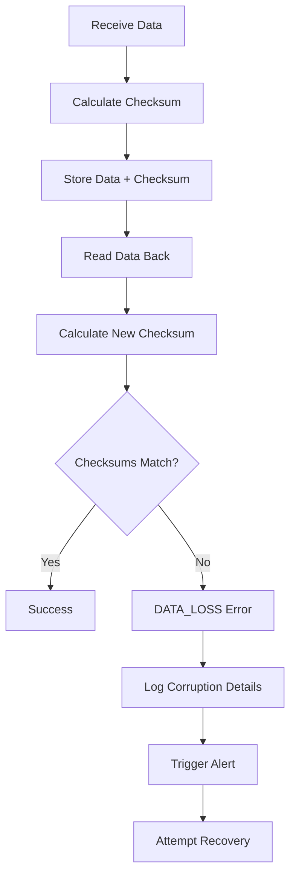
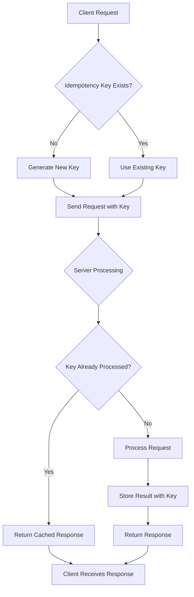

# How to Fix 'Data Loss' Errors in gRPC

Author: [nawazdhandala](https://www.github.com/nawazdhandala)

Tags: gRPC, data loss, error handling, status codes, reliability, microservices, protocol buffers

Description: A comprehensive guide to diagnosing and fixing DATA_LOSS errors in gRPC services, covering causes, prevention strategies, and recovery patterns.

---

The DATA_LOSS status code (code 15) in gRPC represents one of the most severe error conditions, indicating unrecoverable data loss or corruption. Unlike transient errors that can be retried, DATA_LOSS signals a fundamental problem that requires immediate investigation. This guide covers the causes, detection methods, and strategies for handling and preventing data loss errors in gRPC applications.

## Understanding the DATA_LOSS Status Code

DATA_LOSS is reserved for situations where data has been irreversibly lost or corrupted. It should be used sparingly and only when the situation truly warrants it.



### When to Use DATA_LOSS

| Scenario | Appropriate | Reason |
|----------|-------------|--------|
| Database write failed after commit | Yes | Data confirmed lost |
| Network timeout during write | No | Use UNAVAILABLE |
| Corrupted file detected | Yes | Data integrity compromised |
| Partial write to storage | Yes | Incomplete data is lost data |
| Query returned no results | No | Use NOT_FOUND |
| Checksum mismatch | Yes | Data corruption detected |

## Common Causes of Data Loss Errors

### 1. Storage System Failures

```go
// server/storage_handler.go
package server

import (
    "context"
    "crypto/sha256"
    "encoding/hex"
    "fmt"
    "io"
    "os"

    "google.golang.org/grpc/codes"
    "google.golang.org/grpc/status"
    pb "myapp/proto"
)

type StorageService struct {
    pb.UnimplementedStorageServiceServer
    basePath string
}

// SaveData demonstrates proper data loss error handling for storage operations
func (s *StorageService) SaveData(ctx context.Context, req *pb.SaveDataRequest) (*pb.SaveDataResponse, error) {
    // Calculate checksum before writing
    expectedChecksum := calculateChecksum(req.Data)

    // Write data to file
    filePath := fmt.Sprintf("%s/%s", s.basePath, req.Id)

    file, err := os.Create(filePath)
    if err != nil {
        // File creation failure is not data loss - data never existed
        return nil, status.Errorf(codes.Internal, "failed to create file: %v", err)
    }
    defer file.Close()

    // Write data
    written, err := file.Write(req.Data)
    if err != nil {
        // Partial write - this IS data loss
        os.Remove(filePath) // Clean up partial file
        return nil, status.Errorf(codes.DataLoss,
            "partial write detected: wrote %d of %d bytes, data may be corrupted",
            written, len(req.Data))
    }

    // Sync to ensure data is on disk
    if err := file.Sync(); err != nil {
        // Sync failure after write - potential data loss
        return nil, status.Errorf(codes.DataLoss,
            "failed to sync data to disk: %v, data may not be persisted", err)
    }

    // Verify written data
    actualChecksum, err := s.verifyWrittenData(filePath)
    if err != nil {
        return nil, status.Errorf(codes.DataLoss,
            "verification failed: %v", err)
    }

    if actualChecksum != expectedChecksum {
        // Data corruption detected
        os.Remove(filePath)
        return nil, status.Errorf(codes.DataLoss,
            "checksum mismatch: expected %s, got %s, data corrupted",
            expectedChecksum, actualChecksum)
    }

    return &pb.SaveDataResponse{
        Id:       req.Id,
        Checksum: expectedChecksum,
        Size:     int64(len(req.Data)),
    }, nil
}

func calculateChecksum(data []byte) string {
    hash := sha256.Sum256(data)
    return hex.EncodeToString(hash[:])
}

func (s *StorageService) verifyWrittenData(filePath string) (string, error) {
    file, err := os.Open(filePath)
    if err != nil {
        return "", fmt.Errorf("failed to open file for verification: %w", err)
    }
    defer file.Close()

    hash := sha256.New()
    if _, err := io.Copy(hash, file); err != nil {
        return "", fmt.Errorf("failed to read file for verification: %w", err)
    }

    return hex.EncodeToString(hash.Sum(nil)), nil
}
```

### 2. Database Transaction Failures

```go
// server/database_handler.go
package server

import (
    "context"
    "database/sql"
    "fmt"

    "google.golang.org/grpc/codes"
    "google.golang.org/grpc/status"
    pb "myapp/proto"
)

type DatabaseService struct {
    pb.UnimplementedDatabaseServiceServer
    db *sql.DB
}

// CreateRecord demonstrates proper transaction handling with data loss detection
func (s *DatabaseService) CreateRecord(ctx context.Context, req *pb.CreateRecordRequest) (*pb.Record, error) {
    // Begin transaction
    tx, err := s.db.BeginTx(ctx, &sql.TxOptions{
        Isolation: sql.LevelSerializable,
    })
    if err != nil {
        return nil, status.Errorf(codes.Internal, "failed to begin transaction: %v", err)
    }

    // Ensure rollback on panic
    defer func() {
        if r := recover(); r != nil {
            tx.Rollback()
            panic(r)
        }
    }()

    // Insert record
    result, err := tx.ExecContext(ctx,
        "INSERT INTO records (id, name, data) VALUES ($1, $2, $3)",
        req.Id, req.Name, req.Data,
    )
    if err != nil {
        tx.Rollback()
        return nil, status.Errorf(codes.Internal, "failed to insert record: %v", err)
    }

    // Verify insertion
    rowsAffected, err := result.RowsAffected()
    if err != nil {
        tx.Rollback()
        return nil, status.Errorf(codes.Internal, "failed to verify insertion: %v", err)
    }

    if rowsAffected != 1 {
        tx.Rollback()
        return nil, status.Errorf(codes.DataLoss,
            "unexpected rows affected: expected 1, got %d, data may be lost",
            rowsAffected)
    }

    // Commit transaction
    if err := tx.Commit(); err != nil {
        // Commit failure after successful insert is DATA_LOSS
        // The data was written but the commit failed
        return nil, status.Errorf(codes.DataLoss,
            "transaction commit failed: %v, data may be lost or in inconsistent state",
            err)
    }

    // Verify data can be read back
    record, err := s.verifyRecord(ctx, req.Id)
    if err != nil {
        return nil, status.Errorf(codes.DataLoss,
            "post-commit verification failed: %v, data may be corrupted",
            err)
    }

    return record, nil
}

func (s *DatabaseService) verifyRecord(ctx context.Context, id string) (*pb.Record, error) {
    var record pb.Record
    err := s.db.QueryRowContext(ctx,
        "SELECT id, name, data FROM records WHERE id = $1",
        id,
    ).Scan(&record.Id, &record.Name, &record.Data)

    if err != nil {
        return nil, err
    }

    return &record, nil
}
```

### 3. Message Queue Acknowledgment Failures

```go
// server/queue_handler.go
package server

import (
    "context"
    "encoding/json"
    "fmt"
    "time"

    "google.golang.org/grpc/codes"
    "google.golang.org/grpc/status"
    pb "myapp/proto"
)

type Message struct {
    ID        string    `json:"id"`
    Payload   []byte    `json:"payload"`
    Timestamp time.Time `json:"timestamp"`
}

type QueueService struct {
    pb.UnimplementedQueueServiceServer
    producer MessageProducer
}

type MessageProducer interface {
    Send(ctx context.Context, msg []byte) error
    SendWithAck(ctx context.Context, msg []byte) (string, error)
}

// PublishMessage demonstrates proper message queue handling
func (s *QueueService) PublishMessage(ctx context.Context, req *pb.PublishRequest) (*pb.PublishResponse, error) {
    message := Message{
        ID:        req.MessageId,
        Payload:   req.Payload,
        Timestamp: time.Now(),
    }

    data, err := json.Marshal(message)
    if err != nil {
        return nil, status.Errorf(codes.Internal, "failed to serialize message: %v", err)
    }

    // Use send with acknowledgment to detect data loss
    ackID, err := s.producer.SendWithAck(ctx, data)
    if err != nil {
        // Check if this is a timeout after send
        if isTimeoutAfterSend(err) {
            // Message was sent but acknowledgment timed out
            // This is potential data loss - we do not know if message was received
            return nil, status.Errorf(codes.DataLoss,
                "message sent but acknowledgment timed out for message %s: %v, message may be lost",
                req.MessageId, err)
        }

        // Send failed before message left client
        return nil, status.Errorf(codes.Unavailable, "failed to send message: %v", err)
    }

    return &pb.PublishResponse{
        MessageId:       req.MessageId,
        AcknowledgmentId: ackID,
        Timestamp:       time.Now().Unix(),
    }, nil
}

func isTimeoutAfterSend(err error) bool {
    // Implementation depends on your message queue client
    // Check for timeout errors that occur after send but before ack
    return false
}
```

## Data Loss Detection Patterns

### Checksum Verification



```go
// integrity/checksum.go
package integrity

import (
    "crypto/sha256"
    "encoding/hex"
    "fmt"

    "google.golang.org/grpc/codes"
    "google.golang.org/grpc/status"
)

type DataIntegrityChecker struct {
    checksums map[string]string
}

func NewDataIntegrityChecker() *DataIntegrityChecker {
    return &DataIntegrityChecker{
        checksums: make(map[string]string),
    }
}

// StoreWithChecksum stores data with integrity verification
func (c *DataIntegrityChecker) StoreWithChecksum(id string, data []byte, store func([]byte) error) error {
    // Calculate checksum before storage
    checksum := c.calculateChecksum(data)

    // Store data
    if err := store(data); err != nil {
        return status.Errorf(codes.Internal, "storage failed: %v", err)
    }

    // Store checksum
    c.checksums[id] = checksum

    return nil
}

// VerifyIntegrity checks if data matches stored checksum
func (c *DataIntegrityChecker) VerifyIntegrity(id string, data []byte) error {
    expectedChecksum, exists := c.checksums[id]
    if !exists {
        return status.Error(codes.NotFound, "no checksum found for data")
    }

    actualChecksum := c.calculateChecksum(data)

    if actualChecksum != expectedChecksum {
        return status.Errorf(codes.DataLoss,
            "data corruption detected for %s: expected checksum %s, got %s",
            id, expectedChecksum, actualChecksum)
    }

    return nil
}

func (c *DataIntegrityChecker) calculateChecksum(data []byte) string {
    hash := sha256.Sum256(data)
    return hex.EncodeToString(hash[:])
}
```

### Write-Ahead Logging

```go
// wal/write_ahead_log.go
package wal

import (
    "encoding/json"
    "fmt"
    "os"
    "sync"
    "time"

    "google.golang.org/grpc/codes"
    "google.golang.org/grpc/status"
)

type WALEntry struct {
    ID        string    `json:"id"`
    Operation string    `json:"operation"`
    Data      []byte    `json:"data"`
    Timestamp time.Time `json:"timestamp"`
    Committed bool      `json:"committed"`
}

type WriteAheadLog struct {
    mu      sync.Mutex
    file    *os.File
    entries map[string]*WALEntry
}

func NewWriteAheadLog(path string) (*WriteAheadLog, error) {
    file, err := os.OpenFile(path, os.O_CREATE|os.O_RDWR|os.O_APPEND, 0644)
    if err != nil {
        return nil, err
    }

    wal := &WriteAheadLog{
        file:    file,
        entries: make(map[string]*WALEntry),
    }

    // Recover any uncommitted entries
    if err := wal.recover(); err != nil {
        return nil, err
    }

    return wal, nil
}

// LogOperation writes an operation to the WAL before executing
func (w *WriteAheadLog) LogOperation(id, operation string, data []byte) error {
    w.mu.Lock()
    defer w.mu.Unlock()

    entry := &WALEntry{
        ID:        id,
        Operation: operation,
        Data:      data,
        Timestamp: time.Now(),
        Committed: false,
    }

    // Write to WAL file
    entryData, err := json.Marshal(entry)
    if err != nil {
        return status.Errorf(codes.Internal, "failed to serialize WAL entry: %v", err)
    }

    if _, err := w.file.Write(append(entryData, '\n')); err != nil {
        return status.Errorf(codes.DataLoss,
            "failed to write to WAL: %v, operation may be lost", err)
    }

    if err := w.file.Sync(); err != nil {
        return status.Errorf(codes.DataLoss,
            "failed to sync WAL: %v, operation may be lost", err)
    }

    w.entries[id] = entry
    return nil
}

// CommitOperation marks an operation as committed
func (w *WriteAheadLog) CommitOperation(id string) error {
    w.mu.Lock()
    defer w.mu.Unlock()

    entry, exists := w.entries[id]
    if !exists {
        return status.Error(codes.NotFound, "WAL entry not found")
    }

    entry.Committed = true

    // Write commit marker
    commitData, _ := json.Marshal(map[string]interface{}{
        "id":        id,
        "committed": true,
        "timestamp": time.Now(),
    })

    if _, err := w.file.Write(append(commitData, '\n')); err != nil {
        return status.Errorf(codes.DataLoss,
            "failed to write commit marker: %v", err)
    }

    if err := w.file.Sync(); err != nil {
        return status.Errorf(codes.DataLoss,
            "failed to sync commit marker: %v", err)
    }

    return nil
}

// recover replays uncommitted entries from the WAL
func (w *WriteAheadLog) recover() error {
    // Implementation: read WAL file and identify uncommitted entries
    // Return DATA_LOSS error if recovery finds corrupted entries
    return nil
}

// GetUncommittedEntries returns entries that need recovery
func (w *WriteAheadLog) GetUncommittedEntries() []*WALEntry {
    w.mu.Lock()
    defer w.mu.Unlock()

    var uncommitted []*WALEntry
    for _, entry := range w.entries {
        if !entry.Committed {
            uncommitted = append(uncommitted, entry)
        }
    }
    return uncommitted
}
```

## Client-Side Handling

### Error Detection and Recovery

```go
// client/data_loss_handler.go
package client

import (
    "context"
    "log"
    "time"

    "google.golang.org/genproto/googleapis/rpc/errdetails"
    "google.golang.org/grpc"
    "google.golang.org/grpc/codes"
    "google.golang.org/grpc/status"
    pb "myapp/proto"
)

type DataLossHandler struct {
    client       pb.StorageServiceClient
    alertService AlertService
    backupClient pb.BackupServiceClient
}

type AlertService interface {
    SendAlert(ctx context.Context, severity, message string) error
}

// SaveDataWithRecovery handles data loss errors with recovery attempts
func (h *DataLossHandler) SaveDataWithRecovery(ctx context.Context, req *pb.SaveDataRequest) (*pb.SaveDataResponse, error) {
    response, err := h.client.SaveData(ctx, req)
    if err == nil {
        return response, nil
    }

    st, ok := status.FromError(err)
    if !ok {
        return nil, err
    }

    if st.Code() == codes.DataLoss {
        // Handle data loss error
        return h.handleDataLoss(ctx, req, st)
    }

    return nil, err
}

func (h *DataLossHandler) handleDataLoss(ctx context.Context, req *pb.SaveDataRequest, st *status.Status) (*pb.SaveDataResponse, error) {
    // Log the data loss event
    log.Printf("DATA_LOSS detected for request ID %s: %s", req.Id, st.Message())

    // Extract error details if available
    for _, detail := range st.Details() {
        switch d := detail.(type) {
        case *errdetails.ErrorInfo:
            log.Printf("Error info: reason=%s, domain=%s", d.Reason, d.Domain)
            for k, v := range d.Metadata {
                log.Printf("  %s: %s", k, v)
            }
        case *errdetails.DebugInfo:
            log.Printf("Debug info: %s", d.Detail)
        }
    }

    // Send alert
    if err := h.alertService.SendAlert(ctx, "CRITICAL",
        fmt.Sprintf("Data loss detected for %s: %s", req.Id, st.Message())); err != nil {
        log.Printf("Failed to send alert: %v", err)
    }

    // Attempt recovery via backup service
    backupResponse, err := h.attemptBackupRecovery(ctx, req)
    if err != nil {
        log.Printf("Backup recovery failed: %v", err)
        return nil, status.Errorf(codes.DataLoss,
            "primary and backup storage failed for %s", req.Id)
    }

    return backupResponse, nil
}

func (h *DataLossHandler) attemptBackupRecovery(ctx context.Context, req *pb.SaveDataRequest) (*pb.SaveDataResponse, error) {
    log.Printf("Attempting backup recovery for %s", req.Id)

    // Try backup storage with timeout
    backupCtx, cancel := context.WithTimeout(ctx, 30*time.Second)
    defer cancel()

    return h.backupClient.SaveData(backupCtx, req)
}
```

### Retry Strategy for Data Operations

```go
// client/retry_strategy.go
package client

import (
    "context"
    "time"

    "google.golang.org/grpc/codes"
    "google.golang.org/grpc/status"
)

type RetryConfig struct {
    MaxRetries     int
    InitialBackoff time.Duration
    MaxBackoff     time.Duration
    BackoffFactor  float64
}

var DefaultRetryConfig = RetryConfig{
    MaxRetries:     3,
    InitialBackoff: 100 * time.Millisecond,
    MaxBackoff:     10 * time.Second,
    BackoffFactor:  2.0,
}

// DataOperation represents a data operation that can be retried
type DataOperation func(ctx context.Context) error

// ExecuteWithRetry executes an operation with appropriate retry logic
func ExecuteWithRetry(ctx context.Context, config RetryConfig, op DataOperation) error {
    var lastErr error
    backoff := config.InitialBackoff

    for attempt := 0; attempt <= config.MaxRetries; attempt++ {
        err := op(ctx)
        if err == nil {
            return nil
        }

        lastErr = err
        st, ok := status.FromError(err)
        if !ok {
            return err
        }

        // DATA_LOSS should NOT be retried - it indicates permanent failure
        if st.Code() == codes.DataLoss {
            return err
        }

        // Only retry transient errors
        if !isRetryable(st.Code()) {
            return err
        }

        if attempt < config.MaxRetries {
            select {
            case <-ctx.Done():
                return ctx.Err()
            case <-time.After(backoff):
                backoff = time.Duration(float64(backoff) * config.BackoffFactor)
                if backoff > config.MaxBackoff {
                    backoff = config.MaxBackoff
                }
            }
        }
    }

    return lastErr
}

func isRetryable(code codes.Code) bool {
    switch code {
    case codes.Unavailable, codes.ResourceExhausted, codes.Aborted, codes.DeadlineExceeded:
        return true
    default:
        return false
    }
}
```

## Prevention Strategies

### Idempotency for Safe Retries



```go
// server/idempotency.go
package server

import (
    "context"
    "sync"
    "time"

    "google.golang.org/grpc/codes"
    "google.golang.org/grpc/status"
)

type IdempotencyStore struct {
    mu       sync.RWMutex
    results  map[string]*CachedResult
    ttl      time.Duration
}

type CachedResult struct {
    Response interface{}
    Error    error
    Created  time.Time
}

func NewIdempotencyStore(ttl time.Duration) *IdempotencyStore {
    store := &IdempotencyStore{
        results: make(map[string]*CachedResult),
        ttl:     ttl,
    }
    go store.cleanup()
    return store
}

// ExecuteIdempotent ensures an operation is only executed once per key
func (s *IdempotencyStore) ExecuteIdempotent(
    ctx context.Context,
    idempotencyKey string,
    operation func() (interface{}, error),
) (interface{}, error) {
    if idempotencyKey == "" {
        return nil, status.Error(codes.InvalidArgument, "idempotency key required")
    }

    // Check for existing result
    s.mu.RLock()
    if result, exists := s.results[idempotencyKey]; exists {
        s.mu.RUnlock()
        return result.Response, result.Error
    }
    s.mu.RUnlock()

    // Execute operation
    response, err := operation()

    // Cache result (even errors, except DATA_LOSS)
    if st, ok := status.FromError(err); !ok || st.Code() != codes.DataLoss {
        s.mu.Lock()
        s.results[idempotencyKey] = &CachedResult{
            Response: response,
            Error:    err,
            Created:  time.Now(),
        }
        s.mu.Unlock()
    }

    return response, err
}

func (s *IdempotencyStore) cleanup() {
    ticker := time.NewTicker(time.Minute)
    for range ticker.C {
        s.mu.Lock()
        now := time.Now()
        for key, result := range s.results {
            if now.Sub(result.Created) > s.ttl {
                delete(s.results, key)
            }
        }
        s.mu.Unlock()
    }
}
```

### Replication and Redundancy

```go
// server/replicated_storage.go
package server

import (
    "context"
    "sync"

    "google.golang.org/grpc/codes"
    "google.golang.org/grpc/status"
    pb "myapp/proto"
)

type ReplicatedStorage struct {
    primary   StorageBackend
    replicas  []StorageBackend
    minWrites int // Minimum successful writes required
}

type StorageBackend interface {
    Write(ctx context.Context, id string, data []byte) error
    Read(ctx context.Context, id string) ([]byte, error)
}

// WriteWithReplication writes to multiple backends to prevent data loss
func (r *ReplicatedStorage) WriteWithReplication(ctx context.Context, id string, data []byte) error {
    var wg sync.WaitGroup
    results := make(chan error, 1+len(r.replicas))

    // Write to primary
    wg.Add(1)
    go func() {
        defer wg.Done()
        results <- r.primary.Write(ctx, id, data)
    }()

    // Write to replicas
    for _, replica := range r.replicas {
        wg.Add(1)
        go func(backend StorageBackend) {
            defer wg.Done()
            results <- backend.Write(ctx, id, data)
        }(replica)
    }

    // Wait for all writes to complete
    go func() {
        wg.Wait()
        close(results)
    }()

    // Count successful writes
    successCount := 0
    var lastErr error

    for err := range results {
        if err == nil {
            successCount++
        } else {
            lastErr = err
        }
    }

    // Check if we have enough successful writes
    if successCount < r.minWrites {
        return status.Errorf(codes.DataLoss,
            "insufficient replicas: only %d of %d required writes succeeded, last error: %v",
            successCount, r.minWrites, lastErr)
    }

    return nil
}

// ReadWithVerification reads from multiple sources and verifies consistency
func (r *ReplicatedStorage) ReadWithVerification(ctx context.Context, id string) ([]byte, error) {
    // Read from primary
    primaryData, primaryErr := r.primary.Read(ctx, id)

    // Read from one replica for verification
    if len(r.replicas) > 0 {
        replicaData, replicaErr := r.replicas[0].Read(ctx, id)

        if primaryErr == nil && replicaErr == nil {
            // Both succeeded - verify consistency
            if string(primaryData) != string(replicaData) {
                return nil, status.Error(codes.DataLoss,
                    "data inconsistency detected between primary and replica")
            }
            return primaryData, nil
        }

        // Return whichever succeeded
        if primaryErr == nil {
            return primaryData, nil
        }
        if replicaErr == nil {
            return replicaData, nil
        }
    }

    if primaryErr != nil {
        return nil, status.Errorf(codes.DataLoss,
            "failed to read from any storage: %v", primaryErr)
    }

    return primaryData, nil
}
```

## Monitoring and Alerting

```go
// monitoring/data_loss_monitor.go
package monitoring

import (
    "context"
    "log"
    "sync/atomic"
    "time"

    "github.com/prometheus/client_golang/prometheus"
    "github.com/prometheus/client_golang/prometheus/promauto"
)

var (
    dataLossCounter = promauto.NewCounterVec(
        prometheus.CounterOpts{
            Name: "grpc_data_loss_total",
            Help: "Total number of DATA_LOSS errors",
        },
        []string{"service", "method", "reason"},
    )

    dataLossLastOccurrence = promauto.NewGaugeVec(
        prometheus.GaugeOpts{
            Name: "grpc_data_loss_last_occurrence_timestamp",
            Help: "Timestamp of last DATA_LOSS error",
        },
        []string{"service", "method"},
    )
)

type DataLossMonitor struct {
    totalLossEvents int64
    alertThreshold  int64
    alertCooldown   time.Duration
    lastAlert       time.Time
    alertCallback   func(message string)
}

func NewDataLossMonitor(threshold int64, cooldown time.Duration, alertCallback func(string)) *DataLossMonitor {
    return &DataLossMonitor{
        alertThreshold: threshold,
        alertCooldown:  cooldown,
        alertCallback:  alertCallback,
    }
}

// RecordDataLoss records a data loss event and triggers alerts if needed
func (m *DataLossMonitor) RecordDataLoss(service, method, reason string) {
    // Increment metrics
    dataLossCounter.WithLabelValues(service, method, reason).Inc()
    dataLossLastOccurrence.WithLabelValues(service, method).SetToCurrentTime()

    // Track total events
    total := atomic.AddInt64(&m.totalLossEvents, 1)

    // Check if we should alert
    if total >= m.alertThreshold {
        if time.Since(m.lastAlert) > m.alertCooldown {
            m.lastAlert = time.Now()
            if m.alertCallback != nil {
                m.alertCallback(fmt.Sprintf(
                    "DATA_LOSS threshold exceeded: %d events (service=%s, method=%s, reason=%s)",
                    total, service, method, reason))
            }
        }
    }

    log.Printf("[DATA_LOSS] service=%s method=%s reason=%s total=%d",
        service, method, reason, total)
}

// ResetCounter resets the event counter (e.g., after investigation)
func (m *DataLossMonitor) ResetCounter() {
    atomic.StoreInt64(&m.totalLossEvents, 0)
}
```

## Best Practices

1. **Use DATA_LOSS sparingly**: Only for confirmed, unrecoverable data loss
2. **Never retry DATA_LOSS errors**: They indicate permanent failure
3. **Always verify writes**: Use checksums and read-back verification
4. **Implement write-ahead logging**: For crash recovery
5. **Use replication**: Write to multiple backends when data is critical
6. **Enable idempotency**: Allow safe retries without data duplication
7. **Monitor aggressively**: Alert immediately on any DATA_LOSS error
8. **Document recovery procedures**: Have runbooks ready for data loss incidents
9. **Test failure scenarios**: Regularly simulate storage failures
10. **Maintain backups**: Ensure backup systems are tested and working

## Conclusion

DATA_LOSS errors in gRPC represent serious system failures that require immediate attention. By implementing proper verification, replication, and monitoring, you can minimize the risk of data loss and quickly detect when it occurs. Remember that the goal is not just to handle these errors gracefully, but to design systems that prevent them from occurring in the first place. Regular testing of failure scenarios and maintaining robust backup strategies are essential components of a resilient data management system.
