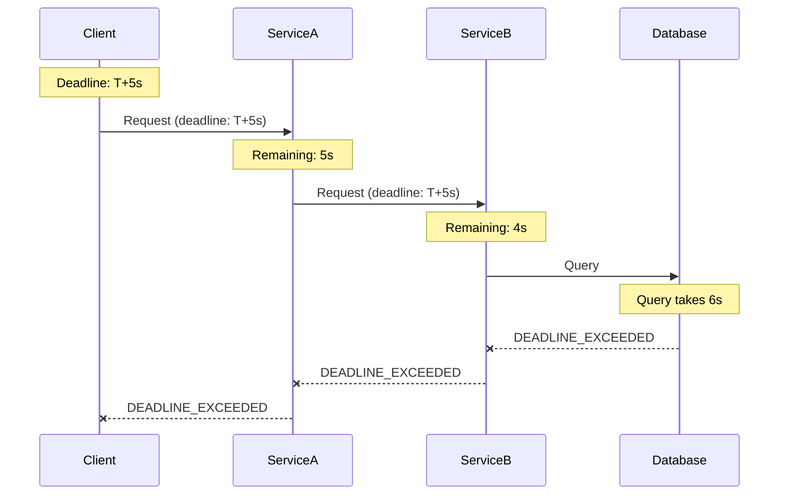
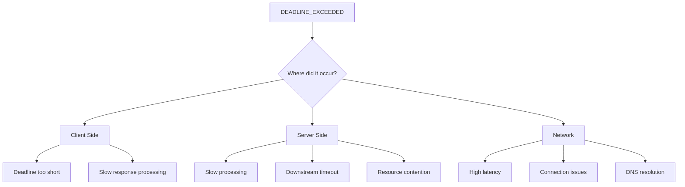
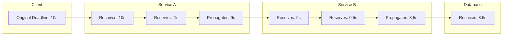

# How to Fix "Deadline Exceeded" Errors in gRPC

Author: [nawazdhandala](https://github.com/nawazdhandala)

Tags: gRPC, Troubleshooting, Timeout, Performance, Distributed Systems

Description: Learn how to diagnose and fix gRPC DEADLINE_EXCEEDED errors by configuring proper timeouts, optimizing performance, and implementing deadline propagation.

---

The gRPC DEADLINE_EXCEEDED status code (code 4) indicates that an operation did not complete within the specified deadline. This error is common in distributed systems where network latency, server processing time, or downstream service delays cause requests to exceed their time limits. This guide covers how to properly configure deadlines, propagate them across services, and optimize performance to avoid timeout errors.

## Understanding Deadlines in gRPC

A deadline is an absolute point in time by which an operation must complete. Unlike timeouts (relative duration), deadlines propagate across service boundaries, ensuring that the entire request chain respects the original time constraint.



## Common Causes of DEADLINE_EXCEEDED



## Configuring Client Deadlines

### Basic Deadline Configuration (Go)

```go
// client_deadline.go - Proper deadline configuration
package main

import (
    "context"
    "log"
    "time"

    "google.golang.org/grpc"
    "google.golang.org/grpc/codes"
    "google.golang.org/grpc/status"
    pb "myservice/pb"
)

func makeRequestWithDeadline(client pb.MyServiceClient) (*pb.Response, error) {
    // Create context with deadline (absolute time)
    // Use deadline when you need request to complete by specific time
    deadline := time.Now().Add(5 * time.Second)
    ctx, cancel := context.WithDeadline(context.Background(), deadline)
    defer cancel()

    // Make the request
    resp, err := client.DoSomething(ctx, &pb.Request{
        Data: "test",
    })

    if err != nil {
        st, ok := status.FromError(err)
        if ok && st.Code() == codes.DeadlineExceeded {
            log.Printf("Request timed out after deadline: %v", deadline)
            // Handle timeout specifically
            return nil, err
        }
        return nil, err
    }

    return resp, nil
}

func makeRequestWithTimeout(client pb.MyServiceClient) (*pb.Response, error) {
    // Create context with timeout (relative duration)
    // Use timeout for simpler cases where you want max wait time
    ctx, cancel := context.WithTimeout(context.Background(), 5*time.Second)
    defer cancel()

    return client.DoSomething(ctx, &pb.Request{Data: "test"})
}

// Configure different timeouts for different operation types
type TimeoutConfig struct {
    FastOperations   time.Duration
    NormalOperations time.Duration
    SlowOperations   time.Duration
    BatchOperations  time.Duration
}

func DefaultTimeoutConfig() TimeoutConfig {
    return TimeoutConfig{
        FastOperations:   1 * time.Second,
        NormalOperations: 5 * time.Second,
        SlowOperations:   30 * time.Second,
        BatchOperations:  5 * time.Minute,
    }
}

func (c *TimeoutConfig) GetTimeout(operationType string) time.Duration {
    switch operationType {
    case "fast":
        return c.FastOperations
    case "slow":
        return c.SlowOperations
    case "batch":
        return c.BatchOperations
    default:
        return c.NormalOperations
    }
}
```

### Per-Method Timeout Configuration

```go
// method_timeout.go - Configure timeouts per RPC method
package main

import (
    "context"
    "time"

    "google.golang.org/grpc"
)

// MethodTimeouts maps method names to their timeouts
var MethodTimeouts = map[string]time.Duration{
    "/myservice.MyService/GetUser":      2 * time.Second,
    "/myservice.MyService/ListUsers":    10 * time.Second,
    "/myservice.MyService/CreateUser":   5 * time.Second,
    "/myservice.MyService/DeleteUser":   5 * time.Second,
    "/myservice.MyService/BatchProcess": 5 * time.Minute,
    "/myservice.MyService/HealthCheck":  1 * time.Second,
}

// TimeoutInterceptor adds method-specific timeouts
func TimeoutInterceptor(defaultTimeout time.Duration) grpc.UnaryClientInterceptor {
    return func(
        ctx context.Context,
        method string,
        req, reply interface{},
        cc *grpc.ClientConn,
        invoker grpc.UnaryInvoker,
        opts ...grpc.CallOption,
    ) error {
        // Check if context already has a deadline
        if _, hasDeadline := ctx.Deadline(); hasDeadline {
            // Use existing deadline
            return invoker(ctx, method, req, reply, cc, opts...)
        }

        // Get method-specific timeout or use default
        timeout := defaultTimeout
        if methodTimeout, exists := MethodTimeouts[method]; exists {
            timeout = methodTimeout
        }

        // Create new context with timeout
        ctx, cancel := context.WithTimeout(ctx, timeout)
        defer cancel()

        return invoker(ctx, method, req, reply, cc, opts...)
    }
}

// Usage
func createClientWithTimeouts() (*grpc.ClientConn, error) {
    return grpc.Dial(
        "localhost:50051",
        grpc.WithInsecure(),
        grpc.WithUnaryInterceptor(TimeoutInterceptor(5*time.Second)),
    )
}
```

## Server-Side Deadline Handling

### Checking Deadline on Server

```go
// server_deadline.go - Server-side deadline awareness
package main

import (
    "context"
    "log"
    "time"

    "google.golang.org/grpc/codes"
    "google.golang.org/grpc/status"
    pb "myservice/pb"
)

type server struct {
    pb.UnimplementedMyServiceServer
}

// DoSomething handles request with deadline awareness
func (s *server) DoSomething(ctx context.Context, req *pb.Request) (*pb.Response, error) {
    // Check if deadline is set
    deadline, hasDeadline := ctx.Deadline()
    if hasDeadline {
        remaining := time.Until(deadline)
        log.Printf("Request deadline: %v, remaining: %v", deadline, remaining)

        // If very little time remains, fail fast
        if remaining < 100*time.Millisecond {
            return nil, status.Error(codes.DeadlineExceeded,
                "insufficient time remaining to process request")
        }
    }

    // Simulate work with periodic deadline checks
    for i := 0; i < 10; i++ {
        // Check context before each step
        select {
        case <-ctx.Done():
            if ctx.Err() == context.DeadlineExceeded {
                log.Printf("Deadline exceeded at step %d", i)
                return nil, status.Error(codes.DeadlineExceeded,
                    "deadline exceeded during processing")
            }
            return nil, status.FromContextError(ctx.Err()).Err()
        default:
            // Continue processing
        }

        // Simulate work
        time.Sleep(100 * time.Millisecond)
    }

    return &pb.Response{Result: "success"}, nil
}

// ProcessWithDeadlineAwareness shows how to handle long operations
func (s *server) ProcessWithDeadlineAwareness(ctx context.Context, req *pb.Request) (*pb.Response, error) {
    // Create a channel for the result
    resultChan := make(chan *pb.Response, 1)
    errChan := make(chan error, 1)

    go func() {
        // Do the actual work
        result, err := s.doExpensiveWork(ctx, req)
        if err != nil {
            errChan <- err
        } else {
            resultChan <- result
        }
    }()

    // Wait for result or deadline
    select {
    case result := <-resultChan:
        return result, nil
    case err := <-errChan:
        return nil, err
    case <-ctx.Done():
        // Deadline exceeded or cancelled
        return nil, status.FromContextError(ctx.Err()).Err()
    }
}

func (s *server) doExpensiveWork(ctx context.Context, req *pb.Request) (*pb.Response, error) {
    // Periodically check context
    for i := 0; i < 100; i++ {
        if ctx.Err() != nil {
            return nil, ctx.Err()
        }
        time.Sleep(50 * time.Millisecond)
    }
    return &pb.Response{Result: "completed"}, nil
}
```

## Deadline Propagation Across Services

When calling downstream services, always propagate the deadline from the incoming context:

```go
// deadline_propagation.go - Propagating deadlines across services
package main

import (
    "context"
    "log"
    "time"

    "google.golang.org/grpc/codes"
    "google.golang.org/grpc/status"
    pb "myservice/pb"
    downstream "downstream/pb"
)

type server struct {
    pb.UnimplementedMyServiceServer
    downstreamClient downstream.DownstreamServiceClient
}

func (s *server) ProcessRequest(ctx context.Context, req *pb.Request) (*pb.Response, error) {
    // Check remaining time
    deadline, hasDeadline := ctx.Deadline()
    if hasDeadline {
        remaining := time.Until(deadline)
        log.Printf("Incoming request with %v remaining", remaining)

        // Reserve some time for our own processing
        const reservedTime = 500 * time.Millisecond
        if remaining < reservedTime {
            return nil, status.Error(codes.DeadlineExceeded,
                "insufficient time for request processing")
        }

        // Create a shorter deadline for downstream call
        // This ensures we have time to handle the response
        downstreamDeadline := deadline.Add(-reservedTime)
        var cancel context.CancelFunc
        ctx, cancel = context.WithDeadline(ctx, downstreamDeadline)
        defer cancel()
    }

    // Call downstream service - deadline is automatically propagated
    downstreamResp, err := s.downstreamClient.DoWork(ctx, &downstream.Request{
        Data: req.Data,
    })
    if err != nil {
        st, _ := status.FromError(err)
        if st.Code() == codes.DeadlineExceeded {
            log.Printf("Downstream service timed out")
        }
        return nil, err
    }

    // Process response (within reserved time)
    return &pb.Response{
        Result: downstreamResp.Result,
    }, nil
}
```



## Timeout Best Practices

### Setting Appropriate Timeouts

```go
// timeout_guidelines.go - Guidelines for setting timeouts
package main

import "time"

// TimeoutGuidelines provides recommendations for different operation types
type TimeoutGuidelines struct{}

func (t *TimeoutGuidelines) Recommendations() map[string]time.Duration {
    return map[string]time.Duration{
        // Health checks should be very fast
        "health_check": 1 * time.Second,

        // Simple CRUD operations
        "get_single_item":    2 * time.Second,
        "create_item":        5 * time.Second,
        "update_item":        5 * time.Second,
        "delete_item":        5 * time.Second,

        // List operations (depends on page size)
        "list_items_small":  5 * time.Second,   // < 100 items
        "list_items_medium": 15 * time.Second,  // 100-1000 items
        "list_items_large":  60 * time.Second,  // > 1000 items

        // Complex operations
        "search":           10 * time.Second,
        "aggregation":      30 * time.Second,
        "report_generation": 5 * time.Minute,

        // Batch operations
        "batch_create": 5 * time.Minute,
        "batch_update": 5 * time.Minute,
        "batch_delete": 5 * time.Minute,

        // File operations
        "file_upload":   10 * time.Minute,
        "file_download": 10 * time.Minute,

        // Long-running operations (should use async pattern instead)
        "data_migration": 30 * time.Minute,
        "full_export":    1 * time.Hour,
    }
}

// CalculateTimeout computes timeout based on expected latency percentiles
func CalculateTimeout(p50, p99 time.Duration) time.Duration {
    // Use 2-3x the p99 latency as timeout
    // This allows for some variance while catching truly hung requests
    return p99 * 3
}
```

### Adaptive Timeouts

```go
// adaptive_timeout.go - Dynamically adjust timeouts based on observed latency
package main

import (
    "context"
    "sync"
    "time"

    "google.golang.org/grpc"
)

// LatencyTracker tracks request latencies for adaptive timeouts
type LatencyTracker struct {
    mu        sync.RWMutex
    latencies map[string][]time.Duration
    maxSamples int
}

func NewLatencyTracker(maxSamples int) *LatencyTracker {
    return &LatencyTracker{
        latencies:  make(map[string][]time.Duration),
        maxSamples: maxSamples,
    }
}

func (t *LatencyTracker) Record(method string, latency time.Duration) {
    t.mu.Lock()
    defer t.mu.Unlock()

    samples := t.latencies[method]
    samples = append(samples, latency)

    // Keep only recent samples
    if len(samples) > t.maxSamples {
        samples = samples[len(samples)-t.maxSamples:]
    }

    t.latencies[method] = samples
}

func (t *LatencyTracker) GetP99(method string) time.Duration {
    t.mu.RLock()
    defer t.mu.RUnlock()

    samples := t.latencies[method]
    if len(samples) == 0 {
        return 5 * time.Second // Default
    }

    // Simple P99 calculation (sort and take 99th percentile)
    sorted := make([]time.Duration, len(samples))
    copy(sorted, samples)
    sort.Slice(sorted, func(i, j int) bool {
        return sorted[i] < sorted[j]
    })

    p99Index := int(float64(len(sorted)) * 0.99)
    if p99Index >= len(sorted) {
        p99Index = len(sorted) - 1
    }

    return sorted[p99Index]
}

func (t *LatencyTracker) GetAdaptiveTimeout(method string, multiplier float64) time.Duration {
    p99 := t.GetP99(method)
    timeout := time.Duration(float64(p99) * multiplier)

    // Apply bounds
    const minTimeout = 1 * time.Second
    const maxTimeout = 60 * time.Second

    if timeout < minTimeout {
        return minTimeout
    }
    if timeout > maxTimeout {
        return maxTimeout
    }

    return timeout
}

// AdaptiveTimeoutInterceptor uses observed latency to set timeouts
func AdaptiveTimeoutInterceptor(tracker *LatencyTracker) grpc.UnaryClientInterceptor {
    return func(
        ctx context.Context,
        method string,
        req, reply interface{},
        cc *grpc.ClientConn,
        invoker grpc.UnaryInvoker,
        opts ...grpc.CallOption,
    ) error {
        // Get adaptive timeout (3x P99)
        timeout := tracker.GetAdaptiveTimeout(method, 3.0)

        // Only add timeout if context does not have one
        if _, hasDeadline := ctx.Deadline(); !hasDeadline {
            var cancel context.CancelFunc
            ctx, cancel = context.WithTimeout(ctx, timeout)
            defer cancel()
        }

        // Record start time
        start := time.Now()

        // Make the call
        err := invoker(ctx, method, req, reply, cc, opts...)

        // Record latency for successful calls
        if err == nil {
            tracker.Record(method, time.Since(start))
        }

        return err
    }
}
```

## Debugging Deadline Issues

### Logging and Metrics

```go
// deadline_observability.go - Observability for deadline issues
package main

import (
    "context"
    "log"
    "time"

    "github.com/prometheus/client_golang/prometheus"
    "google.golang.org/grpc"
    "google.golang.org/grpc/codes"
    "google.golang.org/grpc/status"
)

var (
    deadlineExceededTotal = prometheus.NewCounterVec(
        prometheus.CounterOpts{
            Name: "grpc_deadline_exceeded_total",
            Help: "Total number of deadline exceeded errors",
        },
        []string{"method", "side"}, // side: client or server
    )

    requestDeadlineRemaining = prometheus.NewHistogramVec(
        prometheus.HistogramOpts{
            Name:    "grpc_request_deadline_remaining_seconds",
            Help:    "Remaining time until deadline when request arrives",
            Buckets: []float64{0.01, 0.05, 0.1, 0.5, 1, 2, 5, 10, 30, 60},
        },
        []string{"method"},
    )
)

// DeadlineObservabilityInterceptor logs and tracks deadline information
func DeadlineObservabilityInterceptor() grpc.UnaryServerInterceptor {
    return func(
        ctx context.Context,
        req interface{},
        info *grpc.UnaryServerInfo,
        handler grpc.UnaryHandler,
    ) (interface{}, error) {
        // Log deadline information
        if deadline, ok := ctx.Deadline(); ok {
            remaining := time.Until(deadline)
            log.Printf("[%s] Deadline remaining: %v", info.FullMethod, remaining)
            requestDeadlineRemaining.WithLabelValues(info.FullMethod).Observe(remaining.Seconds())

            if remaining < 0 {
                log.Printf("[%s] WARNING: Request arrived after deadline!", info.FullMethod)
                deadlineExceededTotal.WithLabelValues(info.FullMethod, "server").Inc()
                return nil, status.Error(codes.DeadlineExceeded, "deadline already passed")
            }
        }

        // Handle request
        resp, err := handler(ctx, req)

        // Track deadline exceeded errors
        if err != nil {
            if st, ok := status.FromError(err); ok && st.Code() == codes.DeadlineExceeded {
                deadlineExceededTotal.WithLabelValues(info.FullMethod, "server").Inc()
                log.Printf("[%s] DEADLINE_EXCEEDED: %v", info.FullMethod, st.Message())
            }
        }

        return resp, err
    }
}
```

### Distributed Tracing for Timeouts

```go
// deadline_tracing.go - Trace deadline propagation
package main

import (
    "context"
    "time"

    "go.opentelemetry.io/otel"
    "go.opentelemetry.io/otel/attribute"
    "go.opentelemetry.io/otel/trace"
)

func traceDeadlineInfo(ctx context.Context, operationName string) {
    span := trace.SpanFromContext(ctx)

    if deadline, ok := ctx.Deadline(); ok {
        remaining := time.Until(deadline)
        span.SetAttributes(
            attribute.String("deadline.absolute", deadline.Format(time.RFC3339Nano)),
            attribute.Float64("deadline.remaining_seconds", remaining.Seconds()),
            attribute.Bool("deadline.has_deadline", true),
        )
    } else {
        span.SetAttributes(
            attribute.Bool("deadline.has_deadline", false),
        )
    }
}

// WrapWithDeadlineTracing adds deadline information to spans
func WrapWithDeadlineTracing(ctx context.Context, operationName string, fn func(context.Context) error) error {
    tracer := otel.Tracer("deadline-tracer")
    ctx, span := tracer.Start(ctx, operationName)
    defer span.End()

    traceDeadlineInfo(ctx, operationName)

    err := fn(ctx)
    if err != nil {
        span.RecordError(err)
    }

    return err
}
```

## Summary

| Issue | Solution |
|-------|----------|
| Deadline too short | Measure actual latency, set timeout to 2-3x P99 |
| No deadline set | Always set explicit deadlines on client |
| Deadline not propagated | Use incoming context for downstream calls |
| Server ignores deadline | Check ctx.Done() during long operations |
| Network latency | Account for network time in deadline |
| Cascading timeouts | Reserve time at each service hop |

Proper deadline management is essential for reliable distributed systems. Set appropriate timeouts based on observed latency, propagate deadlines across service boundaries, and implement deadline-aware processing on the server side.
