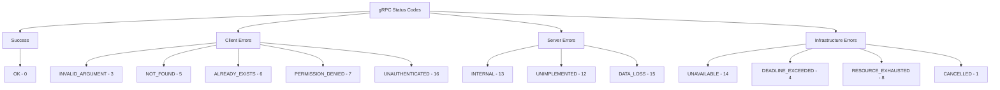
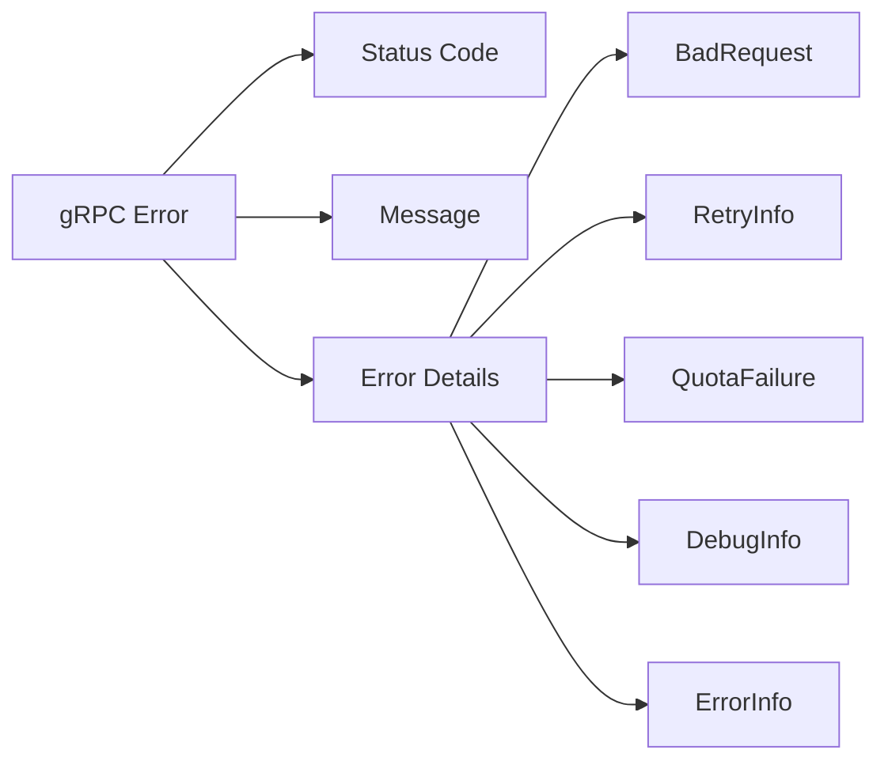
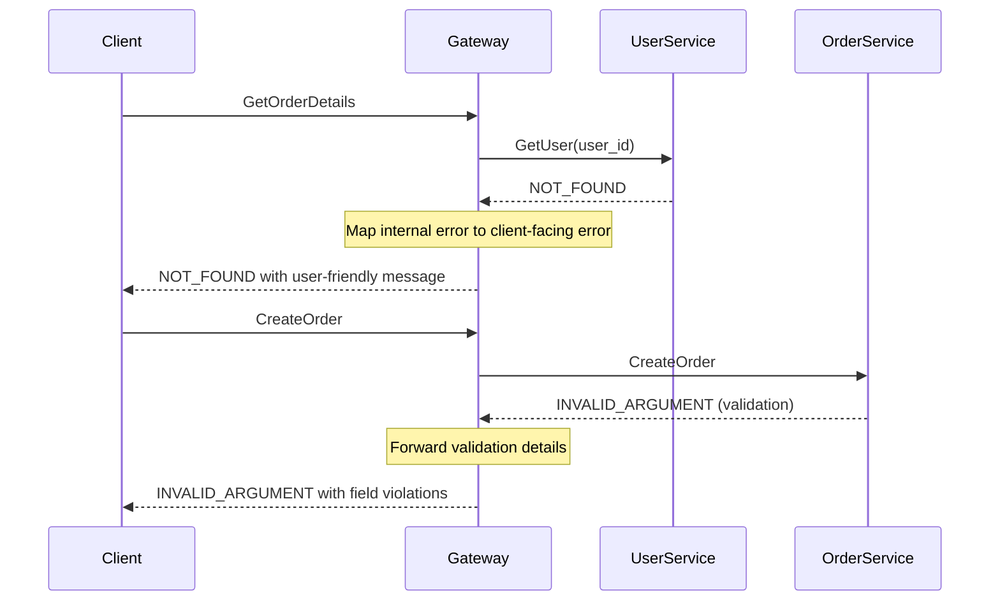

# How to Handle Error Codes in gRPC

Author: [nawazdhandala](https://www.github.com/nawazdhandala)

Tags: gRPC, Error Handling, Microservices, Protocol Buffers, Status Codes, Debugging, Go, Python

Description: A comprehensive guide to understanding and handling gRPC error codes, including proper error propagation, custom error details, and best practices for building resilient microservices.

---

> gRPC uses a standardized set of status codes to communicate errors between services. Understanding how to properly handle these codes is essential for building robust, debuggable microservices. This guide covers the gRPC status code system, error propagation patterns, and practical examples in multiple languages.

Error handling in distributed systems is notoriously difficult. gRPC provides a structured approach with status codes and rich error details, but using them effectively requires understanding the semantics of each code and how to add context that helps with debugging.

---

## gRPC Status Codes Overview



---

## Standard Status Codes Reference

| Code | Number | Description | When to Use |
|------|--------|-------------|-------------|
| OK | 0 | Success | Request completed successfully |
| CANCELLED | 1 | Operation cancelled | Client cancelled the request |
| UNKNOWN | 2 | Unknown error | Catch-all for unmapped errors |
| INVALID_ARGUMENT | 3 | Invalid request | Client sent bad data |
| DEADLINE_EXCEEDED | 4 | Timeout | Request took too long |
| NOT_FOUND | 5 | Resource missing | Requested entity does not exist |
| ALREADY_EXISTS | 6 | Duplicate | Entity already exists |
| PERMISSION_DENIED | 7 | Forbidden | Caller lacks permission |
| RESOURCE_EXHAUSTED | 8 | Quota exceeded | Rate limit or resource limit hit |
| FAILED_PRECONDITION | 9 | State mismatch | System not in required state |
| ABORTED | 10 | Conflict | Concurrent modification detected |
| OUT_OF_RANGE | 11 | Range error | Value outside valid range |
| UNIMPLEMENTED | 12 | Not supported | Method not implemented |
| INTERNAL | 13 | Server error | Internal server failure |
| UNAVAILABLE | 14 | Service down | Service temporarily unavailable |
| DATA_LOSS | 15 | Corruption | Unrecoverable data loss |
| UNAUTHENTICATED | 16 | Not logged in | Missing or invalid credentials |

---

## Basic Error Handling in Python

```python
import grpc
from grpc_status import rpc_status
from google.rpc import status_pb2, error_details_pb2

# Server-side: Returning proper error codes
class UserServiceServicer(user_pb2_grpc.UserServiceServicer):

    def GetUser(self, request, context):
        user_id = request.user_id

        # Validate input - return INVALID_ARGUMENT for bad input
        if not user_id or user_id <= 0:
            context.set_code(grpc.StatusCode.INVALID_ARGUMENT)
            context.set_details('user_id must be a positive integer')
            return user_pb2.User()

        # Check authentication - return UNAUTHENTICATED if not logged in
        if not self._is_authenticated(context):
            context.set_code(grpc.StatusCode.UNAUTHENTICATED)
            context.set_details('Valid authentication token required')
            return user_pb2.User()

        # Check authorization - return PERMISSION_DENIED if not allowed
        if not self._has_permission(context, user_id):
            context.set_code(grpc.StatusCode.PERMISSION_DENIED)
            context.set_details(f'Not authorized to access user {user_id}')
            return user_pb2.User()

        # Look up resource - return NOT_FOUND if missing
        try:
            user = self.db.get_user(user_id)
        except UserNotFoundError:
            context.set_code(grpc.StatusCode.NOT_FOUND)
            context.set_details(f'User with id {user_id} not found')
            return user_pb2.User()
        except DatabaseError as e:
            # Internal errors for unexpected failures
            context.set_code(grpc.StatusCode.INTERNAL)
            context.set_details('Database error occurred')
            # Log the actual error for debugging
            logging.error(f'Database error for user {user_id}: {e}')
            return user_pb2.User()

        return user

    def _is_authenticated(self, context):
        metadata = dict(context.invocation_metadata())
        return 'authorization' in metadata

    def _has_permission(self, context, user_id):
        # Check if caller can access this user
        return True  # Simplified for example
```

---

## Client-Side Error Handling in Python

```python
import grpc
import logging

def get_user_with_error_handling(stub, user_id):
    """
    Fetch a user with comprehensive error handling.
    Returns the user on success, None on expected failures.
    Raises on unexpected errors.
    """
    try:
        request = user_pb2.GetUserRequest(user_id=user_id)
        response = stub.GetUser(request, timeout=5.0)
        return response

    except grpc.RpcError as e:
        status_code = e.code()
        details = e.details()

        # Handle different error codes appropriately
        if status_code == grpc.StatusCode.NOT_FOUND:
            # Expected case - user does not exist
            logging.info(f'User {user_id} not found: {details}')
            return None

        elif status_code == grpc.StatusCode.INVALID_ARGUMENT:
            # Client bug - we sent bad data
            logging.error(f'Invalid argument: {details}')
            raise ValueError(f'Invalid user_id: {user_id}')

        elif status_code == grpc.StatusCode.UNAUTHENTICATED:
            # Need to refresh credentials
            logging.warning('Authentication required, refreshing token')
            raise AuthenticationError(details)

        elif status_code == grpc.StatusCode.PERMISSION_DENIED:
            # User not allowed to access this resource
            logging.warning(f'Permission denied for user {user_id}: {details}')
            raise PermissionError(details)

        elif status_code == grpc.StatusCode.DEADLINE_EXCEEDED:
            # Timeout - maybe retry with longer deadline
            logging.warning(f'Request timed out for user {user_id}')
            raise TimeoutError(details)

        elif status_code == grpc.StatusCode.UNAVAILABLE:
            # Server is down - retry with backoff
            logging.warning(f'Service unavailable: {details}')
            raise ServiceUnavailableError(details)

        elif status_code == grpc.StatusCode.RESOURCE_EXHAUSTED:
            # Rate limited - back off and retry
            logging.warning(f'Rate limited: {details}')
            raise RateLimitError(details)

        else:
            # Unexpected error - log and re-raise
            logging.error(f'gRPC error {status_code}: {details}')
            raise
```

---

## Error Handling in Go

```go
package main

import (
    "context"
    "log"

    "google.golang.org/grpc"
    "google.golang.org/grpc/codes"
    "google.golang.org/grpc/status"

    pb "myservice/proto"
)

// Server implementation with proper error codes
type userServer struct {
    pb.UnimplementedUserServiceServer
    db UserDatabase
}

func (s *userServer) GetUser(ctx context.Context, req *pb.GetUserRequest) (*pb.User, error) {
    // Validate input
    if req.UserId <= 0 {
        return nil, status.Errorf(
            codes.InvalidArgument,
            "user_id must be positive, got %d",
            req.UserId,
        )
    }

    // Check if context is already cancelled
    if ctx.Err() != nil {
        return nil, status.Error(codes.Cancelled, "request cancelled")
    }

    // Look up user
    user, err := s.db.GetUser(ctx, req.UserId)
    if err != nil {
        // Check for specific error types
        if errors.Is(err, ErrUserNotFound) {
            return nil, status.Errorf(
                codes.NotFound,
                "user %d not found",
                req.UserId,
            )
        }

        if errors.Is(err, ErrDatabaseUnavailable) {
            return nil, status.Error(
                codes.Unavailable,
                "database temporarily unavailable",
            )
        }

        // Log unexpected errors and return INTERNAL
        log.Printf("unexpected error fetching user %d: %v", req.UserId, err)
        return nil, status.Error(codes.Internal, "internal error")
    }

    return user, nil
}

// Client-side error handling
func getUserWithRetry(ctx context.Context, client pb.UserServiceClient, userID int64) (*pb.User, error) {
    var lastErr error

    // Retry up to 3 times for retryable errors
    for attempt := 0; attempt < 3; attempt++ {
        user, err := client.GetUser(ctx, &pb.GetUserRequest{UserId: userID})
        if err == nil {
            return user, nil
        }

        lastErr = err

        // Extract gRPC status
        st, ok := status.FromError(err)
        if !ok {
            // Not a gRPC error - do not retry
            return nil, err
        }

        switch st.Code() {
        case codes.NotFound:
            // User does not exist - do not retry
            return nil, err

        case codes.InvalidArgument:
            // Client bug - do not retry
            return nil, err

        case codes.Unavailable:
            // Server temporarily down - retry with backoff
            log.Printf("attempt %d: service unavailable, retrying", attempt+1)
            time.Sleep(time.Duration(attempt+1) * 100 * time.Millisecond)
            continue

        case codes.DeadlineExceeded:
            // Timeout - could retry with fresh deadline
            log.Printf("attempt %d: deadline exceeded", attempt+1)
            continue

        case codes.ResourceExhausted:
            // Rate limited - back off significantly
            log.Printf("attempt %d: rate limited, backing off", attempt+1)
            time.Sleep(time.Duration(attempt+1) * time.Second)
            continue

        default:
            // Unknown error - do not retry
            return nil, err
        }
    }

    return nil, lastErr
}
```

---

## Rich Error Details

gRPC supports adding structured error details for better debugging.



### Adding Rich Error Details in Python

```python
import grpc
from grpc_status import rpc_status
from google.protobuf import any_pb2
from google.rpc import status_pb2, error_details_pb2

def create_validation_error(context, field_violations):
    """
    Create a detailed validation error with field-level information.
    This helps clients understand exactly what went wrong.
    """
    # Create BadRequest with field violations
    bad_request = error_details_pb2.BadRequest()
    for field, description in field_violations:
        violation = bad_request.field_violations.add()
        violation.field = field
        violation.description = description

    # Pack the details into the status
    detail = any_pb2.Any()
    detail.Pack(bad_request)

    # Create rich status with details
    rich_status = status_pb2.Status(
        code=grpc.StatusCode.INVALID_ARGUMENT.value[0],
        message='Request validation failed',
        details=[detail]
    )

    # Abort with rich status
    context.abort_with_status(rpc_status.to_status(rich_status))


class OrderServiceServicer(order_pb2_grpc.OrderServiceServicer):

    def CreateOrder(self, request, context):
        # Collect all validation errors
        violations = []

        if not request.customer_id:
            violations.append(('customer_id', 'Customer ID is required'))

        if request.quantity <= 0:
            violations.append(('quantity', 'Quantity must be positive'))

        if not request.product_id:
            violations.append(('product_id', 'Product ID is required'))

        if request.unit_price < 0:
            violations.append(('unit_price', 'Unit price cannot be negative'))

        # Return all violations at once
        if violations:
            create_validation_error(context, violations)

        # Process valid order
        return self._create_order(request)


def add_retry_info(context, retry_delay_seconds):
    """
    Tell the client when to retry after rate limiting.
    """
    retry_info = error_details_pb2.RetryInfo()
    retry_info.retry_delay.seconds = retry_delay_seconds

    detail = any_pb2.Any()
    detail.Pack(retry_info)

    rich_status = status_pb2.Status(
        code=grpc.StatusCode.RESOURCE_EXHAUSTED.value[0],
        message='Rate limit exceeded',
        details=[detail]
    )

    context.abort_with_status(rpc_status.to_status(rich_status))
```

### Extracting Error Details on Client

```python
from grpc_status import rpc_status
from google.rpc import error_details_pb2

def handle_error_with_details(error):
    """
    Extract and handle rich error details from gRPC errors.
    """
    # Get the status from the error
    status = rpc_status.from_call(error)
    if status is None:
        return None

    print(f'Error code: {status.code}')
    print(f'Error message: {status.message}')

    # Process each detail
    for detail in status.details:
        # Check for BadRequest (validation errors)
        if detail.Is(error_details_pb2.BadRequest.DESCRIPTOR):
            bad_request = error_details_pb2.BadRequest()
            detail.Unpack(bad_request)
            print('Validation errors:')
            for violation in bad_request.field_violations:
                print(f'  - {violation.field}: {violation.description}')

        # Check for RetryInfo
        elif detail.Is(error_details_pb2.RetryInfo.DESCRIPTOR):
            retry_info = error_details_pb2.RetryInfo()
            detail.Unpack(retry_info)
            delay = retry_info.retry_delay.seconds
            print(f'Retry after {delay} seconds')
            return delay

        # Check for QuotaFailure
        elif detail.Is(error_details_pb2.QuotaFailure.DESCRIPTOR):
            quota_failure = error_details_pb2.QuotaFailure()
            detail.Unpack(quota_failure)
            print('Quota violations:')
            for violation in quota_failure.violations:
                print(f'  - {violation.subject}: {violation.description}')

        # Check for DebugInfo (only in development)
        elif detail.Is(error_details_pb2.DebugInfo.DESCRIPTOR):
            debug_info = error_details_pb2.DebugInfo()
            detail.Unpack(debug_info)
            print(f'Stack trace: {debug_info.stack_entries}')
            print(f'Detail: {debug_info.detail}')

    return None
```

---

## Error Handling in Go with Rich Details

```go
package main

import (
    "google.golang.org/genproto/googleapis/rpc/errdetails"
    "google.golang.org/grpc/codes"
    "google.golang.org/grpc/status"
)

// CreateValidationError creates an error with field violation details
func CreateValidationError(violations map[string]string) error {
    // Build the BadRequest detail
    br := &errdetails.BadRequest{}
    for field, description := range violations {
        br.FieldViolations = append(br.FieldViolations, &errdetails.BadRequest_FieldViolation{
            Field:       field,
            Description: description,
        })
    }

    // Create status with details
    st := status.New(codes.InvalidArgument, "validation failed")
    st, err := st.WithDetails(br)
    if err != nil {
        // Fall back to simple error if we cannot add details
        return status.Error(codes.InvalidArgument, "validation failed")
    }

    return st.Err()
}

// CreateRateLimitError creates an error with retry information
func CreateRateLimitError(retryAfterSeconds int64) error {
    ri := &errdetails.RetryInfo{
        RetryDelay: &durationpb.Duration{
            Seconds: retryAfterSeconds,
        },
    }

    st := status.New(codes.ResourceExhausted, "rate limit exceeded")
    st, _ = st.WithDetails(ri)
    return st.Err()
}

// ExtractRetryDelay extracts retry delay from error details
func ExtractRetryDelay(err error) (time.Duration, bool) {
    st := status.Convert(err)

    for _, detail := range st.Details() {
        if ri, ok := detail.(*errdetails.RetryInfo); ok {
            return ri.RetryDelay.AsDuration(), true
        }
    }

    return 0, false
}

// Server using rich errors
func (s *server) CreateOrder(ctx context.Context, req *pb.CreateOrderRequest) (*pb.Order, error) {
    violations := make(map[string]string)

    if req.CustomerId == "" {
        violations["customer_id"] = "customer_id is required"
    }
    if req.Quantity <= 0 {
        violations["quantity"] = "quantity must be positive"
    }

    if len(violations) > 0 {
        return nil, CreateValidationError(violations)
    }

    return s.processOrder(ctx, req)
}
```

---

## Error Propagation Across Services



### Error Translation Middleware

```python
import grpc
import logging

class ErrorTranslationInterceptor(grpc.ServerInterceptor):
    """
    Intercepts errors and translates internal errors to appropriate
    client-facing errors while logging details for debugging.
    """

    def __init__(self, service_name):
        self.service_name = service_name

    def intercept_service(self, continuation, handler_call_details):
        def wrapper(request, context):
            try:
                return continuation(request, context)
            except Exception as e:
                return self._handle_error(e, context, handler_call_details)

        return grpc.unary_unary_rpc_method_handler(
            wrapper,
            request_deserializer=handler_call_details.request_deserializer,
            response_serializer=handler_call_details.response_serializer,
        )

    def _handle_error(self, error, context, call_details):
        method = call_details.method

        if isinstance(error, grpc.RpcError):
            # Already a gRPC error - forward it
            context.set_code(error.code())
            context.set_details(error.details())
            return None

        if isinstance(error, ValidationError):
            # Custom validation error - translate to INVALID_ARGUMENT
            context.set_code(grpc.StatusCode.INVALID_ARGUMENT)
            context.set_details(str(error))
            return None

        if isinstance(error, NotFoundError):
            context.set_code(grpc.StatusCode.NOT_FOUND)
            context.set_details(str(error))
            return None

        if isinstance(error, PermissionError):
            context.set_code(grpc.StatusCode.PERMISSION_DENIED)
            context.set_details('Permission denied')
            return None

        # Unexpected error - log full details, return generic message
        logging.exception(
            f'Unexpected error in {self.service_name}.{method}: {error}'
        )
        context.set_code(grpc.StatusCode.INTERNAL)
        context.set_details('An internal error occurred')
        return None


# Apply interceptor to server
server = grpc.server(
    futures.ThreadPoolExecutor(max_workers=50),
    interceptors=[ErrorTranslationInterceptor('UserService')]
)
```

---

## Best Practices for Error Handling

1. **Use appropriate status codes** - Choose the most specific code that applies to the situation

2. **Include useful error details** - Add field violations, retry hints, and debugging information

3. **Never expose internal details** - Log stack traces server-side, return generic messages to clients

4. **Make errors actionable** - Tell clients what they can do to fix the issue

5. **Handle errors at the right level** - Retry transient errors, propagate permanent ones

6. **Use interceptors for cross-cutting concerns** - Centralize error translation and logging

---

## Conclusion

Proper error handling in gRPC requires understanding the semantics of status codes and using them consistently across your services. By combining appropriate status codes with rich error details, you can build systems that are easier to debug and more resilient to failures.

The key is to think about errors from the client's perspective - what information do they need to understand what went wrong and how to fix it?

---

*Need to monitor error rates and debug issues in your gRPC services? [OneUptime](https://oneuptime.com) provides distributed tracing and error tracking that helps you identify and fix problems quickly.*

**Related Reading:**
- [How to Fix gRPC Performance Issues](https://oneuptime.com/blog)
- [How to Configure gRPC with TLS/SSL](https://oneuptime.com/blog)
