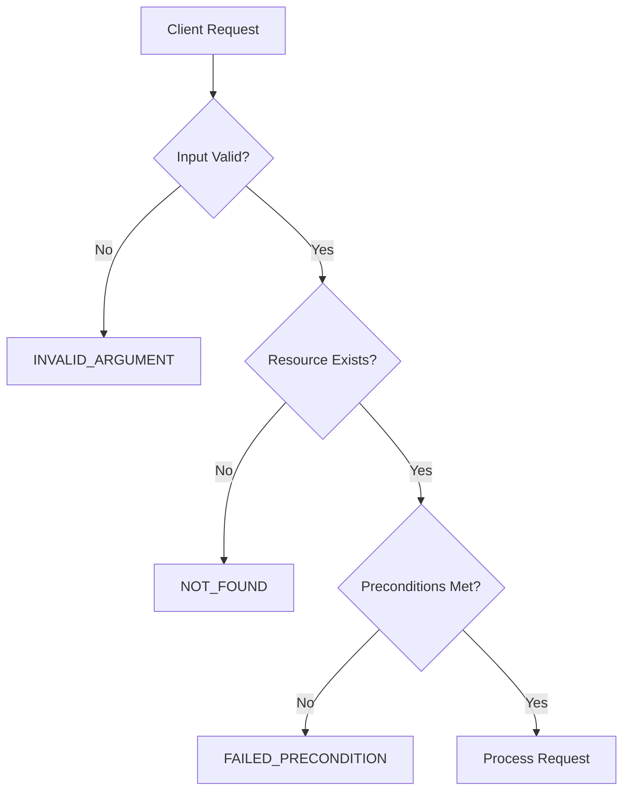
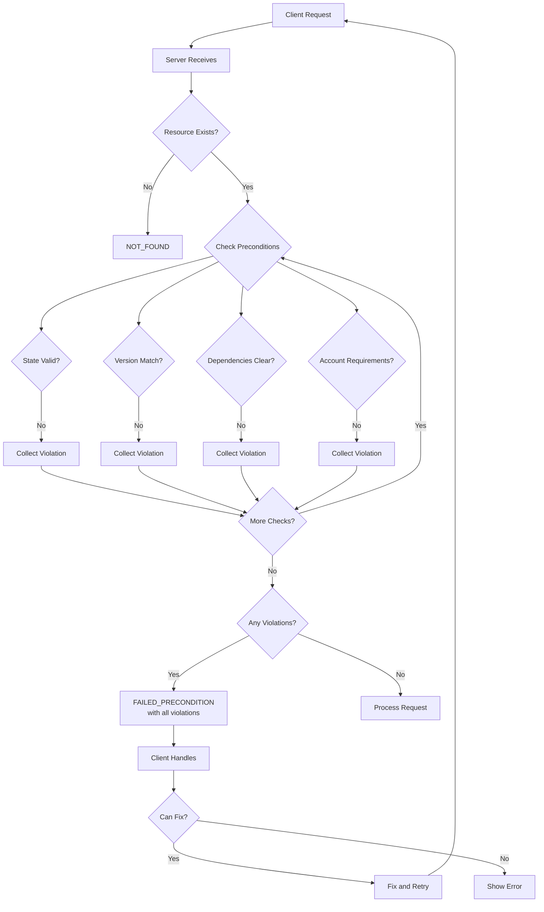

# How to Fix 'Failed Precondition' Errors in gRPC

Author: [nawazdhandala](https://www.github.com/nawazdhandala)

Tags: gRPC, failed precondition, error handling, state management, concurrency, optimistic locking, microservices

Description: A comprehensive guide to understanding and handling FAILED_PRECONDITION errors in gRPC, including state validation patterns, optimistic locking, and recovery strategies.

---

The FAILED_PRECONDITION status code (code 9) in gRPC indicates that the system is not in the required state for an operation to proceed. Unlike INVALID_ARGUMENT which deals with input validation, FAILED_PRECONDITION relates to the current state of resources or the system itself. This guide covers how to properly use, handle, and prevent FAILED_PRECONDITION errors in your gRPC applications.

## Understanding FAILED_PRECONDITION

FAILED_PRECONDITION signals that the operation was rejected because the system is not in an appropriate state, not because the request itself is invalid.



### When to Use FAILED_PRECONDITION

| Scenario | Status Code | Reason |
|----------|-------------|--------|
| Delete non-empty directory | FAILED_PRECONDITION | Directory must be empty first |
| Optimistic locking conflict | FAILED_PRECONDITION or ABORTED | Resource was modified |
| Account not verified | FAILED_PRECONDITION | Account state requirement |
| Required setup not complete | FAILED_PRECONDITION | System state requirement |
| Invalid state transition | FAILED_PRECONDITION | Workflow state requirement |
| Resource not found | NOT_FOUND | Different error - resource does not exist |
| Invalid input format | INVALID_ARGUMENT | Different error - input problem |

### FAILED_PRECONDITION vs ABORTED

| FAILED_PRECONDITION | ABORTED |
|---------------------|---------|
| Should not retry without fixing | May retry after a backoff |
| State is fundamentally wrong | Transient conflict |
| Client needs to take action | System may resolve itself |
| Example: Account suspended | Example: Lock contention |

## Common FAILED_PRECONDITION Scenarios

### 1. State Machine Transitions

```go
// server/order_service.go
package server

import (
    "context"
    "fmt"
    "sync"

    "google.golang.org/genproto/googleapis/rpc/errdetails"
    "google.golang.org/grpc/codes"
    "google.golang.org/grpc/status"
    pb "myapp/proto"
)

type OrderState string

const (
    OrderPending    OrderState = "PENDING"
    OrderConfirmed  OrderState = "CONFIRMED"
    OrderShipped    OrderState = "SHIPPED"
    OrderDelivered  OrderState = "DELIVERED"
    OrderCancelled  OrderState = "CANCELLED"
)

// Valid state transitions
var validTransitions = map[OrderState][]OrderState{
    OrderPending:   {OrderConfirmed, OrderCancelled},
    OrderConfirmed: {OrderShipped, OrderCancelled},
    OrderShipped:   {OrderDelivered},
    OrderDelivered: {}, // Terminal state
    OrderCancelled: {}, // Terminal state
}

type OrderService struct {
    pb.UnimplementedOrderServiceServer
    orders map[string]*Order
    mu     sync.RWMutex
}

type Order struct {
    ID    string
    State OrderState
    Items []*pb.OrderItem
}

// UpdateOrderState demonstrates state transition validation
func (s *OrderService) UpdateOrderState(ctx context.Context, req *pb.UpdateOrderStateRequest) (*pb.Order, error) {
    s.mu.Lock()
    defer s.mu.Unlock()

    order, exists := s.orders[req.OrderId]
    if !exists {
        return nil, status.Errorf(codes.NotFound, "order %s not found", req.OrderId)
    }

    currentState := order.State
    newState := OrderState(req.NewState)

    // Check if transition is valid
    if !s.isValidTransition(currentState, newState) {
        return nil, s.createStateTransitionError(req.OrderId, currentState, newState)
    }

    // Additional precondition checks based on target state
    if err := s.checkStatePrerequisites(order, newState); err != nil {
        return nil, err
    }

    // Apply the transition
    order.State = newState

    return s.orderToProto(order), nil
}

func (s *OrderService) isValidTransition(from, to OrderState) bool {
    validTargets, exists := validTransitions[from]
    if !exists {
        return false
    }

    for _, target := range validTargets {
        if target == to {
            return true
        }
    }
    return false
}

func (s *OrderService) checkStatePrerequisites(order *Order, targetState OrderState) error {
    switch targetState {
    case OrderShipped:
        // Cannot ship if no items
        if len(order.Items) == 0 {
            return s.createPreconditionError(
                "ORDER_EMPTY",
                fmt.Sprintf("order/%s", order.ID),
                "Cannot ship an order with no items",
            )
        }

    case OrderConfirmed:
        // Payment must be verified (simplified check)
        if !s.isPaymentVerified(order.ID) {
            return s.createPreconditionError(
                "PAYMENT_NOT_VERIFIED",
                fmt.Sprintf("order/%s/payment", order.ID),
                "Payment must be verified before confirming order",
            )
        }
    }

    return nil
}

func (s *OrderService) createStateTransitionError(orderID string, from, to OrderState) error {
    st := status.New(codes.FailedPrecondition,
        fmt.Sprintf("invalid state transition from %s to %s", from, to))

    validTargets := validTransitions[from]
    validTargetStrs := make([]string, len(validTargets))
    for i, t := range validTargets {
        validTargetStrs[i] = string(t)
    }

    pf := &errdetails.PreconditionFailure{
        Violations: []*errdetails.PreconditionFailure_Violation{
            {
                Type:    "STATE_TRANSITION",
                Subject: fmt.Sprintf("order/%s", orderID),
                Description: fmt.Sprintf(
                    "Cannot transition from %s to %s. Valid transitions from %s: %v",
                    from, to, from, validTargetStrs),
            },
        },
    }

    st, _ = st.WithDetails(pf)
    return st.Err()
}

func (s *OrderService) createPreconditionError(violationType, subject, description string) error {
    st := status.New(codes.FailedPrecondition, description)

    pf := &errdetails.PreconditionFailure{
        Violations: []*errdetails.PreconditionFailure_Violation{
            {
                Type:        violationType,
                Subject:     subject,
                Description: description,
            },
        },
    }

    st, _ = st.WithDetails(pf)
    return st.Err()
}
```

### 2. Optimistic Locking with ETags

```go
// server/document_service.go
package server

import (
    "context"
    "crypto/sha256"
    "encoding/hex"
    "fmt"
    "sync"
    "time"

    "google.golang.org/genproto/googleapis/rpc/errdetails"
    "google.golang.org/grpc/codes"
    "google.golang.org/grpc/status"
    pb "myapp/proto"
)

type DocumentService struct {
    pb.UnimplementedDocumentServiceServer
    documents map[string]*Document
    mu        sync.RWMutex
}

type Document struct {
    ID        string
    Content   string
    ETag      string
    Version   int64
    UpdatedAt time.Time
    UpdatedBy string
}

func (d *Document) calculateETag() string {
    hash := sha256.Sum256([]byte(fmt.Sprintf("%s:%d:%s", d.ID, d.Version, d.Content)))
    return hex.EncodeToString(hash[:8])
}

// UpdateDocument demonstrates optimistic locking
func (s *DocumentService) UpdateDocument(ctx context.Context, req *pb.UpdateDocumentRequest) (*pb.Document, error) {
    s.mu.Lock()
    defer s.mu.Unlock()

    doc, exists := s.documents[req.DocumentId]
    if !exists {
        return nil, status.Errorf(codes.NotFound, "document %s not found", req.DocumentId)
    }

    // Check ETag for optimistic locking
    if req.ExpectedEtag != "" && req.ExpectedEtag != doc.ETag {
        return nil, s.createETagMismatchError(req.DocumentId, req.ExpectedEtag, doc.ETag, doc.UpdatedBy, doc.UpdatedAt)
    }

    // Check version for version-based locking
    if req.ExpectedVersion != 0 && req.ExpectedVersion != doc.Version {
        return nil, s.createVersionMismatchError(req.DocumentId, req.ExpectedVersion, doc.Version)
    }

    // Apply update
    doc.Content = req.Content
    doc.Version++
    doc.UpdatedAt = time.Now()
    doc.UpdatedBy = req.UserId
    doc.ETag = doc.calculateETag()

    return &pb.Document{
        Id:        doc.ID,
        Content:   doc.Content,
        Etag:      doc.ETag,
        Version:   doc.Version,
        UpdatedAt: timestamppb.New(doc.UpdatedAt),
    }, nil
}

func (s *DocumentService) createETagMismatchError(docID, expected, actual, lastUpdatedBy string, lastUpdatedAt time.Time) error {
    st := status.New(codes.FailedPrecondition,
        "document was modified since last read")

    pf := &errdetails.PreconditionFailure{
        Violations: []*errdetails.PreconditionFailure_Violation{
            {
                Type:    "ETAG_MISMATCH",
                Subject: fmt.Sprintf("document/%s", docID),
                Description: fmt.Sprintf(
                    "Expected ETag %s but current ETag is %s. Document was last updated by %s at %s",
                    expected, actual, lastUpdatedBy, lastUpdatedAt.Format(time.RFC3339)),
            },
        },
    }

    errorInfo := &errdetails.ErrorInfo{
        Reason: "CONCURRENT_MODIFICATION",
        Domain: "myapp.example.com",
        Metadata: map[string]string{
            "document_id":      docID,
            "expected_etag":    expected,
            "current_etag":     actual,
            "last_updated_by":  lastUpdatedBy,
            "last_updated_at":  lastUpdatedAt.Format(time.RFC3339),
        },
    }

    st, _ = st.WithDetails(pf, errorInfo)
    return st.Err()
}

func (s *DocumentService) createVersionMismatchError(docID string, expected, actual int64) error {
    st := status.New(codes.FailedPrecondition,
        fmt.Sprintf("version mismatch: expected %d, current is %d", expected, actual))

    pf := &errdetails.PreconditionFailure{
        Violations: []*errdetails.PreconditionFailure_Violation{
            {
                Type:    "VERSION_MISMATCH",
                Subject: fmt.Sprintf("document/%s/version", docID),
                Description: fmt.Sprintf(
                    "Expected version %d but current version is %d. Please fetch the latest version and retry.",
                    expected, actual),
            },
        },
    }

    st, _ = st.WithDetails(pf)
    return st.Err()
}
```

### 3. Resource Dependencies

```go
// server/resource_service.go
package server

import (
    "context"
    "fmt"

    "google.golang.org/genproto/googleapis/rpc/errdetails"
    "google.golang.org/grpc/codes"
    "google.golang.org/grpc/status"
    pb "myapp/proto"
)

type ResourceService struct {
    pb.UnimplementedResourceServiceServer
    resources map[string]*Resource
}

type Resource struct {
    ID          string
    Type        string
    DependsOn   []string // IDs of resources this depends on
    DependedBy  []string // IDs of resources that depend on this
    Status      string
}

// DeleteResource demonstrates dependency checking
func (s *ResourceService) DeleteResource(ctx context.Context, req *pb.DeleteResourceRequest) (*pb.Empty, error) {
    resource, exists := s.resources[req.ResourceId]
    if !exists {
        return nil, status.Errorf(codes.NotFound, "resource %s not found", req.ResourceId)
    }

    // Check for dependent resources
    if len(resource.DependedBy) > 0 {
        return nil, s.createDependencyError(req.ResourceId, resource.DependedBy)
    }

    // Check resource state
    if resource.Status == "ACTIVE" {
        return nil, s.createStateError(req.ResourceId, resource.Status, []string{"STOPPED", "TERMINATED"})
    }

    // Safe to delete
    delete(s.resources, req.ResourceId)

    // Remove from dependencies of other resources
    for _, depID := range resource.DependsOn {
        if dep, exists := s.resources[depID]; exists {
            dep.DependedBy = removeFromSlice(dep.DependedBy, req.ResourceId)
        }
    }

    return &pb.Empty{}, nil
}

func (s *ResourceService) createDependencyError(resourceID string, dependents []string) error {
    st := status.New(codes.FailedPrecondition,
        fmt.Sprintf("cannot delete resource %s: %d resources depend on it", resourceID, len(dependents)))

    violations := make([]*errdetails.PreconditionFailure_Violation, len(dependents))
    for i, depID := range dependents {
        violations[i] = &errdetails.PreconditionFailure_Violation{
            Type:        "RESOURCE_DEPENDENCY",
            Subject:     fmt.Sprintf("resource/%s", depID),
            Description: fmt.Sprintf("Resource %s depends on %s", depID, resourceID),
        }
    }

    pf := &errdetails.PreconditionFailure{
        Violations: violations,
    }

    help := &errdetails.Help{
        Links: []*errdetails.Help_Link{
            {
                Description: "How to delete resources with dependencies",
                Url:         "https://docs.example.com/resource-management#delete-cascade",
            },
        },
    }

    st, _ = st.WithDetails(pf, help)
    return st.Err()
}

func (s *ResourceService) createStateError(resourceID, currentState string, validStates []string) error {
    st := status.New(codes.FailedPrecondition,
        fmt.Sprintf("resource %s is in %s state, must be one of %v", resourceID, currentState, validStates))

    pf := &errdetails.PreconditionFailure{
        Violations: []*errdetails.PreconditionFailure_Violation{
            {
                Type:    "INVALID_STATE",
                Subject: fmt.Sprintf("resource/%s/status", resourceID),
                Description: fmt.Sprintf(
                    "Resource must be in one of these states: %v. Current state: %s",
                    validStates, currentState),
            },
        },
    }

    st, _ = st.WithDetails(pf)
    return st.Err()
}
```

### 4. Account/User Preconditions

```go
// server/account_service.go
package server

import (
    "context"
    "fmt"
    "time"

    "google.golang.org/genproto/googleapis/rpc/errdetails"
    "google.golang.org/grpc/codes"
    "google.golang.org/grpc/status"
    pb "myapp/proto"
)

type AccountService struct {
    pb.UnimplementedAccountServiceServer
    accounts map[string]*Account
}

type Account struct {
    ID               string
    Email            string
    EmailVerified    bool
    MFAEnabled       bool
    Status           string // "ACTIVE", "SUSPENDED", "PENDING_VERIFICATION"
    SubscriptionTier string
    Balance          float64
    CreatedAt        time.Time
}

// PerformSensitiveOperation demonstrates multiple precondition checks
func (s *AccountService) PerformSensitiveOperation(ctx context.Context, req *pb.SensitiveOperationRequest) (*pb.OperationResponse, error) {
    account, exists := s.accounts[req.AccountId]
    if !exists {
        return nil, status.Errorf(codes.NotFound, "account %s not found", req.AccountId)
    }

    // Collect all precondition failures
    var violations []*errdetails.PreconditionFailure_Violation

    // Check email verification
    if !account.EmailVerified {
        violations = append(violations, &errdetails.PreconditionFailure_Violation{
            Type:        "EMAIL_NOT_VERIFIED",
            Subject:     fmt.Sprintf("account/%s/email", req.AccountId),
            Description: "Email address must be verified before performing this operation",
        })
    }

    // Check MFA requirement
    if !account.MFAEnabled {
        violations = append(violations, &errdetails.PreconditionFailure_Violation{
            Type:        "MFA_NOT_ENABLED",
            Subject:     fmt.Sprintf("account/%s/mfa", req.AccountId),
            Description: "Multi-factor authentication must be enabled for this operation",
        })
    }

    // Check account status
    if account.Status != "ACTIVE" {
        violations = append(violations, &errdetails.PreconditionFailure_Violation{
            Type:        "ACCOUNT_NOT_ACTIVE",
            Subject:     fmt.Sprintf("account/%s/status", req.AccountId),
            Description: fmt.Sprintf("Account must be active. Current status: %s", account.Status),
        })
    }

    // Check subscription tier
    if account.SubscriptionTier == "FREE" && req.RequiresPremium {
        violations = append(violations, &errdetails.PreconditionFailure_Violation{
            Type:        "INSUFFICIENT_SUBSCRIPTION",
            Subject:     fmt.Sprintf("account/%s/subscription", req.AccountId),
            Description: "This operation requires a premium subscription",
        })
    }

    // Check balance for paid operations
    if req.Cost > 0 && account.Balance < req.Cost {
        violations = append(violations, &errdetails.PreconditionFailure_Violation{
            Type:        "INSUFFICIENT_BALANCE",
            Subject:     fmt.Sprintf("account/%s/balance", req.AccountId),
            Description: fmt.Sprintf("Insufficient balance. Required: %.2f, Available: %.2f", req.Cost, account.Balance),
        })
    }

    // Return all violations if any
    if len(violations) > 0 {
        return nil, s.createMultiplePreconditionError(violations)
    }

    // Perform the operation
    return &pb.OperationResponse{
        Success: true,
        Message: "Operation completed successfully",
    }, nil
}

func (s *AccountService) createMultiplePreconditionError(violations []*errdetails.PreconditionFailure_Violation) error {
    st := status.New(codes.FailedPrecondition,
        fmt.Sprintf("operation blocked: %d preconditions not met", len(violations)))

    pf := &errdetails.PreconditionFailure{
        Violations: violations,
    }

    help := &errdetails.Help{
        Links: []*errdetails.Help_Link{
            {
                Description: "Verify your email address",
                Url:         "https://example.com/account/verify-email",
            },
            {
                Description: "Enable MFA",
                Url:         "https://example.com/account/security/mfa",
            },
            {
                Description: "Upgrade your subscription",
                Url:         "https://example.com/pricing",
            },
        },
    }

    st, _ = st.WithDetails(pf, help)
    return st.Err()
}
```

## Client-Side Handling

### Extracting Precondition Details

```go
// client/precondition_handler.go
package client

import (
    "fmt"
    "log"

    "google.golang.org/genproto/googleapis/rpc/errdetails"
    "google.golang.org/grpc/codes"
    "google.golang.org/grpc/status"
)

type PreconditionViolation struct {
    Type        string
    Subject     string
    Description string
}

type PreconditionError struct {
    Message    string
    Violations []PreconditionViolation
    HelpLinks  []HelpLink
}

type HelpLink struct {
    Description string
    URL         string
}

// ParsePreconditionError extracts details from FAILED_PRECONDITION errors
func ParsePreconditionError(err error) (*PreconditionError, bool) {
    st, ok := status.FromError(err)
    if !ok || st.Code() != codes.FailedPrecondition {
        return nil, false
    }

    result := &PreconditionError{
        Message: st.Message(),
    }

    for _, detail := range st.Details() {
        switch d := detail.(type) {
        case *errdetails.PreconditionFailure:
            for _, v := range d.Violations {
                result.Violations = append(result.Violations, PreconditionViolation{
                    Type:        v.Type,
                    Subject:     v.Subject,
                    Description: v.Description,
                })
            }

        case *errdetails.Help:
            for _, link := range d.Links {
                result.HelpLinks = append(result.HelpLinks, HelpLink{
                    Description: link.Description,
                    URL:         link.Url,
                })
            }
        }
    }

    return result, true
}

// HandlePreconditionError provides user-friendly handling
func HandlePreconditionError(err error) error {
    precondErr, isPrecondition := ParsePreconditionError(err)
    if !isPrecondition {
        return err
    }

    log.Printf("Precondition failed: %s", precondErr.Message)

    for _, v := range precondErr.Violations {
        log.Printf("  [%s] %s: %s", v.Type, v.Subject, v.Description)

        // Take action based on violation type
        switch v.Type {
        case "EMAIL_NOT_VERIFIED":
            log.Println("  -> Action: Send verification email")
        case "MFA_NOT_ENABLED":
            log.Println("  -> Action: Prompt user to enable MFA")
        case "ETAG_MISMATCH":
            log.Println("  -> Action: Refetch resource and retry")
        case "STATE_TRANSITION":
            log.Println("  -> Action: Show current state to user")
        case "RESOURCE_DEPENDENCY":
            log.Println("  -> Action: Show dependent resources")
        }
    }

    if len(precondErr.HelpLinks) > 0 {
        log.Println("  Help resources:")
        for _, link := range precondErr.HelpLinks {
            log.Printf("    - %s: %s", link.Description, link.URL)
        }
    }

    return err
}
```

### Optimistic Locking Retry Pattern

```go
// client/optimistic_retry.go
package client

import (
    "context"
    "log"

    "google.golang.org/grpc/codes"
    "google.golang.org/grpc/status"
    pb "myapp/proto"
)

type DocumentClient struct {
    client pb.DocumentServiceClient
}

// UpdateWithRetry implements optimistic locking with automatic retry
func (c *DocumentClient) UpdateWithRetry(ctx context.Context, docID string, updateFn func(string) string, maxRetries int) (*pb.Document, error) {
    for attempt := 0; attempt <= maxRetries; attempt++ {
        // Fetch current document
        doc, err := c.client.GetDocument(ctx, &pb.GetDocumentRequest{
            DocumentId: docID,
        })
        if err != nil {
            return nil, err
        }

        // Apply update function to get new content
        newContent := updateFn(doc.Content)

        // Attempt update with ETag
        updatedDoc, err := c.client.UpdateDocument(ctx, &pb.UpdateDocumentRequest{
            DocumentId:   docID,
            Content:      newContent,
            ExpectedEtag: doc.Etag,
        })

        if err == nil {
            return updatedDoc, nil
        }

        // Check if it is a precondition failure (ETag mismatch)
        st, ok := status.FromError(err)
        if !ok || st.Code() != codes.FailedPrecondition {
            return nil, err // Non-retryable error
        }

        // Check for ETAG_MISMATCH specifically
        isETagMismatch := false
        for _, detail := range st.Details() {
            if pf, ok := detail.(*errdetails.PreconditionFailure); ok {
                for _, v := range pf.Violations {
                    if v.Type == "ETAG_MISMATCH" {
                        isETagMismatch = true
                        break
                    }
                }
            }
        }

        if !isETagMismatch {
            return nil, err // Different precondition failure
        }

        if attempt < maxRetries {
            log.Printf("ETag mismatch, retrying (%d/%d)", attempt+1, maxRetries)
        }
    }

    return nil, status.Error(codes.Aborted, "max retries exceeded for optimistic locking")
}
```

## Precondition Check Flow



## Best Practices

1. **Be specific about what failed**: Include detailed violation information
2. **Return all violations**: Do not stop at the first failure
3. **Provide actionable guidance**: Include help links when possible
4. **Use appropriate types**: Define clear violation types
5. **Distinguish from other errors**: FAILED_PRECONDITION is about system state
6. **Include metadata**: Add ErrorInfo with machine-readable details
7. **Handle optimistically**: For ETags, implement automatic retry
8. **Document preconditions**: Make them part of your API contract
9. **Validate early**: Check preconditions before expensive operations
10. **Log violations**: Track patterns for potential UX improvements

## Conclusion

FAILED_PRECONDITION errors in gRPC indicate that the system is not in the required state for an operation. By properly implementing precondition checks, providing detailed error information with PreconditionFailure details, and handling these errors gracefully on the client side, you can create robust APIs that guide users toward successful operations. Remember that unlike transient errors, FAILED_PRECONDITION typically requires the client to take specific action before retrying, so clear error messages and help links are essential for a good developer experience.
