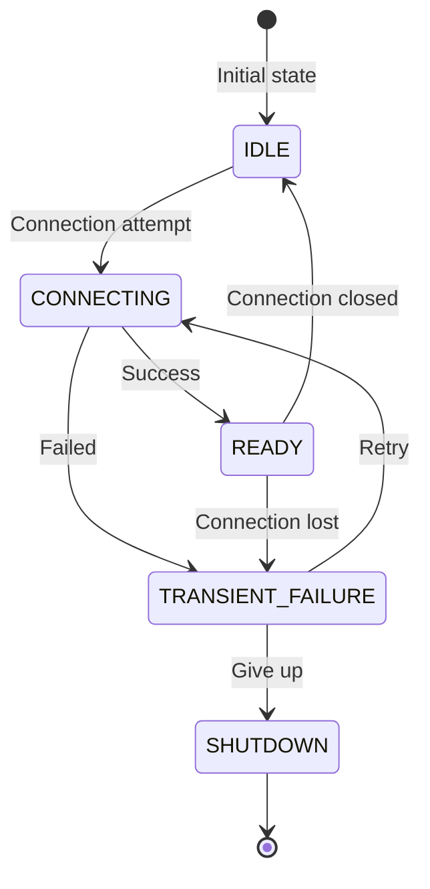
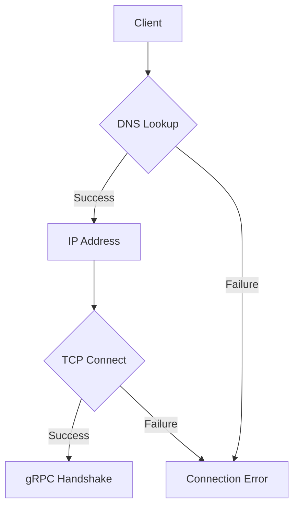
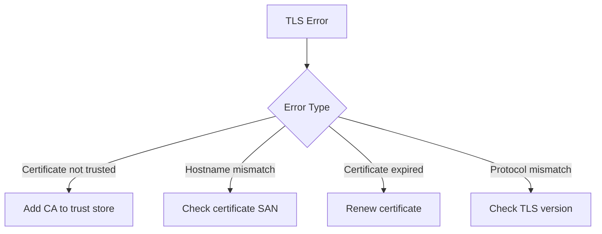
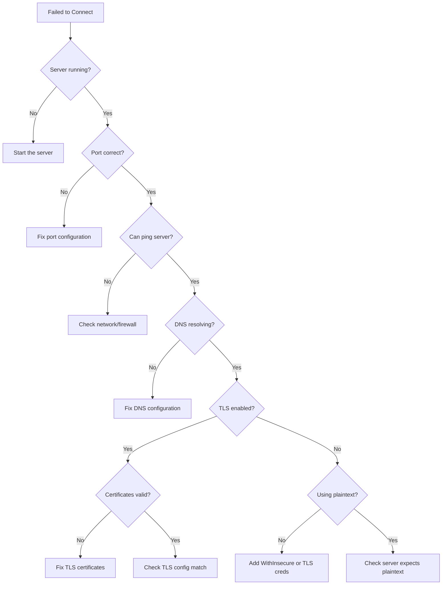

# How to Fix 'Failed to Connect' Errors in gRPC

Author: [nawazdhandala](https://www.github.com/nawazdhandala)

Tags: gRPC, Networking, Debugging, Connectivity, TLS, DNS, Kubernetes

Description: A practical guide to diagnosing and resolving connection failures in gRPC applications, covering network issues, DNS resolution, TLS configuration, load balancer problems, and Kubernetes-specific connectivity challenges.

---

Connection failures are among the most frustrating issues to debug in gRPC applications because they can stem from many different sources including network configuration, DNS resolution, TLS certificates, load balancers, or service discovery. This guide provides a systematic approach to diagnosing and fixing "failed to connect" errors in gRPC.

## Understanding gRPC Connection States

gRPC connections go through several states during their lifecycle:



When you see "failed to connect" errors, the connection is stuck in CONNECTING or TRANSIENT_FAILURE states.

## Common Causes of Connection Failures

1. **Server not running** - The most basic cause
2. **Wrong address or port** - Misconfigured connection target
3. **DNS resolution failures** - Cannot resolve hostname
4. **Firewall blocking connections** - Network policies preventing access
5. **TLS certificate issues** - Certificate validation failures
6. **Load balancer misconfiguration** - Health checks failing or routing issues
7. **Resource exhaustion** - Too many connections or file descriptors

## Step-by-Step Debugging Guide

### Step 1: Verify the Server Is Running

First, confirm the gRPC server is actually running and listening:

```bash
# Check if process is running
ps aux | grep grpc-server

# Check if port is listening
netstat -tlnp | grep 50051
# Or on macOS
lsof -i :50051

# Test basic TCP connectivity
nc -zv localhost 50051
```

### Step 2: Test with grpcurl

Use grpcurl to test connectivity independent of your client code:

```bash
# Test without TLS
grpcurl -plaintext localhost:50051 list

# Test with TLS
grpcurl localhost:50051 list

# Test with specific certificate
grpcurl -cacert ca.crt localhost:50051 list

# Test with insecure TLS (skip verification - for debugging only)
grpcurl -insecure localhost:50051 list
```

If grpcurl works but your client does not, the problem is in your client configuration.

### Step 3: Enable Verbose Logging

Enable gRPC debug logging to see detailed connection information:

```go
// client/debug.go
package main

import (
    "os"

    "google.golang.org/grpc/grpclog"
)

func init() {
    // Enable verbose gRPC logging
    os.Setenv("GRPC_GO_LOG_VERBOSITY_LEVEL", "99")
    os.Setenv("GRPC_GO_LOG_SEVERITY_LEVEL", "info")

    // Or programmatically
    grpclog.SetLoggerV2(grpclog.NewLoggerV2WithVerbosity(
        os.Stderr, os.Stderr, os.Stderr, 99))
}
```

For other languages:

```bash
# Python
export GRPC_VERBOSITY=DEBUG
export GRPC_TRACE=all

# Java
-Djava.util.logging.config.file=logging.properties

# Node.js
GRPC_VERBOSITY=DEBUG GRPC_TRACE=all node app.js
```

## Fixing DNS Resolution Issues

DNS problems are common in containerized environments:



### Testing DNS Resolution

```bash
# Basic DNS lookup
nslookup grpc-server.default.svc.cluster.local

# Detailed DNS query
dig +short grpc-server.default.svc.cluster.local

# Test from within a Kubernetes pod
kubectl run -it --rm debug --image=busybox -- nslookup grpc-server
```

### Configuring Custom DNS Resolution

For environments with non-standard DNS, configure a custom resolver:

```go
// client/custom_resolver.go
package main

import (
    "context"
    "net"
    "time"

    "google.golang.org/grpc"
    "google.golang.org/grpc/resolver"
)

// CustomResolver implements a manual resolver for testing
type CustomResolver struct {
    target resolver.Target
    cc     resolver.ClientConn
    addrs  []resolver.Address
}

func (r *CustomResolver) start() {
    r.cc.UpdateState(resolver.State{Addresses: r.addrs})
}

func (r *CustomResolver) ResolveNow(o resolver.ResolveNowOptions) {}

func (r *CustomResolver) Close() {}

// CustomResolverBuilder builds custom resolvers
type CustomResolverBuilder struct {
    addresses []string
}

func (b *CustomResolverBuilder) Build(target resolver.Target, cc resolver.ClientConn, opts resolver.BuildOptions) (resolver.Resolver, error) {
    addrs := make([]resolver.Address, len(b.addresses))
    for i, addr := range b.addresses {
        addrs[i] = resolver.Address{Addr: addr}
    }

    r := &CustomResolver{
        target: target,
        cc:     cc,
        addrs:  addrs,
    }
    r.start()
    return r, nil
}

func (b *CustomResolverBuilder) Scheme() string {
    return "custom"
}

// Usage example
func connectWithCustomResolver() (*grpc.ClientConn, error) {
    // Register custom resolver
    resolver.Register(&CustomResolverBuilder{
        addresses: []string{
            "10.0.0.1:50051",
            "10.0.0.2:50051",
            "10.0.0.3:50051",
        },
    })

    // Connect using custom scheme
    return grpc.Dial("custom:///grpc-service",
        grpc.WithInsecure(),
        grpc.WithBlock(),
        grpc.WithTimeout(5*time.Second),
    )
}
```

## Fixing TLS Connection Issues

TLS misconfigurations are a common cause of connection failures:

### Common TLS Errors and Solutions



### Configuring TLS Properly

```go
// client/tls_client.go
package main

import (
    "crypto/tls"
    "crypto/x509"
    "fmt"
    "io/ioutil"
    "time"

    "google.golang.org/grpc"
    "google.golang.org/grpc/credentials"
)

// SecureConnection creates a gRPC connection with proper TLS
func SecureConnection(address string, caCertPath string) (*grpc.ClientConn, error) {
    // Load CA certificate
    caCert, err := ioutil.ReadFile(caCertPath)
    if err != nil {
        return nil, fmt.Errorf("failed to read CA certificate: %w", err)
    }

    certPool := x509.NewCertPool()
    if !certPool.AppendCertsFromPEM(caCert) {
        return nil, fmt.Errorf("failed to add CA certificate to pool")
    }

    // Create TLS config
    tlsConfig := &tls.Config{
        RootCAs:    certPool,
        MinVersion: tls.VersionTLS12,
    }

    creds := credentials.NewTLS(tlsConfig)

    return grpc.Dial(address,
        grpc.WithTransportCredentials(creds),
        grpc.WithBlock(),
        grpc.WithTimeout(10*time.Second),
    )
}

// SecureConnectionWithClientCert creates a connection with mTLS
func SecureConnectionWithClientCert(
    address string,
    caCertPath string,
    clientCertPath string,
    clientKeyPath string,
) (*grpc.ClientConn, error) {
    // Load CA certificate
    caCert, err := ioutil.ReadFile(caCertPath)
    if err != nil {
        return nil, fmt.Errorf("failed to read CA certificate: %w", err)
    }

    certPool := x509.NewCertPool()
    if !certPool.AppendCertsFromPEM(caCert) {
        return nil, fmt.Errorf("failed to add CA certificate to pool")
    }

    // Load client certificate
    clientCert, err := tls.LoadX509KeyPair(clientCertPath, clientKeyPath)
    if err != nil {
        return nil, fmt.Errorf("failed to load client certificate: %w", err)
    }

    // Create TLS config with client certificate
    tlsConfig := &tls.Config{
        RootCAs:      certPool,
        Certificates: []tls.Certificate{clientCert},
        MinVersion:   tls.VersionTLS12,
    }

    creds := credentials.NewTLS(tlsConfig)

    return grpc.Dial(address,
        grpc.WithTransportCredentials(creds),
        grpc.WithBlock(),
        grpc.WithTimeout(10*time.Second),
    )
}
```

### Debugging Certificate Issues

```bash
# View certificate details
openssl s_client -connect localhost:50051 -servername localhost

# Check certificate expiration
openssl s_client -connect localhost:50051 2>/dev/null | openssl x509 -noout -dates

# Verify certificate chain
openssl verify -CAfile ca.crt server.crt

# Check certificate SAN (Subject Alternative Names)
openssl x509 -in server.crt -noout -text | grep -A1 "Subject Alternative Name"
```

## Fixing Connection Timeouts

### Configuring Timeouts Properly

```go
// client/timeout_config.go
package main

import (
    "context"
    "time"

    "google.golang.org/grpc"
    "google.golang.org/grpc/keepalive"
)

// CreateConnectionWithTimeouts creates a connection with proper timeout settings
func CreateConnectionWithTimeouts(address string) (*grpc.ClientConn, error) {
    // Connection-level timeout
    ctx, cancel := context.WithTimeout(context.Background(), 10*time.Second)
    defer cancel()

    // Keepalive parameters to detect dead connections
    kaParams := keepalive.ClientParameters{
        Time:                10 * time.Second, // Send pings every 10 seconds if no activity
        Timeout:             3 * time.Second,  // Wait 3 seconds for ping ack
        PermitWithoutStream: true,             // Send pings even without active streams
    }

    return grpc.DialContext(ctx, address,
        grpc.WithInsecure(),
        grpc.WithBlock(),
        grpc.WithKeepaliveParams(kaParams),
        grpc.WithConnectParams(grpc.ConnectParams{
            Backoff: grpc.BackoffConfig{
                BaseDelay:  1 * time.Second,
                Multiplier: 1.6,
                MaxDelay:   30 * time.Second,
            },
            MinConnectTimeout: 5 * time.Second,
        }),
    )
}
```

### Request-Level Timeouts

```go
// client/request_timeout.go
package main

import (
    "context"
    "time"

    pb "myapp/proto/user"
)

func GetUserWithTimeout(client pb.UserServiceClient, userID string) (*pb.User, error) {
    // Create context with deadline
    ctx, cancel := context.WithTimeout(context.Background(), 5*time.Second)
    defer cancel()

    resp, err := client.GetUser(ctx, &pb.GetUserRequest{
        UserId: userID,
    })

    if err != nil {
        // Check if it was a timeout
        if ctx.Err() == context.DeadlineExceeded {
            return nil, fmt.Errorf("request timed out after 5 seconds")
        }
        return nil, err
    }

    return resp, nil
}
```

## Kubernetes-Specific Connection Issues

### Service Discovery Problems

```yaml
# kubernetes/grpc-service.yaml
apiVersion: v1
kind: Service
metadata:
  name: grpc-server
  labels:
    app: grpc-server
spec:
  type: ClusterIP
  ports:
    - port: 50051
      targetPort: 50051
      protocol: TCP
      name: grpc  # Important for gRPC
  selector:
    app: grpc-server
---
# For headless service (required for proper gRPC load balancing)
apiVersion: v1
kind: Service
metadata:
  name: grpc-server-headless
spec:
  clusterIP: None  # Headless service
  ports:
    - port: 50051
      targetPort: 50051
      name: grpc
  selector:
    app: grpc-server
```

### Client-Side Load Balancing in Kubernetes

```go
// client/k8s_client.go
package main

import (
    "fmt"
    "time"

    "google.golang.org/grpc"
    "google.golang.org/grpc/balancer/roundrobin"
)

// ConnectToKubernetesService connects to a gRPC service in Kubernetes
func ConnectToKubernetesService(serviceName, namespace string) (*grpc.ClientConn, error) {
    // Use dns:/// scheme for DNS-based load balancing
    // This works with headless services
    target := fmt.Sprintf("dns:///%s.%s.svc.cluster.local:50051", serviceName, namespace)

    return grpc.Dial(target,
        grpc.WithInsecure(),
        grpc.WithDefaultServiceConfig(`{"loadBalancingConfig": [{"round_robin":{}}]}`),
        grpc.WithBlock(),
        grpc.WithTimeout(10*time.Second),
    )
}
```

### Debugging Kubernetes Connectivity

```bash
# Check if pods are running
kubectl get pods -l app=grpc-server

# Check service endpoints
kubectl get endpoints grpc-server

# Test connectivity from another pod
kubectl run -it --rm grpc-test --image=fullstorydev/grpcurl -- \
    -plaintext grpc-server:50051 list

# Check DNS resolution inside cluster
kubectl run -it --rm dns-test --image=busybox -- \
    nslookup grpc-server.default.svc.cluster.local

# View pod logs for errors
kubectl logs -l app=grpc-server --tail=100
```

## Implementing Connection Retry Logic

```go
// client/retry.go
package main

import (
    "context"
    "fmt"
    "log"
    "time"

    "google.golang.org/grpc"
    "google.golang.org/grpc/codes"
    "google.golang.org/grpc/status"
)

// RetryConfig holds retry configuration
type RetryConfig struct {
    MaxRetries     int
    InitialBackoff time.Duration
    MaxBackoff     time.Duration
    BackoffFactor  float64
}

// DefaultRetryConfig returns sensible defaults
func DefaultRetryConfig() RetryConfig {
    return RetryConfig{
        MaxRetries:     5,
        InitialBackoff: 100 * time.Millisecond,
        MaxBackoff:     10 * time.Second,
        BackoffFactor:  2.0,
    }
}

// ConnectWithRetry attempts to connect with exponential backoff
func ConnectWithRetry(address string, config RetryConfig) (*grpc.ClientConn, error) {
    var conn *grpc.ClientConn
    var err error

    backoff := config.InitialBackoff

    for attempt := 0; attempt <= config.MaxRetries; attempt++ {
        if attempt > 0 {
            log.Printf("Connection attempt %d failed, retrying in %v...", attempt, backoff)
            time.Sleep(backoff)

            // Increase backoff for next attempt
            backoff = time.Duration(float64(backoff) * config.BackoffFactor)
            if backoff > config.MaxBackoff {
                backoff = config.MaxBackoff
            }
        }

        ctx, cancel := context.WithTimeout(context.Background(), 5*time.Second)
        conn, err = grpc.DialContext(ctx, address,
            grpc.WithInsecure(),
            grpc.WithBlock(),
        )
        cancel()

        if err == nil {
            log.Printf("Successfully connected on attempt %d", attempt+1)
            return conn, nil
        }

        log.Printf("Connection attempt %d failed: %v", attempt+1, err)
    }

    return nil, fmt.Errorf("failed to connect after %d attempts: %w", config.MaxRetries+1, err)
}

// RetryableCall wraps a gRPC call with retry logic
func RetryableCall[T any](
    ctx context.Context,
    config RetryConfig,
    call func(context.Context) (T, error),
) (T, error) {
    var result T
    var err error

    backoff := config.InitialBackoff

    for attempt := 0; attempt <= config.MaxRetries; attempt++ {
        if attempt > 0 {
            time.Sleep(backoff)
            backoff = time.Duration(float64(backoff) * config.BackoffFactor)
            if backoff > config.MaxBackoff {
                backoff = config.MaxBackoff
            }
        }

        result, err = call(ctx)
        if err == nil {
            return result, nil
        }

        // Check if error is retryable
        st, ok := status.FromError(err)
        if !ok || !isRetryable(st.Code()) {
            return result, err
        }

        log.Printf("Retryable error on attempt %d: %v", attempt+1, err)
    }

    return result, err
}

func isRetryable(code codes.Code) bool {
    switch code {
    case codes.Unavailable, codes.DeadlineExceeded, codes.ResourceExhausted:
        return true
    default:
        return false
    }
}
```

## Connection Debugging Checklist

When encountering "failed to connect" errors, work through this checklist:



### Quick Debug Commands Summary

```bash
# 1. Check server is listening
netstat -tlnp | grep 50051

# 2. Test TCP connectivity
nc -zv server-address 50051

# 3. Test DNS resolution
nslookup server-address

# 4. Test gRPC connectivity
grpcurl -plaintext server-address:50051 list

# 5. Test with TLS
grpcurl -cacert ca.crt server-address:50051 list

# 6. Check certificate
openssl s_client -connect server-address:50051

# 7. Kubernetes: Check endpoints
kubectl get endpoints grpc-service

# 8. Kubernetes: Test from pod
kubectl run -it --rm debug --image=busybox -- nc -zv grpc-service 50051
```

## Conclusion

Connection failures in gRPC can be challenging to debug due to the many potential causes. By following a systematic approach, starting with basic connectivity checks and progressing through DNS, TLS, and application-level configuration, you can efficiently identify and resolve connection issues. Remember to enable verbose logging during debugging, use tools like grpcurl for independent testing, and implement proper retry logic with exponential backoff in production applications. For Kubernetes deployments, pay special attention to service configuration and use headless services for proper client-side load balancing.
