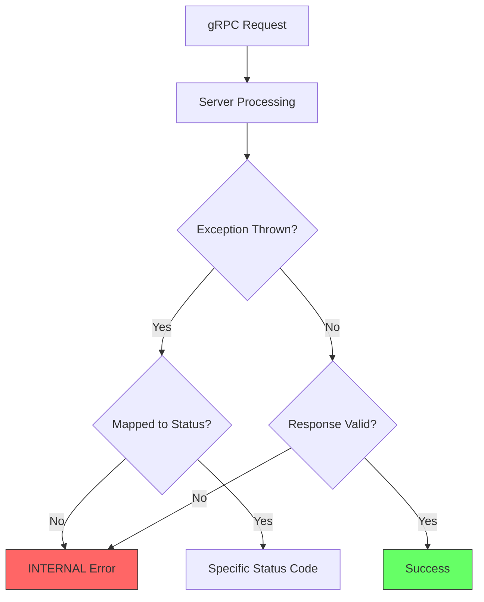
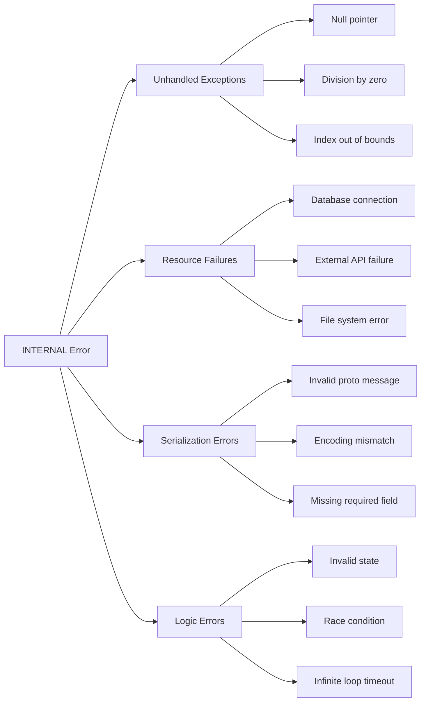

# How to Fix 'Internal' Status Errors in gRPC

Author: [nawazdhandala](https://www.github.com/nawazdhandala)

Tags: gRPC, Internal Error, Debugging, Error Handling, Status Codes, Troubleshooting, Observability

Description: A practical guide to diagnosing and fixing 'Internal' status errors in gRPC services, covering common causes, debugging techniques, and best practices for error handling.

---

> The INTERNAL status code in gRPC indicates an unexpected error occurred on the server. This catch-all error can be frustrating to debug because it provides little information about the root cause. This guide covers systematic approaches to identify and fix internal errors.

Internal errors are the gRPC equivalent of HTTP 500 errors. They indicate something went wrong on the server, but the specific cause could be anything from null pointer exceptions to database connection failures.

---

## Understanding Internal Errors



---

## Common Causes of Internal Errors



---

## Debugging Internal Errors

### Enable Detailed Server Logging

```python
import grpc
import logging
import traceback
from concurrent import futures

# Configure detailed logging
logging.basicConfig(
    level=logging.DEBUG,
    format='%(asctime)s - %(name)s - %(levelname)s - %(message)s'
)
logger = logging.getLogger(__name__)

class LoggingInterceptor(grpc.ServerInterceptor):
    """Interceptor that logs all requests and errors"""

    def intercept_service(self, continuation, handler_call_details):
        method = handler_call_details.method
        logger.info(f"Request started: {method}")

        handler = continuation(handler_call_details)

        if handler is None:
            return handler

        # Wrap the handler to catch and log exceptions
        if handler.unary_unary:
            return self._wrap_unary_unary(handler, method)
        elif handler.unary_stream:
            return self._wrap_unary_stream(handler, method)

        return handler

    def _wrap_unary_unary(self, handler, method):
        original_handler = handler.unary_unary

        def wrapped_handler(request, context):
            try:
                response = original_handler(request, context)
                logger.info(f"Request completed: {method}")
                return response
            except Exception as e:
                # Log the full stack trace
                logger.error(
                    f"Internal error in {method}: {str(e)}\n"
                    f"Traceback:\n{traceback.format_exc()}"
                )
                # Re-raise to let gRPC handle it
                raise

        return grpc.unary_unary_rpc_method_handler(
            wrapped_handler,
            request_deserializer=handler.request_deserializer,
            response_serializer=handler.response_serializer
        )

# Usage
server = grpc.server(
    futures.ThreadPoolExecutor(max_workers=10),
    interceptors=[LoggingInterceptor()]
)
```

### Go Server Logging

```go
package main

import (
    "context"
    "log"
    "runtime/debug"

    "google.golang.org/grpc"
    "google.golang.org/grpc/codes"
    "google.golang.org/grpc/status"
)

// RecoveryInterceptor catches panics and logs them
func RecoveryInterceptor(
    ctx context.Context,
    req interface{},
    info *grpc.UnaryServerInfo,
    handler grpc.UnaryHandler,
) (resp interface{}, err error) {
    // Recover from panics
    defer func() {
        if r := recover(); r != nil {
            // Log the panic with stack trace
            log.Printf(
                "Panic recovered in %s: %v\nStack trace:\n%s",
                info.FullMethod,
                r,
                string(debug.Stack()),
            )
            // Return internal error
            err = status.Errorf(codes.Internal, "internal server error")
        }
    }()

    // Call the handler
    resp, err = handler(ctx, req)

    // Log errors
    if err != nil {
        st, _ := status.FromError(err)
        if st.Code() == codes.Internal {
            log.Printf(
                "Internal error in %s: %v",
                info.FullMethod,
                st.Message(),
            )
        }
    }

    return resp, err
}

// LoggingInterceptor logs all requests
func LoggingInterceptor(
    ctx context.Context,
    req interface{},
    info *grpc.UnaryServerInfo,
    handler grpc.UnaryHandler,
) (interface{}, error) {
    log.Printf("Request started: %s", info.FullMethod)

    resp, err := handler(ctx, req)

    if err != nil {
        st, _ := status.FromError(err)
        log.Printf("Request failed: %s - %s: %s",
            info.FullMethod, st.Code(), st.Message())
    } else {
        log.Printf("Request completed: %s", info.FullMethod)
    }

    return resp, err
}

// Usage
func main() {
    server := grpc.NewServer(
        grpc.ChainUnaryInterceptor(
            RecoveryInterceptor,
            LoggingInterceptor,
        ),
    )
    // Register services...
}
```

---

## Proper Error Handling

### Map Exceptions to Status Codes

```python
import grpc
from functools import wraps

class DatabaseConnectionError(Exception):
    pass

class ResourceNotFoundError(Exception):
    pass

class ValidationError(Exception):
    pass

class RateLimitExceededError(Exception):
    pass

# Map exception types to gRPC status codes
EXCEPTION_STATUS_MAP = {
    ValueError: grpc.StatusCode.INVALID_ARGUMENT,
    ValidationError: grpc.StatusCode.INVALID_ARGUMENT,
    ResourceNotFoundError: grpc.StatusCode.NOT_FOUND,
    PermissionError: grpc.StatusCode.PERMISSION_DENIED,
    DatabaseConnectionError: grpc.StatusCode.UNAVAILABLE,
    RateLimitExceededError: grpc.StatusCode.RESOURCE_EXHAUSTED,
    TimeoutError: grpc.StatusCode.DEADLINE_EXCEEDED,
    NotImplementedError: grpc.StatusCode.UNIMPLEMENTED,
}

def grpc_error_handler(func):
    """Decorator that converts exceptions to proper gRPC status codes"""
    @wraps(func)
    def wrapper(self, request, context):
        try:
            return func(self, request, context)
        except Exception as e:
            # Find matching status code
            status_code = grpc.StatusCode.INTERNAL  # Default
            for exc_type, code in EXCEPTION_STATUS_MAP.items():
                if isinstance(e, exc_type):
                    status_code = code
                    break

            # Log the error
            logger.error(f"Error in {func.__name__}: {type(e).__name__}: {str(e)}")

            # Abort with appropriate status
            context.abort(status_code, str(e))

    return wrapper

class MyService(service_pb2_grpc.MyServiceServicer):

    @grpc_error_handler
    def GetUser(self, request, context):
        if not request.user_id:
            raise ValueError("user_id is required")

        user = self.db.get_user(request.user_id)
        if user is None:
            raise ResourceNotFoundError(f"User {request.user_id} not found")

        return service_pb2.UserResponse(user=user)

    @grpc_error_handler
    def CreateUser(self, request, context):
        # Validation
        if not request.email:
            raise ValidationError("email is required")

        # This will be mapped to UNAVAILABLE if it fails
        try:
            user = self.db.create_user(request)
        except ConnectionError as e:
            raise DatabaseConnectionError(str(e))

        return service_pb2.UserResponse(user=user)
```

### Go Error Handling

```go
package main

import (
    "context"
    "errors"

    "google.golang.org/grpc/codes"
    "google.golang.org/grpc/status"
)

// Custom error types
var (
    ErrNotFound        = errors.New("resource not found")
    ErrValidation      = errors.New("validation failed")
    ErrDatabaseConn    = errors.New("database connection failed")
    ErrRateLimitExceed = errors.New("rate limit exceeded")
)

// mapErrorToStatus converts application errors to gRPC status
func mapErrorToStatus(err error) error {
    if err == nil {
        return nil
    }

    // Check for specific error types
    switch {
    case errors.Is(err, ErrNotFound):
        return status.Error(codes.NotFound, err.Error())
    case errors.Is(err, ErrValidation):
        return status.Error(codes.InvalidArgument, err.Error())
    case errors.Is(err, ErrDatabaseConn):
        return status.Error(codes.Unavailable, err.Error())
    case errors.Is(err, ErrRateLimitExceed):
        return status.Error(codes.ResourceExhausted, err.Error())
    case errors.Is(err, context.DeadlineExceeded):
        return status.Error(codes.DeadlineExceeded, err.Error())
    case errors.Is(err, context.Canceled):
        return status.Error(codes.Cancelled, err.Error())
    default:
        // Log unknown errors as they might indicate bugs
        log.Printf("Unknown error type: %T: %v", err, err)
        return status.Error(codes.Internal, "internal server error")
    }
}

func (s *server) GetUser(ctx context.Context, req *pb.GetUserRequest) (*pb.UserResponse, error) {
    if req.UserId == "" {
        return nil, status.Error(codes.InvalidArgument, "user_id is required")
    }

    user, err := s.db.GetUser(ctx, req.UserId)
    if err != nil {
        return nil, mapErrorToStatus(err)
    }

    return &pb.UserResponse{User: user}, nil
}
```

---

## Adding Error Details

### Rich Error Information

```python
import grpc
from google.rpc import status_pb2, error_details_pb2
from google.protobuf import any_pb2

def create_detailed_error(code, message, details=None):
    """Create a gRPC error with detailed information"""
    status_proto = status_pb2.Status(
        code=code.value[0],
        message=message,
    )

    if details:
        for detail in details:
            detail_any = any_pb2.Any()
            detail_any.Pack(detail)
            status_proto.details.append(detail_any)

    return status_proto

class MyService(service_pb2_grpc.MyServiceServicer):

    def CreateUser(self, request, context):
        # Validation with detailed errors
        violations = []

        if not request.email:
            violations.append(
                error_details_pb2.BadRequest.FieldViolation(
                    field="email",
                    description="Email is required"
                )
            )

        if request.email and "@" not in request.email:
            violations.append(
                error_details_pb2.BadRequest.FieldViolation(
                    field="email",
                    description="Invalid email format"
                )
            )

        if not request.name:
            violations.append(
                error_details_pb2.BadRequest.FieldViolation(
                    field="name",
                    description="Name is required"
                )
            )

        if violations:
            bad_request = error_details_pb2.BadRequest(
                field_violations=violations
            )

            status_proto = create_detailed_error(
                grpc.StatusCode.INVALID_ARGUMENT,
                "Validation failed",
                [bad_request]
            )

            context.abort_with_status(
                grpc.Status.from_proto(status_proto)
            )

        # Continue with creation...

    def GetResource(self, request, context):
        resource = self.db.get_resource(request.id)

        if resource is None:
            # Provide information about the missing resource
            resource_info = error_details_pb2.ResourceInfo(
                resource_type="User",
                resource_name=request.id,
                description=f"User with ID {request.id} does not exist"
            )

            status_proto = create_detailed_error(
                grpc.StatusCode.NOT_FOUND,
                f"User {request.id} not found",
                [resource_info]
            )

            context.abort_with_status(
                grpc.Status.from_proto(status_proto)
            )

        return resource
```

### Go Rich Errors

```go
package main

import (
    "context"

    "google.golang.org/genproto/googleapis/rpc/errdetails"
    "google.golang.org/grpc/codes"
    "google.golang.org/grpc/status"
)

func (s *server) CreateUser(ctx context.Context, req *pb.CreateUserRequest) (*pb.UserResponse, error) {
    // Collect validation errors
    var violations []*errdetails.BadRequest_FieldViolation

    if req.Email == "" {
        violations = append(violations, &errdetails.BadRequest_FieldViolation{
            Field:       "email",
            Description: "Email is required",
        })
    }

    if req.Name == "" {
        violations = append(violations, &errdetails.BadRequest_FieldViolation{
            Field:       "name",
            Description: "Name is required",
        })
    }

    if len(violations) > 0 {
        st := status.New(codes.InvalidArgument, "validation failed")
        badRequest := &errdetails.BadRequest{
            FieldViolations: violations,
        }

        st, err := st.WithDetails(badRequest)
        if err != nil {
            return nil, status.Error(codes.Internal, "failed to create error details")
        }

        return nil, st.Err()
    }

    // Continue with creation...
    return &pb.UserResponse{}, nil
}

func (s *server) GetResource(ctx context.Context, req *pb.GetResourceRequest) (*pb.ResourceResponse, error) {
    resource, err := s.db.GetResource(ctx, req.Id)
    if err != nil {
        if errors.Is(err, ErrNotFound) {
            st := status.New(codes.NotFound, "resource not found")
            resourceInfo := &errdetails.ResourceInfo{
                ResourceType: "Resource",
                ResourceName: req.Id,
                Description:  fmt.Sprintf("Resource with ID %s does not exist", req.Id),
            }

            st, _ = st.WithDetails(resourceInfo)
            return nil, st.Err()
        }
        return nil, mapErrorToStatus(err)
    }

    return &pb.ResourceResponse{Resource: resource}, nil
}
```

---

## Client-Side Error Extraction

```python
import grpc
from google.rpc import status_pb2, error_details_pb2
from google.protobuf import any_pb2

def handle_grpc_error(error):
    """Extract detailed error information from gRPC error"""
    print(f"Error Code: {error.code()}")
    print(f"Error Message: {error.details()}")

    # Try to extract rich error details
    status_proto = status_pb2.Status()
    for key, value in error.trailing_metadata():
        if key == "grpc-status-details-bin":
            status_proto.ParseFromString(value)
            break

    if status_proto.details:
        print("Error Details:")
        for detail in status_proto.details:
            # Try to unpack as different detail types
            if detail.Is(error_details_pb2.BadRequest.DESCRIPTOR):
                bad_request = error_details_pb2.BadRequest()
                detail.Unpack(bad_request)
                print("  Validation Errors:")
                for violation in bad_request.field_violations:
                    print(f"    - {violation.field}: {violation.description}")

            elif detail.Is(error_details_pb2.ResourceInfo.DESCRIPTOR):
                resource_info = error_details_pb2.ResourceInfo()
                detail.Unpack(resource_info)
                print(f"  Resource: {resource_info.resource_type}/{resource_info.resource_name}")
                print(f"  Description: {resource_info.description}")

            elif detail.Is(error_details_pb2.RetryInfo.DESCRIPTOR):
                retry_info = error_details_pb2.RetryInfo()
                detail.Unpack(retry_info)
                print(f"  Retry after: {retry_info.retry_delay.seconds}s")

# Usage
try:
    response = stub.CreateUser(request)
except grpc.RpcError as e:
    handle_grpc_error(e)
```

---

## Debugging Serialization Errors

```python
import grpc
from google.protobuf import json_format

class SerializationDebugInterceptor(grpc.ServerInterceptor):
    """Intercept and debug serialization issues"""

    def intercept_service(self, continuation, handler_call_details):
        handler = continuation(handler_call_details)

        if handler is None:
            return handler

        if handler.unary_unary:
            original = handler.unary_unary

            def wrapped(request, context):
                # Log incoming request
                try:
                    request_json = json_format.MessageToJson(request)
                    logger.debug(f"Request: {request_json}")
                except Exception as e:
                    logger.error(f"Failed to serialize request: {e}")

                response = original(request, context)

                # Validate response before sending
                if response is not None:
                    try:
                        response_json = json_format.MessageToJson(response)
                        logger.debug(f"Response: {response_json}")
                    except Exception as e:
                        logger.error(f"Response serialization failed: {e}")
                        # This would cause an INTERNAL error
                        context.abort(
                            grpc.StatusCode.INTERNAL,
                            f"Response serialization failed: {e}"
                        )

                return response

            return grpc.unary_unary_rpc_method_handler(
                wrapped,
                request_deserializer=handler.request_deserializer,
                response_serializer=handler.response_serializer
            )

        return handler
```

---

## Monitoring Internal Errors

```python
from prometheus_client import Counter, Histogram
import grpc
import time

# Prometheus metrics
grpc_errors = Counter(
    'grpc_server_errors_total',
    'Total gRPC errors by method and code',
    ['method', 'code']
)

grpc_internal_errors = Counter(
    'grpc_server_internal_errors_total',
    'Total internal errors with exception type',
    ['method', 'exception_type']
)

class MetricsInterceptor(grpc.ServerInterceptor):
    """Collect metrics on errors"""

    def intercept_service(self, continuation, handler_call_details):
        method = handler_call_details.method
        handler = continuation(handler_call_details)

        if handler is None:
            return handler

        if handler.unary_unary:
            original = handler.unary_unary

            def wrapped(request, context):
                try:
                    return original(request, context)
                except grpc.RpcError as e:
                    grpc_errors.labels(method=method, code=e.code().name).inc()
                    raise
                except Exception as e:
                    # Track internal errors by exception type
                    grpc_errors.labels(method=method, code='INTERNAL').inc()
                    grpc_internal_errors.labels(
                        method=method,
                        exception_type=type(e).__name__
                    ).inc()
                    raise

            return grpc.unary_unary_rpc_method_handler(
                wrapped,
                request_deserializer=handler.request_deserializer,
                response_serializer=handler.response_serializer
            )

        return handler
```

---

## Distributed Tracing for Internal Errors

```python
from opentelemetry import trace
from opentelemetry.trace import Status, StatusCode
import grpc

tracer = trace.get_tracer(__name__)

class TracingInterceptor(grpc.ServerInterceptor):
    """Add distributed tracing to gRPC calls"""

    def intercept_service(self, continuation, handler_call_details):
        method = handler_call_details.method
        handler = continuation(handler_call_details)

        if handler is None:
            return handler

        if handler.unary_unary:
            original = handler.unary_unary

            def wrapped(request, context):
                with tracer.start_as_current_span(method) as span:
                    # Add request attributes
                    span.set_attribute("rpc.system", "grpc")
                    span.set_attribute("rpc.method", method)

                    try:
                        response = original(request, context)
                        span.set_status(Status(StatusCode.OK))
                        return response
                    except Exception as e:
                        # Record exception details in span
                        span.record_exception(e)
                        span.set_status(
                            Status(StatusCode.ERROR, str(e))
                        )
                        span.set_attribute("error.type", type(e).__name__)
                        span.set_attribute("error.message", str(e))
                        raise

            return grpc.unary_unary_rpc_method_handler(
                wrapped,
                request_deserializer=handler.request_deserializer,
                response_serializer=handler.response_serializer
            )

        return handler
```

---

## Best Practices Summary

1. **Never expose raw exceptions** - Map all exceptions to appropriate status codes
2. **Log internal errors with context** - Include stack traces, request info, and correlation IDs
3. **Use rich error details** - Provide actionable information for debugging
4. **Monitor error rates by type** - Track which exceptions cause internal errors
5. **Implement recovery interceptors** - Catch panics and convert to internal errors
6. **Add distributed tracing** - Correlate errors across services
7. **Validate responses** - Check response validity before serialization

---

## Conclusion

Internal errors in gRPC are often symptoms of deeper issues in your code. By implementing proper error mapping, detailed logging, and monitoring, you can quickly identify the root causes of these errors. The key is converting generic internal errors into specific, actionable status codes that help both developers and clients understand what went wrong.

Remember that internal errors should be rare in production. If you see a high rate of internal errors, it indicates bugs that need to be fixed rather than just better error handling.

---

*Need help monitoring internal errors in your gRPC services? [OneUptime](https://oneuptime.com) provides error tracking and distributed tracing to help you identify and fix internal errors before they impact users.*

**Related Reading:**
- [How to Fix "Permission Denied" Errors in gRPC](https://oneuptime.com/blog)
- [How to Handle Retries and Timeouts in gRPC](https://oneuptime.com/blog)
