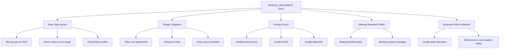
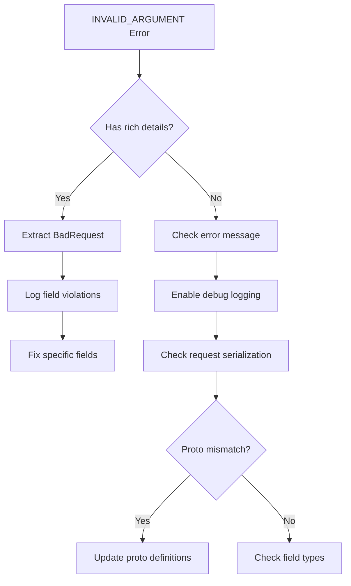

# How to Fix Invalid Argument Errors in gRPC

Author: [nawazdhandala](https://www.github.com/nawazdhandala)

Tags: gRPC, Invalid Argument, Validation, Error Handling, Protocol Buffers, Debugging, Go, Python

Description: A practical guide to diagnosing and fixing gRPC INVALID_ARGUMENT errors, covering input validation, protobuf field validation, and best practices for clear error messages.

---

> The INVALID_ARGUMENT error in gRPC indicates that the client sent a request with invalid data. This guide covers how to properly validate input, return helpful error messages, and debug validation issues in production environments.

INVALID_ARGUMENT (code 3) is one of the most common gRPC errors, indicating that the request data does not meet the server's requirements. Unlike server errors, this is a client problem that requires clear feedback to fix.

---

## Understanding INVALID_ARGUMENT



---

## Basic Input Validation

### Python Server Validation

```python
import grpc
import re
from datetime import datetime

class UserServiceServicer(user_pb2_grpc.UserServiceServicer):

    def CreateUser(self, request, context):
        """
        Create a new user with comprehensive input validation.
        Returns INVALID_ARGUMENT for any validation failures.
        """
        # Collect all validation errors to return at once
        errors = []

        # Validate username
        if not request.username:
            errors.append(('username', 'Username is required'))
        elif len(request.username) < 3:
            errors.append(('username', 'Username must be at least 3 characters'))
        elif len(request.username) > 50:
            errors.append(('username', 'Username must not exceed 50 characters'))
        elif not re.match(r'^[a-zA-Z0-9_]+$', request.username):
            errors.append(('username', 'Username can only contain letters, numbers, and underscores'))

        # Validate email
        if not request.email:
            errors.append(('email', 'Email is required'))
        elif not self._is_valid_email(request.email):
            errors.append(('email', 'Invalid email format'))

        # Validate age (if provided)
        if request.HasField('age'):
            if request.age < 0:
                errors.append(('age', 'Age cannot be negative'))
            elif request.age > 150:
                errors.append(('age', 'Age must be a realistic value'))

        # Validate password strength
        if not request.password:
            errors.append(('password', 'Password is required'))
        elif len(request.password) < 8:
            errors.append(('password', 'Password must be at least 8 characters'))
        elif not self._is_strong_password(request.password):
            errors.append(('password', 'Password must contain uppercase, lowercase, number, and special character'))

        # If there are validation errors, return them all
        if errors:
            self._set_validation_error(context, errors)
            return user_pb2.User()

        # Proceed with user creation
        return self._create_user(request)

    def _is_valid_email(self, email):
        """Validate email format using regex."""
        pattern = r'^[a-zA-Z0-9._%+-]+@[a-zA-Z0-9.-]+\.[a-zA-Z]{2,}$'
        return re.match(pattern, email) is not None

    def _is_strong_password(self, password):
        """Check password strength requirements."""
        has_upper = any(c.isupper() for c in password)
        has_lower = any(c.islower() for c in password)
        has_digit = any(c.isdigit() for c in password)
        has_special = any(c in '!@#$%^&*()_+-=[]{}|;:,.<>?' for c in password)
        return has_upper and has_lower and has_digit and has_special

    def _set_validation_error(self, context, errors):
        """Set INVALID_ARGUMENT error with field-level details."""
        # Build error message
        error_messages = [f'{field}: {msg}' for field, msg in errors]
        context.set_code(grpc.StatusCode.INVALID_ARGUMENT)
        context.set_details('; '.join(error_messages))
```

---

## Rich Error Details for Validation

### Python Implementation with BadRequest Details

```python
import grpc
from grpc_status import rpc_status
from google.protobuf import any_pb2
from google.rpc import status_pb2, error_details_pb2

def create_validation_error(context, field_violations):
    """
    Create an INVALID_ARGUMENT error with detailed field violations.
    This allows clients to programmatically identify which fields failed.
    """
    # Create BadRequest with field violations
    bad_request = error_details_pb2.BadRequest()

    for field, description in field_violations:
        violation = bad_request.field_violations.add()
        violation.field = field
        violation.description = description

    # Pack into Any message
    detail = any_pb2.Any()
    detail.Pack(bad_request)

    # Create rich status
    rich_status = status_pb2.Status(
        code=grpc.StatusCode.INVALID_ARGUMENT.value[0],
        message='Request validation failed',
        details=[detail]
    )

    # Abort with rich status
    context.abort_with_status(rpc_status.to_status(rich_status))


class OrderServiceServicer(order_pb2_grpc.OrderServiceServicer):

    def CreateOrder(self, request, context):
        """Create order with comprehensive validation."""
        violations = []

        # Validate customer_id
        if not request.customer_id:
            violations.append(('customer_id', 'Customer ID is required'))
        elif not self._customer_exists(request.customer_id):
            violations.append(('customer_id', f'Customer {request.customer_id} does not exist'))

        # Validate items
        if not request.items:
            violations.append(('items', 'At least one item is required'))
        else:
            for i, item in enumerate(request.items):
                # Validate each item
                if not item.product_id:
                    violations.append((f'items[{i}].product_id', 'Product ID is required'))

                if item.quantity <= 0:
                    violations.append((f'items[{i}].quantity', 'Quantity must be positive'))
                elif item.quantity > 1000:
                    violations.append((f'items[{i}].quantity', 'Quantity cannot exceed 1000'))

                if item.unit_price < 0:
                    violations.append((f'items[{i}].unit_price', 'Unit price cannot be negative'))

        # Validate shipping address
        if request.HasField('shipping_address'):
            addr = request.shipping_address
            if not addr.street:
                violations.append(('shipping_address.street', 'Street address is required'))
            if not addr.city:
                violations.append(('shipping_address.city', 'City is required'))
            if not addr.postal_code:
                violations.append(('shipping_address.postal_code', 'Postal code is required'))
            elif not self._is_valid_postal_code(addr.postal_code, addr.country):
                violations.append(('shipping_address.postal_code', 'Invalid postal code format'))

        if violations:
            create_validation_error(context, violations)

        return self._create_order(request)
```

### Client-Side Error Handling

```python
import grpc
from grpc_status import rpc_status
from google.rpc import error_details_pb2

def handle_validation_error(error):
    """
    Extract and handle validation errors from INVALID_ARGUMENT response.
    """
    if error.code() != grpc.StatusCode.INVALID_ARGUMENT:
        return None

    # Try to extract rich error details
    status = rpc_status.from_call(error)

    if status is None:
        # No rich details, use the basic message
        return {'_error': error.details()}

    # Extract field violations
    field_errors = {}

    for detail in status.details:
        if detail.Is(error_details_pb2.BadRequest.DESCRIPTOR):
            bad_request = error_details_pb2.BadRequest()
            detail.Unpack(bad_request)

            for violation in bad_request.field_violations:
                field_errors[violation.field] = violation.description

    return field_errors


def create_order_with_error_handling(stub, order_request):
    """
    Create an order and handle validation errors gracefully.
    """
    try:
        response = stub.CreateOrder(order_request)
        return response, None

    except grpc.RpcError as e:
        if e.code() == grpc.StatusCode.INVALID_ARGUMENT:
            errors = handle_validation_error(e)
            print('Validation errors:')
            for field, message in errors.items():
                print(f'  {field}: {message}')
            return None, errors

        # Re-raise unexpected errors
        raise


# Usage
response, errors = create_order_with_error_handling(stub, order_request)
if errors:
    # Show errors in UI
    for field, message in errors.items():
        show_field_error(field, message)
```

---

## Go Validation Implementation

```go
package main

import (
    "context"
    "regexp"
    "strings"

    "google.golang.org/genproto/googleapis/rpc/errdetails"
    "google.golang.org/grpc/codes"
    "google.golang.org/grpc/status"

    pb "myservice/proto"
)

// ValidationError collects field violations
type ValidationError struct {
    violations []*errdetails.BadRequest_FieldViolation
}

func NewValidationError() *ValidationError {
    return &ValidationError{}
}

func (v *ValidationError) AddViolation(field, description string) {
    v.violations = append(v.violations, &errdetails.BadRequest_FieldViolation{
        Field:       field,
        Description: description,
    })
}

func (v *ValidationError) HasErrors() bool {
    return len(v.violations) > 0
}

func (v *ValidationError) ToGRPCError() error {
    if !v.HasErrors() {
        return nil
    }

    // Create BadRequest detail
    br := &errdetails.BadRequest{
        FieldViolations: v.violations,
    }

    // Create status with details
    st := status.New(codes.InvalidArgument, "validation failed")
    st, err := st.WithDetails(br)
    if err != nil {
        // Fallback to simple error
        return status.Error(codes.InvalidArgument, "validation failed")
    }

    return st.Err()
}

// UserService with validation
type userServer struct {
    pb.UnimplementedUserServiceServer
}

func (s *userServer) CreateUser(ctx context.Context, req *pb.CreateUserRequest) (*pb.User, error) {
    v := NewValidationError()

    // Validate username
    if req.Username == "" {
        v.AddViolation("username", "username is required")
    } else {
        if len(req.Username) < 3 {
            v.AddViolation("username", "username must be at least 3 characters")
        }
        if len(req.Username) > 50 {
            v.AddViolation("username", "username must not exceed 50 characters")
        }
        if !isValidUsername(req.Username) {
            v.AddViolation("username", "username can only contain letters, numbers, and underscores")
        }
    }

    // Validate email
    if req.Email == "" {
        v.AddViolation("email", "email is required")
    } else if !isValidEmail(req.Email) {
        v.AddViolation("email", "invalid email format")
    }

    // Validate age
    if req.Age < 0 {
        v.AddViolation("age", "age cannot be negative")
    }
    if req.Age > 150 {
        v.AddViolation("age", "age must be a realistic value")
    }

    // Return validation errors
    if v.HasErrors() {
        return nil, v.ToGRPCError()
    }

    // Create user
    return s.createUser(ctx, req)
}

// Validation helpers
var (
    usernameRegex = regexp.MustCompile(`^[a-zA-Z0-9_]+$`)
    emailRegex    = regexp.MustCompile(`^[a-zA-Z0-9._%+-]+@[a-zA-Z0-9.-]+\.[a-zA-Z]{2,}$`)
)

func isValidUsername(username string) bool {
    return usernameRegex.MatchString(username)
}

func isValidEmail(email string) bool {
    return emailRegex.MatchString(email)
}
```

---

## Proto-Level Validation

### Using Protobuf Validation Libraries

```protobuf
// user.proto with validation annotations
syntax = "proto3";

package myservice;

import "validate/validate.proto";

message CreateUserRequest {
    // Username: required, 3-50 chars, alphanumeric with underscores
    string username = 1 [
        (validate.rules).string = {
            min_len: 3,
            max_len: 50,
            pattern: "^[a-zA-Z0-9_]+$"
        }
    ];

    // Email: required, valid email format
    string email = 2 [
        (validate.rules).string.email = true
    ];

    // Age: optional, 0-150
    int32 age = 3 [
        (validate.rules).int32 = {
            gte: 0,
            lte: 150
        }
    ];

    // Password: required, minimum 8 characters
    string password = 4 [
        (validate.rules).string.min_len = 8
    ];

    // Tags: optional, max 10 items
    repeated string tags = 5 [
        (validate.rules).repeated.max_items = 10
    ];
}

message Address {
    string street = 1 [
        (validate.rules).string.min_len = 1
    ];

    string city = 2 [
        (validate.rules).string.min_len = 1
    ];

    string postal_code = 3 [
        (validate.rules).string = {
            min_len: 1,
            max_len: 20
        }
    ];

    string country = 4 [
        (validate.rules).string = {
            min_len: 2,
            max_len: 2  // ISO country code
        }
    ];
}
```

### Go Server with Proto Validation

```go
package main

import (
    "context"

    "github.com/envoyproxy/protoc-gen-validate/validate"
    "google.golang.org/grpc/codes"
    "google.golang.org/grpc/status"

    pb "myservice/proto"
)

// ValidatingInterceptor validates requests using protoc-gen-validate rules
func ValidatingInterceptor(
    ctx context.Context,
    req interface{},
    info *grpc.UnaryServerInfo,
    handler grpc.UnaryHandler,
) (interface{}, error) {
    // Check if request implements Validate method
    if v, ok := req.(interface{ Validate() error }); ok {
        if err := v.Validate(); err != nil {
            // Convert validation error to gRPC error
            return nil, convertValidationError(err)
        }
    }

    return handler(ctx, req)
}

func convertValidationError(err error) error {
    // Check if it is a validation error from protoc-gen-validate
    if validationErr, ok := err.(validate.ValidationErrors); ok {
        br := &errdetails.BadRequest{}

        for _, fieldErr := range validationErr.Errors() {
            br.FieldViolations = append(br.FieldViolations, &errdetails.BadRequest_FieldViolation{
                Field:       fieldErr.Field(),
                Description: fieldErr.Reason(),
            })
        }

        st := status.New(codes.InvalidArgument, "validation failed")
        st, _ = st.WithDetails(br)
        return st.Err()
    }

    return status.Error(codes.InvalidArgument, err.Error())
}

// Apply interceptor to server
func main() {
    server := grpc.NewServer(
        grpc.UnaryInterceptor(ValidatingInterceptor),
    )

    pb.RegisterUserServiceServer(server, &userServer{})
    // ...
}
```

---

## Debugging Invalid Argument Errors



### Debug Logging Interceptor

```python
import grpc
import json
import logging
from google.protobuf.json_format import MessageToDict

logging.basicConfig(level=logging.DEBUG)
logger = logging.getLogger(__name__)


class DebugInterceptor(grpc.ServerInterceptor):
    """
    Interceptor that logs request details for debugging validation issues.
    """

    def intercept_service(self, continuation, handler_call_details):
        method = handler_call_details.method

        def debug_handler(request, context):
            # Log the incoming request
            try:
                request_dict = MessageToDict(
                    request,
                    preserving_proto_field_name=True
                )
                logger.debug(f'Request to {method}:')
                logger.debug(json.dumps(request_dict, indent=2))
            except Exception as e:
                logger.warning(f'Could not serialize request: {e}')

            # Call the actual handler
            try:
                response = continuation(handler_call_details)(request, context)
                logger.debug(f'Response from {method}: success')
                return response
            except Exception as e:
                logger.error(f'Error in {method}: {e}')
                raise

        return grpc.unary_unary_rpc_method_handler(debug_handler)


# Enable gRPC debug logging
import os
os.environ['GRPC_VERBOSITY'] = 'DEBUG'
os.environ['GRPC_TRACE'] = 'all'
```

### Client-Side Request Debugging

```python
import grpc
from google.protobuf.json_format import MessageToJson

def debug_request(request):
    """
    Print request details before sending for debugging.
    """
    print('Request details:')
    print(MessageToJson(request, indent=2))

    # Check for common issues
    descriptor = request.DESCRIPTOR

    for field in descriptor.fields:
        value = getattr(request, field.name)

        # Check if required field is empty
        if field.label == field.LABEL_REQUIRED:
            if not value:
                print(f'WARNING: Required field {field.name} is empty')

        # Check string fields
        if field.type == field.TYPE_STRING:
            if isinstance(value, str) and len(value) > 10000:
                print(f'WARNING: Field {field.name} is very long ({len(value)} chars)')

        # Check repeated fields
        if field.label == field.LABEL_REPEATED:
            if len(value) > 1000:
                print(f'WARNING: Field {field.name} has many items ({len(value)})')


# Usage
request = user_pb2.CreateUserRequest(
    username='test_user',
    email='test@example.com'
)

debug_request(request)

try:
    response = stub.CreateUser(request)
except grpc.RpcError as e:
    if e.code() == grpc.StatusCode.INVALID_ARGUMENT:
        print(f'Validation failed: {e.details()}')
```

---

## Best Practices

### 1. Validate Early, Validate Completely

```python
def validate_request(request):
    """
    Validate all fields upfront and return all errors at once.
    This is better UX than returning one error at a time.
    """
    errors = []

    # Validate all fields
    if not request.field1:
        errors.append(('field1', 'Field 1 is required'))

    if not request.field2:
        errors.append(('field2', 'Field 2 is required'))

    # Return all errors together
    return errors
```

### 2. Provide Actionable Error Messages

```python
# BAD: Vague error message
context.set_details('Invalid input')

# GOOD: Specific, actionable error message
context.set_details(
    'email must be a valid email address (e.g., user@example.com)'
)

# BETTER: Rich error with field path
create_validation_error(context, [
    ('email', 'Must be a valid email address (e.g., user@example.com)'),
    ('age', 'Must be between 0 and 150'),
])
```

### 3. Distinguish Between Invalid and Not Found

```python
def get_user(self, request, context):
    # INVALID_ARGUMENT: Bad input format
    if not request.user_id:
        context.set_code(grpc.StatusCode.INVALID_ARGUMENT)
        context.set_details('user_id is required')
        return user_pb2.User()

    if not isinstance(request.user_id, int) or request.user_id <= 0:
        context.set_code(grpc.StatusCode.INVALID_ARGUMENT)
        context.set_details('user_id must be a positive integer')
        return user_pb2.User()

    # NOT_FOUND: Valid input but resource does not exist
    user = self.db.get_user(request.user_id)
    if user is None:
        context.set_code(grpc.StatusCode.NOT_FOUND)
        context.set_details(f'User {request.user_id} not found')
        return user_pb2.User()

    return user
```

---

## Common Pitfalls

| Pitfall | Problem | Solution |
|---------|---------|----------|
| Returning one error at a time | Poor UX, multiple roundtrips | Collect and return all errors |
| Vague error messages | Hard to debug | Include field name and expected format |
| Type coercion failures | Silent data corruption | Validate types explicitly |
| Missing nested validation | Partially valid objects | Validate all nested fields |
| Not using field paths | Ambiguous error location | Use dot notation for nested fields |

---

## Conclusion

INVALID_ARGUMENT errors should help clients understand exactly what went wrong and how to fix it. By collecting all validation errors, using rich error details with field paths, and providing clear error messages, you create a much better developer experience.

The key is to think about validation from the client's perspective. What information do they need to fix the problem?

---

*Need to track validation errors in your gRPC services? [OneUptime](https://oneuptime.com) provides error tracking and monitoring that helps you identify patterns in validation failures.*

**Related Reading:**
- [How to Handle Error Codes in gRPC](https://oneuptime.com/blog)
- [How to Handle Metadata in gRPC Calls](https://oneuptime.com/blog)
