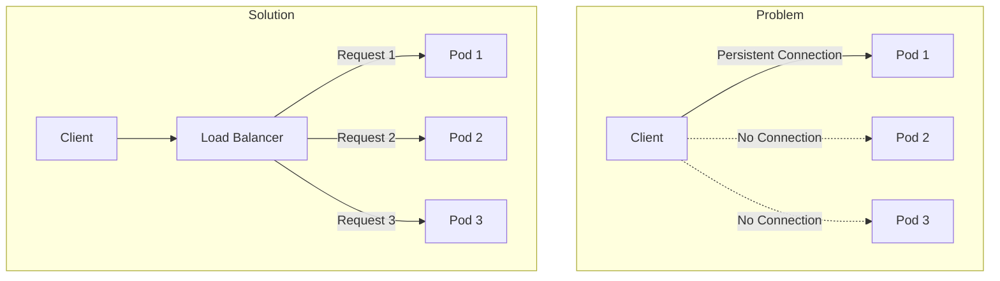
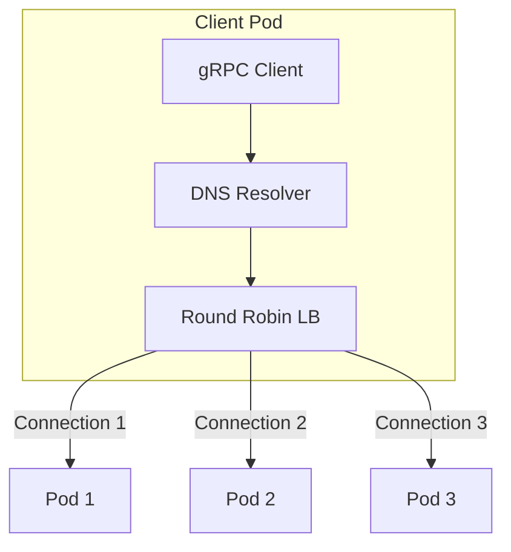
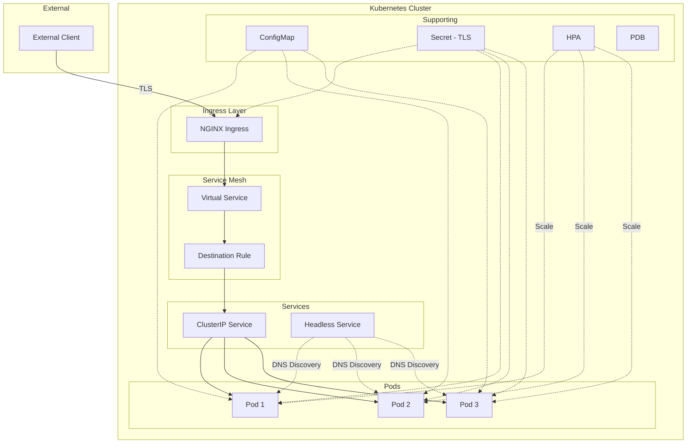

# How to Configure gRPC with Kubernetes

Author: [nawazdhandala](https://www.github.com/nawazdhandala)

Tags: gRPC, Kubernetes, microservices, load balancing, service mesh, health checks, deployment, configuration

Description: A comprehensive guide to deploying and configuring gRPC services on Kubernetes, covering load balancing, health checks, service discovery, and production best practices.

---

Deploying gRPC services on Kubernetes requires special consideration due to HTTP/2's persistent connections, connection multiplexing, and binary protocol nature. This guide covers everything you need to know to successfully run gRPC workloads on Kubernetes, from basic deployment to advanced load balancing strategies.

## Understanding gRPC on Kubernetes Challenges

gRPC uses HTTP/2, which creates long-lived connections that can bypass Kubernetes' default round-robin load balancing. This leads to uneven traffic distribution among pods.



### Key Challenges

| Challenge | Description | Solution |
|-----------|-------------|----------|
| Connection stickiness | HTTP/2 connections persist | Client-side LB or service mesh |
| Binary protocol | Cannot use HTTP path routing | gRPC-aware ingress |
| Health checks | HTTP/1.1 health checks fail | gRPC health protocol |
| TLS termination | Complex with HTTP/2 | End-to-end TLS or proper termination |

## Basic gRPC Service Deployment

### Service Definition (Protocol Buffers)

```protobuf
// user_service.proto
syntax = "proto3";

package user;

option go_package = "github.com/example/user";

service UserService {
    rpc GetUser(GetUserRequest) returns (User);
    rpc ListUsers(ListUsersRequest) returns (stream User);
    rpc CreateUser(CreateUserRequest) returns (User);
}

message GetUserRequest {
    string id = 1;
}

message User {
    string id = 1;
    string name = 2;
    string email = 3;
}

message ListUsersRequest {
    int32 page_size = 1;
    string page_token = 2;
}

message CreateUserRequest {
    string name = 1;
    string email = 2;
}
```

### Go Service Implementation with Health Checks

```go
// main.go
package main

import (
    "context"
    "log"
    "net"
    "os"
    "os/signal"
    "syscall"
    "time"

    "google.golang.org/grpc"
    "google.golang.org/grpc/health"
    "google.golang.org/grpc/health/grpc_health_v1"
    "google.golang.org/grpc/keepalive"
    "google.golang.org/grpc/reflection"
    pb "github.com/example/user"
)

func main() {
    // Get configuration from environment
    port := os.Getenv("GRPC_PORT")
    if port == "" {
        port = "50051"
    }

    // Create listener
    lis, err := net.Listen("tcp", ":"+port)
    if err != nil {
        log.Fatalf("Failed to listen: %v", err)
    }

    // Configure keepalive for Kubernetes load balancing
    kaep := keepalive.EnforcementPolicy{
        MinTime:             5 * time.Second,
        PermitWithoutStream: true,
    }

    kasp := keepalive.ServerParameters{
        MaxConnectionIdle:     15 * time.Second,
        MaxConnectionAge:      30 * time.Second,  // Force reconnection for load balancing
        MaxConnectionAgeGrace: 5 * time.Second,
        Time:                  5 * time.Second,
        Timeout:               1 * time.Second,
    }

    // Create gRPC server
    grpcServer := grpc.NewServer(
        grpc.KeepaliveEnforcementPolicy(kaep),
        grpc.KeepaliveParams(kasp),
        grpc.MaxRecvMsgSize(10*1024*1024),  // 10MB
        grpc.MaxSendMsgSize(10*1024*1024),  // 10MB
    )

    // Register services
    userService := NewUserService()
    pb.RegisterUserServiceServer(grpcServer, userService)

    // Register health service
    healthServer := health.NewServer()
    grpc_health_v1.RegisterHealthServer(grpcServer, healthServer)

    // Set service as serving
    healthServer.SetServingStatus("", grpc_health_v1.HealthCheckResponse_SERVING)
    healthServer.SetServingStatus("user.UserService", grpc_health_v1.HealthCheckResponse_SERVING)

    // Enable reflection for debugging
    reflection.Register(grpcServer)

    // Graceful shutdown
    go func() {
        sigChan := make(chan os.Signal, 1)
        signal.Notify(sigChan, syscall.SIGINT, syscall.SIGTERM)
        <-sigChan

        log.Println("Shutting down gRPC server...")

        // Set health to NOT_SERVING
        healthServer.SetServingStatus("", grpc_health_v1.HealthCheckResponse_NOT_SERVING)
        healthServer.SetServingStatus("user.UserService", grpc_health_v1.HealthCheckResponse_NOT_SERVING)

        // Give time for load balancer to notice
        time.Sleep(5 * time.Second)

        grpcServer.GracefulStop()
    }()

    log.Printf("gRPC server listening on :%s", port)
    if err := grpcServer.Serve(lis); err != nil {
        log.Fatalf("Failed to serve: %v", err)
    }
}

type UserService struct {
    pb.UnimplementedUserServiceServer
}

func NewUserService() *UserService {
    return &UserService{}
}

func (s *UserService) GetUser(ctx context.Context, req *pb.GetUserRequest) (*pb.User, error) {
    return &pb.User{
        Id:    req.Id,
        Name:  "John Doe",
        Email: "john@example.com",
    }, nil
}
```

### Dockerfile

```dockerfile
# Dockerfile
FROM golang:1.21-alpine AS builder

WORKDIR /app

# Copy go mod files
COPY go.mod go.sum ./
RUN go mod download

# Copy source
COPY . .

# Build
RUN CGO_ENABLED=0 GOOS=linux go build -o /server ./cmd/server

# Runtime image
FROM alpine:3.19

RUN apk --no-cache add ca-certificates

WORKDIR /app

COPY --from=builder /server .

# gRPC port
EXPOSE 50051

# Health check using grpc_health_probe
COPY --from=grpc-health-probe /bin/grpc_health_probe /bin/grpc_health_probe

HEALTHCHECK --interval=5s --timeout=3s \
    CMD ["/bin/grpc_health_probe", "-addr=:50051"]

ENTRYPOINT ["/app/server"]
```

## Kubernetes Manifests

### Deployment with gRPC Health Checks

```yaml
# deployment.yaml
apiVersion: apps/v1
kind: Deployment
metadata:
  name: user-service
  labels:
    app: user-service
spec:
  replicas: 3
  selector:
    matchLabels:
      app: user-service
  template:
    metadata:
      labels:
        app: user-service
      annotations:
        prometheus.io/scrape: "true"
        prometheus.io/port: "9090"
    spec:
      terminationGracePeriodSeconds: 30
      containers:
        - name: user-service
          image: myregistry/user-service:v1.0.0
          ports:
            - containerPort: 50051
              name: grpc
              protocol: TCP
            - containerPort: 9090
              name: metrics
              protocol: TCP
          env:
            - name: GRPC_PORT
              value: "50051"
            - name: METRICS_PORT
              value: "9090"
            - name: POD_NAME
              valueFrom:
                fieldRef:
                  fieldPath: metadata.name
            - name: POD_NAMESPACE
              valueFrom:
                fieldRef:
                  fieldPath: metadata.namespace
          resources:
            requests:
              cpu: 100m
              memory: 128Mi
            limits:
              cpu: 500m
              memory: 512Mi
          # gRPC health check
          readinessProbe:
            grpc:
              port: 50051
            initialDelaySeconds: 5
            periodSeconds: 10
            timeoutSeconds: 5
            failureThreshold: 3
          livenessProbe:
            grpc:
              port: 50051
            initialDelaySeconds: 15
            periodSeconds: 20
            timeoutSeconds: 5
            failureThreshold: 3
          # Startup probe for slow-starting services
          startupProbe:
            grpc:
              port: 50051
            initialDelaySeconds: 0
            periodSeconds: 5
            timeoutSeconds: 3
            failureThreshold: 30
      # Pod anti-affinity for high availability
      affinity:
        podAntiAffinity:
          preferredDuringSchedulingIgnoredDuringExecution:
            - weight: 100
              podAffinityTerm:
                labelSelector:
                  matchExpressions:
                    - key: app
                      operator: In
                      values:
                        - user-service
                topologyKey: kubernetes.io/hostname
```

### Headless Service for Client-Side Load Balancing

```yaml
# service-headless.yaml
apiVersion: v1
kind: Service
metadata:
  name: user-service-headless
  labels:
    app: user-service
spec:
  clusterIP: None  # Headless service
  selector:
    app: user-service
  ports:
    - port: 50051
      targetPort: 50051
      name: grpc
```

### Regular Service for Server-Side Load Balancing

```yaml
# service.yaml
apiVersion: v1
kind: Service
metadata:
  name: user-service
  labels:
    app: user-service
  annotations:
    # For cloud providers that support it
    cloud.google.com/backend-config: '{"default": "user-service-backend"}'
spec:
  type: ClusterIP
  selector:
    app: user-service
  ports:
    - port: 50051
      targetPort: 50051
      name: grpc
      protocol: TCP
```

## Load Balancing Strategies

### Client-Side Load Balancing



```go
// client/client.go
package client

import (
    "context"
    "time"

    "google.golang.org/grpc"
    "google.golang.org/grpc/balancer/roundrobin"
    "google.golang.org/grpc/credentials/insecure"
    "google.golang.org/grpc/keepalive"
    pb "github.com/example/user"
)

func NewUserClient(target string) (pb.UserServiceClient, *grpc.ClientConn, error) {
    // Keepalive configuration
    kacp := keepalive.ClientParameters{
        Time:                10 * time.Second,
        Timeout:             3 * time.Second,
        PermitWithoutStream: true,
    }

    // Connect with client-side load balancing
    conn, err := grpc.Dial(
        // Use dns:/// prefix for DNS-based discovery with headless service
        "dns:///user-service-headless:50051",
        grpc.WithTransportCredentials(insecure.NewCredentials()),
        grpc.WithDefaultServiceConfig(`{"loadBalancingPolicy":"round_robin"}`),
        grpc.WithKeepaliveParams(kacp),
        grpc.WithBlock(),
        grpc.WithTimeout(10*time.Second),
    )
    if err != nil {
        return nil, nil, err
    }

    return pb.NewUserServiceClient(conn), conn, nil
}

// With custom resolver for Kubernetes
func NewUserClientWithKubeResolver(namespace, serviceName string) (pb.UserServiceClient, *grpc.ClientConn, error) {
    target := fmt.Sprintf("kubernetes:///%s.%s:50051", serviceName, namespace)

    conn, err := grpc.Dial(
        target,
        grpc.WithTransportCredentials(insecure.NewCredentials()),
        grpc.WithDefaultServiceConfig(`{
            "loadBalancingPolicy": "round_robin",
            "healthCheckConfig": {
                "serviceName": "user.UserService"
            }
        }`),
    )
    if err != nil {
        return nil, nil, err
    }

    return pb.NewUserServiceClient(conn), conn, nil
}
```

### Service Mesh (Istio) Configuration

```yaml
# istio-virtualservice.yaml
apiVersion: networking.istio.io/v1beta1
kind: VirtualService
metadata:
  name: user-service
spec:
  hosts:
    - user-service
  http:
    - match:
        - headers:
            content-type:
              exact: application/grpc
      route:
        - destination:
            host: user-service
            port:
              number: 50051
      timeout: 30s
      retries:
        attempts: 3
        perTryTimeout: 10s
        retryOn: unavailable,cancelled,resource-exhausted

---
# istio-destinationrule.yaml
apiVersion: networking.istio.io/v1beta1
kind: DestinationRule
metadata:
  name: user-service
spec:
  host: user-service
  trafficPolicy:
    connectionPool:
      http:
        h2UpgradePolicy: UPGRADE
        http2MaxRequests: 1000
        maxRequestsPerConnection: 100
    loadBalancer:
      simple: ROUND_ROBIN
    outlierDetection:
      consecutive5xxErrors: 5
      interval: 30s
      baseEjectionTime: 30s
      maxEjectionPercent: 50
```

## Ingress Configuration

### NGINX Ingress for gRPC

```yaml
# ingress-nginx.yaml
apiVersion: networking.k8s.io/v1
kind: Ingress
metadata:
  name: user-service-grpc
  annotations:
    kubernetes.io/ingress.class: nginx
    nginx.ingress.kubernetes.io/backend-protocol: "GRPC"
    nginx.ingress.kubernetes.io/ssl-redirect: "true"
    nginx.ingress.kubernetes.io/proxy-read-timeout: "3600"
    nginx.ingress.kubernetes.io/proxy-send-timeout: "3600"
    nginx.ingress.kubernetes.io/server-snippets: |
      grpc_read_timeout 3600s;
      grpc_send_timeout 3600s;
spec:
  tls:
    - hosts:
        - grpc.example.com
      secretName: grpc-tls-secret
  rules:
    - host: grpc.example.com
      http:
        paths:
          - path: /user.UserService
            pathType: Prefix
            backend:
              service:
                name: user-service
                port:
                  number: 50051
```

### Traefik Ingress for gRPC

```yaml
# ingress-traefik.yaml
apiVersion: traefik.containo.us/v1alpha1
kind: IngressRoute
metadata:
  name: user-service-grpc
spec:
  entryPoints:
    - websecure
  routes:
    - match: Host(`grpc.example.com`)
      kind: Rule
      services:
        - name: user-service
          port: 50051
          scheme: h2c  # HTTP/2 cleartext
  tls:
    secretName: grpc-tls-secret

---
# Traefik middleware for gRPC
apiVersion: traefik.containo.us/v1alpha1
kind: Middleware
metadata:
  name: grpc-retry
spec:
  retry:
    attempts: 3
    initialInterval: 100ms
```

## TLS Configuration

### Creating Certificates

```yaml
# certificate.yaml (using cert-manager)
apiVersion: cert-manager.io/v1
kind: Certificate
metadata:
  name: grpc-tls
spec:
  secretName: grpc-tls-secret
  duration: 2160h  # 90 days
  renewBefore: 360h  # 15 days
  subject:
    organizations:
      - MyOrg
  commonName: grpc.example.com
  dnsNames:
    - grpc.example.com
    - user-service.default.svc.cluster.local
    - "*.user-service.default.svc.cluster.local"
  issuerRef:
    name: letsencrypt-prod
    kind: ClusterIssuer
```

### Server with TLS

```go
// server_tls.go
package main

import (
    "crypto/tls"
    "crypto/x509"
    "io/ioutil"
    "log"
    "net"

    "google.golang.org/grpc"
    "google.golang.org/grpc/credentials"
)

func createTLSServer() (*grpc.Server, error) {
    // Load server certificate and key
    cert, err := tls.LoadX509KeyPair(
        "/etc/certs/tls.crt",
        "/etc/certs/tls.key",
    )
    if err != nil {
        return nil, err
    }

    // Load CA certificate for client verification (mTLS)
    caCert, err := ioutil.ReadFile("/etc/certs/ca.crt")
    if err != nil {
        return nil, err
    }

    caCertPool := x509.NewCertPool()
    caCertPool.AppendCertsFromPEM(caCert)

    tlsConfig := &tls.Config{
        Certificates: []tls.Certificate{cert},
        ClientCAs:    caCertPool,
        ClientAuth:   tls.RequireAndVerifyClientCert,  // mTLS
        MinVersion:   tls.VersionTLS12,
    }

    creds := credentials.NewTLS(tlsConfig)

    return grpc.NewServer(grpc.Creds(creds)), nil
}
```

### Client with TLS

```go
// client_tls.go
package client

import (
    "crypto/tls"
    "crypto/x509"
    "io/ioutil"

    "google.golang.org/grpc"
    "google.golang.org/grpc/credentials"
)

func NewTLSClient(target string) (*grpc.ClientConn, error) {
    // Load client certificate for mTLS
    cert, err := tls.LoadX509KeyPair(
        "/etc/certs/client.crt",
        "/etc/certs/client.key",
    )
    if err != nil {
        return nil, err
    }

    // Load CA certificate
    caCert, err := ioutil.ReadFile("/etc/certs/ca.crt")
    if err != nil {
        return nil, err
    }

    caCertPool := x509.NewCertPool()
    caCertPool.AppendCertsFromPEM(caCert)

    tlsConfig := &tls.Config{
        Certificates:       []tls.Certificate{cert},
        RootCAs:            caCertPool,
        ServerName:         "user-service",  // Must match certificate
        InsecureSkipVerify: false,
    }

    creds := credentials.NewTLS(tlsConfig)

    return grpc.Dial(
        target,
        grpc.WithTransportCredentials(creds),
        grpc.WithDefaultServiceConfig(`{"loadBalancingPolicy":"round_robin"}`),
    )
}
```

## Horizontal Pod Autoscaling

```yaml
# hpa.yaml
apiVersion: autoscaling/v2
kind: HorizontalPodAutoscaler
metadata:
  name: user-service-hpa
spec:
  scaleTargetRef:
    apiVersion: apps/v1
    kind: Deployment
    name: user-service
  minReplicas: 3
  maxReplicas: 20
  metrics:
    - type: Resource
      resource:
        name: cpu
        target:
          type: Utilization
          averageUtilization: 70
    - type: Resource
      resource:
        name: memory
        target:
          type: Utilization
          averageUtilization: 80
    # Custom metrics (requires metrics adapter)
    - type: Pods
      pods:
        metric:
          name: grpc_requests_per_second
        target:
          type: AverageValue
          averageValue: "1000"
  behavior:
    scaleDown:
      stabilizationWindowSeconds: 300
      policies:
        - type: Percent
          value: 10
          periodSeconds: 60
    scaleUp:
      stabilizationWindowSeconds: 0
      policies:
        - type: Percent
          value: 100
          periodSeconds: 15
        - type: Pods
          value: 4
          periodSeconds: 15
      selectPolicy: Max
```

## Pod Disruption Budget

```yaml
# pdb.yaml
apiVersion: policy/v1
kind: PodDisruptionBudget
metadata:
  name: user-service-pdb
spec:
  minAvailable: 2  # Or use maxUnavailable: 1
  selector:
    matchLabels:
      app: user-service
```

## ConfigMap for Service Configuration

```yaml
# configmap.yaml
apiVersion: v1
kind: ConfigMap
metadata:
  name: user-service-config
data:
  config.yaml: |
    server:
      port: 50051
      max_recv_msg_size: 10485760
      max_send_msg_size: 10485760
      keepalive:
        max_connection_idle: 15s
        max_connection_age: 30s
        max_connection_age_grace: 5s
        time: 5s
        timeout: 1s

    logging:
      level: info
      format: json

    tracing:
      enabled: true
      sampling_rate: 0.1

    metrics:
      enabled: true
      port: 9090
```

## Complete Architecture Diagram



## Monitoring and Observability

### Prometheus ServiceMonitor

```yaml
# servicemonitor.yaml
apiVersion: monitoring.coreos.com/v1
kind: ServiceMonitor
metadata:
  name: user-service
  labels:
    app: user-service
spec:
  selector:
    matchLabels:
      app: user-service
  endpoints:
    - port: metrics
      interval: 15s
      path: /metrics
```

## Best Practices

1. **Use headless services**: For client-side load balancing with DNS discovery
2. **Configure keepalives**: Force connection recycling for better load distribution
3. **Implement health checks**: Use gRPC health protocol, not HTTP
4. **Enable graceful shutdown**: Drain connections before pod termination
5. **Use service mesh**: For advanced traffic management and observability
6. **Configure TLS properly**: End-to-end encryption or proper termination
7. **Set resource limits**: Prevent resource starvation
8. **Use PodDisruptionBudgets**: Ensure availability during updates
9. **Enable HPA**: Auto-scale based on load
10. **Monitor gRPC metrics**: Track latency, error rates, and throughput

## Conclusion

Running gRPC services on Kubernetes requires careful attention to load balancing, health checks, and connection management. By using headless services for client-side load balancing, properly configuring keepalives, and implementing gRPC health protocol, you can achieve reliable and scalable gRPC deployments. Service meshes like Istio provide additional capabilities for traffic management and observability. Remember to always test your configuration under realistic load conditions and monitor key metrics to ensure optimal performance.
