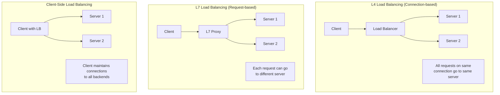
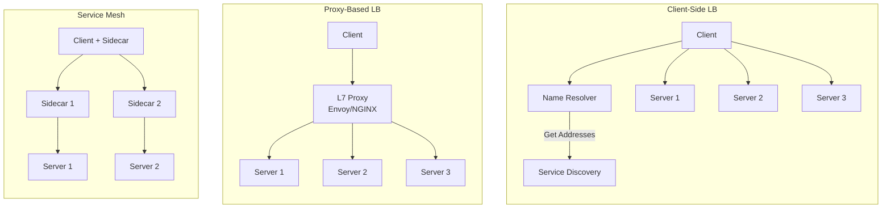

# How to Configure gRPC Load Balancing

Author: [nawazdhandala](https://github.com/nawazdhandala)

Tags: gRPC, Load Balancing, Kubernetes, Microservices, High Availability

Description: Learn how to configure client-side and proxy-based load balancing for gRPC services to achieve high availability and optimal performance.

---

gRPC uses HTTP/2, which maintains persistent connections. This creates challenges for load balancing because traditional L4 (TCP) load balancers distribute connections rather than individual requests. Once a connection is established, all requests on that connection go to the same backend. This guide covers the different load balancing strategies for gRPC and how to implement them effectively.

## Understanding gRPC Load Balancing



## Client-Side Load Balancing

gRPC has built-in support for client-side load balancing. The client discovers backend addresses through a name resolver and distributes requests using a load balancing policy.

### Basic Round-Robin Load Balancing (Go)

```go
// client_lb.go - Client-side load balancing with round-robin
package main

import (
    "context"
    "log"
    "time"

    "google.golang.org/grpc"
    "google.golang.org/grpc/credentials/insecure"
    "google.golang.org/grpc/resolver"
    pb "myservice/pb"
)

func main() {
    // Use dns resolver which returns multiple addresses
    // The "dns:///" prefix tells gRPC to use DNS resolver
    target := "dns:///myservice.example.com:50051"

    // Configure load balancing policy
    // round_robin distributes requests evenly across backends
    conn, err := grpc.Dial(
        target,
        grpc.WithTransportCredentials(insecure.NewCredentials()),
        // Enable round-robin load balancing
        grpc.WithDefaultServiceConfig(`{"loadBalancingPolicy":"round_robin"}`),
    )
    if err != nil {
        log.Fatalf("Failed to connect: %v", err)
    }
    defer conn.Close()

    client := pb.NewMyServiceClient(conn)

    // Make multiple requests - they will be distributed across backends
    for i := 0; i < 10; i++ {
        ctx, cancel := context.WithTimeout(context.Background(), 5*time.Second)
        resp, err := client.DoSomething(ctx, &pb.Request{Id: int32(i)})
        cancel()

        if err != nil {
            log.Printf("Request %d failed: %v", i, err)
            continue
        }
        log.Printf("Request %d response: %v", i, resp)
    }
}
```

### Custom Name Resolver

For more control over service discovery, implement a custom name resolver:

```go
// resolver.go - Custom name resolver for service discovery
package main

import (
    "fmt"
    "sync"
    "time"

    "google.golang.org/grpc/resolver"
)

const scheme = "custom"

// CustomResolverBuilder implements resolver.Builder
type CustomResolverBuilder struct {
    // ServiceDiscovery interface (Consul, etcd, etc.)
    discovery ServiceDiscovery
}

func (b *CustomResolverBuilder) Build(
    target resolver.Target,
    cc resolver.ClientConn,
    opts resolver.BuildOptions,
) (resolver.Resolver, error) {
    r := &customResolver{
        target:    target,
        cc:        cc,
        discovery: b.discovery,
        closeCh:   make(chan struct{}),
    }

    // Start watching for changes
    go r.watch()

    return r, nil
}

func (b *CustomResolverBuilder) Scheme() string {
    return scheme
}

// customResolver implements resolver.Resolver
type customResolver struct {
    target    resolver.Target
    cc        resolver.ClientConn
    discovery ServiceDiscovery
    closeCh   chan struct{}
    mu        sync.Mutex
}

func (r *customResolver) watch() {
    // Initial resolution
    r.resolve()

    // Watch for changes
    ticker := time.NewTicker(10 * time.Second)
    defer ticker.Stop()

    for {
        select {
        case <-ticker.C:
            r.resolve()
        case <-r.closeCh:
            return
        }
    }
}

func (r *customResolver) resolve() {
    r.mu.Lock()
    defer r.mu.Unlock()

    // Get addresses from service discovery
    serviceName := r.target.Endpoint()
    endpoints, err := r.discovery.GetEndpoints(serviceName)
    if err != nil {
        r.cc.ReportError(err)
        return
    }

    // Convert to resolver addresses
    addrs := make([]resolver.Address, 0, len(endpoints))
    for _, ep := range endpoints {
        addrs = append(addrs, resolver.Address{
            Addr: fmt.Sprintf("%s:%d", ep.Host, ep.Port),
            // Optional: add metadata for weighted load balancing
            Attributes: nil,
        })
    }

    // Update client connection with new addresses
    r.cc.UpdateState(resolver.State{
        Addresses: addrs,
    })
}

func (r *customResolver) ResolveNow(resolver.ResolveNowOptions) {
    r.resolve()
}

func (r *customResolver) Close() {
    close(r.closeCh)
}

// Register the resolver
func init() {
    resolver.Register(&CustomResolverBuilder{
        discovery: NewConsulDiscovery(), // Your service discovery
    })
}

// Usage
func createClientWithCustomResolver() (*grpc.ClientConn, error) {
    return grpc.Dial(
        "custom:///myservice",
        grpc.WithInsecure(),
        grpc.WithDefaultServiceConfig(`{"loadBalancingPolicy":"round_robin"}`),
    )
}
```

### Weighted Load Balancing

For backends with different capacities, implement weighted load balancing:

```go
// weighted_lb.go - Weighted round-robin load balancing
package main

import (
    "math/rand"
    "sync"
    "sync/atomic"

    "google.golang.org/grpc/balancer"
    "google.golang.org/grpc/balancer/base"
)

const weightedRoundRobinName = "weighted_round_robin"

func init() {
    balancer.Register(newWeightedRoundRobinBuilder())
}

func newWeightedRoundRobinBuilder() balancer.Builder {
    return base.NewBalancerBuilder(
        weightedRoundRobinName,
        &weightedPickerBuilder{},
        base.Config{HealthCheck: true},
    )
}

type weightedPickerBuilder struct{}

func (b *weightedPickerBuilder) Build(info base.PickerBuildInfo) balancer.Picker {
    if len(info.ReadySCs) == 0 {
        return base.NewErrPicker(balancer.ErrNoSubConnAvailable)
    }

    // Build weighted list
    var weightedSCs []weightedSubConn
    var totalWeight int

    for sc, scInfo := range info.ReadySCs {
        weight := 1
        // Get weight from address attributes if available
        if w := scInfo.Address.Attributes.Value("weight"); w != nil {
            weight = w.(int)
        }

        weightedSCs = append(weightedSCs, weightedSubConn{
            sc:     sc,
            weight: weight,
        })
        totalWeight += weight
    }

    return &weightedPicker{
        subConns:    weightedSCs,
        totalWeight: totalWeight,
    }
}

type weightedSubConn struct {
    sc     balancer.SubConn
    weight int
}

type weightedPicker struct {
    subConns    []weightedSubConn
    totalWeight int
    mu          sync.Mutex
    current     int64
}

func (p *weightedPicker) Pick(balancer.PickInfo) (balancer.PickResult, error) {
    // Weighted random selection
    target := rand.Intn(p.totalWeight)
    cumulative := 0

    for _, wsc := range p.subConns {
        cumulative += wsc.weight
        if target < cumulative {
            return balancer.PickResult{SubConn: wsc.sc}, nil
        }
    }

    // Fallback to first
    return balancer.PickResult{SubConn: p.subConns[0].sc}, nil
}
```

## Proxy-Based Load Balancing

For L7 (application-level) load balancing, use a gRPC-aware proxy like Envoy or NGINX.

### Envoy Configuration

```yaml
# envoy.yaml - Envoy as gRPC load balancer
static_resources:
  listeners:
    - name: grpc_listener
      address:
        socket_address:
          address: 0.0.0.0
          port_value: 9000
      filter_chains:
        - filters:
            - name: envoy.filters.network.http_connection_manager
              typed_config:
                "@type": type.googleapis.com/envoy.extensions.filters.network.http_connection_manager.v3.HttpConnectionManager
                stat_prefix: grpc_proxy
                codec_type: AUTO
                route_config:
                  name: grpc_route
                  virtual_hosts:
                    - name: grpc_backend
                      domains: ["*"]
                      routes:
                        - match:
                            prefix: "/"
                            grpc: {}
                          route:
                            cluster: grpc_cluster
                            timeout: 60s
                            retry_policy:
                              retry_on: "unavailable,reset"
                              num_retries: 3
                http_filters:
                  - name: envoy.filters.http.router
                    typed_config:
                      "@type": type.googleapis.com/envoy.extensions.filters.http.router.v3.Router

  clusters:
    - name: grpc_cluster
      connect_timeout: 5s
      type: STRICT_DNS
      lb_policy: ROUND_ROBIN
      http2_protocol_options: {}
      health_checks:
        - timeout: 5s
          interval: 10s
          unhealthy_threshold: 3
          healthy_threshold: 2
          grpc_health_check:
            service_name: "myservice"
      load_assignment:
        cluster_name: grpc_cluster
        endpoints:
          - lb_endpoints:
              - endpoint:
                  address:
                    socket_address:
                      address: backend1
                      port_value: 50051
                  health_check_config:
                    port_value: 50051
              - endpoint:
                  address:
                    socket_address:
                      address: backend2
                      port_value: 50051
              - endpoint:
                  address:
                    socket_address:
                      address: backend3
                      port_value: 50051
```

### NGINX Configuration

```nginx
# nginx.conf - NGINX as gRPC load balancer
upstream grpc_backends {
    # Use least_conn for better distribution with long-lived connections
    least_conn;

    server backend1:50051 weight=3;
    server backend2:50051 weight=2;
    server backend3:50051 weight=1;

    # Keep connections alive to backends
    keepalive 100;
}

server {
    listen 443 ssl http2;
    server_name grpc.example.com;

    ssl_certificate /etc/ssl/certs/server.crt;
    ssl_certificate_key /etc/ssl/private/server.key;
    ssl_protocols TLSv1.2 TLSv1.3;

    # gRPC proxy settings
    location / {
        grpc_pass grpcs://grpc_backends;

        # Timeouts
        grpc_connect_timeout 10s;
        grpc_read_timeout 300s;
        grpc_send_timeout 300s;

        # Health check (requires NGINX Plus or custom module)
        # health_check type=grpc grpc_service=grpc.health.v1.Health;
    }
}
```

## Kubernetes Load Balancing

### Headless Service for Client-Side Load Balancing

```yaml
# kubernetes/headless-service.yaml
apiVersion: v1
kind: Service
metadata:
  name: myservice-headless
  labels:
    app: myservice
spec:
  clusterIP: None  # Headless service
  selector:
    app: myservice
  ports:
    - port: 50051
      targetPort: 50051
      name: grpc
---
apiVersion: apps/v1
kind: Deployment
metadata:
  name: myservice
spec:
  replicas: 3
  selector:
    matchLabels:
      app: myservice
  template:
    metadata:
      labels:
        app: myservice
    spec:
      containers:
        - name: myservice
          image: myservice:latest
          ports:
            - containerPort: 50051
          readinessProbe:
            grpc:
              port: 50051
            initialDelaySeconds: 5
            periodSeconds: 10
          livenessProbe:
            grpc:
              port: 50051
            initialDelaySeconds: 10
            periodSeconds: 20
```

```go
// kubernetes_client.go - gRPC client for Kubernetes headless service
package main

import (
    "google.golang.org/grpc"
    "google.golang.org/grpc/credentials/insecure"
)

func createKubernetesClient() (*grpc.ClientConn, error) {
    // Use kubernetes DNS for service discovery
    // The headless service returns all pod IPs
    target := "dns:///myservice-headless.default.svc.cluster.local:50051"

    return grpc.Dial(
        target,
        grpc.WithTransportCredentials(insecure.NewCredentials()),
        grpc.WithDefaultServiceConfig(`{
            "loadBalancingPolicy": "round_robin",
            "healthCheckConfig": {
                "serviceName": "myservice"
            }
        }`),
    )
}
```

### Using Istio for gRPC Load Balancing

```yaml
# istio/destination-rule.yaml
apiVersion: networking.istio.io/v1alpha3
kind: DestinationRule
metadata:
  name: myservice-lb
spec:
  host: myservice.default.svc.cluster.local
  trafficPolicy:
    connectionPool:
      http:
        h2UpgradePolicy: UPGRADE
        http2MaxRequests: 1000
    loadBalancer:
      simple: ROUND_ROBIN
      # Or use consistent hashing for sticky sessions
      # consistentHash:
      #   httpHeaderName: "x-user-id"
    outlierDetection:
      consecutive5xxErrors: 5
      interval: 10s
      baseEjectionTime: 30s
      maxEjectionPercent: 50
---
apiVersion: networking.istio.io/v1alpha3
kind: VirtualService
metadata:
  name: myservice
spec:
  hosts:
    - myservice.default.svc.cluster.local
  http:
    - match:
        - headers:
            content-type:
              prefix: "application/grpc"
      route:
        - destination:
            host: myservice.default.svc.cluster.local
            port:
              number: 50051
      retries:
        attempts: 3
        perTryTimeout: 5s
        retryOn: unavailable,reset,connect-failure
```

## Health Checking for Load Balancing

Implement gRPC health checking so load balancers can detect unhealthy backends:

```go
// health_server.go - gRPC health check implementation
package main

import (
    "context"
    "log"
    "net"
    "sync"
    "time"

    "google.golang.org/grpc"
    "google.golang.org/grpc/health"
    "google.golang.org/grpc/health/grpc_health_v1"
    pb "myservice/pb"
)

type HealthManager struct {
    healthServer *health.Server
    mu           sync.RWMutex
    services     map[string]bool
}

func NewHealthManager() *HealthManager {
    return &HealthManager{
        healthServer: health.NewServer(),
        services:     make(map[string]bool),
    }
}

func (h *HealthManager) SetServingStatus(service string, serving bool) {
    h.mu.Lock()
    defer h.mu.Unlock()

    h.services[service] = serving

    status := grpc_health_v1.HealthCheckResponse_NOT_SERVING
    if serving {
        status = grpc_health_v1.HealthCheckResponse_SERVING
    }

    h.healthServer.SetServingStatus(service, status)
    log.Printf("Service %s health status: %v", service, serving)
}

func (h *HealthManager) Server() *health.Server {
    return h.healthServer
}

// DependencyChecker periodically checks dependencies and updates health
type DependencyChecker struct {
    healthManager *HealthManager
    checks        []HealthCheck
}

type HealthCheck struct {
    Name  string
    Check func(context.Context) error
}

func (d *DependencyChecker) Start(ctx context.Context) {
    ticker := time.NewTicker(10 * time.Second)
    defer ticker.Stop()

    // Initial check
    d.runChecks(ctx)

    for {
        select {
        case <-ticker.C:
            d.runChecks(ctx)
        case <-ctx.Done():
            return
        }
    }
}

func (d *DependencyChecker) runChecks(ctx context.Context) {
    allHealthy := true

    for _, check := range d.checks {
        checkCtx, cancel := context.WithTimeout(ctx, 5*time.Second)
        err := check.Check(checkCtx)
        cancel()

        if err != nil {
            log.Printf("Health check %s failed: %v", check.Name, err)
            allHealthy = false
        }
    }

    d.healthManager.SetServingStatus("myservice", allHealthy)
}

func main() {
    healthManager := NewHealthManager()

    // Create gRPC server with health service
    server := grpc.NewServer()
    grpc_health_v1.RegisterHealthServer(server, healthManager.Server())
    pb.RegisterMyServiceServer(server, &myServiceServer{})

    // Start dependency checker
    checker := &DependencyChecker{
        healthManager: healthManager,
        checks: []HealthCheck{
            {
                Name: "database",
                Check: func(ctx context.Context) error {
                    // Check database connection
                    return db.PingContext(ctx)
                },
            },
            {
                Name: "cache",
                Check: func(ctx context.Context) error {
                    // Check cache connection
                    return cache.Ping(ctx).Err()
                },
            },
        },
    }
    go checker.Start(context.Background())

    // Set initial status
    healthManager.SetServingStatus("myservice", true)

    lis, _ := net.Listen("tcp", ":50051")
    server.Serve(lis)
}
```

## Load Balancing Architecture Comparison



## Summary

| Approach | Pros | Cons | Best For |
|----------|------|------|----------|
| Client-side LB | Low latency, no extra hop | Complex client config | High-performance apps |
| Proxy (Envoy) | Centralized config, observability | Extra network hop | Kubernetes, microservices |
| Service mesh (Istio) | Full traffic control | Complexity, resource overhead | Large deployments |
| Headless service | Simple, Kubernetes native | Limited features | Simple K8s deployments |

Choose your load balancing strategy based on your infrastructure, performance requirements, and operational complexity tolerance. Client-side load balancing offers the best performance, while proxy-based solutions provide better observability and centralized control.
