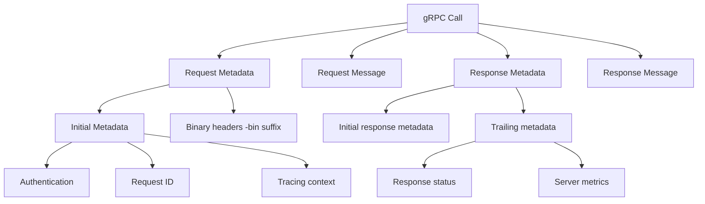
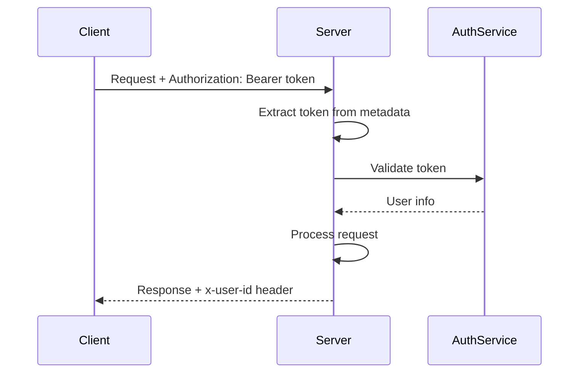
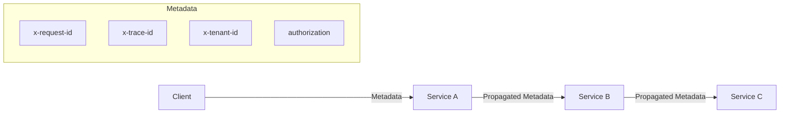

# How to Handle Metadata in gRPC Calls

Author: [nawazdhandala](https://www.github.com/nawazdhandala)

Tags: gRPC, Metadata, Headers, Authentication, Tracing, Context Propagation, Go, Python

Description: A comprehensive guide to working with metadata in gRPC, covering authentication tokens, request tracing, custom headers, and best practices for context propagation across services.

---

> Metadata in gRPC is the equivalent of HTTP headers. It allows you to pass additional information alongside requests and responses, such as authentication tokens, tracing IDs, and custom context. This guide covers how to effectively use metadata for common scenarios.

Metadata is essential for cross-cutting concerns like authentication, tracing, and request correlation. Understanding how to properly send and receive metadata is crucial for building production-ready gRPC services.

---

## Understanding gRPC Metadata



---

## Sending Metadata from Client

### Python Client

```python
import grpc

def make_request_with_metadata(stub, request):
    """
    Make a gRPC call with custom metadata headers.
    """
    # Create metadata as a list of tuples
    metadata = [
        # Authentication token
        ('authorization', 'Bearer your-jwt-token'),
        # Request correlation ID for tracing
        ('x-request-id', 'req-12345-abcde'),
        # Custom application headers
        ('x-tenant-id', 'tenant-123'),
        ('x-client-version', '2.1.0'),
        # User agent
        ('user-agent', 'my-grpc-client/1.0'),
    ]

    # Make the call with metadata
    response = stub.MyMethod(request, metadata=metadata)
    return response


def make_request_with_binary_metadata(stub, request):
    """
    Send binary data in metadata using the -bin suffix.
    Binary metadata is automatically base64 encoded.
    """
    import json

    # Complex data that needs binary encoding
    trace_context = {
        'trace_id': 'abc123',
        'span_id': 'span456',
        'sampled': True
    }

    metadata = [
        # Regular string metadata
        ('x-request-id', 'req-12345'),
        # Binary metadata (key must end with -bin)
        # The value is automatically base64 encoded
        ('x-trace-context-bin', json.dumps(trace_context).encode('utf-8')),
    ]

    response = stub.MyMethod(request, metadata=metadata)
    return response


def get_response_metadata(stub, request):
    """
    Retrieve metadata from the response.
    """
    # Use call to access response metadata
    call = stub.MyMethod.with_call(request, metadata=[
        ('x-request-id', 'req-12345'),
    ])

    response, call_info = call

    # Get initial metadata (sent before response body)
    initial_metadata = call_info.initial_metadata()
    print('Initial metadata:')
    for key, value in initial_metadata:
        print(f'  {key}: {value}')

    # Get trailing metadata (sent after response body)
    trailing_metadata = call_info.trailing_metadata()
    print('Trailing metadata:')
    for key, value in trailing_metadata:
        print(f'  {key}: {value}')

    return response
```

### Go Client

```go
package main

import (
    "context"
    "encoding/json"
    "log"

    "google.golang.org/grpc"
    "google.golang.org/grpc/metadata"

    pb "myservice/proto"
)

func makeRequestWithMetadata(client pb.MyServiceClient, req *pb.MyRequest) (*pb.MyResponse, error) {
    // Create metadata
    md := metadata.Pairs(
        "authorization", "Bearer your-jwt-token",
        "x-request-id", "req-12345-abcde",
        "x-tenant-id", "tenant-123",
        "x-client-version", "2.1.0",
    )

    // Attach metadata to context
    ctx := metadata.NewOutgoingContext(context.Background(), md)

    // Make the call
    return client.MyMethod(ctx, req)
}

func appendMetadata(ctx context.Context) context.Context {
    // Append to existing metadata (does not overwrite)
    return metadata.AppendToOutgoingContext(ctx,
        "x-additional-header", "value",
    )
}

func getResponseMetadata(client pb.MyServiceClient, req *pb.MyRequest) (*pb.MyResponse, error) {
    ctx := metadata.NewOutgoingContext(context.Background(), metadata.Pairs(
        "x-request-id", "req-12345",
    ))

    // Variables to receive response metadata
    var header, trailer metadata.MD

    // Make call with options to capture metadata
    resp, err := client.MyMethod(ctx, req,
        grpc.Header(&header),   // Receive initial metadata
        grpc.Trailer(&trailer), // Receive trailing metadata
    )
    if err != nil {
        return nil, err
    }

    // Process header metadata
    log.Println("Header metadata:")
    for key, values := range header {
        log.Printf("  %s: %v", key, values)
    }

    // Process trailer metadata
    log.Println("Trailer metadata:")
    for key, values := range trailer {
        log.Printf("  %s: %v", key, values)
    }

    return resp, nil
}

func sendBinaryMetadata(client pb.MyServiceClient, req *pb.MyRequest) (*pb.MyResponse, error) {
    // Binary metadata - key must end with -bin
    traceContext := map[string]interface{}{
        "trace_id": "abc123",
        "span_id":  "span456",
        "sampled":  true,
    }
    traceBytes, _ := json.Marshal(traceContext)

    md := metadata.Pairs(
        "x-request-id", "req-12345",
        "x-trace-context-bin", string(traceBytes), // -bin suffix for binary
    )

    ctx := metadata.NewOutgoingContext(context.Background(), md)
    return client.MyMethod(ctx, req)
}
```

---

## Receiving Metadata on Server

### Python Server

```python
import grpc
import uuid
import time

class MyServiceServicer(service_pb2_grpc.MyServiceServicer):

    def MyMethod(self, request, context):
        """
        Handle request and access metadata.
        """
        # Get incoming metadata
        metadata = dict(context.invocation_metadata())

        # Extract common headers
        auth_header = metadata.get('authorization', '')
        request_id = metadata.get('x-request-id', str(uuid.uuid4()))
        tenant_id = metadata.get('x-tenant-id')
        client_version = metadata.get('x-client-version', 'unknown')

        print(f'Request ID: {request_id}')
        print(f'Tenant ID: {tenant_id}')
        print(f'Client Version: {client_version}')

        # Validate authentication
        if not auth_header.startswith('Bearer '):
            context.set_code(grpc.StatusCode.UNAUTHENTICATED)
            context.set_details('Missing or invalid authorization header')
            return service_pb2.MyResponse()

        token = auth_header[7:]  # Remove 'Bearer ' prefix
        user = self._validate_token(token)
        if not user:
            context.set_code(grpc.StatusCode.UNAUTHENTICATED)
            context.set_details('Invalid token')
            return service_pb2.MyResponse()

        # Set initial response metadata
        context.send_initial_metadata([
            ('x-request-id', request_id),
            ('x-server-version', '1.0.0'),
        ])

        # Process request
        result = self._process_request(request, user, tenant_id)

        # Set trailing metadata (sent after response)
        context.set_trailing_metadata([
            ('x-processing-time-ms', str(int(time.time() * 1000))),
            ('x-request-id', request_id),
        ])

        return result

    def _validate_token(self, token):
        # Token validation logic
        return {'user_id': '123', 'name': 'Test User'}

    def _process_request(self, request, user, tenant_id):
        # Business logic
        return service_pb2.MyResponse(message='Success')
```

### Go Server

```go
package main

import (
    "context"
    "log"
    "time"

    "github.com/google/uuid"
    "google.golang.org/grpc"
    "google.golang.org/grpc/codes"
    "google.golang.org/grpc/metadata"
    "google.golang.org/grpc/status"

    pb "myservice/proto"
)

type myServer struct {
    pb.UnimplementedMyServiceServer
}

func (s *myServer) MyMethod(ctx context.Context, req *pb.MyRequest) (*pb.MyResponse, error) {
    startTime := time.Now()

    // Extract incoming metadata
    md, ok := metadata.FromIncomingContext(ctx)
    if !ok {
        md = metadata.MD{}
    }

    // Get specific headers
    authHeaders := md.Get("authorization")
    requestIDs := md.Get("x-request-id")
    tenantIDs := md.Get("x-tenant-id")

    // Use first value or default
    var authHeader, requestID, tenantID string
    if len(authHeaders) > 0 {
        authHeader = authHeaders[0]
    }
    if len(requestIDs) > 0 {
        requestID = requestIDs[0]
    } else {
        requestID = uuid.New().String()
    }
    if len(tenantIDs) > 0 {
        tenantID = tenantIDs[0]
    }

    log.Printf("Request ID: %s, Tenant: %s", requestID, tenantID)

    // Validate authentication
    if authHeader == "" || len(authHeader) < 8 || authHeader[:7] != "Bearer " {
        return nil, status.Error(codes.Unauthenticated, "missing or invalid authorization")
    }

    token := authHeader[7:]
    user, err := s.validateToken(token)
    if err != nil {
        return nil, status.Error(codes.Unauthenticated, "invalid token")
    }

    // Send initial response metadata
    header := metadata.Pairs(
        "x-request-id", requestID,
        "x-server-version", "1.0.0",
    )
    if err := grpc.SendHeader(ctx, header); err != nil {
        log.Printf("failed to send header: %v", err)
    }

    // Process request
    result := s.processRequest(req, user, tenantID)

    // Set trailing metadata
    trailer := metadata.Pairs(
        "x-processing-time-ms", fmt.Sprintf("%d", time.Since(startTime).Milliseconds()),
        "x-request-id", requestID,
    )
    if err := grpc.SetTrailer(ctx, trailer); err != nil {
        log.Printf("failed to set trailer: %v", err)
    }

    return result, nil
}

func (s *myServer) validateToken(token string) (*User, error) {
    // Token validation logic
    return &User{ID: "123", Name: "Test User"}, nil
}

func (s *myServer) processRequest(req *pb.MyRequest, user *User, tenantID string) *pb.MyResponse {
    return &pb.MyResponse{Message: "Success"}
}
```

---

## Authentication with Metadata



### Authentication Interceptor

```python
import grpc
import jwt
from functools import wraps

class AuthInterceptor(grpc.ServerInterceptor):
    """
    Interceptor that validates JWT tokens from metadata.
    """

    def __init__(self, jwt_secret, excluded_methods=None):
        self.jwt_secret = jwt_secret
        self.excluded_methods = excluded_methods or []

    def intercept_service(self, continuation, handler_call_details):
        method = handler_call_details.method

        # Skip authentication for excluded methods
        if method in self.excluded_methods:
            return continuation(handler_call_details)

        # Get metadata
        metadata = dict(handler_call_details.invocation_metadata)
        auth_header = metadata.get('authorization', '')

        # Validate token
        if not auth_header.startswith('Bearer '):
            return self._unauthenticated_handler('Missing Bearer token')

        token = auth_header[7:]
        try:
            payload = jwt.decode(token, self.jwt_secret, algorithms=['HS256'])
            # Store user info in context for later use
            handler_call_details.user = payload
        except jwt.ExpiredSignatureError:
            return self._unauthenticated_handler('Token has expired')
        except jwt.InvalidTokenError as e:
            return self._unauthenticated_handler(f'Invalid token: {e}')

        return continuation(handler_call_details)

    def _unauthenticated_handler(self, message):
        def handler(request, context):
            context.set_code(grpc.StatusCode.UNAUTHENTICATED)
            context.set_details(message)
            return None

        return grpc.unary_unary_rpc_method_handler(handler)


# Apply authentication interceptor
server = grpc.server(
    futures.ThreadPoolExecutor(max_workers=50),
    interceptors=[
        AuthInterceptor(
            jwt_secret='your-secret-key',
            excluded_methods=['/myservice.Auth/Login']
        )
    ]
)
```

### Go Authentication Interceptor

```go
package main

import (
    "context"
    "strings"

    "github.com/golang-jwt/jwt/v5"
    "google.golang.org/grpc"
    "google.golang.org/grpc/codes"
    "google.golang.org/grpc/metadata"
    "google.golang.org/grpc/status"
)

type contextKey string

const userContextKey contextKey = "user"

type AuthInterceptor struct {
    jwtSecret       []byte
    excludedMethods map[string]bool
}

func NewAuthInterceptor(secret string, excludedMethods []string) *AuthInterceptor {
    excluded := make(map[string]bool)
    for _, m := range excludedMethods {
        excluded[m] = true
    }
    return &AuthInterceptor{
        jwtSecret:       []byte(secret),
        excludedMethods: excluded,
    }
}

func (i *AuthInterceptor) Unary() grpc.UnaryServerInterceptor {
    return func(
        ctx context.Context,
        req interface{},
        info *grpc.UnaryServerInfo,
        handler grpc.UnaryHandler,
    ) (interface{}, error) {
        // Skip excluded methods
        if i.excludedMethods[info.FullMethod] {
            return handler(ctx, req)
        }

        // Authenticate
        newCtx, err := i.authenticate(ctx)
        if err != nil {
            return nil, err
        }

        return handler(newCtx, req)
    }
}

func (i *AuthInterceptor) authenticate(ctx context.Context) (context.Context, error) {
    md, ok := metadata.FromIncomingContext(ctx)
    if !ok {
        return nil, status.Error(codes.Unauthenticated, "missing metadata")
    }

    authHeaders := md.Get("authorization")
    if len(authHeaders) == 0 {
        return nil, status.Error(codes.Unauthenticated, "missing authorization header")
    }

    authHeader := authHeaders[0]
    if !strings.HasPrefix(authHeader, "Bearer ") {
        return nil, status.Error(codes.Unauthenticated, "invalid authorization format")
    }

    tokenString := authHeader[7:]

    // Parse and validate JWT
    token, err := jwt.Parse(tokenString, func(token *jwt.Token) (interface{}, error) {
        return i.jwtSecret, nil
    })
    if err != nil {
        return nil, status.Errorf(codes.Unauthenticated, "invalid token: %v", err)
    }

    claims, ok := token.Claims.(jwt.MapClaims)
    if !ok || !token.Valid {
        return nil, status.Error(codes.Unauthenticated, "invalid token claims")
    }

    // Add user to context
    return context.WithValue(ctx, userContextKey, claims), nil
}

// Helper to get user from context
func GetUserFromContext(ctx context.Context) (jwt.MapClaims, bool) {
    user, ok := ctx.Value(userContextKey).(jwt.MapClaims)
    return user, ok
}
```

---

## Distributed Tracing with Metadata

```python
import grpc
import uuid
from opentelemetry import trace
from opentelemetry.propagate import inject, extract

class TracingInterceptor(grpc.ServerInterceptor):
    """
    Interceptor that extracts tracing context from metadata
    and creates spans for each request.
    """

    def __init__(self, tracer_name='grpc-server'):
        self.tracer = trace.get_tracer(tracer_name)

    def intercept_service(self, continuation, handler_call_details):
        method = handler_call_details.method
        metadata = dict(handler_call_details.invocation_metadata)

        # Extract trace context from metadata
        ctx = extract(metadata)

        def traced_handler(request, context):
            with self.tracer.start_as_current_span(
                method,
                context=ctx,
                kind=trace.SpanKind.SERVER
            ) as span:
                # Add request metadata as span attributes
                request_id = metadata.get('x-request-id', str(uuid.uuid4()))
                span.set_attribute('rpc.request_id', request_id)
                span.set_attribute('rpc.method', method)

                try:
                    response = continuation(handler_call_details)(request, context)
                    span.set_attribute('rpc.status_code', 'OK')
                    return response
                except Exception as e:
                    span.set_attribute('rpc.status_code', 'ERROR')
                    span.record_exception(e)
                    raise

        return grpc.unary_unary_rpc_method_handler(traced_handler)


class TracingClientInterceptor(grpc.UnaryUnaryClientInterceptor):
    """
    Client interceptor that injects tracing context into outgoing metadata.
    """

    def __init__(self, tracer_name='grpc-client'):
        self.tracer = trace.get_tracer(tracer_name)

    def intercept_unary_unary(self, continuation, call_details, request):
        method = call_details.method

        with self.tracer.start_as_current_span(
            method,
            kind=trace.SpanKind.CLIENT
        ) as span:
            # Inject trace context into metadata
            metadata = dict(call_details.metadata or [])
            inject(metadata)

            # Create new call details with updated metadata
            new_metadata = list(metadata.items())
            new_call_details = call_details._replace(metadata=new_metadata)

            try:
                response = continuation(new_call_details, request)
                span.set_attribute('rpc.status_code', 'OK')
                return response
            except grpc.RpcError as e:
                span.set_attribute('rpc.status_code', e.code().name)
                span.record_exception(e)
                raise
```

---

## Context Propagation Across Services



### Propagating Context to Downstream Services

```go
package main

import (
    "context"

    "google.golang.org/grpc"
    "google.golang.org/grpc/metadata"

    pb "myservice/proto"
)

// PropagatingClient wraps a client and forwards metadata
type PropagatingClient struct {
    client           pb.DownstreamServiceClient
    headersToForward []string
}

func NewPropagatingClient(conn *grpc.ClientConn, headers []string) *PropagatingClient {
    return &PropagatingClient{
        client:           pb.NewDownstreamServiceClient(conn),
        headersToForward: headers,
    }
}

func (c *PropagatingClient) CallDownstream(ctx context.Context, req *pb.DownstreamRequest) (*pb.DownstreamResponse, error) {
    // Extract incoming metadata
    incomingMD, ok := metadata.FromIncomingContext(ctx)
    if !ok {
        incomingMD = metadata.MD{}
    }

    // Build outgoing metadata with forwarded headers
    outgoingMD := metadata.MD{}
    for _, header := range c.headersToForward {
        if values := incomingMD.Get(header); len(values) > 0 {
            outgoingMD.Set(header, values...)
        }
    }

    // Create outgoing context with metadata
    outCtx := metadata.NewOutgoingContext(ctx, outgoingMD)

    return c.client.Process(outCtx, req)
}

// Server that propagates context
type myServer struct {
    pb.UnimplementedMyServiceServer
    downstreamClient *PropagatingClient
}

func (s *myServer) ProcessWithDownstream(ctx context.Context, req *pb.MyRequest) (*pb.MyResponse, error) {
    // The context already has incoming metadata
    // PropagatingClient will forward the specified headers

    // Call downstream service
    downstreamResp, err := s.downstreamClient.CallDownstream(ctx, &pb.DownstreamRequest{
        Data: req.Data,
    })
    if err != nil {
        return nil, err
    }

    return &pb.MyResponse{
        Result: downstreamResp.Result,
    }, nil
}

// Setup
func main() {
    downstreamConn, _ := grpc.Dial("downstream:50051", grpc.WithInsecure())
    propagatingClient := NewPropagatingClient(downstreamConn, []string{
        "x-request-id",
        "x-trace-id",
        "x-tenant-id",
        "authorization",
    })

    server := &myServer{
        downstreamClient: propagatingClient,
    }
    // ... register server
}
```

---

## Best Practices

### 1. Use Standard Header Names

```python
# Standard headers for common use cases
STANDARD_HEADERS = {
    'authorization': 'Bearer <token>',        # Authentication
    'x-request-id': '<uuid>',                 # Request correlation
    'x-trace-id': '<trace-id>',               # Distributed tracing
    'x-span-id': '<span-id>',                 # Span in trace
    'x-tenant-id': '<tenant>',                # Multi-tenancy
    'x-client-version': '<version>',          # Client versioning
    'user-agent': '<client-name>/<version>',  # Client identification
    'accept-language': 'en-US',               # Localization
}
```

### 2. Handle Missing Metadata Gracefully

```python
def get_metadata_value(context, key, default=None):
    """
    Safely get a metadata value with a default.
    """
    metadata = dict(context.invocation_metadata())
    return metadata.get(key, default)

# Usage
request_id = get_metadata_value(context, 'x-request-id', str(uuid.uuid4()))
```

### 3. Limit Metadata Size

```python
# gRPC has a default metadata size limit (8KB)
# Configure if needed
channel = grpc.insecure_channel(
    'localhost:50051',
    options=[
        ('grpc.max_metadata_size', 16 * 1024),  # 16KB
    ]
)
```

### 4. Use Binary Metadata for Complex Data

```python
# For structured data, use -bin suffix
import json

trace_context = {'trace_id': 'abc', 'span_id': '123'}
metadata = [
    # Binary key (ends with -bin) - automatically base64 encoded
    ('x-trace-context-bin', json.dumps(trace_context).encode('utf-8')),
]
```

---

## Conclusion

Metadata in gRPC provides a powerful mechanism for passing contextual information between services. By properly implementing metadata handling for authentication, tracing, and context propagation, you can build observable, secure microservices architectures.

The key patterns to remember are: use interceptors for cross-cutting concerns, propagate relevant metadata to downstream services, and always handle missing metadata gracefully.

---

*Need to monitor metadata-based authentication and tracing in your gRPC services? [OneUptime](https://oneuptime.com) provides distributed tracing and authentication monitoring to help you track requests across your entire infrastructure.*

**Related Reading:**
- [How to Configure gRPC with TLS/SSL](https://oneuptime.com/blog)
- [How to Handle Error Codes in gRPC](https://oneuptime.com/blog)
