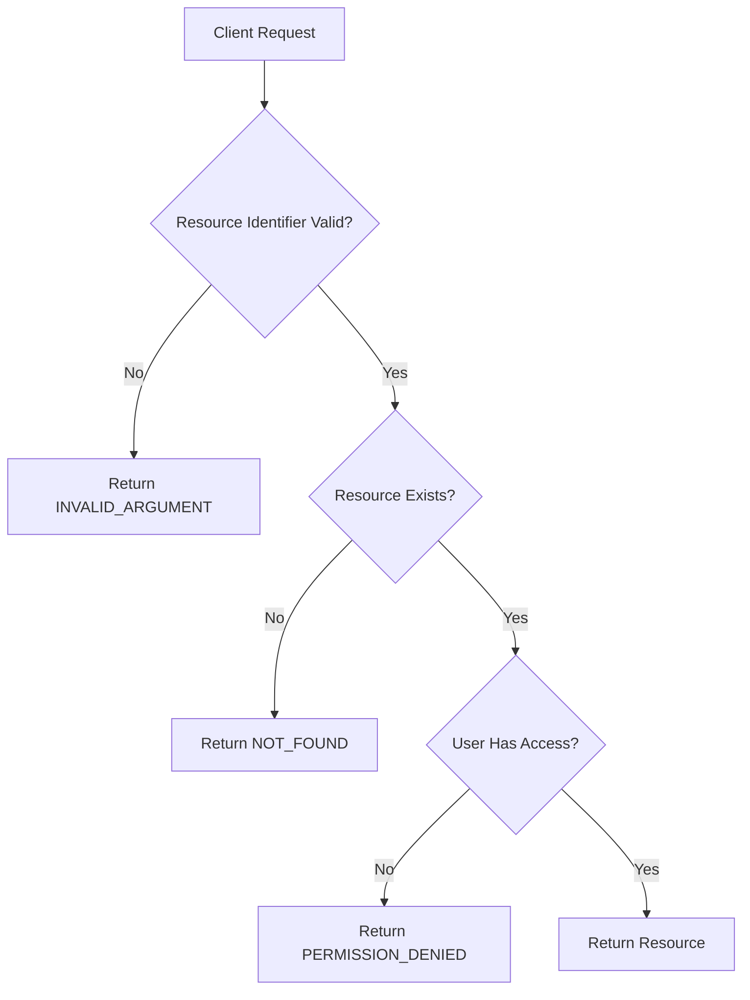
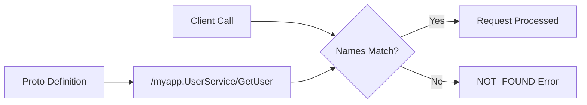
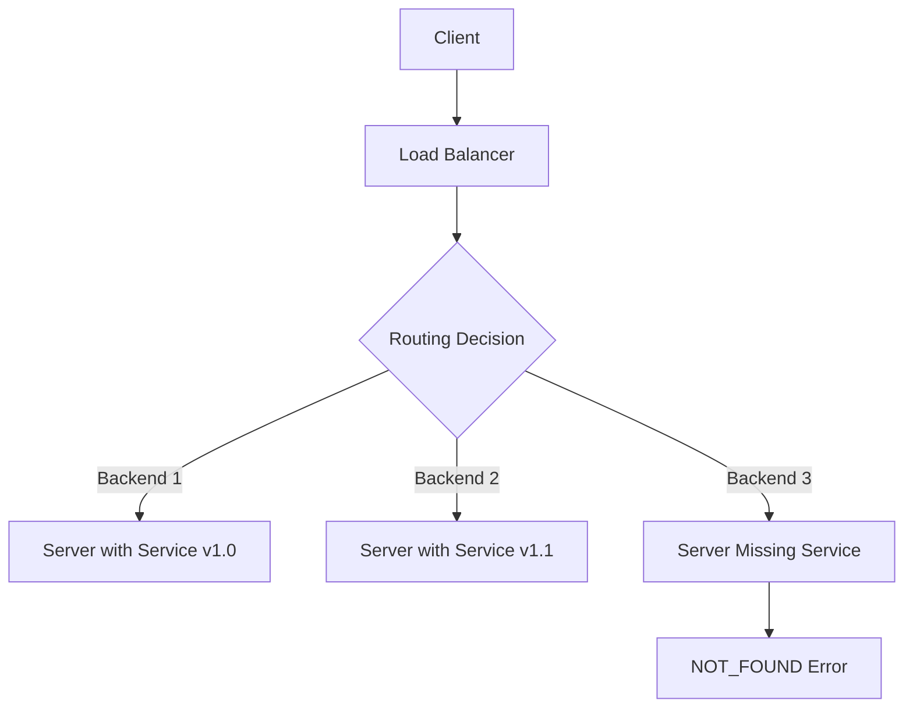
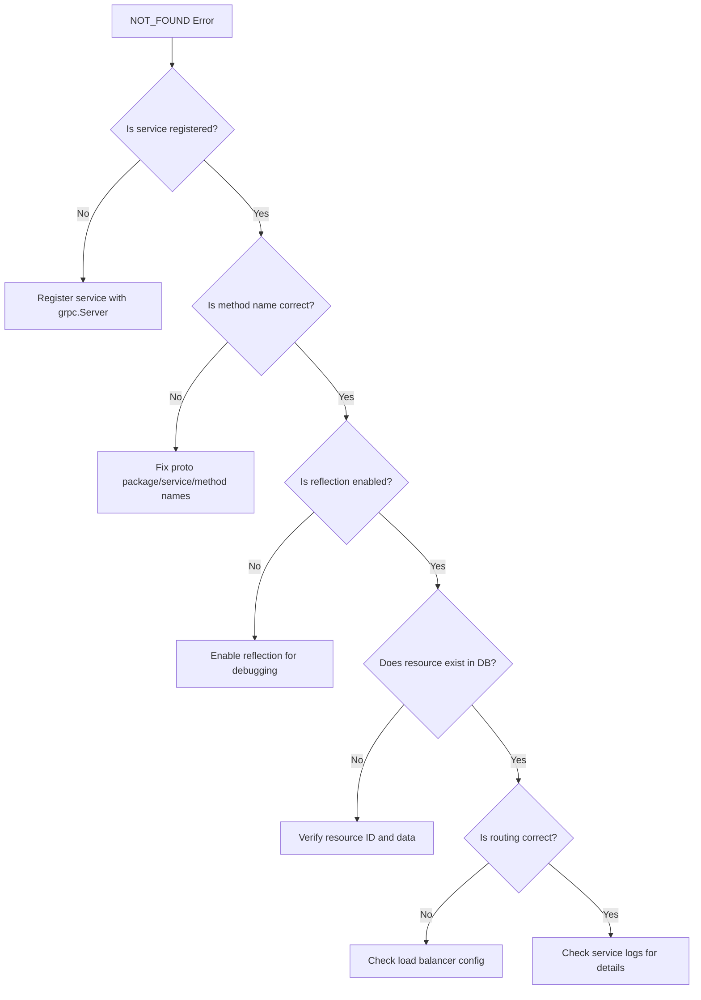

# How to Fix 'Not Found' Status Errors in gRPC

Author: [nawazdhandala](https://www.github.com/nawazdhandala)

Tags: gRPC, Error Handling, Debugging, Microservices, Protocol Buffers

Description: A comprehensive guide to diagnosing and fixing NOT_FOUND status errors in gRPC services, covering common causes, debugging techniques, and best practices for handling missing resources.

---

The NOT_FOUND status code (code 5) in gRPC indicates that a requested resource does not exist. While this seems straightforward, debugging NOT_FOUND errors can be challenging because they can originate from various sources including misconfigured services, incorrect routing, or genuinely missing data. This guide will help you systematically diagnose and fix NOT_FOUND errors in your gRPC applications.

## Understanding the NOT_FOUND Status Code

Before diving into solutions, let us understand when gRPC services should return NOT_FOUND versus other status codes.



### Common Causes of NOT_FOUND Errors

NOT_FOUND errors typically fall into these categories:

1. **Legitimate missing resources** - The requested resource genuinely does not exist
2. **Service discovery issues** - The gRPC method or service itself is not registered
3. **Routing misconfigurations** - Load balancers or proxies routing to wrong backends
4. **Data synchronization issues** - Eventual consistency problems in distributed systems

## Diagnosing NOT_FOUND Errors

### Step 1: Check If the Service Method Is Registered

One of the most common causes of NOT_FOUND is calling a method that does not exist on the server. This happens when the service is not properly registered.

The following code shows how to verify service registration on the server side:

```go
// server/main.go
package main

import (
    "log"
    "net"

    "google.golang.org/grpc"
    "google.golang.org/grpc/reflection"

    pb "myapp/proto/user"
)

func main() {
    lis, err := net.Listen("tcp", ":50051")
    if err != nil {
        log.Fatalf("failed to listen: %v", err)
    }

    server := grpc.NewServer()

    // IMPORTANT: Register your service implementation
    // Missing this line is a common cause of NOT_FOUND errors
    userService := &UserServiceImpl{}
    pb.RegisterUserServiceServer(server, userService)

    // Enable reflection for debugging with grpcurl
    reflection.Register(server)

    log.Printf("gRPC server listening on :50051")
    if err := server.Serve(lis); err != nil {
        log.Fatalf("failed to serve: %v", err)
    }
}
```

### Step 2: Use grpcurl to Verify Service Availability

The grpcurl tool is invaluable for debugging gRPC services. Use it to list available services and methods:

```bash
# List all services (requires reflection to be enabled)
grpcurl -plaintext localhost:50051 list

# List methods for a specific service
grpcurl -plaintext localhost:50051 list myapp.UserService

# Describe a specific method
grpcurl -plaintext localhost:50051 describe myapp.UserService.GetUser
```

If your service does not appear in the list, the service is not registered correctly.

### Step 3: Verify the Fully Qualified Method Name

gRPC uses fully qualified method names in the format `/package.Service/Method`. A mismatch causes NOT_FOUND errors.



Check your proto file to ensure the package and service names match what the client expects:

```protobuf
// user.proto
syntax = "proto3";

// This package name is part of the method path
package myapp;

option go_package = "myapp/proto/user";

service UserService {
    // Full method name: /myapp.UserService/GetUser
    rpc GetUser(GetUserRequest) returns (User);
}

message GetUserRequest {
    string user_id = 1;
}

message User {
    string id = 1;
    string name = 2;
    string email = 3;
}
```

## Fixing Service-Level NOT_FOUND Errors

### Implementing Proper Service Registration

Ensure all your services are registered before starting the server:

```go
// server/services.go
package main

import (
    "google.golang.org/grpc"

    userpb "myapp/proto/user"
    orderpb "myapp/proto/order"
    productpb "myapp/proto/product"
)

// RegisterAllServices registers all gRPC service implementations
// This pattern ensures no service is accidentally omitted
func RegisterAllServices(server *grpc.Server) {
    // User service
    userService := NewUserService()
    userpb.RegisterUserServiceServer(server, userService)

    // Order service
    orderService := NewOrderService()
    orderpb.RegisterOrderServiceServer(server, orderService)

    // Product service
    productService := NewProductService()
    productpb.RegisterProductServiceServer(server, productService)
}
```

### Handling Missing Resources in Service Methods

When resources are genuinely not found, return clear error messages:

```go
// service/user_service.go
package service

import (
    "context"
    "database/sql"
    "errors"

    "google.golang.org/grpc/codes"
    "google.golang.org/grpc/status"

    pb "myapp/proto/user"
)

type UserService struct {
    pb.UnimplementedUserServiceServer
    db *sql.DB
}

func (s *UserService) GetUser(ctx context.Context, req *pb.GetUserRequest) (*pb.User, error) {
    // Validate the request first
    if req.GetUserId() == "" {
        return nil, status.Error(codes.InvalidArgument, "user_id is required")
    }

    // Query the database
    user, err := s.findUserByID(ctx, req.GetUserId())
    if err != nil {
        // Check if the error is "not found"
        if errors.Is(err, sql.ErrNoRows) {
            // Return a clear NOT_FOUND error with context
            return nil, status.Errorf(
                codes.NotFound,
                "user with id %q does not exist",
                req.GetUserId(),
            )
        }
        // For other errors, return INTERNAL
        return nil, status.Errorf(codes.Internal, "failed to fetch user: %v", err)
    }

    return user, nil
}

func (s *UserService) findUserByID(ctx context.Context, userID string) (*pb.User, error) {
    query := "SELECT id, name, email FROM users WHERE id = $1"
    row := s.db.QueryRowContext(ctx, query, userID)

    user := &pb.User{}
    err := row.Scan(&user.Id, &user.Name, &user.Email)
    if err != nil {
        return nil, err
    }

    return user, nil
}
```

## Debugging NOT_FOUND in Load-Balanced Environments

In production environments with load balancers, NOT_FOUND errors might occur due to routing issues.



### Checking Backend Health

Ensure all backends have the service properly registered:

```go
// healthcheck/grpc_health.go
package healthcheck

import (
    "context"
    "time"

    "google.golang.org/grpc"
    "google.golang.org/grpc/health/grpc_health_v1"
)

// CheckServiceHealth verifies a specific service is available
func CheckServiceHealth(addr string, serviceName string) error {
    ctx, cancel := context.WithTimeout(context.Background(), 5*time.Second)
    defer cancel()

    conn, err := grpc.DialContext(ctx, addr, grpc.WithInsecure(), grpc.WithBlock())
    if err != nil {
        return err
    }
    defer conn.Close()

    client := grpc_health_v1.NewHealthClient(conn)
    resp, err := client.Check(ctx, &grpc_health_v1.HealthCheckRequest{
        Service: serviceName,
    })
    if err != nil {
        return err
    }

    if resp.Status != grpc_health_v1.HealthCheckResponse_SERVING {
        return fmt.Errorf("service %s is not serving", serviceName)
    }

    return nil
}
```

### Implementing Server-Side Health Checks

Register health checks for each service:

```go
// server/health.go
package main

import (
    "google.golang.org/grpc"
    "google.golang.org/grpc/health"
    "google.golang.org/grpc/health/grpc_health_v1"
)

func setupHealthChecks(server *grpc.Server) *health.Server {
    healthServer := health.NewServer()

    // Register the health service
    grpc_health_v1.RegisterHealthServer(server, healthServer)

    // Set initial health status for each service
    healthServer.SetServingStatus("myapp.UserService", grpc_health_v1.HealthCheckResponse_SERVING)
    healthServer.SetServingStatus("myapp.OrderService", grpc_health_v1.HealthCheckResponse_SERVING)
    healthServer.SetServingStatus("myapp.ProductService", grpc_health_v1.HealthCheckResponse_SERVING)

    return healthServer
}
```

## Client-Side Handling of NOT_FOUND Errors

Proper client-side error handling improves user experience and debuggability:

```go
// client/user_client.go
package client

import (
    "context"
    "log"

    "google.golang.org/grpc"
    "google.golang.org/grpc/codes"
    "google.golang.org/grpc/status"

    pb "myapp/proto/user"
)

type UserClient struct {
    client pb.UserServiceClient
}

func NewUserClient(conn *grpc.ClientConn) *UserClient {
    return &UserClient{
        client: pb.NewUserServiceClient(conn),
    }
}

func (c *UserClient) GetUser(ctx context.Context, userID string) (*pb.User, error) {
    resp, err := c.client.GetUser(ctx, &pb.GetUserRequest{
        UserId: userID,
    })
    if err != nil {
        return nil, c.handleError(err, "GetUser", userID)
    }
    return resp, nil
}

func (c *UserClient) handleError(err error, method string, resourceID string) error {
    st, ok := status.FromError(err)
    if !ok {
        // Not a gRPC error
        log.Printf("Non-gRPC error in %s: %v", method, err)
        return err
    }

    switch st.Code() {
    case codes.NotFound:
        // Log for debugging but return a clean error to caller
        log.Printf("Resource not found in %s: id=%s, message=%s",
            method, resourceID, st.Message())
        return &ResourceNotFoundError{
            ResourceType: "User",
            ResourceID:   resourceID,
            Message:      st.Message(),
        }

    case codes.Unavailable:
        // Service might be down, could retry
        log.Printf("Service unavailable in %s: %s", method, st.Message())
        return &ServiceUnavailableError{Message: st.Message()}

    default:
        log.Printf("gRPC error in %s: code=%s, message=%s",
            method, st.Code(), st.Message())
        return err
    }
}

// ResourceNotFoundError is a custom error for not found resources
type ResourceNotFoundError struct {
    ResourceType string
    ResourceID   string
    Message      string
}

func (e *ResourceNotFoundError) Error() string {
    return fmt.Sprintf("%s with id %q not found: %s",
        e.ResourceType, e.ResourceID, e.Message)
}

// ServiceUnavailableError indicates the service is temporarily unavailable
type ServiceUnavailableError struct {
    Message string
}

func (e *ServiceUnavailableError) Error() string {
    return fmt.Sprintf("service unavailable: %s", e.Message)
}
```

## Adding Detailed Error Information

Use gRPC's error details to provide more context about NOT_FOUND errors:

```go
// service/errors.go
package service

import (
    "google.golang.org/genproto/googleapis/rpc/errdetails"
    "google.golang.org/grpc/codes"
    "google.golang.org/grpc/status"
)

// NotFoundError creates a detailed NOT_FOUND error
func NotFoundError(resourceType, resourceID string) error {
    st := status.New(codes.NotFound, fmt.Sprintf("%s not found", resourceType))

    // Add resource information
    resourceInfo := &errdetails.ResourceInfo{
        ResourceType: resourceType,
        ResourceName: resourceID,
        Description:  fmt.Sprintf("The requested %s does not exist", resourceType),
    }

    // Add error details
    detailed, err := st.WithDetails(resourceInfo)
    if err != nil {
        // Fall back to simple error if details fail
        return st.Err()
    }

    return detailed.Err()
}

// Usage in service method
func (s *UserService) GetUser(ctx context.Context, req *pb.GetUserRequest) (*pb.User, error) {
    user, err := s.findUserByID(ctx, req.GetUserId())
    if err != nil {
        if errors.Is(err, sql.ErrNoRows) {
            return nil, NotFoundError("User", req.GetUserId())
        }
        return nil, status.Errorf(codes.Internal, "database error: %v", err)
    }
    return user, nil
}
```

## Debugging Checklist

When you encounter a NOT_FOUND error, follow this checklist:



### Quick Debug Commands

```bash
# Check if service is reachable
grpcurl -plaintext localhost:50051 list

# Test a specific method
grpcurl -plaintext -d '{"user_id": "123"}' \
    localhost:50051 myapp.UserService/GetUser

# Check health status
grpcurl -plaintext localhost:50051 \
    grpc.health.v1.Health/Check

# Check specific service health
grpcurl -plaintext -d '{"service": "myapp.UserService"}' \
    localhost:50051 grpc.health.v1.Health/Check
```

## Best Practices

1. **Always validate input first** - Return INVALID_ARGUMENT for bad input before checking if resources exist

2. **Use descriptive error messages** - Include the resource type and identifier in NOT_FOUND messages

3. **Implement health checks** - Register health checks for each service to catch registration issues early

4. **Enable reflection in development** - Makes debugging with grpcurl possible

5. **Log NOT_FOUND errors server-side** - Helps identify patterns of missing resources

6. **Use error details** - Provide structured error information using errdetails

7. **Distinguish between service-level and resource-level NOT_FOUND** - These require different debugging approaches

## Conclusion

NOT_FOUND errors in gRPC can originate from multiple sources, from misconfigured service registration to genuinely missing resources. By following the systematic debugging approach outlined in this guide, you can quickly identify the root cause and implement appropriate fixes. Remember to use tools like grpcurl and health checks to verify service availability, and always provide clear error messages that help both developers and end users understand what went wrong.
