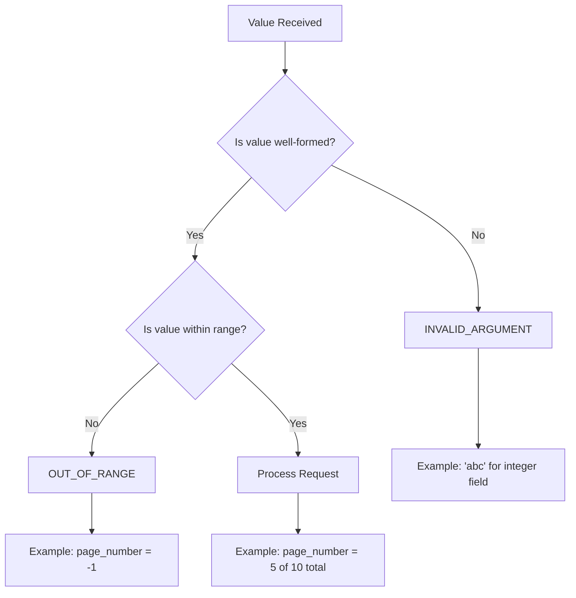
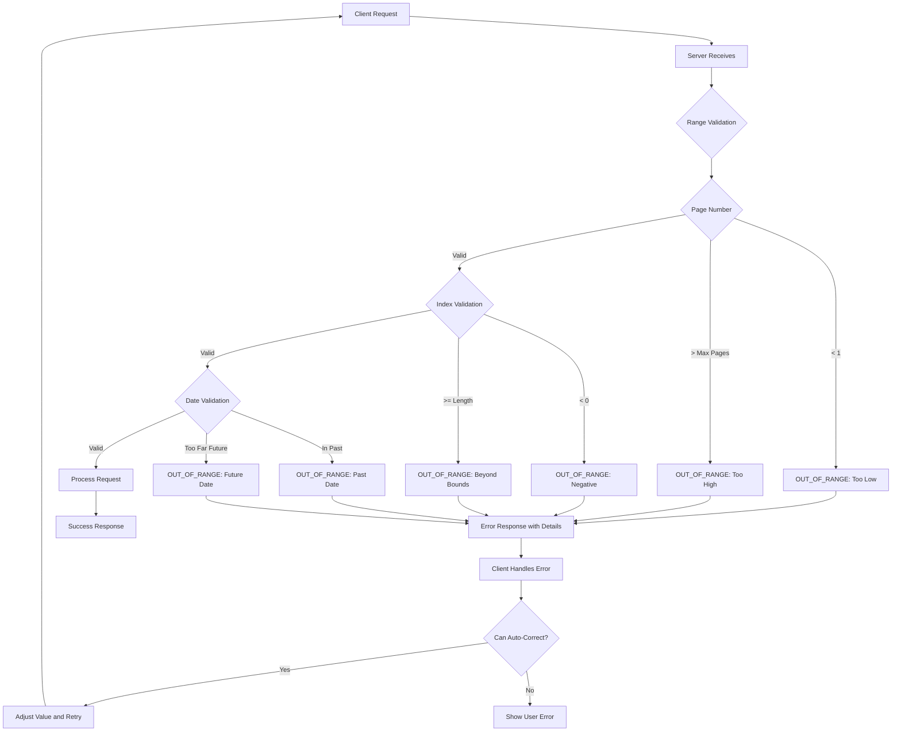

# How to Fix 'Out of Range' Errors in gRPC

Author: [nawazdhandala](https://www.github.com/nawazdhandala)

Tags: gRPC, out of range, error handling, validation, status codes, API design, microservices

Description: A practical guide to understanding, handling, and preventing OUT_OF_RANGE errors in gRPC services with validation patterns and best practices.

---

The OUT_OF_RANGE status code (code 11) in gRPC indicates that an operation was attempted past a valid range. Unlike INVALID_ARGUMENT which indicates malformed input, OUT_OF_RANGE specifically deals with values that are well-formed but fall outside acceptable boundaries. This guide covers how to properly use, handle, and prevent OUT_OF_RANGE errors in your gRPC applications.

## Understanding OUT_OF_RANGE vs INVALID_ARGUMENT

Many developers confuse these two error codes. Here is the key distinction:



### When to Use Each Code

| Scenario | Status Code | Reason |
|----------|-------------|--------|
| Age = -5 | OUT_OF_RANGE | Valid integer, invalid range |
| Age = "twenty" | INVALID_ARGUMENT | Wrong type entirely |
| Page = 999 (only 10 pages exist) | OUT_OF_RANGE | Beyond available data |
| Page = 0 (1-indexed) | OUT_OF_RANGE | Below minimum |
| Offset = -100 in a list | OUT_OF_RANGE | Negative offset |
| Date format wrong | INVALID_ARGUMENT | Malformed input |
| Date in year 3000 | OUT_OF_RANGE | Beyond valid range |
| Seek past end of file | OUT_OF_RANGE | Beyond file bounds |

## Common OUT_OF_RANGE Scenarios

### 1. Pagination Errors

```go
// server/pagination.go
package server

import (
    "context"

    "google.golang.org/genproto/googleapis/rpc/errdetails"
    "google.golang.org/grpc/codes"
    "google.golang.org/grpc/status"
    pb "myapp/proto"
)

type ItemService struct {
    pb.UnimplementedItemServiceServer
    items      []*pb.Item
    pageSize   int32
}

// ListItems demonstrates proper OUT_OF_RANGE handling for pagination
func (s *ItemService) ListItems(ctx context.Context, req *pb.ListItemsRequest) (*pb.ListItemsResponse, error) {
    totalItems := int32(len(s.items))
    pageSize := req.PageSize
    if pageSize <= 0 {
        pageSize = s.pageSize // Default page size
    }

    // Calculate total pages
    totalPages := (totalItems + pageSize - 1) / pageSize
    if totalItems == 0 {
        totalPages = 1 // At least one (empty) page
    }

    // Validate page number
    if req.PageNumber < 1 {
        return nil, s.createOutOfRangeError(
            "page_number",
            req.PageNumber,
            1,
            totalPages,
            "Page number must be at least 1",
        )
    }

    if req.PageNumber > totalPages {
        return nil, s.createOutOfRangeError(
            "page_number",
            req.PageNumber,
            1,
            totalPages,
            fmt.Sprintf("Page %d does not exist, maximum page is %d", req.PageNumber, totalPages),
        )
    }

    // Calculate offset
    offset := (req.PageNumber - 1) * pageSize
    end := offset + pageSize
    if end > totalItems {
        end = totalItems
    }

    return &pb.ListItemsResponse{
        Items:       s.items[offset:end],
        TotalItems:  totalItems,
        TotalPages:  totalPages,
        CurrentPage: req.PageNumber,
        PageSize:    pageSize,
    }, nil
}

func (s *ItemService) createOutOfRangeError(field string, value, min, max int32, description string) error {
    st := status.New(codes.OutOfRange, description)

    // Add detailed error information
    badRequest := &errdetails.BadRequest{
        FieldViolations: []*errdetails.BadRequest_FieldViolation{
            {
                Field:       field,
                Description: description,
            },
        },
    }

    errorInfo := &errdetails.ErrorInfo{
        Reason: "VALUE_OUT_OF_RANGE",
        Domain: "myapp.example.com",
        Metadata: map[string]string{
            "field":         field,
            "provided_value": fmt.Sprintf("%d", value),
            "min_value":     fmt.Sprintf("%d", min),
            "max_value":     fmt.Sprintf("%d", max),
        },
    }

    st, err := st.WithDetails(badRequest, errorInfo)
    if err != nil {
        return status.Error(codes.OutOfRange, description)
    }

    return st.Err()
}
```

### 2. Array/Slice Index Errors

```go
// server/collection.go
package server

import (
    "context"

    "google.golang.org/grpc/codes"
    "google.golang.org/grpc/status"
    pb "myapp/proto"
)

type CollectionService struct {
    pb.UnimplementedCollectionServiceServer
    collections map[string]*Collection
}

type Collection struct {
    ID    string
    Items []string
}

// GetItemAtIndex demonstrates index bounds checking
func (s *CollectionService) GetItemAtIndex(ctx context.Context, req *pb.GetItemAtIndexRequest) (*pb.Item, error) {
    collection, exists := s.collections[req.CollectionId]
    if !exists {
        return nil, status.Errorf(codes.NotFound, "collection %s not found", req.CollectionId)
    }

    length := int32(len(collection.Items))

    // Check for negative index
    if req.Index < 0 {
        return nil, status.Errorf(codes.OutOfRange,
            "index %d is negative, valid range is 0 to %d",
            req.Index, length-1)
    }

    // Check for index beyond bounds
    if req.Index >= length {
        return nil, status.Errorf(codes.OutOfRange,
            "index %d is out of bounds, collection has %d items (valid range: 0 to %d)",
            req.Index, length, length-1)
    }

    return &pb.Item{
        Value: collection.Items[req.Index],
        Index: req.Index,
    }, nil
}

// GetItemsInRange demonstrates range bounds checking
func (s *CollectionService) GetItemsInRange(ctx context.Context, req *pb.GetItemsInRangeRequest) (*pb.ItemsResponse, error) {
    collection, exists := s.collections[req.CollectionId]
    if !exists {
        return nil, status.Errorf(codes.NotFound, "collection %s not found", req.CollectionId)
    }

    length := int32(len(collection.Items))

    // Validate start index
    if req.StartIndex < 0 {
        return nil, status.Errorf(codes.OutOfRange,
            "start_index %d is negative", req.StartIndex)
    }

    if req.StartIndex >= length {
        return nil, status.Errorf(codes.OutOfRange,
            "start_index %d is beyond collection bounds (size: %d)",
            req.StartIndex, length)
    }

    // Validate end index
    if req.EndIndex < req.StartIndex {
        return nil, status.Errorf(codes.InvalidArgument,
            "end_index %d must be greater than or equal to start_index %d",
            req.EndIndex, req.StartIndex)
    }

    if req.EndIndex > length {
        return nil, status.Errorf(codes.OutOfRange,
            "end_index %d exceeds collection bounds (size: %d)",
            req.EndIndex, length)
    }

    items := collection.Items[req.StartIndex:req.EndIndex]
    result := make([]*pb.Item, len(items))
    for i, item := range items {
        result[i] = &pb.Item{
            Value: item,
            Index: req.StartIndex + int32(i),
        }
    }

    return &pb.ItemsResponse{
        Items:      result,
        TotalCount: length,
    }, nil
}
```

### 3. Numeric Range Validation

```go
// server/validation.go
package server

import (
    "context"
    "time"

    "google.golang.org/grpc/codes"
    "google.golang.org/grpc/status"
    pb "myapp/proto"
)

type OrderService struct {
    pb.UnimplementedOrderServiceServer
    maxQuantity int32
    maxAmount   float64
}

// CreateOrder demonstrates numeric range validation
func (s *OrderService) CreateOrder(ctx context.Context, req *pb.CreateOrderRequest) (*pb.Order, error) {
    // Validate quantity
    if req.Quantity < 1 {
        return nil, status.Errorf(codes.OutOfRange,
            "quantity must be at least 1, got %d", req.Quantity)
    }

    if req.Quantity > s.maxQuantity {
        return nil, status.Errorf(codes.OutOfRange,
            "quantity %d exceeds maximum allowed (%d)",
            req.Quantity, s.maxQuantity)
    }

    // Validate price (assuming positive pricing)
    if req.UnitPrice <= 0 {
        return nil, status.Errorf(codes.OutOfRange,
            "unit_price must be positive, got %.2f", req.UnitPrice)
    }

    // Calculate total and validate
    total := float64(req.Quantity) * req.UnitPrice
    if total > s.maxAmount {
        return nil, status.Errorf(codes.OutOfRange,
            "order total %.2f exceeds maximum allowed (%.2f)",
            total, s.maxAmount)
    }

    // Validate discount percentage
    if req.DiscountPercent < 0 || req.DiscountPercent > 100 {
        return nil, status.Errorf(codes.OutOfRange,
            "discount_percent must be between 0 and 100, got %.2f",
            req.DiscountPercent)
    }

    return &pb.Order{
        Id:       generateOrderID(),
        Quantity: req.Quantity,
        Total:    total * (1 - req.DiscountPercent/100),
    }, nil
}
```

### 4. Date and Time Range Errors

```go
// server/scheduling.go
package server

import (
    "context"
    "time"

    "google.golang.org/grpc/codes"
    "google.golang.org/grpc/status"
    "google.golang.org/protobuf/types/known/timestamppb"
    pb "myapp/proto"
)

type SchedulingService struct {
    pb.UnimplementedSchedulingServiceServer
    minBookingDate time.Time
    maxBookingDate time.Time
}

// ScheduleAppointment demonstrates date range validation
func (s *SchedulingService) ScheduleAppointment(ctx context.Context, req *pb.ScheduleRequest) (*pb.Appointment, error) {
    requestedTime := req.RequestedTime.AsTime()
    now := time.Now()

    // Cannot schedule in the past
    if requestedTime.Before(now) {
        return nil, status.Errorf(codes.OutOfRange,
            "cannot schedule appointment in the past: requested %s, current time is %s",
            requestedTime.Format(time.RFC3339),
            now.Format(time.RFC3339))
    }

    // Minimum booking window (e.g., 24 hours in advance)
    minTime := now.Add(24 * time.Hour)
    if requestedTime.Before(minTime) {
        return nil, status.Errorf(codes.OutOfRange,
            "appointments must be scheduled at least 24 hours in advance, earliest available: %s",
            minTime.Format(time.RFC3339))
    }

    // Maximum booking window (e.g., 90 days in advance)
    maxTime := now.Add(90 * 24 * time.Hour)
    if requestedTime.After(maxTime) {
        return nil, status.Errorf(codes.OutOfRange,
            "cannot schedule more than 90 days in advance, latest available: %s",
            maxTime.Format(time.RFC3339))
    }

    // Business hours validation (9 AM to 5 PM)
    hour := requestedTime.Hour()
    if hour < 9 || hour >= 17 {
        return nil, status.Errorf(codes.OutOfRange,
            "appointments are only available between 9:00 AM and 5:00 PM, requested hour: %d",
            hour)
    }

    // Weekend validation
    day := requestedTime.Weekday()
    if day == time.Saturday || day == time.Sunday {
        return nil, status.Errorf(codes.OutOfRange,
            "appointments are not available on weekends, requested day: %s",
            day.String())
    }

    return &pb.Appointment{
        Id:            generateAppointmentID(),
        ScheduledTime: timestamppb.New(requestedTime),
        Status:        pb.AppointmentStatus_CONFIRMED,
    }, nil
}
```

### 5. File/Stream Position Errors

```go
// server/file_service.go
package server

import (
    "context"
    "io"
    "sync"

    "google.golang.org/grpc/codes"
    "google.golang.org/grpc/status"
    pb "myapp/proto"
)

type FileService struct {
    pb.UnimplementedFileServiceServer
    files   map[string]*FileHandle
    filesMu sync.RWMutex
}

type FileHandle struct {
    id       string
    size     int64
    position int64
    data     []byte
    mu       sync.Mutex
}

// Seek demonstrates file position range validation
func (s *FileService) Seek(ctx context.Context, req *pb.SeekRequest) (*pb.SeekResponse, error) {
    s.filesMu.RLock()
    file, exists := s.files[req.FileId]
    s.filesMu.RUnlock()

    if !exists {
        return nil, status.Errorf(codes.NotFound, "file %s not found", req.FileId)
    }

    file.mu.Lock()
    defer file.mu.Unlock()

    var newPosition int64

    switch req.Whence {
    case pb.SeekWhence_SEEK_SET:
        newPosition = req.Offset
    case pb.SeekWhence_SEEK_CUR:
        newPosition = file.position + req.Offset
    case pb.SeekWhence_SEEK_END:
        newPosition = file.size + req.Offset
    default:
        return nil, status.Errorf(codes.InvalidArgument,
            "invalid whence value: %d", req.Whence)
    }

    // Validate new position
    if newPosition < 0 {
        return nil, status.Errorf(codes.OutOfRange,
            "cannot seek to negative position: calculated position %d from offset %d",
            newPosition, req.Offset)
    }

    if newPosition > file.size {
        return nil, status.Errorf(codes.OutOfRange,
            "cannot seek past end of file: position %d exceeds file size %d",
            newPosition, file.size)
    }

    file.position = newPosition

    return &pb.SeekResponse{
        Position: newPosition,
        FileSize: file.size,
    }, nil
}

// Read demonstrates read range validation
func (s *FileService) Read(ctx context.Context, req *pb.ReadRequest) (*pb.ReadResponse, error) {
    s.filesMu.RLock()
    file, exists := s.files[req.FileId]
    s.filesMu.RUnlock()

    if !exists {
        return nil, status.Errorf(codes.NotFound, "file %s not found", req.FileId)
    }

    file.mu.Lock()
    defer file.mu.Unlock()

    // Calculate read bounds
    startPos := file.position
    if req.Offset != nil {
        startPos = *req.Offset
    }

    // Validate start position
    if startPos < 0 {
        return nil, status.Errorf(codes.OutOfRange,
            "read offset %d is negative", startPos)
    }

    if startPos >= file.size {
        return nil, status.Errorf(codes.OutOfRange,
            "read offset %d is at or past end of file (size: %d)",
            startPos, file.size)
    }

    // Calculate bytes to read
    bytesToRead := req.Length
    if bytesToRead <= 0 {
        bytesToRead = 4096 // Default chunk size
    }

    endPos := startPos + int64(bytesToRead)
    if endPos > file.size {
        endPos = file.size
    }

    data := file.data[startPos:endPos]
    file.position = endPos

    return &pb.ReadResponse{
        Data:       data,
        BytesRead:  int32(len(data)),
        Position:   endPos,
        Eof:        endPos >= file.size,
    }, nil
}
```

## Client-Side Handling

### Comprehensive Error Handler

```go
// client/error_handler.go
package client

import (
    "log"
    "strings"

    "google.golang.org/genproto/googleapis/rpc/errdetails"
    "google.golang.org/grpc/codes"
    "google.golang.org/grpc/status"
)

type OutOfRangeInfo struct {
    Field         string
    ProvidedValue string
    MinValue      string
    MaxValue      string
    Description   string
}

// HandleOutOfRangeError extracts detailed information from OUT_OF_RANGE errors
func HandleOutOfRangeError(err error) (*OutOfRangeInfo, bool) {
    st, ok := status.FromError(err)
    if !ok || st.Code() != codes.OutOfRange {
        return nil, false
    }

    info := &OutOfRangeInfo{
        Description: st.Message(),
    }

    // Extract details
    for _, detail := range st.Details() {
        switch d := detail.(type) {
        case *errdetails.BadRequest:
            for _, violation := range d.FieldViolations {
                info.Field = violation.Field
                if info.Description == "" {
                    info.Description = violation.Description
                }
            }

        case *errdetails.ErrorInfo:
            if d.Metadata != nil {
                info.Field = d.Metadata["field"]
                info.ProvidedValue = d.Metadata["provided_value"]
                info.MinValue = d.Metadata["min_value"]
                info.MaxValue = d.Metadata["max_value"]
            }
        }
    }

    return info, true
}

// PaginationClient demonstrates handling pagination OUT_OF_RANGE errors
type PaginationClient struct {
    client pb.ItemServiceClient
}

func (c *PaginationClient) ListItemsWithAutoCorrect(ctx context.Context, pageNumber int32) (*pb.ListItemsResponse, error) {
    response, err := c.client.ListItems(ctx, &pb.ListItemsRequest{
        PageNumber: pageNumber,
    })

    if err == nil {
        return response, nil
    }

    info, isOutOfRange := HandleOutOfRangeError(err)
    if !isOutOfRange {
        return nil, err
    }

    log.Printf("Page %d out of range: %s", pageNumber, info.Description)

    // Try to auto-correct by fetching valid page
    if info.MaxValue != "" {
        maxPage, _ := strconv.ParseInt(info.MaxValue, 10, 32)
        if maxPage > 0 {
            log.Printf("Auto-correcting to max page: %d", maxPage)
            return c.client.ListItems(ctx, &pb.ListItemsRequest{
                PageNumber: int32(maxPage),
            })
        }
    }

    // Fallback to first page
    log.Printf("Falling back to first page")
    return c.client.ListItems(ctx, &pb.ListItemsRequest{
        PageNumber: 1,
    })
}
```

### Input Sanitization

```go
// client/sanitizer.go
package client

import (
    "time"
)

type InputSanitizer struct {
    defaults SanitizerDefaults
}

type SanitizerDefaults struct {
    MinPage        int32
    MaxPage        int32
    DefaultPage    int32
    MinQuantity    int32
    MaxQuantity    int32
    MinBookingDays int
    MaxBookingDays int
}

func NewInputSanitizer(defaults SanitizerDefaults) *InputSanitizer {
    return &InputSanitizer{defaults: defaults}
}

// SanitizePage ensures page number is within valid range
func (s *InputSanitizer) SanitizePage(page int32, totalPages int32) int32 {
    if page < s.defaults.MinPage {
        return s.defaults.DefaultPage
    }

    maxPage := totalPages
    if maxPage > s.defaults.MaxPage {
        maxPage = s.defaults.MaxPage
    }

    if page > maxPage {
        return maxPage
    }

    return page
}

// SanitizeQuantity ensures quantity is within valid range
func (s *InputSanitizer) SanitizeQuantity(quantity int32) int32 {
    if quantity < s.defaults.MinQuantity {
        return s.defaults.MinQuantity
    }
    if quantity > s.defaults.MaxQuantity {
        return s.defaults.MaxQuantity
    }
    return quantity
}

// SanitizeBookingDate ensures booking date is within valid range
func (s *InputSanitizer) SanitizeBookingDate(requested time.Time) time.Time {
    now := time.Now()

    minDate := now.AddDate(0, 0, s.defaults.MinBookingDays)
    maxDate := now.AddDate(0, 0, s.defaults.MaxBookingDays)

    if requested.Before(minDate) {
        return minDate
    }
    if requested.After(maxDate) {
        return maxDate
    }

    return requested
}

// SanitizeIndex ensures index is within valid range
func (s *InputSanitizer) SanitizeIndex(index int32, length int32) int32 {
    if index < 0 {
        return 0
    }
    if length > 0 && index >= length {
        return length - 1
    }
    return index
}
```

## Validation Middleware

```go
// middleware/validation.go
package middleware

import (
    "context"
    "reflect"

    "google.golang.org/grpc"
    "google.golang.org/grpc/codes"
    "google.golang.org/grpc/status"
)

// RangeValidator interface for request validation
type RangeValidator interface {
    ValidateRanges() error
}

// ValidationInterceptor provides automatic range validation
func ValidationInterceptor() grpc.UnaryServerInterceptor {
    return func(
        ctx context.Context,
        req interface{},
        info *grpc.UnaryServerInfo,
        handler grpc.UnaryHandler,
    ) (interface{}, error) {
        // Check if request implements RangeValidator
        if validator, ok := req.(RangeValidator); ok {
            if err := validator.ValidateRanges(); err != nil {
                return nil, err
            }
        }

        return handler(ctx, req)
    }
}

// Example request with range validation
type ListItemsRequestWithValidation struct {
    PageNumber int32
    PageSize   int32
    MaxResults int32
}

func (r *ListItemsRequestWithValidation) ValidateRanges() error {
    if r.PageNumber < 1 {
        return status.Errorf(codes.OutOfRange,
            "page_number must be at least 1, got %d", r.PageNumber)
    }

    if r.PageNumber > 1000 {
        return status.Errorf(codes.OutOfRange,
            "page_number exceeds maximum of 1000, got %d", r.PageNumber)
    }

    if r.PageSize < 1 {
        return status.Errorf(codes.OutOfRange,
            "page_size must be at least 1, got %d", r.PageSize)
    }

    if r.PageSize > 100 {
        return status.Errorf(codes.OutOfRange,
            "page_size exceeds maximum of 100, got %d", r.PageSize)
    }

    return nil
}
```

## Error Flow Diagram



## Best Practices

1. **Be specific in error messages**: Include the actual value, minimum, and maximum in the message
2. **Use error details**: Include ErrorInfo with metadata for programmatic handling
3. **Distinguish from INVALID_ARGUMENT**: OUT_OF_RANGE is for well-formed values outside bounds
4. **Provide suggestions**: When possible, suggest the nearest valid value
5. **Validate early**: Check ranges before expensive operations
6. **Client-side validation**: Pre-validate when possible to reduce round trips
7. **Document ranges**: Clearly document valid ranges in your API specifications
8. **Consider auto-correction**: Some cases may warrant automatic adjustment to valid values
9. **Log range violations**: Track patterns to identify UX or API design issues
10. **Use middleware**: Implement reusable validation through interceptors

## Conclusion

OUT_OF_RANGE errors in gRPC provide a clear signal that input values, while technically valid, fall outside acceptable boundaries. By implementing proper validation, providing detailed error information, and handling these errors gracefully on the client side, you can create robust APIs that guide users toward valid inputs. Remember to distinguish between malformed input (INVALID_ARGUMENT) and out-of-bounds values (OUT_OF_RANGE) to provide the most helpful feedback to API consumers.
