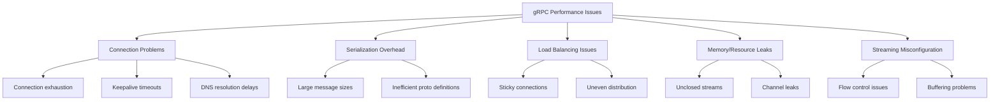
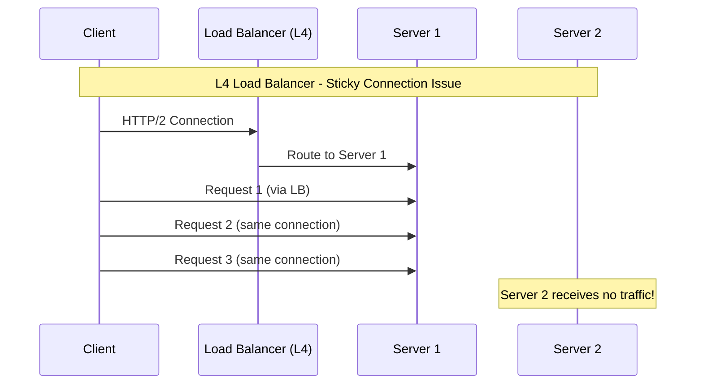

# How to Fix gRPC Performance Issues

Author: [nawazdhandala](https://www.github.com/nawazdhandala)

Tags: gRPC, Performance, Microservices, Protocol Buffers, Streaming, Load Balancing, Debugging

Description: A practical guide to identifying and fixing common gRPC performance issues, including connection management, streaming optimization, load balancing, and monitoring strategies.

---

> gRPC is a high-performance RPC framework that uses HTTP/2 and Protocol Buffers. While it offers significant performance benefits over REST, misconfiguration can lead to latency issues, connection problems, and throughput bottlenecks. This guide covers the most common gRPC performance issues and how to fix them.

gRPC powers some of the most demanding microservices architectures in production. Getting the performance right requires understanding how connection multiplexing, streaming, and load balancing work together.

---

## Common gRPC Performance Issues



---

## Connection Management

### Problem: Connection Exhaustion

One of the most common issues is creating too many connections or not reusing them properly.

```python
# BAD: Creating a new channel for every request
# This creates connection overhead and can exhaust file descriptors
def make_request_bad(data):
    # New connection for every call - very inefficient
    channel = grpc.insecure_channel('localhost:50051')
    stub = service_pb2_grpc.MyServiceStub(channel)
    response = stub.ProcessData(data)
    channel.close()
    return response

# GOOD: Reuse channels across requests
# Channels are thread-safe and multiplex requests over HTTP/2
class GrpcClient:
    def __init__(self, address):
        # Create channel once and reuse
        # gRPC channels handle connection pooling internally
        self.channel = grpc.insecure_channel(
            address,
            options=[
                # Max number of concurrent streams per connection
                ('grpc.max_concurrent_streams', 100),
                # Enable keepalive pings to detect dead connections
                ('grpc.keepalive_time_ms', 30000),
                # Timeout for keepalive ping response
                ('grpc.keepalive_timeout_ms', 10000),
                # Allow keepalive without active calls
                ('grpc.keepalive_permit_without_calls', True),
            ]
        )
        self.stub = service_pb2_grpc.MyServiceStub(self.channel)

    def make_request(self, data):
        # Reuse the existing channel
        return self.stub.ProcessData(data)

    def close(self):
        self.channel.close()

# Usage: Create client once, use for multiple requests
client = GrpcClient('localhost:50051')
for data in items:
    response = client.make_request(data)
```

### Go Implementation with Connection Pooling

```go
package main

import (
    "context"
    "sync"
    "time"

    "google.golang.org/grpc"
    "google.golang.org/grpc/keepalive"
)

// ConnectionPool manages gRPC connections efficiently
type ConnectionPool struct {
    mu       sync.RWMutex
    conns    map[string]*grpc.ClientConn
    opts     []grpc.DialOption
}

// NewConnectionPool creates a pool with optimized settings
func NewConnectionPool() *ConnectionPool {
    // Configure keepalive parameters for long-lived connections
    kaParams := keepalive.ClientParameters{
        Time:                30 * time.Second, // Send keepalive every 30s
        Timeout:             10 * time.Second, // Wait 10s for keepalive response
        PermitWithoutStream: true,             // Send keepalive even without active RPCs
    }

    opts := []grpc.DialOption{
        grpc.WithKeepaliveParams(kaParams),
        grpc.WithDefaultCallOptions(
            // Set maximum message sizes
            grpc.MaxCallRecvMsgSize(10 * 1024 * 1024), // 10MB receive
            grpc.MaxCallSendMsgSize(10 * 1024 * 1024), // 10MB send
        ),
        // Enable automatic retry with backoff
        grpc.WithDefaultServiceConfig(`{
            "methodConfig": [{
                "name": [{"service": ""}],
                "retryPolicy": {
                    "maxAttempts": 3,
                    "initialBackoff": "0.1s",
                    "maxBackoff": "1s",
                    "backoffMultiplier": 2,
                    "retryableStatusCodes": ["UNAVAILABLE", "UNKNOWN"]
                }
            }]
        }`),
    }

    return &ConnectionPool{
        conns: make(map[string]*grpc.ClientConn),
        opts:  opts,
    }
}

// GetConnection returns an existing connection or creates a new one
func (p *ConnectionPool) GetConnection(ctx context.Context, addr string) (*grpc.ClientConn, error) {
    // Check for existing connection
    p.mu.RLock()
    if conn, ok := p.conns[addr]; ok {
        p.mu.RUnlock()
        return conn, nil
    }
    p.mu.RUnlock()

    // Create new connection
    p.mu.Lock()
    defer p.mu.Unlock()

    // Double-check after acquiring write lock
    if conn, ok := p.conns[addr]; ok {
        return conn, nil
    }

    conn, err := grpc.DialContext(ctx, addr, p.opts...)
    if err != nil {
        return nil, err
    }

    p.conns[addr] = conn
    return conn, nil
}

// Close shuts down all connections
func (p *ConnectionPool) Close() {
    p.mu.Lock()
    defer p.mu.Unlock()

    for _, conn := range p.conns {
        conn.Close()
    }
}
```

---

## Keepalive Configuration

### Problem: Connection Timeouts Behind Load Balancers

Load balancers and proxies often close idle connections. Configure keepalive to maintain connections:

```python
import grpc

# Server-side keepalive configuration
server_options = [
    # Minimum time between keepalive pings from client
    ('grpc.keepalive_time_ms', 30000),
    # Time to wait for keepalive response
    ('grpc.keepalive_timeout_ms', 10000),
    # Allow keepalive without active RPCs
    ('grpc.keepalive_permit_without_calls', True),
    # Minimum time between pings from client (enforce rate limiting)
    ('grpc.http2.min_ping_interval_without_data_ms', 30000),
    # Maximum connection idle time before closing
    ('grpc.max_connection_idle_ms', 300000),  # 5 minutes
    # Maximum connection age for graceful recycling
    ('grpc.max_connection_age_ms', 600000),   # 10 minutes
    # Grace period after max_connection_age
    ('grpc.max_connection_age_grace_ms', 30000),
]

server = grpc.server(
    futures.ThreadPoolExecutor(max_workers=50),
    options=server_options
)

# Client-side keepalive configuration
client_options = [
    ('grpc.keepalive_time_ms', 30000),
    ('grpc.keepalive_timeout_ms', 10000),
    ('grpc.keepalive_permit_without_calls', True),
    # Enable HTTP/2 ping on write
    ('grpc.http2.min_time_between_pings_ms', 30000),
]

channel = grpc.insecure_channel('server:50051', options=client_options)
```

---

## Load Balancing

### Problem: Sticky Connections

gRPC uses HTTP/2, which multiplexes requests over a single connection. Without proper load balancing, all requests go to one server.



### Solution: Client-Side Load Balancing

```go
package main

import (
    "google.golang.org/grpc"
    "google.golang.org/grpc/resolver"
)

// Configure client-side load balancing
func createLoadBalancedChannel(addresses []string) (*grpc.ClientConn, error) {
    // Register a static resolver for the addresses
    resolver.SetDefaultScheme("dns")

    // Use round-robin load balancing policy
    conn, err := grpc.Dial(
        // Use DNS resolver for service discovery
        "dns:///my-grpc-service.example.com:50051",
        grpc.WithDefaultServiceConfig(`{
            "loadBalancingPolicy": "round_robin",
            "healthCheckConfig": {
                "serviceName": "my.service.Health"
            }
        }`),
        grpc.WithInsecure(),
    )

    return conn, err
}

// For Kubernetes, use headless service for DNS-based discovery
// Service definition:
// apiVersion: v1
// kind: Service
// metadata:
//   name: my-grpc-service
// spec:
//   clusterIP: None  # Headless service
//   ports:
//     - port: 50051
//   selector:
//     app: my-grpc-server
```

### Python Client-Side Load Balancing

```python
import grpc

# Enable round-robin load balancing
channel = grpc.insecure_channel(
    # Use DNS resolver with multiple addresses
    'dns:///my-service.example.com:50051',
    options=[
        # Enable round-robin load balancing
        ('grpc.lb_policy_name', 'round_robin'),
        # Enable health checking
        ('grpc.enable_retries', True),
        # Service config with retry policy
        ('grpc.service_config', '''
        {
            "loadBalancingPolicy": "round_robin",
            "healthCheckConfig": {
                "serviceName": "grpc.health.v1.Health"
            }
        }
        '''),
    ]
)
```

---

## Message Size Optimization

### Problem: Large Messages Causing Latency

```protobuf
// BAD: Inefficient proto definition
message BadUserResponse {
    // Repeated nested messages with redundant data
    repeated UserWithFullDetails users = 1;
}

message UserWithFullDetails {
    int64 id = 1;
    string name = 2;
    string email = 3;
    bytes profile_image = 4;  // Large binary data in every response
    repeated Order complete_order_history = 5;  // Unbounded list
}

// GOOD: Efficient proto definition with pagination and selective fields
message UserListRequest {
    int32 page_size = 1;  // Limit response size
    string page_token = 2;  // For pagination
    repeated string fields = 3;  // Field mask for selective retrieval
}

message UserListResponse {
    repeated UserSummary users = 1;  // Only summary data
    string next_page_token = 2;
    int32 total_count = 3;
}

message UserSummary {
    int64 id = 1;
    string name = 2;
    string email = 3;
    // No large binary data or unbounded lists
}

// Separate RPC for detailed user data when needed
message GetUserDetailRequest {
    int64 user_id = 1;
    bool include_profile_image = 2;
    bool include_recent_orders = 3;
    int32 order_limit = 4;
}
```

### Server Configuration for Large Messages

```python
import grpc
from concurrent import futures

# Configure maximum message sizes
MAX_MESSAGE_SIZE = 50 * 1024 * 1024  # 50MB

server_options = [
    ('grpc.max_send_message_length', MAX_MESSAGE_SIZE),
    ('grpc.max_receive_message_length', MAX_MESSAGE_SIZE),
]

server = grpc.server(
    futures.ThreadPoolExecutor(max_workers=50),
    options=server_options
)

# Client configuration to match
channel = grpc.insecure_channel(
    'localhost:50051',
    options=[
        ('grpc.max_send_message_length', MAX_MESSAGE_SIZE),
        ('grpc.max_receive_message_length', MAX_MESSAGE_SIZE),
    ]
)
```

---

## Streaming Optimization

### Problem: Backpressure and Flow Control

```python
import grpc

class OptimizedStreamingService(service_pb2_grpc.DataServiceServicer):

    def StreamData(self, request, context):
        """Server streaming with proper flow control"""

        # Process data in chunks to manage memory
        chunk_size = 1000
        total_items = get_total_count(request.query)

        for offset in range(0, total_items, chunk_size):
            # Check if client is still connected
            if context.is_active():
                # Fetch chunk of data
                items = fetch_items(request.query, offset, chunk_size)

                for item in items:
                    # Yield items one at a time for proper flow control
                    yield service_pb2.DataResponse(item=item)
            else:
                # Client disconnected, stop processing
                return

    def BidirectionalStream(self, request_iterator, context):
        """Bidirectional streaming with backpressure handling"""

        # Use a bounded queue to handle backpressure
        import queue
        result_queue = queue.Queue(maxsize=100)

        def process_requests():
            for request in request_iterator:
                if not context.is_active():
                    break
                # Process request and put result in queue
                result = process_item(request)
                # This will block if queue is full (backpressure)
                result_queue.put(result)
            result_queue.put(None)  # Signal completion

        # Start processing in background
        import threading
        processor = threading.Thread(target=process_requests)
        processor.start()

        # Yield results as they become available
        while True:
            result = result_queue.get()
            if result is None:
                break
            yield result

        processor.join()
```

### Go Streaming with Context Cancellation

```go
package main

import (
    "context"
    "io"

    pb "myservice/proto"
)

// ServerStream handles server-side streaming with proper cleanup
func (s *server) StreamData(req *pb.StreamRequest, stream pb.DataService_StreamDataServer) error {
    ctx := stream.Context()

    // Create a channel to fetch data
    dataChan := make(chan *pb.DataItem, 100)
    errChan := make(chan error, 1)

    // Fetch data in background
    go func() {
        defer close(dataChan)
        items, err := s.fetchItems(ctx, req.Query)
        if err != nil {
            errChan <- err
            return
        }
        for _, item := range items {
            select {
            case <-ctx.Done():
                return
            case dataChan <- item:
            }
        }
    }()

    // Stream results to client
    for {
        select {
        case <-ctx.Done():
            // Client disconnected or cancelled
            return ctx.Err()
        case err := <-errChan:
            return err
        case item, ok := <-dataChan:
            if !ok {
                // All data sent
                return nil
            }
            if err := stream.Send(&pb.DataResponse{Item: item}); err != nil {
                return err
            }
        }
    }
}

// ClientStream handles client-side streaming efficiently
func (c *client) SendDataStream(ctx context.Context, items []*pb.DataItem) error {
    stream, err := c.stub.ProcessDataStream(ctx)
    if err != nil {
        return err
    }

    for _, item := range items {
        // Check context before sending
        if ctx.Err() != nil {
            return ctx.Err()
        }

        if err := stream.Send(&pb.DataRequest{Item: item}); err != nil {
            return err
        }
    }

    // Close send side and get response
    response, err := stream.CloseAndRecv()
    if err != nil {
        return err
    }

    return nil
}
```

---

## Monitoring and Debugging

### Interceptors for Metrics

```python
import grpc
import time
from prometheus_client import Counter, Histogram

# Prometheus metrics
grpc_requests = Counter(
    'grpc_requests_total',
    'Total gRPC requests',
    ['method', 'status']
)

grpc_latency = Histogram(
    'grpc_request_duration_seconds',
    'gRPC request latency',
    ['method'],
    buckets=[.005, .01, .025, .05, .1, .25, .5, 1, 2.5, 5, 10]
)

def metrics_interceptor(continuation, call_details, request):
    """Client interceptor for collecting metrics"""
    method = call_details.method
    start_time = time.time()

    try:
        response = continuation(call_details, request)
        grpc_requests.labels(method=method, status='OK').inc()
        return response
    except grpc.RpcError as e:
        grpc_requests.labels(method=method, status=e.code().name).inc()
        raise
    finally:
        duration = time.time() - start_time
        grpc_latency.labels(method=method).observe(duration)

# Apply interceptor to channel
channel = grpc.intercept_channel(
    grpc.insecure_channel('localhost:50051'),
    grpc.unary_unary_rpc_method_handler(metrics_interceptor)
)
```

### Enable gRPC Debug Logging

```python
import os
import logging

# Enable verbose gRPC logging
os.environ['GRPC_VERBOSITY'] = 'DEBUG'
os.environ['GRPC_TRACE'] = 'all'

# Or selectively enable traces
os.environ['GRPC_TRACE'] = 'tcp,http,api'

# Configure Python logging
logging.basicConfig(level=logging.DEBUG)
```

---

## Best Practices Summary

1. **Reuse channels and connections** - Create channels once and share them across requests
2. **Configure keepalive properly** - Match client and server settings, consider load balancer timeouts
3. **Use client-side load balancing** - Avoid sticky connections with round-robin or other policies
4. **Optimize message sizes** - Use pagination, field masks, and separate RPCs for large data
5. **Handle streaming backpressure** - Use bounded queues and check context cancellation
6. **Monitor everything** - Use interceptors to collect latency and error metrics
7. **Set appropriate timeouts** - Use deadlines for all RPC calls

---

## Conclusion

gRPC performance issues often stem from connection management, load balancing misconfiguration, or improper streaming handling. By reusing connections, implementing client-side load balancing, and properly handling backpressure in streams, you can achieve the high performance that gRPC promises.

The key is understanding that gRPC's HTTP/2 foundation changes how you think about connections - a single connection can handle many concurrent requests, but this requires proper configuration to avoid hotspots.

---

*Need to monitor your gRPC services in production? [OneUptime](https://oneuptime.com) provides distributed tracing and metrics collection that helps you identify gRPC performance bottlenecks before they affect users.*

**Related Reading:**
- [How to Handle Microservices Performance](https://oneuptime.com/blog)
- [Distributed Tracing for Microservices](https://oneuptime.com/blog)
