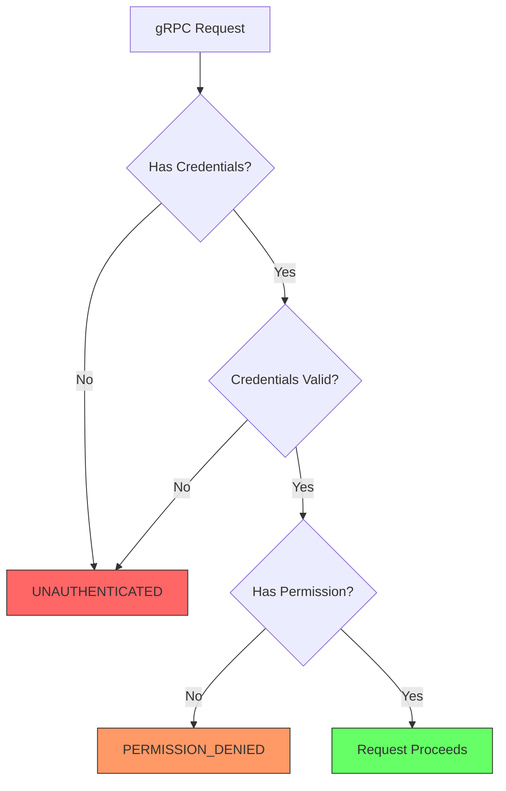
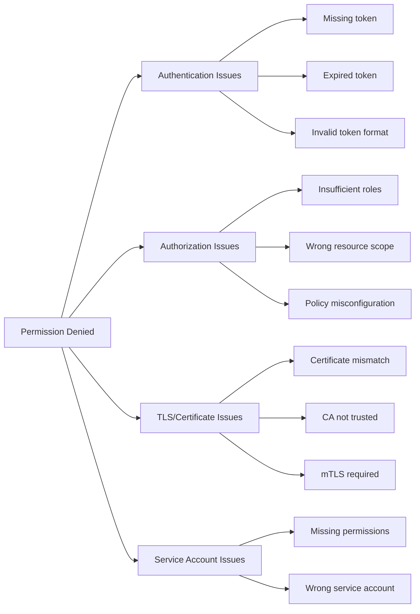
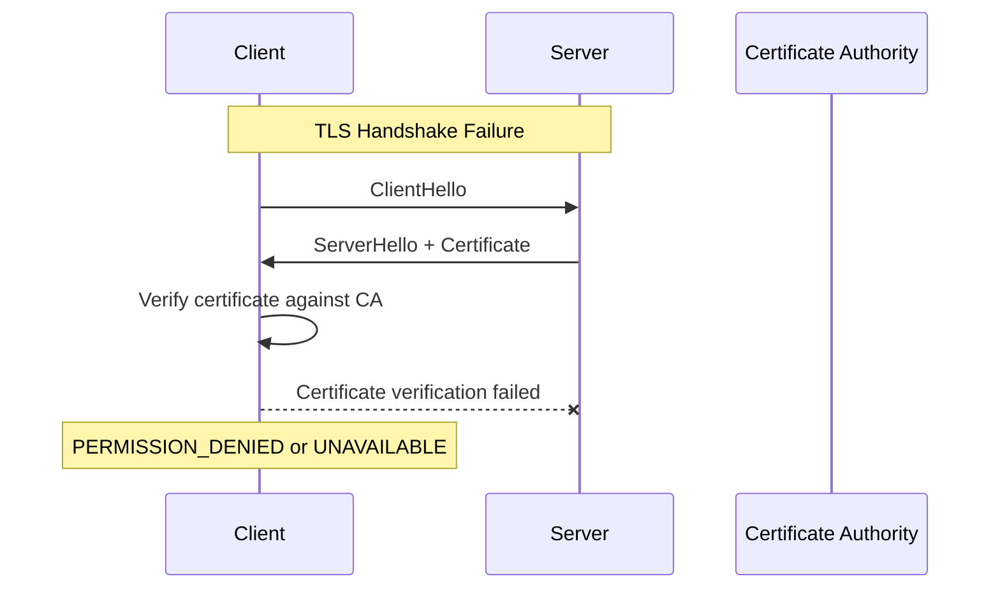

# How to Fix 'Permission Denied' Errors in gRPC

Author: [nawazdhandala](https://www.github.com/nawazdhandala)

Tags: gRPC, Permission Denied, Authentication, Authorization, TLS, Security, Debugging

Description: A practical guide to diagnosing and fixing 'Permission Denied' errors in gRPC services, covering authentication, authorization, TLS configuration, and common misconfigurations.

---

> gRPC returns a "Permission Denied" status code (PERMISSION_DENIED) when the caller does not have permission to execute the specified operation. This guide covers the most common causes and how to fix them in production environments.

Permission denied errors in gRPC can stem from authentication failures, authorization policy violations, or TLS misconfiguration. Understanding the difference between these causes is crucial for quick resolution.

---

## Understanding Permission Denied vs Unauthenticated



---

## Common Causes of Permission Denied Errors



---

## Fixing Authentication Token Issues

### Problem: Missing or Malformed Authorization Header

```python
import grpc

# BAD: No authentication credentials
# This will result in PERMISSION_DENIED if server requires auth
channel = grpc.insecure_channel('localhost:50051')
stub = service_pb2_grpc.MyServiceStub(channel)
response = stub.GetData(request)  # Permission Denied!

# GOOD: Include authentication token in metadata
class TokenAuthInterceptor(grpc.UnaryUnaryClientInterceptor):
    """Interceptor that adds auth token to every request"""

    def __init__(self, token):
        self.token = token

    def intercept_unary_unary(self, continuation, client_call_details, request):
        # Create new metadata with authorization header
        metadata = list(client_call_details.metadata or [])
        metadata.append(('authorization', f'Bearer {self.token}'))

        # Create new call details with updated metadata
        new_details = grpc.ClientCallDetails(
            method=client_call_details.method,
            timeout=client_call_details.timeout,
            metadata=metadata,
            credentials=client_call_details.credentials,
            wait_for_ready=client_call_details.wait_for_ready,
        )

        return continuation(new_details, request)

# Apply interceptor to channel
token = get_auth_token()  # Get token from auth provider
interceptor = TokenAuthInterceptor(token)
channel = grpc.intercept_channel(
    grpc.insecure_channel('localhost:50051'),
    interceptor
)
```

### Go Implementation with Per-RPC Credentials

```go
package main

import (
    "context"

    "google.golang.org/grpc"
    "google.golang.org/grpc/credentials"
    "google.golang.org/grpc/credentials/oauth"
)

// TokenAuth implements credentials.PerRPCCredentials
type TokenAuth struct {
    Token string
}

// GetRequestMetadata adds the token to request metadata
func (t TokenAuth) GetRequestMetadata(ctx context.Context, uri ...string) (map[string]string, error) {
    return map[string]string{
        "authorization": "Bearer " + t.Token,
    }, nil
}

// RequireTransportSecurity indicates whether TLS is required
func (t TokenAuth) RequireTransportSecurity() bool {
    // Return true if using TLS (recommended for production)
    return true
}

func createAuthenticatedChannel(address, token string) (*grpc.ClientConn, error) {
    // Load TLS credentials
    creds, err := credentials.NewClientTLSFromFile("ca.crt", "")
    if err != nil {
        return nil, err
    }

    // Create connection with both transport and per-RPC credentials
    conn, err := grpc.Dial(
        address,
        grpc.WithTransportCredentials(creds),
        grpc.WithPerRPCCredentials(TokenAuth{Token: token}),
    )

    return conn, err
}

// For OAuth2 tokens, use the built-in oauth package
func createOAuthChannel(address string) (*grpc.ClientConn, error) {
    // Load service account key
    perRPC, err := oauth.NewServiceAccountFromFile(
        "service-account.json",
        "https://www.googleapis.com/auth/cloud-platform",
    )
    if err != nil {
        return nil, err
    }

    creds, err := credentials.NewClientTLSFromFile("ca.crt", "")
    if err != nil {
        return nil, err
    }

    conn, err := grpc.Dial(
        address,
        grpc.WithTransportCredentials(creds),
        grpc.WithPerRPCCredentials(perRPC),
    )

    return conn, err
}
```

---

## Fixing Token Expiration Issues

### Problem: Token Expired During Long-Running Operations

```python
import grpc
import time
from threading import Lock

class RefreshableTokenInterceptor(grpc.UnaryUnaryClientInterceptor):
    """Interceptor that automatically refreshes expired tokens"""

    def __init__(self, token_provider):
        self.token_provider = token_provider
        self.token = None
        self.token_expiry = 0
        self.lock = Lock()

    def _get_valid_token(self):
        """Get a valid token, refreshing if necessary"""
        with self.lock:
            current_time = time.time()
            # Refresh token 60 seconds before expiry
            if self.token is None or current_time >= (self.token_expiry - 60):
                self.token, self.token_expiry = self.token_provider.get_token()
            return self.token

    def intercept_unary_unary(self, continuation, client_call_details, request):
        token = self._get_valid_token()

        metadata = list(client_call_details.metadata or [])
        metadata.append(('authorization', f'Bearer {token}'))

        new_details = grpc.ClientCallDetails(
            method=client_call_details.method,
            timeout=client_call_details.timeout,
            metadata=metadata,
            credentials=client_call_details.credentials,
            wait_for_ready=client_call_details.wait_for_ready,
        )

        try:
            return continuation(new_details, request)
        except grpc.RpcError as e:
            # If permission denied, try refreshing token and retry once
            if e.code() == grpc.StatusCode.PERMISSION_DENIED:
                with self.lock:
                    # Force token refresh
                    self.token = None
                token = self._get_valid_token()
                metadata = list(client_call_details.metadata or [])
                metadata.append(('authorization', f'Bearer {token}'))
                new_details = grpc.ClientCallDetails(
                    method=client_call_details.method,
                    timeout=client_call_details.timeout,
                    metadata=metadata,
                    credentials=client_call_details.credentials,
                    wait_for_ready=client_call_details.wait_for_ready,
                )
                return continuation(new_details, request)
            raise
```

---

## Fixing TLS and Certificate Issues

### Problem: Certificate Not Trusted



### Solution: Configure Proper TLS Credentials

```python
import grpc

# BAD: Using insecure channel when server requires TLS
# This can cause permission denied or connection issues
channel = grpc.insecure_channel('secure-server:50051')

# GOOD: Configure TLS with proper CA certificate
def create_secure_channel(address, ca_cert_path):
    """Create a secure channel with custom CA certificate"""
    # Read the CA certificate
    with open(ca_cert_path, 'rb') as f:
        ca_cert = f.read()

    # Create SSL credentials
    credentials = grpc.ssl_channel_credentials(
        root_certificates=ca_cert
    )

    # Create secure channel
    channel = grpc.secure_channel(address, credentials)
    return channel

# For mutual TLS (mTLS) where client certificate is required
def create_mtls_channel(address, ca_cert_path, client_cert_path, client_key_path):
    """Create a channel with mutual TLS authentication"""
    with open(ca_cert_path, 'rb') as f:
        ca_cert = f.read()
    with open(client_cert_path, 'rb') as f:
        client_cert = f.read()
    with open(client_key_path, 'rb') as f:
        client_key = f.read()

    # Create credentials with client certificate
    credentials = grpc.ssl_channel_credentials(
        root_certificates=ca_cert,
        private_key=client_key,
        certificate_chain=client_cert
    )

    channel = grpc.secure_channel(address, credentials)
    return channel
```

### Go mTLS Configuration

```go
package main

import (
    "crypto/tls"
    "crypto/x509"
    "io/ioutil"

    "google.golang.org/grpc"
    "google.golang.org/grpc/credentials"
)

func createMTLSChannel(address string) (*grpc.ClientConn, error) {
    // Load client certificate and key
    clientCert, err := tls.LoadX509KeyPair("client.crt", "client.key")
    if err != nil {
        return nil, err
    }

    // Load CA certificate
    caCert, err := ioutil.ReadFile("ca.crt")
    if err != nil {
        return nil, err
    }

    // Create certificate pool with CA
    caCertPool := x509.NewCertPool()
    if !caCertPool.AppendCertsFromPEM(caCert) {
        return nil, fmt.Errorf("failed to add CA certificate")
    }

    // Configure TLS
    tlsConfig := &tls.Config{
        Certificates: []tls.Certificate{clientCert},
        RootCAs:      caCertPool,
        // Verify server certificate
        InsecureSkipVerify: false,
    }

    // Create transport credentials
    creds := credentials.NewTLS(tlsConfig)

    // Create connection
    conn, err := grpc.Dial(
        address,
        grpc.WithTransportCredentials(creds),
    )

    return conn, err
}
```

---

## Fixing Authorization Policy Issues

### Problem: Insufficient Permissions for Resource

```python
# Server-side authorization interceptor
import grpc
from functools import wraps

class AuthorizationInterceptor(grpc.ServerInterceptor):
    """Server interceptor for role-based access control"""

    def __init__(self, auth_service):
        self.auth_service = auth_service
        # Define required roles for each method
        self.method_permissions = {
            '/myservice.UserService/GetUser': ['user:read'],
            '/myservice.UserService/UpdateUser': ['user:write'],
            '/myservice.UserService/DeleteUser': ['user:delete', 'admin'],
            '/myservice.AdminService/ListUsers': ['admin'],
        }

    def intercept_service(self, continuation, handler_call_details):
        method = handler_call_details.method
        required_permissions = self.method_permissions.get(method, [])

        if not required_permissions:
            # No permissions required for this method
            return continuation(handler_call_details)

        # Get token from metadata
        metadata = dict(handler_call_details.invocation_metadata)
        token = metadata.get('authorization', '').replace('Bearer ', '')

        if not token:
            return self._abort_handler(
                grpc.StatusCode.UNAUTHENTICATED,
                'No authorization token provided'
            )

        # Validate token and get user permissions
        try:
            user_permissions = self.auth_service.get_permissions(token)
        except Exception as e:
            return self._abort_handler(
                grpc.StatusCode.UNAUTHENTICATED,
                f'Invalid token: {str(e)}'
            )

        # Check if user has required permissions
        if not any(perm in user_permissions for perm in required_permissions):
            return self._abort_handler(
                grpc.StatusCode.PERMISSION_DENIED,
                f'Missing required permissions: {required_permissions}'
            )

        return continuation(handler_call_details)

    def _abort_handler(self, code, message):
        def abort(request, context):
            context.abort(code, message)
        return grpc.unary_unary_rpc_method_handler(abort)

# Usage
auth_interceptor = AuthorizationInterceptor(auth_service)
server = grpc.server(
    futures.ThreadPoolExecutor(max_workers=10),
    interceptors=[auth_interceptor]
)
```

---

## Debugging Permission Denied Errors

### Enable Detailed Error Messages

```python
import grpc
import logging

# Enable gRPC debug logging
logging.basicConfig(level=logging.DEBUG)

def debug_permission_denied(stub, request):
    """Make a call and capture detailed error information"""
    try:
        response = stub.SomeMethod(request)
        return response
    except grpc.RpcError as e:
        print(f"gRPC Error Code: {e.code()}")
        print(f"gRPC Error Details: {e.details()}")

        # Get trailing metadata for additional context
        trailing_metadata = e.trailing_metadata()
        if trailing_metadata:
            print("Trailing Metadata:")
            for key, value in trailing_metadata:
                print(f"  {key}: {value}")

        # Check for debug info in metadata
        debug_info = dict(trailing_metadata or []).get('debug-info')
        if debug_info:
            print(f"Debug Info: {debug_info}")

        raise
```

### Server-Side Debug Information

```go
package main

import (
    "context"

    "google.golang.org/grpc"
    "google.golang.org/grpc/codes"
    "google.golang.org/grpc/metadata"
    "google.golang.org/grpc/status"
)

// DebugAuthInterceptor adds debug information to permission errors
func DebugAuthInterceptor(ctx context.Context, req interface{}, info *grpc.UnaryServerInfo, handler grpc.UnaryHandler) (interface{}, error) {
    // Extract metadata
    md, ok := metadata.FromIncomingContext(ctx)
    if !ok {
        md = metadata.New(nil)
    }

    // Validate authorization
    authHeader := md.Get("authorization")
    if len(authHeader) == 0 {
        // Add debug metadata to help diagnose issues
        grpc.SetTrailer(ctx, metadata.Pairs(
            "debug-reason", "no-auth-header",
            "debug-method", info.FullMethod,
        ))
        return nil, status.Error(codes.PermissionDenied, "authorization header required")
    }

    // Validate token
    token := strings.TrimPrefix(authHeader[0], "Bearer ")
    claims, err := validateToken(token)
    if err != nil {
        grpc.SetTrailer(ctx, metadata.Pairs(
            "debug-reason", "invalid-token",
            "debug-error", err.Error(),
        ))
        return nil, status.Error(codes.PermissionDenied, "invalid authorization token")
    }

    // Check permissions
    if !hasPermission(claims, info.FullMethod) {
        grpc.SetTrailer(ctx, metadata.Pairs(
            "debug-reason", "insufficient-permissions",
            "debug-user", claims.Subject,
            "debug-roles", strings.Join(claims.Roles, ","),
            "debug-required", getRequiredPermission(info.FullMethod),
        ))
        return nil, status.Error(codes.PermissionDenied, "insufficient permissions for this operation")
    }

    return handler(ctx, req)
}
```

---

## Kubernetes Service Account Issues

### Problem: Pod Service Account Missing Permissions

```yaml
# Check if service account has required permissions
# kubectl auth can-i --as=system:serviceaccount:default:my-service-account get pods

# Create proper RBAC configuration
apiVersion: v1
kind: ServiceAccount
metadata:
  name: grpc-client-sa
  namespace: default
---
apiVersion: rbac.authorization.k8s.io/v1
kind: Role
metadata:
  name: grpc-client-role
  namespace: default
rules:
  # Add permissions for resources the gRPC client needs
  - apiGroups: [""]
    resources: ["secrets"]
    verbs: ["get"]
    resourceNames: ["grpc-client-creds"]
---
apiVersion: rbac.authorization.k8s.io/v1
kind: RoleBinding
metadata:
  name: grpc-client-rolebinding
  namespace: default
subjects:
  - kind: ServiceAccount
    name: grpc-client-sa
    namespace: default
roleRef:
  kind: Role
  name: grpc-client-role
  apiGroup: rbac.authorization.k8s.io
---
# Pod using the service account
apiVersion: v1
kind: Pod
metadata:
  name: grpc-client-pod
spec:
  serviceAccountName: grpc-client-sa
  containers:
    - name: grpc-client
      image: my-grpc-client:latest
      env:
        - name: GOOGLE_APPLICATION_CREDENTIALS
          value: /var/secrets/google/key.json
      volumeMounts:
        - name: google-cloud-key
          mountPath: /var/secrets/google
          readOnly: true
  volumes:
    - name: google-cloud-key
      secret:
        secretName: grpc-client-creds
```

---

## Best Practices Summary

1. **Use structured error handling** - Parse gRPC status codes to distinguish between authentication and authorization failures
2. **Implement token refresh** - Handle token expiration gracefully with automatic refresh
3. **Configure TLS properly** - Use mTLS in production for mutual authentication
4. **Add debug metadata** - Include helpful information in error responses for troubleshooting
5. **Use proper RBAC** - Configure fine-grained permissions for service accounts
6. **Log authentication attempts** - Maintain audit logs for security analysis

---

## Conclusion

Permission denied errors in gRPC usually indicate either missing credentials, expired tokens, TLS misconfiguration, or insufficient authorization. By implementing proper token management, configuring TLS correctly, and adding detailed error logging, you can quickly diagnose and resolve these issues.

The key is distinguishing between UNAUTHENTICATED (missing or invalid credentials) and PERMISSION_DENIED (valid credentials but insufficient permissions) to direct your debugging efforts appropriately.

---

*Need help monitoring authentication issues in your gRPC services? [OneUptime](https://oneuptime.com) provides real-time alerting and distributed tracing to help you identify permission problems before they impact users.*

**Related Reading:**
- [How to Fix gRPC Performance Issues](https://oneuptime.com/blog)
- [How to Configure gRPC Reflection for Debugging](https://oneuptime.com/blog)
