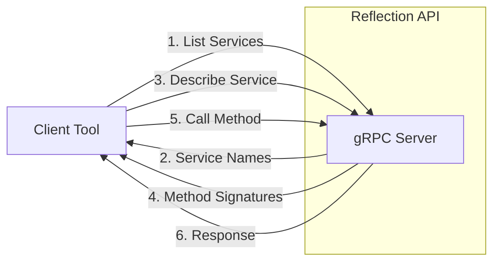
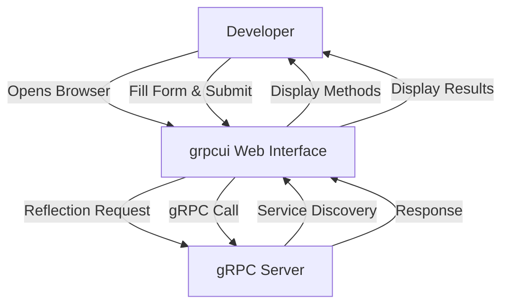

# How to Configure gRPC Reflection for Debugging

Author: [nawazdhandala](https://www.github.com/nawazdhandala)

Tags: gRPC, Reflection, Debugging, grpcurl, Protocol Buffers, Development, Testing

Description: A comprehensive guide to enabling and using gRPC reflection for debugging services, including server configuration, client tools, and security considerations.

---

> gRPC reflection is a protocol that allows clients to discover available services and their methods at runtime without needing proto files. This guide shows how to enable reflection for debugging and testing while keeping production environments secure.

gRPC reflection is invaluable during development and debugging. It allows tools like grpcurl and grpcui to query your services dynamically, making it easy to test endpoints without compiling proto files.

---

## What is gRPC Reflection?



Reflection provides a standard way to:
- List all available services on a server
- Get method signatures and message types
- Describe message field types and names
- Enable dynamic invocation without proto files

---

## Enabling Reflection in Python

```python
import grpc
from concurrent import futures
from grpc_reflection.v1alpha import reflection

# Import your generated service files
import my_service_pb2
import my_service_pb2_grpc

class MyServiceServicer(my_service_pb2_grpc.MyServiceServicer):
    """Implementation of the MyService gRPC service"""

    def GetData(self, request, context):
        return my_service_pb2.DataResponse(
            message=f"Hello, {request.name}!"
        )

def serve():
    # Create server with thread pool
    server = grpc.server(futures.ThreadPoolExecutor(max_workers=10))

    # Register your service
    my_service_pb2_grpc.add_MyServiceServicer_to_server(
        MyServiceServicer(), server
    )

    # Enable reflection
    # SERVICE_NAMES should include all services you want to expose
    SERVICE_NAMES = (
        my_service_pb2.DESCRIPTOR.services_by_name['MyService'].full_name,
        reflection.SERVICE_NAME,  # Include reflection service itself
    )
    reflection.enable_server_reflection(SERVICE_NAMES, server)

    # Start server
    server.add_insecure_port('[::]:50051')
    server.start()
    print("Server started with reflection enabled on port 50051")
    server.wait_for_termination()

if __name__ == '__main__':
    serve()
```

### Installing the Reflection Package

```bash
# Install grpcio-reflection for Python
pip install grpcio grpcio-tools grpcio-reflection
```

---

## Enabling Reflection in Go

```go
package main

import (
    "log"
    "net"

    "google.golang.org/grpc"
    "google.golang.org/grpc/reflection"

    pb "myservice/proto"
)

type server struct {
    pb.UnimplementedMyServiceServer
}

func (s *server) GetData(ctx context.Context, req *pb.DataRequest) (*pb.DataResponse, error) {
    return &pb.DataResponse{
        Message: "Hello, " + req.Name,
    }, nil
}

func main() {
    // Listen on port
    lis, err := net.Listen("tcp", ":50051")
    if err != nil {
        log.Fatalf("failed to listen: %v", err)
    }

    // Create gRPC server
    s := grpc.NewServer()

    // Register your service
    pb.RegisterMyServiceServer(s, &server{})

    // Enable reflection
    // This registers the reflection service with the server
    reflection.Register(s)

    log.Println("Server started with reflection enabled on port 50051")
    if err := s.Serve(lis); err != nil {
        log.Fatalf("failed to serve: %v", err)
    }
}
```

---

## Enabling Reflection in Node.js

```javascript
const grpc = require('@grpc/grpc-js');
const protoLoader = require('@grpc/proto-loader');

// Load proto file
const packageDefinition = protoLoader.loadSync('my_service.proto', {
    keepCase: true,
    longs: String,
    enums: String,
    defaults: true,
    oneofs: true
});

const protoDescriptor = grpc.loadPackageDefinition(packageDefinition);
const myService = protoDescriptor.myservice;

// Service implementation
const serviceImpl = {
    getData: (call, callback) => {
        callback(null, { message: `Hello, ${call.request.name}!` });
    }
};

function main() {
    const server = new grpc.Server();

    // Add your service
    server.addService(myService.MyService.service, serviceImpl);

    // Enable reflection using grpc-js reflection package
    const reflection = require('@grpc/reflection');
    reflection.addToServer(server);

    // Start server
    server.bindAsync(
        '0.0.0.0:50051',
        grpc.ServerCredentials.createInsecure(),
        (err, port) => {
            if (err) {
                console.error('Failed to bind server:', err);
                return;
            }
            console.log(`Server running with reflection on port ${port}`);
            server.start();
        }
    );
}

main();
```

---

## Using grpcurl for Debugging

grpcurl is a command-line tool for interacting with gRPC servers using reflection.

### Installation

```bash
# macOS
brew install grpcurl

# Linux (using Go)
go install github.com/fullstorydev/grpcurl/cmd/grpcurl@latest

# Docker
docker pull fullstorydev/grpcurl
```

### Basic Commands

```bash
# List all available services
grpcurl -plaintext localhost:50051 list

# Output:
# grpc.reflection.v1alpha.ServerReflection
# myservice.MyService

# Describe a specific service
grpcurl -plaintext localhost:50051 describe myservice.MyService

# Output:
# myservice.MyService is a service:
# service MyService {
#   rpc GetData ( .myservice.DataRequest ) returns ( .myservice.DataResponse );
#   rpc StreamData ( .myservice.StreamRequest ) returns ( stream .myservice.DataResponse );
# }

# Describe a message type
grpcurl -plaintext localhost:50051 describe myservice.DataRequest

# Output:
# myservice.DataRequest is a message:
# message DataRequest {
#   string name = 1;
#   int32 limit = 2;
# }

# Call a method with JSON data
grpcurl -plaintext -d '{"name": "World", "limit": 10}' \
    localhost:50051 myservice.MyService/GetData

# Output:
# {
#   "message": "Hello, World!"
# }
```

### Advanced grpcurl Usage

```bash
# Call with metadata (headers)
grpcurl -plaintext \
    -H 'Authorization: Bearer my-token' \
    -H 'X-Request-ID: abc123' \
    -d '{"name": "Test"}' \
    localhost:50051 myservice.MyService/GetData

# Call with TLS
grpcurl -cacert ca.crt \
    -cert client.crt \
    -key client.key \
    -d '{"name": "Secure"}' \
    secure-server:50051 myservice.MyService/GetData

# Read input from file
grpcurl -plaintext \
    -d @ \
    localhost:50051 myservice.MyService/GetData < request.json

# Format output as JSON
grpcurl -plaintext \
    -format json \
    -d '{"name": "Test"}' \
    localhost:50051 myservice.MyService/GetData

# Stream responses
grpcurl -plaintext \
    -d '{"query": "test"}' \
    localhost:50051 myservice.MyService/StreamData
```

---

## Using grpcui for Visual Debugging

grpcui provides a web-based UI for interacting with gRPC services.



### Installation and Usage

```bash
# Install grpcui
go install github.com/fullstorydev/grpcui/cmd/grpcui@latest

# Start grpcui pointing to your server
grpcui -plaintext localhost:50051

# Opens browser at http://127.0.0.1:xxxx with interactive UI

# With TLS
grpcui -cacert ca.crt \
    -cert client.crt \
    -key client.key \
    secure-server:50051

# With custom port
grpcui -plaintext -port 8080 localhost:50051
```

---

## Conditional Reflection Based on Environment

### Python Implementation

```python
import grpc
import os
from concurrent import futures
from grpc_reflection.v1alpha import reflection

def serve():
    server = grpc.server(futures.ThreadPoolExecutor(max_workers=10))

    # Register services
    my_service_pb2_grpc.add_MyServiceServicer_to_server(
        MyServiceServicer(), server
    )

    # Only enable reflection in non-production environments
    enable_reflection = os.getenv('ENABLE_GRPC_REFLECTION', 'false').lower() == 'true'
    environment = os.getenv('ENVIRONMENT', 'development')

    if enable_reflection or environment in ['development', 'staging']:
        SERVICE_NAMES = (
            my_service_pb2.DESCRIPTOR.services_by_name['MyService'].full_name,
            reflection.SERVICE_NAME,
        )
        reflection.enable_server_reflection(SERVICE_NAMES, server)
        print("gRPC reflection enabled")
    else:
        print("gRPC reflection disabled for production")

    server.add_insecure_port('[::]:50051')
    server.start()
    server.wait_for_termination()
```

### Go Implementation

```go
package main

import (
    "log"
    "net"
    "os"

    "google.golang.org/grpc"
    "google.golang.org/grpc/reflection"

    pb "myservice/proto"
)

func main() {
    lis, err := net.Listen("tcp", ":50051")
    if err != nil {
        log.Fatalf("failed to listen: %v", err)
    }

    s := grpc.NewServer()
    pb.RegisterMyServiceServer(s, &server{})

    // Conditionally enable reflection
    enableReflection := os.Getenv("ENABLE_GRPC_REFLECTION") == "true"
    environment := os.Getenv("ENVIRONMENT")

    if enableReflection || environment == "development" || environment == "staging" {
        reflection.Register(s)
        log.Println("gRPC reflection enabled")
    } else {
        log.Println("gRPC reflection disabled for production")
    }

    if err := s.Serve(lis); err != nil {
        log.Fatalf("failed to serve: %v", err)
    }
}
```

---

## Kubernetes Configuration

```yaml
apiVersion: apps/v1
kind: Deployment
metadata:
  name: grpc-service
spec:
  replicas: 3
  selector:
    matchLabels:
      app: grpc-service
  template:
    metadata:
      labels:
        app: grpc-service
    spec:
      containers:
        - name: grpc-service
          image: my-grpc-service:latest
          ports:
            - containerPort: 50051
          env:
            # Enable reflection only in non-production
            - name: ENVIRONMENT
              value: "staging"
            - name: ENABLE_GRPC_REFLECTION
              value: "true"
---
# For production, disable reflection
apiVersion: apps/v1
kind: Deployment
metadata:
  name: grpc-service-production
spec:
  template:
    spec:
      containers:
        - name: grpc-service
          image: my-grpc-service:latest
          env:
            - name: ENVIRONMENT
              value: "production"
            - name: ENABLE_GRPC_REFLECTION
              value: "false"
```

---

## Secure Reflection Access

### Using Interceptors for Authentication

```python
import grpc
from grpc_reflection.v1alpha import reflection

class ReflectionAuthInterceptor(grpc.ServerInterceptor):
    """Require authentication for reflection API"""

    def __init__(self, allowed_tokens):
        self.allowed_tokens = allowed_tokens

    def intercept_service(self, continuation, handler_call_details):
        method = handler_call_details.method

        # Check if this is a reflection call
        if 'ServerReflection' in method:
            metadata = dict(handler_call_details.invocation_metadata)
            token = metadata.get('authorization', '').replace('Bearer ', '')

            if token not in self.allowed_tokens:
                def abort(request, context):
                    context.abort(
                        grpc.StatusCode.PERMISSION_DENIED,
                        'Reflection access requires valid token'
                    )
                return grpc.unary_unary_rpc_method_handler(abort)

        return continuation(handler_call_details)

# Usage
allowed_tokens = ['debug-token-123', 'developer-token-456']
server = grpc.server(
    futures.ThreadPoolExecutor(max_workers=10),
    interceptors=[ReflectionAuthInterceptor(allowed_tokens)]
)
```

### Using grpcurl with Authentication

```bash
# Call reflection with authentication token
grpcurl -plaintext \
    -H 'Authorization: Bearer debug-token-123' \
    localhost:50051 list

# Use reflection to discover and call authenticated service
grpcurl -plaintext \
    -H 'Authorization: Bearer user-token' \
    -d '{"user_id": "123"}' \
    localhost:50051 myservice.UserService/GetUser
```

---

## Debugging Common Issues

### Problem: Reflection Not Working

```bash
# Check if reflection is enabled
grpcurl -plaintext localhost:50051 list

# If you get "Failed to list services", reflection may not be enabled
# Error: Failed to list services: server does not support the reflection API

# Verify server is running and accessible
nc -zv localhost 50051

# Check server logs for reflection registration
docker logs my-grpc-container | grep -i reflection
```

### Problem: Missing Service in Reflection

```python
# Make sure to include ALL service descriptors when enabling reflection
SERVICE_NAMES = (
    # Include all services you want to expose
    my_service_pb2.DESCRIPTOR.services_by_name['MyService'].full_name,
    user_service_pb2.DESCRIPTOR.services_by_name['UserService'].full_name,
    admin_service_pb2.DESCRIPTOR.services_by_name['AdminService'].full_name,
    # Always include the reflection service itself
    reflection.SERVICE_NAME,
)
reflection.enable_server_reflection(SERVICE_NAMES, server)
```

---

## Testing with Reflection

```python
import grpc
from grpc_reflection.v1alpha import reflection_pb2
from grpc_reflection.v1alpha import reflection_pb2_grpc

def test_reflection_enabled():
    """Test that reflection is properly configured"""
    channel = grpc.insecure_channel('localhost:50051')
    stub = reflection_pb2_grpc.ServerReflectionStub(channel)

    # Create reflection request
    request = reflection_pb2.ServerReflectionRequest(
        list_services=""
    )

    # Send request and get response
    responses = stub.ServerReflectionInfo(iter([request]))

    for response in responses:
        if response.HasField('list_services_response'):
            services = response.list_services_response.service
            service_names = [s.name for s in services]

            # Verify expected services are present
            assert 'myservice.MyService' in service_names
            print(f"Found services: {service_names}")
            return True

    return False

if __name__ == '__main__':
    if test_reflection_enabled():
        print("Reflection is working correctly")
    else:
        print("Reflection test failed")
```

---

## Best Practices Summary

1. **Enable reflection conditionally** - Use environment variables to control reflection in different environments
2. **Secure reflection access** - Require authentication for reflection API in staging and production
3. **Include all services** - Make sure to register all service descriptors with reflection
4. **Use grpcurl for scripting** - Automate testing with grpcurl in CI/CD pipelines
5. **Use grpcui for exploration** - Visual interface is helpful for discovering API structure
6. **Disable in production** - Consider disabling reflection in production for security

---

## Conclusion

gRPC reflection is an essential tool for debugging and testing gRPC services. By enabling reflection in development environments and using tools like grpcurl and grpcui, you can quickly explore your API, test methods, and diagnose issues without needing proto files on the client side.

Remember to secure or disable reflection in production to prevent potential information disclosure about your internal APIs.

---

*Need to monitor your gRPC services? [OneUptime](https://oneuptime.com) provides comprehensive observability for gRPC applications, including request tracing, error tracking, and performance metrics.*

**Related Reading:**
- [How to Fix gRPC Performance Issues](https://oneuptime.com/blog)
- [How to Fix "Permission Denied" Errors in gRPC](https://oneuptime.com/blog)
