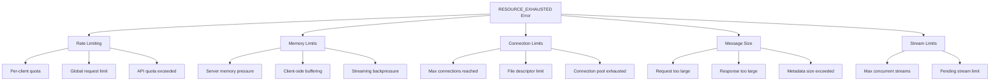
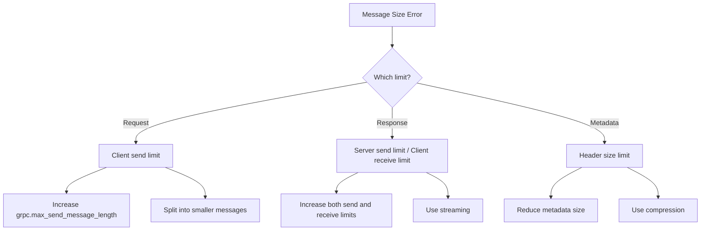
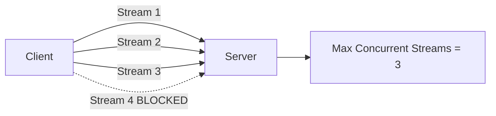

# How to Fix Resource Exhausted Errors in gRPC

Author: [nawazdhandala](https://www.github.com/nawazdhandala)

Tags: gRPC, Resource Exhausted, Rate Limiting, Performance, Microservices, Memory Management, Connection Pooling

Description: A practical guide to diagnosing and fixing gRPC RESOURCE_EXHAUSTED errors, covering rate limiting, memory constraints, connection limits, and message size issues with code examples.

---

> The RESOURCE_EXHAUSTED error in gRPC indicates that some resource limit has been reached. This could be rate limits, memory constraints, connection limits, or message size limits. This guide covers the common causes and solutions for this error in production environments.

RESOURCE_EXHAUSTED (code 8) is one of the more challenging gRPC errors to debug because it can originate from multiple sources. Understanding the root cause is essential for implementing the right fix.

---

## Common Causes of RESOURCE_EXHAUSTED



---

## Diagnosing the Issue

Before fixing the error, you need to identify which resource is exhausted.

```python
import grpc
from grpc_status import rpc_status
from google.rpc import error_details_pb2

def diagnose_resource_exhausted(error):
    """
    Extract detailed information from a RESOURCE_EXHAUSTED error.
    """
    status = rpc_status.from_call(error)

    print(f'Error message: {error.details()}')

    if status is None:
        print('No rich status details available')
        return

    # Check for QuotaFailure details
    for detail in status.details:
        if detail.Is(error_details_pb2.QuotaFailure.DESCRIPTOR):
            quota_failure = error_details_pb2.QuotaFailure()
            detail.Unpack(quota_failure)
            print('Quota violations:')
            for violation in quota_failure.violations:
                print(f'  Subject: {violation.subject}')
                print(f'  Description: {violation.description}')

        elif detail.Is(error_details_pb2.RetryInfo.DESCRIPTOR):
            retry_info = error_details_pb2.RetryInfo()
            detail.Unpack(retry_info)
            print(f'Retry after: {retry_info.retry_delay.seconds} seconds')

        elif detail.Is(error_details_pb2.ErrorInfo.DESCRIPTOR):
            error_info = error_details_pb2.ErrorInfo()
            detail.Unpack(error_info)
            print(f'Error reason: {error_info.reason}')
            print(f'Domain: {error_info.domain}')


# Usage
try:
    response = stub.MakeRequest(request)
except grpc.RpcError as e:
    if e.code() == grpc.StatusCode.RESOURCE_EXHAUSTED:
        diagnose_resource_exhausted(e)
```

---

## Fixing Rate Limit Issues

### Server-Side Rate Limiting

```python
import grpc
import time
from collections import defaultdict
from threading import Lock

class RateLimiter:
    """
    Token bucket rate limiter for gRPC services.
    """

    def __init__(self, rate, burst):
        self.rate = rate        # Tokens per second
        self.burst = burst      # Maximum burst size
        self.tokens = defaultdict(lambda: burst)
        self.last_update = defaultdict(time.time)
        self.lock = Lock()

    def allow(self, client_id):
        """
        Check if a request is allowed for the given client.
        Returns True if allowed, False if rate limited.
        """
        with self.lock:
            now = time.time()
            elapsed = now - self.last_update[client_id]
            self.last_update[client_id] = now

            # Add tokens based on elapsed time
            self.tokens[client_id] = min(
                self.burst,
                self.tokens[client_id] + elapsed * self.rate
            )

            if self.tokens[client_id] >= 1:
                self.tokens[client_id] -= 1
                return True

            return False

    def get_retry_after(self, client_id):
        """
        Calculate how long until a request would be allowed.
        """
        with self.lock:
            if self.tokens[client_id] >= 1:
                return 0
            return int((1 - self.tokens[client_id]) / self.rate) + 1


class RateLimitInterceptor(grpc.ServerInterceptor):
    """
    Server interceptor that enforces rate limits per client.
    """

    def __init__(self, rate=100, burst=200):
        self.limiter = RateLimiter(rate, burst)

    def intercept_service(self, continuation, handler_call_details):
        # Extract client identifier from metadata
        metadata = dict(handler_call_details.invocation_metadata)
        client_id = metadata.get('x-client-id', 'anonymous')

        if not self.limiter.allow(client_id):
            # Create rich error with retry information
            return self._create_rate_limit_response(client_id)

        return continuation(handler_call_details)

    def _create_rate_limit_response(self, client_id):
        from google.protobuf import any_pb2
        from google.rpc import status_pb2, error_details_pb2

        retry_delay = self.limiter.get_retry_after(client_id)

        # Build retry info
        retry_info = error_details_pb2.RetryInfo()
        retry_info.retry_delay.seconds = retry_delay

        # Build quota failure info
        quota_failure = error_details_pb2.QuotaFailure()
        violation = quota_failure.violations.add()
        violation.subject = f'client:{client_id}'
        violation.description = 'Request rate limit exceeded'

        # Pack details
        retry_detail = any_pb2.Any()
        retry_detail.Pack(retry_info)

        quota_detail = any_pb2.Any()
        quota_detail.Pack(quota_failure)

        rich_status = status_pb2.Status(
            code=grpc.StatusCode.RESOURCE_EXHAUSTED.value[0],
            message=f'Rate limit exceeded. Retry after {retry_delay} seconds.',
            details=[retry_detail, quota_detail]
        )

        # Return handler that aborts with this status
        def abort_handler(request, context):
            context.abort_with_status(rpc_status.to_status(rich_status))

        return grpc.unary_unary_rpc_method_handler(abort_handler)


# Apply rate limiting to server
server = grpc.server(
    futures.ThreadPoolExecutor(max_workers=50),
    interceptors=[RateLimitInterceptor(rate=100, burst=200)]
)
```

### Client-Side Retry with Backoff

```python
import grpc
import time
import random
from grpc_status import rpc_status
from google.rpc import error_details_pb2

class RetryClient:
    """
    gRPC client with intelligent retry handling for rate limits.
    """

    def __init__(self, channel, max_retries=5):
        self.stub = service_pb2_grpc.MyServiceStub(channel)
        self.max_retries = max_retries

    def call_with_retry(self, method_name, request, **kwargs):
        """
        Make a gRPC call with automatic retry on RESOURCE_EXHAUSTED.
        """
        method = getattr(self.stub, method_name)
        last_error = None

        for attempt in range(self.max_retries):
            try:
                return method(request, **kwargs)

            except grpc.RpcError as e:
                last_error = e

                if e.code() != grpc.StatusCode.RESOURCE_EXHAUSTED:
                    # Non-retryable error
                    raise

                # Try to extract retry delay from error details
                retry_delay = self._extract_retry_delay(e)

                if retry_delay is None:
                    # Use exponential backoff with jitter
                    retry_delay = min(30, (2 ** attempt) + random.uniform(0, 1))

                print(f'Rate limited, retrying in {retry_delay:.1f}s (attempt {attempt + 1})')
                time.sleep(retry_delay)

        # All retries exhausted
        raise last_error

    def _extract_retry_delay(self, error):
        """
        Extract retry delay from error details if available.
        """
        try:
            status = rpc_status.from_call(error)
            if status is None:
                return None

            for detail in status.details:
                if detail.Is(error_details_pb2.RetryInfo.DESCRIPTOR):
                    retry_info = error_details_pb2.RetryInfo()
                    detail.Unpack(retry_info)
                    return retry_info.retry_delay.seconds

        except Exception:
            pass

        return None


# Usage
channel = grpc.insecure_channel('localhost:50051')
client = RetryClient(channel)

try:
    response = client.call_with_retry('ProcessData', request, timeout=30)
except grpc.RpcError as e:
    if e.code() == grpc.StatusCode.RESOURCE_EXHAUSTED:
        print('Rate limit persists after all retries')
```

---

## Fixing Message Size Issues

### Diagnosing Message Size Problems



### Configuring Message Size Limits

```python
import grpc

# Default limits are quite small (4MB)
# Increase for large payloads
MAX_MESSAGE_SIZE = 100 * 1024 * 1024  # 100MB

# Server configuration
server_options = [
    # Maximum size of received messages
    ('grpc.max_receive_message_length', MAX_MESSAGE_SIZE),
    # Maximum size of sent messages
    ('grpc.max_send_message_length', MAX_MESSAGE_SIZE),
    # Maximum metadata size (headers)
    ('grpc.max_metadata_size', 16 * 1024),  # 16KB
]

server = grpc.server(
    futures.ThreadPoolExecutor(max_workers=50),
    options=server_options
)

# Client configuration (must match or exceed server)
channel_options = [
    ('grpc.max_receive_message_length', MAX_MESSAGE_SIZE),
    ('grpc.max_send_message_length', MAX_MESSAGE_SIZE),
    ('grpc.max_metadata_size', 16 * 1024),
]

channel = grpc.insecure_channel('localhost:50051', options=channel_options)
```

### Handling Large Data with Streaming

```python
import grpc

class LargeDataService(service_pb2_grpc.DataServiceServicer):
    """
    Service that handles large data transfers using streaming
    instead of single large messages.
    """

    def UploadLargeFile(self, request_iterator, context):
        """
        Receive large file in chunks via client streaming.
        """
        file_data = bytearray()
        filename = None

        for chunk in request_iterator:
            if chunk.HasField('metadata'):
                filename = chunk.metadata.filename
            else:
                file_data.extend(chunk.data)

        # Process the complete file
        file_id = self._save_file(filename, bytes(file_data))

        return service_pb2.UploadResponse(
            file_id=file_id,
            size=len(file_data)
        )

    def DownloadLargeFile(self, request, context):
        """
        Send large file in chunks via server streaming.
        """
        file_data = self._load_file(request.file_id)
        chunk_size = 1024 * 1024  # 1MB chunks

        # Send metadata first
        yield service_pb2.FileChunk(
            metadata=service_pb2.FileMetadata(
                filename=request.file_id,
                total_size=len(file_data)
            )
        )

        # Send data in chunks
        for i in range(0, len(file_data), chunk_size):
            chunk = file_data[i:i + chunk_size]
            yield service_pb2.FileChunk(data=chunk)


# Client-side streaming upload
def upload_large_file(stub, filepath):
    """
    Upload a large file using streaming.
    """
    def generate_chunks():
        # Send metadata first
        yield service_pb2.FileChunk(
            metadata=service_pb2.FileMetadata(
                filename=os.path.basename(filepath)
            )
        )

        # Send file in chunks
        chunk_size = 1024 * 1024  # 1MB
        with open(filepath, 'rb') as f:
            while True:
                chunk = f.read(chunk_size)
                if not chunk:
                    break
                yield service_pb2.FileChunk(data=chunk)

    response = stub.UploadLargeFile(generate_chunks())
    return response.file_id
```

---

## Fixing Connection Limit Issues

### Go Implementation with Connection Management

```go
package main

import (
    "context"
    "sync"
    "time"

    "google.golang.org/grpc"
    "google.golang.org/grpc/codes"
    "google.golang.org/grpc/status"
)

// ConnectionManager manages connection limits and pooling
type ConnectionManager struct {
    mu          sync.Mutex
    connections map[string][]*grpc.ClientConn
    maxPerHost  int
    dialOpts    []grpc.DialOption
}

func NewConnectionManager(maxPerHost int) *ConnectionManager {
    return &ConnectionManager{
        connections: make(map[string][]*grpc.ClientConn),
        maxPerHost:  maxPerHost,
        dialOpts: []grpc.DialOption{
            grpc.WithDefaultCallOptions(
                grpc.MaxCallRecvMsgSize(50 * 1024 * 1024),
                grpc.MaxCallSendMsgSize(50 * 1024 * 1024),
            ),
        },
    }
}

func (m *ConnectionManager) GetConnection(ctx context.Context, addr string) (*grpc.ClientConn, error) {
    m.mu.Lock()
    defer m.mu.Unlock()

    // Check for existing healthy connection
    conns := m.connections[addr]
    for _, conn := range conns {
        state := conn.GetState()
        if state == connectivity.Ready || state == connectivity.Idle {
            return conn, nil
        }
    }

    // Check if we can create a new connection
    if len(conns) >= m.maxPerHost {
        return nil, status.Errorf(
            codes.ResourceExhausted,
            "connection limit reached for %s (max: %d)",
            addr,
            m.maxPerHost,
        )
    }

    // Create new connection
    conn, err := grpc.DialContext(ctx, addr, m.dialOpts...)
    if err != nil {
        return nil, err
    }

    m.connections[addr] = append(m.connections[addr], conn)
    return conn, nil
}

// Server-side connection limiting
type ConnectionLimitInterceptor struct {
    currentConns int64
    maxConns     int64
    mu           sync.Mutex
}

func NewConnectionLimitInterceptor(maxConns int64) *ConnectionLimitInterceptor {
    return &ConnectionLimitInterceptor{
        maxConns: maxConns,
    }
}

func (i *ConnectionLimitInterceptor) UnaryInterceptor(
    ctx context.Context,
    req interface{},
    info *grpc.UnaryServerInfo,
    handler grpc.UnaryHandler,
) (interface{}, error) {
    i.mu.Lock()
    if i.currentConns >= i.maxConns {
        i.mu.Unlock()
        return nil, status.Errorf(
            codes.ResourceExhausted,
            "server connection limit reached (%d/%d)",
            i.currentConns,
            i.maxConns,
        )
    }
    i.currentConns++
    i.mu.Unlock()

    defer func() {
        i.mu.Lock()
        i.currentConns--
        i.mu.Unlock()
    }()

    return handler(ctx, req)
}
```

---

## Fixing Memory Pressure Issues

### Server Memory Management

```python
import grpc
import psutil
import logging
from concurrent import futures

class MemoryAwareServer:
    """
    gRPC server that monitors memory and rejects requests
    when memory pressure is high.
    """

    def __init__(self, max_memory_percent=80):
        self.max_memory_percent = max_memory_percent
        self.server = None

    def check_memory_pressure(self):
        """
        Check if server is under memory pressure.
        """
        memory = psutil.virtual_memory()
        return memory.percent > self.max_memory_percent

    def get_memory_stats(self):
        memory = psutil.virtual_memory()
        return {
            'percent': memory.percent,
            'available_mb': memory.available / (1024 * 1024),
            'used_mb': memory.used / (1024 * 1024),
        }


class MemoryCheckInterceptor(grpc.ServerInterceptor):
    """
    Interceptor that rejects requests when memory is low.
    """

    def __init__(self, memory_server):
        self.memory_server = memory_server

    def intercept_service(self, continuation, handler_call_details):
        if self.memory_server.check_memory_pressure():
            stats = self.memory_server.get_memory_stats()
            logging.warning(f'Memory pressure high: {stats}')

            def reject_handler(request, context):
                context.set_code(grpc.StatusCode.RESOURCE_EXHAUSTED)
                context.set_details(
                    f'Server under memory pressure ({stats["percent"]:.1f}% used). '
                    'Please retry later.'
                )
                return None

            return grpc.unary_unary_rpc_method_handler(reject_handler)

        return continuation(handler_call_details)


# Setup server with memory monitoring
memory_server = MemoryAwareServer(max_memory_percent=80)
server = grpc.server(
    futures.ThreadPoolExecutor(max_workers=50),
    interceptors=[MemoryCheckInterceptor(memory_server)]
)
```

### Streaming with Backpressure

```python
import grpc
import queue
import threading

class BackpressureAwareStreaming(service_pb2_grpc.StreamServiceServicer):
    """
    Streaming service with proper backpressure handling to prevent
    memory exhaustion.
    """

    def ProcessStream(self, request_iterator, context):
        """
        Bidirectional streaming with bounded queue for backpressure.
        """
        # Bounded queue prevents unbounded memory growth
        result_queue = queue.Queue(maxsize=100)
        error_event = threading.Event()

        def process_requests():
            try:
                for request in request_iterator:
                    if context.is_active() and not error_event.is_set():
                        result = self._process_item(request)
                        # Blocks if queue is full (backpressure)
                        result_queue.put(result, timeout=30)
                    else:
                        break
            except queue.Full:
                logging.warning('Processing queue full, dropping requests')
            except Exception as e:
                logging.error(f'Processing error: {e}')
                error_event.set()
            finally:
                result_queue.put(None)  # Signal completion

        # Start processing in background thread
        processor = threading.Thread(target=process_requests)
        processor.start()

        # Yield results as they become available
        while context.is_active():
            try:
                result = result_queue.get(timeout=1)
                if result is None:
                    break
                yield result
            except queue.Empty:
                # Check if still processing
                if not processor.is_alive():
                    break

        processor.join(timeout=5)

    def _process_item(self, request):
        # Process single item
        return service_pb2.ProcessResponse(
            result=process_data(request.data)
        )
```

---

## Fixing Concurrent Stream Limits



### Configuring Stream Limits

```python
import grpc

# Server configuration for stream limits
server_options = [
    # Maximum concurrent streams per connection
    ('grpc.max_concurrent_streams', 100),
    # HTTP/2 settings
    ('grpc.http2.max_frame_size', 16384),
    ('grpc.http2.max_header_list_size', 8192),
]

server = grpc.server(
    futures.ThreadPoolExecutor(max_workers=100),
    options=server_options,
    maximum_concurrent_rpcs=1000  # Limit total concurrent RPCs
)

# Client configuration
channel_options = [
    ('grpc.max_concurrent_streams', 100),
]

channel = grpc.insecure_channel('localhost:50051', options=channel_options)
```

---

## Monitoring and Alerting

```python
from prometheus_client import Counter, Gauge, Histogram

# Metrics for resource exhaustion monitoring
resource_exhausted_total = Counter(
    'grpc_resource_exhausted_total',
    'Total RESOURCE_EXHAUSTED errors',
    ['method', 'reason']
)

current_connections = Gauge(
    'grpc_current_connections',
    'Current number of connections'
)

memory_usage_percent = Gauge(
    'grpc_server_memory_percent',
    'Server memory usage percentage'
)

request_size_bytes = Histogram(
    'grpc_request_size_bytes',
    'Size of gRPC requests',
    ['method'],
    buckets=[1024, 10240, 102400, 1048576, 10485760, 104857600]
)


class MonitoringInterceptor(grpc.ServerInterceptor):
    """
    Interceptor that collects metrics for resource monitoring.
    """

    def intercept_service(self, continuation, handler_call_details):
        method = handler_call_details.method

        def monitored_handler(request, context):
            # Track request size
            request_size = request.ByteSize()
            request_size_bytes.labels(method=method).observe(request_size)

            # Update memory gauge
            import psutil
            memory_usage_percent.set(psutil.virtual_memory().percent)

            try:
                return continuation(handler_call_details)(request, context)
            except grpc.RpcError as e:
                if e.code() == grpc.StatusCode.RESOURCE_EXHAUSTED:
                    # Track which resource was exhausted
                    reason = self._extract_reason(e)
                    resource_exhausted_total.labels(
                        method=method,
                        reason=reason
                    ).inc()
                raise

        return grpc.unary_unary_rpc_method_handler(monitored_handler)

    def _extract_reason(self, error):
        details = error.details()
        if 'rate limit' in details.lower():
            return 'rate_limit'
        elif 'memory' in details.lower():
            return 'memory'
        elif 'connection' in details.lower():
            return 'connection'
        elif 'message size' in details.lower():
            return 'message_size'
        return 'unknown'
```

---

## Best Practices Summary

1. **Use rich error details** - Include RetryInfo and QuotaFailure to help clients recover

2. **Implement proper rate limiting** - Use token bucket or leaky bucket algorithms

3. **Configure appropriate limits** - Set message size, connection, and stream limits based on your workload

4. **Use streaming for large data** - Avoid hitting message size limits with chunked transfers

5. **Monitor resource usage** - Track memory, connections, and request rates

6. **Implement backpressure** - Use bounded queues in streaming to prevent memory exhaustion

7. **Handle retries intelligently** - Respect retry-after headers and use exponential backoff

---

## Conclusion

RESOURCE_EXHAUSTED errors are a sign that your system is protecting itself from overload. The key is to implement proper limits with clear feedback to clients about when to retry. By combining server-side protection with intelligent client-side retry logic, you can build resilient systems that degrade gracefully under load.

---

*Need to monitor resource usage in your gRPC services? [OneUptime](https://oneuptime.com) provides real-time metrics and alerting to help you catch resource exhaustion before it affects users.*

**Related Reading:**
- [How to Handle Error Codes in gRPC](https://oneuptime.com/blog)
- [How to Fix gRPC Performance Issues](https://oneuptime.com/blog)
