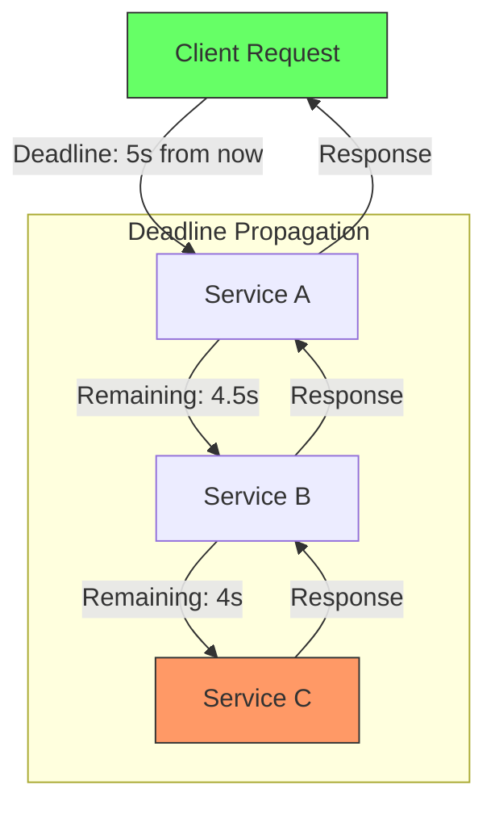
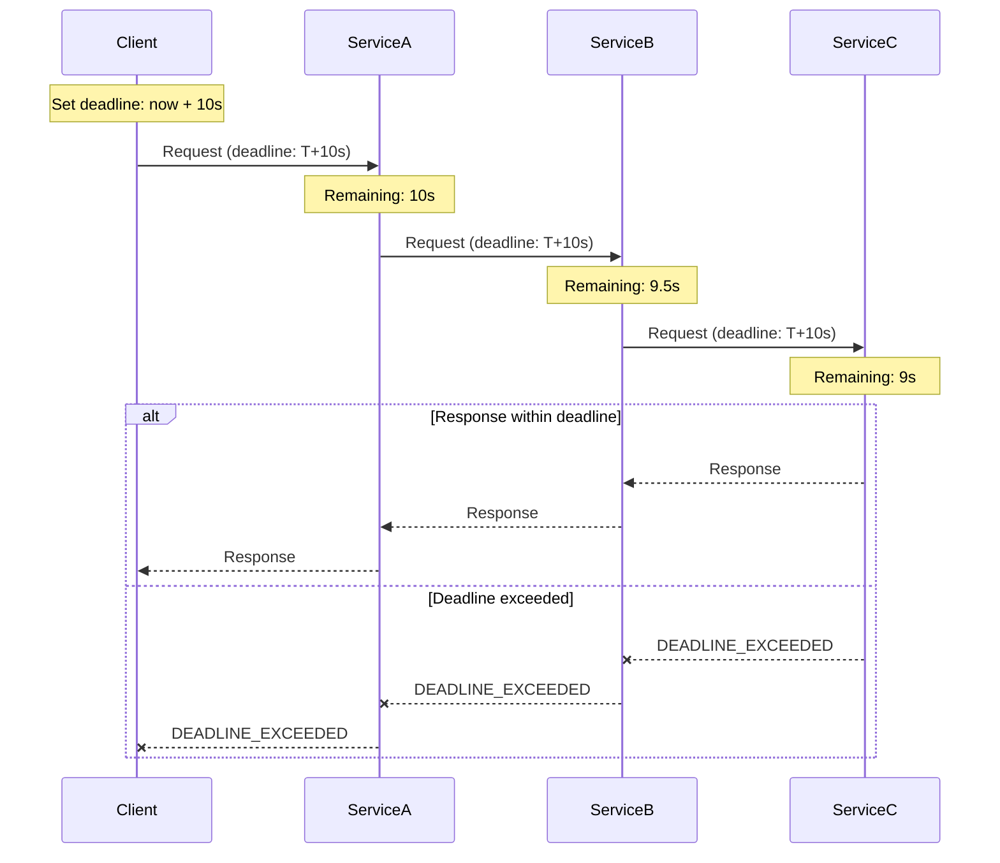
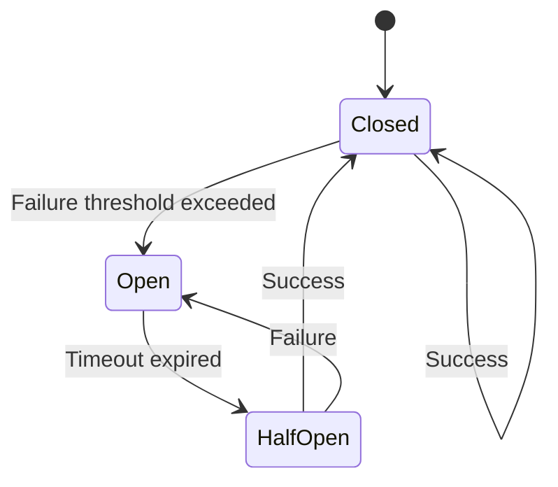
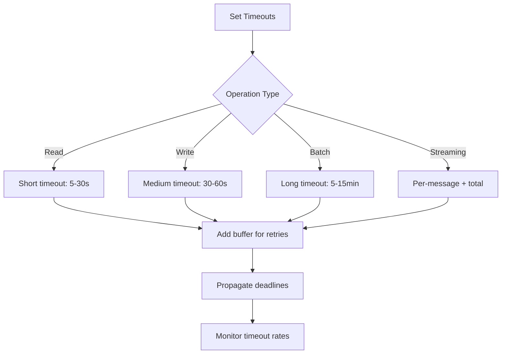

# How to Handle Retries and Timeouts in gRPC

Author: [nawazdhandala](https://www.github.com/nawazdhandala)

Tags: gRPC, Retries, Timeouts, Deadlines, Resilience, Error Handling, Circuit Breaker

Description: A comprehensive guide to implementing retries and timeouts in gRPC services, covering deadline propagation, retry policies, exponential backoff, and circuit breaker patterns.

---

> Proper retry and timeout handling is critical for building resilient gRPC services. This guide covers best practices for configuring deadlines, implementing retry policies, and avoiding common pitfalls that can lead to cascading failures.

gRPC provides built-in support for deadlines and retries, but getting the configuration right requires understanding how these mechanisms interact across distributed services.

---

## Understanding Deadlines vs Timeouts



In gRPC:
- **Deadline**: An absolute point in time when the request should complete
- **Timeout**: A relative duration that gets converted to a deadline
- Deadlines propagate automatically across service calls

---

## Setting Timeouts in Client Code

### Python Implementation

```python
import grpc
from datetime import datetime, timedelta

# Method 1: Simple timeout in seconds
def call_with_timeout(stub, request):
    try:
        # Timeout of 30 seconds
        response = stub.GetData(request, timeout=30)
        return response
    except grpc.RpcError as e:
        if e.code() == grpc.StatusCode.DEADLINE_EXCEEDED:
            print("Request timed out")
        raise

# Method 2: Using explicit deadline
def call_with_deadline(stub, request):
    # Set deadline 30 seconds from now
    deadline = datetime.now() + timedelta(seconds=30)

    try:
        response = stub.GetData(
            request,
            timeout=(deadline - datetime.now()).total_seconds()
        )
        return response
    except grpc.RpcError as e:
        if e.code() == grpc.StatusCode.DEADLINE_EXCEEDED:
            print(f"Request exceeded deadline: {deadline}")
        raise

# Method 3: Different timeouts for different operations
class GrpcClient:
    def __init__(self, channel):
        self.stub = service_pb2_grpc.MyServiceStub(channel)
        # Define operation-specific timeouts
        self.timeouts = {
            'quick_read': 5,      # Fast reads
            'standard': 30,       # Normal operations
            'long_running': 300,  # Batch or export operations
        }

    def get_data(self, request):
        return self.stub.GetData(
            request,
            timeout=self.timeouts['standard']
        )

    def export_data(self, request):
        return self.stub.ExportData(
            request,
            timeout=self.timeouts['long_running']
        )
```

### Go Implementation

```go
package main

import (
    "context"
    "log"
    "time"

    "google.golang.org/grpc"
    "google.golang.org/grpc/codes"
    "google.golang.org/grpc/status"

    pb "myservice/proto"
)

// CallWithTimeout demonstrates timeout usage in Go
func CallWithTimeout(client pb.MyServiceClient, req *pb.DataRequest) (*pb.DataResponse, error) {
    // Create context with timeout
    ctx, cancel := context.WithTimeout(context.Background(), 30*time.Second)
    defer cancel() // Always cancel to release resources

    resp, err := client.GetData(ctx, req)
    if err != nil {
        // Check if it was a deadline exceeded error
        if status.Code(err) == codes.DeadlineExceeded {
            log.Println("Request timed out")
        }
        return nil, err
    }

    return resp, nil
}

// CallWithDeadline uses an absolute deadline
func CallWithDeadline(client pb.MyServiceClient, req *pb.DataRequest) (*pb.DataResponse, error) {
    // Set deadline 30 seconds from now
    deadline := time.Now().Add(30 * time.Second)
    ctx, cancel := context.WithDeadline(context.Background(), deadline)
    defer cancel()

    resp, err := client.GetData(ctx, req)
    if err != nil {
        if status.Code(err) == codes.DeadlineExceeded {
            log.Printf("Request exceeded deadline: %v", deadline)
        }
        return nil, err
    }

    return resp, nil
}

// OperationTimeouts defines different timeouts per operation type
type OperationTimeouts struct {
    QuickRead   time.Duration
    Standard    time.Duration
    LongRunning time.Duration
}

var defaultTimeouts = OperationTimeouts{
    QuickRead:   5 * time.Second,
    Standard:    30 * time.Second,
    LongRunning: 5 * time.Minute,
}
```

---

## Deadline Propagation



### Server-Side Deadline Handling

```python
import grpc

class MyService(service_pb2_grpc.MyServiceServicer):

    def GetData(self, request, context):
        # Check remaining time before starting expensive operations
        remaining_time = context.time_remaining()

        if remaining_time is not None and remaining_time < 1.0:
            # Less than 1 second remaining, abort early
            context.abort(
                grpc.StatusCode.DEADLINE_EXCEEDED,
                "Insufficient time to complete request"
            )

        # Check if context is already cancelled
        if context.cancelled():
            return service_pb2.DataResponse()

        # For long operations, check periodically
        result = []
        for item in self._fetch_items(request):
            if context.cancelled():
                # Client cancelled or deadline exceeded
                break
            result.append(item)

        return service_pb2.DataResponse(items=result)

    def _propagate_deadline(self, context, downstream_stub, request):
        """Propagate deadline to downstream service"""
        remaining = context.time_remaining()

        if remaining is None:
            # No deadline set, use default
            timeout = 30
        elif remaining <= 0:
            # Already exceeded
            raise grpc.RpcError(
                grpc.StatusCode.DEADLINE_EXCEEDED,
                "Deadline already exceeded"
            )
        else:
            # Propagate remaining time (leave some buffer)
            timeout = max(remaining - 0.5, 0.1)

        return downstream_stub.ProcessData(request, timeout=timeout)
```

### Go Server Deadline Handling

```go
package main

import (
    "context"
    "time"

    "google.golang.org/grpc/codes"
    "google.golang.org/grpc/status"

    pb "myservice/proto"
)

func (s *server) GetData(ctx context.Context, req *pb.DataRequest) (*pb.DataResponse, error) {
    // Check if deadline is set
    deadline, ok := ctx.Deadline()
    if ok {
        remaining := time.Until(deadline)
        if remaining < time.Second {
            return nil, status.Error(codes.DeadlineExceeded, "insufficient time remaining")
        }
    }

    // Process with context awareness
    resultChan := make(chan *pb.DataResponse, 1)
    errChan := make(chan error, 1)

    go func() {
        // Expensive operation
        result, err := s.processData(ctx, req)
        if err != nil {
            errChan <- err
            return
        }
        resultChan <- result
    }()

    // Wait for result or context cancellation
    select {
    case <-ctx.Done():
        return nil, status.Error(codes.DeadlineExceeded, ctx.Err().Error())
    case err := <-errChan:
        return nil, err
    case result := <-resultChan:
        return result, nil
    }
}

// PropagateDeadline forwards the deadline to downstream services
func (s *server) callDownstream(ctx context.Context, client pb.DownstreamClient, req *pb.Request) (*pb.Response, error) {
    // The deadline is automatically propagated through the context
    // But we can add a buffer to ensure we have time to process the response
    deadline, ok := ctx.Deadline()
    if ok {
        remaining := time.Until(deadline)
        // Reserve 500ms for response processing
        newDeadline := deadline.Add(-500 * time.Millisecond)
        if newDeadline.Before(time.Now()) {
            return nil, status.Error(codes.DeadlineExceeded, "no time remaining for downstream call")
        }
        var cancel context.CancelFunc
        ctx, cancel = context.WithDeadline(ctx, newDeadline)
        defer cancel()
    }

    return client.Process(ctx, req)
}
```

---

## Configuring Retry Policies

### Service Config Retry Policy

```python
import grpc
import json

# Define retry policy in service config
service_config = {
    "methodConfig": [
        {
            # Apply to all methods
            "name": [{"service": "myservice.MyService"}],
            "retryPolicy": {
                "maxAttempts": 3,
                "initialBackoff": "0.1s",
                "maxBackoff": "10s",
                "backoffMultiplier": 2,
                "retryableStatusCodes": [
                    "UNAVAILABLE",
                    "RESOURCE_EXHAUSTED",
                    "ABORTED"
                ]
            }
        },
        {
            # Different policy for specific methods
            "name": [{"service": "myservice.MyService", "method": "GetData"}],
            "retryPolicy": {
                "maxAttempts": 5,
                "initialBackoff": "0.5s",
                "maxBackoff": "30s",
                "backoffMultiplier": 2,
                "retryableStatusCodes": ["UNAVAILABLE"]
            },
            # Also set timeout for this method
            "timeout": "30s"
        }
    ]
}

# Create channel with retry policy
channel = grpc.insecure_channel(
    'localhost:50051',
    options=[
        ('grpc.service_config', json.dumps(service_config)),
        ('grpc.enable_retries', 1),
    ]
)
```

### Go Service Config

```go
package main

import (
    "google.golang.org/grpc"
)

func createChannelWithRetry(address string) (*grpc.ClientConn, error) {
    // Service config with retry policy
    serviceConfig := `{
        "methodConfig": [{
            "name": [{"service": "myservice.MyService"}],
            "waitForReady": true,
            "retryPolicy": {
                "maxAttempts": 3,
                "initialBackoff": "0.1s",
                "maxBackoff": "10s",
                "backoffMultiplier": 2,
                "retryableStatusCodes": ["UNAVAILABLE", "RESOURCE_EXHAUSTED"]
            }
        }]
    }`

    conn, err := grpc.Dial(
        address,
        grpc.WithInsecure(),
        grpc.WithDefaultServiceConfig(serviceConfig),
    )

    return conn, err
}
```

---

## Manual Retry Implementation

### Python Retry with Exponential Backoff

```python
import grpc
import time
import random
from functools import wraps

class RetryConfig:
    def __init__(
        self,
        max_attempts=3,
        initial_backoff=0.1,
        max_backoff=10.0,
        backoff_multiplier=2.0,
        retriable_codes=None,
        jitter=True
    ):
        self.max_attempts = max_attempts
        self.initial_backoff = initial_backoff
        self.max_backoff = max_backoff
        self.backoff_multiplier = backoff_multiplier
        self.retriable_codes = retriable_codes or [
            grpc.StatusCode.UNAVAILABLE,
            grpc.StatusCode.RESOURCE_EXHAUSTED,
            grpc.StatusCode.ABORTED,
        ]
        self.jitter = jitter

def retry_with_backoff(config=None):
    """Decorator for automatic retry with exponential backoff"""
    if config is None:
        config = RetryConfig()

    def decorator(func):
        @wraps(func)
        def wrapper(*args, **kwargs):
            last_error = None
            backoff = config.initial_backoff

            for attempt in range(config.max_attempts):
                try:
                    return func(*args, **kwargs)
                except grpc.RpcError as e:
                    last_error = e

                    if e.code() not in config.retriable_codes:
                        # Non-retriable error, raise immediately
                        raise

                    if attempt == config.max_attempts - 1:
                        # Last attempt, raise the error
                        raise

                    # Calculate backoff with optional jitter
                    sleep_time = min(backoff, config.max_backoff)
                    if config.jitter:
                        sleep_time = sleep_time * (0.5 + random.random())

                    print(f"Attempt {attempt + 1} failed: {e.code()}. "
                          f"Retrying in {sleep_time:.2f}s...")

                    time.sleep(sleep_time)
                    backoff *= config.backoff_multiplier

            raise last_error

        return wrapper
    return decorator

# Usage
class GrpcClient:
    def __init__(self, channel):
        self.stub = service_pb2_grpc.MyServiceStub(channel)

    @retry_with_backoff(RetryConfig(max_attempts=5))
    def get_data(self, request):
        return self.stub.GetData(request, timeout=30)

    @retry_with_backoff(RetryConfig(
        max_attempts=3,
        retriable_codes=[grpc.StatusCode.UNAVAILABLE]
    ))
    def update_data(self, request):
        # Be more conservative with write operations
        return self.stub.UpdateData(request, timeout=30)
```

### Go Retry Implementation

```go
package main

import (
    "context"
    "math"
    "math/rand"
    "time"

    "google.golang.org/grpc"
    "google.golang.org/grpc/codes"
    "google.golang.org/grpc/status"
)

// RetryConfig holds retry configuration
type RetryConfig struct {
    MaxAttempts       int
    InitialBackoff    time.Duration
    MaxBackoff        time.Duration
    BackoffMultiplier float64
    RetriableCodes    map[codes.Code]bool
    Jitter            bool
}

// DefaultRetryConfig returns sensible defaults
func DefaultRetryConfig() RetryConfig {
    return RetryConfig{
        MaxAttempts:       3,
        InitialBackoff:    100 * time.Millisecond,
        MaxBackoff:        10 * time.Second,
        BackoffMultiplier: 2.0,
        RetriableCodes: map[codes.Code]bool{
            codes.Unavailable:       true,
            codes.ResourceExhausted: true,
            codes.Aborted:           true,
        },
        Jitter: true,
    }
}

// RetryUnary executes a unary RPC with retry logic
func RetryUnary[Req any, Resp any](
    ctx context.Context,
    config RetryConfig,
    call func(context.Context, Req, ...grpc.CallOption) (Resp, error),
    req Req,
    opts ...grpc.CallOption,
) (Resp, error) {
    var lastErr error
    var zero Resp
    backoff := config.InitialBackoff

    for attempt := 0; attempt < config.MaxAttempts; attempt++ {
        resp, err := call(ctx, req, opts...)
        if err == nil {
            return resp, nil
        }

        lastErr = err
        st, ok := status.FromError(err)
        if !ok || !config.RetriableCodes[st.Code()] {
            // Non-retriable error
            return zero, err
        }

        if attempt == config.MaxAttempts-1 {
            // Last attempt
            break
        }

        // Calculate sleep duration
        sleep := backoff
        if sleep > config.MaxBackoff {
            sleep = config.MaxBackoff
        }
        if config.Jitter {
            sleep = time.Duration(float64(sleep) * (0.5 + rand.Float64()))
        }

        // Check if context will expire before we can retry
        if deadline, ok := ctx.Deadline(); ok {
            if time.Until(deadline) < sleep {
                return zero, lastErr
            }
        }

        time.Sleep(sleep)
        backoff = time.Duration(float64(backoff) * config.BackoffMultiplier)
    }

    return zero, lastErr
}

// Usage
func (c *client) GetDataWithRetry(ctx context.Context, req *pb.DataRequest) (*pb.DataResponse, error) {
    return RetryUnary(
        ctx,
        DefaultRetryConfig(),
        c.stub.GetData,
        req,
    )
}
```

---

## Circuit Breaker Pattern



### Python Circuit Breaker

```python
import time
import threading
from enum import Enum
from collections import deque

class CircuitState(Enum):
    CLOSED = "closed"      # Normal operation
    OPEN = "open"          # Failing, reject requests
    HALF_OPEN = "half_open"  # Testing if service recovered

class CircuitBreaker:
    def __init__(
        self,
        failure_threshold=5,
        recovery_timeout=30,
        half_open_max_calls=3,
        window_size=60
    ):
        self.failure_threshold = failure_threshold
        self.recovery_timeout = recovery_timeout
        self.half_open_max_calls = half_open_max_calls
        self.window_size = window_size

        self.state = CircuitState.CLOSED
        self.failures = deque()
        self.last_failure_time = 0
        self.half_open_calls = 0
        self.lock = threading.Lock()

    def _clean_old_failures(self):
        """Remove failures outside the window"""
        cutoff = time.time() - self.window_size
        while self.failures and self.failures[0] < cutoff:
            self.failures.popleft()

    def can_execute(self):
        """Check if request should be allowed"""
        with self.lock:
            if self.state == CircuitState.CLOSED:
                return True

            if self.state == CircuitState.OPEN:
                # Check if recovery timeout has passed
                if time.time() - self.last_failure_time >= self.recovery_timeout:
                    self.state = CircuitState.HALF_OPEN
                    self.half_open_calls = 0
                    return True
                return False

            if self.state == CircuitState.HALF_OPEN:
                # Allow limited calls in half-open state
                if self.half_open_calls < self.half_open_max_calls:
                    self.half_open_calls += 1
                    return True
                return False

        return False

    def record_success(self):
        """Record a successful call"""
        with self.lock:
            if self.state == CircuitState.HALF_OPEN:
                # Recovery successful, close the circuit
                self.state = CircuitState.CLOSED
                self.failures.clear()

    def record_failure(self):
        """Record a failed call"""
        with self.lock:
            now = time.time()
            self.failures.append(now)
            self.last_failure_time = now
            self._clean_old_failures()

            if self.state == CircuitState.HALF_OPEN:
                # Recovery failed, open the circuit again
                self.state = CircuitState.OPEN
            elif len(self.failures) >= self.failure_threshold:
                # Threshold exceeded, open the circuit
                self.state = CircuitState.OPEN

class GrpcClientWithCircuitBreaker:
    def __init__(self, channel):
        self.stub = service_pb2_grpc.MyServiceStub(channel)
        self.circuit_breaker = CircuitBreaker()

    def get_data(self, request, timeout=30):
        if not self.circuit_breaker.can_execute():
            raise grpc.RpcError(
                grpc.StatusCode.UNAVAILABLE,
                "Circuit breaker is open"
            )

        try:
            response = self.stub.GetData(request, timeout=timeout)
            self.circuit_breaker.record_success()
            return response
        except grpc.RpcError as e:
            if e.code() in [
                grpc.StatusCode.UNAVAILABLE,
                grpc.StatusCode.DEADLINE_EXCEEDED
            ]:
                self.circuit_breaker.record_failure()
            raise
```

---

## Timeout Best Practices



### Timeout Configuration Guidelines

```python
# Timeout configuration by operation type
TIMEOUT_CONFIG = {
    # Quick lookups
    'cache_read': 2,
    'metadata_read': 5,

    # Standard CRUD operations
    'read': 30,
    'write': 60,
    'delete': 30,

    # Complex operations
    'search': 60,
    'aggregate': 120,

    # Long-running operations
    'export': 600,  # 10 minutes
    'import': 900,  # 15 minutes
    'batch_process': 1800,  # 30 minutes

    # Streaming operations
    'stream_per_message': 30,
    'stream_total': 3600,  # 1 hour
}

def get_timeout_with_retry_budget(operation, max_retries=3):
    """Calculate total timeout including retry budget"""
    base_timeout = TIMEOUT_CONFIG.get(operation, 30)
    # Account for retries with exponential backoff
    # Sum of backoffs: 0.1 + 0.2 + 0.4 + ... ~= 2 * (2^n - 1) * initial
    retry_budget = 2 * (2 ** max_retries - 1) * 0.1
    return base_timeout + retry_budget
```

---

## Best Practices Summary

1. **Always set deadlines** - Never make unbounded requests
2. **Propagate deadlines** - Pass remaining time to downstream services
3. **Use retriable status codes** - Only retry transient failures (UNAVAILABLE, RESOURCE_EXHAUSTED)
4. **Implement exponential backoff** - With jitter to prevent thundering herd
5. **Add circuit breakers** - Fail fast when services are unhealthy
6. **Monitor timeout rates** - High timeout rates indicate capacity or performance issues
7. **Reserve buffer time** - Leave time for response processing when propagating deadlines

---

## Conclusion

Proper retry and timeout handling is essential for building resilient gRPC services. By configuring appropriate deadlines, implementing retry policies with exponential backoff, and using circuit breakers, you can build systems that gracefully handle transient failures without causing cascading problems.

The key is finding the right balance between resilience (retrying failures) and stability (not overwhelming failing services).

---

*Need to monitor retries and timeouts in your gRPC services? [OneUptime](https://oneuptime.com) provides real-time metrics and alerting to help you identify retry storms and timeout issues before they impact users.*

**Related Reading:**
- [How to Fix "Connection Refused" Errors in gRPC](https://oneuptime.com/blog)
- [How to Fix gRPC Performance Issues](https://oneuptime.com/blog)
