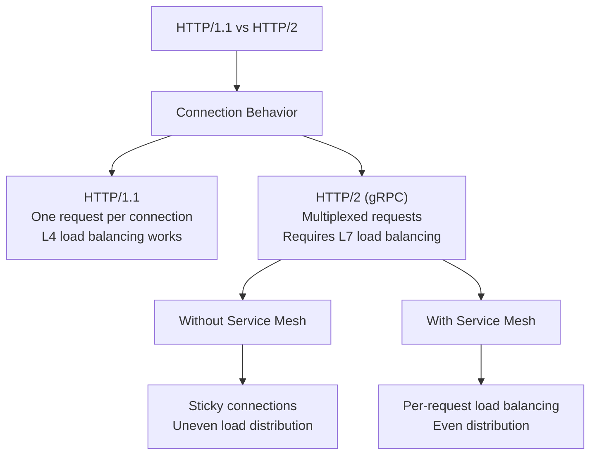
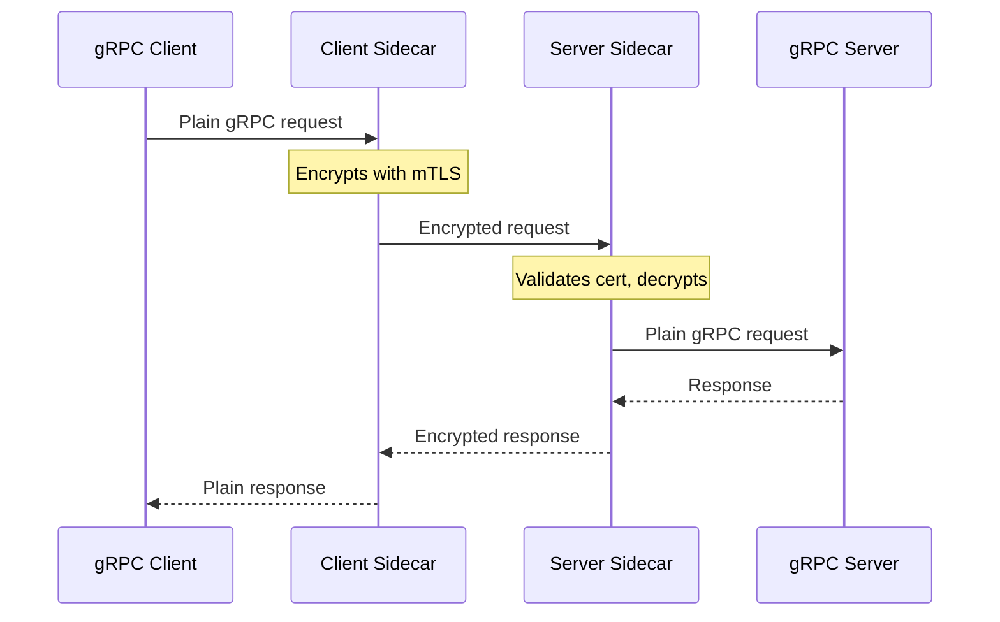
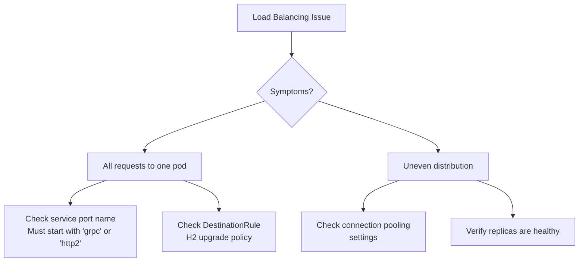

# How to Configure gRPC Service Mesh Integration

Author: [nawazdhandala](https://www.github.com/nawazdhandala)

Tags: gRPC, Service Mesh, Istio, Linkerd, Kubernetes, Load Balancing, mTLS, Observability

Description: A comprehensive guide to integrating gRPC services with service meshes like Istio and Linkerd, covering load balancing, mTLS, traffic management, and observability.

---

> Service meshes provide powerful capabilities for gRPC services including automatic mTLS, load balancing, traffic management, and observability. However, gRPC's HTTP/2 based protocol requires specific configuration to work correctly with service meshes.

This guide covers the essential configurations for running gRPC services in Istio, Linkerd, and other service meshes.

---

## Why gRPC Needs Special Service Mesh Configuration



---

## Istio Configuration for gRPC

### Basic Service and Deployment

```yaml
# deployment.yaml
apiVersion: apps/v1
kind: Deployment
metadata:
  name: grpc-service
  labels:
    app: grpc-service
    version: v1
spec:
  replicas: 3
  selector:
    matchLabels:
      app: grpc-service
  template:
    metadata:
      labels:
        app: grpc-service
        version: v1
      annotations:
        # Enable Istio sidecar injection
        sidecar.istio.io/inject: "true"
        # Exclude gRPC health check port from mesh if needed
        # traffic.sidecar.istio.io/excludeInboundPorts: "9090"
    spec:
      containers:
        - name: grpc-service
          image: myregistry/grpc-service:v1
          ports:
            - containerPort: 50051
              name: grpc
              protocol: TCP
            - containerPort: 9090
              name: health
              protocol: TCP
          # Health checks using gRPC health protocol
          readinessProbe:
            grpc:
              port: 50051
            initialDelaySeconds: 5
            periodSeconds: 10
          livenessProbe:
            grpc:
              port: 50051
            initialDelaySeconds: 15
            periodSeconds: 20
          resources:
            requests:
              cpu: 100m
              memory: 128Mi
            limits:
              cpu: 500m
              memory: 512Mi
---
# service.yaml
apiVersion: v1
kind: Service
metadata:
  name: grpc-service
  labels:
    app: grpc-service
spec:
  ports:
    - port: 50051
      targetPort: 50051
      name: grpc
      # IMPORTANT: Protocol must be specified for Istio
      # to handle gRPC traffic correctly
      appProtocol: grpc
  selector:
    app: grpc-service
```

### Istio DestinationRule for gRPC Load Balancing

```yaml
# destination-rule.yaml
apiVersion: networking.istio.io/v1beta1
kind: DestinationRule
metadata:
  name: grpc-service-destination
spec:
  host: grpc-service
  trafficPolicy:
    # Connection pool settings for gRPC
    connectionPool:
      tcp:
        maxConnections: 100
        connectTimeout: 10s
      http:
        # HTTP/2 specific settings for gRPC
        h2UpgradePolicy: UPGRADE
        # Max requests per connection before creating new one
        maxRequestsPerConnection: 1000
        # Max concurrent streams per connection
        http2MaxRequests: 1000

    # Load balancing policy
    loadBalancer:
      simple: ROUND_ROBIN
      # Or use consistent hashing for stateful services
      # consistentHash:
      #   httpHeaderName: "x-user-id"

    # Circuit breaker settings
    outlierDetection:
      consecutive5xxErrors: 5
      interval: 30s
      baseEjectionTime: 30s
      maxEjectionPercent: 50
      minHealthPercent: 30

  # Subset definitions for canary deployments
  subsets:
    - name: v1
      labels:
        version: v1
    - name: v2
      labels:
        version: v2
```

### Istio VirtualService for Traffic Management

```yaml
# virtual-service.yaml
apiVersion: networking.istio.io/v1beta1
kind: VirtualService
metadata:
  name: grpc-service-routing
spec:
  hosts:
    - grpc-service
  http:
    # Route based on gRPC method
    - match:
        - headers:
            ":path":
              prefix: "/mypackage.MyService/ExpensiveMethod"
      route:
        - destination:
            host: grpc-service
            subset: v2
          weight: 10
        - destination:
            host: grpc-service
            subset: v1
          weight: 90
      # Timeout for expensive method
      timeout: 60s
      retries:
        attempts: 3
        perTryTimeout: 20s
        retryOn: "unavailable,resource-exhausted"

    # Default route
    - route:
        - destination:
            host: grpc-service
            subset: v1
      timeout: 10s
      retries:
        attempts: 3
        perTryTimeout: 5s
        # gRPC specific retry conditions
        retryOn: "unavailable,deadline-exceeded,resource-exhausted"
```

### Istio Gateway for External gRPC Traffic

```yaml
# gateway.yaml
apiVersion: networking.istio.io/v1beta1
kind: Gateway
metadata:
  name: grpc-gateway
spec:
  selector:
    istio: ingressgateway
  servers:
    - port:
        number: 443
        name: grpc-tls
        protocol: HTTPS
      tls:
        mode: SIMPLE
        credentialName: grpc-gateway-cert
      hosts:
        - "grpc.example.com"
---
# External virtual service
apiVersion: networking.istio.io/v1beta1
kind: VirtualService
metadata:
  name: grpc-external-routing
spec:
  hosts:
    - "grpc.example.com"
  gateways:
    - grpc-gateway
  http:
    - match:
        - uri:
            prefix: /mypackage.MyService
      route:
        - destination:
            host: grpc-service
            port:
              number: 50051
```

---

## Linkerd Configuration for gRPC

### Linkerd Service Profile for Retries

```yaml
# service-profile.yaml
apiVersion: linkerd.io/v1alpha2
kind: ServiceProfile
metadata:
  name: grpc-service.default.svc.cluster.local
  namespace: default
spec:
  # Define routes for gRPC methods
  routes:
    - name: GetResource
      condition:
        method: POST
        pathRegex: /mypackage\.MyService/GetResource
      # Mark as safe to retry
      isRetryable: true
      timeout: 5s

    - name: UpdateResource
      condition:
        method: POST
        pathRegex: /mypackage\.MyService/UpdateResource
      # Not safe to retry (not idempotent)
      isRetryable: false
      timeout: 10s

    - name: StreamData
      condition:
        method: POST
        pathRegex: /mypackage\.MyService/StreamData
      # Streaming endpoint with longer timeout
      isRetryable: false
      timeout: 300s

  # Retry budget configuration
  retryBudget:
    retryRatio: 0.2
    minRetriesPerSecond: 10
    ttl: 10s
```

### Linkerd Traffic Split for Canary

```yaml
# traffic-split.yaml
apiVersion: split.smi-spec.io/v1alpha4
kind: TrafficSplit
metadata:
  name: grpc-service-split
  namespace: default
spec:
  service: grpc-service
  backends:
    - service: grpc-service-v1
      weight: 90
    - service: grpc-service-v2
      weight: 10
```

### Linkerd Server Authorization

```yaml
# server.yaml
apiVersion: policy.linkerd.io/v1beta1
kind: Server
metadata:
  name: grpc-service-server
  namespace: default
spec:
  podSelector:
    matchLabels:
      app: grpc-service
  port: 50051
  proxyProtocol: gRPC
---
# Authorization policy
apiVersion: policy.linkerd.io/v1alpha1
kind: AuthorizationPolicy
metadata:
  name: grpc-service-authz
  namespace: default
spec:
  targetRef:
    group: policy.linkerd.io
    kind: Server
    name: grpc-service-server
  requiredAuthenticationRefs:
    - name: grpc-clients-mtls
      kind: MeshTLSAuthentication
      group: policy.linkerd.io
---
# mTLS authentication
apiVersion: policy.linkerd.io/v1alpha1
kind: MeshTLSAuthentication
metadata:
  name: grpc-clients-mtls
  namespace: default
spec:
  identities:
    - "*.default.serviceaccount.identity.linkerd.cluster.local"
```

---

## mTLS Configuration



### Istio Strict mTLS

```yaml
# peer-authentication.yaml
apiVersion: security.istio.io/v1beta1
kind: PeerAuthentication
metadata:
  name: grpc-service-mtls
  namespace: default
spec:
  selector:
    matchLabels:
      app: grpc-service
  mtls:
    mode: STRICT
---
# Destination rule to enforce mTLS
apiVersion: networking.istio.io/v1beta1
kind: DestinationRule
metadata:
  name: grpc-service-mtls
  namespace: default
spec:
  host: grpc-service.default.svc.cluster.local
  trafficPolicy:
    tls:
      mode: ISTIO_MUTUAL
```

---

## Observability Integration

### Istio Telemetry for gRPC Metrics

```yaml
# telemetry.yaml
apiVersion: telemetry.istio.io/v1alpha1
kind: Telemetry
metadata:
  name: grpc-service-telemetry
  namespace: default
spec:
  selector:
    matchLabels:
      app: grpc-service
  # Enable access logging
  accessLogging:
    - providers:
        - name: envoy
      filter:
        expression: "response.code >= 400"
  # Tracing configuration
  tracing:
    - providers:
        - name: "zipkin"
      randomSamplingPercentage: 10.0
      customTags:
        grpc_method:
          header:
            name: ":path"
```

### Go Client with Mesh-Aware Tracing

```go
package main

import (
    "context"
    "log"

    "go.opentelemetry.io/contrib/instrumentation/google.golang.org/grpc/otelgrpc"
    "go.opentelemetry.io/otel"
    "go.opentelemetry.io/otel/propagation"
    "google.golang.org/grpc"
    "google.golang.org/grpc/metadata"
)

// CreateMeshAwareClient creates a gRPC client that works with service mesh
func CreateMeshAwareClient(address string) (*grpc.ClientConn, error) {
    // Configure trace propagation
    // Service mesh will pick up these headers
    otel.SetTextMapPropagator(
        propagation.NewCompositeTextMapPropagator(
            propagation.TraceContext{},
            propagation.Baggage{},
        ),
    )

    return grpc.Dial(
        address,
        // Plain text since mesh handles mTLS
        grpc.WithInsecure(),
        // Add tracing interceptor
        grpc.WithUnaryInterceptor(otelgrpc.UnaryClientInterceptor()),
        grpc.WithStreamInterceptor(otelgrpc.StreamClientInterceptor()),
        // Set default call options
        grpc.WithDefaultCallOptions(
            // Let mesh handle retries
            grpc.WaitForReady(true),
        ),
    )
}

// PropagateHeaders ensures trace headers are propagated
func PropagateHeaders(ctx context.Context) context.Context {
    // Extract trace context from incoming request
    md, ok := metadata.FromIncomingContext(ctx)
    if !ok {
        return ctx
    }

    // Create outgoing context with same metadata
    // This ensures trace propagation through the mesh
    return metadata.NewOutgoingContext(ctx, md)
}
```

### Python Client with Mesh Integration

```python
import grpc
from opentelemetry import trace
from opentelemetry.instrumentation.grpc import GrpcInstrumentorClient
from opentelemetry.propagate import inject

# Instrument gRPC client for tracing
GrpcInstrumentorClient().instrument()


def create_mesh_aware_channel(address: str) -> grpc.Channel:
    """Create a gRPC channel that works with service mesh."""

    # Use insecure channel since mesh handles mTLS
    channel = grpc.insecure_channel(
        address,
        options=[
            # Wait for connection to be ready
            ('grpc.lb_policy_name', 'round_robin'),
            # Let mesh handle load balancing
            ('grpc.enable_retries', 0),  # Disable client retries
            # Increase initial window size for streaming
            ('grpc.http2.initial_window_size', 1024 * 1024),
        ]
    )

    return channel


class MeshAwareInterceptor(grpc.UnaryUnaryClientInterceptor):
    """Interceptor to add mesh-compatible headers."""

    def intercept_unary_unary(self, continuation, client_call_details, request):
        # Get current span context
        ctx = trace.get_current_span().get_span_context()

        # Add trace headers that mesh will propagate
        metadata = list(client_call_details.metadata or [])

        # Inject trace context into metadata
        carrier = {}
        inject(carrier)

        for key, value in carrier.items():
            metadata.append((key, value))

        new_details = _ClientCallDetails(
            client_call_details.method,
            client_call_details.timeout,
            metadata,
            client_call_details.credentials,
            client_call_details.wait_for_ready,
            client_call_details.compression
        )

        return continuation(new_details, request)
```

---

## Common Issues and Solutions

### Issue 1: Load Balancing Not Working



```yaml
# Fix: Ensure port naming is correct
apiVersion: v1
kind: Service
metadata:
  name: grpc-service
spec:
  ports:
    # Option 1: Use grpc prefix
    - port: 50051
      name: grpc-main
    # Option 2: Use appProtocol
    - port: 50052
      name: api
      appProtocol: grpc
```

### Issue 2: Health Checks Failing Through Mesh

```yaml
# Fix: Configure health check to bypass proxy or use gRPC health
apiVersion: apps/v1
kind: Deployment
metadata:
  name: grpc-service
spec:
  template:
    metadata:
      annotations:
        # Option 1: Exclude health port from mesh
        traffic.sidecar.istio.io/excludeInboundPorts: "9090"
    spec:
      containers:
        - name: grpc-service
          # Option 2: Use gRPC health check (Kubernetes 1.24+)
          readinessProbe:
            grpc:
              port: 50051
            initialDelaySeconds: 5
```

### Issue 3: Streaming Timeouts

```yaml
# Fix: Configure appropriate timeouts for streaming
apiVersion: networking.istio.io/v1beta1
kind: VirtualService
metadata:
  name: grpc-streaming
spec:
  hosts:
    - grpc-service
  http:
    - match:
        - headers:
            ":path":
              prefix: "/mypackage.MyService/StreamData"
      route:
        - destination:
            host: grpc-service
      # Disable timeout for streaming (or set very high)
      timeout: 0s
```

---

## Performance Tuning

```go
package main

import (
    "google.golang.org/grpc"
    "google.golang.org/grpc/keepalive"
    "time"
)

// OptimizedMeshClient creates client optimized for service mesh
func OptimizedMeshClient(address string) (*grpc.ClientConn, error) {
    return grpc.Dial(
        address,
        grpc.WithInsecure(), // Mesh handles TLS
        // Keepalive to match mesh proxy settings
        grpc.WithKeepaliveParams(keepalive.ClientParameters{
            // Match Envoy's default idle timeout
            Time:                30 * time.Second,
            Timeout:             10 * time.Second,
            PermitWithoutStream: true,
        }),
        // Disable client-side load balancing
        // Let mesh handle it
        grpc.WithDefaultServiceConfig(`{
            "loadBalancingPolicy": "pick_first"
        }`),
        // Increase window size for better throughput
        grpc.WithInitialWindowSize(1024 * 1024),
        grpc.WithInitialConnWindowSize(1024 * 1024),
    )
}
```

---

## Conclusion

Integrating gRPC with a service mesh requires understanding how HTTP/2 multiplexing affects load balancing and how to configure the mesh to handle gRPC-specific requirements. Key points:

1. **Name ports correctly** with `grpc` prefix or use `appProtocol: grpc`
2. **Configure L7 load balancing** since L4 won't distribute gRPC requests evenly
3. **Set appropriate timeouts** especially for streaming RPCs
4. **Enable mesh-aware retries** using gRPC status codes
5. **Leverage mesh mTLS** instead of implementing TLS in your application
6. **Propagate trace headers** for distributed tracing through the mesh

---

*Need to monitor your gRPC services running in a service mesh? [OneUptime](https://oneuptime.com) integrates with Istio and Linkerd to provide end-to-end visibility into your microservices.*

**Related Reading:**
- [Istio Configuration for Microservices](https://oneuptime.com/blog)
- [gRPC Load Balancing Strategies](https://oneuptime.com/blog)
