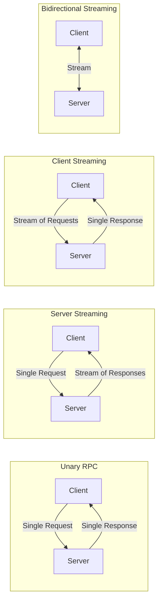
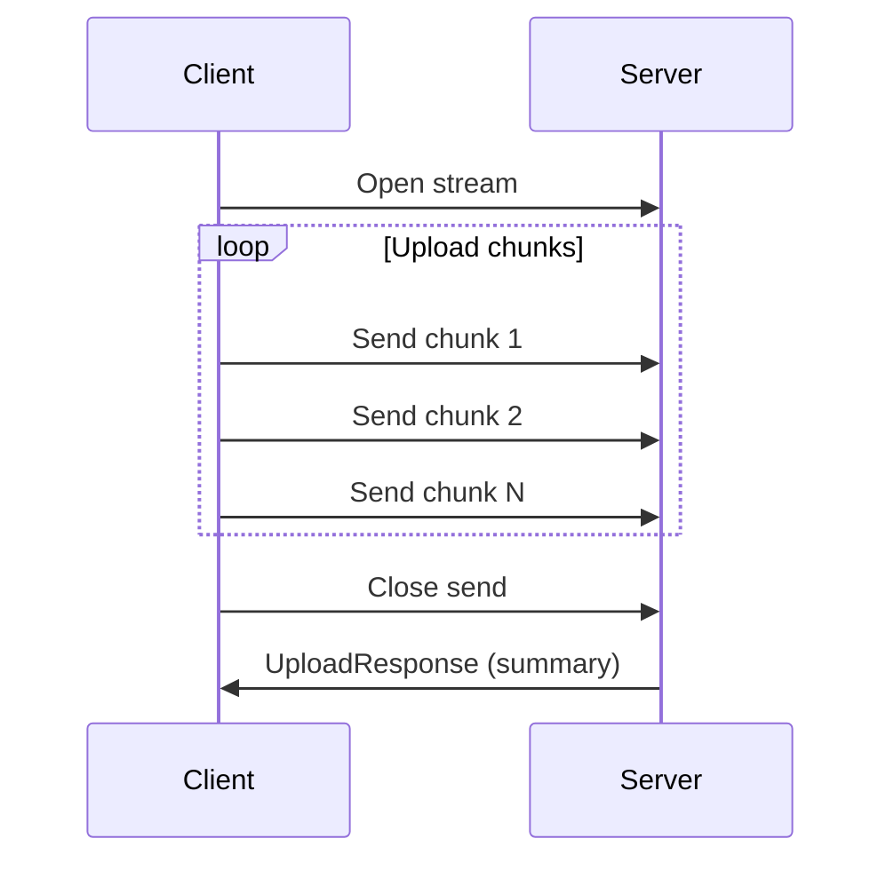
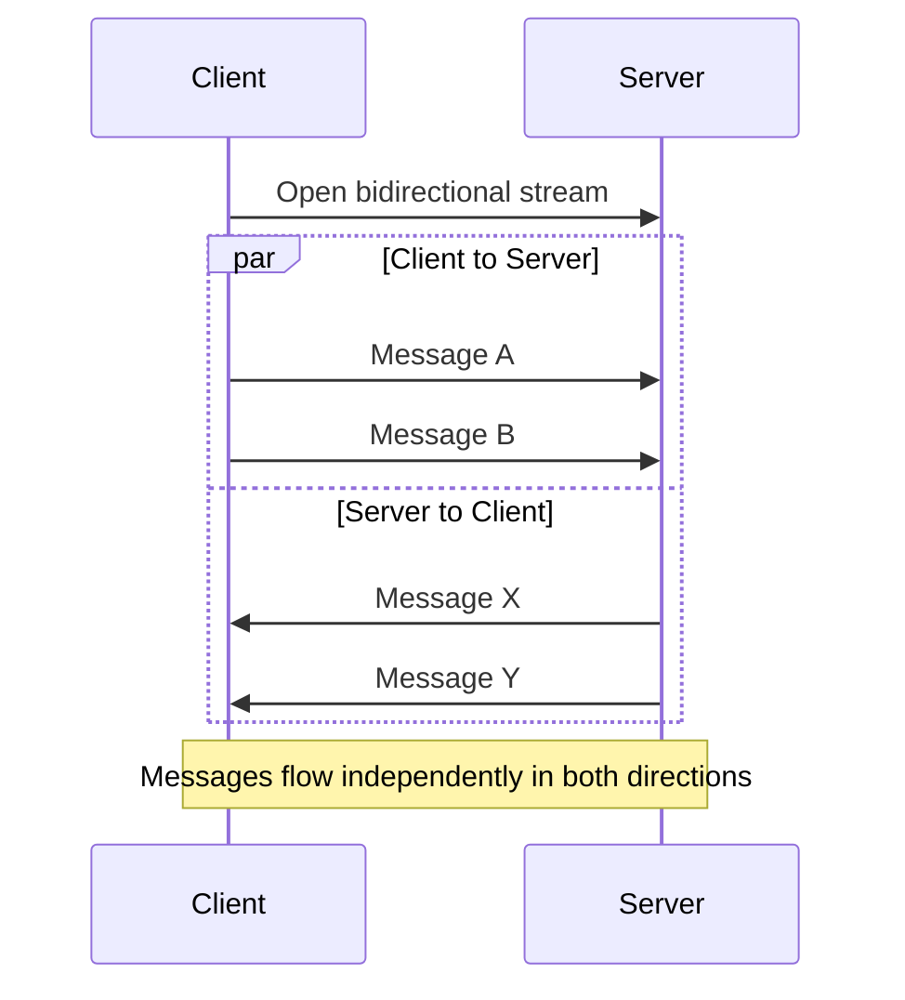

# How to Handle Streaming in gRPC Services

Author: [nawazdhandala](https://github.com/nawazdhandala)

Tags: gRPC, Streaming, Microservices, Real-time, Go, Python

Description: Learn how to implement and handle server streaming, client streaming, and bidirectional streaming in gRPC services.

---

gRPC supports four types of service methods: unary, server streaming, client streaming, and bidirectional streaming. Streaming enables efficient transfer of large datasets, real-time updates, and continuous data flows between clients and servers. This guide covers practical implementations of all streaming patterns.

## Streaming Types Overview



## Protocol Buffer Definition

Define your streaming service in a proto file:

```protobuf
// streaming.proto
syntax = "proto3";

package streaming;

option go_package = "./pb";

// Message definitions
message DataPoint {
    string id = 1;
    double value = 2;
    int64 timestamp = 3;
    map<string, string> metadata = 4;
}

message StreamRequest {
    string subscription_id = 1;
    repeated string topics = 2;
    int32 batch_size = 3;
}

message StreamResponse {
    repeated DataPoint data_points = 1;
    int64 sequence_number = 2;
}

message UploadRequest {
    oneof payload {
        FileMetadata metadata = 1;
        bytes chunk = 2;
    }
}

message FileMetadata {
    string filename = 1;
    string content_type = 2;
    int64 total_size = 3;
}

message UploadResponse {
    string file_id = 1;
    int64 bytes_received = 2;
    string checksum = 3;
}

message ChatMessage {
    string user_id = 1;
    string content = 2;
    int64 timestamp = 3;
}

// Service definition with all streaming types
service DataService {
    // Unary - single request, single response
    rpc GetData(StreamRequest) returns (StreamResponse);

    // Server streaming - single request, stream of responses
    rpc SubscribeData(StreamRequest) returns (stream StreamResponse);

    // Client streaming - stream of requests, single response
    rpc UploadFile(stream UploadRequest) returns (UploadResponse);

    // Bidirectional streaming - stream both ways
    rpc Chat(stream ChatMessage) returns (stream ChatMessage);
}
```

## Server Streaming Implementation

Server streaming is useful for push notifications, real-time feeds, and large data transfers.

### Server Side (Go)

```go
// server_streaming.go - Server streaming implementation
package main

import (
    "context"
    "log"
    "math/rand"
    "time"

    pb "myservice/pb"
)

type dataServer struct {
    pb.UnimplementedDataServiceServer
    subscribers map[string]chan *pb.DataPoint
}

// SubscribeData implements server-side streaming
// Client sends one request, server streams multiple responses
func (s *dataServer) SubscribeData(req *pb.StreamRequest, stream pb.DataService_SubscribeDataServer) error {
    log.Printf("New subscription: %s for topics: %v", req.SubscriptionId, req.Topics)

    // Create a channel for this subscriber
    dataChan := make(chan *pb.DataPoint, 100)
    s.subscribers[req.SubscriptionId] = dataChan
    defer delete(s.subscribers, req.SubscriptionId)
    defer close(dataChan)

    // Simulate data generation
    ticker := time.NewTicker(time.Second)
    defer ticker.Stop()

    var sequenceNumber int64 = 0
    batchSize := int(req.BatchSize)
    if batchSize <= 0 {
        batchSize = 10
    }

    for {
        select {
        case <-stream.Context().Done():
            // Client disconnected or context cancelled
            log.Printf("Subscription %s ended: %v", req.SubscriptionId, stream.Context().Err())
            return stream.Context().Err()

        case <-ticker.C:
            // Generate batch of data points
            dataPoints := make([]*pb.DataPoint, 0, batchSize)
            for i := 0; i < batchSize; i++ {
                dataPoints = append(dataPoints, &pb.DataPoint{
                    Id:        fmt.Sprintf("%s-%d", req.SubscriptionId, sequenceNumber),
                    Value:     rand.Float64() * 100,
                    Timestamp: time.Now().UnixNano(),
                    Metadata: map[string]string{
                        "topic": req.Topics[rand.Intn(len(req.Topics))],
                    },
                })
            }

            // Send response
            resp := &pb.StreamResponse{
                DataPoints:     dataPoints,
                SequenceNumber: sequenceNumber,
            }

            if err := stream.Send(resp); err != nil {
                log.Printf("Error sending to %s: %v", req.SubscriptionId, err)
                return err
            }

            sequenceNumber++
            log.Printf("Sent batch %d to %s", sequenceNumber, req.SubscriptionId)
        }
    }
}
```

### Client Side (Go)

```go
// client_server_streaming.go - Consuming server stream
package main

import (
    "context"
    "io"
    "log"
    "time"

    "google.golang.org/grpc"
    "google.golang.org/grpc/credentials/insecure"
    pb "myservice/pb"
)

func subscribeToData(client pb.DataServiceClient) error {
    // Create context with cancellation
    ctx, cancel := context.WithCancel(context.Background())
    defer cancel()

    // Start the subscription
    stream, err := client.SubscribeData(ctx, &pb.StreamRequest{
        SubscriptionId: "client-001",
        Topics:         []string{"metrics", "events", "logs"},
        BatchSize:      5,
    })
    if err != nil {
        return fmt.Errorf("failed to subscribe: %w", err)
    }

    // Process incoming stream
    for {
        resp, err := stream.Recv()
        if err == io.EOF {
            // Server closed the stream
            log.Println("Stream closed by server")
            return nil
        }
        if err != nil {
            return fmt.Errorf("stream error: %w", err)
        }

        // Process the batch
        log.Printf("Received batch #%d with %d data points",
            resp.SequenceNumber, len(resp.DataPoints))

        for _, dp := range resp.DataPoints {
            log.Printf("  - ID: %s, Value: %.2f, Topic: %s",
                dp.Id, dp.Value, dp.Metadata["topic"])
        }
    }
}

func main() {
    conn, err := grpc.Dial(
        "localhost:50051",
        grpc.WithTransportCredentials(insecure.NewCredentials()),
    )
    if err != nil {
        log.Fatalf("Failed to connect: %v", err)
    }
    defer conn.Close()

    client := pb.NewDataServiceClient(conn)

    if err := subscribeToData(client); err != nil {
        log.Fatalf("Subscription failed: %v", err)
    }
}
```

## Client Streaming Implementation

Client streaming is ideal for file uploads, bulk data ingestion, and aggregation scenarios.



### Server Side (Go)

```go
// server_client_streaming.go - Client streaming implementation
package main

import (
    "crypto/sha256"
    "encoding/hex"
    "fmt"
    "io"
    "log"

    pb "myservice/pb"
)

// UploadFile handles client-side streaming for file uploads
// Client sends stream of chunks, server responds with summary
func (s *dataServer) UploadFile(stream pb.DataService_UploadFileServer) error {
    var metadata *pb.FileMetadata
    var totalBytes int64
    hasher := sha256.New()

    for {
        req, err := stream.Recv()
        if err == io.EOF {
            // Client finished sending
            checksum := hex.EncodeToString(hasher.Sum(nil))

            log.Printf("Upload complete: %s, %d bytes, checksum: %s",
                metadata.Filename, totalBytes, checksum)

            // Send response
            return stream.SendAndClose(&pb.UploadResponse{
                FileId:        fmt.Sprintf("file-%d", time.Now().UnixNano()),
                BytesReceived: totalBytes,
                Checksum:      checksum,
            })
        }
        if err != nil {
            return fmt.Errorf("receive error: %w", err)
        }

        // Process the payload
        switch payload := req.Payload.(type) {
        case *pb.UploadRequest_Metadata:
            metadata = payload.Metadata
            log.Printf("Starting upload: %s (%s, %d bytes expected)",
                metadata.Filename, metadata.ContentType, metadata.TotalSize)

        case *pb.UploadRequest_Chunk:
            // Process chunk
            chunk := payload.Chunk
            totalBytes += int64(len(chunk))
            hasher.Write(chunk)

            // Log progress
            if metadata != nil && metadata.TotalSize > 0 {
                progress := float64(totalBytes) / float64(metadata.TotalSize) * 100
                log.Printf("Upload progress: %.1f%% (%d/%d bytes)",
                    progress, totalBytes, metadata.TotalSize)
            }
        }
    }
}
```

### Client Side (Go)

```go
// client_client_streaming.go - Sending client stream
package main

import (
    "context"
    "io"
    "log"
    "os"

    "google.golang.org/grpc"
    pb "myservice/pb"
)

func uploadFile(client pb.DataServiceClient, filepath string) (*pb.UploadResponse, error) {
    // Open file
    file, err := os.Open(filepath)
    if err != nil {
        return nil, fmt.Errorf("failed to open file: %w", err)
    }
    defer file.Close()

    // Get file info
    fileInfo, err := file.Stat()
    if err != nil {
        return nil, fmt.Errorf("failed to stat file: %w", err)
    }

    // Create stream
    ctx, cancel := context.WithTimeout(context.Background(), 5*time.Minute)
    defer cancel()

    stream, err := client.UploadFile(ctx)
    if err != nil {
        return nil, fmt.Errorf("failed to create stream: %w", err)
    }

    // Send metadata first
    err = stream.Send(&pb.UploadRequest{
        Payload: &pb.UploadRequest_Metadata{
            Metadata: &pb.FileMetadata{
                Filename:    fileInfo.Name(),
                ContentType: "application/octet-stream",
                TotalSize:   fileInfo.Size(),
            },
        },
    })
    if err != nil {
        return nil, fmt.Errorf("failed to send metadata: %w", err)
    }

    // Send file in chunks
    const chunkSize = 64 * 1024 // 64 KB chunks
    buffer := make([]byte, chunkSize)

    for {
        n, err := file.Read(buffer)
        if err == io.EOF {
            break
        }
        if err != nil {
            return nil, fmt.Errorf("failed to read file: %w", err)
        }

        err = stream.Send(&pb.UploadRequest{
            Payload: &pb.UploadRequest_Chunk{
                Chunk: buffer[:n],
            },
        })
        if err != nil {
            return nil, fmt.Errorf("failed to send chunk: %w", err)
        }
    }

    // Close and receive response
    resp, err := stream.CloseAndRecv()
    if err != nil {
        return nil, fmt.Errorf("failed to close stream: %w", err)
    }

    return resp, nil
}

func main() {
    conn, _ := grpc.Dial("localhost:50051", grpc.WithInsecure())
    defer conn.Close()

    client := pb.NewDataServiceClient(conn)

    resp, err := uploadFile(client, "/path/to/file.zip")
    if err != nil {
        log.Fatalf("Upload failed: %v", err)
    }

    log.Printf("Upload successful: ID=%s, Bytes=%d, Checksum=%s",
        resp.FileId, resp.BytesReceived, resp.Checksum)
}
```

## Bidirectional Streaming

Bidirectional streaming enables real-time, interactive communication like chat applications.



### Server Side (Go)

```go
// server_bidi_streaming.go - Bidirectional streaming chat server
package main

import (
    "io"
    "log"
    "sync"

    pb "myservice/pb"
)

type chatServer struct {
    pb.UnimplementedDataServiceServer
    // Map of user ID to their stream
    clients   map[string]pb.DataService_ChatServer
    clientsMu sync.RWMutex
}

// Chat implements bidirectional streaming for real-time chat
func (s *chatServer) Chat(stream pb.DataService_ChatServer) error {
    // First message should identify the user
    firstMsg, err := stream.Recv()
    if err != nil {
        return err
    }

    userID := firstMsg.UserId
    log.Printf("User %s joined chat", userID)

    // Register this client
    s.clientsMu.Lock()
    s.clients[userID] = stream
    s.clientsMu.Unlock()

    // Cleanup on exit
    defer func() {
        s.clientsMu.Lock()
        delete(s.clients, userID)
        s.clientsMu.Unlock()
        log.Printf("User %s left chat", userID)
    }()

    // Broadcast join message
    s.broadcast(&pb.ChatMessage{
        UserId:    "system",
        Content:   fmt.Sprintf("%s joined the chat", userID),
        Timestamp: time.Now().UnixNano(),
    }, userID)

    // Handle incoming messages
    for {
        msg, err := stream.Recv()
        if err == io.EOF {
            return nil
        }
        if err != nil {
            return err
        }

        log.Printf("Message from %s: %s", msg.UserId, msg.Content)

        // Broadcast to all other clients
        s.broadcast(msg, msg.UserId)
    }
}

// broadcast sends message to all clients except sender
func (s *chatServer) broadcast(msg *pb.ChatMessage, senderID string) {
    s.clientsMu.RLock()
    defer s.clientsMu.RUnlock()

    for userID, clientStream := range s.clients {
        if userID == senderID {
            continue // Do not send to sender
        }

        if err := clientStream.Send(msg); err != nil {
            log.Printf("Failed to send to %s: %v", userID, err)
        }
    }
}
```

### Client Side (Go)

```go
// client_bidi_streaming.go - Bidirectional streaming chat client
package main

import (
    "bufio"
    "context"
    "fmt"
    "io"
    "log"
    "os"
    "time"

    "google.golang.org/grpc"
    pb "myservice/pb"
)

func runChat(client pb.DataServiceClient, userID string) error {
    ctx, cancel := context.WithCancel(context.Background())
    defer cancel()

    // Create bidirectional stream
    stream, err := client.Chat(ctx)
    if err != nil {
        return fmt.Errorf("failed to start chat: %w", err)
    }

    // Send join message
    err = stream.Send(&pb.ChatMessage{
        UserId:    userID,
        Content:   "joined",
        Timestamp: time.Now().UnixNano(),
    })
    if err != nil {
        return fmt.Errorf("failed to join: %w", err)
    }

    // Goroutine to receive messages
    go func() {
        for {
            msg, err := stream.Recv()
            if err == io.EOF {
                log.Println("Chat ended")
                cancel()
                return
            }
            if err != nil {
                log.Printf("Receive error: %v", err)
                cancel()
                return
            }

            // Display received message
            timestamp := time.Unix(0, msg.Timestamp)
            fmt.Printf("[%s] %s: %s\n",
                timestamp.Format("15:04:05"),
                msg.UserId,
                msg.Content)
        }
    }()

    // Read from stdin and send messages
    scanner := bufio.NewScanner(os.Stdin)
    fmt.Println("Type messages (Ctrl+C to exit):")

    for scanner.Scan() {
        text := scanner.Text()
        if text == "" {
            continue
        }

        err := stream.Send(&pb.ChatMessage{
            UserId:    userID,
            Content:   text,
            Timestamp: time.Now().UnixNano(),
        })
        if err != nil {
            log.Printf("Send error: %v", err)
            break
        }
    }

    // Close the send direction
    stream.CloseSend()
    return nil
}

func main() {
    if len(os.Args) < 2 {
        log.Fatal("Usage: chat <username>")
    }
    userID := os.Args[1]

    conn, _ := grpc.Dial("localhost:50051", grpc.WithInsecure())
    defer conn.Close()

    client := pb.NewDataServiceClient(conn)

    if err := runChat(client, userID); err != nil {
        log.Fatalf("Chat error: %v", err)
    }
}
```

## Python Implementation

Here is the same bidirectional streaming in Python:

```python
# server_streaming.py - Python gRPC streaming server
import grpc
from concurrent import futures
import time
import threading
from collections import defaultdict

import streaming_pb2
import streaming_pb2_grpc


class DataServiceServicer(streaming_pb2_grpc.DataServiceServicer):
    def __init__(self):
        self.chat_clients = {}
        self.lock = threading.Lock()

    def SubscribeData(self, request, context):
        """Server streaming: send continuous data updates."""
        sequence = 0

        while context.is_active():
            # Generate data points
            data_points = [
                streaming_pb2.DataPoint(
                    id=f"{request.subscription_id}-{sequence}-{i}",
                    value=50.0 + (sequence % 50),
                    timestamp=int(time.time() * 1e9),
                    metadata={"topic": request.topics[i % len(request.topics)]}
                )
                for i in range(request.batch_size or 10)
            ]

            yield streaming_pb2.StreamResponse(
                data_points=data_points,
                sequence_number=sequence
            )

            sequence += 1
            time.sleep(1)

    def UploadFile(self, request_iterator, context):
        """Client streaming: receive file chunks."""
        metadata = None
        total_bytes = 0
        chunks = []

        for request in request_iterator:
            if request.HasField("metadata"):
                metadata = request.metadata
                print(f"Receiving file: {metadata.filename}")
            elif request.HasField("chunk"):
                chunks.append(request.chunk)
                total_bytes += len(request.chunk)

        # Combine chunks and compute checksum
        import hashlib
        file_data = b"".join(chunks)
        checksum = hashlib.sha256(file_data).hexdigest()

        return streaming_pb2.UploadResponse(
            file_id=f"file-{int(time.time() * 1000)}",
            bytes_received=total_bytes,
            checksum=checksum
        )

    def Chat(self, request_iterator, context):
        """Bidirectional streaming: real-time chat."""
        user_id = None

        def receive_messages():
            nonlocal user_id
            for message in request_iterator:
                if user_id is None:
                    user_id = message.user_id
                    with self.lock:
                        self.chat_clients[user_id] = context
                    print(f"User {user_id} joined")
                else:
                    # Broadcast to other users
                    self._broadcast(message, user_id)

        # Start receiving in background
        receiver = threading.Thread(target=receive_messages)
        receiver.start()

        # Yield messages sent to this client
        while context.is_active():
            # Check for messages in a queue (simplified)
            time.sleep(0.1)

        # Cleanup
        if user_id:
            with self.lock:
                self.chat_clients.pop(user_id, None)
            print(f"User {user_id} left")

    def _broadcast(self, message, sender_id):
        with self.lock:
            for user_id, ctx in self.chat_clients.items():
                if user_id != sender_id:
                    # In real implementation, use a message queue
                    pass


def serve():
    server = grpc.server(futures.ThreadPoolExecutor(max_workers=10))
    streaming_pb2_grpc.add_DataServiceServicer_to_server(
        DataServiceServicer(), server
    )
    server.add_insecure_port("[::]:50051")
    server.start()
    print("Server started on port 50051")
    server.wait_for_termination()


if __name__ == "__main__":
    serve()
```

```python
# client_streaming.py - Python gRPC streaming client
import grpc
import time
import threading

import streaming_pb2
import streaming_pb2_grpc


def subscribe_data(stub):
    """Consume server streaming."""
    request = streaming_pb2.StreamRequest(
        subscription_id="python-client-001",
        topics=["metrics", "events"],
        batch_size=5
    )

    for response in stub.SubscribeData(request):
        print(f"Batch #{response.sequence_number}:")
        for dp in response.data_points:
            print(f"  - {dp.id}: {dp.value:.2f}")


def upload_file(stub, filepath):
    """Client streaming file upload."""
    def generate_chunks():
        # Send metadata
        import os
        file_size = os.path.getsize(filepath)
        yield streaming_pb2.UploadRequest(
            metadata=streaming_pb2.FileMetadata(
                filename=os.path.basename(filepath),
                content_type="application/octet-stream",
                total_size=file_size
            )
        )

        # Send chunks
        with open(filepath, "rb") as f:
            while chunk := f.read(64 * 1024):
                yield streaming_pb2.UploadRequest(chunk=chunk)

    response = stub.UploadFile(generate_chunks())
    print(f"Upload complete: {response.file_id}, {response.bytes_received} bytes")
    return response


def chat(stub, user_id):
    """Bidirectional streaming chat."""
    def generate_messages():
        # Send join message
        yield streaming_pb2.ChatMessage(
            user_id=user_id,
            content="joined",
            timestamp=int(time.time() * 1e9)
        )

        # Read from stdin
        while True:
            try:
                text = input()
                if text:
                    yield streaming_pb2.ChatMessage(
                        user_id=user_id,
                        content=text,
                        timestamp=int(time.time() * 1e9)
                    )
            except EOFError:
                break

    responses = stub.Chat(generate_messages())

    for msg in responses:
        print(f"[{msg.user_id}]: {msg.content}")


def main():
    channel = grpc.insecure_channel("localhost:50051")
    stub = streaming_pb2_grpc.DataServiceStub(channel)

    # Example: subscribe to data stream
    subscribe_data(stub)


if __name__ == "__main__":
    main()
```

## Error Handling in Streams

Proper error handling is critical for streaming RPCs:

```go
// stream_error_handling.go - Robust stream error handling
package main

import (
    "context"
    "io"
    "log"
    "time"

    "google.golang.org/grpc/codes"
    "google.golang.org/grpc/status"
    pb "myservice/pb"
)

func robustStreamConsumer(client pb.DataServiceClient) {
    for {
        err := consumeStream(client)
        if err == nil {
            return // Clean exit
        }

        // Analyze error
        st, ok := status.FromError(err)
        if !ok {
            log.Printf("Non-gRPC error: %v", err)
            time.Sleep(5 * time.Second)
            continue
        }

        switch st.Code() {
        case codes.Canceled:
            log.Println("Stream canceled by client")
            return

        case codes.DeadlineExceeded:
            log.Println("Stream deadline exceeded, reconnecting...")

        case codes.Unavailable:
            log.Println("Server unavailable, reconnecting...")

        case codes.ResourceExhausted:
            log.Println("Rate limited, backing off...")
            time.Sleep(30 * time.Second)

        default:
            log.Printf("Stream error (%v): %v", st.Code(), st.Message())
        }

        // Reconnect with backoff
        time.Sleep(5 * time.Second)
    }
}

func consumeStream(client pb.DataServiceClient) error {
    ctx, cancel := context.WithTimeout(context.Background(), 1*time.Hour)
    defer cancel()

    stream, err := client.SubscribeData(ctx, &pb.StreamRequest{
        SubscriptionId: "robust-client",
        Topics:         []string{"data"},
    })
    if err != nil {
        return err
    }

    for {
        resp, err := stream.Recv()
        if err == io.EOF {
            return nil
        }
        if err != nil {
            return err
        }

        // Process response
        processResponse(resp)
    }
}
```

## Summary

| Streaming Type | Use Case | Direction |
|----------------|----------|-----------|
| Server streaming | Real-time feeds, large downloads | Server to client |
| Client streaming | File uploads, batch processing | Client to server |
| Bidirectional | Chat, gaming, collaborative tools | Both directions |

Streaming in gRPC enables efficient real-time communication patterns. Choose the appropriate streaming type based on your data flow requirements, and implement proper error handling and reconnection logic for production systems.
