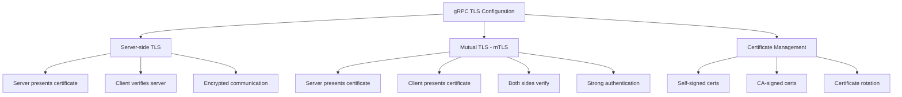
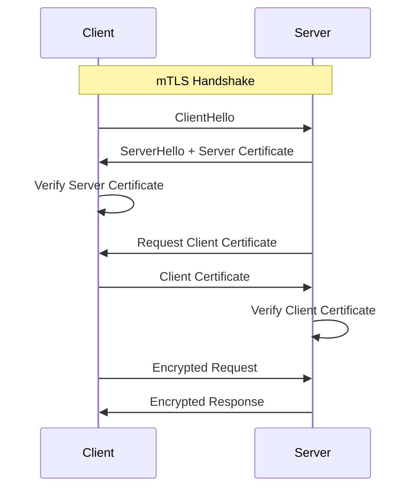
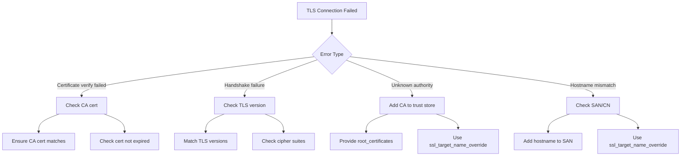

# How to Configure gRPC with TLS/SSL

Author: [nawazdhandala](https://www.github.com/nawazdhandala)

Tags: gRPC, TLS, SSL, Security, Certificates, mTLS, Encryption, Authentication

Description: A comprehensive guide to configuring gRPC with TLS/SSL encryption, including server-side TLS, mutual TLS (mTLS), certificate management, and troubleshooting common issues.

---

> Securing gRPC communications with TLS is essential for production deployments. This guide covers everything from basic server-side TLS to mutual TLS (mTLS) authentication, certificate generation, and troubleshooting common configuration issues.

gRPC uses HTTP/2 as its transport protocol, which means TLS configuration follows similar patterns to HTTPS but with some gRPC-specific considerations. Getting TLS right is critical for both security and reliability.

---

## TLS Configuration Overview



---

## Generating Certificates

### Using OpenSSL for Development

```bash
#!/bin/bash
# generate-certs.sh
# Script to generate TLS certificates for gRPC development

# Configuration
CERT_DIR="./certs"
DAYS_VALID=365
KEY_SIZE=4096

# Create certificate directory
mkdir -p ${CERT_DIR}

# Generate CA private key
openssl genrsa -out ${CERT_DIR}/ca.key ${KEY_SIZE}

# Generate CA certificate
openssl req -new -x509 \
    -key ${CERT_DIR}/ca.key \
    -sha256 \
    -subj "/C=US/ST=CA/O=MyOrg/CN=MyCA" \
    -days ${DAYS_VALID} \
    -out ${CERT_DIR}/ca.crt

# Generate server private key
openssl genrsa -out ${CERT_DIR}/server.key ${KEY_SIZE}

# Create server certificate signing request
cat > ${CERT_DIR}/server.cnf << EOF
[req]
distinguished_name = req_distinguished_name
req_extensions = v3_req
prompt = no

[req_distinguished_name]
C = US
ST = CA
O = MyOrg
CN = localhost

[v3_req]
keyUsage = keyEncipherment, dataEncipherment
extendedKeyUsage = serverAuth
subjectAltName = @alt_names

[alt_names]
DNS.1 = localhost
DNS.2 = *.example.com
DNS.3 = grpc-server
IP.1 = 127.0.0.1
IP.2 = 0.0.0.0
EOF

openssl req -new \
    -key ${CERT_DIR}/server.key \
    -config ${CERT_DIR}/server.cnf \
    -out ${CERT_DIR}/server.csr

# Sign server certificate with CA
openssl x509 -req \
    -in ${CERT_DIR}/server.csr \
    -CA ${CERT_DIR}/ca.crt \
    -CAkey ${CERT_DIR}/ca.key \
    -CAcreateserial \
    -out ${CERT_DIR}/server.crt \
    -days ${DAYS_VALID} \
    -sha256 \
    -extensions v3_req \
    -extfile ${CERT_DIR}/server.cnf

# Generate client private key (for mTLS)
openssl genrsa -out ${CERT_DIR}/client.key ${KEY_SIZE}

# Create client certificate signing request
cat > ${CERT_DIR}/client.cnf << EOF
[req]
distinguished_name = req_distinguished_name
req_extensions = v3_req
prompt = no

[req_distinguished_name]
C = US
ST = CA
O = MyOrg
CN = grpc-client

[v3_req]
keyUsage = keyEncipherment, dataEncipherment
extendedKeyUsage = clientAuth
EOF

openssl req -new \
    -key ${CERT_DIR}/client.key \
    -config ${CERT_DIR}/client.cnf \
    -out ${CERT_DIR}/client.csr

# Sign client certificate with CA
openssl x509 -req \
    -in ${CERT_DIR}/client.csr \
    -CA ${CERT_DIR}/ca.crt \
    -CAkey ${CERT_DIR}/ca.key \
    -CAcreateserial \
    -out ${CERT_DIR}/client.crt \
    -days ${DAYS_VALID} \
    -sha256 \
    -extensions v3_req \
    -extfile ${CERT_DIR}/client.cnf

# Set appropriate permissions
chmod 600 ${CERT_DIR}/*.key
chmod 644 ${CERT_DIR}/*.crt

echo "Certificates generated in ${CERT_DIR}/"
ls -la ${CERT_DIR}/
```

---

## Server-Side TLS Configuration

### Python Server with TLS

```python
import grpc
from concurrent import futures

def load_credentials():
    """
    Load server TLS credentials from certificate files.
    """
    # Read certificate files
    with open('certs/server.key', 'rb') as f:
        server_key = f.read()

    with open('certs/server.crt', 'rb') as f:
        server_cert = f.read()

    # Create server credentials
    # This enables server-side TLS (clients verify server)
    server_credentials = grpc.ssl_server_credentials(
        [(server_key, server_cert)]
    )

    return server_credentials


def create_secure_server():
    """
    Create a gRPC server with TLS enabled.
    """
    # Load credentials
    credentials = load_credentials()

    # Create server with thread pool
    server = grpc.server(
        futures.ThreadPoolExecutor(max_workers=50),
        options=[
            # Optional: Set minimum TLS version
            ('grpc.ssl_target_name_override', 'localhost'),
        ]
    )

    # Register your service
    service_pb2_grpc.add_MyServiceServicer_to_server(
        MyServiceServicer(),
        server
    )

    # Add secure port (note: add_secure_port, not add_insecure_port)
    server.add_secure_port('[::]:50051', credentials)

    return server


if __name__ == '__main__':
    server = create_secure_server()
    server.start()
    print('Secure gRPC server started on port 50051')
    server.wait_for_termination()
```

### Python Client with TLS

```python
import grpc

def create_secure_channel():
    """
    Create a secure gRPC channel with server certificate verification.
    """
    # Load CA certificate to verify server
    with open('certs/ca.crt', 'rb') as f:
        ca_cert = f.read()

    # Create channel credentials
    credentials = grpc.ssl_channel_credentials(
        root_certificates=ca_cert
    )

    # Create secure channel
    channel = grpc.secure_channel(
        'localhost:50051',
        credentials,
        options=[
            # Override the target name for certificate verification
            # Useful when server hostname differs from certificate CN
            ('grpc.ssl_target_name_override', 'localhost'),
        ]
    )

    return channel


def main():
    channel = create_secure_channel()
    stub = service_pb2_grpc.MyServiceStub(channel)

    # Make secure RPC call
    response = stub.DoSomething(request)
    print(f'Response: {response}')


if __name__ == '__main__':
    main()
```

---

## Mutual TLS (mTLS) Configuration



### Python Server with mTLS

```python
import grpc
from concurrent import futures

def load_mtls_server_credentials():
    """
    Load server credentials for mutual TLS.
    Server will require and verify client certificates.
    """
    # Read certificate files
    with open('certs/server.key', 'rb') as f:
        server_key = f.read()

    with open('certs/server.crt', 'rb') as f:
        server_cert = f.read()

    with open('certs/ca.crt', 'rb') as f:
        ca_cert = f.read()

    # Create server credentials with client certificate requirement
    server_credentials = grpc.ssl_server_credentials(
        [(server_key, server_cert)],
        root_certificates=ca_cert,  # CA to verify client certs
        require_client_auth=True     # Require client certificate
    )

    return server_credentials


def create_mtls_server():
    """
    Create a gRPC server requiring mutual TLS authentication.
    """
    credentials = load_mtls_server_credentials()

    server = grpc.server(futures.ThreadPoolExecutor(max_workers=50))

    # Register service
    service_pb2_grpc.add_MyServiceServicer_to_server(
        MyServiceServicer(),
        server
    )

    server.add_secure_port('[::]:50051', credentials)

    return server


class MyServiceServicer(service_pb2_grpc.MyServiceServicer):
    """
    Service implementation with client certificate access.
    """

    def DoSomething(self, request, context):
        # Access client certificate information from peer
        # This is available when mTLS is enabled
        peer_identities = context.peer_identities()
        peer_identity_key = context.peer_identity_key()

        if peer_identities:
            print(f'Client identity ({peer_identity_key}): {peer_identities}')

        # Process request
        return service_pb2.Response(message='Success')
```

### Python Client with mTLS

```python
import grpc

def create_mtls_channel():
    """
    Create a secure channel with mutual TLS authentication.
    Client will present its certificate to the server.
    """
    # Load certificates
    with open('certs/ca.crt', 'rb') as f:
        ca_cert = f.read()

    with open('certs/client.key', 'rb') as f:
        client_key = f.read()

    with open('certs/client.crt', 'rb') as f:
        client_cert = f.read()

    # Create channel credentials with client certificate
    credentials = grpc.ssl_channel_credentials(
        root_certificates=ca_cert,     # CA to verify server
        private_key=client_key,        # Client private key
        certificate_chain=client_cert  # Client certificate
    )

    channel = grpc.secure_channel(
        'localhost:50051',
        credentials,
        options=[
            ('grpc.ssl_target_name_override', 'localhost'),
        ]
    )

    return channel
```

---

## Go TLS Configuration

### Go Server with TLS

```go
package main

import (
    "crypto/tls"
    "crypto/x509"
    "io/ioutil"
    "log"
    "net"

    "google.golang.org/grpc"
    "google.golang.org/grpc/credentials"

    pb "myservice/proto"
)

func loadTLSCredentials() (credentials.TransportCredentials, error) {
    // Load server certificate and key
    serverCert, err := tls.LoadX509KeyPair("certs/server.crt", "certs/server.key")
    if err != nil {
        return nil, err
    }

    // Create TLS config with server certificate
    config := &tls.Config{
        Certificates: []tls.Certificate{serverCert},
        ClientAuth:   tls.NoClientCert, // Server-side TLS only
        MinVersion:   tls.VersionTLS12,
    }

    return credentials.NewTLS(config), nil
}

func loadMTLSCredentials() (credentials.TransportCredentials, error) {
    // Load CA certificate to verify clients
    caCert, err := ioutil.ReadFile("certs/ca.crt")
    if err != nil {
        return nil, err
    }

    caCertPool := x509.NewCertPool()
    if !caCertPool.AppendCertsFromPEM(caCert) {
        return nil, fmt.Errorf("failed to add CA certificate")
    }

    // Load server certificate and key
    serverCert, err := tls.LoadX509KeyPair("certs/server.crt", "certs/server.key")
    if err != nil {
        return nil, err
    }

    // Create TLS config requiring client certificates
    config := &tls.Config{
        Certificates: []tls.Certificate{serverCert},
        ClientAuth:   tls.RequireAndVerifyClientCert,
        ClientCAs:    caCertPool,
        MinVersion:   tls.VersionTLS12,
    }

    return credentials.NewTLS(config), nil
}

func main() {
    // Load credentials (choose TLS or mTLS)
    creds, err := loadMTLSCredentials()
    if err != nil {
        log.Fatalf("failed to load credentials: %v", err)
    }

    // Create gRPC server with TLS
    server := grpc.NewServer(grpc.Creds(creds))

    // Register service
    pb.RegisterMyServiceServer(server, &myServer{})

    // Start listening
    listener, err := net.Listen("tcp", ":50051")
    if err != nil {
        log.Fatalf("failed to listen: %v", err)
    }

    log.Println("Starting secure gRPC server on :50051")
    if err := server.Serve(listener); err != nil {
        log.Fatalf("failed to serve: %v", err)
    }
}
```

### Go Client with TLS

```go
package main

import (
    "context"
    "crypto/tls"
    "crypto/x509"
    "io/ioutil"
    "log"

    "google.golang.org/grpc"
    "google.golang.org/grpc/credentials"

    pb "myservice/proto"
)

func loadClientTLSCredentials() (credentials.TransportCredentials, error) {
    // Load CA certificate to verify server
    caCert, err := ioutil.ReadFile("certs/ca.crt")
    if err != nil {
        return nil, err
    }

    caCertPool := x509.NewCertPool()
    if !caCertPool.AppendCertsFromPEM(caCert) {
        return nil, fmt.Errorf("failed to add CA certificate")
    }

    // Create TLS config
    config := &tls.Config{
        RootCAs:    caCertPool,
        MinVersion: tls.VersionTLS12,
    }

    return credentials.NewTLS(config), nil
}

func loadClientMTLSCredentials() (credentials.TransportCredentials, error) {
    // Load CA certificate
    caCert, err := ioutil.ReadFile("certs/ca.crt")
    if err != nil {
        return nil, err
    }

    caCertPool := x509.NewCertPool()
    if !caCertPool.AppendCertsFromPEM(caCert) {
        return nil, fmt.Errorf("failed to add CA certificate")
    }

    // Load client certificate and key
    clientCert, err := tls.LoadX509KeyPair("certs/client.crt", "certs/client.key")
    if err != nil {
        return nil, err
    }

    // Create TLS config with client certificate
    config := &tls.Config{
        Certificates: []tls.Certificate{clientCert},
        RootCAs:      caCertPool,
        MinVersion:   tls.VersionTLS12,
    }

    return credentials.NewTLS(config), nil
}

func main() {
    // Load credentials
    creds, err := loadClientMTLSCredentials()
    if err != nil {
        log.Fatalf("failed to load credentials: %v", err)
    }

    // Create secure connection
    conn, err := grpc.Dial(
        "localhost:50051",
        grpc.WithTransportCredentials(creds),
    )
    if err != nil {
        log.Fatalf("failed to connect: %v", err)
    }
    defer conn.Close()

    // Create client
    client := pb.NewMyServiceClient(conn)

    // Make request
    resp, err := client.DoSomething(context.Background(), &pb.Request{})
    if err != nil {
        log.Fatalf("request failed: %v", err)
    }

    log.Printf("Response: %v", resp)
}
```

---

## Certificate Rotation

### Dynamic Certificate Reloading in Go

```go
package main

import (
    "crypto/tls"
    "sync"
    "time"
)

// CertificateManager handles dynamic certificate reloading
type CertificateManager struct {
    certPath string
    keyPath  string
    cert     *tls.Certificate
    mu       sync.RWMutex
}

func NewCertificateManager(certPath, keyPath string) (*CertificateManager, error) {
    cm := &CertificateManager{
        certPath: certPath,
        keyPath:  keyPath,
    }

    // Load initial certificate
    if err := cm.reload(); err != nil {
        return nil, err
    }

    // Start background reloader
    go cm.watchAndReload()

    return cm, nil
}

func (cm *CertificateManager) reload() error {
    cert, err := tls.LoadX509KeyPair(cm.certPath, cm.keyPath)
    if err != nil {
        return err
    }

    cm.mu.Lock()
    cm.cert = &cert
    cm.mu.Unlock()

    return nil
}

func (cm *CertificateManager) watchAndReload() {
    ticker := time.NewTicker(1 * time.Hour)
    defer ticker.Stop()

    for range ticker.C {
        if err := cm.reload(); err != nil {
            log.Printf("failed to reload certificate: %v", err)
        } else {
            log.Println("certificate reloaded successfully")
        }
    }
}

func (cm *CertificateManager) GetCertificate(*tls.ClientHelloInfo) (*tls.Certificate, error) {
    cm.mu.RLock()
    defer cm.mu.RUnlock()
    return cm.cert, nil
}

func createServerWithDynamicCerts() (*grpc.Server, error) {
    certManager, err := NewCertificateManager("certs/server.crt", "certs/server.key")
    if err != nil {
        return nil, err
    }

    tlsConfig := &tls.Config{
        GetCertificate: certManager.GetCertificate,
        MinVersion:     tls.VersionTLS12,
    }

    creds := credentials.NewTLS(tlsConfig)
    server := grpc.NewServer(grpc.Creds(creds))

    return server, nil
}
```

---

## Troubleshooting Common TLS Issues



### Common Error: Certificate Verification Failed

```python
import grpc
import ssl

def diagnose_tls_issues(target):
    """
    Diagnose common TLS connection issues.
    """
    import socket

    # Extract host and port
    host, port = target.split(':')
    port = int(port)

    # Test basic TCP connection
    try:
        sock = socket.create_connection((host, port), timeout=5)
        sock.close()
        print(f'TCP connection to {target}: OK')
    except Exception as e:
        print(f'TCP connection failed: {e}')
        return

    # Test TLS handshake
    context = ssl.create_default_context()
    context.check_hostname = False
    context.verify_mode = ssl.CERT_NONE

    try:
        with socket.create_connection((host, port)) as sock:
            with context.wrap_socket(sock, server_hostname=host) as ssock:
                cert = ssock.getpeercert(binary_form=True)
                print(f'TLS handshake: OK')
                print(f'Protocol: {ssock.version()}')
                print(f'Cipher: {ssock.cipher()}')

                # Decode and display certificate info
                from cryptography import x509
                cert_obj = x509.load_der_x509_certificate(cert)
                print(f'Subject: {cert_obj.subject}')
                print(f'Issuer: {cert_obj.issuer}')
                print(f'Valid from: {cert_obj.not_valid_before}')
                print(f'Valid until: {cert_obj.not_valid_after}')

                # Check SANs
                try:
                    san = cert_obj.extensions.get_extension_for_class(
                        x509.SubjectAlternativeName
                    )
                    print(f'SANs: {san.value.get_values_for_type(x509.DNSName)}')
                except x509.ExtensionNotFound:
                    print('No SAN extension found')

    except ssl.SSLError as e:
        print(f'TLS handshake failed: {e}')
    except Exception as e:
        print(f'Error: {e}')


# Check certificate validity
def verify_certificate_chain(ca_cert_path, server_cert_path):
    """
    Verify that a server certificate is signed by the CA.
    """
    from cryptography import x509
    from cryptography.hazmat.primitives import hashes
    from cryptography.hazmat.backends import default_backend

    with open(ca_cert_path, 'rb') as f:
        ca_cert = x509.load_pem_x509_certificate(f.read(), default_backend())

    with open(server_cert_path, 'rb') as f:
        server_cert = x509.load_pem_x509_certificate(f.read(), default_backend())

    # Check if CA signed the server certificate
    try:
        ca_cert.public_key().verify(
            server_cert.signature,
            server_cert.tbs_certificate_bytes,
            padding.PKCS1v15(),
            server_cert.signature_hash_algorithm,
        )
        print('Certificate chain: VALID')
        return True
    except Exception as e:
        print(f'Certificate chain: INVALID - {e}')
        return False
```

### Fixing Hostname Mismatch

```python
import grpc

# Problem: Server hostname does not match certificate CN/SAN
# Error: "Hostname mismatch, expected: example.com"

# Solution 1: Use ssl_target_name_override
channel = grpc.secure_channel(
    'internal-server-ip:50051',
    credentials,
    options=[
        # Override the expected hostname in certificate verification
        ('grpc.ssl_target_name_override', 'grpc-server.example.com'),
    ]
)

# Solution 2: Generate certificate with correct SANs
# Include all hostnames and IPs in the certificate SAN extension
# See the certificate generation script above
```

---

## Best Practices

1. **Always use TLS in production** - Never use insecure channels in production environments

2. **Use mTLS for service-to-service communication** - Provides strong authentication for both parties

3. **Keep private keys secure** - Use proper file permissions and secret management

4. **Monitor certificate expiration** - Set up alerts before certificates expire

5. **Use strong TLS versions** - Require TLS 1.2 or higher

6. **Include proper SANs** - Add all hostnames and IPs to Subject Alternative Names

7. **Implement certificate rotation** - Use dynamic certificate loading for zero-downtime rotation

---

## Conclusion

Properly configuring TLS for gRPC requires attention to certificate generation, credential loading, and error handling. Mutual TLS provides the strongest authentication for microservices architectures, ensuring both client and server verify each other's identity.

The key is to test your TLS configuration thoroughly in development before deploying to production, and to implement monitoring for certificate expiration.

---

*Need to monitor your gRPC services and track TLS certificate expiration? [OneUptime](https://oneuptime.com) provides certificate monitoring and alerting to help you avoid TLS-related outages.*

**Related Reading:**
- [How to Handle Error Codes in gRPC](https://oneuptime.com/blog)
- [How to Handle Metadata in gRPC Calls](https://oneuptime.com/blog)
