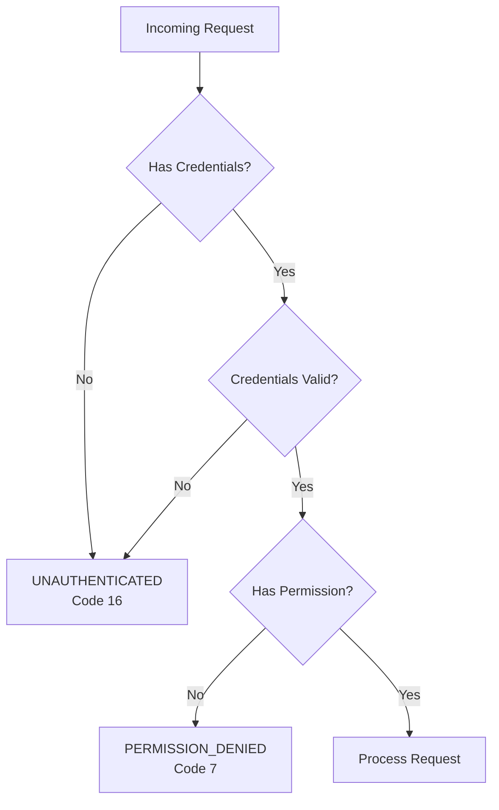
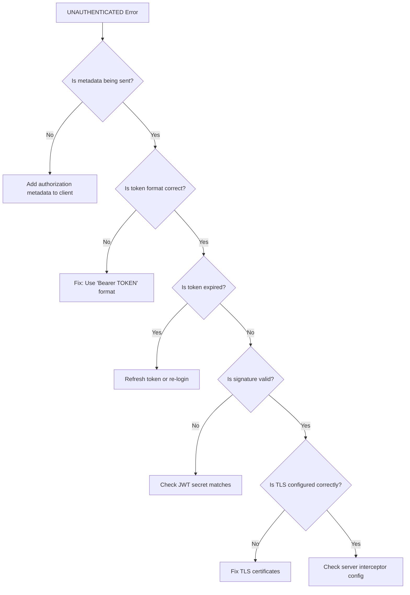

# How to Fix 'Unauthenticated' Errors in gRPC

Author: [nawazdhandala](https://www.github.com/nawazdhandala)

Tags: gRPC, Authentication, Security, JWT, TLS, Error Handling

Description: A practical guide to diagnosing and fixing UNAUTHENTICATED errors in gRPC services, covering credential configuration, interceptor setup, token validation, and common authentication pitfalls.

---

The UNAUTHENTICATED status code (code 16) in gRPC indicates that the request lacks valid authentication credentials. This error can be frustrating to debug because it can originate from various sources including missing tokens, expired credentials, misconfigured interceptors, or TLS issues. This guide provides a systematic approach to identifying and fixing UNAUTHENTICATED errors.

## Understanding UNAUTHENTICATED vs PERMISSION_DENIED

Before diving into solutions, it is important to understand the difference between these two related status codes:



- **UNAUTHENTICATED (16)**: The request does not have valid authentication credentials
- **PERMISSION_DENIED (7)**: The caller is authenticated but lacks permission to perform the operation

## Common Causes of UNAUTHENTICATED Errors

1. **Missing authentication metadata** - Client not sending credentials
2. **Expired tokens** - JWT or OAuth tokens past their expiration time
3. **Invalid token signature** - Token tampered with or signed with wrong key
4. **TLS configuration issues** - Certificate problems preventing secure authentication
5. **Interceptor misconfiguration** - Auth interceptor not properly set up
6. **Clock skew** - Time difference between client and server affecting token validation

## Setting Up Token-Based Authentication

### Server-Side Authentication Interceptor

Create an interceptor that validates JWT tokens on incoming requests:

```go
// server/auth/interceptor.go
package auth

import (
    "context"
    "strings"
    "time"

    "github.com/golang-jwt/jwt/v5"
    "google.golang.org/grpc"
    "google.golang.org/grpc/codes"
    "google.golang.org/grpc/metadata"
    "google.golang.org/grpc/status"
)

// Claims represents the JWT claims structure
type Claims struct {
    UserID string   `json:"user_id"`
    Email  string   `json:"email"`
    Roles  []string `json:"roles"`
    jwt.RegisteredClaims
}

// AuthInterceptor handles authentication for gRPC calls
type AuthInterceptor struct {
    jwtSecret     []byte
    publicMethods map[string]bool
}

// NewAuthInterceptor creates a new authentication interceptor
func NewAuthInterceptor(jwtSecret string, publicMethods []string) *AuthInterceptor {
    methods := make(map[string]bool)
    for _, m := range publicMethods {
        methods[m] = true
    }

    return &AuthInterceptor{
        jwtSecret:     []byte(jwtSecret),
        publicMethods: methods,
    }
}

// Unary returns a unary server interceptor for authentication
func (i *AuthInterceptor) Unary() grpc.UnaryServerInterceptor {
    return func(
        ctx context.Context,
        req interface{},
        info *grpc.UnaryServerInfo,
        handler grpc.UnaryHandler,
    ) (interface{}, error) {
        // Skip auth for public methods
        if i.publicMethods[info.FullMethod] {
            return handler(ctx, req)
        }

        // Authenticate the request
        newCtx, err := i.authenticate(ctx)
        if err != nil {
            return nil, err
        }

        return handler(newCtx, req)
    }
}

// Stream returns a stream server interceptor for authentication
func (i *AuthInterceptor) Stream() grpc.StreamServerInterceptor {
    return func(
        srv interface{},
        ss grpc.ServerStream,
        info *grpc.StreamServerInfo,
        handler grpc.StreamHandler,
    ) error {
        // Skip auth for public methods
        if i.publicMethods[info.FullMethod] {
            return handler(srv, ss)
        }

        // Authenticate the request
        _, err := i.authenticate(ss.Context())
        if err != nil {
            return err
        }

        return handler(srv, ss)
    }
}

// authenticate validates the authentication credentials
func (i *AuthInterceptor) authenticate(ctx context.Context) (context.Context, error) {
    // Extract metadata from context
    md, ok := metadata.FromIncomingContext(ctx)
    if !ok {
        return nil, status.Error(codes.Unauthenticated, "metadata is not provided")
    }

    // Get authorization header
    values := md.Get("authorization")
    if len(values) == 0 {
        return nil, status.Error(codes.Unauthenticated, "authorization token is not provided")
    }

    // Parse Bearer token
    authHeader := values[0]
    if !strings.HasPrefix(authHeader, "Bearer ") {
        return nil, status.Error(codes.Unauthenticated, "invalid authorization format, expected Bearer token")
    }

    tokenString := strings.TrimPrefix(authHeader, "Bearer ")

    // Parse and validate the JWT token
    claims, err := i.validateToken(tokenString)
    if err != nil {
        return nil, err
    }

    // Add claims to context for use in handlers
    newCtx := context.WithValue(ctx, "claims", claims)
    return newCtx, nil
}

// validateToken parses and validates a JWT token
func (i *AuthInterceptor) validateToken(tokenString string) (*Claims, error) {
    claims := &Claims{}

    token, err := jwt.ParseWithClaims(tokenString, claims, func(token *jwt.Token) (interface{}, error) {
        // Validate the signing method
        if _, ok := token.Method.(*jwt.SigningMethodHMAC); !ok {
            return nil, status.Errorf(codes.Unauthenticated, "unexpected signing method: %v", token.Header["alg"])
        }
        return i.jwtSecret, nil
    })

    if err != nil {
        // Provide specific error messages for common issues
        if strings.Contains(err.Error(), "token is expired") {
            return nil, status.Error(codes.Unauthenticated, "token has expired, please login again")
        }
        if strings.Contains(err.Error(), "signature is invalid") {
            return nil, status.Error(codes.Unauthenticated, "invalid token signature")
        }
        return nil, status.Errorf(codes.Unauthenticated, "invalid token: %v", err)
    }

    if !token.Valid {
        return nil, status.Error(codes.Unauthenticated, "invalid token")
    }

    return claims, nil
}
```

### Server Setup with Auth Interceptor

Configure the gRPC server to use the authentication interceptor:

```go
// server/main.go
package main

import (
    "log"
    "net"
    "os"

    "google.golang.org/grpc"

    "myapp/auth"
    pb "myapp/proto/user"
)

func main() {
    // Get JWT secret from environment
    jwtSecret := os.Getenv("JWT_SECRET")
    if jwtSecret == "" {
        log.Fatal("JWT_SECRET environment variable is required")
    }

    // Define methods that do not require authentication
    publicMethods := []string{
        "/myapp.AuthService/Login",
        "/myapp.AuthService/Register",
        "/grpc.health.v1.Health/Check",
    }

    // Create auth interceptor
    authInterceptor := auth.NewAuthInterceptor(jwtSecret, publicMethods)

    // Create gRPC server with interceptors
    server := grpc.NewServer(
        grpc.UnaryInterceptor(authInterceptor.Unary()),
        grpc.StreamInterceptor(authInterceptor.Stream()),
    )

    // Register services
    pb.RegisterUserServiceServer(server, NewUserService())

    lis, err := net.Listen("tcp", ":50051")
    if err != nil {
        log.Fatalf("failed to listen: %v", err)
    }

    log.Printf("gRPC server listening on :50051")
    if err := server.Serve(lis); err != nil {
        log.Fatalf("failed to serve: %v", err)
    }
}
```

## Client-Side Credential Configuration

### Adding Authentication Metadata

Create a client that automatically attaches authentication tokens to requests:

```go
// client/auth_client.go
package client

import (
    "context"

    "google.golang.org/grpc"
    "google.golang.org/grpc/credentials"
    "google.golang.org/grpc/metadata"
)

// TokenAuth implements credentials.PerRPCCredentials
type TokenAuth struct {
    Token    string
    Insecure bool
}

// GetRequestMetadata returns the authorization metadata
func (t *TokenAuth) GetRequestMetadata(ctx context.Context, uri ...string) (map[string]string, error) {
    return map[string]string{
        "authorization": "Bearer " + t.Token,
    }, nil
}

// RequireTransportSecurity indicates whether TLS is required
func (t *TokenAuth) RequireTransportSecurity() bool {
    return !t.Insecure
}

// NewAuthenticatedConnection creates a gRPC connection with authentication
func NewAuthenticatedConnection(address string, token string, insecure bool) (*grpc.ClientConn, error) {
    tokenAuth := &TokenAuth{
        Token:    token,
        Insecure: insecure,
    }

    var opts []grpc.DialOption

    if insecure {
        opts = append(opts, grpc.WithInsecure())
    } else {
        // Load TLS credentials
        creds, err := credentials.NewClientTLSFromFile("ca-cert.pem", "")
        if err != nil {
            return nil, err
        }
        opts = append(opts, grpc.WithTransportCredentials(creds))
    }

    // Add per-RPC credentials
    opts = append(opts, grpc.WithPerRPCCredentials(tokenAuth))

    return grpc.Dial(address, opts...)
}
```

### Alternative: Using Interceptors for Token Attachment

For more control over token management, use a client interceptor:

```go
// client/interceptor.go
package client

import (
    "context"
    "sync"

    "google.golang.org/grpc"
    "google.golang.org/grpc/metadata"
)

// TokenManager handles token storage and refresh
type TokenManager struct {
    mu           sync.RWMutex
    accessToken  string
    refreshToken string
    refreshFunc  func(refreshToken string) (string, string, error)
}

// NewTokenManager creates a new token manager
func NewTokenManager(refreshFunc func(string) (string, string, error)) *TokenManager {
    return &TokenManager{
        refreshFunc: refreshFunc,
    }
}

// SetTokens stores the current tokens
func (tm *TokenManager) SetTokens(access, refresh string) {
    tm.mu.Lock()
    defer tm.mu.Unlock()
    tm.accessToken = access
    tm.refreshToken = refresh
}

// GetAccessToken returns the current access token
func (tm *TokenManager) GetAccessToken() string {
    tm.mu.RLock()
    defer tm.mu.RUnlock()
    return tm.accessToken
}

// AuthInterceptor creates a unary client interceptor that adds auth tokens
func (tm *TokenManager) AuthInterceptor() grpc.UnaryClientInterceptor {
    return func(
        ctx context.Context,
        method string,
        req, reply interface{},
        cc *grpc.ClientConn,
        invoker grpc.UnaryInvoker,
        opts ...grpc.CallOption,
    ) error {
        // Skip auth for login/register methods
        if isPublicMethod(method) {
            return invoker(ctx, method, req, reply, cc, opts...)
        }

        // Add token to context
        token := tm.GetAccessToken()
        if token != "" {
            ctx = metadata.AppendToOutgoingContext(ctx, "authorization", "Bearer "+token)
        }

        return invoker(ctx, method, req, reply, cc, opts...)
    }
}

func isPublicMethod(method string) bool {
    publicMethods := map[string]bool{
        "/myapp.AuthService/Login":    true,
        "/myapp.AuthService/Register": true,
    }
    return publicMethods[method]
}
```

## Debugging UNAUTHENTICATED Errors



### Step 1: Verify Metadata Is Being Sent

Use grpcurl to test with explicit metadata:

```bash
# Test without token - should get UNAUTHENTICATED
grpcurl -plaintext localhost:50051 myapp.UserService/GetUser

# Test with token
grpcurl -plaintext \
    -H "authorization: Bearer YOUR_TOKEN_HERE" \
    -d '{"user_id": "123"}' \
    localhost:50051 myapp.UserService/GetUser
```

### Step 2: Add Debug Logging to Server

Add logging to understand why authentication is failing:

```go
// server/auth/debug_interceptor.go
package auth

import (
    "context"
    "log"

    "google.golang.org/grpc"
    "google.golang.org/grpc/metadata"
)

// DebugAuthInterceptor adds logging for authentication debugging
func DebugAuthInterceptor(
    ctx context.Context,
    req interface{},
    info *grpc.UnaryServerInfo,
    handler grpc.UnaryHandler,
) (interface{}, error) {
    // Log the method being called
    log.Printf("Method: %s", info.FullMethod)

    // Log incoming metadata
    md, ok := metadata.FromIncomingContext(ctx)
    if !ok {
        log.Println("No metadata in request")
    } else {
        for key, values := range md {
            // Don't log the full token, just confirm it exists
            if key == "authorization" {
                if len(values) > 0 && len(values[0]) > 20 {
                    log.Printf("Metadata %s: %s...%s", key, values[0][:10], values[0][len(values[0])-10:])
                } else {
                    log.Printf("Metadata %s: [present but short]", key)
                }
            } else {
                log.Printf("Metadata %s: %v", key, values)
            }
        }
    }

    return handler(ctx, req)
}
```

### Step 3: Validate Token Independently

Create a utility to validate tokens outside of gRPC:

```go
// tools/validate_token.go
package main

import (
    "fmt"
    "os"
    "time"

    "github.com/golang-jwt/jwt/v5"
)

type Claims struct {
    UserID string   `json:"user_id"`
    Email  string   `json:"email"`
    Roles  []string `json:"roles"`
    jwt.RegisteredClaims
}

func main() {
    if len(os.Args) < 2 {
        fmt.Println("Usage: validate_token <token>")
        os.Exit(1)
    }

    tokenString := os.Args[1]
    secret := os.Getenv("JWT_SECRET")

    claims := &Claims{}
    token, err := jwt.ParseWithClaims(tokenString, claims, func(token *jwt.Token) (interface{}, error) {
        return []byte(secret), nil
    })

    if err != nil {
        fmt.Printf("Token validation failed: %v\n", err)
        os.Exit(1)
    }

    if !token.Valid {
        fmt.Println("Token is invalid")
        os.Exit(1)
    }

    fmt.Println("Token is valid!")
    fmt.Printf("User ID: %s\n", claims.UserID)
    fmt.Printf("Email: %s\n", claims.Email)
    fmt.Printf("Roles: %v\n", claims.Roles)
    fmt.Printf("Expires: %v\n", claims.ExpiresAt)

    if claims.ExpiresAt != nil {
        remaining := time.Until(claims.ExpiresAt.Time)
        if remaining < 0 {
            fmt.Printf("Token EXPIRED %v ago\n", -remaining)
        } else {
            fmt.Printf("Token expires in: %v\n", remaining)
        }
    }
}
```

## Handling Token Expiration

Implement automatic token refresh on the client side:

```go
// client/refresh_interceptor.go
package client

import (
    "context"
    "sync"

    "google.golang.org/grpc"
    "google.golang.org/grpc/codes"
    "google.golang.org/grpc/metadata"
    "google.golang.org/grpc/status"
)

// RefreshableAuthInterceptor handles automatic token refresh
type RefreshableAuthInterceptor struct {
    tokenManager *TokenManager
    refreshMu    sync.Mutex
}

// NewRefreshableAuthInterceptor creates a new interceptor with refresh capability
func NewRefreshableAuthInterceptor(tm *TokenManager) *RefreshableAuthInterceptor {
    return &RefreshableAuthInterceptor{
        tokenManager: tm,
    }
}

// Unary returns a unary client interceptor with token refresh
func (i *RefreshableAuthInterceptor) Unary() grpc.UnaryClientInterceptor {
    return func(
        ctx context.Context,
        method string,
        req, reply interface{},
        cc *grpc.ClientConn,
        invoker grpc.UnaryInvoker,
        opts ...grpc.CallOption,
    ) error {
        // Skip auth for public methods
        if isPublicMethod(method) {
            return invoker(ctx, method, req, reply, cc, opts...)
        }

        // First attempt with current token
        token := i.tokenManager.GetAccessToken()
        authCtx := metadata.AppendToOutgoingContext(ctx, "authorization", "Bearer "+token)

        err := invoker(authCtx, method, req, reply, cc, opts...)
        if err == nil {
            return nil
        }

        // Check if error is UNAUTHENTICATED
        st, ok := status.FromError(err)
        if !ok || st.Code() != codes.Unauthenticated {
            return err
        }

        // Try to refresh the token
        i.refreshMu.Lock()
        refreshErr := i.tryRefreshToken()
        i.refreshMu.Unlock()

        if refreshErr != nil {
            // Return original error if refresh fails
            return err
        }

        // Retry with new token
        newToken := i.tokenManager.GetAccessToken()
        authCtx = metadata.AppendToOutgoingContext(ctx, "authorization", "Bearer "+newToken)

        return invoker(authCtx, method, req, reply, cc, opts...)
    }
}

func (i *RefreshableAuthInterceptor) tryRefreshToken() error {
    // Call the refresh function from token manager
    if i.tokenManager.refreshFunc == nil {
        return status.Error(codes.Unauthenticated, "no refresh function configured")
    }

    newAccess, newRefresh, err := i.tokenManager.refreshFunc(i.tokenManager.refreshToken)
    if err != nil {
        return err
    }

    i.tokenManager.SetTokens(newAccess, newRefresh)
    return nil
}
```

## TLS-Related Authentication Issues

When using TLS, UNAUTHENTICATED errors can occur due to certificate problems:

```go
// server/tls_server.go
package main

import (
    "crypto/tls"
    "crypto/x509"
    "io/ioutil"
    "log"
    "net"

    "google.golang.org/grpc"
    "google.golang.org/grpc/credentials"
)

func createTLSServer() *grpc.Server {
    // Load server certificate and key
    serverCert, err := tls.LoadX509KeyPair("server-cert.pem", "server-key.pem")
    if err != nil {
        log.Fatalf("failed to load server certificates: %v", err)
    }

    // Load CA certificate for client verification (mTLS)
    caCert, err := ioutil.ReadFile("ca-cert.pem")
    if err != nil {
        log.Fatalf("failed to read CA certificate: %v", err)
    }

    certPool := x509.NewCertPool()
    if !certPool.AppendCertsFromPEM(caCert) {
        log.Fatal("failed to add CA certificate")
    }

    // Configure TLS
    tlsConfig := &tls.Config{
        Certificates: []tls.Certificate{serverCert},
        ClientAuth:   tls.RequireAndVerifyClientCert,
        ClientCAs:    certPool,
        MinVersion:   tls.VersionTLS12,
    }

    creds := credentials.NewTLS(tlsConfig)

    return grpc.NewServer(grpc.Creds(creds))
}
```

## Best Practices for Avoiding UNAUTHENTICATED Errors

1. **Use short-lived tokens** - Implement refresh token flow for long-running applications

2. **Provide clear error messages** - Include details about why authentication failed

3. **Handle clock skew** - Add a small leeway when validating token expiration

4. **Log authentication attempts** - Track failed authentications for security monitoring

5. **Test with grpcurl** - Verify authentication works before implementing client code

6. **Use TLS in production** - Never send tokens over unencrypted connections

7. **Implement health check bypass** - Allow health checks without authentication

## Conclusion

UNAUTHENTICATED errors in gRPC typically result from missing or invalid credentials, misconfigured interceptors, or TLS issues. By implementing proper authentication interceptors on both client and server, adding debug logging, and following the systematic debugging approach in this guide, you can quickly identify and resolve authentication issues. Remember to always use TLS in production and implement token refresh mechanisms for a seamless user experience.
