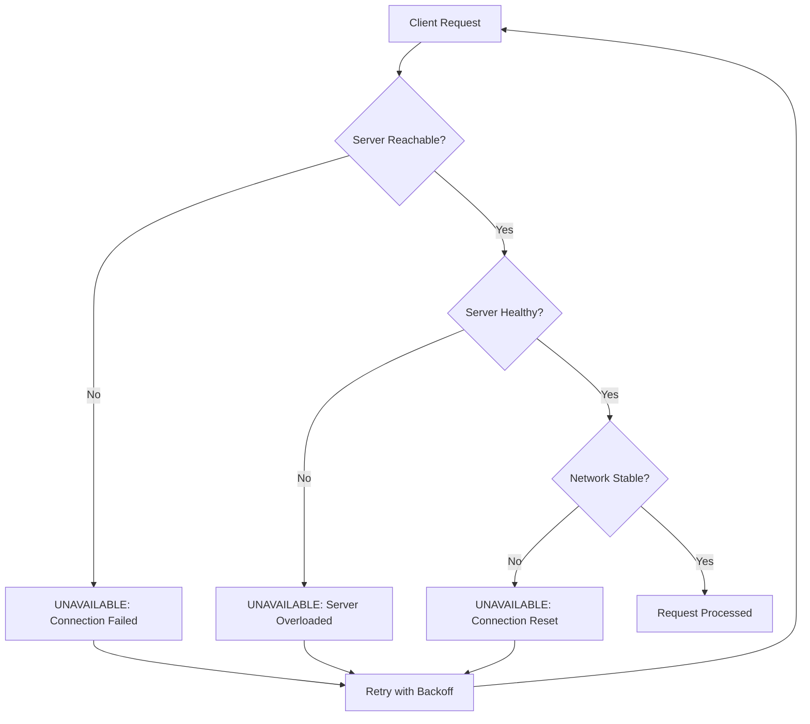
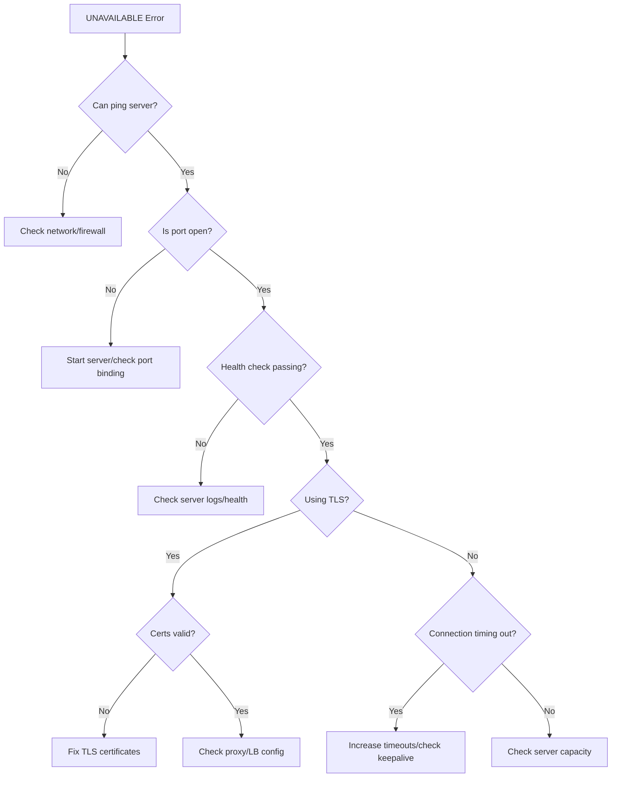

# How to Fix "Unavailable" Status Errors in gRPC

Author: [nawazdhandala](https://github.com/nawazdhandala)

Tags: gRPC, Troubleshooting, Distributed Systems, Microservices, DevOps

Description: Learn how to diagnose and fix gRPC UNAVAILABLE status errors caused by connection issues, server overload, and network problems.

---

The gRPC UNAVAILABLE status code (code 14) indicates that the service is currently unavailable. This is typically a transient condition that can be resolved with proper retry logic, connection management, and infrastructure configuration. This guide covers the common causes and solutions for UNAVAILABLE errors.

## Understanding UNAVAILABLE Status

The UNAVAILABLE status is one of the most common gRPC errors you will encounter in production systems. It signals that the operation could not be completed because the service is temporarily unavailable.



## Common Causes and Solutions

### 1. Server Not Running or Unreachable

The most basic cause is that the server process is not running or the client cannot reach it.

```go
// server.go - Basic gRPC server with health checks
package main

import (
    "context"
    "log"
    "net"
    "os"
    "os/signal"
    "syscall"

    "google.golang.org/grpc"
    "google.golang.org/grpc/health"
    "google.golang.org/grpc/health/grpc_health_v1"
    pb "myservice/proto"
)

type server struct {
    pb.UnimplementedMyServiceServer
}

func main() {
    // Listen on the specified port
    lis, err := net.Listen("tcp", ":50051")
    if err != nil {
        log.Fatalf("Failed to listen: %v", err)
    }

    // Create gRPC server with options
    s := grpc.NewServer()

    // Register your service
    pb.RegisterMyServiceServer(s, &server{})

    // Register health service for load balancer health checks
    healthServer := health.NewServer()
    grpc_health_v1.RegisterHealthServer(s, healthServer)

    // Set service as healthy
    healthServer.SetServingStatus("myservice", grpc_health_v1.HealthCheckResponse_SERVING)

    // Graceful shutdown handling
    go func() {
        sigChan := make(chan os.Signal, 1)
        signal.Notify(sigChan, syscall.SIGINT, syscall.SIGTERM)
        <-sigChan

        log.Println("Shutting down gracefully...")
        // Mark service as not serving before shutdown
        healthServer.SetServingStatus("myservice", grpc_health_v1.HealthCheckResponse_NOT_SERVING)
        s.GracefulStop()
    }()

    log.Printf("Server listening on :50051")
    if err := s.Serve(lis); err != nil {
        log.Fatalf("Failed to serve: %v", err)
    }
}
```

### 2. Connection Configuration Issues

Improper client connection settings often cause UNAVAILABLE errors.

```go
// client.go - Properly configured gRPC client
package main

import (
    "context"
    "log"
    "time"

    "google.golang.org/grpc"
    "google.golang.org/grpc/credentials/insecure"
    "google.golang.org/grpc/keepalive"
    pb "myservice/proto"
)

func createClient() (pb.MyServiceClient, *grpc.ClientConn, error) {
    // Configure keepalive parameters to detect dead connections
    keepaliveParams := keepalive.ClientParameters{
        // Send keepalive ping every 30 seconds if no activity
        Time: 30 * time.Second,
        // Wait 10 seconds for ping ack before considering connection dead
        Timeout: 10 * time.Second,
        // Send pings even without active streams
        PermitWithoutStream: true,
    }

    // Connection options
    opts := []grpc.DialOption{
        grpc.WithTransportCredentials(insecure.NewCredentials()),
        grpc.WithKeepaliveParams(keepaliveParams),
        // Block until connection is ready (with timeout)
        grpc.WithBlock(),
        // Set initial connection window size
        grpc.WithInitialWindowSize(1 << 20), // 1 MB
        grpc.WithInitialConnWindowSize(1 << 20),
    }

    // Create connection with timeout
    ctx, cancel := context.WithTimeout(context.Background(), 10*time.Second)
    defer cancel()

    conn, err := grpc.DialContext(ctx, "localhost:50051", opts...)
    if err != nil {
        return nil, nil, err
    }

    return pb.NewMyServiceClient(conn), conn, nil
}

func main() {
    client, conn, err := createClient()
    if err != nil {
        log.Fatalf("Failed to connect: %v", err)
    }
    defer conn.Close()

    // Use the client
    ctx, cancel := context.WithTimeout(context.Background(), 5*time.Second)
    defer cancel()

    resp, err := client.DoSomething(ctx, &pb.Request{})
    if err != nil {
        log.Printf("RPC failed: %v", err)
        return
    }
    log.Printf("Response: %v", resp)
}
```

### 3. Implementing Retry Logic

UNAVAILABLE errors are often transient and should be retried with exponential backoff.

```go
// retry.go - Retry interceptor for gRPC clients
package main

import (
    "context"
    "log"
    "math"
    "math/rand"
    "time"

    "google.golang.org/grpc"
    "google.golang.org/grpc/codes"
    "google.golang.org/grpc/status"
)

// RetryConfig holds retry configuration
type RetryConfig struct {
    MaxAttempts     int
    InitialBackoff  time.Duration
    MaxBackoff      time.Duration
    BackoffMultiplier float64
    RetryableCodes  []codes.Code
}

// DefaultRetryConfig returns sensible defaults for retry
func DefaultRetryConfig() RetryConfig {
    return RetryConfig{
        MaxAttempts:     5,
        InitialBackoff:  100 * time.Millisecond,
        MaxBackoff:      10 * time.Second,
        BackoffMultiplier: 2.0,
        RetryableCodes: []codes.Code{
            codes.Unavailable,
            codes.ResourceExhausted,
            codes.Aborted,
        },
    }
}

// isRetryable checks if the error code should be retried
func (c *RetryConfig) isRetryable(code codes.Code) bool {
    for _, retryable := range c.RetryableCodes {
        if code == retryable {
            return true
        }
    }
    return false
}

// calculateBackoff computes backoff duration with jitter
func (c *RetryConfig) calculateBackoff(attempt int) time.Duration {
    backoff := float64(c.InitialBackoff) * math.Pow(c.BackoffMultiplier, float64(attempt))
    if backoff > float64(c.MaxBackoff) {
        backoff = float64(c.MaxBackoff)
    }
    // Add jitter: random value between 0.5 and 1.0 of calculated backoff
    jitter := 0.5 + rand.Float64()*0.5
    return time.Duration(backoff * jitter)
}

// UnaryRetryInterceptor creates a retry interceptor for unary RPCs
func UnaryRetryInterceptor(config RetryConfig) grpc.UnaryClientInterceptor {
    return func(
        ctx context.Context,
        method string,
        req, reply interface{},
        cc *grpc.ClientConn,
        invoker grpc.UnaryInvoker,
        opts ...grpc.CallOption,
    ) error {
        var lastErr error

        for attempt := 0; attempt < config.MaxAttempts; attempt++ {
            // Check if context is already cancelled
            if ctx.Err() != nil {
                return ctx.Err()
            }

            // Make the RPC call
            err := invoker(ctx, method, req, reply, cc, opts...)
            if err == nil {
                return nil
            }

            lastErr = err
            st, ok := status.FromError(err)
            if !ok {
                // Not a gRPC error, do not retry
                return err
            }

            // Check if error is retryable
            if !config.isRetryable(st.Code()) {
                return err
            }

            // Do not retry on last attempt
            if attempt == config.MaxAttempts-1 {
                break
            }

            // Calculate backoff and wait
            backoff := config.calculateBackoff(attempt)
            log.Printf("Attempt %d failed with %v, retrying in %v", attempt+1, st.Code(), backoff)

            select {
            case <-time.After(backoff):
                // Continue to next attempt
            case <-ctx.Done():
                return ctx.Err()
            }
        }

        return lastErr
    }
}

// Usage example
func createClientWithRetry() (*grpc.ClientConn, error) {
    retryConfig := DefaultRetryConfig()

    conn, err := grpc.Dial(
        "localhost:50051",
        grpc.WithTransportCredentials(insecure.NewCredentials()),
        grpc.WithUnaryInterceptor(UnaryRetryInterceptor(retryConfig)),
    )

    return conn, err
}
```

### 4. Server-Side Connection Management

Configure the server to handle connections properly and avoid overload.

```go
// server_config.go - Server with proper resource management
package main

import (
    "log"
    "net"
    "time"

    "google.golang.org/grpc"
    "google.golang.org/grpc/keepalive"
    pb "myservice/proto"
)

func createConfiguredServer() *grpc.Server {
    // Server keepalive enforcement
    enforcement := keepalive.EnforcementPolicy{
        // Minimum time between client pings
        MinTime: 10 * time.Second,
        // Allow pings when there are no active streams
        PermitWithoutStream: true,
    }

    // Server keepalive parameters
    serverParams := keepalive.ServerParameters{
        // Maximum time connection can be idle before server sends ping
        MaxConnectionIdle: 5 * time.Minute,
        // Maximum connection age before server closes it
        MaxConnectionAge: 30 * time.Minute,
        // Grace period after MaxConnectionAge before forceful close
        MaxConnectionAgeGrace: 10 * time.Second,
        // Time between server keepalive pings
        Time: 2 * time.Minute,
        // Timeout for keepalive ping response
        Timeout: 20 * time.Second,
    }

    // Server options
    opts := []grpc.ServerOption{
        grpc.KeepaliveEnforcementPolicy(enforcement),
        grpc.KeepaliveParams(serverParams),
        // Limit concurrent streams per connection
        grpc.MaxConcurrentStreams(100),
        // Set max receive message size (4 MB)
        grpc.MaxRecvMsgSize(4 * 1024 * 1024),
        // Set max send message size (4 MB)
        grpc.MaxSendMsgSize(4 * 1024 * 1024),
        // Connection timeout
        grpc.ConnectionTimeout(30 * time.Second),
    }

    return grpc.NewServer(opts...)
}
```

### 5. Load Balancer and Proxy Configuration

When using a load balancer or proxy, ensure proper gRPC support.

```yaml
# nginx.conf - NGINX configuration for gRPC
upstream grpc_servers {
    server backend1:50051;
    server backend2:50051;
    server backend3:50051;

    # Enable keepalive connections to upstream
    keepalive 100;
}

server {
    listen 443 ssl http2;
    server_name grpc.example.com;

    ssl_certificate /etc/ssl/certs/server.crt;
    ssl_certificate_key /etc/ssl/private/server.key;

    # gRPC-specific settings
    location / {
        grpc_pass grpcs://grpc_servers;

        # Timeout settings
        grpc_connect_timeout 10s;
        grpc_read_timeout 300s;
        grpc_send_timeout 300s;

        # Error handling - retry on UNAVAILABLE
        error_page 502 = @grpc_error;
        error_page 503 = @grpc_error;
        error_page 504 = @grpc_error;
    }

    location @grpc_error {
        default_type application/grpc;
        add_header grpc-status 14;
        add_header grpc-message "Upstream unavailable";
        return 204;
    }
}
```

```yaml
# envoy.yaml - Envoy proxy configuration for gRPC
static_resources:
  listeners:
    - name: grpc_listener
      address:
        socket_address:
          address: 0.0.0.0
          port_value: 8080
      filter_chains:
        - filters:
            - name: envoy.filters.network.http_connection_manager
              typed_config:
                "@type": type.googleapis.com/envoy.extensions.filters.network.http_connection_manager.v3.HttpConnectionManager
                stat_prefix: grpc
                codec_type: AUTO
                route_config:
                  name: grpc_route
                  virtual_hosts:
                    - name: grpc_service
                      domains: ["*"]
                      routes:
                        - match:
                            prefix: "/"
                          route:
                            cluster: grpc_backend
                            timeout: 60s
                            retry_policy:
                              retry_on: "unavailable,reset,connect-failure"
                              num_retries: 3
                              per_try_timeout: 10s
                              retry_back_off:
                                base_interval: 0.1s
                                max_interval: 10s
                http_filters:
                  - name: envoy.filters.http.router

  clusters:
    - name: grpc_backend
      connect_timeout: 5s
      type: STRICT_DNS
      lb_policy: ROUND_ROBIN
      http2_protocol_options: {}
      health_checks:
        - timeout: 5s
          interval: 10s
          unhealthy_threshold: 3
          healthy_threshold: 2
          grpc_health_check:
            service_name: "myservice"
      load_assignment:
        cluster_name: grpc_backend
        endpoints:
          - lb_endpoints:
              - endpoint:
                  address:
                    socket_address:
                      address: backend
                      port_value: 50051
```

## Debugging UNAVAILABLE Errors

Use this diagnostic flow to identify the root cause:



### Diagnostic Commands

```bash
# Check if server is listening
netstat -tlnp | grep 50051

# Test gRPC connectivity with grpcurl
grpcurl -plaintext localhost:50051 list

# Check health status
grpcurl -plaintext localhost:50051 grpc.health.v1.Health/Check

# Test with specific service
grpcurl -plaintext -d '{"service": "myservice"}' localhost:50051 grpc.health.v1.Health/Check

# Monitor connection states
ss -tnp | grep 50051

# Check for connection errors in logs
journalctl -u myservice -f | grep -i "unavailable\|connection\|error"
```

### Client-Side Diagnostics

```go
// diagnostics.go - Client-side connection diagnostics
package main

import (
    "context"
    "log"
    "time"

    "google.golang.org/grpc"
    "google.golang.org/grpc/connectivity"
    "google.golang.org/grpc/credentials/insecure"
)

func monitorConnection(conn *grpc.ClientConn) {
    // Monitor connection state changes
    go func() {
        currentState := conn.GetState()
        log.Printf("Initial connection state: %v", currentState)

        for {
            // Wait for state change
            changed := conn.WaitForStateChange(context.Background(), currentState)
            if !changed {
                return
            }

            newState := conn.GetState()
            log.Printf("Connection state changed: %v -> %v", currentState, newState)
            currentState = newState

            // Take action based on state
            switch newState {
            case connectivity.TransientFailure:
                log.Println("Warning: Connection in transient failure state")
            case connectivity.Shutdown:
                log.Println("Connection shut down")
                return
            }
        }
    }()
}

func waitForReady(conn *grpc.ClientConn, timeout time.Duration) error {
    ctx, cancel := context.WithTimeout(context.Background(), timeout)
    defer cancel()

    for {
        state := conn.GetState()
        if state == connectivity.Ready {
            return nil
        }

        if !conn.WaitForStateChange(ctx, state) {
            return ctx.Err()
        }
    }
}

func main() {
    conn, err := grpc.Dial(
        "localhost:50051",
        grpc.WithTransportCredentials(insecure.NewCredentials()),
    )
    if err != nil {
        log.Fatalf("Failed to dial: %v", err)
    }
    defer conn.Close()

    // Start monitoring
    monitorConnection(conn)

    // Wait for connection to be ready
    if err := waitForReady(conn, 10*time.Second); err != nil {
        log.Fatalf("Connection not ready: %v", err)
    }

    log.Println("Connection ready, proceeding with requests...")
}
```

## Summary

| Cause | Solution |
|-------|----------|
| Server not running | Check process status, implement health checks |
| Network issues | Verify connectivity, check firewalls |
| Connection timeout | Configure keepalive, increase timeouts |
| Server overload | Implement rate limiting, scale horizontally |
| TLS misconfiguration | Verify certificates, check TLS settings |
| Proxy issues | Configure proxy for gRPC, check upstream settings |
| Transient failures | Implement retry with exponential backoff |

The UNAVAILABLE status is recoverable in most cases. Implement proper retry logic with exponential backoff, configure keepalive settings, and use health checks to build resilient gRPC services.
