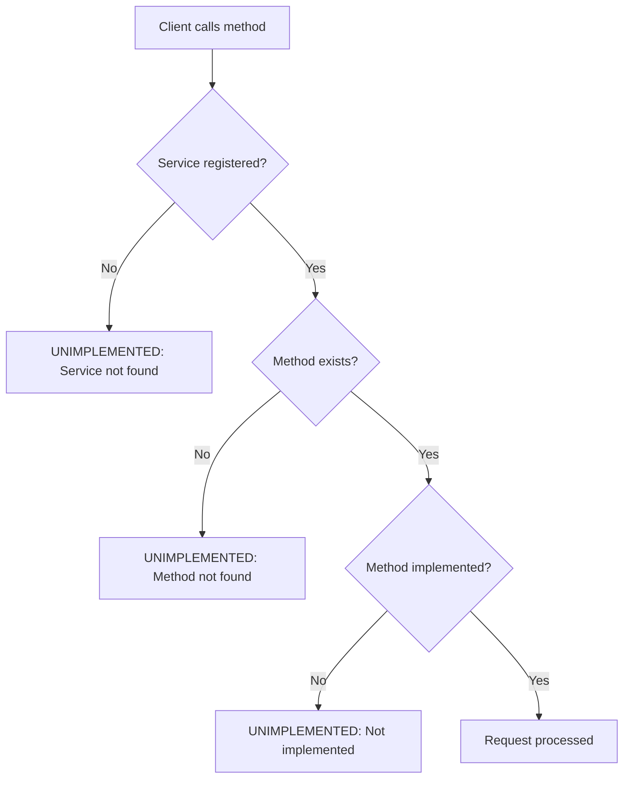
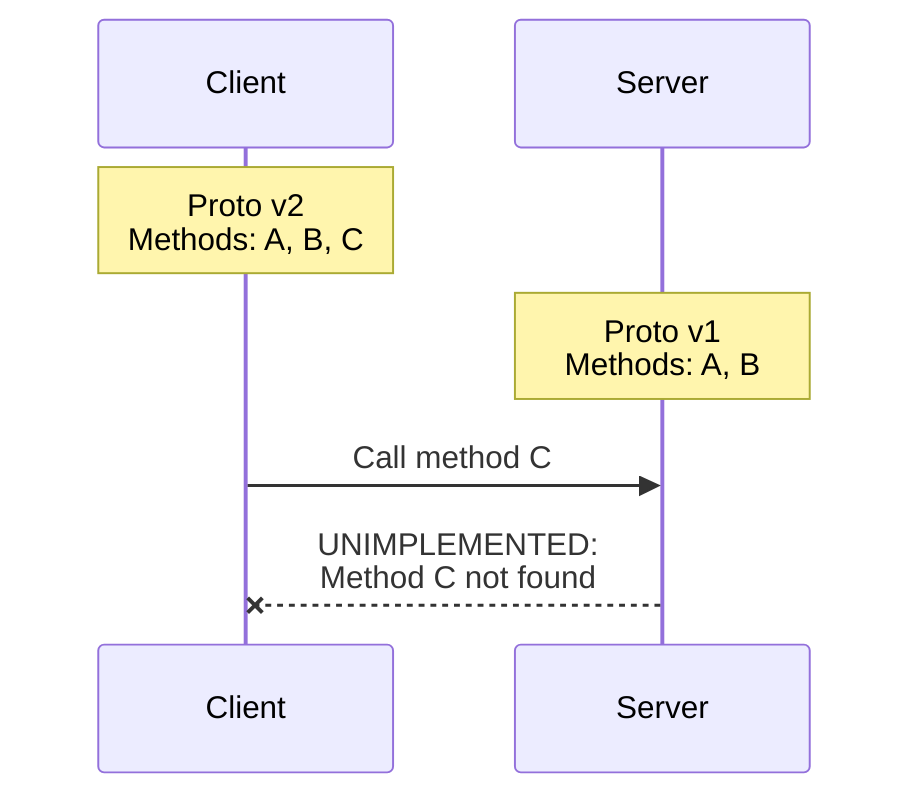
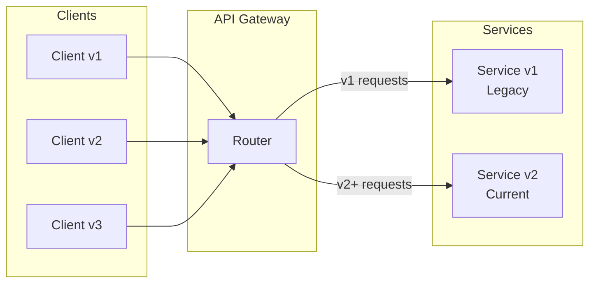

# How to Fix "Unimplemented" Method Errors in gRPC

Author: [nawazdhandala](https://github.com/nawazdhandala)

Tags: gRPC, Troubleshooting, Protocol Buffers, API, Microservices

Description: Learn how to diagnose and fix gRPC UNIMPLEMENTED status errors caused by missing methods, version mismatches, and incorrect service registration.

---

The gRPC UNIMPLEMENTED status code (code 12) indicates that the method being called is not implemented by the server. This error commonly occurs due to proto file mismatches, incorrect service registration, or version incompatibilities. This guide covers how to diagnose and fix these issues.

## Understanding UNIMPLEMENTED Errors



## Common Causes

### 1. Proto File Version Mismatch

The client and server have different versions of the proto file.



### Solution: Ensure Proto Synchronization

```protobuf
// service.proto - Always version your proto files
syntax = "proto3";

package myservice.v1;  // Use versioned package names

option go_package = "myservice/pb/v1";

// Include version in service name for clarity
service MyServiceV1 {
    rpc GetUser(GetUserRequest) returns (GetUserResponse);
    rpc CreateUser(CreateUserRequest) returns (CreateUserResponse);
    // New methods should be added in a new version
}
```

```go
// check_proto_version.go - Verify proto versions at startup
package main

import (
    "log"

    pb "myservice/pb/v1"
)

func init() {
    // Log proto file version/hash at startup for debugging
    log.Printf("Proto file version: %s", pb.File_service_proto.Path())
}
```

### 2. Service Not Registered

The service implementation was not registered with the gRPC server.

```go
// server_registration.go - Common registration mistakes

// WRONG: Forgetting to register the service
func wrongSetup() {
    server := grpc.NewServer()
    // Missing: pb.RegisterMyServiceServer(server, &myServiceImpl{})
    server.Serve(lis)
}

// CORRECT: Always register your service
func correctSetup() {
    server := grpc.NewServer()

    // Register all services
    pb.RegisterMyServiceServer(server, &myServiceImpl{})
    pb.RegisterHealthServer(server, health.NewServer())

    // Log registered services for debugging
    for service := range server.GetServiceInfo() {
        log.Printf("Registered service: %s", service)
    }

    server.Serve(lis)
}
```

### 3. Method Not Implemented

The server interface is implemented but a specific method is missing.

```go
// unimplemented_methods.go - Handling unimplemented methods

// Generated interface from proto
type MyServiceServer interface {
    GetUser(context.Context, *GetUserRequest) (*GetUserResponse, error)
    CreateUser(context.Context, *CreateUserRequest) (*CreateUserResponse, error)
    UpdateUser(context.Context, *UpdateUserRequest) (*UpdateUserResponse, error)
    DeleteUser(context.Context, *DeleteUserRequest) (*DeleteUserResponse, error)
    mustEmbedUnimplementedMyServiceServer()
}

// WRONG: Partial implementation
type incompleteServer struct {
    pb.UnimplementedMyServiceServer
}

func (s *incompleteServer) GetUser(ctx context.Context, req *pb.GetUserRequest) (*pb.GetUserResponse, error) {
    // Only GetUser is implemented
    return &pb.GetUserResponse{}, nil
}
// CreateUser, UpdateUser, DeleteUser will return UNIMPLEMENTED

// CORRECT: Full implementation with explicit not-implemented handling
type completeServer struct {
    pb.UnimplementedMyServiceServer
}

func (s *completeServer) GetUser(ctx context.Context, req *pb.GetUserRequest) (*pb.GetUserResponse, error) {
    return &pb.GetUserResponse{User: findUser(req.UserId)}, nil
}

func (s *completeServer) CreateUser(ctx context.Context, req *pb.CreateUserRequest) (*pb.CreateUserResponse, error) {
    return &pb.CreateUserResponse{User: createUser(req)}, nil
}

func (s *completeServer) UpdateUser(ctx context.Context, req *pb.UpdateUserRequest) (*pb.UpdateUserResponse, error) {
    return &pb.UpdateUserResponse{User: updateUser(req)}, nil
}

func (s *completeServer) DeleteUser(ctx context.Context, req *pb.DeleteUserRequest) (*pb.DeleteUserResponse, error) {
    return &pb.DeleteUserResponse{Success: deleteUser(req.UserId)}, nil
}
```

## Debugging UNIMPLEMENTED Errors

### List Available Services with Reflection

Enable server reflection to allow clients to discover available services:

```go
// server_reflection.go - Enable service reflection for debugging
package main

import (
    "google.golang.org/grpc"
    "google.golang.org/grpc/reflection"
    pb "myservice/pb"
)

func createServerWithReflection() *grpc.Server {
    server := grpc.NewServer()

    // Register your service
    pb.RegisterMyServiceServer(server, &myServiceServer{})

    // Enable reflection - allows clients to discover services
    // IMPORTANT: Disable in production or protect with authentication
    reflection.Register(server)

    return server
}
```

### Using grpcurl to Debug

```bash
# List all available services
grpcurl -plaintext localhost:50051 list

# Output:
# grpc.reflection.v1alpha.ServerReflection
# myservice.MyService

# List methods in a service
grpcurl -plaintext localhost:50051 list myservice.MyService

# Output:
# myservice.MyService.GetUser
# myservice.MyService.CreateUser

# Describe a method
grpcurl -plaintext localhost:50051 describe myservice.MyService.GetUser

# Test calling a method
grpcurl -plaintext -d '{"user_id": "123"}' localhost:50051 myservice.MyService.GetUser
```

### Client-Side Error Handling

```go
// client_error_handling.go - Handle UNIMPLEMENTED errors gracefully
package main

import (
    "context"
    "log"

    "google.golang.org/grpc"
    "google.golang.org/grpc/codes"
    "google.golang.org/grpc/status"
    pb "myservice/pb"
)

func callWithFallback(client pb.MyServiceClient, ctx context.Context) (*pb.Response, error) {
    // Try the new method first
    resp, err := client.NewMethod(ctx, &pb.NewMethodRequest{})
    if err != nil {
        st, ok := status.FromError(err)
        if ok && st.Code() == codes.Unimplemented {
            log.Printf("NewMethod not implemented, falling back to OldMethod")
            // Fall back to older method
            return client.OldMethod(ctx, &pb.OldMethodRequest{})
        }
        return nil, err
    }
    return resp, nil
}

// Feature detection using UNIMPLEMENTED
func checkServerFeatures(client pb.MyServiceClient) map[string]bool {
    features := make(map[string]bool)
    ctx := context.Background()

    // Check each feature by calling its method
    featureMethods := []struct {
        name   string
        check  func() error
    }{
        {
            name: "streaming",
            check: func() error {
                stream, err := client.StreamData(ctx, &pb.StreamRequest{})
                if err != nil {
                    return err
                }
                stream.CloseSend()
                return nil
            },
        },
        {
            name: "batch_processing",
            check: func() error {
                _, err := client.BatchProcess(ctx, &pb.BatchRequest{})
                return err
            },
        },
    }

    for _, fm := range featureMethods {
        err := fm.check()
        if err != nil {
            st, ok := status.FromError(err)
            if ok && st.Code() == codes.Unimplemented {
                features[fm.name] = false
                continue
            }
        }
        features[fm.name] = true
    }

    return features
}
```

## Version Compatibility Strategies

### Forward Compatibility with Optional Fields

```protobuf
// service_v2.proto - Adding new fields without breaking clients
syntax = "proto3";

package myservice.v2;

message GetUserRequest {
    string user_id = 1;

    // New optional fields - old clients will not send these
    optional string include_metadata = 2;
    optional bool include_activity = 3;
}

message GetUserResponse {
    User user = 1;

    // New fields - old clients will ignore these
    map<string, string> metadata = 2;
    repeated Activity recent_activity = 3;
}
```

### Backward Compatibility with Method Aliases

```go
// backward_compat.go - Support old method names
package main

import (
    "context"

    pb "myservice/pb/v2"
    pbLegacy "myservice/pb/v1"
)

type compatibleServer struct {
    pb.UnimplementedMyServiceV2Server
    pbLegacy.UnimplementedMyServiceV1Server
}

// V2 implementation
func (s *compatibleServer) GetUser(ctx context.Context, req *pb.GetUserRequest) (*pb.GetUserResponse, error) {
    return s.getUserInternal(ctx, req.UserId, req.IncludeMetadata, req.IncludeActivity)
}

// V1 legacy support - calls same internal logic
func (s *compatibleServer) GetUserLegacy(ctx context.Context, req *pbLegacy.GetUserRequest) (*pbLegacy.GetUserResponse, error) {
    resp, err := s.getUserInternal(ctx, req.UserId, false, false)
    if err != nil {
        return nil, err
    }
    // Convert to legacy response
    return &pbLegacy.GetUserResponse{
        User: convertToLegacyUser(resp.User),
    }, nil
}

func (s *compatibleServer) getUserInternal(ctx context.Context, userID string, includeMetadata, includeActivity bool) (*pb.GetUserResponse, error) {
    // Actual implementation
    user := fetchUser(userID)
    resp := &pb.GetUserResponse{User: user}

    if includeMetadata {
        resp.Metadata = fetchMetadata(userID)
    }
    if includeActivity {
        resp.RecentActivity = fetchActivity(userID)
    }

    return resp, nil
}

// Register both versions
func setupServer() *grpc.Server {
    server := grpc.NewServer()
    impl := &compatibleServer{}

    pb.RegisterMyServiceV2Server(server, impl)
    pbLegacy.RegisterMyServiceV1Server(server, impl)

    return server
}
```

### API Gateway Pattern for Version Management



## Interceptor for UNIMPLEMENTED Logging

```go
// unimplemented_interceptor.go - Log UNIMPLEMENTED errors for monitoring
package main

import (
    "context"
    "log"

    "google.golang.org/grpc"
    "google.golang.org/grpc/codes"
    "google.golang.org/grpc/status"
)

// UnimplementedInterceptor logs when clients call unimplemented methods
func UnimplementedInterceptor() grpc.UnaryServerInterceptor {
    return func(
        ctx context.Context,
        req interface{},
        info *grpc.UnaryServerInfo,
        handler grpc.UnaryHandler,
    ) (interface{}, error) {
        resp, err := handler(ctx, req)

        if err != nil {
            st, ok := status.FromError(err)
            if ok && st.Code() == codes.Unimplemented {
                // Log for monitoring - indicates client/server version mismatch
                log.Printf("UNIMPLEMENTED method called: %s - consider implementing or updating clients",
                    info.FullMethod)

                // Optionally increment a metric
                unimplementedCalls.WithLabelValues(info.FullMethod).Inc()
            }
        }

        return resp, err
    }
}

// Custom error message for unimplemented methods
func UnimplementedWithDetails() grpc.UnaryServerInterceptor {
    return func(
        ctx context.Context,
        req interface{},
        info *grpc.UnaryServerInfo,
        handler grpc.UnaryHandler,
    ) (interface{}, error) {
        resp, err := handler(ctx, req)

        if err != nil {
            st, ok := status.FromError(err)
            if ok && st.Code() == codes.Unimplemented {
                // Return more helpful error message
                return nil, status.Errorf(codes.Unimplemented,
                    "method %s is not implemented on this server version. "+
                    "Please check server capabilities or upgrade the server.",
                    info.FullMethod)
            }
        }

        return resp, err
    }
}
```

## Python Examples

```python
# server.py - Python gRPC server with proper error handling
import grpc
from concurrent import futures

import myservice_pb2
import myservice_pb2_grpc


class MyServiceServicer(myservice_pb2_grpc.MyServiceServicer):
    """Full implementation of MyService."""

    def GetUser(self, request, context):
        """Implemented method."""
        user = fetch_user(request.user_id)
        if not user:
            context.abort(grpc.StatusCode.NOT_FOUND, "User not found")
        return myservice_pb2.GetUserResponse(user=user)

    def CreateUser(self, request, context):
        """Implemented method."""
        user = create_user(request)
        return myservice_pb2.CreateUserResponse(user=user)

    def ExperimentalFeature(self, request, context):
        """Explicitly mark as unimplemented with helpful message."""
        context.abort(
            grpc.StatusCode.UNIMPLEMENTED,
            "ExperimentalFeature is not yet available. "
            "Expected in version 2.0. Current version: 1.5"
        )


def serve():
    server = grpc.server(futures.ThreadPoolExecutor(max_workers=10))
    myservice_pb2_grpc.add_MyServiceServicer_to_server(
        MyServiceServicer(), server
    )

    # Enable reflection for debugging
    from grpc_reflection.v1alpha import reflection
    SERVICE_NAMES = (
        myservice_pb2.DESCRIPTOR.services_by_name['MyService'].full_name,
        reflection.SERVICE_NAME,
    )
    reflection.enable_server_reflection(SERVICE_NAMES, server)

    server.add_insecure_port('[::]:50051')
    server.start()
    print("Server started with services:", SERVICE_NAMES)
    server.wait_for_termination()


if __name__ == '__main__':
    serve()
```

```python
# client.py - Python client with UNIMPLEMENTED handling
import grpc

import myservice_pb2
import myservice_pb2_grpc


def call_with_fallback(stub):
    """Try new API, fall back to old if unimplemented."""
    try:
        # Try new API
        response = stub.NewMethod(myservice_pb2.NewMethodRequest())
        return response
    except grpc.RpcError as e:
        if e.code() == grpc.StatusCode.UNIMPLEMENTED:
            print(f"NewMethod not available: {e.details()}")
            print("Falling back to OldMethod")
            return stub.OldMethod(myservice_pb2.OldMethodRequest())
        raise


def detect_server_capabilities(stub):
    """Detect which methods are available on the server."""
    capabilities = {}

    methods_to_check = [
        ('GetUser', lambda: stub.GetUser(myservice_pb2.GetUserRequest(user_id='test'))),
        ('CreateUser', lambda: stub.CreateUser(myservice_pb2.CreateUserRequest())),
        ('BatchProcess', lambda: stub.BatchProcess(myservice_pb2.BatchRequest())),
    ]

    for method_name, method_call in methods_to_check:
        try:
            method_call()
            capabilities[method_name] = True
        except grpc.RpcError as e:
            if e.code() == grpc.StatusCode.UNIMPLEMENTED:
                capabilities[method_name] = False
            else:
                # Other errors mean the method exists but failed
                capabilities[method_name] = True

    return capabilities


def main():
    with grpc.insecure_channel('localhost:50051') as channel:
        stub = myservice_pb2_grpc.MyServiceStub(channel)

        # Detect capabilities
        caps = detect_server_capabilities(stub)
        print(f"Server capabilities: {caps}")

        # Use fallback pattern
        response = call_with_fallback(stub)
        print(f"Response: {response}")


if __name__ == '__main__':
    main()
```

## Summary

| Cause | Solution |
|-------|----------|
| Proto mismatch | Sync proto files, use versioned packages |
| Service not registered | Verify pb.RegisterXxxServer() called |
| Method not implemented | Implement all interface methods |
| Version incompatibility | Use API versioning, fallback patterns |
| Client too new | Upgrade server or use feature detection |

UNIMPLEMENTED errors indicate a contract mismatch between client and server. Use server reflection for debugging, implement version detection for graceful degradation, and maintain synchronized proto files across your services.
