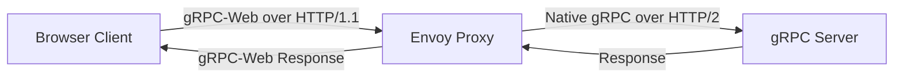
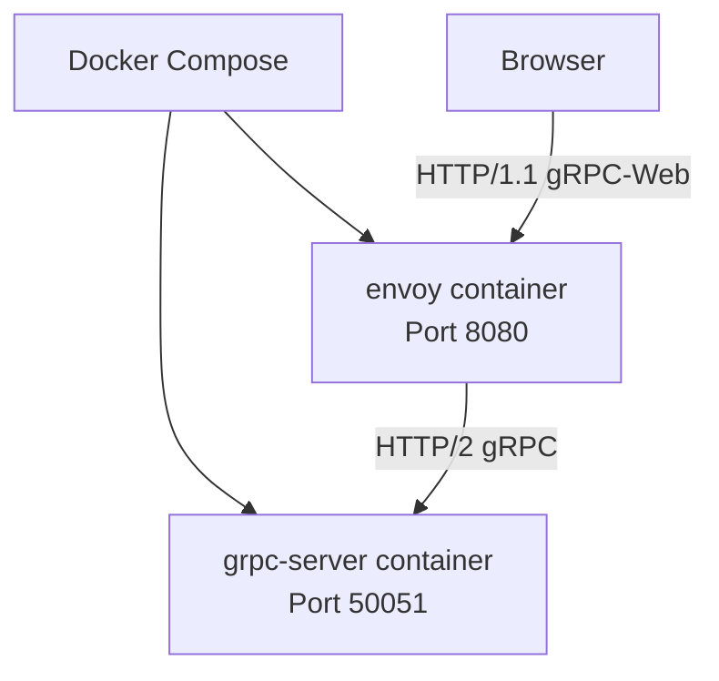
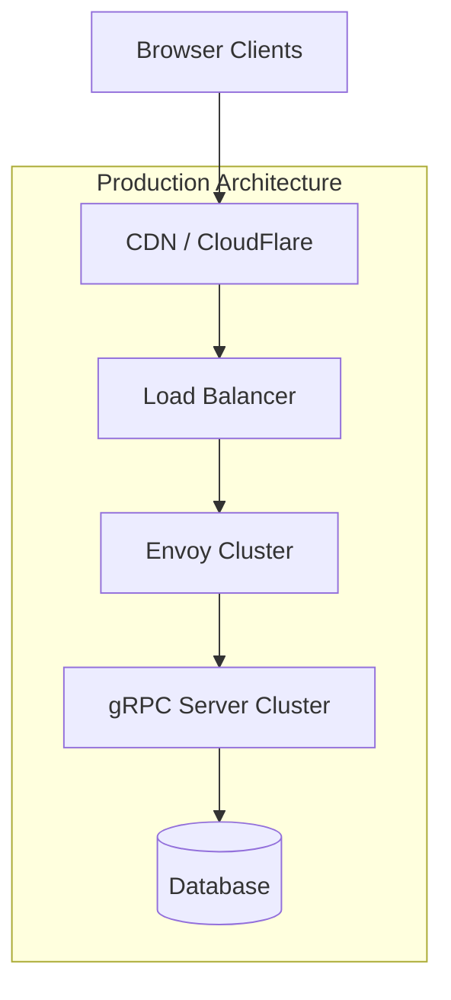

# How to Configure gRPC Web for Browser Clients

Author: [nawazdhandala](https://www.github.com/nawazdhandala)

Tags: gRPC, gRPC-Web, JavaScript, TypeScript, Browser, Envoy, Proxy

Description: A complete guide to configuring gRPC-Web for browser clients, covering proxy setup with Envoy, client generation, authentication handling, and production deployment strategies.

---

Browsers cannot directly communicate with gRPC servers because they lack support for HTTP/2 trailers and the ability to control binary framing at the protocol level. gRPC-Web solves this by providing a JavaScript client library and requiring a proxy that translates between gRPC-Web and native gRPC protocols. This guide walks you through setting up a complete gRPC-Web architecture from scratch.

## Understanding gRPC-Web Architecture

gRPC-Web introduces a translation layer between browser clients and gRPC backends:



### Why Browsers Cannot Use Native gRPC

Native gRPC requires:
- Full HTTP/2 support with trailer headers
- Binary framing control
- Bidirectional streaming

Browsers provide:
- Limited HTTP/2 control via fetch API
- No access to HTTP trailers
- No true bidirectional streaming over HTTP

gRPC-Web bridges this gap by encoding gRPC messages in a format browsers can handle.

## Setting Up the gRPC Backend

First, let us create a simple gRPC service that the browser will communicate with.

### Proto Definition

Create a proto file for a task management service:

```protobuf
// proto/tasks.proto
syntax = "proto3";

package tasks;

option go_package = "myapp/proto/tasks";

service TaskService {
    // Unary call - fully supported
    rpc CreateTask(CreateTaskRequest) returns (Task);
    rpc GetTask(GetTaskRequest) returns (Task);
    rpc ListTasks(ListTasksRequest) returns (ListTasksResponse);
    rpc UpdateTask(UpdateTaskRequest) returns (Task);
    rpc DeleteTask(DeleteTaskRequest) returns (DeleteTaskResponse);

    // Server streaming - supported in gRPC-Web
    rpc WatchTasks(WatchTasksRequest) returns (stream Task);
}

message Task {
    string id = 1;
    string title = 2;
    string description = 3;
    bool completed = 4;
    int64 created_at = 5;
    int64 updated_at = 6;
}

message CreateTaskRequest {
    string title = 1;
    string description = 2;
}

message GetTaskRequest {
    string id = 1;
}

message ListTasksRequest {
    int32 page_size = 1;
    string page_token = 2;
    bool include_completed = 3;
}

message ListTasksResponse {
    repeated Task tasks = 1;
    string next_page_token = 2;
}

message UpdateTaskRequest {
    string id = 1;
    string title = 2;
    string description = 3;
    bool completed = 4;
}

message DeleteTaskRequest {
    string id = 1;
}

message DeleteTaskResponse {
    bool success = 1;
}

message WatchTasksRequest {
    bool include_completed = 1;
}
```

### Go Server Implementation

Implement the gRPC server in Go:

```go
// server/main.go
package main

import (
    "context"
    "log"
    "net"
    "sync"
    "time"

    "github.com/google/uuid"
    "google.golang.org/grpc"
    "google.golang.org/grpc/codes"
    "google.golang.org/grpc/reflection"
    "google.golang.org/grpc/status"

    pb "myapp/proto/tasks"
)

type TaskServer struct {
    pb.UnimplementedTaskServiceServer
    mu       sync.RWMutex
    tasks    map[string]*pb.Task
    watchers []chan *pb.Task
}

func NewTaskServer() *TaskServer {
    return &TaskServer{
        tasks:    make(map[string]*pb.Task),
        watchers: make([]chan *pb.Task, 0),
    }
}

func (s *TaskServer) CreateTask(ctx context.Context, req *pb.CreateTaskRequest) (*pb.Task, error) {
    if req.GetTitle() == "" {
        return nil, status.Error(codes.InvalidArgument, "title is required")
    }

    s.mu.Lock()
    defer s.mu.Unlock()

    task := &pb.Task{
        Id:          uuid.New().String(),
        Title:       req.GetTitle(),
        Description: req.GetDescription(),
        Completed:   false,
        CreatedAt:   time.Now().Unix(),
        UpdatedAt:   time.Now().Unix(),
    }

    s.tasks[task.Id] = task

    // Notify watchers
    s.notifyWatchers(task)

    return task, nil
}

func (s *TaskServer) GetTask(ctx context.Context, req *pb.GetTaskRequest) (*pb.Task, error) {
    s.mu.RLock()
    defer s.mu.RUnlock()

    task, exists := s.tasks[req.GetId()]
    if !exists {
        return nil, status.Errorf(codes.NotFound, "task %s not found", req.GetId())
    }

    return task, nil
}

func (s *TaskServer) ListTasks(ctx context.Context, req *pb.ListTasksRequest) (*pb.ListTasksResponse, error) {
    s.mu.RLock()
    defer s.mu.RUnlock()

    var tasks []*pb.Task
    for _, task := range s.tasks {
        if !req.GetIncludeCompleted() && task.Completed {
            continue
        }
        tasks = append(tasks, task)
    }

    return &pb.ListTasksResponse{Tasks: tasks}, nil
}

func (s *TaskServer) WatchTasks(req *pb.WatchTasksRequest, stream pb.TaskService_WatchTasksServer) error {
    ch := make(chan *pb.Task, 100)

    s.mu.Lock()
    s.watchers = append(s.watchers, ch)
    s.mu.Unlock()

    defer func() {
        s.mu.Lock()
        for i, watcher := range s.watchers {
            if watcher == ch {
                s.watchers = append(s.watchers[:i], s.watchers[i+1:]...)
                break
            }
        }
        s.mu.Unlock()
        close(ch)
    }()

    for {
        select {
        case task := <-ch:
            if !req.GetIncludeCompleted() && task.Completed {
                continue
            }
            if err := stream.Send(task); err != nil {
                return err
            }
        case <-stream.Context().Done():
            return nil
        }
    }
}

func (s *TaskServer) notifyWatchers(task *pb.Task) {
    for _, ch := range s.watchers {
        select {
        case ch <- task:
        default:
            // Skip if channel is full
        }
    }
}

func main() {
    lis, err := net.Listen("tcp", ":50051")
    if err != nil {
        log.Fatalf("failed to listen: %v", err)
    }

    server := grpc.NewServer()
    pb.RegisterTaskServiceServer(server, NewTaskServer())
    reflection.Register(server)

    log.Println("gRPC server listening on :50051")
    if err := server.Serve(lis); err != nil {
        log.Fatalf("failed to serve: %v", err)
    }
}
```

## Configuring Envoy Proxy

Envoy is the recommended proxy for gRPC-Web. It handles the protocol translation between browsers and gRPC backends.

### Envoy Configuration

Create an Envoy configuration file:

```yaml
# envoy.yaml
admin:
  address:
    socket_address:
      address: 0.0.0.0
      port_value: 9901

static_resources:
  listeners:
    - name: listener_0
      address:
        socket_address:
          address: 0.0.0.0
          port_value: 8080
      filter_chains:
        - filters:
            - name: envoy.filters.network.http_connection_manager
              typed_config:
                "@type": type.googleapis.com/envoy.extensions.filters.network.http_connection_manager.v3.HttpConnectionManager
                codec_type: AUTO
                stat_prefix: ingress_http
                route_config:
                  name: local_route
                  virtual_hosts:
                    - name: local_service
                      domains: ["*"]
                      routes:
                        - match:
                            prefix: "/"
                          route:
                            cluster: grpc_service
                            timeout: 0s
                            max_stream_duration:
                              grpc_timeout_header_max: 0s
                      cors:
                        allow_origin_string_match:
                          - prefix: "*"
                        allow_methods: GET, PUT, DELETE, POST, OPTIONS
                        allow_headers: keep-alive,user-agent,cache-control,content-type,content-transfer-encoding,custom-header-1,x-accept-content-transfer-encoding,x-accept-response-streaming,x-user-agent,x-grpc-web,grpc-timeout,authorization
                        max_age: "1728000"
                        expose_headers: custom-header-1,grpc-status,grpc-message
                http_filters:
                  - name: envoy.filters.http.grpc_web
                    typed_config:
                      "@type": type.googleapis.com/envoy.extensions.filters.http.grpc_web.v3.GrpcWeb
                  - name: envoy.filters.http.cors
                    typed_config:
                      "@type": type.googleapis.com/envoy.extensions.filters.http.cors.v3.Cors
                  - name: envoy.filters.http.router
                    typed_config:
                      "@type": type.googleapis.com/envoy.extensions.filters.http.router.v3.Router

  clusters:
    - name: grpc_service
      connect_timeout: 0.25s
      type: LOGICAL_DNS
      http2_protocol_options: {}
      lb_policy: ROUND_ROBIN
      load_assignment:
        cluster_name: grpc_service
        endpoints:
          - lb_endpoints:
              - endpoint:
                  address:
                    socket_address:
                      address: localhost
                      port_value: 50051
```

### Running Envoy with Docker

Create a Docker Compose file to run both services:

```yaml
# docker-compose.yaml
version: '3.8'

services:
  grpc-server:
    build:
      context: .
      dockerfile: Dockerfile.server
    ports:
      - "50051:50051"

  envoy:
    image: envoyproxy/envoy:v1.28-latest
    volumes:
      - ./envoy.yaml:/etc/envoy/envoy.yaml
    ports:
      - "8080:8080"
      - "9901:9901"
    depends_on:
      - grpc-server
    command: /usr/local/bin/envoy -c /etc/envoy/envoy.yaml -l debug
```



## Generating JavaScript/TypeScript Client

### Using protoc with grpc-web Plugin

Install the required tools and generate the client code:

```bash
# Install protoc plugins
npm install -g grpc-tools grpc_tools_node_protoc_ts

# For gRPC-Web specifically
# Download from https://github.com/grpc/grpc-web/releases

# Generate JavaScript client code
protoc -I=./proto \
    --js_out=import_style=commonjs:./src/generated \
    --grpc-web_out=import_style=typescript,mode=grpcwebtext:./src/generated \
    ./proto/tasks.proto
```

### TypeScript Client Setup

Set up the client project structure:

```bash
# Initialize project
mkdir grpc-web-client
cd grpc-web-client
npm init -y

# Install dependencies
npm install grpc-web google-protobuf
npm install -D typescript @types/google-protobuf
```

Create a TypeScript configuration:

```json
// tsconfig.json
{
    "compilerOptions": {
        "target": "ES2020",
        "module": "ESNext",
        "moduleResolution": "node",
        "strict": true,
        "esModuleInterop": true,
        "skipLibCheck": true,
        "forceConsistentCasingInFileNames": true,
        "outDir": "./dist",
        "rootDir": "./src",
        "declaration": true
    },
    "include": ["src/**/*"],
    "exclude": ["node_modules"]
}
```

### Creating the gRPC-Web Client

Create a client wrapper with proper error handling:

```typescript
// src/client/TaskClient.ts
import { TaskServiceClient } from '../generated/TasksServiceClientPb';
import {
    CreateTaskRequest,
    GetTaskRequest,
    ListTasksRequest,
    UpdateTaskRequest,
    DeleteTaskRequest,
    WatchTasksRequest,
    Task,
    ListTasksResponse,
    DeleteTaskResponse
} from '../generated/tasks_pb';
import { ClientReadableStream, RpcError, Status } from 'grpc-web';

// Configuration for the client
interface ClientConfig {
    baseUrl: string;
    authToken?: string;
}

// Custom error class for gRPC-Web errors
export class GrpcWebError extends Error {
    code: number;
    metadata: { [key: string]: string };

    constructor(error: RpcError) {
        super(error.message);
        this.name = 'GrpcWebError';
        this.code = error.code;
        this.metadata = error.metadata || {};
    }
}

export class TaskClient {
    private client: TaskServiceClient;
    private authToken?: string;

    constructor(config: ClientConfig) {
        this.client = new TaskServiceClient(config.baseUrl);
        this.authToken = config.authToken;
    }

    // Set authentication token for subsequent requests
    setAuthToken(token: string): void {
        this.authToken = token;
    }

    // Get metadata with auth token if available
    private getMetadata(): { [key: string]: string } {
        const metadata: { [key: string]: string } = {};
        if (this.authToken) {
            metadata['authorization'] = `Bearer ${this.authToken}`;
        }
        return metadata;
    }

    // Create a new task
    async createTask(title: string, description: string): Promise<Task.AsObject> {
        const request = new CreateTaskRequest();
        request.setTitle(title);
        request.setDescription(description);

        return new Promise((resolve, reject) => {
            this.client.createTask(request, this.getMetadata(), (err, response) => {
                if (err) {
                    reject(new GrpcWebError(err));
                    return;
                }
                resolve(response.toObject());
            });
        });
    }

    // Get a single task by ID
    async getTask(id: string): Promise<Task.AsObject> {
        const request = new GetTaskRequest();
        request.setId(id);

        return new Promise((resolve, reject) => {
            this.client.getTask(request, this.getMetadata(), (err, response) => {
                if (err) {
                    reject(new GrpcWebError(err));
                    return;
                }
                resolve(response.toObject());
            });
        });
    }

    // List tasks with pagination
    async listTasks(
        pageSize: number = 10,
        pageToken: string = '',
        includeCompleted: boolean = false
    ): Promise<ListTasksResponse.AsObject> {
        const request = new ListTasksRequest();
        request.setPageSize(pageSize);
        request.setPageToken(pageToken);
        request.setIncludeCompleted(includeCompleted);

        return new Promise((resolve, reject) => {
            this.client.listTasks(request, this.getMetadata(), (err, response) => {
                if (err) {
                    reject(new GrpcWebError(err));
                    return;
                }
                resolve(response.toObject());
            });
        });
    }

    // Update an existing task
    async updateTask(
        id: string,
        title: string,
        description: string,
        completed: boolean
    ): Promise<Task.AsObject> {
        const request = new UpdateTaskRequest();
        request.setId(id);
        request.setTitle(title);
        request.setDescription(description);
        request.setCompleted(completed);

        return new Promise((resolve, reject) => {
            this.client.updateTask(request, this.getMetadata(), (err, response) => {
                if (err) {
                    reject(new GrpcWebError(err));
                    return;
                }
                resolve(response.toObject());
            });
        });
    }

    // Delete a task
    async deleteTask(id: string): Promise<DeleteTaskResponse.AsObject> {
        const request = new DeleteTaskRequest();
        request.setId(id);

        return new Promise((resolve, reject) => {
            this.client.deleteTask(request, this.getMetadata(), (err, response) => {
                if (err) {
                    reject(new GrpcWebError(err));
                    return;
                }
                resolve(response.toObject());
            });
        });
    }

    // Watch for task updates using server streaming
    watchTasks(
        includeCompleted: boolean,
        onTask: (task: Task.AsObject) => void,
        onError: (error: GrpcWebError) => void,
        onEnd?: () => void
    ): () => void {
        const request = new WatchTasksRequest();
        request.setIncludeCompleted(includeCompleted);

        const stream = this.client.watchTasks(request, this.getMetadata());

        stream.on('data', (response: Task) => {
            onTask(response.toObject());
        });

        stream.on('error', (err: RpcError) => {
            onError(new GrpcWebError(err));
        });

        stream.on('end', () => {
            if (onEnd) {
                onEnd();
            }
        });

        // Return cancel function
        return () => {
            stream.cancel();
        };
    }
}
```

## Using gRPC-Web in React

Create React hooks for easy integration:

```typescript
// src/hooks/useTasks.ts
import { useState, useEffect, useCallback } from 'react';
import { TaskClient, GrpcWebError } from '../client/TaskClient';
import { Task } from '../generated/tasks_pb';

const client = new TaskClient({
    baseUrl: 'http://localhost:8080'
});

interface UseTasksResult {
    tasks: Task.AsObject[];
    loading: boolean;
    error: GrpcWebError | null;
    createTask: (title: string, description: string) => Promise<Task.AsObject>;
    updateTask: (id: string, title: string, description: string, completed: boolean) => Promise<void>;
    deleteTask: (id: string) => Promise<void>;
    refresh: () => Promise<void>;
}

export function useTasks(includeCompleted: boolean = false): UseTasksResult {
    const [tasks, setTasks] = useState<Task.AsObject[]>([]);
    const [loading, setLoading] = useState(true);
    const [error, setError] = useState<GrpcWebError | null>(null);

    const fetchTasks = useCallback(async () => {
        setLoading(true);
        setError(null);
        try {
            const response = await client.listTasks(100, '', includeCompleted);
            setTasks(response.tasksList);
        } catch (err) {
            setError(err as GrpcWebError);
        } finally {
            setLoading(false);
        }
    }, [includeCompleted]);

    useEffect(() => {
        fetchTasks();

        // Set up streaming for real-time updates
        const cancelWatch = client.watchTasks(
            includeCompleted,
            (task) => {
                setTasks((prevTasks) => {
                    const index = prevTasks.findIndex((t) => t.id === task.id);
                    if (index >= 0) {
                        // Update existing task
                        const newTasks = [...prevTasks];
                        newTasks[index] = task;
                        return newTasks;
                    } else {
                        // Add new task
                        return [...prevTasks, task];
                    }
                });
            },
            (err) => {
                console.error('Watch error:', err);
            }
        );

        return () => {
            cancelWatch();
        };
    }, [includeCompleted, fetchTasks]);

    const createTask = async (title: string, description: string): Promise<Task.AsObject> => {
        const task = await client.createTask(title, description);
        return task;
    };

    const updateTask = async (
        id: string,
        title: string,
        description: string,
        completed: boolean
    ): Promise<void> => {
        await client.updateTask(id, title, description, completed);
    };

    const deleteTask = async (id: string): Promise<void> => {
        await client.deleteTask(id);
        setTasks((prevTasks) => prevTasks.filter((t) => t.id !== id));
    };

    return {
        tasks,
        loading,
        error,
        createTask,
        updateTask,
        deleteTask,
        refresh: fetchTasks
    };
}
```

### React Component Example

```typescript
// src/components/TaskList.tsx
import React, { useState } from 'react';
import { useTasks } from '../hooks/useTasks';

export function TaskList(): React.ReactElement {
    const { tasks, loading, error, createTask, updateTask, deleteTask } = useTasks();
    const [newTaskTitle, setNewTaskTitle] = useState('');
    const [newTaskDescription, setNewTaskDescription] = useState('');

    const handleCreateTask = async (e: React.FormEvent) => {
        e.preventDefault();
        if (!newTaskTitle.trim()) return;

        try {
            await createTask(newTaskTitle, newTaskDescription);
            setNewTaskTitle('');
            setNewTaskDescription('');
        } catch (err) {
            console.error('Failed to create task:', err);
        }
    };

    const handleToggleComplete = async (task: Task.AsObject) => {
        try {
            await updateTask(task.id, task.title, task.description, !task.completed);
        } catch (err) {
            console.error('Failed to update task:', err);
        }
    };

    if (loading) {
        return <div>Loading tasks...</div>;
    }

    if (error) {
        return <div>Error: {error.message} (Code: {error.code})</div>;
    }

    return (
        <div>
            <h1>Tasks</h1>

            <form onSubmit={handleCreateTask}>
                <input
                    type="text"
                    value={newTaskTitle}
                    onChange={(e) => setNewTaskTitle(e.target.value)}
                    placeholder="Task title"
                />
                <input
                    type="text"
                    value={newTaskDescription}
                    onChange={(e) => setNewTaskDescription(e.target.value)}
                    placeholder="Description"
                />
                <button type="submit">Add Task</button>
            </form>

            <ul>
                {tasks.map((task) => (
                    <li key={task.id}>
                        <input
                            type="checkbox"
                            checked={task.completed}
                            onChange={() => handleToggleComplete(task)}
                        />
                        <span style={{ textDecoration: task.completed ? 'line-through' : 'none' }}>
                            {task.title}
                        </span>
                        <button onClick={() => deleteTask(task.id)}>Delete</button>
                    </li>
                ))}
            </ul>
        </div>
    );
}
```

## Handling Authentication

Configure Envoy to pass authentication headers to the backend:

```yaml
# envoy-with-auth.yaml (partial)
http_filters:
  - name: envoy.filters.http.grpc_web
    typed_config:
      "@type": type.googleapis.com/envoy.extensions.filters.http.grpc_web.v3.GrpcWeb
  - name: envoy.filters.http.cors
    typed_config:
      "@type": type.googleapis.com/envoy.extensions.filters.http.cors.v3.Cors
  # Add JWT authentication filter
  - name: envoy.filters.http.jwt_authn
    typed_config:
      "@type": type.googleapis.com/envoy.extensions.filters.http.jwt_authn.v3.JwtAuthentication
      providers:
        auth0:
          issuer: "https://your-domain.auth0.com/"
          audiences:
            - "your-api-identifier"
          remote_jwks:
            http_uri:
              uri: "https://your-domain.auth0.com/.well-known/jwks.json"
              cluster: auth0_jwks
              timeout: 5s
      rules:
        - match:
            prefix: "/"
          requires:
            provider_name: auth0
  - name: envoy.filters.http.router
    typed_config:
      "@type": type.googleapis.com/envoy.extensions.filters.http.router.v3.Router
```

## Production Deployment Considerations



### Key Production Settings

1. **Enable TLS** - Always use HTTPS in production
2. **Configure proper timeouts** - Set appropriate deadlines
3. **Enable compression** - Reduce payload sizes
4. **Set up health checks** - Monitor proxy and backend health
5. **Configure rate limiting** - Protect against abuse

### Example Nginx Configuration for TLS Termination

If using Nginx for TLS termination before Envoy:

```nginx
# nginx.conf
upstream envoy {
    server localhost:8080;
}

server {
    listen 443 ssl http2;
    server_name api.example.com;

    ssl_certificate /etc/ssl/certs/server.crt;
    ssl_certificate_key /etc/ssl/private/server.key;

    location / {
        grpc_pass grpc://envoy;

        # Important headers for gRPC-Web
        proxy_http_version 1.1;
        proxy_set_header Upgrade $http_upgrade;
        proxy_set_header Connection "upgrade";
        proxy_set_header Host $host;
        proxy_set_header X-Real-IP $remote_addr;
    }
}
```

## Troubleshooting Common Issues

### CORS Errors

If you see CORS errors in the browser console, verify the Envoy CORS configuration includes all required headers:

```yaml
cors:
  allow_origin_string_match:
    - prefix: "*"  # Or specific origins for production
  allow_methods: GET, PUT, DELETE, POST, OPTIONS
  allow_headers: keep-alive,user-agent,cache-control,content-type,content-transfer-encoding,x-accept-content-transfer-encoding,x-accept-response-streaming,x-user-agent,x-grpc-web,grpc-timeout,authorization
  expose_headers: grpc-status,grpc-message
```

### Connection Refused

Ensure the Envoy cluster configuration points to the correct gRPC server address and port.

### Streaming Not Working

gRPC-Web only supports server streaming, not client or bidirectional streaming. For bidirectional communication, consider using WebSockets alongside gRPC-Web.

## Conclusion

gRPC-Web enables browser clients to communicate with gRPC backends through a translation proxy like Envoy. While it requires additional infrastructure compared to REST APIs, it provides type safety, efficient binary serialization, and streaming capabilities that make it worthwhile for complex applications. By following the patterns in this guide, you can build robust, production-ready gRPC-Web applications with proper error handling, authentication, and real-time updates.
