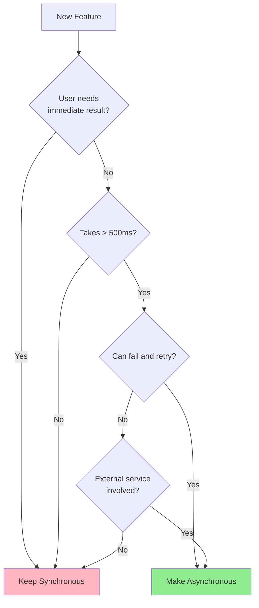
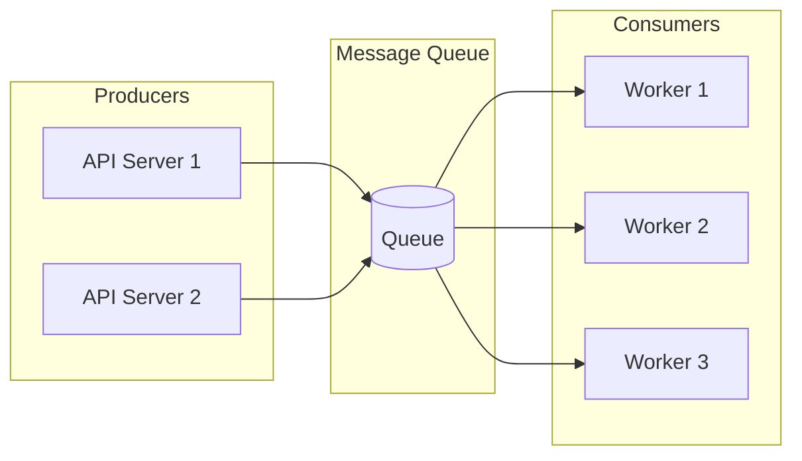
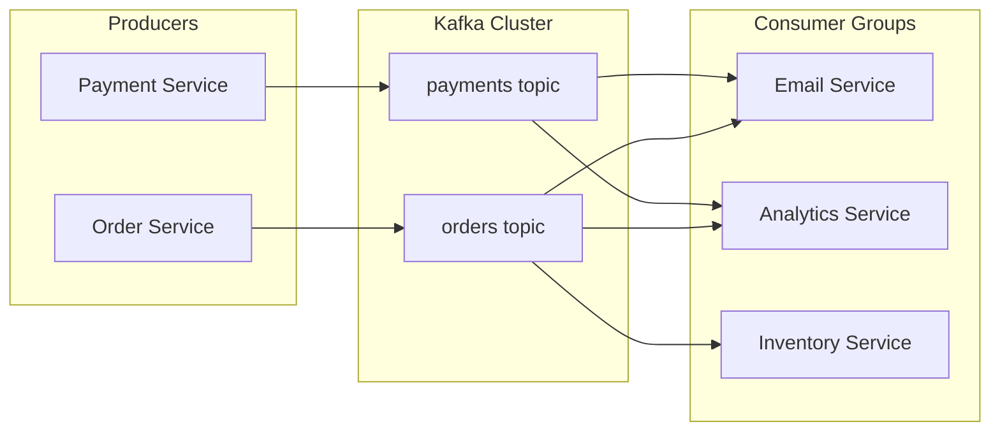

# How to Handle Async Processing

Author: [nawazdhandala](https://www.github.com/nawazdhandala)

Tags: Async, Message Queues, RabbitMQ, Redis, Kafka, Background Jobs, Architecture, Performance

Description: A practical guide to implementing async processing patterns using message queues, background workers, and event-driven architectures for scalable applications.

---

Synchronous processing works fine until it doesn't. When your API takes 30 seconds to process a request because it's sending emails, generating reports, or processing images, users get frustrated and connections time out. Async processing moves time-consuming work out of the request path, keeping your application responsive.

## When to Use Async Processing

Not every operation needs to be async. Here's a decision framework:



Common async candidates:
- Email and notification sending
- Report and PDF generation
- Image and video processing
- Third-party API calls
- Data imports and exports
- Analytics and logging

## Message Queue Basics

Message queues are the backbone of async processing. They decouple producers (your API) from consumers (workers).



## Implementing with Redis and BullMQ

BullMQ is a robust job queue for Node.js backed by Redis.

### Setting Up the Queue

```typescript
// queue.ts
import { Queue, Worker, Job } from 'bullmq';
import Redis from 'ioredis';

// Create Redis connection
const connection = new Redis({
    host: process.env.REDIS_HOST || 'localhost',
    port: parseInt(process.env.REDIS_PORT || '6379'),
    maxRetriesPerRequest: null,  // Required for BullMQ
});

// Define job types for type safety
interface EmailJob {
    to: string;
    subject: string;
    body: string;
    attachments?: string[];
}

interface ReportJob {
    userId: string;
    reportType: 'daily' | 'weekly' | 'monthly';
    dateRange: { start: Date; end: Date };
}

// Create queues
export const emailQueue = new Queue<EmailJob>('email', { connection });
export const reportQueue = new Queue<ReportJob>('reports', { connection });
```

### Creating the Worker

```typescript
// workers/email-worker.ts
import { Worker, Job } from 'bullmq';
import { sendEmail } from '../services/email';

const emailWorker = new Worker<EmailJob>(
    'email',
    async (job: Job<EmailJob>) => {
        console.log(`Processing email job ${job.id}`);

        const { to, subject, body, attachments } = job.data;

        // Update progress
        await job.updateProgress(10);

        // Validate data
        if (!to || !subject) {
            throw new Error('Missing required email fields');
        }

        await job.updateProgress(30);

        // Send the email
        const result = await sendEmail({
            to,
            subject,
            html: body,
            attachments: attachments?.map(path => ({ path }))
        });

        await job.updateProgress(100);

        return { messageId: result.messageId, sentAt: new Date() };
    },
    {
        connection,
        concurrency: 5,  // Process 5 emails at a time
        limiter: {
            max: 100,     // Max 100 jobs
            duration: 60000  // Per minute (rate limiting)
        }
    }
);

// Event handlers
emailWorker.on('completed', (job, result) => {
    console.log(`Email ${job.id} sent: ${result.messageId}`);
});

emailWorker.on('failed', (job, err) => {
    console.error(`Email ${job?.id} failed:`, err.message);
});

export default emailWorker;
```

### Producing Jobs from Your API

```typescript
// routes/orders.ts
import express from 'express';
import { emailQueue, reportQueue } from '../queue';

const router = express.Router();

router.post('/orders', async (req, res) => {
    const { items, customerId, email } = req.body;

    // Process order synchronously (fast operation)
    const order = await createOrder({ items, customerId });

    // Queue email asynchronously (slow operation)
    await emailQueue.add(
        'order-confirmation',  // Job name
        {
            to: email,
            subject: `Order ${order.id} Confirmed`,
            body: generateOrderEmail(order)
        },
        {
            attempts: 3,           // Retry 3 times
            backoff: {
                type: 'exponential',
                delay: 2000        // Start with 2s, then 4s, 8s
            },
            removeOnComplete: 100, // Keep last 100 completed jobs
            removeOnFail: 500      // Keep last 500 failed jobs
        }
    );

    // Return immediately - email sends in background
    res.status(201).json({ order, message: 'Order placed, confirmation email queued' });
});

// Endpoint to check job status
router.get('/jobs/:id/status', async (req, res) => {
    const job = await emailQueue.getJob(req.params.id);

    if (!job) {
        return res.status(404).json({ error: 'Job not found' });
    }

    const state = await job.getState();
    const progress = job.progress;

    res.json({ id: job.id, state, progress });
});

export default router;
```

## Implementing with RabbitMQ

For more complex routing and enterprise features, RabbitMQ is excellent.

```python
# publisher.py
import pika
import json
from datetime import datetime

class MessagePublisher:
    def __init__(self, host='localhost'):
        self.connection = pika.BlockingConnection(
            pika.ConnectionParameters(host=host)
        )
        self.channel = self.connection.channel()

        # Declare exchange for routing
        self.channel.exchange_declare(
            exchange='tasks',
            exchange_type='topic',
            durable=True
        )

        # Declare queues
        self.channel.queue_declare(queue='email_tasks', durable=True)
        self.channel.queue_declare(queue='report_tasks', durable=True)

        # Bind queues to exchange with routing keys
        self.channel.queue_bind(
            exchange='tasks',
            queue='email_tasks',
            routing_key='task.email.*'
        )
        self.channel.queue_bind(
            exchange='tasks',
            queue='report_tasks',
            routing_key='task.report.*'
        )

    def publish_email_task(self, to: str, subject: str, body: str):
        message = {
            'to': to,
            'subject': subject,
            'body': body,
            'created_at': datetime.utcnow().isoformat()
        }

        self.channel.basic_publish(
            exchange='tasks',
            routing_key='task.email.send',
            body=json.dumps(message),
            properties=pika.BasicProperties(
                delivery_mode=2,  # Persistent message
                content_type='application/json'
            )
        )

    def close(self):
        self.connection.close()
```

```python
# worker.py
import pika
import json
import time
from email_service import send_email

def process_email(ch, method, properties, body):
    try:
        message = json.loads(body)
        print(f"Processing email to {message['to']}")

        # Send the email
        send_email(
            to=message['to'],
            subject=message['subject'],
            body=message['body']
        )

        # Acknowledge successful processing
        ch.basic_ack(delivery_tag=method.delivery_tag)
        print(f"Email sent successfully")

    except Exception as e:
        print(f"Failed to process email: {e}")
        # Reject and requeue for retry
        ch.basic_nack(
            delivery_tag=method.delivery_tag,
            requeue=True
        )

def main():
    connection = pika.BlockingConnection(
        pika.ConnectionParameters('localhost')
    )
    channel = connection.channel()

    # Fair dispatch - only send one message at a time to each worker
    channel.basic_qos(prefetch_count=1)

    channel.basic_consume(
        queue='email_tasks',
        on_message_callback=process_email
    )

    print('Worker started. Waiting for messages...')
    channel.start_consuming()

if __name__ == '__main__':
    main()
```

## Event-Driven Architecture with Kafka

For high-throughput systems, Kafka provides durable event streaming.



```go
// producer.go
package main

import (
    "context"
    "encoding/json"
    "log"
    "time"

    "github.com/segmentio/kafka-go"
)

type OrderEvent struct {
    EventType string    `json:"event_type"`
    OrderID   string    `json:"order_id"`
    UserID    string    `json:"user_id"`
    Amount    float64   `json:"amount"`
    Timestamp time.Time `json:"timestamp"`
}

type EventProducer struct {
    writer *kafka.Writer
}

func NewEventProducer(brokers []string, topic string) *EventProducer {
    return &EventProducer{
        writer: &kafka.Writer{
            Addr:         kafka.TCP(brokers...),
            Topic:        topic,
            Balancer:     &kafka.LeastBytes{},
            BatchTimeout: 10 * time.Millisecond,
            RequiredAcks: kafka.RequireAll,  // Wait for all replicas
        },
    }
}

func (p *EventProducer) PublishOrderEvent(ctx context.Context, event OrderEvent) error {
    data, err := json.Marshal(event)
    if err != nil {
        return err
    }

    return p.writer.WriteMessages(ctx, kafka.Message{
        Key:   []byte(event.OrderID),  // Ensures ordering per order
        Value: data,
        Headers: []kafka.Header{
            {Key: "event_type", Value: []byte(event.EventType)},
        },
    })
}

func (p *EventProducer) Close() error {
    return p.writer.Close()
}
```

```go
// consumer.go
package main

import (
    "context"
    "encoding/json"
    "log"

    "github.com/segmentio/kafka-go"
)

type EventConsumer struct {
    reader *kafka.Reader
}

func NewEventConsumer(brokers []string, topic, groupID string) *EventConsumer {
    return &EventConsumer{
        reader: kafka.NewReader(kafka.ReaderConfig{
            Brokers:        brokers,
            Topic:          topic,
            GroupID:        groupID,
            MinBytes:       10e3,  // 10KB
            MaxBytes:       10e6,  // 10MB
            CommitInterval: time.Second,
            StartOffset:    kafka.FirstOffset,
        }),
    }
}

func (c *EventConsumer) Start(ctx context.Context, handler func(OrderEvent) error) {
    for {
        msg, err := c.reader.FetchMessage(ctx)
        if err != nil {
            if ctx.Err() != nil {
                return  // Context cancelled
            }
            log.Printf("Error fetching message: %v", err)
            continue
        }

        var event OrderEvent
        if err := json.Unmarshal(msg.Value, &event); err != nil {
            log.Printf("Error unmarshaling event: %v", err)
            continue
        }

        // Process the event
        if err := handler(event); err != nil {
            log.Printf("Error handling event: %v", err)
            // Don't commit - will retry
            continue
        }

        // Commit offset after successful processing
        if err := c.reader.CommitMessages(ctx, msg); err != nil {
            log.Printf("Error committing: %v", err)
        }
    }
}
```

## Best Practices for Async Processing

### 1. Make Jobs Idempotent

Jobs might run more than once. Design for it:

```python
# Bad: Not idempotent
def process_payment(order_id):
    order = get_order(order_id)
    charge_customer(order.amount)  # Might charge twice!

# Good: Idempotent with deduplication
def process_payment(order_id, idempotency_key):
    # Check if already processed
    if redis.get(f"payment:{idempotency_key}"):
        return get_existing_result(idempotency_key)

    order = get_order(order_id)
    result = charge_customer(order.amount, idempotency_key)

    # Mark as processed
    redis.setex(f"payment:{idempotency_key}", 86400, result.id)
    return result
```

### 2. Implement Dead Letter Queues

Don't lose failed messages:

```yaml
# RabbitMQ dead letter configuration
# rabbitmq.conf
queues:
  email_tasks:
    arguments:
      x-dead-letter-exchange: "dlx"
      x-dead-letter-routing-key: "email_tasks.dead"
      x-message-ttl: 86400000  # 24 hours
```

### 3. Monitor Queue Health

```yaml
# prometheus-alerts.yaml
groups:
- name: queue-alerts
  rules:
  - alert: QueueBacklogHigh
    expr: rabbitmq_queue_messages > 10000
    for: 5m
    labels:
      severity: warning
    annotations:
      summary: "Queue backlog growing"

  - alert: ConsumerDown
    expr: rabbitmq_queue_consumers == 0
    for: 1m
    labels:
      severity: critical
    annotations:
      summary: "No consumers for queue {{ $labels.queue }}"
```

### 4. Set Appropriate Timeouts and Retries

```typescript
// Configure per job type
const jobOptions = {
    // Quick jobs (emails)
    email: {
        attempts: 3,
        backoff: { type: 'exponential', delay: 1000 },
        timeout: 30000  // 30 seconds
    },
    // Long jobs (reports)
    report: {
        attempts: 2,
        backoff: { type: 'fixed', delay: 60000 },
        timeout: 300000  // 5 minutes
    }
};
```

Async processing transforms slow, blocking operations into responsive user experiences. Start simple with Redis queues, graduate to RabbitMQ for routing needs, and consider Kafka for event streaming at scale. The key is choosing the right tool for your specific use case and traffic patterns.
