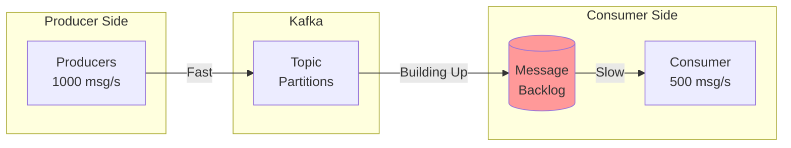
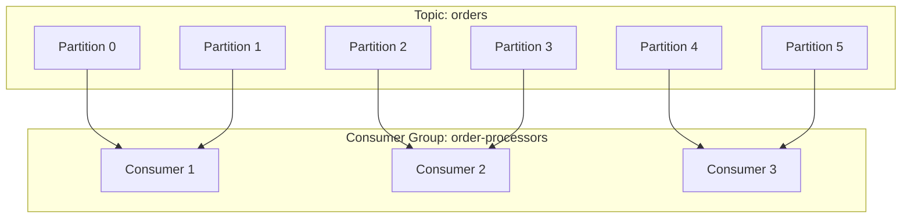

# How to Handle Backpressure in Kafka Consumers

Author: [nawazdhandala](https://www.github.com/nawazdhandala)

Tags: Kafka, Apache Kafka, Consumer, Backpressure, Performance, Java, Scaling, Throttling, Message Queue

Description: A comprehensive guide to handling backpressure in Apache Kafka consumers, including detection strategies, consumer configuration, flow control patterns, and scaling techniques.

---

> Backpressure occurs when Kafka consumers cannot process messages as fast as they are being produced. Without proper handling, this leads to increasing consumer lag, memory issues, and eventually processing failures. This guide covers practical strategies for detecting, managing, and resolving backpressure in your Kafka consumer applications.

Understanding and managing backpressure is crucial for building reliable streaming applications that maintain consistent performance under varying loads.

---

## Understanding Backpressure in Kafka



### Symptoms of Backpressure

| Symptom | Description | Impact |
|---------|-------------|--------|
| Increasing lag | Consumer offset falls behind log end offset | Delayed processing |
| Memory pressure | Large poll batches consuming heap | OOM errors |
| Rebalancing | Slow polls trigger consumer group rebalances | Message duplication |
| Timeout errors | Processing takes longer than session timeout | Consumer eviction |

---

## Consumer Configuration for Backpressure

```java
import org.apache.kafka.clients.consumer.ConsumerConfig;
import org.apache.kafka.clients.consumer.KafkaConsumer;
import org.apache.kafka.common.serialization.StringDeserializer;

import java.util.Properties;

public class BackpressureAwareConsumerConfig {

    public static Properties createConfig() {
        Properties props = new Properties();

        // Connection settings
        props.put(ConsumerConfig.BOOTSTRAP_SERVERS_CONFIG,
                  "kafka1:9092,kafka2:9092,kafka3:9092");
        props.put(ConsumerConfig.GROUP_ID_CONFIG, "backpressure-aware-group");

        // Serialization
        props.put(ConsumerConfig.KEY_DESERIALIZER_CLASS_CONFIG,
                  StringDeserializer.class.getName());
        props.put(ConsumerConfig.VALUE_DESERIALIZER_CLASS_CONFIG,
                  StringDeserializer.class.getName());

        // CRITICAL: Fetch size controls
        // Limit the number of records per poll to prevent memory issues
        props.put(ConsumerConfig.MAX_POLL_RECORDS_CONFIG, 100);

        // Maximum data per partition per fetch
        props.put(ConsumerConfig.MAX_PARTITION_FETCH_BYTES_CONFIG, 1048576);

        // CRITICAL: Timing controls
        // Maximum time between polls before consumer is considered dead
        props.put(ConsumerConfig.MAX_POLL_INTERVAL_MS_CONFIG, 300000);

        // Session timeout for heartbeat-based health checking
        props.put(ConsumerConfig.SESSION_TIMEOUT_MS_CONFIG, 45000);

        // Heartbeat interval (should be 1/3 of session.timeout.ms)
        props.put(ConsumerConfig.HEARTBEAT_INTERVAL_MS_CONFIG, 15000);

        // Disable auto-commit for manual control during backpressure
        props.put(ConsumerConfig.ENABLE_AUTO_COMMIT_CONFIG, false);

        return props;
    }
}
```

---

## Flow Control Strategy: Partition Pausing

```java
import org.apache.kafka.clients.consumer.ConsumerRecords;
import org.apache.kafka.clients.consumer.KafkaConsumer;
import org.apache.kafka.common.TopicPartition;

import java.time.Duration;
import java.util.HashMap;
import java.util.HashSet;
import java.util.Map;
import java.util.Set;

public class PartitionPausingConsumer {

    private final KafkaConsumer<String, String> consumer;
    private final Map<TopicPartition, Long> partitionBacklog = new HashMap<>();
    private final Set<TopicPartition> pausedPartitions = new HashSet<>();
    private final int backlogThreshold = 1000;

    public PartitionPausingConsumer(KafkaConsumer<String, String> consumer) {
        this.consumer = consumer;
    }

    public void consume() {
        while (true) {
            // Check if we should resume any paused partitions
            checkAndResumePartitions();

            ConsumerRecords<String, String> records =
                consumer.poll(Duration.ofMillis(1000));

            for (TopicPartition partition : records.partitions()) {
                // Track backlog per partition
                int recordCount = records.records(partition).size();
                Long currentBacklog = partitionBacklog.getOrDefault(partition, 0L);
                partitionBacklog.put(partition, currentBacklog + recordCount);

                // Pause partition if backlog is too high
                if (partitionBacklog.get(partition) > backlogThreshold) {
                    pausePartition(partition);
                }
            }

            // Commit processed offsets
            consumer.commitSync();
        }
    }

    private void pausePartition(TopicPartition partition) {
        if (!pausedPartitions.contains(partition)) {
            consumer.pause(java.util.Collections.singleton(partition));
            pausedPartitions.add(partition);
            System.out.println("Paused partition " + partition);
        }
    }

    private void checkAndResumePartitions() {
        Set<TopicPartition> toResume = new HashSet<>();

        for (TopicPartition partition : pausedPartitions) {
            Long backlog = partitionBacklog.getOrDefault(partition, 0L);
            if (backlog < backlogThreshold / 2) {
                toResume.add(partition);
            }
        }

        if (!toResume.isEmpty()) {
            consumer.resume(toResume);
            pausedPartitions.removeAll(toResume);
            System.out.println("Resumed partitions: " + toResume);
        }
    }
}
```

---

## Scaling Strategy with Consumer Groups



---

## Best Practices Summary

1. **Monitor consumer lag** continuously with alerting
2. **Set max.poll.records appropriately** based on processing time
3. **Use manual commit** for fine-grained control
4. **Implement partition pausing** for uneven workloads
5. **Use bounded queues** with worker pools for parallel processing
6. **Scale horizontally** when single consumer cannot keep up
7. **Implement rate limiting** to protect downstream systems

---

## Conclusion

Backpressure handling in Kafka consumers requires a combination of proper configuration, monitoring, and application-level flow control. The key is to detect backpressure early through lag monitoring, configure consumers to fetch manageable batch sizes, and implement strategies like partition pausing.

---

*Need to monitor consumer lag and detect backpressure in your Kafka applications? [OneUptime](https://oneuptime.com) provides comprehensive monitoring for Apache Kafka, including consumer lag tracking, throughput metrics, and automated alerting.*
