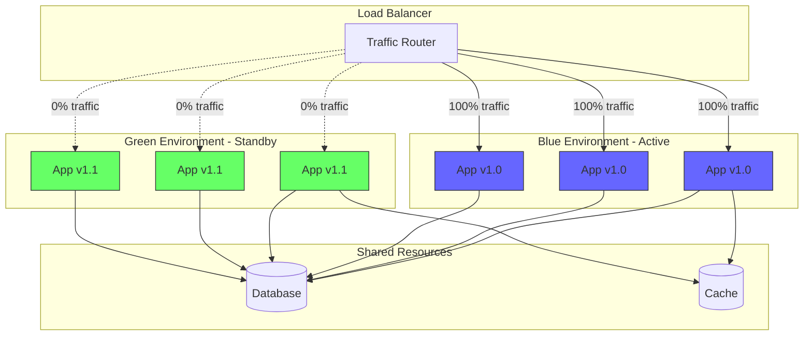
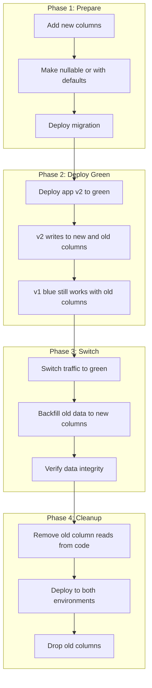

# How to Handle Blue-Green Deployments

Author: [nawazdhandala](https://www.github.com/nawazdhandala)

Tags: Blue-Green Deployment, Kubernetes, DevOps, Zero Downtime, CI/CD, Deployment Strategy, High Availability

Description: A complete guide to implementing blue-green deployments for zero-downtime releases, covering infrastructure setup, traffic switching, rollback procedures, and best practices.

---

Blue-green deployment is a release strategy that reduces downtime and risk by running two identical production environments. One environment (blue) serves live traffic while the other (green) is idle or running the new version. When the new version is ready, traffic switches from blue to green. This guide covers implementing blue-green deployments effectively.

## Understanding Blue-Green Architecture

The blue-green pattern maintains two identical environments that you switch between during deployments.



## Kubernetes Blue-Green Implementation

Implement blue-green deployments in Kubernetes using separate deployments and service switching.

```yaml
# blue-deployment.yaml - Blue environment deployment
apiVersion: apps/v1
kind: Deployment
metadata:
  name: myapp-blue
  labels:
    app: myapp
    version: blue
spec:
  replicas: 3
  selector:
    matchLabels:
      app: myapp
      version: blue
  template:
    metadata:
      labels:
        app: myapp
        version: blue
    spec:
      containers:
      - name: myapp
        image: myapp:1.0.0
        ports:
        - containerPort: 8080
        resources:
          requests:
            memory: "256Mi"
            cpu: "250m"
          limits:
            memory: "512Mi"
            cpu: "500m"
        readinessProbe:
          httpGet:
            path: /health
            port: 8080
          initialDelaySeconds: 10
          periodSeconds: 5
        livenessProbe:
          httpGet:
            path: /health
            port: 8080
          initialDelaySeconds: 15
          periodSeconds: 10
        env:
        - name: DEPLOYMENT_COLOR
          value: "blue"
        - name: APP_VERSION
          value: "1.0.0"
---
# green-deployment.yaml - Green environment deployment
apiVersion: apps/v1
kind: Deployment
metadata:
  name: myapp-green
  labels:
    app: myapp
    version: green
spec:
  replicas: 3
  selector:
    matchLabels:
      app: myapp
      version: green
  template:
    metadata:
      labels:
        app: myapp
        version: green
    spec:
      containers:
      - name: myapp
        image: myapp:1.1.0
        ports:
        - containerPort: 8080
        resources:
          requests:
            memory: "256Mi"
            cpu: "250m"
          limits:
            memory: "512Mi"
            cpu: "500m"
        readinessProbe:
          httpGet:
            path: /health
            port: 8080
          initialDelaySeconds: 10
          periodSeconds: 5
        livenessProbe:
          httpGet:
            path: /health
            port: 8080
          initialDelaySeconds: 15
          periodSeconds: 10
        env:
        - name: DEPLOYMENT_COLOR
          value: "green"
        - name: APP_VERSION
          value: "1.1.0"
---
# service.yaml - Service that switches between blue and green
apiVersion: v1
kind: Service
metadata:
  name: myapp
  labels:
    app: myapp
spec:
  type: ClusterIP
  ports:
  - port: 80
    targetPort: 8080
    protocol: TCP
  # Selector determines which deployment receives traffic
  # Change 'version: blue' to 'version: green' to switch
  selector:
    app: myapp
    version: blue
```

## Deployment Automation Script

Automate the blue-green deployment process with proper validation.

```python
#!/usr/bin/env python3
# blue_green_deploy.py - Automated blue-green deployment controller

import subprocess
import time
import json
import logging
import sys
from dataclasses import dataclass
from typing import Optional, List
from enum import Enum

logging.basicConfig(level=logging.INFO)
logger = logging.getLogger(__name__)

class DeploymentColor(Enum):
    BLUE = "blue"
    GREEN = "green"


@dataclass
class DeploymentStatus:
    """Status of a deployment."""
    name: str
    color: DeploymentColor
    replicas: int
    ready_replicas: int
    image: str
    is_healthy: bool


class BlueGreenDeployer:
    """
    Manages blue-green deployments in Kubernetes.

    Features:
    - Automatic color detection
    - Health validation before switching
    - Rollback support
    - Traffic verification
    """

    def __init__(
        self,
        app_name: str,
        namespace: str = "default",
        health_check_retries: int = 30,
        health_check_interval: int = 10
    ):
        """
        Initialize blue-green deployer.

        Args:
            app_name: Name of the application
            namespace: Kubernetes namespace
            health_check_retries: Number of health check attempts
            health_check_interval: Seconds between health checks
        """
        self.app_name = app_name
        self.namespace = namespace
        self.health_check_retries = health_check_retries
        self.health_check_interval = health_check_interval

    def _run_kubectl(self, args: List[str]) -> str:
        """Run kubectl command and return output."""
        cmd = ["kubectl", "-n", self.namespace] + args
        logger.debug(f"Running: {' '.join(cmd)}")

        result = subprocess.run(
            cmd,
            capture_output=True,
            text=True,
            check=True
        )
        return result.stdout

    def get_active_color(self) -> DeploymentColor:
        """Get the currently active deployment color."""
        try:
            output = self._run_kubectl([
                "get", "service", self.app_name,
                "-o", "jsonpath={.spec.selector.version}"
            ])
            return DeploymentColor(output.strip())
        except subprocess.CalledProcessError:
            logger.warning("Could not determine active color, defaulting to blue")
            return DeploymentColor.BLUE

    def get_inactive_color(self) -> DeploymentColor:
        """Get the inactive deployment color."""
        active = self.get_active_color()
        return (DeploymentColor.GREEN
                if active == DeploymentColor.BLUE
                else DeploymentColor.BLUE)

    def get_deployment_status(self, color: DeploymentColor) -> DeploymentStatus:
        """Get status of a specific deployment."""
        deployment_name = f"{self.app_name}-{color.value}"

        output = self._run_kubectl([
            "get", "deployment", deployment_name,
            "-o", "json"
        ])

        data = json.loads(output)
        spec = data.get("spec", {})
        status = data.get("status", {})

        containers = spec.get("template", {}).get("spec", {}).get("containers", [])
        image = containers[0].get("image", "unknown") if containers else "unknown"

        replicas = spec.get("replicas", 0)
        ready_replicas = status.get("readyReplicas", 0)

        return DeploymentStatus(
            name=deployment_name,
            color=color,
            replicas=replicas,
            ready_replicas=ready_replicas,
            image=image,
            is_healthy=replicas == ready_replicas and ready_replicas > 0
        )

    def deploy_to_inactive(self, new_image: str) -> bool:
        """
        Deploy new image to inactive environment.

        Args:
            new_image: Docker image to deploy

        Returns:
            True if deployment successful
        """
        inactive = self.get_inactive_color()
        deployment_name = f"{self.app_name}-{inactive.value}"

        logger.info(f"Deploying {new_image} to {inactive.value} environment")

        try:
            # Update the deployment image
            self._run_kubectl([
                "set", "image",
                f"deployment/{deployment_name}",
                f"{self.app_name}={new_image}"
            ])

            # Wait for rollout
            logger.info("Waiting for rollout to complete...")
            self._run_kubectl([
                "rollout", "status",
                f"deployment/{deployment_name}",
                "--timeout=300s"
            ])

            return True

        except subprocess.CalledProcessError as e:
            logger.error(f"Deployment failed: {e}")
            return False

    def validate_deployment(self, color: DeploymentColor) -> bool:
        """
        Validate that deployment is healthy.

        Args:
            color: Deployment color to validate

        Returns:
            True if all health checks pass
        """
        logger.info(f"Validating {color.value} deployment...")

        for attempt in range(self.health_check_retries):
            status = self.get_deployment_status(color)

            if status.is_healthy:
                logger.info(
                    f"Deployment healthy: {status.ready_replicas}/{status.replicas} replicas ready"
                )
                return True

            logger.info(
                f"Attempt {attempt + 1}/{self.health_check_retries}: "
                f"{status.ready_replicas}/{status.replicas} replicas ready"
            )
            time.sleep(self.health_check_interval)

        logger.error("Deployment validation failed - not enough healthy replicas")
        return False

    def switch_traffic(self, target_color: DeploymentColor) -> bool:
        """
        Switch traffic to target deployment.

        Args:
            target_color: Color to switch traffic to

        Returns:
            True if switch successful
        """
        logger.info(f"Switching traffic to {target_color.value} environment")

        try:
            # Patch the service selector
            patch = json.dumps({
                "spec": {
                    "selector": {
                        "app": self.app_name,
                        "version": target_color.value
                    }
                }
            })

            self._run_kubectl([
                "patch", "service", self.app_name,
                "-p", patch
            ])

            logger.info(f"Traffic switched to {target_color.value}")
            return True

        except subprocess.CalledProcessError as e:
            logger.error(f"Traffic switch failed: {e}")
            return False

    def rollback(self) -> bool:
        """
        Rollback to previous deployment.

        Returns:
            True if rollback successful
        """
        # Switch back to the other color
        current = self.get_active_color()
        previous = (DeploymentColor.GREEN
                   if current == DeploymentColor.BLUE
                   else DeploymentColor.BLUE)

        logger.warning(f"Rolling back from {current.value} to {previous.value}")

        # Validate previous deployment is still healthy
        if not self.validate_deployment(previous):
            logger.error("Previous deployment is not healthy, cannot rollback")
            return False

        return self.switch_traffic(previous)

    def deploy(self, new_image: str, auto_rollback: bool = True) -> bool:
        """
        Execute full blue-green deployment.

        Args:
            new_image: Docker image to deploy
            auto_rollback: Whether to auto-rollback on failure

        Returns:
            True if deployment successful
        """
        active = self.get_active_color()
        inactive = self.get_inactive_color()

        logger.info(f"Starting blue-green deployment")
        logger.info(f"Active: {active.value}, Deploying to: {inactive.value}")

        # Step 1: Deploy to inactive environment
        if not self.deploy_to_inactive(new_image):
            logger.error("Failed to deploy to inactive environment")
            return False

        # Step 2: Validate new deployment
        if not self.validate_deployment(inactive):
            logger.error("New deployment failed validation")
            return False

        # Step 3: Switch traffic
        if not self.switch_traffic(inactive):
            logger.error("Failed to switch traffic")
            if auto_rollback:
                self.rollback()
            return False

        # Step 4: Verify traffic is flowing correctly
        logger.info("Deployment complete. Monitoring for issues...")
        time.sleep(30)  # Brief monitoring period

        # Check if new deployment is still healthy
        if not self.validate_deployment(inactive):
            logger.error("Post-switch health check failed")
            if auto_rollback:
                logger.info("Auto-rolling back...")
                self.rollback()
            return False

        logger.info("Blue-green deployment completed successfully")
        return True

    def print_status(self) -> None:
        """Print current deployment status."""
        active = self.get_active_color()

        print(f"\n{'='*50}")
        print(f"Blue-Green Deployment Status: {self.app_name}")
        print(f"{'='*50}")

        for color in DeploymentColor:
            status = self.get_deployment_status(color)
            is_active = "ACTIVE" if color == active else "STANDBY"
            health = "HEALTHY" if status.is_healthy else "UNHEALTHY"

            print(f"\n{color.value.upper()} [{is_active}] [{health}]")
            print(f"  Image: {status.image}")
            print(f"  Replicas: {status.ready_replicas}/{status.replicas}")

        print(f"\n{'='*50}\n")


def main():
    """Main entry point."""
    import argparse

    parser = argparse.ArgumentParser(description="Blue-Green Deployment Controller")
    parser.add_argument("--app", required=True, help="Application name")
    parser.add_argument("--namespace", default="default", help="Kubernetes namespace")
    parser.add_argument("--image", help="New image to deploy")
    parser.add_argument("--rollback", action="store_true", help="Rollback to previous version")
    parser.add_argument("--status", action="store_true", help="Show current status")
    parser.add_argument("--switch", help="Switch traffic to color (blue/green)")

    args = parser.parse_args()

    deployer = BlueGreenDeployer(args.app, args.namespace)

    if args.status:
        deployer.print_status()
    elif args.rollback:
        success = deployer.rollback()
        sys.exit(0 if success else 1)
    elif args.switch:
        color = DeploymentColor(args.switch)
        success = deployer.switch_traffic(color)
        sys.exit(0 if success else 1)
    elif args.image:
        success = deployer.deploy(args.image)
        sys.exit(0 if success else 1)
    else:
        parser.print_help()


if __name__ == "__main__":
    main()
```

## Database Migration Strategy

Database changes require special handling in blue-green deployments since both environments share the same database.



Implement expand-contract migrations for safe database changes.

```python
# database_migration.py - Blue-green compatible database migrations
import logging
from typing import List
from dataclasses import dataclass
from enum import Enum

logger = logging.getLogger(__name__)

class MigrationPhase(Enum):
    """Phases of an expand-contract migration."""
    EXPAND = "expand"      # Add new structures
    MIGRATE = "migrate"    # Copy/transform data
    CONTRACT = "contract"  # Remove old structures


@dataclass
class MigrationStep:
    """A single migration step."""
    name: str
    phase: MigrationPhase
    up_sql: str
    down_sql: str
    requires_downtime: bool = False


class BlueGreenMigration:
    """
    Manages database migrations compatible with blue-green deployments.

    Uses expand-contract pattern:
    1. EXPAND: Add new columns/tables (backward compatible)
    2. MIGRATE: Copy data to new structures
    3. CONTRACT: Remove old columns/tables (after all apps updated)
    """

    def __init__(self, db_connection):
        """
        Initialize migration manager.

        Args:
            db_connection: Database connection
        """
        self._db = db_connection
        self._migrations: List[MigrationStep] = []

    def add_step(self, step: MigrationStep) -> None:
        """Add a migration step."""
        self._migrations.append(step)

    def execute_phase(self, phase: MigrationPhase) -> bool:
        """
        Execute all steps for a specific phase.

        Args:
            phase: Migration phase to execute

        Returns:
            True if successful
        """
        steps = [m for m in self._migrations if m.phase == phase]

        logger.info(f"Executing {phase.value} phase with {len(steps)} steps")

        for step in steps:
            if step.requires_downtime:
                logger.warning(
                    f"Step '{step.name}' requires downtime - "
                    "ensure traffic is stopped"
                )

            try:
                logger.info(f"Running: {step.name}")
                cursor = self._db.cursor()
                cursor.execute(step.up_sql)
                self._db.commit()
                logger.info(f"Completed: {step.name}")
            except Exception as e:
                logger.error(f"Failed: {step.name} - {e}")
                self._db.rollback()
                return False

        return True

    def rollback_phase(self, phase: MigrationPhase) -> bool:
        """
        Rollback all steps for a specific phase.

        Args:
            phase: Migration phase to rollback

        Returns:
            True if successful
        """
        steps = [m for m in self._migrations if m.phase == phase]
        steps.reverse()  # Rollback in reverse order

        logger.info(f"Rolling back {phase.value} phase")

        for step in steps:
            try:
                logger.info(f"Rolling back: {step.name}")
                cursor = self._db.cursor()
                cursor.execute(step.down_sql)
                self._db.commit()
            except Exception as e:
                logger.error(f"Rollback failed: {step.name} - {e}")
                return False

        return True


# Example: Adding a new column to users table
def create_user_email_migration() -> BlueGreenMigration:
    """
    Example migration: Add normalized_email column to users.

    This demonstrates the expand-contract pattern for a
    blue-green compatible schema change.
    """
    migration = BlueGreenMigration(None)  # Pass actual connection

    # Phase 1: EXPAND - Add new column (nullable for backward compatibility)
    migration.add_step(MigrationStep(
        name="add_normalized_email_column",
        phase=MigrationPhase.EXPAND,
        up_sql="""
            ALTER TABLE users
            ADD COLUMN normalized_email VARCHAR(255) NULL;

            CREATE INDEX idx_users_normalized_email
            ON users(normalized_email);
        """,
        down_sql="""
            DROP INDEX idx_users_normalized_email ON users;
            ALTER TABLE users DROP COLUMN normalized_email;
        """,
        requires_downtime=False
    ))

    # Phase 2: MIGRATE - Backfill data
    migration.add_step(MigrationStep(
        name="backfill_normalized_email",
        phase=MigrationPhase.MIGRATE,
        up_sql="""
            UPDATE users
            SET normalized_email = LOWER(TRIM(email))
            WHERE normalized_email IS NULL;
        """,
        down_sql="""
            -- No rollback needed for data backfill
            SELECT 1;
        """,
        requires_downtime=False
    ))

    # Phase 3: CONTRACT - Make column required
    migration.add_step(MigrationStep(
        name="make_normalized_email_required",
        phase=MigrationPhase.CONTRACT,
        up_sql="""
            ALTER TABLE users
            MODIFY normalized_email VARCHAR(255) NOT NULL;
        """,
        down_sql="""
            ALTER TABLE users
            MODIFY normalized_email VARCHAR(255) NULL;
        """,
        requires_downtime=False
    ))

    return migration
```

## Traffic Verification

Verify that traffic is flowing correctly after switching.

```python
# traffic_verification.py - Verify traffic routing after blue-green switch
import requests
import time
import logging
from dataclasses import dataclass
from typing import List, Optional
from concurrent.futures import ThreadPoolExecutor, as_completed
import statistics

logger = logging.getLogger(__name__)

@dataclass
class TrafficCheckResult:
    """Result of a traffic verification check."""
    endpoint: str
    success: bool
    response_time_ms: float
    status_code: int
    version_header: Optional[str]
    error: Optional[str] = None


class TrafficVerifier:
    """
    Verifies traffic routing after blue-green deployment switch.

    Checks:
    - Endpoint availability
    - Response times
    - Version headers
    - Error rates
    """

    def __init__(
        self,
        base_url: str,
        expected_version: str,
        version_header: str = "X-App-Version"
    ):
        """
        Initialize traffic verifier.

        Args:
            base_url: Base URL of the service
            expected_version: Expected version after switch
            version_header: Header containing version info
        """
        self.base_url = base_url.rstrip('/')
        self.expected_version = expected_version
        self.version_header = version_header

    def check_endpoint(
        self,
        path: str,
        method: str = "GET",
        timeout: float = 5.0
    ) -> TrafficCheckResult:
        """
        Check a single endpoint.

        Args:
            path: URL path to check
            method: HTTP method
            timeout: Request timeout

        Returns:
            TrafficCheckResult
        """
        url = f"{self.base_url}{path}"
        start_time = time.time()

        try:
            response = requests.request(
                method=method,
                url=url,
                timeout=timeout
            )

            response_time = (time.time() - start_time) * 1000
            version = response.headers.get(self.version_header)

            return TrafficCheckResult(
                endpoint=path,
                success=response.status_code < 500,
                response_time_ms=response_time,
                status_code=response.status_code,
                version_header=version
            )

        except requests.RequestException as e:
            return TrafficCheckResult(
                endpoint=path,
                success=False,
                response_time_ms=-1,
                status_code=0,
                version_header=None,
                error=str(e)
            )

    def verify_traffic(
        self,
        endpoints: List[str],
        num_requests: int = 10,
        concurrency: int = 5
    ) -> dict:
        """
        Verify traffic is routing correctly.

        Args:
            endpoints: List of endpoints to check
            num_requests: Number of requests per endpoint
            concurrency: Concurrent requests

        Returns:
            Verification results
        """
        all_results: List[TrafficCheckResult] = []

        with ThreadPoolExecutor(max_workers=concurrency) as executor:
            futures = []

            for endpoint in endpoints:
                for _ in range(num_requests):
                    futures.append(
                        executor.submit(self.check_endpoint, endpoint)
                    )

            for future in as_completed(futures):
                result = future.result()
                all_results.append(result)

        # Analyze results
        total_requests = len(all_results)
        successful = [r for r in all_results if r.success]
        failed = [r for r in all_results if not r.success]

        error_rate = len(failed) / total_requests if total_requests > 0 else 0
        response_times = [r.response_time_ms for r in successful if r.response_time_ms > 0]
        avg_response_time = statistics.mean(response_times) if response_times else 0

        return {
            "healthy": error_rate <= 0.05,
            "total_requests": total_requests,
            "successful_requests": len(successful),
            "failed_requests": len(failed),
            "error_rate": error_rate,
            "avg_response_time_ms": round(avg_response_time, 2)
        }
```

## CI/CD Pipeline Integration

Integrate blue-green deployment into your CI/CD pipeline.

```yaml
# .github/workflows/blue-green-deploy.yml
name: Blue-Green Deployment

on:
  push:
    branches: [main]
  workflow_dispatch:
    inputs:
      rollback:
        description: 'Rollback to previous version'
        required: false
        default: 'false'

env:
  APP_NAME: myapp
  NAMESPACE: production
  REGISTRY: gcr.io/myproject

jobs:
  build:
    runs-on: ubuntu-latest
    outputs:
      image_tag: ${{ steps.build.outputs.tag }}
    steps:
      - uses: actions/checkout@v4

      - name: Set up Docker Buildx
        uses: docker/setup-buildx-action@v3

      - name: Build and push
        id: build
        run: |
          TAG="${{ env.REGISTRY }}/${{ env.APP_NAME }}:${{ github.sha }}"
          docker build -t $TAG .
          docker push $TAG
          echo "tag=$TAG" >> $GITHUB_OUTPUT

  deploy:
    needs: build
    runs-on: ubuntu-latest
    environment: production
    steps:
      - uses: actions/checkout@v4

      - name: Setup kubectl
        uses: azure/setup-kubectl@v3

      - name: Deploy
        run: |
          python scripts/blue_green_deploy.py \
            --app ${{ env.APP_NAME }} \
            --namespace ${{ env.NAMESPACE }} \
            --image ${{ needs.build.outputs.image_tag }}
```

## Best Practices

1. **Keep environments identical** - Blue and green should have the same infrastructure, configuration, and resources.

2. **Use health checks** - Validate the new deployment before switching traffic.

3. **Implement proper monitoring** - Track error rates and response times during and after the switch.

4. **Plan for database compatibility** - Use expand-contract migrations for schema changes.

5. **Automate rollback** - Have automated rollback triggers based on health metrics.

6. **Test the rollback process** - Regularly test that rollback works correctly.

7. **Maintain standby readiness** - Keep the standby environment warm to reduce switch time.

8. **Document the process** - Ensure team members understand the deployment process and rollback procedures.

Blue-green deployments provide a reliable way to achieve zero-downtime releases with quick rollback capability.
