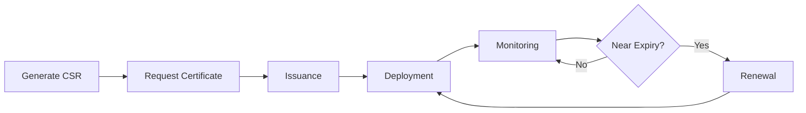
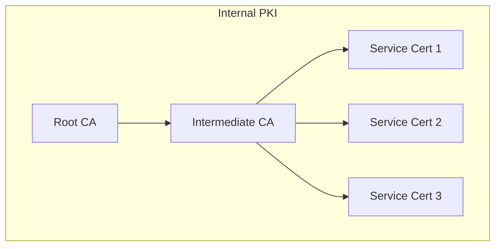
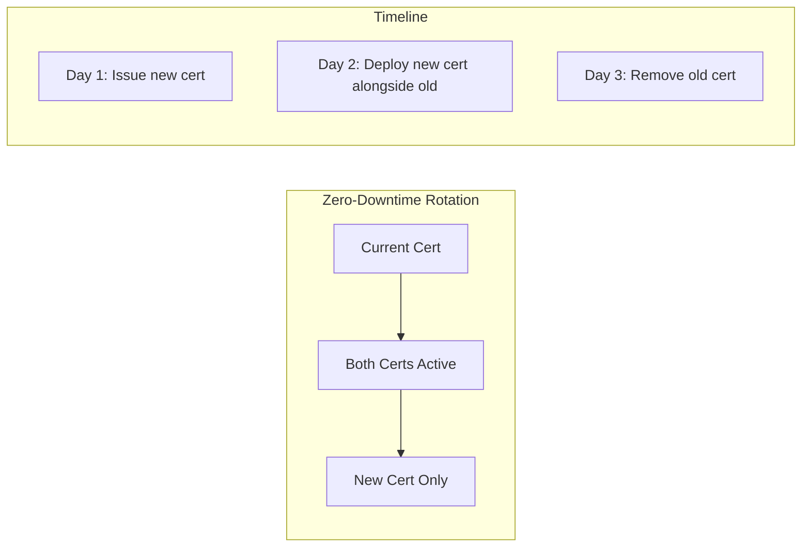

# How to Handle Certificate Management

Author: [nawazdhandala](https://www.github.com/nawazdhandala)

Tags: Security, TLS, SSL, Certificates, DevOps, Kubernetes, Infrastructure, Automation

Description: A practical guide to managing TLS certificates across your infrastructure, from automated issuance to monitoring and rotation.

---

Certificate management is one of those things that seems simple until your production site goes down at 3 AM because a cert expired. Manual certificate management does not scale. Let's build a system that handles certificates automatically.

## Certificate Lifecycle



Every certificate goes through this lifecycle. The goal is to automate each step.

## Automated Certificate Issuance with Let's Encrypt

### Using Certbot for Traditional Servers

```bash
#!/bin/bash
# Install certbot
apt-get update
apt-get install -y certbot

# Issue certificate with automatic renewal
certbot certonly \
  --standalone \
  --non-interactive \
  --agree-tos \
  --email admin@example.com \
  -d example.com \
  -d www.example.com

# Set up automatic renewal (runs twice daily)
echo "0 0,12 * * * root certbot renew --quiet" >> /etc/crontab
```

### Using Certbot with Nginx

```bash
#!/bin/bash
# Install certbot with nginx plugin
apt-get install -y certbot python3-certbot-nginx

# Issue certificate and automatically configure nginx
certbot --nginx \
  --non-interactive \
  --agree-tos \
  --email admin@example.com \
  -d example.com \
  -d www.example.com \
  --redirect  # Force HTTPS

# Verify renewal works
certbot renew --dry-run
```

### DNS Challenge for Wildcard Certificates

```bash
#!/bin/bash
# For wildcard certs, you need DNS challenge
# Example with Cloudflare DNS

# Install Cloudflare plugin
apt-get install -y python3-certbot-dns-cloudflare

# Create credentials file
cat > /etc/letsencrypt/cloudflare.ini << EOF
dns_cloudflare_api_token = your-api-token-here
EOF
chmod 600 /etc/letsencrypt/cloudflare.ini

# Issue wildcard certificate
certbot certonly \
  --dns-cloudflare \
  --dns-cloudflare-credentials /etc/letsencrypt/cloudflare.ini \
  -d example.com \
  -d "*.example.com" \
  --non-interactive \
  --agree-tos \
  --email admin@example.com
```

## Kubernetes Certificate Management with cert-manager

cert-manager is the standard for Kubernetes certificate automation.

### Install cert-manager

```bash
# Install cert-manager
kubectl apply -f https://github.com/cert-manager/cert-manager/releases/download/v1.14.0/cert-manager.yaml

# Wait for it to be ready
kubectl wait --for=condition=available --timeout=300s deployment/cert-manager -n cert-manager
kubectl wait --for=condition=available --timeout=300s deployment/cert-manager-webhook -n cert-manager
```

### Configure Let's Encrypt Issuers

```yaml
# cluster-issuers.yaml
apiVersion: cert-manager.io/v1
kind: ClusterIssuer
metadata:
  name: letsencrypt-staging
spec:
  acme:
    server: https://acme-staging-v02.api.letsencrypt.org/directory
    email: admin@example.com
    privateKeySecretRef:
      name: letsencrypt-staging-key
    solvers:
      - http01:
          ingress:
            class: nginx
---
apiVersion: cert-manager.io/v1
kind: ClusterIssuer
metadata:
  name: letsencrypt-production
spec:
  acme:
    server: https://acme-v02.api.letsencrypt.org/directory
    email: admin@example.com
    privateKeySecretRef:
      name: letsencrypt-production-key
    solvers:
      - http01:
          ingress:
            class: nginx
```

### Request Certificates via Ingress Annotations

```yaml
# ingress.yaml - Automatic certificate provisioning
apiVersion: networking.k8s.io/v1
kind: Ingress
metadata:
  name: my-app
  annotations:
    cert-manager.io/cluster-issuer: letsencrypt-production
spec:
  tls:
    - hosts:
        - app.example.com
        - api.example.com
      secretName: my-app-tls  # cert-manager creates this
  rules:
    - host: app.example.com
      http:
        paths:
          - path: /
            pathType: Prefix
            backend:
              service:
                name: frontend
                port:
                  number: 80
    - host: api.example.com
      http:
        paths:
          - path: /
            pathType: Prefix
            backend:
              service:
                name: api
                port:
                  number: 80
```

### DNS Challenge for Wildcard Certificates in Kubernetes

```yaml
# cluster-issuer-dns.yaml
apiVersion: cert-manager.io/v1
kind: ClusterIssuer
metadata:
  name: letsencrypt-dns
spec:
  acme:
    server: https://acme-v02.api.letsencrypt.org/directory
    email: admin@example.com
    privateKeySecretRef:
      name: letsencrypt-dns-key
    solvers:
      - dns01:
          cloudflare:
            apiTokenSecretRef:
              name: cloudflare-api-token
              key: api-token
---
# Create the secret for Cloudflare API token
apiVersion: v1
kind: Secret
metadata:
  name: cloudflare-api-token
  namespace: cert-manager
type: Opaque
stringData:
  api-token: your-cloudflare-api-token
---
# Request wildcard certificate
apiVersion: cert-manager.io/v1
kind: Certificate
metadata:
  name: wildcard-example-com
  namespace: default
spec:
  secretName: wildcard-example-com-tls
  issuerRef:
    name: letsencrypt-dns
    kind: ClusterIssuer
  commonName: "*.example.com"
  dnsNames:
    - "example.com"
    - "*.example.com"
```

## Internal PKI for Service-to-Service Communication

For internal services, use a private CA instead of public certificates.



### Create Internal CA with OpenSSL

```bash
#!/bin/bash
# Create directory structure
mkdir -p /etc/pki/{root-ca,intermediate-ca,certs}
cd /etc/pki

# Generate Root CA private key
openssl genrsa -aes256 -out root-ca/root-ca.key 4096

# Generate Root CA certificate (valid for 10 years)
openssl req -x509 -new -nodes \
  -key root-ca/root-ca.key \
  -sha256 \
  -days 3650 \
  -out root-ca/root-ca.crt \
  -subj "/C=US/ST=State/L=City/O=Company/OU=IT/CN=Internal Root CA"

# Generate Intermediate CA private key
openssl genrsa -out intermediate-ca/intermediate-ca.key 4096

# Generate Intermediate CA CSR
openssl req -new \
  -key intermediate-ca/intermediate-ca.key \
  -out intermediate-ca/intermediate-ca.csr \
  -subj "/C=US/ST=State/L=City/O=Company/OU=IT/CN=Internal Intermediate CA"

# Sign Intermediate CA with Root CA
openssl x509 -req \
  -in intermediate-ca/intermediate-ca.csr \
  -CA root-ca/root-ca.crt \
  -CAkey root-ca/root-ca.key \
  -CAcreateserial \
  -out intermediate-ca/intermediate-ca.crt \
  -days 1825 \
  -sha256 \
  -extfile <(echo "basicConstraints=critical,CA:true,pathlen:0
keyUsage=critical,keyCertSign,cRLSign")

# Create certificate chain
cat intermediate-ca/intermediate-ca.crt root-ca/root-ca.crt > intermediate-ca/chain.crt
```

### Issue Service Certificates

```bash
#!/bin/bash
# Script to issue service certificates
SERVICE_NAME=$1
SERVICE_DOMAIN=$2

cd /etc/pki/certs

# Generate service private key
openssl genrsa -out ${SERVICE_NAME}.key 2048

# Create config for SAN (Subject Alternative Names)
cat > ${SERVICE_NAME}.cnf << EOF
[req]
default_bits = 2048
prompt = no
default_md = sha256
distinguished_name = dn
req_extensions = req_ext

[dn]
CN = ${SERVICE_DOMAIN}

[req_ext]
subjectAltName = @alt_names

[alt_names]
DNS.1 = ${SERVICE_DOMAIN}
DNS.2 = ${SERVICE_NAME}.svc.cluster.local
DNS.3 = ${SERVICE_NAME}
EOF

# Generate CSR
openssl req -new \
  -key ${SERVICE_NAME}.key \
  -out ${SERVICE_NAME}.csr \
  -config ${SERVICE_NAME}.cnf

# Sign with Intermediate CA
openssl x509 -req \
  -in ${SERVICE_NAME}.csr \
  -CA ../intermediate-ca/intermediate-ca.crt \
  -CAkey ../intermediate-ca/intermediate-ca.key \
  -CAcreateserial \
  -out ${SERVICE_NAME}.crt \
  -days 365 \
  -sha256 \
  -extfile ${SERVICE_NAME}.cnf \
  -extensions req_ext

echo "Certificate issued: ${SERVICE_NAME}.crt"
```

## Certificate Monitoring

Never be surprised by an expiring certificate again.

### Prometheus Monitoring with blackbox_exporter

```yaml
# prometheus.yml
scrape_configs:
  - job_name: 'ssl-certificates'
    metrics_path: /probe
    params:
      module: [http_2xx]
    static_configs:
      - targets:
          - https://example.com
          - https://api.example.com
          - https://app.example.com
    relabel_configs:
      - source_labels: [__address__]
        target_label: __param_target
      - source_labels: [__param_target]
        target_label: instance
      - target_label: __address__
        replacement: blackbox-exporter:9115
```

### Alert on Expiring Certificates

```yaml
# alert-rules.yml
groups:
  - name: ssl-certificates
    rules:
      - alert: SSLCertificateExpiringSoon
        expr: probe_ssl_earliest_cert_expiry - time() < 86400 * 30
        for: 1h
        labels:
          severity: warning
        annotations:
          summary: "SSL certificate expiring soon"
          description: "Certificate for {{ $labels.instance }} expires in {{ $value | humanizeDuration }}"

      - alert: SSLCertificateExpiryCritical
        expr: probe_ssl_earliest_cert_expiry - time() < 86400 * 7
        for: 1h
        labels:
          severity: critical
        annotations:
          summary: "SSL certificate expiring very soon"
          description: "Certificate for {{ $labels.instance }} expires in {{ $value | humanizeDuration }}"

      - alert: SSLCertificateExpired
        expr: probe_ssl_earliest_cert_expiry - time() < 0
        for: 1m
        labels:
          severity: critical
        annotations:
          summary: "SSL certificate has expired"
          description: "Certificate for {{ $labels.instance }} has expired"
```

### Simple Certificate Check Script

```python
#!/usr/bin/env python3
# check_certificates.py - Check certificate expiry dates
import ssl
import socket
from datetime import datetime
import sys

def check_certificate(hostname, port=443):
    """Check certificate expiry for a hostname"""
    context = ssl.create_default_context()

    try:
        with socket.create_connection((hostname, port), timeout=10) as sock:
            with context.wrap_socket(sock, server_hostname=hostname) as ssock:
                cert = ssock.getpeercert()

                # Parse expiry date
                expiry_str = cert['notAfter']
                expiry_date = datetime.strptime(expiry_str, '%b %d %H:%M:%S %Y %Z')

                days_until_expiry = (expiry_date - datetime.now()).days

                return {
                    'hostname': hostname,
                    'expiry_date': expiry_date.isoformat(),
                    'days_until_expiry': days_until_expiry,
                    'issuer': dict(x[0] for x in cert['issuer']),
                    'subject': dict(x[0] for x in cert['subject'])
                }

    except Exception as e:
        return {
            'hostname': hostname,
            'error': str(e)
        }

def main():
    domains = [
        'example.com',
        'api.example.com',
        'app.example.com'
    ]

    warning_threshold = 30
    critical_threshold = 7
    exit_code = 0

    for domain in domains:
        result = check_certificate(domain)

        if 'error' in result:
            print(f"ERROR: {domain} - {result['error']}")
            exit_code = 2
            continue

        days = result['days_until_expiry']

        if days < 0:
            print(f"EXPIRED: {domain} - Certificate expired {abs(days)} days ago")
            exit_code = 2
        elif days < critical_threshold:
            print(f"CRITICAL: {domain} - Certificate expires in {days} days")
            exit_code = 2
        elif days < warning_threshold:
            print(f"WARNING: {domain} - Certificate expires in {days} days")
            if exit_code == 0:
                exit_code = 1
        else:
            print(f"OK: {domain} - Certificate expires in {days} days")

    sys.exit(exit_code)

if __name__ == '__main__':
    main()
```

## Certificate Rotation Strategy



### Kubernetes Secret Rotation

```bash
#!/bin/bash
# rotate-certificate.sh - Rotate a certificate secret in Kubernetes

NAMESPACE=$1
SECRET_NAME=$2
NEW_CERT_PATH=$3
NEW_KEY_PATH=$4

# Create new secret with timestamp suffix
TIMESTAMP=$(date +%Y%m%d%H%M%S)
NEW_SECRET_NAME="${SECRET_NAME}-${TIMESTAMP}"

# Create the new secret
kubectl create secret tls ${NEW_SECRET_NAME} \
  --cert=${NEW_CERT_PATH} \
  --key=${NEW_KEY_PATH} \
  -n ${NAMESPACE}

# Update ingress to use new secret
kubectl patch ingress my-app -n ${NAMESPACE} \
  --type='json' \
  -p="[{\"op\": \"replace\", \"path\": \"/spec/tls/0/secretName\", \"value\":\"${NEW_SECRET_NAME}\"}]"

# Wait for rollout
sleep 30

# Delete old secret (keep last 2 versions)
kubectl get secrets -n ${NAMESPACE} | grep "${SECRET_NAME}-" | \
  sort -r | tail -n +3 | awk '{print $1}' | \
  xargs -I {} kubectl delete secret {} -n ${NAMESPACE}

echo "Certificate rotated successfully"
```

## Best Practices Checklist

- [ ] Automate certificate issuance with Let's Encrypt or cert-manager
- [ ] Use short-lived certificates (90 days or less)
- [ ] Set up monitoring and alerts for expiring certificates
- [ ] Automate renewal at least 30 days before expiry
- [ ] Use separate certificates for different environments
- [ ] Store private keys securely (HSM, Vault, or Kubernetes Secrets)
- [ ] Implement certificate transparency monitoring
- [ ] Document your certificate inventory
- [ ] Test renewal process regularly
- [ ] Have a runbook for emergency certificate rotation

---

Certificate management should be invisible when done right. Automate issuance, automate renewal, monitor expiry dates, and you will never have a 3 AM certificate emergency again. The tools exist - use them.
