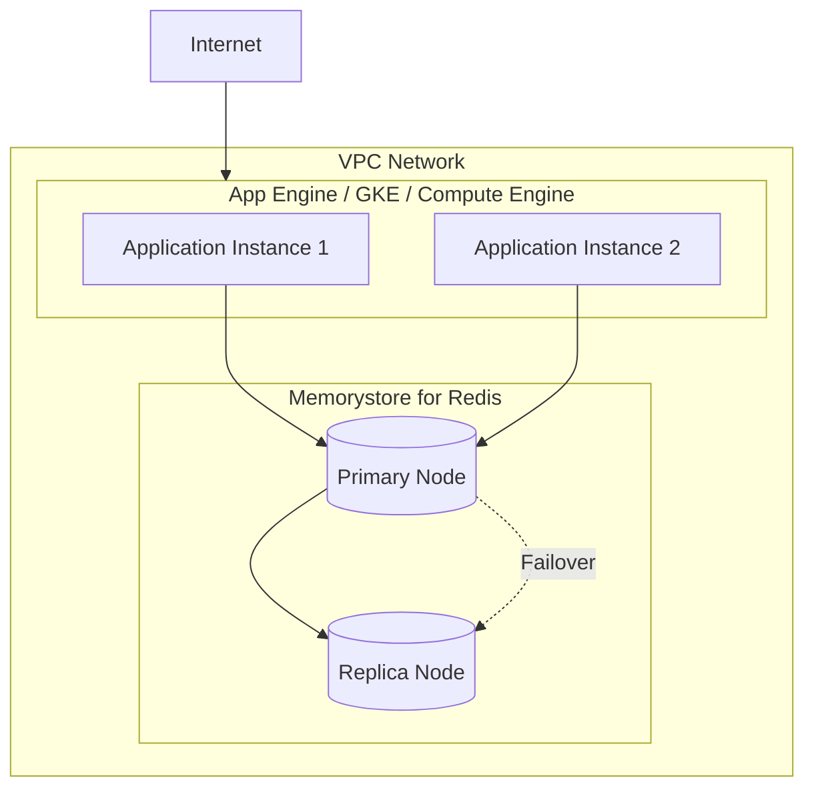

# How to Handle Cloud Memorystore

Author: [nawazdhandala](https://www.github.com/nawazdhandala)

Tags: Google Cloud, Memorystore, Redis, Caching, GCP, Performance

Description: A comprehensive guide to setting up, connecting, and managing Google Cloud Memorystore for Redis, including best practices for caching strategies and troubleshooting.

---

Google Cloud Memorystore provides fully managed Redis and Memcached instances. It handles replication, failover, and patching so you can focus on using caching effectively. This guide covers everything from initial setup to production best practices.

## Understanding Memorystore Architecture



## Creating a Memorystore Instance

### Using gcloud CLI

```bash
# Enable the Memorystore API
gcloud services enable redis.googleapis.com

# Create a basic Redis instance
gcloud redis instances create my-redis-cache \
    --size=1 \
    --region=us-central1 \
    --redis-version=redis_7_0 \
    --tier=basic

# Create a high-availability instance with replicas
gcloud redis instances create my-redis-ha \
    --size=5 \
    --region=us-central1 \
    --redis-version=redis_7_0 \
    --tier=standard \
    --replica-count=2 \
    --read-replicas-mode=read-replicas-enabled

# Get connection information
gcloud redis instances describe my-redis-cache --region=us-central1
```

### Using Terraform

```hcl
# terraform/memorystore.tf

resource "google_redis_instance" "cache" {
  name           = "app-cache"
  tier           = "STANDARD_HA"
  memory_size_gb = 5
  region         = "us-central1"

  redis_version     = "REDIS_7_0"
  display_name      = "Application Cache"

  # Network configuration
  authorized_network = google_compute_network.vpc.id
  connect_mode       = "PRIVATE_SERVICE_ACCESS"

  # Persistence configuration
  persistence_config {
    persistence_mode    = "RDB"
    rdb_snapshot_period = "TWELVE_HOURS"
  }

  # Maintenance window
  maintenance_policy {
    weekly_maintenance_window {
      day = "SUNDAY"
      start_time {
        hours   = 3
        minutes = 0
      }
    }
  }

  # Redis configuration
  redis_configs = {
    maxmemory-policy = "allkeys-lru"
    notify-keyspace-events = "Ex"
  }

  labels = {
    environment = "production"
    team        = "backend"
  }
}

# VPC peering for private access
resource "google_compute_global_address" "private_ip_range" {
  name          = "redis-private-ip"
  purpose       = "VPC_PEERING"
  address_type  = "INTERNAL"
  prefix_length = 16
  network       = google_compute_network.vpc.id
}

resource "google_service_networking_connection" "private_vpc_connection" {
  network                 = google_compute_network.vpc.id
  service                 = "servicenetworking.googleapis.com"
  reserved_peering_ranges = [google_compute_global_address.private_ip_range.name]
}

# Output connection details
output "redis_host" {
  value = google_redis_instance.cache.host
}

output "redis_port" {
  value = google_redis_instance.cache.port
}
```

## Connecting to Memorystore

Memorystore only accepts connections from within the same VPC. You cannot connect directly from the internet.

### Python Connection

```python
# requirements.txt
# redis>=4.5.0

import os
import redis
from functools import wraps
import json
import hashlib

# Get connection details from environment
REDIS_HOST = os.environ.get('REDIS_HOST', 'localhost')
REDIS_PORT = int(os.environ.get('REDIS_PORT', 6379))

# Create connection pool for better performance
pool = redis.ConnectionPool(
    host=REDIS_HOST,
    port=REDIS_PORT,
    db=0,
    decode_responses=True,
    max_connections=20,
    socket_timeout=5,
    socket_connect_timeout=5,
    retry_on_timeout=True,
    health_check_interval=30
)

def get_redis_client():
    """Get a Redis client from the connection pool."""
    return redis.Redis(connection_pool=pool)

# Cache decorator for functions
def cached(ttl_seconds=300, prefix="cache"):
    """Decorator to cache function results in Redis."""
    def decorator(func):
        @wraps(func)
        def wrapper(*args, **kwargs):
            client = get_redis_client()

            # Generate cache key from function name and arguments
            key_data = f"{func.__name__}:{args}:{sorted(kwargs.items())}"
            cache_key = f"{prefix}:{hashlib.md5(key_data.encode()).hexdigest()}"

            # Try to get from cache
            cached_result = client.get(cache_key)
            if cached_result is not None:
                return json.loads(cached_result)

            # Execute function and cache result
            result = func(*args, **kwargs)
            client.setex(cache_key, ttl_seconds, json.dumps(result))
            return result
        return wrapper
    return decorator

# Example usage
@cached(ttl_seconds=600, prefix="user")
def get_user_profile(user_id):
    """Fetch user profile from database - cached for 10 minutes."""
    # Simulate database call
    return {"id": user_id, "name": "John Doe", "email": "john@example.com"}

# Session management
class SessionManager:
    def __init__(self, session_ttl=3600):
        self.client = get_redis_client()
        self.session_ttl = session_ttl
        self.prefix = "session"

    def create_session(self, user_id, data):
        """Create a new session."""
        import uuid
        session_id = str(uuid.uuid4())
        key = f"{self.prefix}:{session_id}"

        session_data = {
            "user_id": user_id,
            "created_at": str(datetime.now()),
            **data
        }

        self.client.hset(key, mapping=session_data)
        self.client.expire(key, self.session_ttl)
        return session_id

    def get_session(self, session_id):
        """Retrieve session data."""
        key = f"{self.prefix}:{session_id}"
        data = self.client.hgetall(key)

        if data:
            # Refresh TTL on access
            self.client.expire(key, self.session_ttl)
        return data

    def destroy_session(self, session_id):
        """Delete a session."""
        key = f"{self.prefix}:{session_id}"
        self.client.delete(key)
```

### Node.js Connection

```javascript
// package.json dependencies: "ioredis": "^5.3.0"

const Redis = require('ioredis');

// Create Redis client with retry logic
const redis = new Redis({
    host: process.env.REDIS_HOST || 'localhost',
    port: parseInt(process.env.REDIS_PORT) || 6379,
    retryStrategy: (times) => {
        const delay = Math.min(times * 50, 2000);
        return delay;
    },
    maxRetriesPerRequest: 3,
    enableReadyCheck: true,
    connectTimeout: 10000,
    lazyConnect: true
});

// Handle connection events
redis.on('connect', () => {
    console.log('Connected to Memorystore');
});

redis.on('error', (err) => {
    console.error('Redis connection error:', err);
});

// Cache wrapper class
class CacheService {
    constructor(client, defaultTTL = 300) {
        this.client = client;
        this.defaultTTL = defaultTTL;
    }

    async get(key) {
        const value = await this.client.get(key);
        return value ? JSON.parse(value) : null;
    }

    async set(key, value, ttl = this.defaultTTL) {
        await this.client.setex(key, ttl, JSON.stringify(value));
    }

    async delete(key) {
        await this.client.del(key);
    }

    async getOrSet(key, fetchFunction, ttl = this.defaultTTL) {
        // Try cache first
        let value = await this.get(key);

        if (value === null) {
            // Cache miss - fetch and store
            value = await fetchFunction();
            await this.set(key, value, ttl);
        }

        return value;
    }

    // Pattern-based deletion for cache invalidation
    async deletePattern(pattern) {
        const keys = await this.client.keys(pattern);
        if (keys.length > 0) {
            await this.client.del(...keys);
        }
        return keys.length;
    }
}

// Rate limiter using Redis
class RateLimiter {
    constructor(client, windowSeconds = 60, maxRequests = 100) {
        this.client = client;
        this.windowSeconds = windowSeconds;
        this.maxRequests = maxRequests;
    }

    async isAllowed(identifier) {
        const key = `ratelimit:${identifier}`;
        const now = Date.now();
        const windowStart = now - (this.windowSeconds * 1000);

        // Use Redis transaction for atomic operations
        const pipeline = this.client.pipeline();

        // Remove old entries outside the window
        pipeline.zremrangebyscore(key, 0, windowStart);

        // Count requests in current window
        pipeline.zcard(key);

        // Add current request
        pipeline.zadd(key, now, `${now}`);

        // Set expiry on the key
        pipeline.expire(key, this.windowSeconds);

        const results = await pipeline.exec();
        const requestCount = results[1][1];

        return {
            allowed: requestCount < this.maxRequests,
            remaining: Math.max(0, this.maxRequests - requestCount - 1),
            resetAt: new Date(now + this.windowSeconds * 1000)
        };
    }
}

// Export for use in application
module.exports = {
    redis,
    CacheService: new CacheService(redis),
    RateLimiter: new RateLimiter(redis)
};
```

### Go Connection

```go
package cache

import (
    "context"
    "encoding/json"
    "fmt"
    "os"
    "time"

    "github.com/redis/go-redis/v9"
)

var client *redis.Client

func init() {
    host := os.Getenv("REDIS_HOST")
    if host == "" {
        host = "localhost"
    }

    port := os.Getenv("REDIS_PORT")
    if port == "" {
        port = "6379"
    }

    client = redis.NewClient(&redis.Options{
        Addr:         fmt.Sprintf("%s:%s", host, port),
        Password:     "", // Memorystore basic tier has no password
        DB:           0,
        DialTimeout:  5 * time.Second,
        ReadTimeout:  3 * time.Second,
        WriteTimeout: 3 * time.Second,
        PoolSize:     20,
        MinIdleConns: 5,
        PoolTimeout:  4 * time.Second,
    })
}

// GetClient returns the Redis client
func GetClient() *redis.Client {
    return client
}

// Cache provides caching operations
type Cache struct {
    client *redis.Client
    prefix string
}

// NewCache creates a new cache instance
func NewCache(prefix string) *Cache {
    return &Cache{
        client: client,
        prefix: prefix,
    }
}

// Get retrieves a value from cache
func (c *Cache) Get(ctx context.Context, key string, dest interface{}) error {
    fullKey := fmt.Sprintf("%s:%s", c.prefix, key)

    val, err := c.client.Get(ctx, fullKey).Result()
    if err == redis.Nil {
        return fmt.Errorf("cache miss for key: %s", key)
    }
    if err != nil {
        return err
    }

    return json.Unmarshal([]byte(val), dest)
}

// Set stores a value in cache
func (c *Cache) Set(ctx context.Context, key string, value interface{}, ttl time.Duration) error {
    fullKey := fmt.Sprintf("%s:%s", c.prefix, key)

    data, err := json.Marshal(value)
    if err != nil {
        return err
    }

    return c.client.Set(ctx, fullKey, data, ttl).Err()
}

// Delete removes a value from cache
func (c *Cache) Delete(ctx context.Context, key string) error {
    fullKey := fmt.Sprintf("%s:%s", c.prefix, key)
    return c.client.Del(ctx, fullKey).Err()
}
```

## Monitoring and Troubleshooting

### Key Metrics to Monitor

```bash
# View Memorystore metrics using gcloud
gcloud redis instances describe my-redis-cache \
    --region=us-central1 \
    --format="value(memorySizeGb,host,port)"

# Monitor using Cloud Monitoring
# Key metrics to track:
# - redis.googleapis.com/stats/memory/usage_ratio
# - redis.googleapis.com/stats/connected_clients
# - redis.googleapis.com/stats/evicted_keys
# - redis.googleapis.com/stats/keyspace_hits_ratio
```

### Alert Configuration

```yaml
# monitoring/redis-alerts.yaml
# Apply using Terraform or Cloud Console

displayName: Redis High Memory Usage
conditions:
  - displayName: Memory usage above 80%
    conditionThreshold:
      filter: >
        resource.type="redis_instance"
        AND metric.type="redis.googleapis.com/stats/memory/usage_ratio"
      comparison: COMPARISON_GT
      thresholdValue: 0.8
      duration: 300s
      aggregations:
        - alignmentPeriod: 60s
          perSeriesAligner: ALIGN_MEAN
notificationChannels:
  - projects/YOUR_PROJECT/notificationChannels/CHANNEL_ID
```

### Common Issues and Solutions

```bash
# Issue: Connection timeout
# Solution: Verify VPC connectivity

# Check if your compute instance can reach Redis
gcloud compute ssh your-instance --zone=us-central1-a -- \
    "nc -zv REDIS_HOST 6379"

# Issue: Too many connections
# Solution: Check connection pool settings

# View current connections via Redis INFO
redis-cli -h REDIS_HOST INFO clients

# Issue: High memory usage
# Solution: Check key distribution and TTLs

# Analyze keys (run from a connected instance)
redis-cli -h REDIS_HOST --bigkeys
redis-cli -h REDIS_HOST DBSIZE
```

## Best Practices

### Memory Management

```python
# Set appropriate maxmemory-policy in your instance config
# Options:
# - volatile-lru: Evict keys with TTL using LRU
# - allkeys-lru: Evict any key using LRU
# - volatile-ttl: Evict keys with shortest TTL
# - noeviction: Return errors when memory is full

# Always set TTLs on your keys
def cache_with_ttl(key, value, ttl_seconds=3600):
    client = get_redis_client()
    client.setex(key, ttl_seconds, json.dumps(value))
```

### Connection Handling

```python
# Use connection pooling
# Handle connection failures gracefully

from contextlib import contextmanager

@contextmanager
def redis_connection():
    """Context manager for Redis connections with error handling."""
    client = None
    try:
        client = get_redis_client()
        client.ping()  # Verify connection
        yield client
    except redis.ConnectionError as e:
        logging.error(f"Redis connection failed: {e}")
        yield None  # Return None so app can fall back to database
    except redis.TimeoutError as e:
        logging.error(f"Redis timeout: {e}")
        yield None
```

---

Cloud Memorystore removes the operational burden of managing Redis infrastructure while providing the performance benefits of in-memory caching. Focus on proper connection pooling, set appropriate TTLs, monitor memory usage, and implement graceful fallbacks when the cache is unavailable. With these practices in place, Memorystore becomes a reliable performance layer for your applications.
