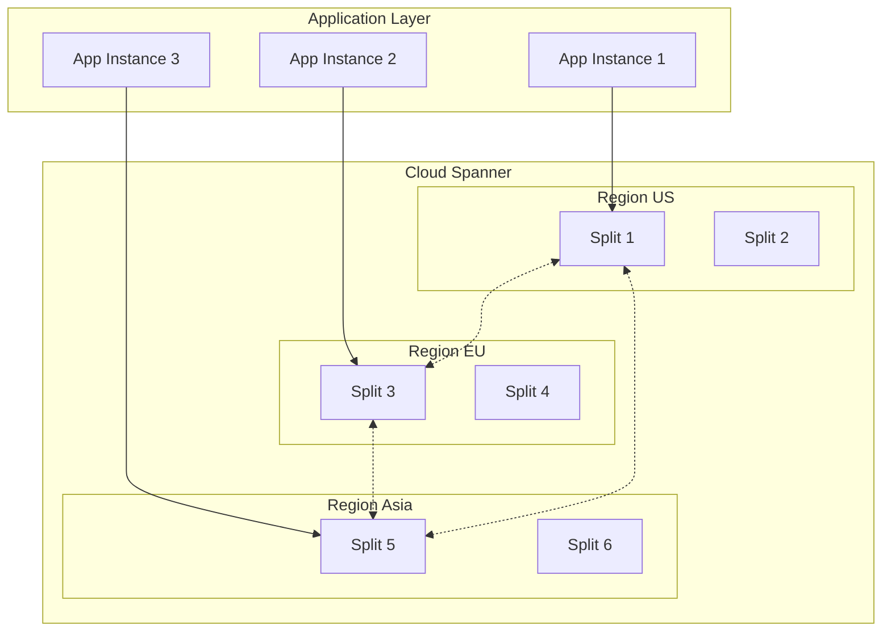
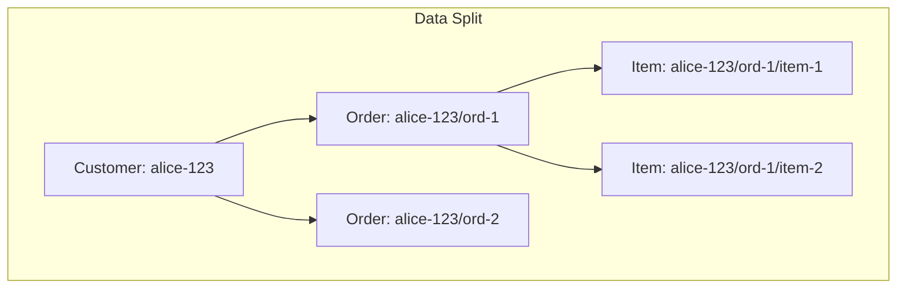

# How to Handle Cloud Spanner Database

Author: [nawazdhandala](https://www.github.com/nawazdhandala)

Tags: Cloud Spanner, Google Cloud, Database, SQL, Distributed Systems, High Availability, DevOps

Description: A practical guide to working with Google Cloud Spanner, including schema design, query optimization, and operational best practices for globally distributed databases.

---

Cloud Spanner is Google's globally distributed, strongly consistent database. It combines the familiarity of relational databases with the horizontal scalability of NoSQL. But with great power comes complexity. This guide covers everything from initial setup to production operations.

## Understanding Spanner Architecture



Spanner automatically splits your data across nodes based on primary key ranges. Understanding this helps you design better schemas.

## Setting Up Cloud Spanner

### Create an Instance

```bash
# Create a regional instance (lower cost, single region)
gcloud spanner instances create my-instance \
    --config=regional-us-central1 \
    --description="Production Database" \
    --nodes=3

# Create a multi-region instance (higher availability)
gcloud spanner instances create my-instance-global \
    --config=nam-eur-asia1 \
    --description="Global Production Database" \
    --processing-units=1000
```

### Create a Database

```bash
gcloud spanner databases create my-database \
    --instance=my-instance \
    --ddl='CREATE TABLE Users (
        UserId STRING(36) NOT NULL,
        Email STRING(255) NOT NULL,
        Name STRING(100),
        CreatedAt TIMESTAMP NOT NULL OPTIONS (allow_commit_timestamp=true),
    ) PRIMARY KEY (UserId)'
```

## Schema Design Best Practices

### Avoid Hotspots with Primary Keys

The biggest mistake with Spanner is creating hotspots. Sequential keys cause all writes to hit the same split.

```sql
-- BAD: Sequential IDs create hotspots
CREATE TABLE Orders (
    OrderId INT64 NOT NULL,  -- Auto-increment causes hotspot
    CustomerId STRING(36),
    Amount NUMERIC,
) PRIMARY KEY (OrderId);

-- GOOD: UUID distributes writes evenly
CREATE TABLE Orders (
    OrderId STRING(36) NOT NULL,  -- UUID spreads load
    CustomerId STRING(36),
    Amount NUMERIC,
) PRIMARY KEY (OrderId);

-- BETTER: Composite key with customer for locality
CREATE TABLE Orders (
    CustomerId STRING(36) NOT NULL,
    OrderId STRING(36) NOT NULL,
    Amount NUMERIC,
) PRIMARY KEY (CustomerId, OrderId);
```

### Interleaved Tables for Parent-Child Relationships

Interleaving stores child rows physically near parent rows, reducing join costs.

```sql
-- Parent table
CREATE TABLE Customers (
    CustomerId STRING(36) NOT NULL,
    Email STRING(255) NOT NULL,
    Name STRING(100),
) PRIMARY KEY (CustomerId);

-- Interleaved child table
CREATE TABLE Orders (
    CustomerId STRING(36) NOT NULL,
    OrderId STRING(36) NOT NULL,
    Amount NUMERIC,
    Status STRING(20),
) PRIMARY KEY (CustomerId, OrderId),
  INTERLEAVE IN PARENT Customers ON DELETE CASCADE;

-- Another level of interleaving
CREATE TABLE OrderItems (
    CustomerId STRING(36) NOT NULL,
    OrderId STRING(36) NOT NULL,
    ItemId STRING(36) NOT NULL,
    ProductId STRING(36),
    Quantity INT64,
) PRIMARY KEY (CustomerId, OrderId, ItemId),
  INTERLEAVE IN PARENT Orders ON DELETE CASCADE;
```



## Connecting from Applications

### Python Client

```python
# spanner_client.py
from google.cloud import spanner
from google.cloud.spanner_v1 import param_types
import uuid

# Initialize client
client = spanner.Client(project='my-project')
instance = client.instance('my-instance')
database = instance.database('my-database')

def create_customer(email: str, name: str) -> str:
    """Create a new customer and return the ID."""
    customer_id = str(uuid.uuid4())

    def insert_customer(transaction):
        transaction.insert(
            table='Customers',
            columns=['CustomerId', 'Email', 'Name'],
            values=[(customer_id, email, name)]
        )

    database.run_in_transaction(insert_customer)
    return customer_id

def get_customer_with_orders(customer_id: str) -> dict:
    """Fetch customer and all their orders in one query."""
    query = """
        SELECT
            c.CustomerId,
            c.Email,
            c.Name,
            o.OrderId,
            o.Amount,
            o.Status
        FROM Customers c
        LEFT JOIN Orders o ON c.CustomerId = o.CustomerId
        WHERE c.CustomerId = @customer_id
    """

    with database.snapshot() as snapshot:
        results = snapshot.execute_sql(
            query,
            params={'customer_id': customer_id},
            param_types={'customer_id': param_types.STRING}
        )

        customer = None
        orders = []

        for row in results:
            if customer is None:
                customer = {
                    'id': row[0],
                    'email': row[1],
                    'name': row[2],
                    'orders': []
                }
            if row[3]:  # OrderId exists
                orders.append({
                    'id': row[3],
                    'amount': float(row[4]) if row[4] else 0,
                    'status': row[5]
                })

        if customer:
            customer['orders'] = orders

        return customer

def batch_insert_orders(orders: list):
    """Insert multiple orders efficiently using mutations."""
    with database.batch() as batch:
        batch.insert(
            table='Orders',
            columns=['CustomerId', 'OrderId', 'Amount', 'Status'],
            values=[(o['customer_id'], str(uuid.uuid4()), o['amount'], 'pending')
                    for o in orders]
        )
```

### Go Client

```go
// spanner_client.go
package main

import (
    "context"
    "fmt"
    "time"

    "cloud.google.com/go/spanner"
    "google.golang.org/api/iterator"
    "github.com/google/uuid"
)

type SpannerClient struct {
    client *spanner.Client
}

func NewSpannerClient(ctx context.Context, db string) (*SpannerClient, error) {
    client, err := spanner.NewClient(ctx, db)
    if err != nil {
        return nil, fmt.Errorf("failed to create client: %w", err)
    }
    return &SpannerClient{client: client}, nil
}

func (s *SpannerClient) CreateCustomer(ctx context.Context, email, name string) (string, error) {
    customerID := uuid.New().String()

    _, err := s.client.Apply(ctx, []*spanner.Mutation{
        spanner.Insert("Customers",
            []string{"CustomerId", "Email", "Name"},
            []interface{}{customerID, email, name},
        ),
    })

    if err != nil {
        return "", fmt.Errorf("failed to create customer: %w", err)
    }

    return customerID, nil
}

func (s *SpannerClient) GetOrdersByCustomer(ctx context.Context, customerID string) ([]Order, error) {
    stmt := spanner.Statement{
        SQL: `SELECT OrderId, Amount, Status
              FROM Orders
              WHERE CustomerId = @customer_id
              ORDER BY OrderId`,
        Params: map[string]interface{}{
            "customer_id": customerID,
        },
    }

    var orders []Order

    iter := s.client.Single().Query(ctx, stmt)
    defer iter.Stop()

    for {
        row, err := iter.Next()
        if err == iterator.Done {
            break
        }
        if err != nil {
            return nil, fmt.Errorf("query failed: %w", err)
        }

        var order Order
        if err := row.Columns(&order.ID, &order.Amount, &order.Status); err != nil {
            return nil, fmt.Errorf("failed to parse row: %w", err)
        }
        orders = append(orders, order)
    }

    return orders, nil
}

type Order struct {
    ID     string
    Amount float64
    Status string
}
```

## Query Optimization

### Use Query Plans

```sql
-- Check query execution plan
EXPLAIN SELECT * FROM Orders WHERE CustomerId = 'abc-123';

-- With statistics
EXPLAIN ANALYZE SELECT * FROM Orders WHERE CustomerId = 'abc-123';
```

### Create Secondary Indexes

```sql
-- Index for querying orders by status
CREATE INDEX OrdersByStatus ON Orders(Status);

-- Covering index to avoid table lookup
CREATE INDEX OrdersByStatusCovering ON Orders(Status)
    STORING (Amount, CustomerId);

-- NULL-filtered index for sparse columns
CREATE NULL_FILTERED INDEX OrdersWithDiscount
    ON Orders(DiscountCode);
```

### Avoid Full Table Scans

```python
# BAD: Forces full table scan
def get_recent_orders():
    query = "SELECT * FROM Orders ORDER BY CreatedAt DESC LIMIT 100"
    # This scans entire table!

# GOOD: Use indexed column
def get_recent_orders_by_customer(customer_id: str):
    query = """
        SELECT * FROM Orders
        WHERE CustomerId = @customer_id
        ORDER BY OrderId DESC
        LIMIT 100
    """
    # Uses primary key index
```

## Handling Transactions

### Read-Write Transactions

```python
def transfer_funds(from_account: str, to_account: str, amount: float):
    """Transfer funds between accounts atomically."""

    def do_transfer(transaction):
        # Read current balances
        results = transaction.execute_sql(
            """
            SELECT AccountId, Balance
            FROM Accounts
            WHERE AccountId IN (@from_id, @to_id)
            """,
            params={'from_id': from_account, 'to_id': to_account},
            param_types={
                'from_id': param_types.STRING,
                'to_id': param_types.STRING
            }
        )

        balances = {row[0]: row[1] for row in results}

        if balances.get(from_account, 0) < amount:
            raise ValueError("Insufficient funds")

        # Update balances
        transaction.update(
            table='Accounts',
            columns=['AccountId', 'Balance'],
            values=[
                (from_account, balances[from_account] - amount),
                (to_account, balances.get(to_account, 0) + amount)
            ]
        )

    database.run_in_transaction(do_transfer)
```

### Read-Only Transactions for Consistency

```python
def generate_report(start_date: str, end_date: str) -> dict:
    """Generate a consistent report across multiple tables."""

    # Use exact staleness for slightly stale but faster reads
    # Or strong reads for latest data
    with database.snapshot(exact_staleness=datetime.timedelta(seconds=15)) as snapshot:

        orders = list(snapshot.execute_sql(
            "SELECT COUNT(*), SUM(Amount) FROM Orders WHERE CreatedAt BETWEEN @start AND @end",
            params={'start': start_date, 'end': end_date},
            param_types={'start': param_types.STRING, 'end': param_types.STRING}
        ))

        customers = list(snapshot.execute_sql(
            "SELECT COUNT(*) FROM Customers WHERE CreatedAt BETWEEN @start AND @end",
            params={'start': start_date, 'end': end_date},
            param_types={'start': param_types.STRING, 'end': param_types.STRING}
        ))

        return {
            'order_count': orders[0][0],
            'total_revenue': float(orders[0][1] or 0),
            'new_customers': customers[0][0]
        }
```

## Monitoring and Operations

### Key Metrics to Watch

```bash
# CPU utilization (should stay under 65% for headroom)
gcloud spanner instances describe my-instance --format='value(state)'

# Check database size
gcloud spanner databases execute-sql my-database \
    --instance=my-instance \
    --sql="SELECT table_name, SUM(row_count) as rows FROM INFORMATION_SCHEMA.TABLE_SIZES GROUP BY 1"
```

### Scaling Operations

```bash
# Scale up nodes
gcloud spanner instances update my-instance --nodes=5

# Scale using processing units (more granular)
gcloud spanner instances update my-instance --processing-units=2000
```

### Backup and Recovery

```bash
# Create backup
gcloud spanner backups create my-backup \
    --instance=my-instance \
    --database=my-database \
    --retention-period=7d \
    --expire-time=2026-02-01T00:00:00Z

# Restore from backup
gcloud spanner databases restore \
    --destination-instance=my-instance \
    --destination-database=restored-db \
    --source-instance=my-instance \
    --source-backup=my-backup
```

---

Cloud Spanner is powerful but requires careful schema design and query optimization. Start with proper primary key design to avoid hotspots, use interleaving for related data, and always monitor your CPU utilization. With these practices, Spanner can handle virtually any scale while maintaining strong consistency.
