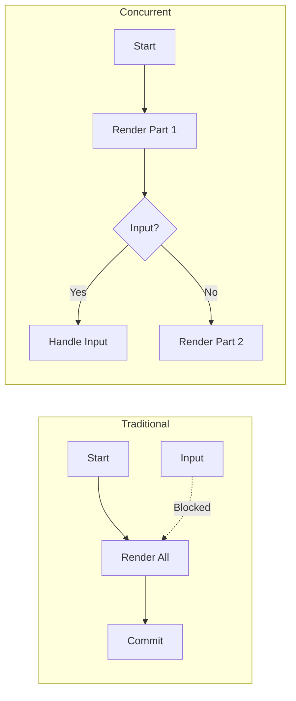
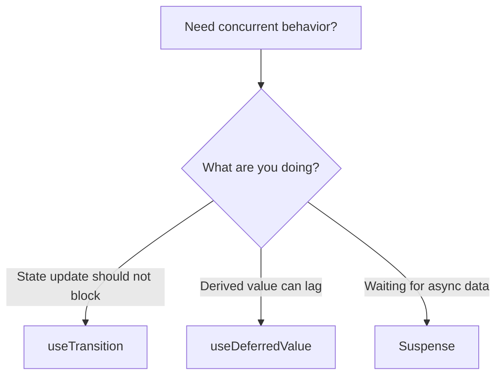

# How to Handle Concurrent Mode in React

Author: [nawazdhandala](https://www.github.com/nawazdhandala)

Tags: React, Concurrent Mode, useTransition, useDeferredValue, Suspense, Performance, TypeScript

Description: Learn how to leverage React concurrent features like useTransition and useDeferredValue to build responsive applications that stay interactive during heavy updates.

---

React concurrent features allow multiple UI updates simultaneously without blocking user interactions.

## What Is Concurrent Rendering?



## useTransition: Non-Urgent Updates

```typescript
import { useState, useTransition } from 'react';

function SearchWithTransition() {
  const [query, setQuery] = useState('');
  const [results, setResults] = useState([]);
  const [isPending, startTransition] = useTransition();

  const handleSearch = (e) => {
    const value = e.target.value;

    // Urgent: update input immediately
    setQuery(value);

    // Non-urgent: results can wait
    startTransition(() => {
      setResults(performExpensiveSearch(value));
    });
  };

  return (
    <div>
      <input value={query} onChange={handleSearch} />
      {isPending && <span>Searching...</span>}
      <ul>
        {results.map((r) => <li key={r.id}>{r.title}</li>)}
      </ul>
    </div>
  );
}
```

## useDeferredValue: Deferred Computations

```typescript
import { useState, useDeferredValue, useMemo } from 'react';

function FilterableList() {
  const [filter, setFilter] = useState('');
  const deferredFilter = useDeferredValue(filter);
  const isStale = filter !== deferredFilter;

  const items = useMemo(() => {
    return allItems.filter((item) =>
      item.name.includes(deferredFilter)
    );
  }, [deferredFilter]);

  return (
    <div>
      <input value={filter} onChange={(e) => setFilter(e.target.value)} />
      <div style={{ opacity: isStale ? 0.5 : 1 }}>
        {items.map((item) => <div key={item.id}>{item.name}</div>)}
      </div>
    </div>
  );
}
```

## When to Use Each Feature



## Summary

| Feature | Use Case | Behavior |
|---------|----------|----------|
| useTransition | State updates that can wait | Shows pending state |
| useDeferredValue | Expensive computations | Returns stale value temporarily |
| Suspense | Async operations | Shows fallback |

The key is identifying urgent updates (user input) vs deferrable updates (search results).
