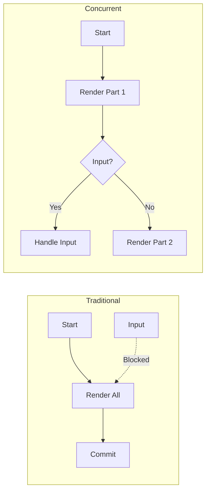
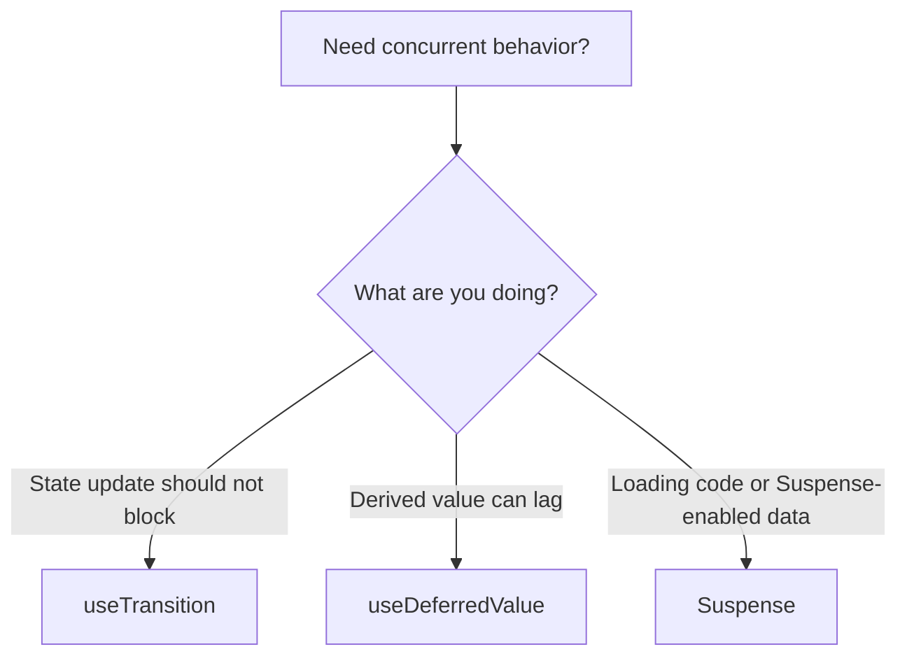

# How to Handle Concurrent Mode in React

Author: [nawazdhandala](https://www.github.com/nawazdhandala)

Tags: React, Concurrent Mode, UseTransition, UseDeferredValue, Suspense, Performance, TypeScript

Description: Learn how to leverage React concurrent features like useTransition and useDeferredValue to build responsive applications that stay interactive during heavy updates.

---

React concurrent features let React prioritize urgent updates and interrupt non-urgent rendering work so user interactions can stay responsive.

## What Is Concurrent Rendering?


```mermaid
flowchart LR
    subgraph Traditional
        T1[Start] --> T2[Render All] --> T3[Commit]
        T4[Input] -.->|Blocked| T2
    end

    subgraph Concurrent
        C1[Start] --> C2[Render Part 1]
        C2 --> C3{Input?}
        C3 -->|Yes| C4[Handle Input]
        C3 -->|No| C5[Render Part 2]
    end
```

## useTransition: Non-Urgent Updates

```tsx
import { useMemo, useState, useTransition } from 'react';
import type { ChangeEvent } from 'react';

type Result = {
  id: string;
  title: string;
};

declare function performExpensiveSearch(query: string): Result[];

function SearchWithTransition() {
  const [query, setQuery] = useState('');
  const [searchQuery, setSearchQuery] = useState('');
  const [isPending, startTransition] = useTransition();

  const results = useMemo(() => {
    return performExpensiveSearch(searchQuery);
  }, [searchQuery]);

  const handleSearch = (e: ChangeEvent<HTMLInputElement>) => {
    const value = e.target.value;

    // Urgent: update input immediately
    setQuery(value);

    // Non-urgent: rendering updated results can wait
    startTransition(() => {
      setSearchQuery(value);
    });
  };

  return (
    <div>
      <input value={query} onChange={handleSearch} />
      {isPending && <span>Searching...</span>}
      <ul>
        {results.map((r) => <li key={r.id}>{r.title}</li>)}
      </ul>
    </div>
  );
}
```

## useDeferredValue: Deferred Computations

```tsx
import { useState, useDeferredValue, useMemo } from 'react';
import type { ChangeEvent } from 'react';

type Item = {
  id: string;
  name: string;
};

declare const allItems: Item[];

function FilterableList() {
  const [filter, setFilter] = useState('');
  const deferredFilter = useDeferredValue(filter);
  const isStale = filter !== deferredFilter;

  const items = useMemo(() => {
    return allItems.filter((item) =>
      item.name.includes(deferredFilter)
    );
  }, [deferredFilter]);

  return (
    <div>
      <input
        value={filter}
        onChange={(e: ChangeEvent<HTMLInputElement>) => setFilter(e.target.value)}
      />
      <div style={{ opacity: isStale ? 0.5 : 1 }}>
        {items.map((item) => <div key={item.id}>{item.name}</div>)}
      </div>
    </div>
  );
}
```

## When to Use Each Feature


```mermaid
flowchart TD
    A[Need concurrent behavior?] --> B{What are you doing?}
    B -->|State update should not block| C[useTransition]
    B -->|Derived value can lag| D[useDeferredValue]
    B -->|Loading code or Suspense-enabled data| E[Suspense]
```

## Summary

| Feature | Use Case | Behavior |
|---------|----------|----------|
| useTransition | State updates that can wait | Shows pending state |
| useDeferredValue | Expensive computations | Returns stale value temporarily |
| Suspense | Loading code or Suspense-enabled data | Shows fallback while children load |

The key is identifying urgent updates (user input) vs deferrable updates (search results).
